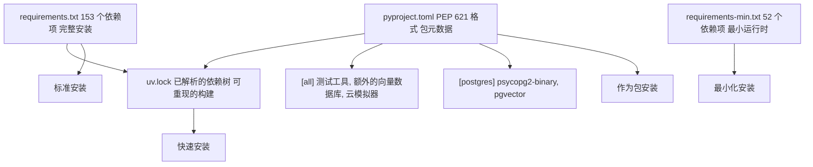
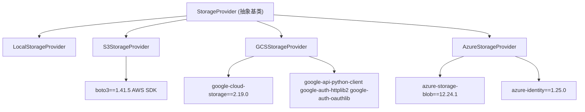

# 依赖管理 (Dependency Management)

相关源文件

-   [.github/workflows/integration-test.disabled](https://github.com/open-webui/open-webui/blob/a7271532/.github/workflows/integration-test.disabled)
-   [CHANGELOG.md](https://github.com/open-webui/open-webui/blob/a7271532/CHANGELOG.md)
-   [backend/open\_webui/storage/provider.py](https://github.com/open-webui/open-webui/blob/a7271532/backend/open_webui/storage/provider.py)
-   [backend/open\_webui/test/apps/webui/storage/test\_provider.py](https://github.com/open-webui/open-webui/blob/a7271532/backend/open_webui/test/apps/webui/storage/test_provider.py)
-   [backend/requirements-min.txt](https://github.com/open-webui/open-webui/blob/a7271532/backend/requirements-min.txt)
-   [backend/requirements.txt](https://github.com/open-webui/open-webui/blob/a7271532/backend/requirements.txt)
-   [docker-compose.playwright.yaml](https://github.com/open-webui/open-webui/blob/a7271532/docker-compose.playwright.yaml)
-   [package-lock.json](https://github.com/open-webui/open-webui/blob/a7271532/package-lock.json)
-   [package.json](https://github.com/open-webui/open-webui/blob/a7271532/package.json)
-   [pyproject.toml](https://github.com/open-webui/open-webui/blob/a7271532/pyproject.toml)
-   [src/app.css](https://github.com/open-webui/open-webui/blob/a7271532/src/app.css)
-   [src/lib/components/ChangelogModal.svelte](https://github.com/open-webui/open-webui/blob/a7271532/src/lib/components/ChangelogModal.svelte)
-   [src/lib/components/common/RichTextInput.svelte](https://github.com/open-webui/open-webui/blob/a7271532/src/lib/components/common/RichTextInput.svelte)
-   [src/lib/components/icons/XMark.svelte](https://github.com/open-webui/open-webui/blob/a7271532/src/lib/components/icons/XMark.svelte)
-   [uv.lock](https://github.com/open-webui/open-webui/blob/a7271532/uv.lock)

本文档描述了 Open WebUI 的 Python 依赖管理系统，包括依赖的组织方式、按子系统进行的分类、版本锁定策略以及安装方法。此内容仅涵盖后端 Python 依赖。有关前端依赖项的信息，请参阅前端构建系统文档。

**相关页面：**

-   有关使用这些依赖项的环境配置，请参阅 [环境配置](/open-webui/open-webui/9.3-collaborative-editing)
-   有关使用数据库相关依赖项的数据库设置，请参阅 [数据库配置](/open-webui/open-webui/17.3-optional-dependencies)
-   有关依赖于云 SDK 的存储提供程序实现，请参阅 [存储提供程序系统](/open-webui/open-webui/12.1-storage-provider-architecture)
-   有关开发环境设置，请参阅 [开发环境](/open-webui/open-webui/18.1-development-environment-setup)

**来源：** [backend/requirements.txt](https://github.com/open-webui/open-webui/blob/a7271532/backend/requirements.txt) [pyproject.toml](https://github.com/open-webui/open-webui/blob/a7271532/pyproject.toml) [backend/requirements-min.txt](https://github.com/open-webui/open-webui/blob/a7271532/backend/requirements-min.txt)

## 依赖组织

Open WebUI 使用多个文件来组织和管理 Python 依赖项，以支持不同的安装方法和用例。

### 依赖文件


**来源：** [backend/requirements.txt1-153](https://github.com/open-webui/open-webui/blob/a7271532/backend/requirements.txt#L1-L153) [pyproject.toml1-206](https://github.com/open-webui/open-webui/blob/a7271532/pyproject.toml#L1-L206) [backend/requirements-min.txt1-52](https://github.com/open-webui/open-webui/blob/a7271532/backend/requirements-min.txt#L1-L52) [uv.lock1-20](https://github.com/open-webui/open-webui/blob/a7271532/uv.lock#L1-L20)

### 文件用途

| 文件 | 用途 | 用例 |
| --- | --- | --- |
| `requirements.txt` | 带有确切版本的完整依赖列表 | 生产部署，Docker 镜像 |
| `pyproject.toml` | Python 包元数据和依赖项 | 软件包安装，开发 |
| `requirements-min.txt` | 实现基本功能的最小依赖项 | 轻量级部署，测试 |
| `uv.lock` | 带有哈希值的已解析依赖树 | 使用 `uv` 包管理器实现可重现的构建 |

**来源：** [backend/requirements.txt1](https://github.com/open-webui/open-webui/blob/a7271532/backend/requirements.txt#L1-L1) [pyproject.toml1-10](https://github.com/open-webui/open-webui/blob/a7271532/pyproject.toml#L1-L10) [backend/requirements-min.txt1-4](https://github.com/open-webui/open-webui/blob/a7271532/backend/requirements-min.txt#L1-L4)

## 按子系统划分的核心依赖项

下图将主要的依赖项映射到应用程序中的功能子系统。


**来源：** [backend/requirements.txt1-96](https://github.com/open-webui/open-webui/blob/a7271532/backend/requirements.txt#L1-L96) [pyproject.toml9-117](https://github.com/open-webui/open-webui/blob/a7271532/pyproject.toml#L9-L117)

### Web 框架与 API 层

核心 Web 框架技术栈支持 FastAPI 应用程序：

-   **fastapi==0.123.0**：用于 REST API 和 WebSocket 端点的主 Web 框架
-   **uvicorn\[standard\]==0.37.0**：具有性能优化的 ASGI 服务器（包含 `websockets`, `httptools`）
-   **pydantic==2.12.5**：数据验证和序列化
-   **python-multipart==0.0.20**：文件上传处理
-   **starlette-compress==1.6.1**：HTTP 响应压缩中间件

**来源：** [backend/requirements.txt1-5](https://github.com/open-webui/open-webui/blob/a7271532/backend/requirements.txt#L1-L5) [pyproject.toml9-13](https://github.com/open-webui/open-webui/blob/a7271532/pyproject.toml#L9-L13)

### 身份验证与安全

支持多种方法的多层身份验证系统：

-   **python-jose==3.5.0**：JWT 令牌创建和验证
-   **cryptography**：底层加密基元（间接依赖，云提供商也会使用）
-   **bcrypt==5.0.0**：使用 bcrypt 算法进行密码哈希
-   **argon2-cffi==25.1.0**：Argon2 密码哈希（更安全的替代方案）
-   **PyJWT\[crypto\]==2.10.1**：带有加密签名的 JWT 编码/解码
-   **authlib==1.6.5**：OAuth 2.0 和 OpenID Connect 客户端/服务器

**来源：** [backend/requirements.txt7-13](https://github.com/open-webui/open-webui/blob/a7271532/backend/requirements.txt#L7-L13) [pyproject.toml15-21](https://github.com/open-webui/open-webui/blob/a7271532/pyproject.toml#L15-L21)

### 数据库管理

带有迁移支持的双 ORM 策略：

-   **sqlalchemy==2.0.38**：主要 ORM，用于复杂查询和 PostgreSQL 支持
-   **alembic==1.17.2**：SQLAlchemy 的数据库迁移工具
-   **peewee==3.18.3**：轻量级 ORM，用于 SQLite 操作和旧版代码
-   **peewee-migrate==1.14.3**：Peewee 的迁移工具

**来源：** [backend/requirements.txt24-27](https://github.com/open-webui/open-webui/blob/a7271532/backend/requirements.txt#L24-L27) [pyproject.toml32-35](https://github.com/open-webui/open-webui/blob/a7271532/pyproject.toml#L32-L35)

### 实时通信

WebSocket 与协作编辑基础设施：

-   **python-socketio==5.15.0**：用于 WebSocket 通信的 Socket.IO 服务器
-   **redis**：内存数据存储，用于会话管理和发布/订阅
-   **pycrdt==0.12.25**：CRDT（无冲突复制数据类型）实现，用于 Yjs 文档协作
-   **starsessions\[redis\]==2.2.1**：带有 Redis 后端的会话中间件

**来源：** [backend/requirements.txt7-30](https://github.com/open-webui/open-webui/blob/a7271532/backend/requirements.txt#L7-L30) [pyproject.toml15-38](https://github.com/open-webui/open-webui/blob/a7271532/pyproject.toml#L15-L38)

### HTTP 客户端层

针对不同用例的多种 HTTP 客户端：

-   **requests==2.32.5**：同步 HTTP 客户端，用于简单请求
-   **aiohttp==3.12.15**：异步 HTTP 客户端，用于并发请求
-   **httpx\[socks,http2,zstd,cli,brotli\]==0.28.1**：具有高级功能的现代异步/同步 HTTP 客户端：
    -   `socks`: SOCKS 代理支持
    -   `http2`: HTTP/2 协议支持
    -   `zstd`: Zstandard 压缩
    -   `cli`: 命令行界面
    -   `brotli`: Brotli 压缩

其它支持包：

-   **async-timeout**：asyncio 的超时上下文管理器
-   **aiocache**：异步缓存框架
-   **aiofiles**：异步文件 I/O 操作

**来源：** [backend/requirements.txt15-22](https://github.com/open-webui/open-webui/blob/a7271532/backend/requirements.txt#L15-L22) [pyproject.toml23-30](https://github.com/open-webui/open-webui/blob/a7271532/pyproject.toml#L23-L30)

### AI 与 LLM 集成

多供应商 LLM 支持：

-   **openai**：OpenAI API 客户端（GPT-4, GPT-3.5, 嵌入）
-   **anthropic**：Anthropic API 客户端（Claude 模型）
-   **google-genai==1.52.0**：Google Generative AI API
-   **google-generativeai==0.8.5**：Google Gemini 模型
-   **tiktoken**：OpenAI 的分词器，用于令牌 (token) 计数
-   **mcp==1.22.0**：用于工具集成的模型上下文协议 (Model Context Protocol)

**来源：** [backend/requirements.txt39-45](https://github.com/open-webui/open-webui/blob/a7271532/backend/requirements.txt#L39-L45) [pyproject.toml46-52](https://github.com/open-webui/open-webui/blob/a7271532/pyproject.toml#L46-L52)

### RAG 与嵌入

检索增强生成 (RAG) 流水线：

-   **langchain==0.3.27**：LLM 应用链框架
-   **langchain-community==0.3.29**：社区贡献的集成插件
-   **transformers==4.57.3**：Hugging Face transformer 模型
-   **sentence-transformers==5.1.2**：句子和文档嵌入
-   **accelerate**：大型 transformer 的模型加速
-   **chromadb==1.1.0**：默认向量数据库
-   **tiktoken**：用于上下文管理的令牌计数
-   **fake-useragent==2.2.0**：用于网页抓取的用户代理伪装

**来源：** [backend/requirements.txt39-57](https://github.com/open-webui/open-webui/blob/a7271532/backend/requirements.txt#L39-L57) [pyproject.toml46-67](https://github.com/open-webui/open-webui/blob/a7271532/pyproject.toml#L46-L67)

### 文档处理

多格式文档摄取：

```mermaid
flowchart TD
    ftfy["ftfy==6.3.1"]
    chardet["chardet==5.2.0"]
    nltk["nltk==3.9.1"]
    pypdf["pypdf==6.4.0"]
    docx2txt["docx2txt==0.8"]
    pythonPptx["python-pptx==1.0.2"]
    unstructured["unstructured==0.18.21"]
    msoffcrypto["msoffcrypto-tool==5.4.2"]
    pandas["pandas==2.2.3"]
    openpyxl["openpyxl==3.1.5"]
    pyxlsb["pyxlsb==1.0.10"]
    xlrd["xlrd==2.0.1"]
    pypandoc["pypandoc==1.16.2"]
    markdown["Markdown==3.10"]
    pymdown["pymdown-extensions==10.17.2"]
    TextDocs["多种格式"]
    DataFiles["Excel/CSV"]

    pypdf --> TextDocs
    docx2txt --> TextDocs
    pythonPptx --> TextDocs
    unstructured --> TextDocs
    pandas --> DataFiles
    openpyxl --> DataFiles
    pyxlsb --> DataFiles
    xlrd --> DataFiles
    pypandoc --> Conversion["格式转换"]
    markdown --> Conversion
```


**来源：** [backend/requirements.txt61-85](https://github.com/open-webui/open-webui/blob/a7271532/backend/requirements.txt#L61-L85) [pyproject.toml69-95](https://github.com/open-webui/open-webui/blob/a7271532/pyproject.toml#L69-L95)

关键包：

-   **pypdf==6.4.0**：PDF 文本提取
-   **docx2txt==0.8**：Microsoft Word 文档解析
-   **python-pptx==1.0.2**：PowerPoint 文件处理
-   **unstructured==0.18.21**：通用文档加载器（支持多种格式）
-   **pandas==2.2.3**：结构化数据处理（CSV, Excel）
-   **pypandoc==1.16.2**：通过 Pandoc 进行文档格式转换
-   **nltk==3.9.1**：自然语言处理工具

### 调度与后台任务

-   **APScheduler==3.10.4**：类似于 cron 的作业调度，用于定期任务
-   **RestrictedPython==8.0**：沙盒化的 Python 执行，用于用户提供的代码

**来源：** [backend/requirements.txt32-33](https://github.com/open-webui/open-webui/blob/a7271532/backend/requirements.txt#L32-L33) [pyproject.toml40-41](https://github.com/open-webui/open-webui/blob/a7271532/pyproject.toml#L40-L41)

### 日志

-   **loguru==0.7.3**：增强型日志记录，具有彩色输出和结构化日志功能

**来源：** [backend/requirements.txt35](https://github.com/open-webui/open-webui/blob/a7271532/backend/requirements.txt#L35-L35) [pyproject.toml43](https://github.com/open-webui/open-webui/blob/a7271532/pyproject.toml#L43-L43)

## 可选依赖项 (Optional Dependencies)

可选依赖项被组织成组，可以根据部署需求单独安装。

### PostgreSQL 支持

`postgres` 可选依赖组添加了特定于 PostgreSQL 的驱动程序：

```toml
[project.optional-dependencies]
postgres = [
    "psycopg2-binary==2.9.10",
    "pgvector==0.4.1",
]
```
-   **psycopg2-binary==2.9.10**：用于 Python 的 PostgreSQL 适配器（二进制分发，易于安装）
-   **pgvector==0.4.1**：支持向量相似度搜索的 PostgreSQL 扩展

**安装：**

```bash
pip install .[postgres]
# 或者
pip install -r requirements.txt  # 主文件中也包含这些
```
**来源：** [pyproject.toml131-135](https://github.com/open-webui/open-webui/blob/a7271532/pyproject.toml#L131-L135) [backend/requirements.txt112-113](https://github.com/open-webui/open-webui/blob/a7271532/backend/requirements.txt#L112-L113)

### 完整特性集

`all` 可选依赖组包含了开发、测试和额外的生产特性：

```toml
[project.optional-dependencies]
all = [
    # 数据库驱动
    "pymongo",
    "psycopg2-binary==2.9.9",
    "pgvector==0.4.0",

    # 测试基础设施
    "moto[s3]>=5.0.26",
    "gcp-storage-emulator>=2024.8.3",
    "docker~=7.1.0",
    "pytest~=8.3.2",
    "pytest-docker~=3.2.5",

    # 浏览器自动化
    "playwright==1.56.0",

    # 额外的向量数据库
    "elasticsearch==9.1.0",
    "qdrant-client==1.14.3",
    "weaviate-client==4.17.0",
    "pymilvus==2.6.4",
    "pinecone==6.0.2",
    "oracledb==3.2.0",

    # 高级检索
    "colbert-ai==0.2.21",

    # 网页抓取
    "firecrawl-py==4.10.0",

    # 搜索集成
    "azure-search-documents==11.6.0",
]
```
**来源：** [pyproject.toml137-158](https://github.com/open-webui/open-webui/blob/a7271532/pyproject.toml#L137-L158)

该组主要用于：

1.  **开发**：带有云模拟器的完整测试套件
2.  **CI/CD**：针对多种数据库的集成测试
3.  **高级部署**：支持所有受支持的向量数据库和搜索引擎

## 云存储依赖项

云存储提供商支持是模块化的，每个提供商都需要特定的 SDK 包。


**来源：** [backend/open\_webui/storage/provider.py1-377](https://github.com/open-webui/open-webui/blob/a7271532/backend/open_webui/storage/provider.py#L1-L377) [backend/requirements.txt99-114](https://github.com/open-webui/open-webui/blob/a7271532/backend/requirements.txt#L99-L114)

### AWS S3 依赖项

-   **boto3==1.41.5**：用于 Python 的 AWS SDK，提供 S3 客户端
    -   在 [backend/open\_webui/storage/provider.py108-224](https://github.com/open-webui/open-webui/blob/a7271532/backend/open_webui/storage/provider.py#L108-L224) 中使用
    -   未提供凭据时支持工作负载身份 (IAM 角色)
    -   配置包含加速端点 (accelerate endpoint) 和寻址风格选项

### Google Cloud Storage 依赖项

-   **google-cloud-storage==2.19.0**：GCS 客户端库
    -   在 [backend/open\_webui/storage/provider.py226-290](https://github.com/open-webui/open-webui/blob/a7271532/backend/open_webui/storage/provider.py#L226-L290) 中使用
    -   支持服务帐号 JSON 或默认凭据
-   **google-api-python-client**：Google API 客户端（也用于 Google Drive 集成）
-   **google-auth-httplib2**：用于 Google 认证的 HTTP 库
-   **google-auth-oauthlib**：Google 服务的 OAuth2 流程
-   **googleapis-common-protos==1.72.0**：Protocol buffer 定义

**来源：** [backend/requirements.txt102-108](https://github.com/open-webui/open-webui/blob/a7271532/backend/requirements.txt#L102-L108) [backend/open\_webui/storage/provider.py226-290](https://github.com/open-webui/open-webui/blob/a7271532/backend/open_webui/storage/provider.py#L226-L290)

### Azure Blob Storage 依赖项

-   **azure-storage-blob==12.24.1**：Azure Blob Storage 客户端
    -   在 [backend/open\_webui/storage/provider.py292-360](https://github.com/open-webui/open-webui/blob/a7271532/backend/open_webui/storage/provider.py#L292-L360) 中使用
    -   支持显式密钥和 DefaultAzureCredential（托管身份）
-   **azure-identity==1.25.0**：具有多种凭据类型的 Azure 身份验证

**来源：** [backend/requirements.txt98-114](https://github.com/open-webui/open-webui/blob/a7271532/backend/requirements.txt#L98-L114) [backend/open\_webui/storage/provider.py292-360](https://github.com/open-webui/open-webui/blob/a7271532/backend/open_webui/storage/provider.py#L292-L360)

## 向量数据库依赖项

Open WebUI 支持多种用于 RAG 功能的向量数据库。除了 ChromaDB（默认）外，大多数都是可选的。

```mermaid
flowchart TD
    chromadb["chromadb==1.1.0 默认向量数据库"]
    pinecone["pinecone==6.0.2 托管向量数据库"]
    weaviate["weaviate-client==4.17.0 开源/云端"]
    qdrant["qdrant-client==1.14.3 开源/云端"]
    opensearch["opensearch-py==2.8.0 搜索 + 向量"]
    azureSearch["azure-search-documents==11.6.0 Azure AI 搜索"]
    milvus["pymilvus==2.6.4 高性能"]
    oracledb["oracledb==3.2.0 Oracle 23ai 向量"]
    elasticsearch["elasticsearch==9.1.0 搜索 + 向量"]
    colbert["colbert-ai==0.2.21 后期交互重排序"]
    rankbm25["rank-bm25==0.2.2 BM25 关键词搜索"]
    RAGPipeline["RAG 流水线"]
    Reranking["结果重排序"]
    HybridSearch["混合搜索"]

    chromadb --> RAGPipeline
    pinecone --> RAGPipeline
    weaviate --> RAGPipeline
    qdrant --> RAGPipeline
    opensearch --> RAGPipeline
    azureSearch --> RAGPipeline
    milvus --> RAGPipeline
    oracledb --> RAGPipeline
    elasticsearch --> RAGPipeline
    colbert --> Reranking
    rankbm25 --> HybridSearch
```


**来源：** [backend/requirements.txt51-127](https://github.com/open-webui/open-webui/blob/a7271532/backend/requirements.txt#L51-L127)

### 核心向量数据库

-   **chromadb==1.1.0**：默认嵌入式向量数据库，始终安装
    -   内存或持久化存储
    -   原生支持嵌入
    -   无需外部服务

**注意**：在 requirements.txt 中版本锁定为 1.1.0，而在 pyproject.toml 中为 1.0.20。requirements.txt 中的版本具有优先权。

**来源：** [backend/requirements.txt51](https://github.com/open-webui/open-webui/blob/a7271532/backend/requirements.txt#L51-L51) [pyproject.toml58](https://github.com/open-webui/open-webui/blob/a7271532/pyproject.toml#L58-L58)

### 可选向量数据库

这些包含在 `all` 可选依赖组或主 requirements.txt 中：

-   **weaviate-client==4.17.0**：Weaviate 云端或自托管
-   **opensearch-py==2.8.0**：支持向量的 OpenSearch
-   **pymilvus==2.6.4**：Milvus 高性能向量数据库
-   **qdrant-client==1.14.3**：Qdrant 向量搜索引擎
-   **pinecone==6.0.2**：Pinecone 托管向量数据库
-   **oracledb==3.2.0**：支持向量的 Oracle Database 23ai
-   **elasticsearch==9.1.0**：支持向量搜索的 Elasticsearch（仅在 `all` 组中）
-   **azure-search-documents==11.6.0**：Azure AI 搜索（仅在 `all` 组中）

**来源：** [backend/requirements.txt52-123](https://github.com/open-webui/open-webui/blob/a7271532/backend/requirements.txt#L52-L123) [pyproject.toml147-157](https://github.com/open-webui/open-webui/blob/a7271532/pyproject.toml#L147-L157)

### 检索增强

-   **rank-bm25==0.2.2**：用于基于关键词的混合搜索的 BM25 算法
-   **colbert-ai==0.2.21**：用于重排序的 ColBERT 后期交互模型

**来源：** [backend/requirements.txt85-127](https://github.com/open-webui/open-webui/blob/a7271532/backend/requirements.txt#L85-L127) [pyproject.toml94-154](https://github.com/open-webui/open-webui/blob/a7271532/pyproject.toml#L94-L154)

## 视觉与 OCR 依赖项

用于文档处理的计算机视觉和光学字符识别 (OCR)：

-   **pillow==11.3.0**：图像处理库 (PIL 分支)
-   **opencv-python-headless==4.11.0.86**：不带 GUI 依赖项的计算机视觉
-   **rapidocr-onnxruntime==1.4.4**：使用 ONNX 运行时的快速 OCR
-   **onnxruntime==1.20.1**：ONNX 模型推理运行时
-   **azure-ai-documentintelligence==1.0.2**：Azure 文档智能 OCR/提取

**来源：** [backend/requirements.txt82-97](https://github.com/open-webui/open-webui/blob/a7271532/backend/requirements.txt#L82-L97) [pyproject.toml89-96](https://github.com/open-webui/open-webui/blob/a7271532/pyproject.toml#L89-L96)

## 媒体处理依赖项

音频和视频处理：

-   **soundfile==0.13.1**：读取/写入音频文件
-   **pydub**：音频操作和转换
-   **faster-whisper==1.1.1**：优化的 Whisper 语音识别
-   **av==14.0.1**：用于音频/视频容器操作的 PyAV
    -   由于 FIPS 自检失败问题而锁定了版本（见 [backend/requirements.txt125](https://github.com/open-webui/open-webui/blob/a7271532/backend/requirements.txt#L125-L125)）
-   **youtube-transcript-api==1.2.2**：YouTube 字幕提取
-   **pytube==15.0.0**：YouTube 视频下载

**来源：** [backend/requirements.txt80-125](https://github.com/open-webui/open-webui/blob/a7271532/backend/requirements.txt#L80-L125) [pyproject.toml88-103](https://github.com/open-webui/open-webui/blob/a7271532/pyproject.toml#L88-L103)

## 网页抓取与搜索依赖项

用于网页内容提取和搜索集成的工具：

-   **playwright==1.56.0**：用于处理复杂 JavaScript 网站的浏览器自动化
    -   版本必须与 docker-compose.playwright.yaml 匹配
-   **firecrawl-py==4.10.0**：用于网页抓取的 Firecrawl API 客户端
-   **ddgs==9.9.2**：DuckDuckGo 搜索 API 客户端

**来源：** [backend/requirements.txt95-139](https://github.com/open-webui/open-webui/blob/a7271532/backend/requirements.txt#L95-L139) [pyproject.toml104-156](https://github.com/open-webui/open-webui/blob/a7271532/pyproject.toml#L104-L156)

## 开发与测试依赖项

测试基础设施和开发工具：

### 测试框架

-   **docker~=7.1.0**：用于集成测试的 Docker Python SDK
-   **pytest~=8.4.1**：测试框架
-   **pytest-docker~=3.2.5**：pytest 固件中的 Docker 容器
-   **pytest-asyncio>=1.0.0**：异步测试支持（位于 dev 组中）

**来源：** [backend/requirements.txt131-133](https://github.com/open-webui/open-webui/blob/a7271532/backend/requirements.txt#L131-L133) [pyproject.toml143-145](https://github.com/open-webui/open-webui/blob/a7271532/pyproject.toml#L143-L145) [pyproject.toml203-205](https://github.com/open-webui/open-webui/blob/a7271532/pyproject.toml#L203-L205)

### 云模拟器 (用于测试)

这些位于 `all` 可选组中，用于测试云集成：

-   **moto\[s3\]>=5.0.26**：AWS 服务模拟 (S3 等)
-   **gcp-storage-emulator>=2024.8.3**：Google Cloud Storage 模拟器

**测试中的用法示例：**

```python
# 使用 moto 进行 S3 测试
from moto import mock_aws

@mock_aws
class TestS3StorageProvider:
    def __init__(self):
        self.Storage = provider.S3StorageProvider()
        self.s3_client = boto3.resource("s3", region_name="us-east-1")
```
**来源：** [pyproject.toml141-142](https://github.com/open-webui/open-webui/blob/a7271532/pyproject.toml#L141-L142) [backend/open\_webui/test/apps/webui/storage/test\_provider.py100-112](https://github.com/open-webui/open-webui/blob/a7271532/backend/open_webui/test/apps/webui/storage/test_provider.py#L100-L112)

### 代码质量

-   **black==25.11.0**：Python 代码格式化工具
-   **validators==0.35.0**：数据验证库

**来源：** [backend/requirements.txt77-90](https://github.com/open-webui/open-webui/blob/a7271532/backend/requirements.txt#L77-L90) [pyproject.toml85-99](https://github.com/open-webui/open-webui/blob/a7271532/pyproject.toml#L85-L99)

## 可观测性依赖项

用于分布式追踪的 OpenTelemetry 插桩：

```text
# 追踪依赖项
opentelemetry-api==1.38.0
opentelemetry-sdk==1.38.0
opentelemetry-exporter-otlp==1.38.0
opentelemetry-instrumentation==0.59b0
opentelemetry-instrumentation-fastapi==0.59b0
opentelemetry-instrumentation-sqlalchemy==0.59b0
opentelemetry-instrumentation-redis==0.59b0
opentelemetry-instrumentation-requests==0.59b0
opentelemetry-instrumentation-logging==0.59b0
opentelemetry-instrumentation-httpx==0.59b0
opentelemetry-instrumentation-aiohttp-client==0.59b0
```
提供以下自动插桩功能：

-   FastAPI 端点
-   SQLAlchemy 数据库查询
-   Redis 操作
-   HTTP 请求 (requests, httpx, aiohttp)
-   应用程序日志

**来源：** [backend/requirements.txt142-152](https://github.com/open-webui/open-webui/blob/a7271532/backend/requirements.txt#L142-L152)

## LDAP 身份验证

-   **ldap3==2.9.1**：纯 Python LDAP 客户端，用于 Active Directory 集成

**来源：** [backend/requirements.txt136](https://github.com/open-webui/open-webui/blob/a7271532/backend/requirements.txt#L136-L136) [pyproject.toml116](https://github.com/open-webui/open-webui/blob/a7271532/pyproject.toml#L116-L116)

## 版本管理策略

Open WebUI 使用针对稳定性和兼容性优化的混合版本锁定策略。

### 精确版本锁定

大多数依赖项使用精确版本锁定 (`==`) 以确保可重现性：

```text
fastapi==0.123.0
uvicorn==0.37.0
pydantic==2.12.5
sqlalchemy==2.0.38
chromadb==1.1.0
```
这确保了部署之间的一致行为，并防止依赖项更新导致的意外损坏。

**来源：** [backend/requirements.txt1-5](https://github.com/open-webui/open-webui/blob/a7271532/backend/requirements.txt#L1-L5)

### 包额外功能 (Package Extras)

一些包使用 extras 来包含可选特性：

```text
uvicorn[standard]==0.37.0          # 包含 websockets, httptools
PyJWT[crypto]==2.10.1              # 包含 cryptography
httpx[socks,http2,zstd,cli,brotli]==0.28.1  # 多个额外功能
```
**来源：** [backend/requirements.txt2-21](https://github.com/open-webui/open-webui/blob/a7271532/backend/requirements.txt#L2-L21)

### 未锁定版本

少数包允许任意版本（未锁定），通常是间接依赖项或非常稳定的包：

```text
cryptography
redis
accelerate
psutil
sentencepiece
pydub
```
这些要么是：

1.  不太可能损坏的稳定 API（如 `redis`）
2.  由其它包的锁定所管理（如 `cryptography` 被 `PyJWT[crypto]` 锁定）
3.  最新版本即可接受的可选特性

**来源：** [backend/requirements.txt9-94](https://github.com/open-webui/open-webui/blob/a7271532/backend/requirements.txt#L9-L94)

### 特殊版本约束

一些包为了兼容性而具有特定的版本约束：

```text
# pyarrow 锁定以适配树莓派 (Raspberry Pi) 兼容性
pyarrow==20.0.0  # 修复：将 pyarrow 版本锁定为 20 以适配 rpi 兼容性 #15897

# av 由于 FIPS 自检失败而被锁定
av==14.0.1  # 注意：由于致命的 FIPS 自检失败而设置

# Playwright 版本必须与 docker-compose 匹配
playwright==1.56.0  # 注意：版本必须与 docker-compose.playwright.yaml 匹配
```
**来源：** [backend/requirements.txt58-125](https://github.com/open-webui/open-webui/blob/a7271532/backend/requirements.txt#L58-L125)

### Python 版本要求

该项目需要 Python 3.11 或 3.12（不包括预发布版本）：

```toml
requires-python = ">= 3.11, < 3.13.0a1"
```
**来源：** [pyproject.toml119](https://github.com/open-webui/open-webui/blob/a7271532/pyproject.toml#L119-L119)

## 安装方法

Open WebUI 支持多种安装方法，以适应不同的工作流程。

### 标准 pip 安装

包含所有依赖项的完整安装：

```bash
cd backend
pip install -r requirements.txt
```
这将安装 `requirements.txt` 中的全部 153 个包，包括向量数据库和云存储 SDK 等可选依赖项。

**来源：** [backend/requirements.txt1-153](https://github.com/open-webui/open-webui/blob/a7271532/backend/requirements.txt#L1-L153) [.github/workflows/integration-test.disabled152-153](https://github.com/open-webui/open-webui/blob/a7271532/.github/workflows/integration-test.disabled#L152-L153)

### 最小化安装

用于实现基本功能的轻量级安装：

```bash
cd backend
pip install -r requirements-min.txt
```
这仅安装实现以下功能所需的 52 个核心包：

-   Web 服务器 (FastAPI, uvicorn)
-   身份验证
-   数据库 (SQLAlchemy, SQLite)
-   Redis 和 WebSocket
-   基础 LLM 集成 (OpenAI)
-   用于 RAG 的 ChromaDB

不包括：

-   额外的向量数据库
-   云存储 SDK
-   高级文档处理
-   测试工具

**来源：** [backend/requirements-min.txt1-52](https://github.com/open-webui/open-webui/blob/a7271532/backend/requirements-min.txt#L1-L52)

### 软件包安装

作为带有可选组的 Python 包安装：

```bash
# 基础安装
pip install .

# 带有 PostgreSQL 支持
pip install .[postgres]

# 带有所有可选依赖项
pip install .[all]
```
**来源：** [pyproject.toml8-158](https://github.com/open-webui/open-webui/blob/a7271532/pyproject.toml#L8-L158)

### UV 包管理器

使用带有锁定文件的 `uv` 进行快速安装：

```bash
# 安装 uv
pip install uv

# 从锁定文件安装依赖项
uv pip install -r requirements.txt

# 或者作为包安装
uv pip install .
```
`uv.lock` 文件包含已解析的依赖版本及其加密哈希值用于验证，确保跨平台的可重现构建。

**来源：** [uv.lock1-20](https://github.com/open-webui/open-webui/blob/a7271532/uv.lock#L1-L20) [.github/workflows/integration-test.disabled141-153](https://github.com/open-webui/open-webui/blob/a7271532/.github/workflows/integration-test.disabled#L141-L153)

### CI/CD 安装

GitHub Actions 工作流示例：

```yaml
- name: Set up uv
  uses: yezz123/setup-uv@v4
  with:
    uv-venv: venv

- name: Activate virtualenv
  run: |
    . venv/bin/activate
    echo PATH=$PATH >> $GITHUB_ENV

- name: Install dependencies
  run: |
    uv pip install -r backend/requirements.txt
```
**来源：** [.github/workflows/integration-test.disabled141-153](https://github.com/open-webui/open-webui/blob/a7271532/.github/workflows/integration-test.disabled#L141-L153)

## 依赖解析与锁定文件

### UV 锁定文件结构

`uv.lock` 文件提供了跨多个 Python 版本和平台的依赖解析：

```toml
version = 1
revision = 2
requires-python = ">=3.11, <3.13.0"
resolution-markers = [
    "python_full_version < '3.12' and sys_platform == 'darwin'",
    "python_full_version < '3.12' and platform_machine == 'aarch64' and sys_platform == 'linux'",
    ...
]
```
每个包条目包含：

-   版本 (Version)
-   源 URL (Source URL)
-   SHA256 哈希值
-   特定平台的轮子 (Platform-specific wheels)
-   依赖项 (Dependencies)

**来源：** [uv.lock1-20](https://github.com/open-webui/open-webui/blob/a7271532/uv.lock#L1-L20)

### 构建系统配置

`pyproject.toml` 使用 Hatchling 定义了构建系统：

```toml
[build-system]
requires = ["hatchling"]
build-backend = "hatchling.build"

[tool.hatch.version]
path = "package.json"
pattern = '"version":\s*"(?P<version>[^"]+)"'
```
版本号从 `package.json` 中读取，以保持与前端包版本的一致性。

**来源：** [pyproject.toml163-177](https://github.com/open-webui/open-webui/blob/a7271532/pyproject.toml#L163-L177)

### 软件包元数据

`pyproject.toml` 中的项目元数据：

```toml
[project]
name = "open-webui"
description = "Open WebUI"
authors = [
    { name = "Timothy Jaeryang Baek", email = "tim@openwebui.com" }
]
license = { file = "LICENSE" }
readme = "README.md"
requires-python = ">= 3.11, < 3.13.0a1"
dynamic = ["version"]
classifiers = [
    "Development Status :: 4 - Beta",
    "License :: Other/Proprietary License",
    "Programming Language :: Python :: 3",
    "Programming Language :: Python :: 3.11",
    "Programming Language :: Python :: 3.12",
    "Topic :: Communications :: Chat",
    "Topic :: Multimedia",
]
```
**来源：** [pyproject.toml1-129](https://github.com/open-webui/open-webui/blob/a7271532/pyproject.toml#L1-L129)

## 依赖测试策略

测试套件会验证对可选依赖项的处理是否正确：

### 存储提供者测试

测试文件展示了如何为不同的提供商模拟 (mock) 依赖项：

```python
# 使用 moto 的 S3 测试
from moto import mock_aws
@mock_aws
class TestS3StorageProvider:
    # 在没有真实 AWS 凭据的情况下测试 S3

# 使用模拟器的 GCS 测试
from gcp_storage_emulator.server import create_server
class TestGCSStorageProvider:
    # 使用本地模拟器测试 GCS

# 使用 mock 的 Azure 测试
from unittest.mock import MagicMock
class TestAzureStorageProvider:
    # 使用模拟客户端测试 Azure
```
**来源：** [backend/open\_webui/test/apps/webui/storage/test\_provider.py1-436](https://github.com/open-webui/open-webui/blob/a7271532/backend/open_webui/test/apps/webui/storage/test_provider.py#L1-L436)

### 集成测试工作流

CI 工作流在不同数据库后端上测试依赖项安装：

1.  **SQLite**（默认）：测试基础安装。
2.  **PostgreSQL**：使用 `DATABASE_URL` 环境变量进行测试。
3.  服务器健康检查验证依赖项是否成功加载。

**来源：** [.github/workflows/integration-test.disabled105-229](https://github.com/open-webui/open-webui/blob/a7271532/.github/workflows/integration-test.disabled#L105-L229)

---

该依赖管理系统为不同的部署场景提供了灵活性，同时通过版本锁定和锁定文件保持了可重现性。模块化的可选依赖项允许在资源受限的环境中进行最小化安装，同时支持启用了所有集成的全功能部署。