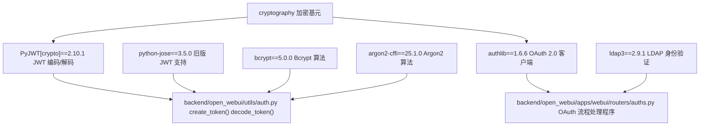
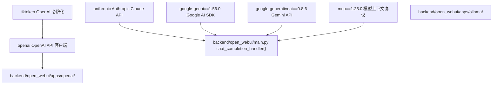
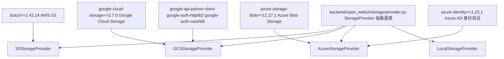
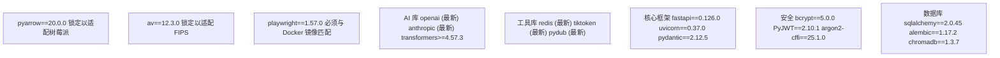

# 后端依赖 (Backend Dependencies)

相关源文件

-   [.github/workflows/integration-test.disabled](https://github.com/open-webui/open-webui/blob/a7271532/.github/workflows/integration-test.disabled)
-   [backend/open\_webui/storage/provider.py](https://github.com/open-webui/open-webui/blob/a7271532/backend/open_webui/storage/provider.py)
-   [backend/open\_webui/test/apps/webui/storage/test\_provider.py](https://github.com/open-webui/open-webui/blob/a7271532/backend/open_webui/test/apps/webui/storage/test_provider.py)
-   [backend/requirements-min.txt](https://github.com/open-webui/open-webui/blob/a7271532/backend/requirements-min.txt)
-   [backend/requirements.txt](https://github.com/open-webui/open-webui/blob/a7271532/backend/requirements.txt)
-   [docker-compose.playwright.yaml](https://github.com/open-webui/open-webui/blob/a7271532/docker-compose.playwright.yaml)
-   [pyproject.toml](https://github.com/open-webui/open-webui/blob/a7271532/pyproject.toml)
-   [uv.lock](https://github.com/open-webui/open-webui/blob/a7271532/uv.lock)

## 目的与范围

本文档涵盖了 Open WebUI 后端所需的所有 Python 依赖项，按功能类别进行组织。它解释了每个主要依赖项的作用、依赖项在各配置文件中的组织方式，以及哪些依赖项是可选的或必须的。有关前端 JavaScript/TypeScript 依赖项，请参阅 [前端依赖](/open-webui/open-webui/17.2-frontend-dependencies)。有关控制激活哪些依赖项的环境配置，请参阅 [环境配置](/open-webui/open-webui/3.3-environment-configuration)。

## 依赖管理结构

Open WebUI 使用三个主要文件来管理后端依赖：

**配置文件：**

-   `backend/requirements.txt` - 完整的生产环境依赖 ([backend/requirements.txt1-156](https://github.com/open-webui/open-webui/blob/a7271532/backend/requirements.txt#L1-L156))
-   `pyproject.toml` - 项目元数据及可通过 pip 安装的包定义 ([pyproject.toml1-210](https://github.com/open-webui/open-webui/blob/a7271532/pyproject.toml#L1-L210))
-   `backend/requirements-min.txt` - 用于基本功能的最小子集 ([backend/requirements-min.txt1-52](https://github.com/open-webui/open-webui/blob/a7271532/backend/requirements-min.txt#L1-L52))
-   `uv.lock` - 锁定文件，包含确切的解析版本，用于可重现的构建 ([uv.lock1-16](https://github.com/open-webui/open-webui/blob/a7271532/uv.lock#L1-L16))

**依赖声明模式：**

```toml
# pyproject.toml 定义了核心依赖
[project]
dependencies = [
    "fastapi==0.126.0",
    "uvicorn[standard]==0.37.0",
    ...
]

# 针对特定特性的可选依赖
[project.optional-dependencies]
postgres = [
    "psycopg2-binary==2.9.11",
    "pgvector==0.4.2",
]
```
**来源：** [pyproject.toml8-162](https://github.com/open-webui/open-webui/blob/a7271532/pyproject.toml#L8-L162) [backend/requirements.txt1-156](https://github.com/open-webui/open-webui/blob/a7271532/backend/requirements.txt#L1-L156) [backend/requirements-min.txt1-52](https://github.com/open-webui/open-webui/blob/a7271532/backend/requirements-min.txt#L1-L52)

## 依赖分类概览


**来源：** [backend/requirements.txt1-156](https://github.com/open-webui/open-webui/blob/a7271532/backend/requirements.txt#L1-L156) [pyproject.toml8-120](https://github.com/open-webui/open-webui/blob/a7271532/pyproject.toml#L8-L120)

## 核心 Web 框架依赖项

### HTTP 框架栈

| 包名 | 版本 | 用途 | 是否必需 |
| --- | --- | --- | --- |
| `fastapi` | 0.126.0 | 具有 OpenAPI 支持的现代异步 Web 框架 | 是 |
| `uvicorn[standard]` | 0.37.0 | 支持 WebSocket 和文件监控的 ASGI 服务器 | 是 |
| `pydantic` | 2.12.5 | 数据验证和设置管理 | 是 |
| `python-multipart` | 0.0.21 | 用于文件上传的多部分表单数据解析 | 是 |
| `starlette-compress` | 1.6.1 | Gzip/Brotli 响应压缩中间件 | 是 |
| `itsdangerous` | 2.2.0 | 加密签名的会话数据 | 是 |

**代码中的用法：** FastAPI 应用程序在 [backend/open\_webui/main.py](https://github.com/open-webui/open-webui/blob/a7271532/backend/open_webui/main.py) 中初始化，该文件注册了所有中间件和路由器。Pydantic 模型贯穿始终，用于请求/响应验证，例如在 [backend/open\_webui/apps/webui/models/](https://github.com/open-webui/open-webui/blob/a7271532/backend/open_webui/apps/webui/models/) 中用于数据库模型。

**来源：** [backend/requirements.txt1-5](https://github.com/open-webui/open-webui/blob/a7271532/backend/requirements.txt#L1-L5) [pyproject.toml9-13](https://github.com/open-webui/open-webui/blob/a7271532/pyproject.toml#L9-L13)

### HTTP 客户端库

| 包名 | 版本 | 用途 |
| --- | --- | --- |
| `requests` | 2.32.5 | 用于外部 API 的同步 HTTP 客户端 |
| `aiohttp` | 3.13.2 | 用于并发请求的异步 HTTP 客户端 |
| `httpx[socks,http2,zstd,cli,brotli]` | 0.28.1 | 支持 HTTP/2、SOCKS 代理的现代 HTTP 客户端 |
| `async-timeout` | 最新 | 用于异步操作的超时上下文管理器 |

**httpx 的额外特性 (Extras)：**

-   `socks`: 用于网页抓取的 SOCKS 代理支持。
-   `http2`: HTTP/2 协议支持。
-   `zstd`: Zstandard 压缩。
-   `brotli`: Brotli 压缩。

**来源：** [backend/requirements.txt15-24](https://github.com/open-webui/open-webui/blob/a7271532/backend/requirements.txt#L15-L24) [pyproject.toml23-30](https://github.com/open-webui/open-webui/blob/a7271532/pyproject.toml#L23-L30)

### 实时通信

| 包名 | 版本 | 用途 |
| --- | --- | --- |
| `python-socketio` | 5.15.1 | WebSockets 的 Socket.IO 服务器实现 |
| `starsessions[redis]` | 2.2.1 | 带有 Redis 后端支持的会话中间件 |
| `pycrdt` | 0.12.44 | 用于 Yjs 文档协作的 CRDT 数据结构 |
| `redis` | 最新 | 用于缓存和发布/订阅的 Redis 客户端 |

**集成：** WebSocket 事件在 [backend/open\_webui/socket/](https://github.com/open-webui/open-webui/blob/a7271532/backend/open_webui/socket/) 目录下处理。`pycrdt` 库实现了富文本编辑器中的协作编辑功能（参见 [协作编辑](/open-webui/open-webui/9.3-collaborative-editing)）。

**来源：** [backend/requirements.txt7-32](https://github.com/open-webui/open-webui/blob/a7271532/backend/requirements.txt#L7-L32) [pyproject.toml15-39](https://github.com/open-webui/open-webui/blob/a7271532/pyproject.toml#L15-L39)

## 身份验证与安全依赖项


**来源：** [backend/requirements.txt8-13](https://github.com/open-webui/open-webui/blob/a7271532/backend/requirements.txt#L8-L13) [pyproject.toml16-21](https://github.com/open-webui/open-webui/blob/a7271532/pyproject.toml#L16-L21)

### 安全包的作用

**JWT 令牌库：**

-   `PyJWT[crypto]` (2.10.1): 主要的 JWT 实现，支持加密签名。`[crypto]` 额外功能包含了用于 RSA/ECDSA 算法的 cryptography 库。
-   `python-jose` (3.5.0): 维护用于向后兼容的备选 JWT 库。
-   `cryptography`: 核心加密操作，包括用于 OAuth 客户端密钥的 Fernet 加密。

**密码哈希：**

-   `bcrypt` (5.0.0): 主要的密码哈希算法，出于安全考虑具有 CPU 密集型特征。
-   `argon2-cffi` (25.1.0): 现代的内存困难型 (memory-hard) 哈希算法，推荐用于新安装。

**身份验证协议：**

-   `authlib` (1.6.6): OAuth 2.0 和 OpenID Connect 客户端实现。支持动态客户端注册和令牌刷新流程（参见 [OAuth 集成](/open-webui/open-webui/10.2-oauth-integration)）。
-   `ldap3` (2.9.1): 用于 Active Directory 集成的 LDAP v3 协议客户端（参见 [LDAP 集成](/open-webui/open-webui/10.3-ldap-integration)）。

**来源：** [backend/requirements.txt8-13](https://github.com/open-webui/open-webui/blob/a7271532/backend/requirements.txt#L8-L13) [backend/requirements.txt139](https://github.com/open-webui/open-webui/blob/a7271532/backend/requirements.txt#L139-L139) [pyproject.toml16-21](https://github.com/open-webui/open-webui/blob/a7271532/pyproject.toml#L16-L21)

## 数据库与 ORM 依赖项

### 主要数据库栈

| 包名 | 版本 | 用途 | 数据库支持 |
| --- | --- | --- | --- |
| `sqlalchemy` | 2.0.45 | 具有异步支持的现代 ORM | PostgreSQL, MySQL, SQLite |
| `alembic` | 1.17.2 | 数据库迁移管理 | 所有 SQLAlchemy 支持的数据库 |
| `peewee` | 3.18.3 | 旧版轻量级 ORM | SQLite (迁移路径) |
| `peewee-migrate` | 1.14.3 | Peewee 的迁移工具 | SQLite |

**迁移策略：** Open WebUI 正在从 Peewee 迁移到 SQLAlchemy。两者都被包含在内以支持现有安装的迁移。新特性将排他性地使用 SQLAlchemy。

**来源：** [backend/requirements.txt25-28](https://github.com/open-webui/open-webui/blob/a7271532/backend/requirements.txt#L25-L28) [pyproject.toml33-36](https://github.com/open-webui/open-webui/blob/a7271532/pyproject.toml#L33-L36)

### 数据库驱动依赖项

**PostgreSQL 支持：**

```toml
# PostgreSQL 的可选依赖
[project.optional-dependencies]
postgres = [
    "psycopg2-binary==2.9.11",  # PostgreSQL 驱动
    "pgvector==0.4.2",          # 向量扩展支持
]
```
**MySQL 支持：**

-   `PyMySQL` (1.1.2): 纯 Python 的 MySQL 客户端 ([backend/requirements.txt118](https://github.com/open-webui/open-webui/blob/a7271532/backend/requirements.txt#L118-L118))

**向量数据库扩展：**

-   `pgvector` (0.4.2): 用于向量相似度搜索的 PostgreSQL 扩展。支持将 PostgreSQL 用作 RAG 的向量数据库（参见 [向量数据库集成](/open-webui/open-webui/7.5-vector-database-integration)）。

**来源：** [pyproject.toml135-138](https://github.com/open-webui/open-webui/blob/a7271532/pyproject.toml#L135-L138) [backend/requirements.txt115-118](https://github.com/open-webui/open-webui/blob/a7271532/backend/requirements.txt#L115-L118)

### 缓存与会话存储

| 包名 | 用途 |
| --- | --- |
| `redis` | 用于会话存储、速率限制和分布式缓存的 Redis 客户端 |
| `aiocache` | 具有 Redis 后端支持的异步缓存库 |

**Redis 使用模式：**

-   通过 `starsessions[redis]` 进行会话存储
-   令牌撤销黑名单
-   速率限制计数器
-   多实例部署中的 WebSocket 消息分发

详情请参阅 [分布式部署中的 Redis 集成](/open-webui/open-webui/16.3-redis-integration-for-distribution)。

**来源：** [backend/requirements.txt31-32](https://github.com/open-webui/open-webui/blob/a7271532/backend/requirements.txt#L31-L32) [pyproject.toml39](https://github.com/open-webui/open-webui/blob/a7271532/pyproject.toml#L39-L39)

## AI 与 LLM 集成依赖项

### LLM 提供商 SDK


**来源：** [backend/requirements.txt40-46](https://github.com/open-webui/open-webui/blob/a7271532/backend/requirements.txt#L40-L46) [pyproject.toml47-53](https://github.com/open-webui/open-webui/blob/a7271532/pyproject.toml#L47-L53)

### LLM SDK 详情

| 包名 | 版本 | 用途 | API 端点 |
| --- | --- | --- | --- |
| `openai` | 最新 | 官方 OpenAI API 客户端 | GPT-4, GPT-3.5, DALL-E, Whisper, TTS |
| `anthropic` | 最新 | 官方 Anthropic API 客户端 | Claude 3.5 Sonnet, Claude 3 Opus/Haiku |
| `google-genai` | 1.56.0 | Google AI Python SDK | Gemini Pro, Gemini Flash |
| `google-generativeai` | 0.8.6 | 旧版 Gemini API 客户端 | Gemini 模型 |

**令牌 (Token) 管理：**

-   `tiktoken`: 字节对编码 (Byte Pair Encoding) 分词器，用于精确的令牌计数。对于上下文窗口管理和计费预估至关重要。

**模型上下文协议 (Model Context Protocol)：**

-   `mcp` (1.25.0): 实现与符合 MCP 标准的工具及数据源的集成。用于工具执行系统（参见 [工具执行系统](/open-webui/open-webui/6.3-tool-execution-system)）。

**来源：** [backend/requirements.txt40-46](https://github.com/open-webui/open-webui/blob/a7271532/backend/requirements.txt#L40-L46) [pyproject.toml47-53](https://github.com/open-webui/open-webui/blob/a7271532/pyproject.toml#L47-L53)

### LangChain 生态系统

| 包名 | 版本 | 用途 |
| --- | --- | --- |
| `langchain` | 1.2.0 | 用于 LLM 编排的核心 LangChain 框架 |
| `langchain-community` | 0.4.1 | 社区贡献的集成组件 |
| `langchain-classic` | 1.0.0 | 旧版兼容层 |
| `langchain-text-splitters` | 1.1.0 | 文本分块工具 |

**LangChain 用法：**

-   支持 40 多种文件格式的文档加载器。
-   文本分块器：RecursiveCharacterTextSplitter, TokenTextSplitter, MarkdownHeaderTextSplitter。
-   检索链：用于混合搜索的 EnsembleRetriever。
-   记忆管理：会话缓冲和摘要。

实现细节请参阅 [文本分割与分块](/open-webui/open-webui/7.3-text-splitting-and-chunking) 及 [检索策略](/open-webui/open-webui/7.6-retrieval-strategies)。

**来源：** [backend/requirements.txt48-51](https://github.com/open-webui/open-webui/blob/a7271532/backend/requirements.txt#L48-L51) [pyproject.toml55-58](https://github.com/open-webui/open-webui/blob/a7271532/pyproject.toml#L55-L58)

### 嵌入与 Transformer 模型

| 包名 | 版本 | 用途 | 支持的模型 |
| --- | --- | --- | --- |
| `sentence-transformers` | 5.2.0 | 句子/文档嵌入 | Hugging Face 上的 6000+ 个模型 |
| `transformers` | 4.57.3 | Hugging Face 模型中心接口 | 所有 Transformer 架构 |
| `accelerate` | 最新 | 模型并行与优化 | 多 GPU 推理 |
| `onnxruntime` | 1.23.2 | ONNX 模型推理 | 交叉编码器重排序器 |

**嵌入生成：** `sentence-transformers` 是用于本地嵌入生成的主要库。支持如下模型：

-   `all-MiniLM-L6-v2` (默认，轻量级)
-   `all-mpnet-base-v2` (高质量)
-   `multilingual-e5-large` (多语言支持)

**重排序：** `onnxruntime` 实现了快速的交叉编码器 (cross-encoder) 重排序，用于优化 RAG 结果（参见 [检索策略](/open-webui/open-webui/7.6-retrieval-strategies)）。

**来源：** [backend/requirements.txt58-62](https://github.com/open-webui/open-webui/blob/a7271532/backend/requirements.txt#L58-L62) [backend/requirements.txt90](https://github.com/open-webui/open-webui/blob/a7271532/backend/requirements.txt#L90-L90) [pyproject.toml66-70](https://github.com/open-webui/open-webui/blob/a7271532/pyproject.toml#L66-L70)

## 向量数据库依赖项

### 向量数据库客户端库

```mermaid
flowchart TD
    ChromaDB["chromadb==1.3.7 默认嵌入式数据库"]
    Qdrant["qdrant-client==1.16.2 可扩展向量搜索"]
    Milvus["pymilvus==2.6.5 大规模生产环境"]
    Weaviate["weaviate-client==4.19.0 GraphQL 向量数据库"]
    OpenSearch["opensearch-py==3.1.0 OpenSearch 向量插件"]
    PGVector["pgvector==0.4.2 PostgreSQL 扩展"]
    Elasticsearch["elasticsearch==9.2.0 Elastic 向量搜索"]
    Pinecone["pinecone==6.0.2 托管服务"]
    ColBERT["colbert-ai==0.2.22 后期交互检索"]
    RAGSystem["backend/open_webui/retrieval/"]
    VectorConfig["VECTOR_DB 环境变量 选择活跃数据库"]

    ChromaDB --> RAGSystem
    Qdrant --> RAGSystem
    Milvus --> RAGSystem
    Weaviate --> RAGSystem
    OpenSearch --> RAGSystem
    PGVector --> RAGSystem
    VectorConfig --> RAGSystem
```


**来源：** [backend/requirements.txt54-56](https://github.com/open-webui/open-webui/blob/a7271532/backend/requirements.txt#L54-L56) [backend/requirements.txt121-126](https://github.com/open-webui/open-webui/blob/a7271532/backend/requirements.txt#L121-L126) [pyproject.toml152-158](https://github.com/open-webui/open-webui/blob/a7271532/pyproject.toml#L152-L158)

### 向量数据库支持矩阵

| 包名 | 版本 | 部署模式 | 用例 | 是否可选 |
| --- | --- | --- | --- | --- |
| `chromadb` | 1.3.7 | 嵌入式/服务器 | 开发，小规模 | 否 |
| `qdrant-client` | 1.16.2 | 客户端/服务器 | 生产环境，Docker 友好 | 是 |
| `pymilvus` | 2.6.5 | 客户端/服务器 | 大规模，Kubernetes | 是 |
| `weaviate-client` | 4.19.0 | 客户端/服务器 | GraphQL 查询，知识图谱 | 是 |
| `opensearch-py` | 3.1.0 | 客户端/服务器 | 现有的 OpenSearch 基础设施 | 是 |
| `pgvector` | 0.4.2 | PostgreSQL 扩展 | 统一的关系型 + 向量数据库 | 是 |
| `elasticsearch` | 9.2.0 | 客户端/服务器 | Elastic Stack 集成 | 是 |
| `pinecone` | 6.0.2 | 托管云服务 | 全托管，无需维护基础设施 | 是 |

**默认配置：** ChromaDB 包含在基础依赖项中并默认使用。其它向量数据库是可选的，通过设置 `VECTOR_DB` 环境变量激活。

**ColBERT 集成：**

-   `colbert-ai` (0.2.22): 用于高级语义搜索的后期交互 (late interaction) 检索模型。为细粒度匹配提供多向量表示。

**来源：** [backend/requirements.txt54-56](https://github.com/open-webui/open-webui/blob/a7271532/backend/requirements.txt#L54-L56) [backend/requirements.txt121-126](https://github.com/open-webui/open-webui/blob/a7271532/backend/requirements.txt#L121-L126) [backend/requirements.txt130](https://github.com/open-webui/open-webui/blob/a7271532/backend/requirements.txt#L130-L130) [pyproject.toml60-64](https://github.com/open-webui/open-webui/blob/a7271532/pyproject.toml#L60-L64) [pyproject.toml152-158](https://github.com/open-webui/open-webui/blob/a7271532/pyproject.toml#L152-L158)

## 文档处理依赖项

### 内容提取引擎

| 包名 | 版本 | 文件格式支持 | 用途 |
| --- | --- | --- | --- |
| `pypdf` | 6.5.0 | PDF | 从 PDF 文件提取文本 |
| `docx2txt` | 0.9 | DOCX | Microsoft Word 文档解析 |
| `python-pptx` | 1.0.2 | PPTX | PowerPoint 演示文稿解析 |
| `openpyxl` | 3.1.5 | XLSX | Excel 工作簿读取/写入 |
| `pyxlsb` | 1.0.10 | XLSB | 二进制 Excel 格式支持 |
| `xlrd` | 2.0.2 | XLS | 旧版 Excel 格式支持 |
| `unstructured` | 0.18.21 | 40 多种格式 | 通用文档加载器框架 |
| `msoffcrypto-tool` | 5.4.2 | 加密的 Office 文件 | 受密码保护的 Office 文档解密 |

**Unstructured 库：** `unstructured` 包是一个全面的框架，为以下内容提供统一的加载器：

-   Office 文档 (DOCX, XLSX, PPTX)
-   PDF (带有布局检测)
-   图像 (带有 OCR)
-   电子邮件格式 (EML, MSG)
-   HTML/XML
-   Markdown
-   CSV/TSV

实现细节（包括 Tika, Docling, MinerU 和 Mistral OCR 集成）请参阅 [内容提取引擎](/open-webui/open-webui/7.2-content-extraction-engines)。

**来源：** [backend/requirements.txt66-80](https://github.com/open-webui/open-webui/blob/a7271532/backend/requirements.txt#L66-L80) [pyproject.toml72-88](https://github.com/open-webui/open-webui/blob/a7271532/pyproject.toml#L72-L88)

### OCR 与图像处理

| 包名 | 版本 | 用途 |
| --- | --- | --- |
| `rapidocr-onnxruntime` | 1.4.4 | 使用 ONNX 模型的快速 OCR 引擎 |
| `pillow` | 12.0.0 | 图像操作和格式转换 |
| `opencv-python-headless` | 4.12.0.88 | 计算机视觉操作（无 GUI） |

**OCR 能力：** `rapidocr-onnxruntime` 为以下内容提供快速准确的 OCR：

-   文档图像
-   扫描版 PDF
-   屏幕截图
-   手写文本（支持有限）

**Azure OCR 集成：**

-   `azure-ai-documentintelligence` (1.0.2): 具有布局分析、表格提取和表单识别功能的高级 OCR ([backend/requirements.txt100](https://github.com/open-webui/open-webui/blob/a7271532/backend/requirements.txt#L100-L100))。

**来源：** [backend/requirements.txt85-88](https://github.com/open-webui/open-webui/blob/a7271532/backend/requirements.txt#L85-L88) [backend/requirements.txt100](https://github.com/open-webui/open-webui/blob/a7271532/backend/requirements.txt#L100-L100) [pyproject.toml92-97](https://github.com/open-webui/open-webui/blob/a7271532/pyproject.toml#L92-L97)

### 文本处理与 NLP

| 包名 | 版本 | 用途 |
| --- | --- | --- |
| `nltk` | 3.9.2 | 自然语言处理工具包 |
| `Markdown` | 3.10 | Markdown 到 HTML 的转换 |
| `pymdown-extensions` | 10.19.1 | 扩展 Markdown 语法支持 |
| `pypandoc` | 1.16.2 | 通过 Pandoc 进行通用文档转换 |
| `pandas` | 2.3.3 | 用于结构化数据的数据框操作 |
| `chardet` | 5.2.0 | 字符编码检测 |
| `ftfy` | 6.3.1 | 文本清理和 Unicode 规范化 |
| `sentencepiece` | 最新 | 用于多语言模型的子词分词 |

**NLTK 用法：**

-   用于文本分割的句子分词。
-   用于搜索优化的停用词移除。
-   用于语义分析的词性标注。

**来源：** [backend/requirements.txt64-83](https://github.com/open-webui/open-webui/blob/a7271532/backend/requirements.txt#L64-L83) [pyproject.toml72-91](https://github.com/open-webui/open-webui/blob/a7271532/pyproject.toml#L72-L91)

### 专门的文档处理

| 包名 | 版本 | 用途 |
| --- | --- | --- |
| `youtube-transcript-api` | 1.2.3 | 从 YouTube 视频中提取字幕 |
| `pytube` | 15.0.0 | 下载 YouTube 视频元数据 |
| `validators` | 0.35.0 | URL 和数据验证 |
| `fake-useragent` | 2.2.0 | 用于网页抓取的随机用户代理标头 |

**网页内容加载：** 这些包支持网页搜索和内容摄取特性。结合 `playwright` 可选依赖项，它们可以加载具有 JavaScript 渲染的网页。

**来源：** [backend/requirements.txt53](https://github.com/open-webui/open-webui/blob/a7271532/backend/requirements.txt#L53-L53) [backend/requirements.txt94-95](https://github.com/open-webui/open-webui/blob/a7271532/backend/requirements.txt#L94-L95) [backend/requirements.txt80](https://github.com/open-webui/open-webui/blob/a7271532/backend/requirements.txt#L80-L80)

## 云存储与服务集成

### 云存储提供商依赖项


**来源：** [backend/open\_webui/storage/provider.py1-375](https://github.com/open-webui/open-webui/blob/a7271532/backend/open_webui/storage/provider.py#L1-L375) [backend/requirements.txt100-120](https://github.com/open-webui/open-webui/blob/a7271532/backend/requirements.txt#L100-L120)

### 云存储包详情

**AWS S3：**

-   `boto3` (1.42.14): 官方的 AWS Python SDK。支持 S3、IAM 角色认证、服务端加密、分块上传。
-   配置参数：`S3_ACCESS_KEY_ID`, `S3_SECRET_ACCESS_KEY`, `S3_BUCKET_NAME`, `S3_ENDPOINT_URL`。

**Google Cloud Storage：**

-   `google-cloud-storage` (3.7.0): 官方 GCS 客户端库。
-   `googleapis-common-protos` (1.72.0): 用于 Google API 的 Protocol buffer 定义。
-   身份验证方法：
    -   通过 `GOOGLE_APPLICATION_CREDENTIALS_JSON` 提供的服务帐号 JSON。
    -   用于 GKE 工作负载身份的应用程序默认凭据 (ADC)。
    -   用于本地开发的个人用户凭据。

**Azure Blob Storage：**

-   `azure-storage-blob` (12.27.1): Azure Blob Storage 客户端。
-   `azure-identity` (1.25.1): 使用托管身份、服务主体或存储帐号密钥进行身份验证。
-   `azure-core` (1.35.0): 共享的 Azure SDK 核心功能。

**提供商选择：** 活跃的存储提供商由 `STORAGE_PROVIDER` 环境变量确定（`local`, `s3`, `gcs`, `azure`）。实现在 [backend/open\_webui/storage/provider.py360-374](https://github.com/open-webui/open-webui/blob/a7271532/backend/open_webui/storage/provider.py#L360-L374) 中。

**来源：** [backend/requirements.txt100-120](https://github.com/open-webui/open-webui/blob/a7271532/backend/requirements.txt#L100-L120) [backend/open\_webui/storage/provider.py106-375](https://github.com/open-webui/open-webui/blob/a7271532/backend/open_webui/storage/provider.py#L106-L375) [pyproject.toml109-118](https://github.com/open-webui/open-webui/blob/a7271532/pyproject.toml#L109-L118)

### Azure AI 服务

| 包名 | 版本 | 服务 | 用途 |
| --- | --- | --- | --- |
| `azure-ai-documentintelligence` | 1.0.2 | 文档智能 | OCR、布局分析、表单提取 |
| `azure-search-documents` | 11.6.0 | Azure 认知搜索 | 向量搜索集成 |
| `azure-identity` | 1.25.1 | Azure AD | 所有 Azure 服务的统一身份验证 |

**文档智能集成：** Azure 的文档处理服务是八个内容提取引擎之一。为带有表格和表单的复杂文档提供了卓越的准确率。通过设置 `CONTENT_EXTRACTION_ENGINE=document_intelligence` 激活。

**来源：** [backend/requirements.txt100-103](https://github.com/open-webui/open-webui/blob/a7271532/backend/requirements.txt#L100-L103) [pyproject.toml92](https://github.com/open-webui/open-webui/blob/a7271532/pyproject.toml#L92-L92) [pyproject.toml161](https://github.com/open-webui/open-webui/blob/a7271532/pyproject.toml#L161-L161)

### Google Drive 集成

| 包名 | 用途 |
| --- | --- |
| `google-api-python-client` | Google Drive API 客户端 |
| `google-auth-httplib2` | 用于 Google API 认证的 HTTP 传输层 |
| `google-auth-oauthlib` | 用于 Google 服务的 OAuth 2.0 流程 |

**用例：** 能够直接从 Google Drive 导入文档，以填充 RAG 知识库。

**来源：** [backend/requirements.txt105-108](https://github.com/open-webui/open-webui/blob/a7271532/backend/requirements.txt#L105-L108) [pyproject.toml109-111](https://github.com/open-webui/open-webui/blob/a7271532/pyproject.toml#L109-L111)

## 音频处理依赖项

### 文本转语音与语音转文本

| 包名 | 版本 | 特性 | 用途 |
| --- | --- | --- | --- |
| `faster-whisper` | 1.2.1 | STT | 使用 OpenAI Whisper 模型的本地语音转文本 |
| `pydub` | 最新 | 音频操作 | 格式转换、静音移除、修剪 |
| `soundfile` | 0.13.1 | 音频 I/O | WAV/FLAC 读取/写入 |
| `av` | 12.3.0 | 视音频编解码 | FFmpeg Python 绑定 |

**Faster Whisper：** 使用 CTranslate2 对 OpenAI Whisper 模型进行的优化实现，推理速度提高 4 倍。支持：

-   多种模型大小（tiny, base, small, medium, large）。
-   自动语言检测。
-   时间戳生成。
-   GPU 加速。

**音频格式支持：** 结合 `pydub` 和 `av`，系统通过 FFmpeg 集成支持几乎所有的音频格式。

**关于 av 包的说明：** 使用 12.3.0 版本而非 requirements 中指定的 14.0.1 版本，是为了避免在某些环境中出现 FIPS 自检失败 ([backend/requirements.txt128](https://github.com/open-webui/open-webui/blob/a7271532/backend/requirements.txt#L128-L128))。

**来源：** [backend/requirements.txt91-97](https://github.com/open-webui/open-webui/blob/a7271532/backend/requirements.txt#L91-L97) [backend/requirements.txt128](https://github.com/open-webui/open-webui/blob/a7271532/backend/requirements.txt#L128-L128) [pyproject.toml99-100](https://github.com/open-webui/open-webui/blob/a7271532/pyproject.toml#L99-L100) [pyproject.toml106](https://github.com/open-webui/open-webui/blob/a7271532/pyproject.toml#L106-L106)

## 调度与后台任务

| 包名 | 版本 | 用途 |
| --- | --- | --- |
| `APScheduler` | 3.11.1 | 类似于 cron 的作业调度 |
| `RestrictedPython` | 8.1 | 用于用户脚本的沙盒化 Python 执行 |
| `asgiref` | 3.11.0 | ASGI 实用程序和同步转异步的包装器 |

**APScheduler 用法：**

-   定期清理过期的会话。
-   自动刷新模型列表。
-   预定的备份作业。
-   内存管理和缓存失效。

**RestrictedPython：** 实现在流水线和自定义函数中安全执行用户提供的 Python 代码。限制了对文件系统、网络以及危险内置函数的访问。

**来源：** [backend/requirements.txt33-37](https://github.com/open-webui/open-webui/blob/a7271532/backend/requirements.txt#L33-L37) [pyproject.toml41-45](https://github.com/open-webui/open-webui/blob/a7271532/pyproject.toml#L41-L45)

## 网页抓取与搜索

| 包名 | 版本 | 用途 |
| --- | --- | --- |
| `ddgs` | 9.10.0 | DuckDuckGo 搜索 API 客户端 |
| `playwright` | 1.57.0 | 用于 JavaScript 渲染的浏览器自动化 |
| `firecrawl-py` | 4.12.0 | 具有 LLM 友好输出的网页爬虫 |

**Playwright 集成：** 用于高级网页内容加载的可选依赖项。需要单独的 Docker 服务进行浏览器管理。版本必须与 `docker-compose.playwright.yaml` 匹配 ([docker-compose.playwright.yaml3](https://github.com/open-webui/open-webui/blob/a7271532/docker-compose.playwright.yaml#L3-L3))。

**网页搜索引擎：** `ddgs` 包提供了 24 种以上搜索引擎集成中的一种。完整列表（包括 Brave, Tavily, Serper 等）请参阅 [网页搜索集成](/open-webui/open-webui/6.5-web-search-integration)。

**来源：** [backend/requirements.txt98](https://github.com/open-webui/open-webui/blob/a7271532/backend/requirements.txt#L98-L98) [backend/requirements.txt123](https://github.com/open-webui/open-webui/blob/a7271532/backend/requirements.txt#L123-L123) [backend/requirements.txt142](https://github.com/open-webui/open-webui/blob/a7271532/backend/requirements.txt#L142-L142) [pyproject.toml149](https://github.com/open-webui/open-webui/blob/a7271532/pyproject.toml#L149-L149) [pyproject.toml160](https://github.com/open-webui/open-webui/blob/a7271532/pyproject.toml#L160-L160)

## 日志与可观测性

| 包名 | 版本 | 用途 |
| --- | --- | --- |
| `loguru` | 0.7.3 | 具有颜色和轮转功能的高级日志记录 |
| `opentelemetry-*` | 1.39.1/0.60b1 | 分布式追踪与指标 |

### OpenTelemetry 栈

**核心库：**

-   `opentelemetry-api` (1.39.1): 用于追踪、指标、日志的核心 API。
-   `opentelemetry-sdk` (1.39.1): API 的具体实现。
-   `opentelemetry-exporter-otlp` (1.39.1): OTLP 协议导出器。

**自动插桩：**

-   `opentelemetry-instrumentation-fastapi` (0.60b1): FastAPI 端点追踪。
-   `opentelemetry-instrumentation-sqlalchemy` (0.60b1): 数据库查询追踪。
-   `opentelemetry-instrumentation-redis` (0.60b1): Redis 操作追踪。
-   `opentelemetry-instrumentation-requests` (0.60b1): HTTP 客户端追踪。
-   `opentelemetry-instrumentation-httpx` (0.60b1): HTTPX 客户端追踪。
-   `opentelemetry-instrumentation-aiohttp-client` (0.60b1): aiohttp 追踪。
-   `opentelemetry-instrumentation-logging` (0.60b1): 日志关联。

**用法：** 当 `ENABLE_OPENTELEMETRY=true` 时自动应用插桩。追踪数据可以导出到 Jaeger, Zipkin 或其它符合 OTLP 标准的后端。

**来源：** [backend/requirements.txt144-155](https://github.com/open-webui/open-webui/blob/a7271532/backend/requirements.txt#L144-L155) [pyproject.toml144-155](https://github.com/open-webui/open-webui/blob/a7271532/pyproject.toml#L144-L155)

## 测试与开发依赖项

### 测试框架

| 包名 | 版本 | 用途 | 必需于 |
| --- | --- | --- | --- |
| `pytest` | 8.4.1 | 测试框架 | 所有测试 |
| `pytest-docker` | 3.2.5 | Docker 服务固件 | 集成测试 |
| `docker` | 7.1.0 | 用于 Python 的 Docker SDK | 测试中的容器管理 |
| `pytest-asyncio` | 1.0.0+ | 异步测试支持 | 异步端点测试 |

**测试覆盖：** 测试位于 [backend/open\_webui/test/](https://github.com/open-webui/open-webui/blob/a7271532/backend/open_webui/test/) 目录下：

-   工具函数的单元测试。
-   带有 mock 的存储提供商测试 ([backend/open\_webui/test/apps/webui/storage/test\_provider.py1-436](https://github.com/open-webui/open-webui/blob/a7271532/backend/open_webui/test/apps/webui/storage/test_provider.py#L1-L436))。
-   与 Docker 服务的集成测试。
-   数据库迁移测试 ([.github/workflows/integration-test.disabled105-256](https://github.com/open-webui/open-webui/blob/a7271532/.github/workflows/integration-test.disabled#L105-L256))。

**来源：** [backend/requirements.txt133-136](https://github.com/open-webui/open-webui/blob/a7271532/backend/requirements.txt#L133-L136) [pyproject.toml146-149](https://github.com/open-webui/open-webui/blob/a7271532/pyproject.toml#L146-L149) [dependency-groups.dev207-209](https://github.com/open-webui/open-webui/blob/a7271532/dependency-groups.dev#L207-L209)

### 代码质量工具

| 包名 | 版本 | 用途 |
| --- | --- | --- |
| `black` | 25.12.0 | 极具主见的代码格式化工具 |

**Black 配置：** 用于保持整个代码库中 Python 代码格式的一致性。在 `pyproject.toml` 中配置（尽管提供的文件中未显示具体配置）。

**来源：** [backend/requirements.txt93](https://github.com/open-webui/open-webui/blob/a7271532/backend/requirements.txt#L93-L93) [pyproject.toml102](https://github.com/open-webui/open-webui/blob/a7271532/pyproject.toml#L102-L102)

## 可选依赖项组织

### 可选依赖组

```toml
# pyproject.toml
[project.optional-dependencies]
postgres = [
    "psycopg2-binary==2.9.11",
    "pgvector==0.4.2",
]

all = [
    "pymongo",              # MongoDB 支持
    "qdrant-client==1.16.2",
    "pymilvus==2.6.5",
    "weaviate-client==4.19.0",
    "pinecone==6.0.2",
    "elasticsearch==9.2.0",
    "oracledb==3.4.1",
    "colbert-ai==0.2.22",
    "firecrawl-py==4.12.0",
    "azure-search-documents==11.6.0",
    "playwright==1.57.0",
    # ... 测试和 mock 依赖项
]
```
**安装命令：**

```bash
# 安装基础依赖项
pip install open-webui

# 安装并包含 PostgreSQL 支持
pip install open-webui[postgres]

# 安装所有可选依赖项
pip install open-webui[all]
```
**来源：** [pyproject.toml134-162](https://github.com/open-webui/open-webui/blob/a7271532/pyproject.toml#L134-L162)

## 最小依赖项配置

`backend/requirements-min.txt` 文件定义了一个最小子集（52 个包，而完整版为 156 个），用于：

-   减小 Docker 镜像体积。
-   开发环境。
-   CI/CD 流水线。
-   嵌入式部署。

**最小集合排除的内容：**

-   向量数据库（ChromaDB 除外）。
-   云存储提供商。
-   高级文档处理器。
-   Azure/Google 集成。
-   音频处理。
-   测试框架。

**最小集合包含的内容：**

-   核心 Web 框架 (FastAPI, Uvicorn)。
-   身份验证 (JWT, bcrypt, OAuth)。
-   数据库 (SQLAlchemy, Peewee, Redis)。
-   基础 LLM 集成 (OpenAI, LangChain 核心)。
-   仅用于向量存储的 ChromaDB。

**来源：** [backend/requirements-min.txt1-52](https://github.com/open-webui/open-webui/blob/a7271532/backend/requirements-min.txt#L1-L52)

## 依赖版本管理

### 锁定版本与未锁定版本


**来源：** [backend/requirements.txt61](https://github.com/open-webui/open-webui/blob/a7271532/backend/requirements.txt#L61-L61) [backend/requirements.txt123](https://github.com/open-webui/open-webui/blob/a7271532/backend/requirements.txt#L123-L123) [backend/requirements.txt128](https://github.com/open-webui/open-webui/blob/a7271532/backend/requirements.txt#L128-L128)

### 版本锁定策略

**严格锁定 (主版本号.次版本号.修订号)：**

-   核心 Web 框架组件，以确保 API 兼容性。
-   对安全至关重要的库，以避免漏洞窗口。
-   数据库库，以保持迁移兼容性。
-   向量数据库，以保持索引格式稳定性。

**宽松锁定 (主版本号.次版本号)：**

-   LLM 提供商 SDK，以获取最新的 API 特性。
-   具有稳定 API 的工具库。
-   开发工具。

**特殊版本约束：**

-   `pyarrow==20.0.0`: 锁定在版本 20，以适配树莓派 ARM 兼容性 ([backend/requirements.txt61](https://github.com/open-webui/open-webui/blob/a7271532/backend/requirements.txt#L61-L61))。
-   `av==12.3.0`: 锁定以避免 14.0.1 版本中的 FIPS 自检失败 ([backend/requirements.txt128](https://github.com/open-webui/open-webui/blob/a7271532/backend/requirements.txt#L128-L128))。
-   `playwright==1.57.0`: 必须与 `docker-compose.playwright.yaml` 中的 Docker 镜像匹配 ([backend/requirements.txt123](https://github.com/open-webui/open-webui/blob/a7271532/backend/requirements.txt#L123-L123) [docker-compose.playwright.yaml3](https://github.com/open-webui/open-webui/blob/a7271532/docker-compose.playwright.yaml#L3-L3))。

**来源：** [backend/requirements.txt1-156](https://github.com/open-webui/open-webui/blob/a7271532/backend/requirements.txt#L1-L156) [pyproject.toml8-162](https://github.com/open-webui/open-webui/blob/a7271532/pyproject.toml#L8-L162)

## 平台特定考量

### Python 版本要求

```toml
# pyproject.toml
requires-python = ">= 3.11, < 3.13.0a1"
```
**支持的版本：**

-   Python 3.11.x (完全支持)
-   Python 3.12.x (完全支持)
-   Python 3.13.x (尚不支持)

**使用的 Python 3.11 特性：**

-   改进的错误消息。
-   TOML 配置解析。
-   异常组 (Exception groups)。
-   asyncio 中的任务组 (Task groups)。

**来源：** [pyproject.toml122](https://github.com/open-webui/open-webui/blob/a7271532/pyproject.toml#L122-L122)

### 依赖额外项 (Extras) 与标记

**Uvicorn Standard:**

```text
uvicorn[standard]==0.37.0
```
`[standard]` 额外项包含了：

-   `uvloop`: 高性能事件循环。
-   `httptools`: 快速的 HTTP 解析器。
-   `websockets`: WebSocket 支持。
-   `watchfiles`: 文件更改自动重载。

**PyJWT Crypto:**

```text
PyJWT[crypto]==2.10.1
```
`[crypto]` 额外项包含了用于 RSA/ECDSA 签名算法的 `cryptography`。

**HTTPX Extras:**

```text
httpx[socks,http2,zstd,cli,brotli]==0.28.1
```
包含了所有 HTTP 特性的全面额外项。

**StarSessions Redis:**

```text
starsessions[redis]==2.2.1
```
包含了用于分布式会话存储的 Redis 客户端。

**来源：** [backend/requirements.txt2](https://github.com/open-webui/open-webui/blob/a7271532/backend/requirements.txt#L2-L2) [backend/requirements.txt12](https://github.com/open-webui/open-webui/blob/a7271532/backend/requirements.txt#L12-L12) [backend/requirements.txt21-22](https://github.com/open-webui/open-webui/blob/a7271532/backend/requirements.txt#L21-L22) [pyproject.toml10](https://github.com/open-webui/open-webui/blob/a7271532/pyproject.toml#L10-L10) [pyproject.toml20](https://github.com/open-webui/open-webui/blob/a7271532/pyproject.toml#L20-L20) [pyproject.toml29-30](https://github.com/open-webui/open-webui/blob/a7271532/pyproject.toml#L29-L30)

## 数据库特定依赖项

| 数据库 | 驱动程序包 | 版本 | 额外包 |
| --- | --- | --- | --- |
| SQLite | 内置 | Python 标准库 | 无（默认） |
| PostgreSQL | `psycopg2-binary` | 2.9.11 | `pgvector==0.4.2` (可选) |
| MySQL | `PyMySQL` | 1.1.2 | 无 |
| MongoDB | `pymongo` | 最新 | 位于 `all` 可选依赖组中 |
| Oracle | `oracledb` | 3.4.1 | 位于 `all` 可选依赖组中 |

**PostgreSQL 生产环境说明：**

-   `psycopg2-binary` 包含预编译的 C 扩展。
-   对于生产环境，建议考虑针对系统 libpq 编译的 `psycopg2` (非二进制版)。
-   `pgvector` 实现了 PostgreSQL 内部的向量相似度搜索。

**MySQL 支持：** `PyMySQL` 是一个纯 Python 的 MySQL 客户端。如需更好的性能，请考虑 `mysqlclient` (未包含)。

**来源：** [backend/requirements.txt114-118](https://github.com/open-webui/open-webui/blob/a7271532/backend/requirements.txt#L114-L118) [backend/requirements.txt126](https://github.com/open-webui/open-webui/blob/a7271532/backend/requirements.txt#L126-L126) [pyproject.toml135-142](https://github.com/open-webui/open-webui/blob/a7271532/pyproject.toml#L135-L142)

## 依赖项更新与维护

### 锁定文件管理

`uv.lock` 文件提供了一个完整的、已解析的依赖图，包含确切版本，以便在不同环境间实现可重现的构建。它包含：

-   针对不同 Python 版本的解析标记。
-   特定平台的轮子 (wheel) URL。
-   间接依赖版本。
-   用于完整性验证的 SHA256 哈希值。

**锁定文件结构：**

```toml
version = 1
revision = 2
requires-python = ">=3.11, <3.13.0"
resolution-markers = [...]

[[package]]
name = "package-name"
version = "x.y.z"
source = { registry = "https://pypi.org/simple" }
dependencies = [...]
sdist = { url = "...", hash = "sha256:..." }
wheels = [...]
```
**来源：** [uv.lock1-16](https://github.com/open-webui/open-webui/blob/a7271532/uv.lock#L1-L16)

### 依赖项安装方法

**使用 pip：**

```bash
cd backend
pip install -r requirements.txt
```
**使用 uv (更快速)：**

```bash
uv pip install -r backend/requirements.txt
```
**使用 pyproject.toml：**

```bash
pip install -e .
pip install -e .[postgres]
pip install -e .[all]
```
**Docker 构建：** 依赖项在 Docker 镜像构建期间安装。参见 [Docker 部署选项](/open-webui/open-webui/3.2-docker-deployment-options)。

**来源：** [pyproject.toml164-165](https://github.com/open-webui/open-webui/blob/a7271532/pyproject.toml#L164-L165)
