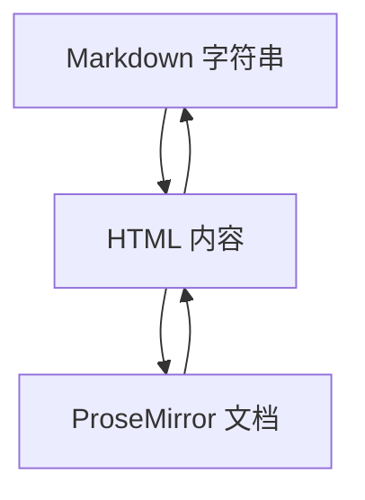
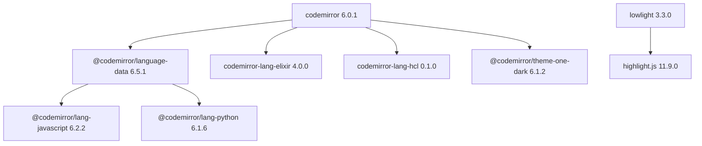
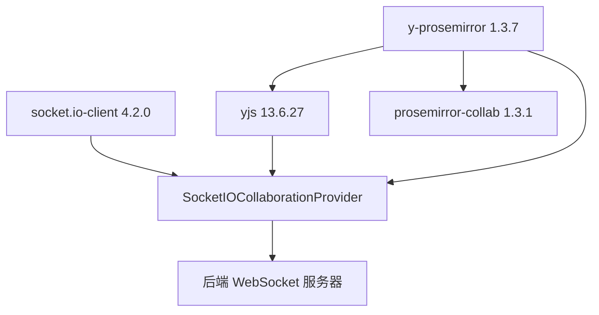
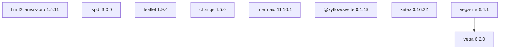
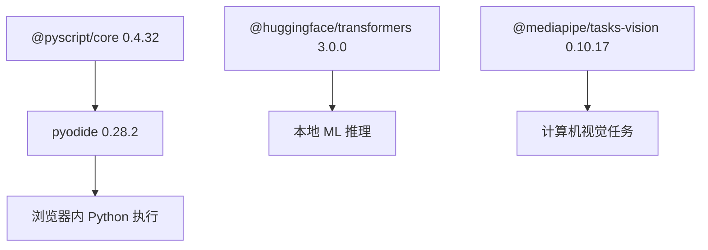
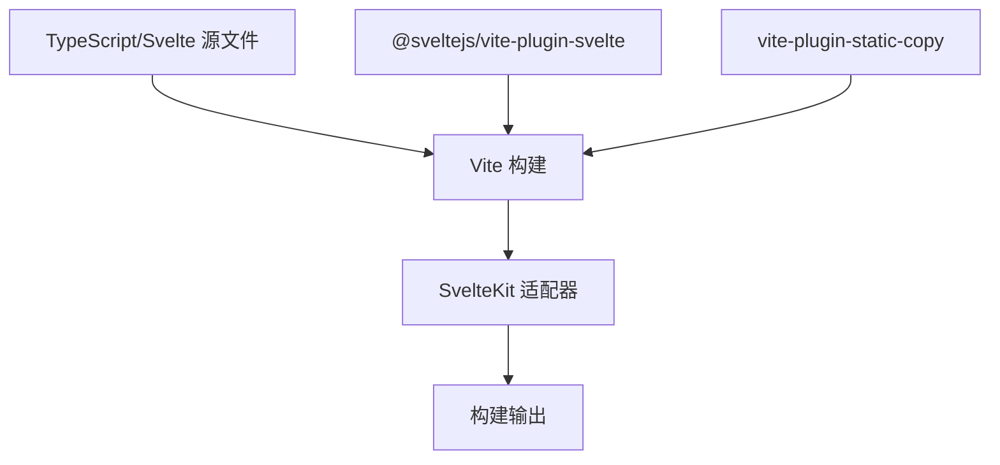

# 前端依赖 (Frontend Dependencies)

相关源文件

-   [CHANGELOG.md](https://github.com/open-webui/open-webui/blob/a7271532/CHANGELOG.md)
-   [package-lock.json](https://github.com/open-webui/open-webui/blob/a7271532/package-lock.json)
-   [package.json](https://github.com/open-webui/open-webui/blob/a7271532/package.json)
-   [src/app.css](https://github.com/open-webui/open-webui/blob/a7271532/src/app.css)
-   [src/lib/components/ChangelogModal.svelte](https://github.com/open-webui/open-webui/blob/a7271532/src/lib/components/ChangelogModal.svelte)
-   [src/lib/components/common/RichTextInput.svelte](https://github.com/open-webui/open-webui/blob/a7271532/src/lib/components/common/RichTextInput.svelte)
-   [src/lib/components/icons/XMark.svelte](https://github.com/open-webui/open-webui/blob/a7271532/src/lib/components/icons/XMark.svelte)

本文档全面概述了 Open WebUI 前端使用的 JavaScript/TypeScript 依赖项。这些依赖项涵盖了 SvelteKit 框架、富文本编辑 (Tiptap)、代码编辑 (CodeMirror)、实时协作、文档处理、可视化以及构建工具。有关后端 Python 依赖项，请参阅 [后端依赖](/open-webui/open-webui/17.1-backend-dependencies)。

## 目的与范围

前端依赖栈定义在 [package.json1-153](https://github.com/open-webui/open-webui/blob/a7271532/package.json#L1-L153) 中，并锁定在 [package-lock.json](https://github.com/open-webui/open-webui/blob/a7271532/package-lock.json) 中。本文档对主要的依赖项类别、它们在应用程序中的作用、版本约束以及集成模式进行了分类。它作为了解哪些外部库支撑了特定的前端特性以及它们如何相互关联的参考。

---

## 依赖分类概览

```mermaid
flowchart TD
    TypeScript["typescript 5.5.4"]
    Tailwind["tailwindcss 4.0.0"]
    Prettier["prettier 3.3.3"]
    ESLint["eslint 8.56.0"]
    HuggingFace["@huggingface/transformers 3.0.0"]
    Pyodide["pyodide 0.28.2"]
    PyScript["@pyscript/core 0.4.32"]
    Mermaid["mermaid 11.10.1"]
    ChartJS["chart.js 4.5.0"]
    Vega["vega 6.2.0"]
    XYFlow["@xyflow/svelte 0.1.19"]
    PDFjs["pdfjs-dist 5.4.149"]
    Mammoth["mammoth 1.11.0"]
    XLSX["xlsx 0.18.5"]
    CodeMirror["codemirror 6.0.1"]
    HighlightJS["highlight.js 11.9.0"]
    Lowlight["lowlight 3.3.0"]
    LanguageData["@codemirror/language-data 6.5.1"]
    Svelte["Svelte 5.0.0"]
    SvelteKit["@sveltejs/kit 2.5.27"]
    Vite["Vite 5.4.14"]
    Tiptap["@tiptap/core 3.0.7"]
    ProseMirror["ProseMirror 相关包"]
    Marked["marked 9.1.0"]
    Turndown["turndown 7.2.0"]
    SocketIO["socket.io-client 4.2.0"]
    Yjs["yjs 13.6.27"]
    YProseMirror["y-prosemirror 1.3.7"]

    Tiptap --> ProseMirror
    Tiptap --> Marked
    Tiptap --> Turndown
    YProseMirror --> Yjs
    YProseMirror --> ProseMirror
    CodeMirror --> HighlightJS
    CodeMirror --> Lowlight
    SvelteKit --> Svelte
    SvelteKit --> Vite
```


**来源：** [package.json1-153](https://github.com/open-webui/open-webui/blob/a7271532/package.json#L1-L153)

---

## 核心框架栈

前端构建在 **SvelteKit 2.5.27** 和 **Svelte 5.0.0** 之上，使用 **Vite 5.4.14** 作为构建工具。框架依赖项分为生产环境和开发环境：

| 包名 | 版本 | 用途 |
| --- | --- | --- |
| `svelte` | 5.0.0 | 核心响应式框架 |
| `@sveltejs/kit` | 2.5.27 | 具有路由、SSR 功能的应用框架 |
| `@sveltejs/adapter-node` | 2.0.0 | Node.js 部署适配器 |
| `@sveltejs/adapter-static` | 3.0.2 | 静态网站生成适配器 |
| `@sveltejs/vite-plugin-svelte` | 4.0.0 | Vite 集成插件 |
| `vite` | 5.4.14 | 构建工具和开发服务器 |

适配器的选择决定了部署模式：`adapter-node` 用于服务端渲染，或 `adapter-static` 用于预渲染的静态网站。Vite 处理模块解析、热模块替换 (HMR) 和生产环境打包。

**来源：** [package.json24-65](https://github.com/open-webui/open-webui/blob/a7271532/package.json#L24-L65)

---

## 富文本编辑系统

应用程序使用 **Tiptap 3.0.7** 作为富文本编辑器，它构建在 **ProseMirror** 框架之上。该系统支撑了聊天输入、笔记编辑器和其它内容创建特性。

### Tiptap 扩展生态系统

```mermaid
flowchart TD
    TiptapCore["@tiptap/core 3.0.7"]
    StarterKit["@tiptap/starter-kit 3.0.7"]
    CodeBlock["@tiptap/extension-code-block-lowlight 3.0.7"]
    Table["@tiptap/extension-table 3.0.7"]
    Image["@tiptap/extension-image 3.0.7"]
    YouTube["@tiptap/extension-youtube 3.0.7"]
    Link["@tiptap/extension-link 3.0.7"]
    Highlight["@tiptap/extension-highlight 3.3.0"]
    Typography["@tiptap/extension-typography 3.0.7"]
    Mention["@tiptap/extension-mention 3.0.9"]
    BubbleMenu["@tiptap/extension-bubble-menu 2.26.1"]
    FloatingMenu["@tiptap/extension-floating-menu 2.26.1"]
    FileHandler["@tiptap/extension-file-handler 3.0.7"]
    DragHandle["@tiptap/extension-drag-handle 3.4.5"]
    List["@tiptap/extension-list 3.0.7"]
    PM["@tiptap/pm 3.0.7"]
    Suggestion["@tiptap/suggestion 3.4.2"]

    TiptapCore --> StarterKit
    TiptapCore --> CodeBlock
    TiptapCore --> Table
    TiptapCore --> Image
    TiptapCore --> YouTube
    TiptapCore --> Link
    TiptapCore --> Highlight
    TiptapCore --> Typography
    TiptapCore --> Mention
    TiptapCore --> BubbleMenu
    TiptapCore --> FloatingMenu
    TiptapCore --> FileHandler
    TiptapCore --> DragHandle
    TiptapCore --> List
    TiptapCore --> PM
    Mention --> Suggestion
```


**来源：** [package.json67-84](https://github.com/open-webui/open-webui/blob/a7271532/package.json#L67-L84) [src/lib/components/common/RichTextInput.svelte117-143](https://github.com/open-webui/open-webui/blob/a7271532/src/lib/components/common/RichTextInput.svelte#L117-L143)

### ProseMirror 基础

Tiptap 构建在 ProseMirror 之上，需要这些核心包：

| 包名 | 版本 | 用途 |
| --- | --- | --- |
| `prosemirror-model` | 1.23.0 | 文档架构 (schema) 与节点 |
| `prosemirror-state` | 1.4.3 | 编辑器状态管理 |
| `prosemirror-view` | 1.34.3 | DOM 渲染与交互 |
| `prosemirror-commands` | 1.6.0 | 编辑命令 |
| `prosemirror-keymap` | 1.2.2 | 键盘快捷键 |
| `prosemirror-history` | 1.4.1 | 撤销/重做功能 |
| `prosemirror-markdown` | 1.13.1 | Markdown 解析/序列化 |
| `prosemirror-collab` | 1.3.1 | 协作编辑 |
| `prosemirror-tables` | 1.7.1 | 表格支持 |

**来源：** [package.json120-131](https://github.com/open-webui/open-webui/blob/a7271532/package.json#L120-L131)

### Markdown 转换流水线

富文本编辑器使用双向 Markdown 转换：


| 包名 | 版本 | 用途 |
| --- | --- | --- |
| `marked` | 9.1.0 | Markdown → HTML 解析 |
| `turndown` | 7.2.0 | HTML → Markdown 转换 |
| `@joplin/turndown-plugin-gfm` | 1.0.62 | GitHub Flavored Markdown (GFM) 支持 |
| `turndown-plugin-gfm` | 1.0.2 | 额外的 GFM 特性 |

该转换流水线在 [src/lib/components/common/RichTextInput.svelte2-106](https://github.com/open-webui/open-webui/blob/a7271532/src/lib/components/common/RichTextInput.svelte#L2-L106) 中实现，包含了针对任务列表、表格和提及 (mention) 语法的自定义规则。

**来源：** [package.json62-138](https://github.com/open-webui/open-webui/blob/a7271532/package.json#L62-L138) [src/lib/components/common/RichTextInput.svelte2-106](https://github.com/open-webui/open-webui/blob/a7271532/src/lib/components/common/RichTextInput.svelte#L2-L106)

---

## 代码编辑系统

**CodeMirror 6.0.1** 为 20 多种语言提供带有语法高亮的代码编辑功能。它支持 Tiptap 内部的代码块编辑器以及独立的代码编辑特性。

### CodeMirror 语言支持


**核心 CodeMirror 包：**

| 包名 | 版本 | 用途 |
| --- | --- | --- |
| `@codemirror/state` | 6.4.1 | 编辑器状态管理 |
| `@codemirror/view` | 6.28.0 | DOM 渲染 |
| `@codemirror/commands` | 6.6.0 | 编辑命令 |
| `@codemirror/language` | 6.10.2 | 语言支持基础设施 |
| `@codemirror/autocomplete` | 6.16.2 | 自动补全 |

**语言包：**

`@codemirror/language-data` 包聚合了 20 多个语言解析器。直接依赖项包括：

-   `@codemirror/lang-javascript` (6.2.2) - JavaScript/TypeScript
-   `@codemirror/lang-python` (6.1.6) - Python
-   `codemirror-lang-elixir` (4.0.0) - Elixir
-   `codemirror-lang-hcl` (0.1.0) - HashiCorp 配置语言 (HCL)

**语法高亮：**

-   `highlight.js` (11.9.0) - 语法检测与高亮 (支持 200+ 语言)
-   `lowlight` (3.3.0) - 用于 CodeMirror 的 highlight.js 包装器
-   `@codemirror/theme-one-dark` (6.1.2) - One Dark 配色方案

与 Tiptap 代码块的集成使用 `@tiptap/extension-code-block-lowlight` 在编辑器内渲染带有语法高亮的代码。

**来源：** [package.json56-113](https://github.com/open-webui/open-webui/blob/a7271532/package.json#L56-L113) [src/lib/components/common/RichTextInput.svelte138-162](https://github.com/open-webui/open-webui/blob/a7271532/src/lib/components/common/RichTextInput.svelte#L138-L162)

---

## UI 组件库

### 组件与样式框架

| 包名 | 版本 | 用途 |
| --- | --- | --- |
| `bits-ui` | 0.21.15 | 无头 (Headless) UI 组件 (下拉菜单, 对话框) |
| `alpinejs` | 3.15.0 | 针对特定组件的轻量级响应式 |
| `@floating-ui/dom` | 1.7.2 | 用于工具提示/弹出层的定位引擎 |
| `tippy.js` | 6.3.7 | 工具提示和弹出层库 |
| `paneforge` | 0.0.6 | 可调节大小的面版布局 |
| `@sveltejs/svelte-virtual-list` | 3.0.1 | 针对大型列表的虚拟滚动 |
| `sortablejs` | 1.15.6 | 拖拽排序 |
| `focus-trap` | 7.6.4 | 模态框的键盘导航 |

**样式设置：**

-   `tailwindcss` (4.0.0) - 原子类优先 (Utility-first) 的 CSS 框架。
-   `@tailwindcss/typography` (0.5.13) - 文章样式插件。
-   `@tailwindcss/container-queries` (0.1.1) - 容器查询支持。
-   `postcss` (8.4.31) - CSS 处理。
-   `sass-embedded` (1.81.0) - Sass 编译。

**视觉效果：**

-   `svelte-confetti` (1.3.2) - 五彩纸屑动画 (用于 [src/lib/components/ChangelogModal.svelte5-37](https://github.com/open-webui/open-webui/blob/a7271532/src/lib/components/ChangelogModal.svelte#L5-L37))。
-   `svelte-sonner` (0.3.19) - Toast 消息通知。

**来源：** [package.json47-143](https://github.com/open-webui/open-webui/blob/a7271532/package.json#L47-L143) [src/app.css1-810](https://github.com/open-webui/open-webui/blob/a7271532/src/app.css#L1-L810)

---

## 实时通信与协作

应用程序支持使用 **Yjs** CRDT（无冲突复制数据类型）实现实时协作编辑，并使用 **Socket.IO** 作为传输层：


| 包名 | 版本 | 用途 |
| --- | --- | --- |
| `socket.io-client` | 4.2.0 | 实时事件的 WebSocket 客户端 |
| `yjs` | 13.6.27 | 协作编辑的 CRDT 框架 |
| `y-prosemirror` | 1.3.7 | 用于 Yjs 的 ProseMirror 绑定 |
| `prosemirror-collab` | 1.3.1 | ProseMirror 协作编辑插件 |

`SocketIOCollaborationProvider` 类（在 [src/lib/components/common/RichTextInput.svelte147-681](https://github.com/open-webui/open-webui/blob/a7271532/src/lib/components/common/RichTextInput.svelte#L147-L681) 中引用）将 Socket.IO 与 Yjs 连接，以实现协作式文档编辑。光标位置和选区在各客户端间同步，冲突解决由 CRDT 算法自动处理。

**来源：** [package.json120-147](https://github.com/open-webui/open-webui/blob/a7271532/package.json#L120-L147) [src/lib/components/common/RichTextInput.svelte147-770](https://github.com/open-webui/open-webui/blob/a7271532/src/lib/components/common/RichTextInput.svelte#L147-L770)

---

## 文档处理库

前端可以从各种文档格式中提取并显示内容：

### 文档解析

| 包名 | 版本 | 用途 |
| --- | --- | --- |
| `pdfjs-dist` | 5.4.149 | PDF 渲染与文本提取 |
| `mammoth` | 1.11.0 | DOCX 文件解析为 HTML |
| `xlsx` | 0.18.5 | Excel 文件解析与生成 |

**PDF.js 集成：**

`pdfjs-dist` 需要 worker 设置。worker 从静态资源目录下的 `/pdfjs/` 加载。

**DOCX 处理：**

`mammoth` 库在保留格式的同时将 DOCX 文件转换为 HTML。用于文件上传处理，以提取文本内容。

**Excel 处理：**

`xlsx` 库（也称为 SheetJS）读取并写入 Excel 文件 (.xlsx, .xls, .csv)。用于文件查看器模态框中的电子表格渲染。

**来源：** [package.json114-144](https://github.com/open-webui/open-webui/blob/a7271532/package.json#L114-L144) [CHANGELOG.md35](https://github.com/open-webui/open-webui/blob/a7271532/CHANGELOG.md#L35-L35)

---

## 可视化与渲染库

### 图表与图形渲染


| 包名 | 版本 | 用途 |
| --- | --- | --- |
| `mermaid` | 11.10.1 | 图表渲染 (流程图, 序列图) |
| `katex` | 0.16.22 | 数学符号渲染 (LaTeX) |
| `chart.js` | 4.5.0 | 交互式图表 (柱状图, 折线图, 饼图) |
| `vega` | 6.2.0 | 声明式可视化语法 |
| `vega-lite` | 6.4.1 | 高级可视化规范 |
| `@xyflow/svelte` | 0.1.19 | 基于节点的图表与流程图 |
| `leaflet` | 1.9.4 | 交互式地图渲染 |
| `html2canvas-pro` | 1.5.11 | 屏幕截图/导出功能 |
| `jspdf` | 3.0.0 | 从 JavaScript 生成 PDF |

**数学符号：**

KaTeX 在整个 Markdown 渲染流水线中使用，用于显示行内和块级数学表达式。在 [src/app.css81-293](https://github.com/open-webui/open-webui/blob/a7271532/src/app.css#L81-L293) 中的自定义 CSS 处理了滚动和可见性。

**图表渲染：**

Mermaid 图表在标记有 `mermaid` 语言标识符的代码块中渲染。11.10.1 版本库支持所有现代图表类型，包括流程图、序列图、类图和状态图。

**来源：** [package.json89-142](https://github.com/open-webui/open-webui/blob/a7271532/package.json#L89-L142) [src/app.css81-293](https://github.com/open-webui/open-webui/blob/a7271532/src/app.css#L81-L293)

---

## AI 与代码执行

前端包含了客户端 AI/ML 和 Python 执行能力：

### Pyodide 与 AI 集成


| 包名 | 版本 | 用途 |
| --- | --- | --- |
| `pyodide` | 0.28.2 | WebAssembly Python 运行时 |
| `@pyscript/core` | 0.4.32 | 用于 HTML 中 Python 的 PyScript 框架 |
| `@huggingface/transformers` | 3.0.0 | 基于浏览器的 Transformer 模型 |
| `@mediapipe/tasks-vision` | 0.10.17 | 计算机视觉任务 (人脸检测等) |

**Pyodide 设置：**

Pyodide 文件在构建期间通过 [package.json22](https://github.com/open-webui/open-webui/blob/a7271532/package.json#L22-L22) 中的 `pyodide:fetch` 脚本获取。该运行时支持直接在浏览器中执行 Python 代码块，无需服务器交互。它支撑了 [CodeBlock 组件](/open-webui/open-webui/5.4-code-block-execution) 中的代码执行特性。

**Hugging Face Transformers：**

`@huggingface/transformers` 库支持在客户端运行轻量级 transformer 模型，用于文本分类、情感分析和嵌入等任务，无需调用后端。

**来源：** [package.json6-132](https://github.com/open-webui/open-webui/blob/a7271532/package.json#L6-L132)

---

## 构建与开发工具

### TypeScript 与 Linting

| 包名 | 版本 | 用途 |
| --- | --- | --- |
| `typescript` | 5.5.4 | 类型检查与编译 |
| `tslib` | 2.4.1 | TypeScript 运行时辅助函数 |
| `svelte-check` | 4.0.0 | Svelte 类型检查 CLI |
| `eslint` | 8.56.0 | JavaScript/TypeScript linting |
| `@typescript-eslint/parser` | 8.31.1 | ESLint TypeScript 解析器 |
| `@typescript-eslint/eslint-plugin` | 8.31.1 | TypeScript 特定的 lint 规则 |
| `eslint-plugin-svelte` | 2.45.1 | Svelte 组件 linting |
| `eslint-config-prettier` | 9.1.0 | 禁用冲突的 Prettier 规则 |
| `prettier` | 3.3.3 | 代码格式化 |
| `prettier-plugin-svelte` | 3.2.6 | Svelte 格式化插件 |

**Linting 脚本：**

[package.json13-16](https://github.com/open-webui/open-webui/blob/a7271532/package.json#L13-L16) 中的 `lint` 脚本运行三项检查：

1.  `lint:frontend` - 对所有 JS/TS/Svelte 文件运行 ESLint。
2.  `lint:types` - TypeScript/Svelte 类型检查。
3.  `lint:backend` - Python linting（此处未涵盖）。

**来源：** [package.json13-130](https://github.com/open-webui/open-webui/blob/a7271532/package.json#L13-L130)

### 测试基础设施

| 包名 | 版本 | 用途 |
| --- | --- | --- |
| `vitest` | 1.6.1 | 单元测试框架 |
| `cypress` | 13.15.0 | 端到端 (E2E) 测试框架 |
| `eslint-plugin-cypress` | 3.4.0 | Cypress 特定的 lint 规则 |

**测试命令：**

-   `npm run test:frontend` - 运行 Vitest 单元测试 ([package.json21](https://github.com/open-webui/open-webui/blob/a7271532/package.json#L21-L21))。
-   `npm run cy:open` - 启动 Cypress 测试运行器 ([package.json20](https://github.com/open-webui/open-webui/blob/a7271532/package.json#L20-L20))。

**来源：** [package.json20-51](https://github.com/open-webui/open-webui/blob/a7271532/package.json#L20-L51)

### 构建流水线


| 包名 | 版本 | 用途 |
| --- | --- | --- |
| `vite` | 5.4.14 | 构建工具和开发服务器 |
| `@sveltejs/vite-plugin-svelte` | 4.0.0 | 为 Vite 提供 Svelte 支持 |
| `vite-plugin-static-copy` | 2.2.0 | 在构建期间复制静态资源 |
| `@sveltejs/adapter-node` | 2.0.0 | Node.js 服务器输出 |
| `@sveltejs/adapter-static` | 3.0.2 | 静态网站输出 |
| `@sveltejs/adapter-auto` | 3.2.2 | 自动检测部署平台 |

**构建命令：**

-   `npm run build` - 生产环境构建 ([package.json8](https://github.com/open-webui/open-webui/blob/a7271532/package.json#L8-L8))。
-   `npm run build:watch` - 持续重建 ([package.json9](https://github.com/open-webui/open-webui/blob/a7271532/package.json#L9-L9))。
-   `npm run dev` - 开发服务器 ([package.json6](https://github.com/open-webui/open-webui/blob/a7271532/package.json#L6-L6))。

**来源：** [package.json6-143](https://github.com/open-webui/open-webui/blob/a7271532/package.json#L6-L143)

---

## 工具库

### 数据处理与验证

| 包名 | 版本 | 用途 |
| --- | --- | --- |
| `dompurify` | 3.2.6 | HTML 清洗 (防御 XSS 攻击) |
| `fuse.js` | 7.0.0 | 模糊搜索库 |
| `uuid` | 9.0.1 | UUID 生成 |
| `dayjs` | 1.11.10 | 日期/时间处理 |
| `crc-32` | 1.2.2 | CRC32 校验和 |
| `js-sha256` | 0.10.1 | SHA-256 哈希 |
| `yaml` | 2.7.1 | YAML 解析/序列化 |
| `async` | 3.2.5 | 异步控制流工具 |
| `undici` | 7.3.0 | HTTP/1.1 客户端 (Node.js fetch polyfill) |
| `eventsource-parser` | 1.1.2 | SSE (服务端发送事件) 解析 |

**HTML 清洗：**

`dompurify` 对于渲染用户生成内容时防御 XSS 攻击至关重要。在整个应用程序中显示来自 Markdown 或外部源的 HTML 时均有使用，如 [src/lib/components/ChangelogModal.svelte2-92](https://github.com/open-webui/open-webui/blob/a7271532/src/lib/components/ChangelogModal.svelte#L2-L92) 所示。

**搜索功能：**

`fuse.js` 支持模型列表、聊天历史和其它可搜索界面中的模糊搜索。它为搜索精度提供了可配置的阈值和距离参数。

**来源：** [package.json49-146](https://github.com/open-webui/open-webui/blob/a7271532/package.json#L49-L146) [src/lib/components/ChangelogModal.svelte2-92](https://github.com/open-webui/open-webui/blob/a7271532/src/lib/components/ChangelogModal.svelte#L2-L92)

### 文件处理

| 包名 | 版本 | 用途 |
| --- | --- | --- |
| `file-saver` | 2.0.5 | 客户端文件保存 |
| `heic2any` | 0.0.4 | HEIC 图像格式转换 |
| `idb` | 7.1.1 | 客户端存储的 IndexedDB 包装器 |
| `html-entities` | 2.5.3 | HTML 实体编码/解码 |

**图像处理：**

`heic2any` 在上传前将 HEIC 图像（苹果格式）转换为 JPEG/PNG 以适配浏览器兼容性。

**客户端存储：**

`idb` 提供了一个基于 Promise 的 IndexedDB API，用于在浏览器中存储大量结构化数据，常用于离线聊天历史和文件缓存。

**来源：** [package.json97-107](https://github.com/open-webui/open-webui/blob/a7271532/package.json#L97-L107)

### OAuth 与身份验证

| 包名 | 版本 | 用途 |
| --- | --- | --- |
| `@azure/msal-browser` | 4.5.0 | 微软身份验证库 |

MSAL 库实现了直接从前端发起的 Azure AD/Microsoft 365 OAuth 身份验证流程。

**来源：** [package.json55](https://github.com/open-webui/open-webui/blob/a7271532/package.json#L55-L55)

---

## 国际化 (Internationalization)

| 包名 | 版本 | 用途 |
| --- | --- | --- |
| `i18next` | 23.10.0 | i18n 框架 |
| `i18next-browser-languagedetector` | 7.2.0 | 自动检测浏览器语言 |
| `i18next-resources-to-backend` | 1.2.0 | 动态资源加载 |
| `i18next-parser` | 9.0.1 | 提取可翻译字符串 (开发环境) |

i18n 系统支持 20 个语言区域，并带有动态内容占位符。`i18n:parse` 脚本 ([package.json19](https://github.com/open-webui/open-webui/blob/a7271532/package.json#L19-L19)) 从源文件中提取可翻译字符串。有关翻译结构和语言区域覆盖范围的详情，请参阅 [国际化](/open-webui/open-webui/15-internationalization)。

**来源：** [package.json19-106](https://github.com/open-webui/open-webui/blob/a7271532/package.json#L19-L106)

---

## TTS/音频处理

| 包名 | 版本 | 用途 |
| --- | --- | --- |
| `kokoro-js` | 1.1.1 | 文本转语音库 |

`kokoro-js` 包提供了基于浏览器的文本转语音能力，用于本地 TTS，无需调用后端 API。

**来源：** [package.json111](https://github.com/open-webui/open-webui/blob/a7271532/package.json#L111-L111)

---

## 依赖管理策略

### 版本约束

`package.json` 对大多数依赖项使用 **插入符 (^) 范围**，允许自动进行次版本和修订号更新，同时锁定主版本：

```json
{
  "@tiptap/core": "^3.0.7",    // 允许 3.0.x 和 3.x.x
  "svelte": "^5.0.0",           // 允许 5.x.x
  "typescript": "^5.5.4"        // 允许 5.5.x 和 5.x.x
}
```
**精确版本：**

一些包为了稳定性而使用精确版本（无前缀）：

-   `@sveltejs/adapter-auto`: `3.2.2`
-   各种 CodeMirror 语言包。

### 引擎要求 (Engine Requirements)

项目在 [package.json149-152](https://github.com/open-webui/open-webui/blob/a7271532/package.json#L149-L152) 中指定了 Node.js 和 npm 的版本约束：

```json
{
  "engines": {
    "node": ">=18.13.0 <=22.x.x",
    "npm": ">=6.0.0"
  }
}
```
这确保了与 Node.js 18-22 的兼容性，同时要求 npm 6+。

### 锁定文件

`package-lock.json` (lockfileVersion 3) 通过锁定所有间接依赖项的确切版本和完整性哈希值，确保了构建的可重现性。锁定文件包含 100,000 多行内容，覆盖了整个依赖树。

**来源：** [package.json1-153](https://github.com/open-webui/open-webui/blob/a7271532/package.json#L1-L153) [package-lock.json1-4](https://github.com/open-webui/open-webui/blob/a7271532/package-lock.json#L1-L4)

---

## 总结表：主要依赖组

| 类别 | 关键包名 | 包总数 |
| --- | --- | --- |
| 框架 | svelte, @sveltejs/kit, vite | 3 核心 + 2 适配器 |
| 富文本 | @tiptap/*, prosemirror-*, marked, turndown | 18+ Tiptap 扩展, 11 ProseMirror |
| 代码编辑 | codemirror, @codemirror/\*, highlight.js, lowlight | 5 核心 + 20+ 语言包 |
| 实时通讯 | socket.io-client, yjs, y-prosemirror | 3 个包 |
| 文档处理 | pdfjs-dist, mammoth, xlsx | 3 个包 |
| 可视化 | mermaid, katex, chart.js, vega, @xyflow/svelte | 6 个包 |
| AI/ML | pyodide, @huggingface/transformers, @mediapipe/\* | 4 个包 |
| UI 组件 | bits-ui, tippy.js, sortablejs, focus-trap | 8+ 个包 |
| 构建工具 | typescript, tailwindcss, prettier, eslint, vitest, cypress | 10+ 个包 |
| 工具库 | dompurify, fuse.js, uuid, dayjs, i18next | 15+ 个包 |

**依赖总计：** 54 个生产依赖项，33 个开发依赖项（`package.json` 中共有 87 个直接依赖项）。

**来源：** [package.json1-153](https://github.com/open-webui/open-webui/blob/a7271532/package.json#L1-L153)
