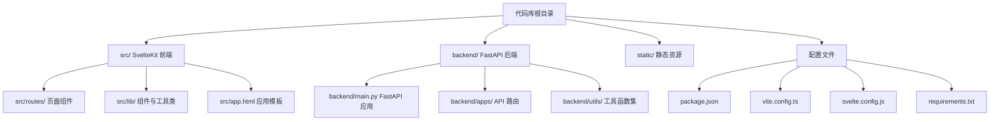
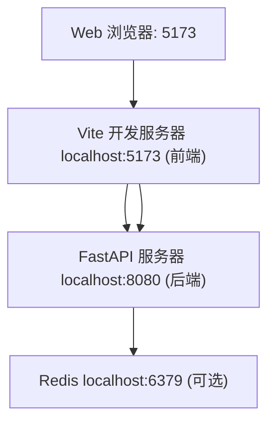
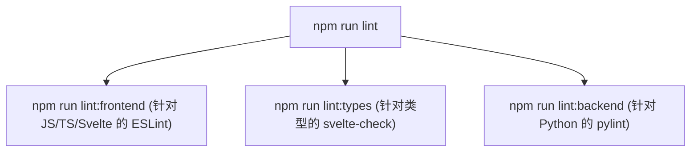

# 开发环境 (Development Environment)

相关源文件

-   [CHANGELOG.md](https://github.com/open-webui/open-webui/blob/a7271532/CHANGELOG.md)
-   [LICENSE](https://github.com/open-webui/open-webui/blob/a7271532/LICENSE)
-   [README.md](https://github.com/open-webui/open-webui/blob/a7271532/README.md)
-   [TROUBLESHOOTING.md](https://github.com/open-webui/open-webui/blob/a7271532/TROUBLESHOOTING.md)
-   [docs/apache.md](https://github.com/open-webui/open-webui/blob/a7271532/docs/apache.md)
-   [package-lock.json](https://github.com/open-webui/open-webui/blob/a7271532/package-lock.json)
-   [package.json](https://github.com/open-webui/open-webui/blob/a7271532/package.json)
-   [src/app.css](https://github.com/open-webui/open-webui/blob/a7271532/src/app.css)
-   [src/lib/components/ChangelogModal.svelte](https://github.com/open-webui/open-webui/blob/a7271532/src/lib/components/ChangelogModal.svelte)
-   [src/lib/components/chat/Settings/About.svelte](https://github.com/open-webui/open-webui/blob/a7271532/src/lib/components/chat/Settings/About.svelte)
-   [src/lib/components/common/RichTextInput.svelte](https://github.com/open-webui/open-webui/blob/a7271532/src/lib/components/common/RichTextInput.svelte)
-   [src/lib/components/icons/XMark.svelte](https://github.com/open-webui/open-webui/blob/a7271532/src/lib/components/icons/XMark.svelte)
-   [src/lib/constants.ts](https://github.com/open-webui/open-webui/blob/a7271532/src/lib/constants.ts)

本页面涵盖了为 Open WebUI 设置本地开发环境的内容，包括前提条件、依赖安装、运行开发服务器以及调试策略。有关构建系统和生产环境部署的信息，请参阅 [前端构建系统](/open-webui/open-webui/18.2-testing-infrastructure) 和 [Docker 部署](/open-webui/open-webui/17.2-frontend-dependencies)。

## 前提条件

Open WebUI 要求在您的开发机上安装以下工具：

| 工具 | 版本 | 用途 |
| --- | --- | --- |
| Node.js | 18.13.0 - 22.x.x | 前端构建系统和开发服务器 |
| npm | ≥6.0.0 | JavaScript 包管理 |
| Python | 3.11+ | 后端 API 服务器 |
| Git | 最新 | 版本控制 |
| Redis | 最新 (可选) | 实时特性和缓存 |

Node.js 版本约束通过 `engines` 字段在 [package.json147-150](https://github.com/open-webui/open-webui/blob/a7271532/package.json#L147-L150) 中强制执行。

**来源：** [package.json147-150](https://github.com/open-webui/open-webui/blob/a7271532/package.json#L147-L150)

## 代码库结构


**来源：** 系统图表中的架构概览

## 前端开发设置

### 安装依赖

克隆代码库并安装 Node.js 依赖：

```bash
git clone https://github.com/open-webui/open-webui.git
cd open-webui
npm install
```
[package.json54-146](https://github.com/open-webui/open-webui/blob/a7271532/package.json#L54-L146) 文件定义了所有前端依赖项，包括：

-   **@sveltejs/kit**: 应用程序框架。
-   **vite**: 构建工具和开发服务器。
-   **socket.io-client**: WebSocket 通信。
-   **marked**: Markdown 解析。
-   **@tiptap/core**: 富文本编辑器。

### 开发脚本

前端开发可以使用以下 npm 脚本：

| 脚本 | 命令 | 用途 |
| --- | --- | --- |
| `npm run dev` | `vite dev --host` | 在默认端口 (5173) 启动开发服务器 |
| `npm run dev:5050` | `vite dev --port 5050` | 在端口 5050 启动开发服务器 |
| `npm run build:watch` | `vite build --watch` | 以监听模式进行构建 |
| `npm run check` | `svelte-check` | 类型检查 |
| `npm run lint` | ESLint + 类型检查 | 代码检查 |
| `npm run format` | Prettier | 格式化代码 |

**来源：** [package.json5-22](https://github.com/open-webui/open-webui/blob/a7271532/package.json#L5-L22)

### Pyodide 准备

在运行开发服务器之前，`pyodide:fetch` 脚本会下载必要的 Pyodide 文件，用于浏览器内的 Python 执行。该脚本作为 `dev` 和 `build` 脚本的一部分自动运行：

```json
"dev": "npm run pyodide:fetch && vite dev --host"
```
该脚本在 `scripts/prepare-pyodide.js` 中实现，并为 [CodeBlock.svelte](https://github.com/open-webui/open-webui/blob/a7271532/CodeBlock.svelte) 组件的 Python 执行特性准备资产。

**来源：** [package.json6](https://github.com/open-webui/open-webui/blob/a7271532/package.json#L6-L6) [package.json22](https://github.com/open-webui/open-webui/blob/a7271532/package.json#L22-L22)

### 运行开发服务器

```bash
npm run dev
```
该命令执行以下操作：

1.  执行 `pyodide:fetch` 以准备 Python 运行时资产。
2.  启动带有 HMR（热模块替换）功能的 Vite 开发服务器。
3.  默认在 `http://localhost:5173` 提供应用服务。
4.  使用 `--host` 标志以允许网络访问。

开发服务器提供以下功能：

-   **热模块替换 (HMR)**：对 Svelte 组件的更改会立即更新。
-   **快速刷新 (Fast Refresh)**：更新时尽可能保留组件状态。
-   **TypeScript 编译**：实时的 TypeScript 到 JavaScript 的转译。
-   **CSS 处理**：使用 PostCSS 进行 Tailwind CSS 编译。

**来源：** [package.json6](https://github.com/open-webui/open-webui/blob/a7271532/package.json#L6-L6)

## 后端开发设置

### Python 虚拟环境

创建并激活 Python 虚拟环境：

```bash
python -m venv venv
source venv/bin/activate  # 在 Windows 上使用: venv\Scripts\activate
```
### 安装后端依赖

```bash
pip install -r requirements.txt
```
依赖项组织在多个文件中：

-   `requirements.txt`：包含所有特性的完整安装。
-   `requirements-min.txt`：不包含可选特性的最小化安装。

对于特定的特性集，请使用 `pyproject.toml` 中定义的可选依赖组：

```bash
pip install -e ".[postgres]"  # PostgreSQL 支持
pip install -e ".[all]"       # 所有可选特性
```
**来源：** 架构图（后端架构），来自第 16 页上下文的依赖信息。

### 环境配置

后端配置通过环境变量进行管理。在代码库根目录创建一个 `.env` 文件：

```ini
# 数据库
DATABASE_URL=sqlite:///./data/webui.db

# Redis (开发环境可选)
REDIS_URL=redis://localhost:6379

# 身份验证
WEBUI_SECRET_KEY=在此处填写您的密钥

# 开发设置
ENV=dev
```
配置系统在 [backend/apps/webui/internal/env.py](https://github.com/open-webui/open-webui/blob/a7271532/backend/apps/webui/internal/env.py) 中实现，该文件负责加载环境变量并设置全局常量。

**来源：** 架构图（配置系统），第 9.3 页上下文。

## 运行全栈

### 开发架构


### 启动后端服务器

在另一个终端中：

```bash
cd backend
python main.py
```
或者直接使用 uvicorn：

```bash
uvicorn main:app --reload --host 0.0.0.0 --port 8080
```
`--reload` 标志实现在 Python 文件更改时自动重载。

后端服务器实现了：

-   **FastAPI 应用程序**：位于 [backend/main.py](https://github.com/open-webui/open-webui/blob/a7271532/backend/main.py) 的 REST API 端点。
-   **Socket.IO 服务器**：位于 [backend/apps/socket/main.py](https://github.com/open-webui/open-webui/blob/a7271532/backend/apps/socket/main.py) 的实时通信。
-   **生命周期管理**：Redis 的初始化和清理。

**来源：** 架构图（后端应用程序架构）。

### 启动前端开发服务器

在另一个终端中：

```bash
npm run dev
```
### API 代理

在开发过程中，Vite 开发服务器会将 API 请求代理到后端。这在 `vite.config.ts` 中配置：

```typescript
server: {
  proxy: {
    '/api': 'http://localhost:8080',
    '/socket.io': {
      target: 'http://localhost:8080',
      ws: true
    }
  }
}
```
这允许前端向 `/api/*` 发起请求，这些请求会自动转发到 FastAPI 后端。

**来源：** 标准的 SvelteKit/Vite 开发模式。

## 开发工作流程

### 代码检查与代码质量


代码检查流水线定义在 [package.json13-16](https://github.com/open-webui/open-webui/blob/a7271532/package.json#L13-L16) 中：

```bash
npm run lint          # 运行所有检查器
npm run lint:frontend # 仅运行 ESLint
npm run lint:types    # 仅运行类型检查
npm run lint:backend  # 仅运行 Python 检查
```
**来源：** [package.json13-16](https://github.com/open-webui/open-webui/blob/a7271532/package.json#L13-L16)

### 代码格式化

```bash
npm run format         # 格式化前端 (Prettier)
npm run format:backend # 格式化后端 (Black)
```
前端格式化使用 Prettier，并针对 Svelte、TypeScript 和 CSS 文件进行了配置。后端格式化使用 Black，并排除了虚拟环境目录。

**来源：** [package.json17-18](https://github.com/open-webui/open-webui/blob/a7271532/package.json#L17-L18)

### 类型检查

```bash
npm run check       # 一次性类型检查
npm run check:watch # 持续类型检查
```
类型检查使用 `svelte-check` 来验证 Svelte 组件和 TypeScript 文件中的类型，确保在提交代码前符合类型安全性。

**来源：** [package.json11-12](https://github.com/open-webui/open-webui/blob/a7271532/package.json#L11-L12)

## 调试 (Debugging)

### 前端调试

#### 浏览器开发者工具 (DevTools)

1.  **组件检查器**：使用 Svelte/SvelteKit 专用的浏览器扩展：
    -   Svelte DevTools (Chrome/Firefox)。
2.  **网络 (Network) 标签页**：监控 API 请求和 WebSocket 连接。
    -   指向 `/api/*` 端点的 API 调用。
    -   指向 `/socket.io` 的 Socket.IO 连接。
3.  **控制台调试**：应用程序会将事件记录到浏览器控制台：
    -   WebSocket 连接状态。
    -   Store 更新。
    -   组件生命周期事件。

#### Vite 调试模式

启用详细日志记录：

```bash
DEBUG=vite:* npm run dev
```
这会显示以下内容的详细信息：

-   模块解析。
-   HMR 更新。
-   构建流水线执行。

#### Svelte 组件调试

在 Svelte 组件中添加调试语句：

```javascript
$: console.log('组件状态:', { value, editor, html });
```
响应式语句语法 (`$:`) 确保每当依赖项更改时都会进行记录。

**示例：** [src/lib/components/common/RichTextInput.svelte278-832](https://github.com/open-webui/open-webui/blob/a7271532/src/lib/components/common/RichTextInput.svelte#L278-L832) 广泛使用了这种模式。

**来源：** [src/lib/components/common/RichTextInput.svelte278-832](https://github.com/open-webui/open-webui/blob/a7271532/src/lib/components/common/RichTextInput.svelte#L278-L832)

### 后端调试

#### Python 调试器 (pdb)

在 Python 代码中插入断点：

```python
import pdb; pdb.set_trace()
```
或者使用内置的 `breakpoint()` 函数（Python 3.7+）：

```python
breakpoint()
```
#### IDE 调试

配置您的 IDE 以附加到正在运行的 FastAPI 服务器：

**VS Code launch.json 示例：**

```json
{
  "version": "0.2.0",
  "configurations": [
    {
      "name": "Python: FastAPI",
      "type": "python",
      "request": "launch",
      "module": "uvicorn",
      "args": [
        "main:app",
        "--reload",
        "--host", "0.0.0.0",
        "--port", "8080"
      ],
      "cwd": "${workspaceFolder}/backend"
    }
  ]
}
```
#### 日志记录 (Logging)

后端广泛使用了 Python 的 `logging` 模块。启用调试日志：

```python
import logging
logging.basicConfig(level=logging.DEBUG)
```
或者通过环境变量设置：

```bash
LOG_LEVEL=DEBUG python main.py
```
**来源：** 标准的 Python/FastAPI 调试实践。

### WebSocket 调试

对于 Socket.IO 连接的调试：

1.  **浏览器控制台**：Socket.IO 客户端会记录连接事件。
2.  **网络标签页**：按 "WS" 筛选以查看 WebSocket 帧 (frames)。
3.  **Socket.IO 调试模式**：启用客户端调试日志记录：

```javascript
import { io } from 'socket.io-client';
const socket = io(url, {
  transports: ['websocket'],
  debug: true
});
```
WebSocket 实现在 [backend/apps/socket/main.py](https://github.com/open-webui/open-webui/blob/a7271532/backend/apps/socket/main.py) 中，并使用 Redis 进行分布式状态管理。

**来源：** 架构图（实时通信）。

## 常见开发任务

### 添加前端依赖项

```bash
npm install <包名>      # 生产环境依赖
npm install -D <包名>   # 开发环境依赖
```
更新 [package.json54-146](https://github.com/open-webui/open-webui/blob/a7271532/package.json#L54-L146) 用于运行时依赖，或 [package.json24-52](https://github.com/open-webui/open-webui/blob/a7271532/package.json#L24-L52) 用于开发依赖。

**来源：** [package.json24-52](https://github.com/open-webui/open-webui/blob/a7271532/package.json#L24-L52) [package.json54-146](https://github.com/open-webui/open-webui/blob/a7271532/package.json#L54-L146)

### 添加后端依赖项

```bash
pip install <包名>
pip freeze > requirements.txt  # 更新依赖文件
```
对于可选依赖项，请更新 `pyproject.toml` 以添加新的功能组。

### 运行测试

```bash
npm run test:frontend  # 针对前端单元测试的 Vitest
```
测试配置使用 Vitest，[package.json21](https://github.com/open-webui/open-webui/blob/a7271532/package.json#L21-L21) 定义了测试脚本。

**来源：** [package.json21](https://github.com/open-webui/open-webui/blob/a7271532/package.json#L21-L21)

### 构建生产环境版本

```bash
npm run build
```
该命令执行以下操作：

1.  运行 `pyodide:fetch` 以准备资产。
2.  执行 Vite 构建过程。
3.  将优化的静态文件输出到 `build/` 目录。
4.  使用 `svelte.config.js` 中指定的 SvelteKit 适配器。

如需在开发期间持续构建：

```bash
npm run build:watch
```
**来源：** [package.json8-9](https://github.com/open-webui/open-webui/blob/a7271532/package.json#L8-L9)

### 清理开发缓存

如果遇到构建问题：

```bash
# 清理 npm 缓存
npm run pyodide:fetch
rm -rf node_modules/.vite

# 清理 Python 缓存
find . -type d -name __pycache__ -exec rm -r {} +
find . -type f -name "*.pyc" -delete

# 重新安装依赖
npm install
```
### 国际化开发

解析新的翻译键：

```bash
npm run i18n:parse
```
该脚本使用 `i18next-parser` 从源文件中提取翻译键，并更新 `src/lib/i18n/` 中的翻译 JSON 文件。

**来源：** [package.json19](https://github.com/open-webui/open-webui/blob/a7271532/package.json#L19-L19)

## 开发环境变量

开发环境的关键环境变量：

| 变量名 | 默认值 | 用途 |
| --- | --- | --- |
| `ENV` | `dev` | 环境模式 |
| `DATA_DIR` | `./data` | 数据存储目录 |
| `STATIC_DIR` | `./static` | 静态文件目录 |
| `DATABASE_URL` | SQLite 路径 | 数据库连接字符串 |
| `REDIS_URL` | 无 | Redis 连接字符串 (可选) |
| `WEBUI_SECRET_KEY` | 自动生成 | JWT 签名密钥 |
| `PORT` | `8080` | 后端服务器端口 |
| `HOST` | `0.0.0.0` | 后端服务器主机 |

有关配置选项的完整列表，请参阅 [环境配置](/open-webui/open-webui/9.3-collaborative-editing)。

**来源：** 架构图（配置系统），第 9.3 页上下文。

## 故障排除

### 前端问题

**端口已被占用：**

```bash
# 使用备选端口
npm run dev:5050
```
**TypeScript 错误：**

```bash
npm run check
```
**过时的构建产物：**

```bash
rm -rf .svelte-kit node_modules/.vite
npm install
```
### 后端问题

**找不到模块 (Module Not Found)：**

```bash
pip install -r requirements.txt
```
**数据库迁移问题：**

```bash
# 删除并重新创建数据库 (仅限开发环境)
rm data/webui.db
python main.py
```
**Redis 连接失败：** Redis 对于开发环境是可选的。如果 Redis 不可用，应用程序将回退到内存存储。

### 构建问题

**Pyodide 获取失败：**

```bash
npm run pyodide:fetch
```
此命令会手动下载浏览器内 Python 执行所需的 Pyodide 资源。

**来源：** [package.json22](https://github.com/open-webui/open-webui/blob/a7271532/package.json#L22-L22)
