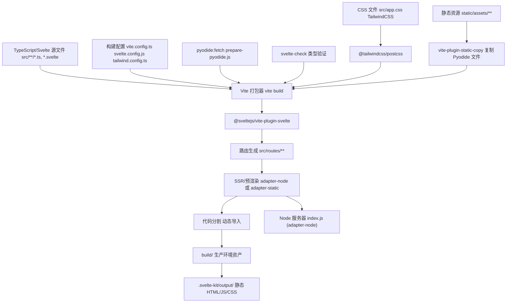
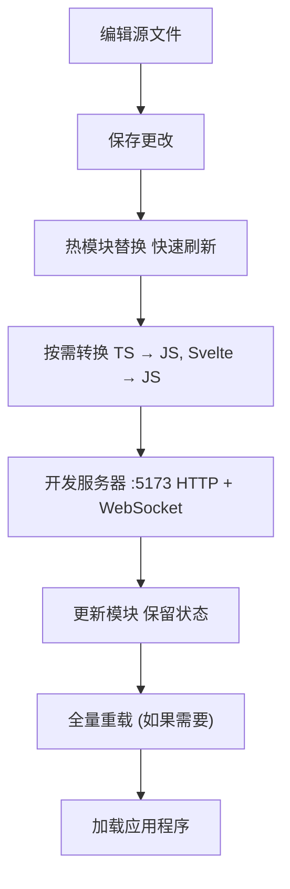
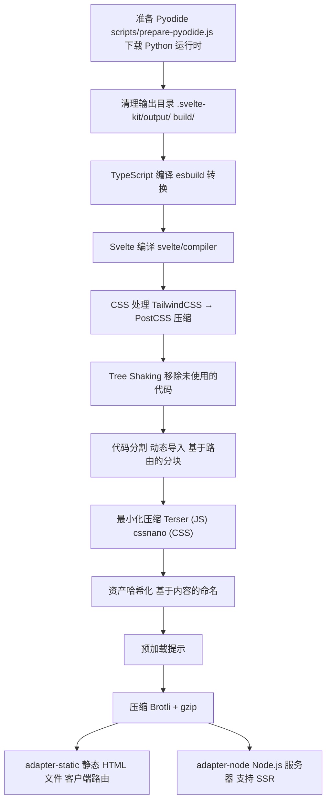
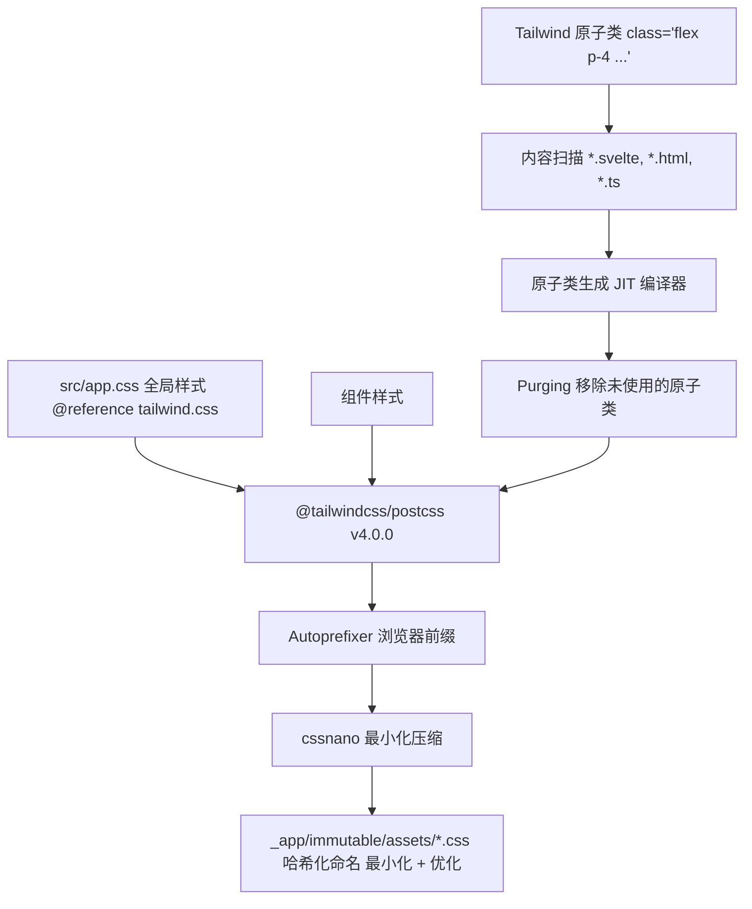
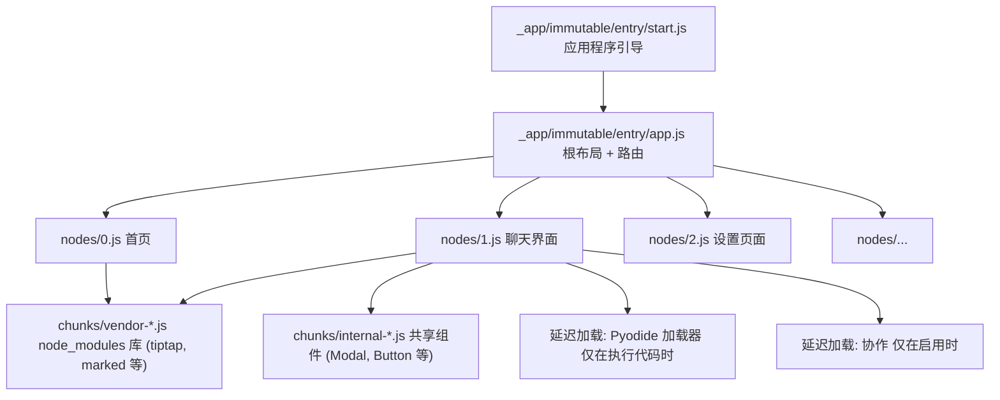

# 构建系统 (Build System)

相关源文件

-   [CHANGELOG.md](https://github.com/open-webui/open-webui/blob/a7271532/CHANGELOG.md)
-   [package-lock.json](https://github.com/open-webui/open-webui/blob/a7271532/package-lock.json)
-   [package.json](https://github.com/open-webui/open-webui/blob/a7271532/package.json)
-   [src/app.css](https://github.com/open-webui/open-webui/blob/a7271532/src/app.css)
-   [src/lib/components/ChangelogModal.svelte](https://github.com/open-webui/open-webui/blob/a7271532/src/lib/components/ChangelogModal.svelte)
-   [src/lib/components/common/RichTextInput.svelte](https://github.com/open-webui/open-webui/blob/a7271532/src/lib/components/common/RichTextInput.svelte)
-   [src/lib/components/icons/XMark.svelte](https://github.com/open-webui/open-webui/blob/a7271532/src/lib/components/icons/XMark.svelte)

## 目的与范围

本文档涵盖了 Open WebUI 的前端构建系统，该系统将 TypeScript/Svelte 源码转换为可用于生产环境的 JavaScript 包 (bundles) 和静态资源。构建系统基于 Vite 和 SvelteKit，通过 `package.json` 进行配置，并支持静态网站生成 (SSG) 以及 Node.js 服务器部署。有关后端 Python 打包与执行的信息，请参阅“后端架构”章节。有关 Docker 容器化和部署配置的信息，请参阅 [Docker 部署选项](/open-webui/open-webui/3.2-docker-deployment-options)。

---

## 构建工具栈

Open WebUI 的前端使用了一套现代化的 JavaScript 工具链，核心是 Vite 5 和 SvelteKit 2：

| 工具 | 版本 | 用途 |
| --- | --- | --- |
| Vite | ^5.4.14 | 构建工具和开发服务器 |
| SvelteKit | ^2.5.27 | 应用程序框架与路由管理 |
| Svelte | ^5.0.0 | 组件框架 |
| TailwindCSS | ^4.0.0 | 原子类优先 (Utility-first) 的 CSS 框架 |
| TypeScript | ^5.5.4 | 类型检查与编译 |
| PostCSS | ^8.4.31 | CSS 处理 |

**SvelteKit 适配器：**

-   `@sveltejs/adapter-static` (^3.0.2): 生成静态 HTML/JS/CSS 文件，用于部署到 CDN 或静态托管。
-   `@sveltejs/adapter-node` (^2.0.0): 创建用于 SSR（服务端渲染）和动态路由的 Node.js 服务器。
-   `@sveltejs/adapter-auto` (3.2.2): 根据部署平台自动选择适配器。

默认适配器由构建时的 SvelteKit 配置确定。在后端提供静态资源的容器化部署中，会使用静态适配器 (static adapter)。

**来源：** [package.json25-51](https://github.com/open-webui/open-webui/blob/a7271532/package.json#L25-L51) [package.json105-132](https://github.com/open-webui/open-webui/blob/a7271532/package.json#L105-L132)

---

## 构建流水线架构


**来源：** [package.json6-11](https://github.com/open-webui/open-webui/blob/a7271532/package.json#L6-L11) [package.json143](https://github.com/open-webui/open-webui/blob/a7271532/package.json#L143-L143)

---

## NPM 脚本参考

构建系统通过 `package.json` 中定义的 npm 脚本进行控制：

### 开发脚本

```bash
"dev": "npm run pyodide:fetch && vite dev --host"
"dev:5050": "npm run pyodide:fetch && vite dev --port 5050"
```
两个开发脚本都会先通过 `scripts/prepare-pyodide.js` 获取 Pyodide 资产（用于浏览器内代码执行的 Python 运行时），然后启动 Vite 开发服务器。`--host` 标志将服务器暴露给网络。开发服务器默认在 5173 端口运行，也可以使用备选的 5050 端口。

**来源：** [package.json6-7](https://github.com/open-webui/open-webui/blob/a7271532/package.json#L6-L7)

### 生产环境构建脚本

```bash
"build": "npm run pyodide:fetch && vite build"
"build:watch": "npm run pyodide:fetch && vite build --watch"
```
`build` 命令执行完整的生产构建流水线：Pyodide 准备 → Vite 打包 → SvelteKit 适配器处理。`--watch` 变体实现了用于开发的增量重建。

**来源：** [package.json8-9](https://github.com/open-webui/open-webui/blob/a7271532/package.json#L8-L9)

### 代码质量脚本

```bash
"lint": "npm run lint:frontend ; npm run lint:types ; npm run lint:backend"
"lint:frontend": "eslint . --fix"
"lint:types": "npm run check"
"check": "svelte-kit sync && svelte-check --tsconfig ./tsconfig.json"
"format": "prettier --plugin-search-dir --write \"**/*.{js,ts,svelte,css,md,html,json}\""
```
Linting 操作会针对 JavaScript/TypeScript 文件运行 ESLint，针对 Svelte 组件运行 `svelte-check` 进行类型验证，并将后端 lint 任务委托给 `pylint`。格式化脚本使用支持 Svelte 插件的 Prettier。

**来源：** [package.json13-18](https://github.com/open-webui/open-webui/blob/a7271532/package.json#L13-L18)

### 测试脚本

```bash
"test:frontend": "vitest --passWithNoTests"
"cy:open": "cypress open"
```
前端单元测试使用 Vitest，而 Cypress 负责处理端到端 (E2E) 测试。`--passWithNoTests` 标志可防止在没有测试用例时导致 CI 失败。

**来源：** [package.json20-21](https://github.com/open-webui/open-webui/blob/a7271532/package.json#L20-L21)

---

## 开发工作流程


**开发服务器特性：**

-   **端口配置**：默认 5173，可通过 `vite dev --port` 配置。
-   **网络访问**：`--host` 标志绑定到 0.0.0.0 以供外部访问。
-   **热模块替换 (HMR)**：无需全量刷新页面即可更新模块。
-   **Source Maps**：用于调试的内联 source maps。
-   **TypeScript**：通过 `esbuild` 实现即时转译。
-   **Svelte 编译**：实时的组件转换。
-   **TailwindCSS**：带有即时更新的 JIT 编译。

Vite 开发服务器将 API 请求代理到默认运行在 8080 端口的后端（在 `vite.config.ts` 中配置），从而在没有 CORS 问题的情况下实现全栈开发。

**来源：** [package.json6-7](https://github.com/open-webui/open-webui/blob/a7271532/package.json#L6-L7)

---

## 生产构建流程

生产构建通过多个优化阶段对源文件进行转换：


**构建输出结构：**

```text
build/
├── _app/
│   ├── immutable/
│   │   ├── chunks/       # 共享的代码分块
│   │   ├── nodes/        # 路由组件包
│   │   ├── entry/        # 应用程序入口点
│   │   └── assets/       # CSS 和静态资产
│   └── version.json      # 构建清单
├── assets/
│   ├── fonts/           # 网页字体
│   ├── pyodide/         # Python 运行时
│   └── ...              # 其它静态资产
└── index.html           # 入口 HTML (adapter-static)
```
**构建配置：**

-   **目标 (Target)**：面向现代浏览器的 ES2020+。
-   **分块大小警告**：500 KB 阈值。
-   **Source Maps**：生产环境中可选的外部 `.map` 文件。
-   **资产内联**：小于 4KB 的文件以内联数据 URI 形式包含。

**来源：** [package.json8-9](https://github.com/open-webui/open-webui/blob/a7271532/package.json#L8-L9) [package.json22](https://github.com/open-webui/open-webui/blob/a7271532/package.json#L22-L22)

---

## 资产流水线 (Asset Pipeline)

### Pyodide 准备

在每次构建之前，`pyodide:fetch` 脚本会下载 Pyodide JavaScript 发行版（基于 WebAssembly 的 Python 运行时），用于浏览器内的代码执行：

```bash
"pyodide:fetch": "node scripts/prepare-pyodide.js"
```
该脚本执行以下操作：

1.  下载与 [package.json132](https://github.com/open-webui/open-webui/blob/a7271532/package.json#L132-L132) 中指定的版本（当前为 ^0.28.2）匹配的 Pyodide 包。
2.  将分发文件解压到暂存目录。
3.  将必要的文件复制到 `static/assets/pyodide/`。
4.  验证文件的完整性。

随后，Pyodide 资产将作为静态文件提供，并在用户在 UI 中执行 Python 代码时按需加载。

**来源：** [package.json22](https://github.com/open-webui/open-webui/blob/a7271532/package.json#L22-L22) [package.json132](https://github.com/open-webui/open-webui/blob/a7271532/package.json#L132-L132)

### 字体加载

自定义字体存储在 `static/assets/fonts/` 中，并通过 `@font-face` 声明加载：

```css
@font-face {
    font-family: 'Inter';
    src: url('/assets/fonts/Inter-Variable.ttf');
    font-display: swap;
}
```
`font-display: swap` 属性确保在字体加载期间文本保持可见。配置了五种字体族：

-   **Inter**: 默认 UI 字体 (可变字体)。
-   **Archivo**: 备选 UI 字体 (可变字体)。
-   **Mona Sans**: 展示字体。
-   **InstrumentSerif**: 次要/点缀字体。
-   **Vazirmatn**: 自右向左语言支持 (可变字体)。

**来源：** [src/app.css3-31](https://github.com/open-webui/open-webui/blob/a7271532/src/app.css#L3-L31)

### 静态资产复制

`vite-plugin-static-copy` 插件负责复制不需要处理的静态资产：

```json
"vite-plugin-static-copy": "^2.2.0"
```
这通常包括：

-   Pyodide 分发文件。
-   大型二进制资产。
-   预编译的库。
-   Service worker 脚本。

**来源：** [package.json143](https://github.com/open-webui/open-webui/blob/a7271532/package.json#L143-L143)

---

## SvelteKit 适配器配置

Open WebUI 通过 SvelteKit 适配器支持两种部署模式：

### Adapter-Static (静态适配器)

生成一个具有客户端路由功能的完全静态的站点：

```json
"@sveltejs/adapter-static": "^3.0.2"
```
**输出特征：**

-   为所有路由预渲染 HTML。
-   无服务端代码执行。
-   可部署到任何静态主机（CDN, S3, GitHub Pages）。
-   通过 `pushState` 进行客户端导航。

**用例：** 当 Open WebUI 作为静态资产部署，并由 Python 后端（处理所有 API 请求）提供服务时。这是 Docker 部署的默认方式。

**来源：** [package.json107](https://github.com/open-webui/open-webui/blob/a7271532/package.json#L107-L107)

### Adapter-Node (Node 适配器)

创建一个具有 SSR 能力的 Node.js 服务器：

```json
"@sveltejs/adapter-node": "^2.0.0"
```
**输出特征：**

-   Node.js HTTP 服务器 (`index.js`)。
-   页面的服务端渲染。
-   动态路由处理。
-   需要 Node.js 运行时。

**用例：** 独立的前端服务器，或出于 SEO 或初始页面加载性能考虑而需要 SSR 时。

**来源：** [package.json65](https://github.com/open-webui/open-webui/blob/a7271532/package.json#L65-L65)

### 适配器选择

适配器在 `svelte.config.js` 中配置。如需自动检测平台：

```json
"@sveltejs/adapter-auto": "3.2.2"
```
该适配器会根据部署环境（Vercel, Netlify, Cloudflare Pages 等）自动选择适当的部署策略。

**来源：** [package.json106](https://github.com/open-webui/open-webui/blob/a7271532/package.json#L106-L106)

---

## CSS 构建流水线


**TailwindCSS v4 特性：**

-   **Lightning CSS**：使用原生的基于 Rust 的处理器实现更快的编译。
-   **JIT 编译**：仅生成使用的原子类。
-   **PostCSS 插件**：`@tailwindcss/postcss` (^4.0.0) 与构建流水线集成。
-   **Typography 插件**：`@tailwindcss/typography` (^0.5.13) 用于文章样式设置。
-   **容器查询 (Container Queries)**：`@tailwindcss/container-queries` (^0.1.1) 用于响应式容器。

**自定义 CSS 架构：** 应用程序定义了多个用于富文本渲染的文章 (prose) 类：

-   `.input-prose`：编辑器输入样式。
-   `.markdown-prose`：Markdown 内容渲染样式。
-   `.markdown-prose-sm` / `.markdown-prose-xs`：尺寸变体。

这些类应用了 Tailwind 的 typography 插件，并带有针对间距和颜色的自定义覆盖。

**来源：** [src/app.css1](https://github.com/open-webui/open-webui/blob/a7271532/src/app.css#L1-L1) [src/app.css97-115](https://github.com/open-webui/open-webui/blob/a7271532/src/app.css#L97-L115) [package.json110-112](https://github.com/open-webui/open-webui/blob/a7271532/package.json#L110-L112)

---

## TypeScript 编译

TypeScript 类型检查与构建流程是分开进行的：

```bash
"check": "svelte-kit sync && svelte-check --tsconfig ./tsconfig.json"
"check:watch": "svelte-kit sync && svelte-check --tsconfig ./tsconfig.json --watch"
```
**类型检查流水线：**

1.  **svelte-kit sync**：生成包含路由类型定义的 `.svelte-kit/types/`。
2.  **svelte-check**：验证 `.ts` 文件和 `<script lang="ts">` 块中的 TypeScript 代码。
3.  **tsconfig.json**：配置 TypeScript 编译器选项（严格模式、ES2020 目标等）。

**注意**：Vite 使用 `esbuild` 进行快速转译而不进行类型检查。除非显式运行 `svelte-check`，否则类型错误不会阻止开发服务器运行或构建。

**TypeScript 依赖项：**

```json
"typescript": "^5.5.4"
"@typescript-eslint/eslint-plugin": "^8.31.1"
"@typescript-eslint/parser": "^8.31.1"
```
**来源：** [package.json11-12](https://github.com/open-webui/open-webui/blob/a7271532/package.json#L11-L12) [package.json130](https://github.com/open-webui/open-webui/blob/a7271532/package.json#L130-L130) [package.json113-114](https://github.com/open-webui/open-webui/blob/a7271532/package.json#L113-L114)

---

## 代码检查与格式化 (Linting and Formatting)

### ESLint 配置

```bash
"lint:frontend": "eslint . --fix"
```
检查工具栈包括：

-   **ESLint** (^8.56.0)：核心检查引擎。
-   **@typescript-eslint/eslint-plugin** (^8.31.1)：TypeScript 特定规则。
-   **eslint-plugin-svelte** (^2.45.1)：Svelte 组件检查。
-   **eslint-config-prettier** (^9.1.0)：禁用冲突的 ESLint 规则。

带有 `--fix` 的 ESLint 会自动纠正诸如缺少分号、引号风格和导入顺序等问题。

**来源：** [package.json14](https://github.com/open-webui/open-webui/blob/a7271532/package.json#L14-L14) [package.json116-119](https://github.com/open-webui/open-webui/blob/a7271532/package.json#L116-L119)

### Prettier 格式化

```bash
"format": "prettier --plugin-search-dir --write \"**/*.{js,ts,svelte,css,md,html,json}\""
"format:backend": "black . --exclude \".venv/|/venv/\""
```
Prettier 负责跨多种文件类型的代码格式化，并支持 Svelte 插件：

-   **prettier** (^3.3.3)：核心格式化程序。
-   **prettier-plugin-svelte** (^3.2.6)：Svelte 组件格式化。

后端使用 `black` 进行 Python 格式化，在整个代码库中保持一致的风格。

**来源：** [package.json17-18](https://github.com/open-webui/open-webui/blob/a7271532/package.json#L17-L18) [package.json122-123](https://github.com/open-webui/open-webui/blob/a7271532/package.json#L122-L123)

---

## 测试基础设施

### Vitest (单元测试)

```bash
"test:frontend": "vitest --passWithNoTests"
```
Vitest 提供：

-   **快速执行**：原生的 ESM 支持，速度快于 Jest。
-   **Vite 集成**：共享 Vite 配置和转换操作。
-   **组件测试**：隔离测试 Svelte 组件。
-   **覆盖率**：通过 c8 实现内置的代码覆盖率统计。

`--passWithNoTests` 标志确保在没有测试文件时 CI 流水线不会失败。

**来源：** [package.json21](https://github.com/open-webui/open-webui/blob/a7271532/package.json#L21-L21) [package.json133](https://github.com/open-webui/open-webui/blob/a7271532/package.json#L133-L133)

### Cypress (E2E 测试)

```bash
"cy:open": "cypress open"
```
Cypress 负责端到端的浏览器测试：

-   **浏览器自动化**：在真实浏览器（Chrome, Firefox, Edge）中测试。
-   **交互式调试**：Cypress UI 中的时间旅行调试。
-   **网络打桩 (Stubbing)**：模拟 API 响应。
-   **视觉回归**：屏幕截图对比。

Cypress 配置和测试文件存储在 `cypress/` 目录下。

**来源：** [package.json20](https://github.com/open-webui/open-webui/blob/a7271532/package.json#L20-L20) [package.json115](https://github.com/open-webui/open-webui/blob/a7271532/package.json#L115-L115)

---

## 构建性能优化

### 代码分割策略

SvelteKit 会根据路由和动态导入自动拆分代码：


**分块优化：**

-   **Vendor 分割**：大型库（Tiptap, ProseMirror, marked 等）被单独打包。
-   **基于路由**：每个页面仅加载其所需的代码。
-   **手动分块**：关键的共享组件被预加载以避免瀑布流式请求。
-   **懒加载**：像 Pyodide 和协作这样的重型特性会按需加载。

[src/lib/components/common/RichTextInput.svelte680](https://github.com/open-webui/open-webui/blob/a7271532/src/lib/components/common/RichTextInput.svelte#L680-L680) 中的 **动态导入示例**：

```javascript
if (collaboration && documentId && socket && user) {
    const { SocketIOCollaborationProvider } = await import('./RichTextInput/Collaboration');
    provider = new SocketIOCollaborationProvider(documentId, socket, user, content);
}
```
**来源：** [src/lib/components/common/RichTextInput.svelte679-682](https://github.com/open-webui/open-webui/blob/a7271532/src/lib/components/common/RichTextInput.svelte#L679-L682)

### 包体分析 (Bundle Analysis)

分析包体大小和组成：

```bash
# 执行带有包体分析的构建
npm run build
# 检查 .svelte-kit/output/client/_app/immutable/
```
Vite 会生成一份 `stats.html` 报告（如果已配置），显示：

-   压缩前后的模块大小。
-   依赖关系。
-   跨分块的重复代码。

---

## 依赖管理

### 依赖更新策略

项目使用 npm 进行包管理，并通过锁定文件实现可重现的构建：

```json
"lockfileVersion": 3
```
**版本约束：**

-   **插入符 (^)**：允许次版本和修订号更新（例如 `^5.4.14` → 5.x.x）。
-   **波浪号 (~)**：仅允许修订号更新（例如 `~2.1.19` → 2.1.x）。
-   **确切版本**：不允许自动更新（在 Open WebUI 中较少见）。

**Node.js 要求：**

```json
"engines": {
    "node": ">=18.13.0 <=22.x.x",
    "npm": ">=6.0.0"
}
```
应用程序需要 Node.js 18.13+ (LTS)，并已在 Node.js 22.x 上进行了测试。

**来源：** [package.json149-152](https://github.com/open-webui/open-webui/blob/a7271532/package.json#L149-L152) [package-lock.json4](https://github.com/open-webui/open-webui/blob/a7271532/package-lock.json#L4-L4)

### 关键依赖项

**UI 框架：**

-   `svelte` (^5.0.0)：核心响应式框架。
-   `@sveltejs/kit` (^2.5.27)：全栈框架。
-   `@sveltejs/vite-plugin-svelte` (^4.0.0)：Vite 集成。

**构建工具：**

-   `vite` (^5.4.14)：构建工具和开发服务器。
-   `tailwindcss` (^4.0.0)：原子类优先的 CSS。
-   `postcss` (^8.4.31)：CSS 转换。

**富文本编辑：**

-   `@tiptap/core` (^3.0.7)：无头编辑器框架。
-   `@tiptap/starter-kit` (^3.0.7)：必备扩展。
-   `marked` (^9.1.0)：Markdown 解析器。
-   `turndown` (^7.2.0)：HTML 转 Markdown 转换器。

**代码执行：**

-   `pyodide` (^0.28.2)：WebAssembly 中的 Python。
-   `@pyscript/core` (^0.4.32)：PyScript 运行时。

**状态管理：**

-   使用 Svelte stores（不使用 Redux/Zustand 等外部库）。

**来源：** [package.json44-147](https://github.com/open-webui/open-webui/blob/a7271532/package.json#L44-L147) [package.json7-51](https://github.com/open-webui/open-webui/blob/a7271532/package.json#L7-L51)

---

## 持续集成构建

典型的 CI 流水线配置：

```yaml
# GitHub Actions 工作流示例
- name: 安装依赖
  run: npm ci

- name: 类型检查
  run: npm run check

- name: 代码检查 (Lint)
  run: npm run lint:frontend

- name: 测试
  run: npm run test:frontend

- name: 构建
  run: npm run build
```
**与本地开发的关键区别：**

-   `npm ci` (干净安装) 而非 `npm install` 确保使用确切的锁定文件版本。
-   在继续构建之前，所有检查必须通过。
-   构建产物会被缓存以用于部署。

**来源：** [package.json6-22](https://github.com/open-webui/open-webui/blob/a7271532/package.json#L6-L22)

---

## 构建输出与部署

### 静态适配器输出 (Static Adapter Output)

使用 `adapter-static` 时，构建会产生：

```text
build/
├── index.html               # 入口点
├── _app/
│   ├── immutable/
│   │   ├── entry/
│   │   │   ├── start.*.js   # ~15 KB (gzip 压缩后)
│   │   │   └── app.*.js     # ~25 KB (gzip 压缩后)
│   │   ├── chunks/
│   │   │   ├── vendor-*.js  # ~200-400 KB (gzip 压缩后)
│   │   │   └── *.js         # 多种共享分块
│   │   ├── nodes/
│   │   │   └── *.js         # 每个路由的包
│   │   └── assets/
│   │       └── *.css        # 打包后的样式
│   └── version.json         # 用于清除缓存的清单文件
└── assets/                  # 静态资产 (字体, pyodide 等)
```
Python 后端从 `build/` 目录提供这些文件。在初始 HTML 加载后，所有路由均使用客户端路由。

**来源：** [package.json107](https://github.com/open-webui/open-webui/blob/a7271532/package.json#L107-L107)

### Node 适配器输出 (Node Adapter Output)

使用 `adapter-node` 时，构建会产生：

```text
build/
├── index.js                 # Node.js 服务器入口
├── server/
│   └── chunks/              # 服务端代码
├── client/                  # 与静态适配器相同
│   └── _app/
└── prerendered/             # 预渲染的静态页面
```
可以直接运行 `index.js` 服务器：

```bash
node build/index.js
```
通过环境变量（PORT, HOST 等）配置服务器。

**来源：** [package.json65](https://github.com/open-webui/open-webui/blob/a7271532/package.json#L65-L65)

---

## 版本管理与更新日志

### 版本常量

应用程序版本定义在多个位置：

-   `package.json`：`"version": "0.6.43"`。
-   后端常量：`WEBUI_VERSION`（从 Python 导入）。
-   前端常量：从 `$lib/constants` 导入的 `WEBUI_VERSION`。

这些在发布期间必须保持同步。

**来源：** [package.json3](https://github.com/open-webui/open-webui/blob/a7271532/package.json#L3-L3) [CHANGELOG.md8](https://github.com/open-webui/open-webui/blob/a7271532/CHANGELOG.md#L8-L8)

### 更新日志显示

ChangelogModal 组件获取并显示发行说明：

```javascript
// 从后端 API 获取更新日志数据
changelog = await getChangelog();
```
更新日志源自 [CHANGELOG.md](https://github.com/open-webui/open-webui/blob/a7271532/CHANGELOG.md)，并由后端处理为结构化 JSON。模态框显示带有分类更改（Added, Fixed, Changed, Removed）的版本历史，并使用 DOMPurify 清理渲染后的 HTML。

**版本跟踪：**

-   `localStorage.version`：用户最后看到的版本。
-   `$config.version`：当前的后端版本。
-   当版本不匹配时，更新日志模态框会自动显示。

**来源：** [src/lib/components/ChangelogModal.svelte9-24](https://github.com/open-webui/open-webui/blob/a7271532/src/lib/components/ChangelogModal.svelte#L9-L24) [src/lib/components/ChangelogModal.svelte42-44](https://github.com/open-webui/open-webui/blob/a7271532/src/lib/components/ChangelogModal.svelte#L42-L44) [CHANGELOG.md1-120](https://github.com/open-webui/open-webui/blob/a7271532/CHANGELOG.md#L1-L120)

---

## 构建定制

### Vite 配置扩展

`vite.config.ts` 中的常用定制：

**API 代理：**

```typescript
server: {
    proxy: {
        '/api': 'http://localhost:8080',
        '/ollama': 'http://localhost:11434'
    }
}
```
**优化：**

```typescript
build: {
    rollupOptions: {
        output: {
            manualChunks: {
                'vendor-tiptap': ['@tiptap/core', '@tiptap/starter-kit', ...],
                'vendor-prose': ['marked', 'turndown', 'dompurify']
            }
        }
    },
    chunkSizeWarningLimit: 1000
}
```
### 环境特定构建

可以通过环境变量定制构建行为：

```bash
# 使用特定后端进行开发
VITE_API_BASE_URL=https://api.example.com npm run dev

# 使用自定义基础路径进行生产环境构建
BASE=/app npm run build
```
**来源：** 配置位于 `vite.config.ts`（文件中未提供）。

---

## 常见构建问题故障排除

### 构建失败

**症状**：`npm run build` 失败并提示 "Cannot find module"
**解决方案**：运行 `npm ci` 以确保所有依赖项与锁定文件匹配。

**症状**：构建期间出现类型错误
**解决方案**：单独运行 `npm run check` 以识别 TypeScript 问题。

**症状**：构建期间内存溢出
**解决方案**：增加 Node.js 堆内存：`NODE_OPTIONS=--max-old-space-size=4096 npm run build`。

### 开发服务器问题

**症状**：HMR 对 Svelte 组件无效
**解决方案**：检查 Vite 开发服务器日志中的编译错误，重启服务器。

**症状**：开发环境中 Pyodide 未加载
**解决方案**：运行 `npm run pyodide:fetch` 以确保文件已下载。

**症状**：CSS 更改未生效
**解决方案**：TailwindCSS 可能需要重建；重启开发服务器或检查 `tailwind.config.ts` 中的内容路径。

---

## 构建系统演进

构建系统经历了多次重大转型：

1.  **早期版本**：基于 Webpack 的构建（已不再使用）。
2.  **当前 (v0.6.x)**：Vite 5 + SvelteKit 2 + Svelte 5。
3.  **近期升级**：
    -   升级到 Svelte 5（基于 runes 的响应式）。
    -   迁移到使用 Lightning CSS 的 TailwindCSS v4。
    -   更新到用于富文本编辑的 Tiptap v3。

**v0.6.42+ 中的破坏性变更**：根据 [CHANGELOG.md112-114](https://github.com/open-webui/open-webui/blob/a7271532/CHANGELOG.md#L112-L114)，由于数据库架构更改，构建系统现在要求在多节点部署中同时进行更新。这会影响滚动更新策略。

**来源：** [CHANGELOG.md112-120](https://github.com/open-webui/open-webui/blob/a7271532/CHANGELOG.md#L112-L120) [package.json44](https://github.com/open-webui/open-webui/blob/a7271532/package.json#L44-L44) [package.json128](https://github.com/open-webui/open-webui/blob/a7271532/package.json#L128-L128)
