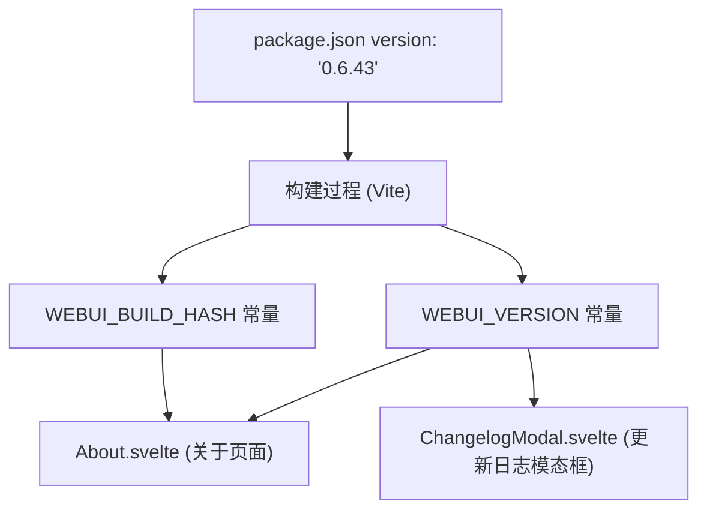
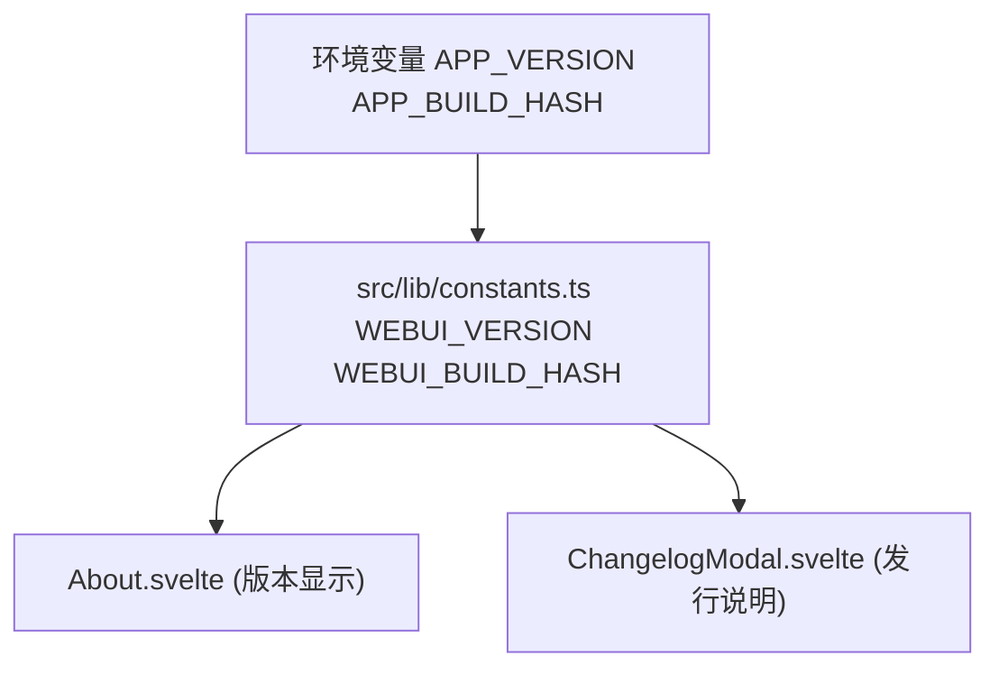
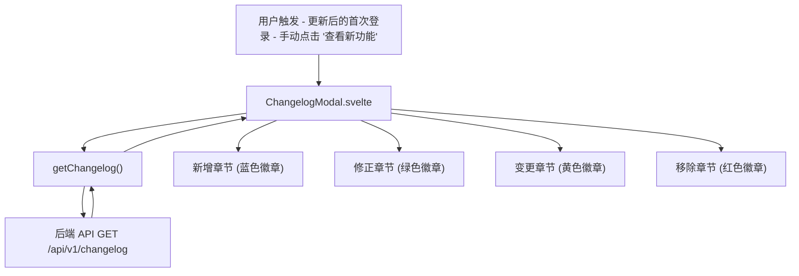
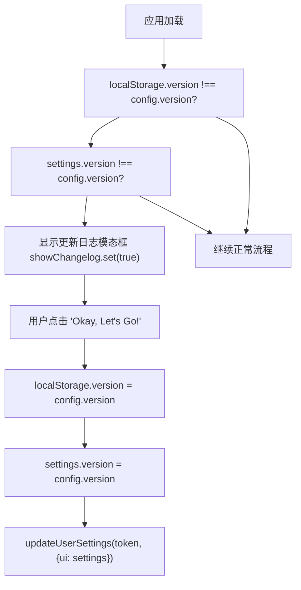
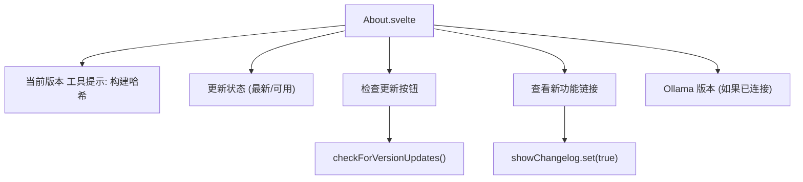

# 更新日志与版本控制 (Changelog and Versioning)

相关源文件

-   [CHANGELOG.md](https://github.com/open-webui/open-webui/blob/a7271532/CHANGELOG.md)
-   [LICENSE](https://github.com/open-webui/open-webui/blob/a7271532/LICENSE)
-   [README.md](https://github.com/open-webui/open-webui/blob/a7271532/README.md)
-   [TROUBLESHOOTING.md](https://github.com/open-webui/open-webui/blob/a7271532/TROUBLESHOOTING.md)
-   [docs/apache.md](https://github.com/open-webui/open-webui/blob/a7271532/docs/apache.md)
-   [package-lock.json](https://github.com/open-webui/open-webui/blob/a7271532/package-lock.json)
-   [package.json](https://github.com/open-webui/open-webui/blob/a7271532/package.json)
-   [src/app.css](https://github.com/open-webui/open-webui/blob/a7271532/src/app.css)
-   [src/lib/components/ChangelogModal.svelte](https://github.com/open-webui/open-webui/blob/a7271532/src/lib/components/ChangelogModal.svelte)
-   [src/lib/components/chat/Settings/About.svelte](https://github.com/open-webui/open-webui/blob/a7271532/src/lib/components/chat/Settings/About.svelte)
-   [src/lib/components/common/RichTextInput.svelte](https://github.com/open-webui/open-webui/blob/a7271532/src/lib/components/common/RichTextInput.svelte)
-   [src/lib/components/icons/XMark.svelte](https://github.com/open-webui/open-webui/blob/a7271532/src/lib/components/icons/XMark.svelte)
-   [src/lib/constants.ts](https://github.com/open-webui/open-webui/blob/a7271532/src/lib/constants.ts)

## 目的与范围

本文档描述了 Open WebUI 的版本控制系统、更新日志管理以及版本更新检查机制。它涵盖了语义化版本控制方案、CHANGELOG.md 文件的结构与维护、版本常量定义、版本检查 API，以及面向用户的更新日志显示系统。

有关版本构建与发布的信息，请参阅 [构建系统](/open-webui/open-webui/18.3-build-system)。有关通用配置管理的信息，请参阅 [配置管理](/open-webui/open-webui/11-configuration-management)。

---

## 语义化版本控制方案

Open WebUI 遵循 [语义化版本控制 2.0.0 (Semantic Versioning 2.0.0)](https://semver.org/lang/zh-CN/spec/v2.0.0.html) 进行版本编号。版本号采用 `主版本号.次版本号.修订号` (例如 `0.6.43`) 的格式：

-   **主版本号 (MAJOR)**：当做了不兼容的 API 修改或重大架构调整时更新。
-   **次版本号 (MINOR)**：当做了向下兼容的功能性新增时更新。
-   **修订号 (PATCH)**：当做了向下兼容的问题修正时更新。

当前版本定义在 [package.json3](https://github.com/open-webui/open-webui/blob/a7271532/package.json#L3-L3) 中，并在整个应用程序中作为常量导出。版本方案在 [CHANGELOG.md5-6](https://github.com/open-webui/open-webui/blob/a7271532/CHANGELOG.md#L5-L6) 中有明确说明，该文件引用了“Keep a Changelog”格式和语义化版本控制规范。

### 版本号存储


**来源：** [package.json3](https://github.com/open-webui/open-webui/blob/a7271532/package.json#L3-L3) [src/lib/constants.ts16-17](https://github.com/open-webui/open-webui/blob/a7271532/src/lib/constants.ts#L16-L17) [src/lib/components/chat/Settings/About.svelte4](https://github.com/open-webui/open-webui/blob/a7271532/src/lib/components/chat/Settings/About.svelte#L4-L4)

---

## CHANGELOG.md 结构

更新日志遵循 [Keep a Changelog](https://keepachangelog.com/en/1.1.0/) 格式，按版本和类别组织变更。每个版本条目包含：

-   **版本标题**：`## [版本号] - YYYY-MM-DD` 格式。
-   **类别章节**：Added (新增), Fixed (修正), Changed (变更), Removed (移除)。
-   **变更条目**：包含提交链接和议题引用的详细描述。

### 更新日志格式示例

```markdown
## [0.6.43] - 2025-12-22

### Added
- 📚 知识库文件管理进行了全面重构，支持服务端分页...

### Fixed
- ⚡ 优化了外部重排序器的操作...

### Changed
- ⚠️ 此版本包含数据库架构更改...
```
每个变更条目都遵循一致的格式：

1.  **表情符号前缀**：直观地对变更类型进行分类。
2.  **描述**：对变更内容进行清晰、简洁的说明。
3.  **技术细节**：面向开发人员的实现说明。
4.  **链接**：提交哈希、议题编号和拉取请求 (PR) 引用。

**来源：** [CHANGELOG.md1-6](https://github.com/open-webui/open-webui/blob/a7271532/CHANGELOG.md#L1-L6) [CHANGELOG.md8-120](https://github.com/open-webui/open-webui/blob/a7271532/CHANGELOG.md#L8-L120)

---

## 版本常量与构建信息

Open WebUI 通过常量模块中定义的两个主要常量公开版本信息：

### 版本常量

```javascript
export const WEBUI_VERSION = APP_VERSION;
export const WEBUI_BUILD_HASH = APP_BUILD_HASH;
```
这些常量分别是：

-   **`WEBUI_VERSION`**：来自 package.json 的语义化版本字符串（例如 `"0.6.43"`）。
-   **`WEBUI_BUILD_HASH`**：在构建时注入的 Git 提交哈希或构建标识符。

`APP_VERSION` 和 `APP_BUILD_HASH` 变量在构建过程中作为环境变量注入，使得版本信息在整个应用程序中可用，而无需直接导入 package.json。

### 版本常量使用模式


**来源：** [src/lib/constants.ts16-17](https://github.com/open-webui/open-webui/blob/a7271532/src/lib/constants.ts#L16-L17) [src/lib/components/chat/Settings/About.svelte4](https://github.com/open-webui/open-webui/blob/a7271532/src/lib/components/chat/Settings/About.svelte#L4-L4) [src/lib/components/ChangelogModal.svelte9](https://github.com/open-webui/open-webui/blob/a7271532/src/lib/components/ChangelogModal.svelte#L9-L9)

---

## 版本检查机制

Open WebUI 包含一个可选的版本更新检查系统，该系统会将当前版本与后端 API 提供的最新可用版本进行比较。

### 版本检查流程

> **[Mermaid sequence]**
> *(图表结构无法解析)*

### 版本比较逻辑

`compareVersion()` 工具函数通过比较两个语义化版本字符串来确定是否有更新可用。它返回：

-   `true`：如果第一个版本大于第二个版本（有更新可用）。
-   `false`：如果版本相等或第一个版本较旧。

版本检查受 `config.features.enable_version_update_check` 标志控制，并在 About 组件的 `onMount` 生命周期中执行：

```javascript
if ($config?.features?.enable_version_update_check) {
    checkForVersionUpdates();
}
```
当检测到更新时，UI 会显示一个指向 GitHub 发布页面的链接，文本为 `"(v{latest} available!)"`。

**来源：** [src/lib/components/chat/Settings/About.svelte21-44](https://github.com/open-webui/open-webui/blob/a7271532/src/lib/components/chat/Settings/About.svelte#L21-L44) [src/lib/components/chat/Settings/About.svelte63-74](https://github.com/open-webui/open-webui/blob/a7271532/src/lib/components/chat/Settings/About.svelte#L63-L74)

---

## 更新日志显示系统

更新日志通过一个模态框组件呈现给用户，该组件从后端 API 获取并显示格式化的发行说明。

### 更新日志模态框架构


### 更新日志数据结构

后端 API 返回一个结构化的 JSON 对象，其中每个版本都是一个键，包含：

```json
{
  "0.6.43": {
    "date": "2025-12-22",
    "added": [
      { "raw": "<p>📚 知识库文件管理...</p>" }
    ],
    "fixed": [
      { "raw": "<p>⚡ 优化了外部重排序器的操作...</p>" }
    ],
    "changed": [...],
    "removed": [...]
  }
}
```
每个条目的 `raw` 属性包含预渲染的 HTML（已使用 DOMPurify 进行清理），直接在模态框中显示。

### 更新日志模态框组件结构

更新日志模态框组件 [src/lib/components/ChangelogModal.svelte](https://github.com/open-webui/open-webui/blob/a7271532/src/lib/components/ChangelogModal.svelte) 实现了：

1.  **初始化**：模态框打开时获取更新日志数据 ([src/lib/components/ChangelogModal.svelte22-28](https://github.com/open-webui/open-webui/blob/a7271532/src/lib/components/ChangelogModal.svelte#L22-L28))。
2.  **版本显示**：在页眉中显示 `WEBUI_VERSION` ([src/lib/components/ChangelogModal.svelte56](https://github.com/open-webui/open-webui/blob/a7271532/src/lib/components/ChangelogModal.svelte#L56-L56))。
3.  **类别渲染**：遍历版本和章节，并显示带有颜色代码的徽章 ([src/lib/components/ChangelogModal.svelte73-87](https://github.com/open-webui/open-webui/blob/a7271532/src/lib/components/ChangelogModal.svelte#L73-L87))。
4.  **HTML 清理**：使用 DOMPurify 安全地渲染更新日志 HTML ([src/lib/components/ChangelogModal.svelte92](https://github.com/open-webui/open-webui/blob/a7271532/src/lib/components/ChangelogModal.svelte#L92-L92))。
5.  **版本持久化**：关闭模态框时更新 localStorage 和用户设置 ([src/lib/components/ChangelogModal.svelte106-109](https://github.com/open-webui/open-webui/blob/a7271532/src/lib/components/ChangelogModal.svelte#L106-L109))。

**来源：** [src/lib/components/ChangelogModal.svelte1-118](https://github.com/open-webui/open-webui/blob/a7271532/src/lib/components/ChangelogModal.svelte#L1-L118) [src/lib/components/chat/Settings/About.svelte78-84](https://github.com/open-webui/open-webui/blob/a7271532/src/lib/components/chat/Settings/About.svelte#L78-L84)

---

## 版本更新通知流程

在版本更新后，Open WebUI 会自动向用户显示更新日志模态框。该行为通过比较存储的版本号来控制。

### 自动显示更新日志逻辑


### 版本存储位置

应用程序在三个位置跟踪版本信息：

1.  **`config.version`**：来自后端配置的当前应用程序版本。
2.  **`localStorage.version`**：存储在浏览器中的上次看到的版本。
3.  **`settings.version`**：持久化到后端数据库的用户设置。

当用户关闭更新日志模态框时，所有三处都会同步：

```javascript
localStorage.version = $config.version;
await settings.set({ ...$settings, ...{ version: $config.version } });
await updateUserSettings(localStorage.token, { ui: $settings });
```
这种三方同步确保了：

-   刷新页面后模态框不会重复出现。
-   用户的“已看版本”可以跨设备持久存在。
-   每次版本更新仅触发一次通知。

**来源：** [src/lib/components/ChangelogModal.svelte42-44](https://github.com/open-webui/open-webui/blob/a7271532/src/lib/components/ChangelogModal.svelte#L42-L44) [src/lib/components/ChangelogModal.svelte106-109](https://github.com/open-webui/open-webui/blob/a7271532/src/lib/components/ChangelogModal.svelte#L106-L109)

---

## 手动查看更新日志

用户可以随时通过“设置”界面手动查看更新日志：

### 查看路径

1.  导航到 **设置** (齿轮图标)。
2.  选择 **关于** 标签页。
3.  点击 **“查看新功能”** 链接。

“查看新功能”按钮被实现为一个简单的动作，将 `showChangelog` store 设置为 `true`：

```html
<button on:click={() => { showChangelog.set(true); }}>
    <div>{$i18n.t("See what's new")}</div>
</button>
```
这使得用户可以立即访问所有版本的发行说明，而无需触发版本不匹配条件。

**来源：** [src/lib/components/chat/Settings/About.svelte77-84](https://github.com/open-webui/open-webui/blob/a7271532/src/lib/components/chat/Settings/About.svelte#L77-L84)

---

## 版本信息显示

“关于”组件向用户提供全面的版本信息：

### 显示的信息

| 字段 | 来源 | 描述 |
| --- | --- | --- |
| **版本号** | `WEBUI_VERSION` | 语义化版本（例如 "0.6.43"） |
| **构建哈希** | `WEBUI_BUILD_HASH` | Git 提交哈希（悬停时显示工具提示） |
| **更新状态** | `compareVersion()` 结果 | "(vX.X.X available!)" 或 "(latest)" |
| **Ollama 版本** | `getOllamaVersion()` API | 已连接的 Ollama 服务器版本 |

### 版本显示组件结构


版本工具提示使用 Tooltip 组件实现，悬停时会揭示构建哈希：

```html
<Tooltip content={WEBUI_BUILD_HASH}>
    v{WEBUI_VERSION}
</Tooltip>
```
这允许技术用户识别确切的构建版本，同时保持普通用户界面的整洁。

**来源：** [src/lib/components/chat/Settings/About.svelte47-98](https://github.com/open-webui/open-webui/blob/a7271532/src/lib/components/chat/Settings/About.svelte#L47-L98) [src/lib/components/common/Tooltip.svelte](https://github.com/open-webui/open-webui/blob/a7271532/src/lib/components/common/Tooltip.svelte)