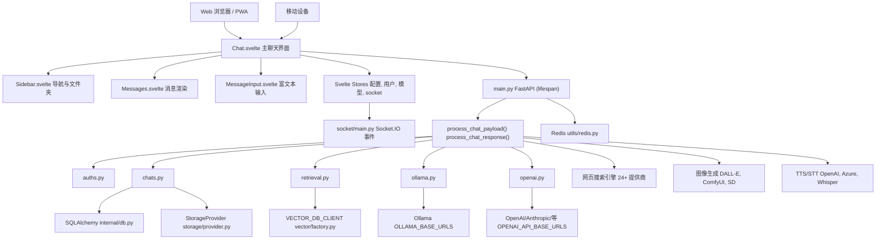
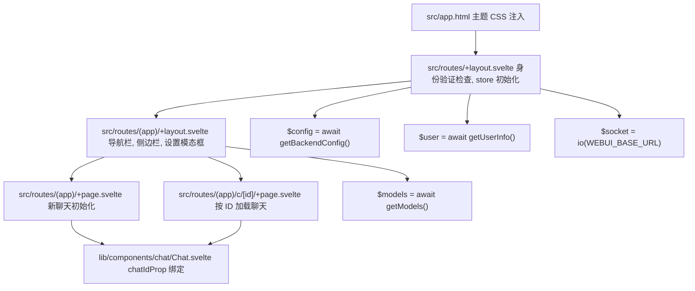
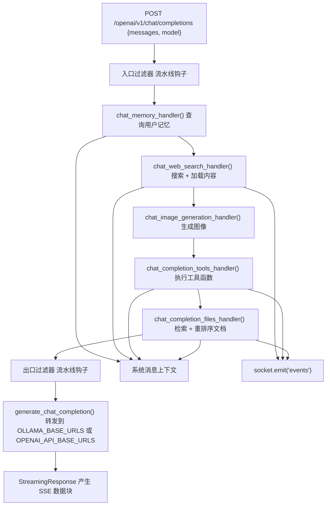
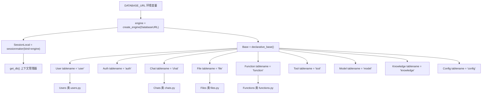
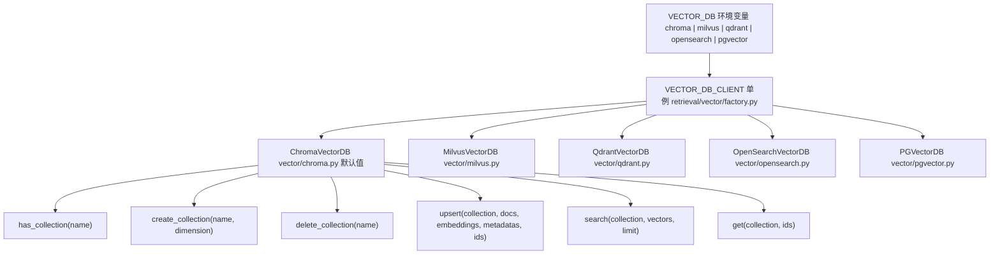
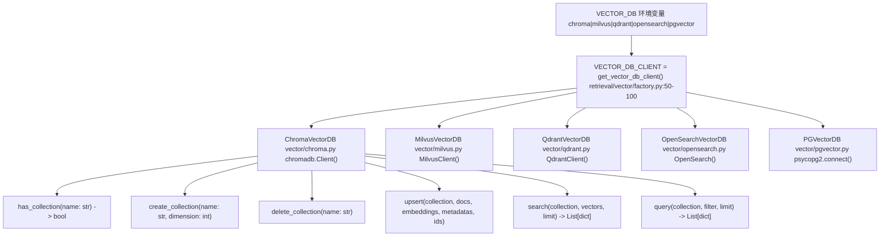
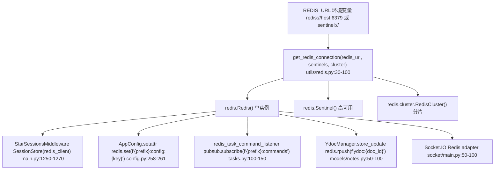
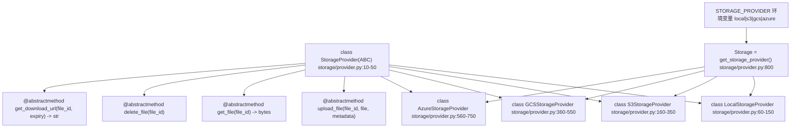
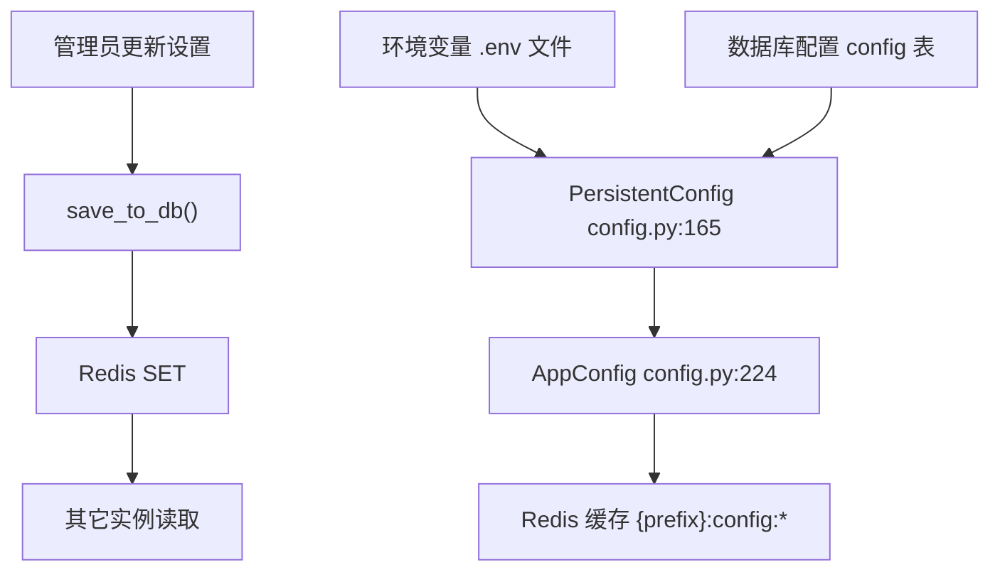

# 架构概览 (Architecture Overview)

相关源文件

-   [.github/workflows/integration-test.disabled](https://github.com/open-webui/open-webui/blob/a7271532/.github/workflows/integration-test.disabled)
-   [backend/open\_webui/config.py](https://github.com/open-webui/open-webui/blob/a7271532/backend/open_webui/config.py)
-   [backend/open\_webui/main.py](https://github.com/open-webui/open-webui/blob/a7271532/backend/open_webui/main.py)
-   [backend/open\_webui/retrieval/loaders/datalab\_marker.py](https://github.com/open-webui/open-webui/blob/a7271532/backend/open_webui/retrieval/loaders/datalab_marker.py)
-   [backend/open\_webui/retrieval/loaders/external\_document.py](https://github.com/open-webui/open-webui/blob/a7271532/backend/open_webui/retrieval/loaders/external_document.py)
-   [backend/open\_webui/retrieval/loaders/external\_web.py](https://github.com/open-webui/open-webui/blob/a7271532/backend/open_webui/retrieval/loaders/external_web.py)
-   [backend/open\_webui/retrieval/loaders/main.py](https://github.com/open-webui/open-webui/blob/a7271532/backend/open_webui/retrieval/loaders/main.py)
-   [backend/open\_webui/retrieval/loaders/mineru.py](https://github.com/open-webui/open-webui/blob/a7271532/backend/open_webui/retrieval/loaders/mineru.py)
-   [backend/open\_webui/retrieval/loaders/mistral.py](https://github.com/open-webui/open-webui/blob/a7271532/backend/open_webui/retrieval/loaders/mistral.py)
-   [backend/open\_webui/retrieval/utils.py](https://github.com/open-webui/open-webui/blob/a7271532/backend/open_webui/retrieval/utils.py)
-   [backend/open\_webui/routers/retrieval.py](https://github.com/open-webui/open-webui/blob/a7271532/backend/open_webui/routers/retrieval.py)
-   [backend/open\_webui/storage/provider.py](https://github.com/open-webui/open-webui/blob/a7271532/backend/open_webui/storage/provider.py)
-   [backend/open\_webui/test/apps/webui/storage/test\_provider.py](https://github.com/open-webui/open-webui/blob/a7271532/backend/open_webui/test/apps/webui/storage/test_provider.py)
-   [backend/open\_webui/utils/middleware.py](https://github.com/open-webui/open-webui/blob/a7271532/backend/open_webui/utils/middleware.py)
-   [backend/requirements-min.txt](https://github.com/open-webui/open-webui/blob/a7271532/backend/requirements-min.txt)
-   [backend/requirements.txt](https://github.com/open-webui/open-webui/blob/a7271532/backend/requirements.txt)
-   [docker-compose.playwright.yaml](https://github.com/open-webui/open-webui/blob/a7271532/docker-compose.playwright.yaml)
-   [pyproject.toml](https://github.com/open-webui/open-webui/blob/a7271532/pyproject.toml)
-   [src/lib/apis/retrieval/index.ts](https://github.com/open-webui/open-webui/blob/a7271532/src/lib/apis/retrieval/index.ts)
-   [src/lib/components/admin/Settings/Documents.svelte](https://github.com/open-webui/open-webui/blob/a7271532/src/lib/components/admin/Settings/Documents.svelte)
-   [src/lib/components/admin/Settings/WebSearch.svelte](https://github.com/open-webui/open-webui/blob/a7271532/src/lib/components/admin/Settings/WebSearch.svelte)
-   [src/lib/components/channel/MessageInput.svelte](https://github.com/open-webui/open-webui/blob/a7271532/src/lib/components/channel/MessageInput.svelte)
-   [src/lib/components/chat/Chat.svelte](https://github.com/open-webui/open-webui/blob/a7271532/src/lib/components/chat/Chat.svelte)
-   [src/lib/components/chat/ChatPlaceholder.svelte](https://github.com/open-webui/open-webui/blob/a7271532/src/lib/components/chat/ChatPlaceholder.svelte)
-   [src/lib/components/chat/MessageInput.svelte](https://github.com/open-webui/open-webui/blob/a7271532/src/lib/components/chat/MessageInput.svelte)
-   [src/lib/components/chat/Placeholder.svelte](https://github.com/open-webui/open-webui/blob/a7271532/src/lib/components/chat/Placeholder.svelte)
-   [src/lib/components/chat/Suggestions.svelte](https://github.com/open-webui/open-webui/blob/a7271532/src/lib/components/chat/Suggestions.svelte)
-   [src/lib/components/common/FileItem.svelte](https://github.com/open-webui/open-webui/blob/a7271532/src/lib/components/common/FileItem.svelte)
-   [src/lib/components/common/FileItemModal.svelte](https://github.com/open-webui/open-webui/blob/a7271532/src/lib/components/common/FileItemModal.svelte)
-   [uv.lock](https://github.com/open-webui/open-webui/blob/a7271532/uv.lock)

本文档提供了 Open WebUI 三层系统的高级架构概览：SvelteKit 前端、FastAPI 后端以及数据/存储层。它描述了主要组件、它们的职责以及它们如何交互。

有关特定子系统的详细信息，请参阅：

-   [系统组件与数据流](/open-webui/open-webui/2-architecture-overview/2.1-system-components-and-data-flow)
-   [前端架构](/open-webui/open-webui/2-architecture-overview/2.2-frontend-architecture)
-   [后端架构](/open-webui/open-webui/2-architecture-overview/2.3-backend-architecture)
-   [数据与存储层](/open-webui/open-webui/2-architecture-overview/2.4-data-and-storage-layer)

---

## 系统概览

Open WebUI 实现了分离表示层、应用逻辑层和数据持久层的三层 Web 架构：

### 整体系统架构


**来源：** [backend/open\_webui/main.py1-650](https://github.com/open-webui/open-webui/blob/a7271532/backend/open_webui/main.py#L1-L650) [src/lib/components/chat/Chat.svelte1-100](https://github.com/open-webui/open-webui/blob/a7271532/src/lib/components/chat/Chat.svelte#L1-L100) [backend/open\_webui/utils/middleware.py1-600](https://github.com/open-webui/open-webui/blob/a7271532/backend/open_webui/utils/middleware.py#L1-L600) [backend/open\_webui/socket/main.py1-100](https://github.com/open-webui/open-webui/blob/a7271532/backend/open_webui/socket/main.py#L1-L100)

**关键架构特征：**

-   **基于组件的前端**：SvelteKit 应用程序具有响应式 store (`$config`, `$user`, `$models`, `$socket`)，驱动跨组件的 UI 更新。
-   **中间件管道**：[backend/open\_webui/utils/middleware.py](https://github.com/open-webui/open-webui/blob/a7271532/backend/open_webui/utils/middleware.py) 中的 `process_chat_payload()` 和 `process_chat_response()` 链接了 RAG、工具、网页搜索和记忆增强的处理程序。
-   **可插拔存储**：工厂模式 (`VECTOR_DB_CLIENT`) 和抽象 `StorageProvider` 允许在不更改代码的情况下交换数据库和存储实现。
-   **代理架构**：后端充当智能反向代理，利用额外的上下文和功能增强对 Ollama/OpenAI 的请求。
-   **实时流式传输**：[backend/open\_webui/socket/main.py](https://github.com/open-webui/open-webui/blob/a7271532/backend/open_webui/socket/main.py) 中的 Socket.IO 为聊天完成和状态更新提供双向事件流。

### 应用程序初始化序列

**来源：** [backend/open\_webui/main.py570-630](https://github.com/open-webui/open-webui/blob/a7271532/backend/open_webui/main.py#L570-L630) [backend/open\_webui/main.py633-650](https://github.com/open-webui/open-webui/blob/a7271532/backend/open_webui/main.py#L633-L650) [backend/open\_webui/main.py1200-1300](https://github.com/open-webui/open-webui/blob/a7271532/backend/open_webui/main.py#L1200-L1300)

**关键初始化步骤：**

-   **Lines 570-585**: `lifespan()` 上下文管理器处理启动/关闭。
-   **Line 579**: `install_tool_and_function_dependencies()` 在处理请求之前同步安装自定义工具/功能的 Python 依赖项。
-   **Lines 586-593**: `get_redis_connection()` 建立 Redis 连接（如果已配置），用于分布式会话存储和配置同步。
-   **Lines 595-598**: `redis_task_command_listener()` 订阅 Redis 发布/订阅频道，以进行跨实例任务取消。
-   **Lines 650-655**: `AppConfig` 类包装 `PersistentConfig` 值，启用带有 Redis 缓存的数据库支持配置。
-   **Lines 1200-1300**: 中间件栈自底向上处理请求：安全性 → CORS → 会话 → 审计 → 压缩。

---

## 前端层 (SvelteKit)

前端是一个 SvelteKit 单页应用程序，提供用于聊天交互、模型管理和配置的用户界面。

### SvelteKit 布局层次结构


**来源：** [src/routes/+layout.svelte1-100](https://github.com/open-webui/open-webui/blob/a7271532/src/routes/+layout.svelte#L1-L100) [src/routes/(app)/+layout.svelte1-200](https://github.com/open-webui/open-webui/blob/a7271532/src/routes/(app)/+layout.svelte#L1-L200) [src/routes/(app)/+page.svelte1-50](https://github.com/open-webui/open-webui/blob/a7271532/src/routes/(app)/+page.svelte#L1-L50) src/routes/(app)/c/\[id\]/+page.svelte:1-50

关键初始化点：

-   `src/app.html`: 在渲染前注入主题 CSS 变量，以防止 FOUC（无样式内容闪烁）。
-   `src/routes/+layout.svelte`: 调用 `getBackendConfig()`、`getUserInfo()`，并初始化 `io()` Socket.IO 客户端。
-   `src/routes/(app)/+layout.svelte`: 加载 `getModels()`，渲染 `Navbar.svelte`、`Sidebar.svelte`、`SettingsModal.svelte`。
-   `src/routes/(app)/+page.svelte` 和 `src/routes/(app)/c/[id]/+page.svelte`: 两者都渲染 `Chat.svelte`，但具有不同的 `chatIdProp` 值。

### 状态管理

状态通过 `$lib/stores` 中定义的 Svelte store 进行管理：

| Store | 用途 | 作用域 |
| --- | --- | --- |
| `$config` | 来自后端的应用程序配置 | 全局 |
| `$user` | 当前用户对象和权限 | 全局 |
| `$models` | 可用的 LLM 模型 | 全局 |
| `$chats` | 聊天历史列表 | 全局 |
| `$settings` | 用户 UI 偏好设置 | 全局 |
| `$socket` | Socket.IO 客户端实例 | 全局 |
| `$temporaryChatEnabled` | 隐私模式状态 | 全局 |

Store 提供响应式数据流：当 store 值更改时，所有订阅的组件都会自动重新渲染。

**来源：** [src/lib/components/chat/Chat.svelte16-43](https://github.com/open-webui/open-webui/blob/a7271532/src/lib/components/chat/Chat.svelte#L16-L43)

### 构建输出

前端构建过程（通过 Vite）生成由 FastAPI 后端提供服务的静态资源：

```text
build/
├── index.html          # SPA 入口点
├── _app/
│   ├── immutable/      # 哈希化的资源 (JS, CSS)
│   └── version.json    # 构建版本
└── [其它路由]           # 预渲染的页面
```
后端通过 `SPAStaticFiles` 提供这些服务，这些服务在回退到 `index.html` 时进行客户端路由。

**来源：** [backend/open\_webui/main.py512-524](https://github.com/open-webui/open-webui/blob/a7271532/backend/open_webui/main.py#L512-L524)

---

## 后端层 (FastAPI)

后端是一个 FastAPI 应用程序，处理 API 请求、编排聊天补全、管理身份验证，并与外部服务对接。

### 请求处理流水线

[backend/open\_webui/utils/middleware.py](https://github.com/open-webui/open-webui/blob/a7271532/backend/open_webui/utils/middleware.py) 中的后端中间件实现了一个顺序增强流水线，在转发到 LLM 后端之前增强聊天请求：


**来源：** [backend/open\_webui/utils/middleware.py1-600](https://github.com/open-webui/open-webui/blob/a7271532/backend/open_webui/utils/middleware.py#L1-L600)

**中间件处理程序职责：**

| 处理程序 | 位置 | 输入 | 输出 | 用途 |
| --- | --- | --- | --- | --- |
| `process_pipeline_inlet_filter()` | middleware.py:54-56 | `form_data` | 修改后的 `form_data` | 应用自定义流水线转换 |
| `chat_memory_handler()` | middleware.py:516-552 | 最后一条用户消息 | 带有记忆上下文的系统消息 | 从向量存储中查询记忆 |
| `chat_web_search_handler()` | middleware.py:555-720 | 最后一条用户消息 | 带有搜索结果的系统消息 | 生成查询、搜索网页、加载页面 |
| `chat_image_generation_handler()` | middleware.py:723-817 | 最后一条用户消息 | 向消息添加图像文件 | 根据文本提示生成图像 |
| `chat_completion_tools_handler()` | middleware.py:286-513 | 消息 + 工具规范 | 包含工具结果的上下文 | 通过函数调用执行工具 |
| `chat_completion_files_handler()` | middleware.py:820-1045 | 上传的文件 | RAG 上下文 | 加载文档、嵌入、搜索、重排序 |
| `process_pipeline_outlet_filter()` | middleware.py:54-56 | LLM 响应 | 修改后的响应 | 后处理 LLM 输出 |

每个处理程序：

1.  接收带有 `messages`、`model`、`stream` 键的 `form_data` 字典。
2.  根据配置（如 `ENABLE_WEB_SEARCH`）有条件地执行。
3.  就地修改 `form_data`（通常添加到系统消息中）。
4.  在 `extra_params["sources"]` 中累积引用信息，以便 UI 显示。
5.  通过 `__event_emitter__` Socket.IO 回调发出状态更新。

### 路由器组织与端点

后端 API 组织在 `backend/open_webui/routers/` 目录下的各路由器中：

| 路由器文件 | 前缀 | 关键端点 | 用途 |
| --- | --- | --- | --- |
| `auths.py` | `/api/auths` | `POST /signin`, `POST /signup`, `POST /signout` | 身份验证、OAuth 流程、API 密钥管理 |
| `chats.py` | `/api/chats` | `GET /`, `POST /new`, `GET /{id}`, `POST /{id}`, `DELETE /{id}` | 聊天 CRUD 操作 |
| `users.py` | `/api/users` | `GET /`, `POST /update/profile`, `POST /update/password` | 用户管理 |
| `models.py` | `/api/models` | `GET /`, `POST /add`, `DELETE /{id}` | 模型注册表操作 |
| `retrieval.py` | `/api/retrieval` | `POST /process/web`, `POST /process/youtube`, `GET /config`, `POST /config/update` | RAG 配置、网页/文档处理 |
| `audio.py` | `/api/audio` | `POST /transcriptions`, `POST /speech` | 语音转文本 (STT) 和文本转语音 (TTS) |
| `images.py` | `/api/images` | `POST /generations`, `POST /edits` | 图像生成与编辑 |
| `tools.py` | `/api/tools` | `GET /`, `POST /create`, `POST /{id}/update` | 工具定义与执行 |
| `functions.py` | `/api/functions` | `GET /`, `POST /create`, `POST /{id}/update` | 用户定义的 Python 函数 |
| `ollama.py` | `/ollama` | `POST /api/chat`, `POST /api/generate`, `GET /api/tags` | Ollama API 的反向代理 |
| `openai.py` | `/openai` | `POST /v1/chat/completions`, `POST /v1/completions` | OpenAI 兼容端点 |
| `pipelines.py` | `/api/pipelines` | `GET /`, `POST /upload`, `POST /{id}/valves/update` | 外部流水线过滤器 |

**来源：** [backend/open\_webui/main.py1400-1550](https://github.com/open-webui/open-webui/blob/a7271532/backend/open_webui/main.py#L1400-L1550) [backend/open\_webui/routers/auths.py1-100](https://github.com/open-webui/open-webui/blob/a7271532/backend/open_webui/routers/auths.py#L1-L100) [backend/open\_webui/routers/chats.py1-100](https://github.com/open-webui/open-webui/blob/a7271532/backend/open_webui/routers/chats.py#L1-L100) [backend/open\_webui/routers/retrieval.py1-100](https://github.com/open-webui/open-webui/blob/a7271532/backend/open_webui/routers/retrieval.py#L1-L100)

[backend/open\_webui/main.py1400-1550](https://github.com/open-webui/open-webui/blob/a7271532/backend/open_webui/main.py#L1400-L1550) 中的路由器注册模式：

```python
app.include_router(auths.router, prefix="/api/auths", tags=["auths"])
app.include_router(chats.router, prefix="/api/chats", tags=["chats"])
app.include_router(retrieval.router, prefix="/api/retrieval", tags=["retrieval"])
# ... 其它路由器
```
`/ollama` 和 `/openai` 端点充当 **反向代理**，拦截请求，应用中间件转换（RAG、工具、记忆），然后转发到配置的后端 URL (`OLLAMA_BASE_URLS`, `OPENAI_API_BASE_URLS`)。

### 数据库层

Open WebUI 使用 SQLAlchemy ORM 进行关系型数据存储，支持 SQLite（默认）、PostgreSQL 和 MySQL：


**来源：** [backend/open\_webui/internal/db.py1-60](https://github.com/open-webui/open-webui/blob/a7271532/backend/open_webui/internal/db.py#L1-L60) [backend/open\_webui/models/users.py1-50](https://github.com/open-webui/open-webui/blob/a7271532/backend/open_webui/models/users.py#L1-L50) [backend/open\_webui/models/chats.py1-50](https://github.com/open-webui/open-webui/blob/a7271532/backend/open_webui/models/chats.py#L1-L50)

**关键数据库组件：**

-   **`internal/db.py`**: 定义 `engine`、`Base`、`SessionLocal` 和 `get_db()` 上下文管理器。
-   **表模型**: SQLAlchemy 声明式类（如 `User`, `Chat`, `File`）映射到数据库表。
-   **业务逻辑类**: 包装类（如 `Users`, `Chats`, `Files`）提供用于 CRUD 操作的静态方法。
-   **迁移系统**: `migrations/versions/` 目录中的 Alembic 迁移，通过 [backend/open\_webui/config.py53-68](https://github.com/open-webui/open-webui/blob/a7271532/backend/open_webui/config.py#L53-L68) 中的 `run_migrations()` 自动运行。

**典型使用模式：**

```python
from open_webui.models.users import Users
from open_webui.internal.db import get_db

# 业务逻辑包装类 (推荐)
user = Users.get_user_by_id(user_id)

# 直接 ORM 访问
with get_db() as db:
    user = db.query(User).filter_by(id=user_id).first()
```
**主要数据表：**

| 表名 | 模型类 | 用途 |
| --- | --- | --- |
| `user` | `Users` | 用户帐户、角色 (`admin`/`user`/`pending`)、权限 |
| `auth` | `Auths` | 密码哈希、API 密钥 (`sk-*` 格式) |
| `chat` | `Chats` | 聊天元数据、消息历史树、文件夹分配 |
| `file` | `Files` | 上传的文件元数据、存储引用 |
| `function` | `Functions` | 用户定义的 Python 函数（由管理员创建） |
| `tool` | `Tools` | 带有 OpenAPI 规范的工具定义 |
| `model` | `Models` | LLM 模型配置、元数据、过滤器 |
| `knowledge` | `Knowledges` | 用于 RAG 的知识库元数据 |
| `config` | N/A (直接访问) | 持久化应用程序配置（基于数据库） |

**来源：** [backend/open\_webui/models/users.py](https://github.com/open-webui/open-webui/blob/a7271532/backend/open_webui/models/users.py) [backend/open\_webui/models/chats.py](https://github.com/open-webui/open-webui/blob/a7271532/backend/open_webui/models/chats.py) [backend/open\_webui/models/files.py](https://github.com/open-webui/open-webui/blob/a7271532/backend/open_webui/models/files.py)

### 身份验证与授权流程

> **[Mermaid sequence]**
> *(图表结构无法解析)*

**来源：** [backend/open\_webui/routers/auths.py1-400](https://github.com/open-webui/open-webui/blob/a7271532/backend/open_webui/routers/auths.py#L1-L400) [backend/open\_webui/models/users.py1-200](https://github.com/open-webui/open-webui/blob/a7271532/backend/open_webui/models/users.py#L1-L200) [backend/open\_webui/models/auths.py1-200](https://github.com/open-webui/open-webui/blob/a7271532/backend/open_webui/models/auths.py#L1-L200) [backend/open\_webui/utils/auth.py1-300](https://github.com/open-webui/open-webui/blob/a7271532/backend/open_webui/utils/auth.py#L1-L300)

身份验证方法和代码位置：

| 方法 | 路由器端点 | 实现 | 令牌创建 |
| --- | --- | --- | --- |
| **本地 (Local)** | `POST /api/auths/signin` | `Users.authenticate_user()` → `Auths.authenticate_user()` | [backend/open\_webui/utils/auth.py120-150](https://github.com/open-webui/open-webui/blob/a7271532/backend/open_webui/utils/auth.py#L120-L150) 中的 `create_token()` |
| **LDAP** | `POST /api/auths/signin` | `ldap3.Connection()` 验证 → `Users.insert_new_user()` | 相同的 JWT 创建方式 |
| **OAuth/OIDC** | `GET /api/auths/oauth/{provider}/callback` | `OAuthManager.authorize_access_token()` | 相同的 JWT 创建方式 |
| **受信任标头** | 任意端点 | `WEBUI_AUTH_TRUSTED_EMAIL_HEADER` 环境检查 | 自动用户查找/创建 |
| **API 密钥** | 任意端点 | `Auths.get_user_by_api_key()` | 无令牌；逐个请求验证密钥 |

授权依赖链：

1.  FastAPI 端点参数：`user: UserModel = Depends(get_verified_user)`。
2.  [backend/open\_webui/utils/auth.py180-220](https://github.com/open-webui/open-webui/blob/a7271532/backend/open_webui/utils/auth.py#L180-L220) 中的 `get_verified_user()` 调用 `decode_token()`。
3.  [backend/open\_webui/utils/auth.py150-180](https://github.com/open-webui/open-webui/blob/a7271532/backend/open_webui/utils/auth.py#L150-L180) 中的 `decode_token()` 验证 JWT 签名和有效期。
4.  返回带有 `role` 字段（`"admin"`, `"user"`, `"pending"`）的 `UserModel`。
5.  路由可以检查 `user.role` 或对仅限管理员的端点使用 `get_admin_user()` 依赖项。

---

## 数据层

数据层为用户、聊天、文件、配置和向量嵌入提供持久化。

### 向量数据库抽象

RAG 系统通过工厂模式支持多种向量数据库后端：


**来源：** [backend/open\_webui/retrieval/vector/factory.py1-100](https://github.com/open-webui/open-webui/blob/a7271532/backend/open_webui/retrieval/vector/factory.py#L1-L100)

**向量数据库选择：**

`VECTOR_DB_CLIENT` 全局单例根据 `VECTOR_DB` 环境变量进行初始化。所有实现都公开一个通用接口：

```python
# 工厂模式用法
from open_webui.retrieval.vector.factory import VECTOR_DB_CLIENT

# 为文件创建集合
VECTOR_DB_CLIENT.create_collection(
    collection_name=f"file_{file_id}",
    dimension=384  # 嵌入模型维度
)

# 插入嵌入
VECTOR_DB_CLIENT.upsert(
    collection_name=f"file_{file_id}",
    documents=chunks,
    embeddings=embedding_vectors,
    metadatas=[{"file_id": file_id, "chunk": i} for i in range(len(chunks))],
    ids=[f"{file_id}_{i}" for i in range(len(chunks))]
)

# 搜索相似分块
result = VECTOR_DB_CLIENT.search(
    collection_name=f"file_{file_id}",
    vectors=[query_embedding],
    limit=5
)
```
**受支持的向量数据库：**

| 数据库 | 配置环境变量 | 用例 |
| --- | --- | --- |
| ChromaDB (默认) | `CHROMA_DATA_PATH`, `CHROMA_TENANT`, `CHROMA_DATABASE` | 开发环境、单实例部署 |
| Milvus | `MILVUS_URI` | 生产环境、高可扩展性 |
| Qdrant | `QDRANT_URI`, `QDRANT_API_KEY` | 生产环境、云原生 |
| OpenSearch | `OPENSEARCH_URI`, `OPENSEARCH_SSL` | 企业级、AWS 集成 |
| PGVector | `DATABASE_URL` (带有 pgvector 的 PostgreSQL) | PostgreSQL 用户 |

**来源：** [backend/open\_webui/retrieval/vector/chroma.py](https://github.com/open-webui/open-webui/blob/a7271532/backend/open_webui/retrieval/vector/chroma.py) [backend/open\_webui/retrieval/vector/milvus.py](https://github.com/open-webui/open-webui/blob/a7271532/backend/open_webui/retrieval/vector/milvus.py) [backend/open\_webui/retrieval/vector/qdrant.py](https://github.com/open-webui/open-webui/blob/a7271532/backend/open_webui/retrieval/vector/qdrant.py)

### 向量数据库工厂模式

Open WebUI 通过 [backend/open\_webui/retrieval/vector/factory.py1-100](https://github.com/open-webui/open-webui/blob/a7271532/backend/open_webui/retrieval/vector/factory.py#L1-L100) 中的工厂模式支持多种向量存储：


**来源：** [backend/open\_webui/retrieval/vector/factory.py1-100](https://github.com/open-webui/open-webui/blob/a7271532/backend/open_webui/retrieval/vector/factory.py#L1-L100) [backend/open\_webui/retrieval/vector/chroma.py1-200](https://github.com/open-webui/open-webui/blob/a7271532/backend/open_webui/retrieval/vector/chroma.py#L1-L200) [backend/open\_webui/retrieval/vector/milvus.py1-200](https://github.com/open-webui/open-webui/blob/a7271532/backend/open_webui/retrieval/vector/milvus.py#L1-L200)

[backend/open\_webui/retrieval/vector/factory.py50-100](https://github.com/open-webui/open-webui/blob/a7271532/backend/open_webui/retrieval/vector/factory.py#L50-L100) 中的工厂实例化逻辑：

```python
def get_vector_db_client():
    if VECTOR_DB == "milvus":
        return MilvusVectorDB()
    elif VECTOR_DB == "qdrant":
        return QdrantVectorDB()
    elif VECTOR_DB == "opensearch":
        return OpenSearchVectorDB()
    elif VECTOR_DB == "pgvector":
        return PGVectorDB()
    else:  # 默认为 ChromaDB
        return ChromaVectorDB()
```
每个实现类都包装了底层的向量数据库客户端并提供：

-   **集合管理**：创建/删除集合（每个文件或知识库一个）。
-   **文档摄取**：`upsert()` 存储带有元数据（文件 ID、分块索引等）的嵌入。
-   **相似度搜索**：`search()` 返回余弦相似度最高的 top-k 近邻。
-   **混合搜索**：部分实现将向量搜索与 BM25 关键词搜索相结合。

全局 `VECTOR_DB_CLIENT` 单例在 [backend/open\_webui/retrieval/vector/factory.py100](https://github.com/open-webui/open-webui/blob/a7271532/backend/open_webui/retrieval/vector/factory.py#L100-L100) 中初始化，并通过 `from open_webui.retrieval.vector.factory import VECTOR_DB_CLIENT` 在整个代码库中使用。

### 用于分布式架构的 Redis

Redis 为多实例部署提供了可选功能：


**来源：** [backend/open\_webui/utils/redis.py30-100](https://github.com/open-webui/open-webui/blob/a7271532/backend/open_webui/utils/redis.py#L30-L100) [backend/open\_webui/main.py581-588](https://github.com/open-webui/open-webui/blob/a7271532/backend/open_webui/main.py#L581-L588) [backend/open\_webui/config.py258-261](https://github.com/open-webui/open-webui/blob/a7271532/backend/open_webui/config.py#L258-L261) [backend/open\_webui/tasks.py100-150](https://github.com/open-webui/open-webui/blob/a7271532/backend/open_webui/tasks.py#L100-L150)

[backend/open\_webui/main.py581-588](https://github.com/open-webui/open-webui/blob/a7271532/backend/open_webui/main.py#L581-L588) 中的 Redis 初始化：

```python
app.state.redis = get_redis_connection(
    redis_url=REDIS_URL,
    redis_sentinels=get_sentinels_from_env(REDIS_SENTINEL_HOSTS, REDIS_SENTINEL_PORT),
    redis_cluster=REDIS_CLUSTER,
    async_mode=True,
)
```
关键模式：

| 功能 | Redis 键模式 | 用途 | 代码位置 |
| --- | --- | --- | --- |
| **会话** | `{prefix}:session:{session_id}` | 跨实例存储会话数据 | [backend/open\_webui/main.py1250-1270](https://github.com/open-webui/open-webui/blob/a7271532/backend/open_webui/main.py#L1250-L1270) |
| **配置同步** | `{prefix}:config:{key}` | 广播配置更改 | [backend/open\_webui/config.py258-261](https://github.com/open-webui/open-webui/blob/a7271532/backend/open_webui/config.py#L258-L261) |
| **任务队列** | `{prefix}:commands` (发布/订阅频道) | 跨实例取消任务 | [backend/open\_webui/tasks.py100-150](https://github.com/open-webui/open-webui/blob/a7271532/backend/open_webui/tasks.py#L100-L150) |
| **Yjs CRDT** | `ydoc:{doc_id}` (列表) | 存储协作文档更新 | [backend/open\_webui/models/notes.py50-100](https://github.com/open-webui/open-webui/blob/a7271532/backend/open_webui/models/notes.py#L50-L100) |
| **Socket.IO** | 由 Socket.IO Redis 适配器管理 | 广播 WebSocket 事件 | [backend/open\_webui/socket/main.py50-100](https://github.com/open-webui/open-webui/blob/a7271532/backend/open_webui/socket/main.py#L50-L100) |

当未设置 `REDIS_URL` 时，应用程序在单实例模式下运行，使用内存会话存储且没有跨实例同步。

### 存储提供者抽象

文件存储使用具有多种实现的抽象接口：


**来源：** [backend/open\_webui/storage/provider.py1-800](https://github.com/open-webui/open-webui/blob/a7271532/backend/open_webui/storage/provider.py#L1-L800)

[backend/open\_webui/storage/provider.py780-800](https://github.com/open-webui/open-webui/blob/a7271532/backend/open_webui/storage/provider.py#L780-L800) 中的存储提供者选择：

```python
def get_storage_provider() -> StorageProvider:
    provider = os.getenv("STORAGE_PROVIDER", "local").lower()
    if provider == "s3":
        return S3StorageProvider()
    elif provider == "gcs":
        return GCSStorageProvider()
    elif provider == "azure":
        return AzureStorageProvider()
    else:
        return LocalStorageProvider()
```
实现详情：

| 提供者 | 配置 | 远程存储 | 本地缓存 | 预签名 URL |
| --- | --- | --- | --- | --- |
| **本地 (Local)** | `UPLOAD_DIR` | N/A | 文件存储在 `{UPLOAD_DIR}/{file_id}` | 不支持 |
| **S3** | `S3_BUCKET_NAME`, `S3_ACCESS_KEY_ID`, `S3_SECRET_ACCESS_KEY` | S3 存储桶 (AWS, MinIO, DigitalOcean) | 同时保存到 `{UPLOAD_DIR}/{file_id}` | `boto3.generate_presigned_url()` |
| **GCS** | `GCS_BUCKET_NAME`, `GOOGLE_APPLICATION_CREDENTIALS` | Google Cloud Storage 存储桶 | 同时保存到 `{UPLOAD_DIR}/{file_id}` | `blob.generate_signed_url()` |
| **Azure** | `AZURE_STORAGE_ACCOUNT_NAME`, `AZURE_STORAGE_CONNECTION_STRING` | Azure Blob Storage 容器 | 同时保存到 `{UPLOAD_DIR}/{file_id}` | `generate_blob_sas()` |

云提供商使用 **双重存储策略**：文件上传到远程对象存储以确保持久性，然后下载并缓存在本地以进行快速检索。这允许应用程序直接从磁盘提供文件服务，同时维护云端备份。

---

## 通信模式

### HTTP REST API

前端通过 HTTP REST 端点与后端通信：

**来源：** [src/lib/apis/chats/index.ts1-200](https://github.com/open-webui/open-webui/blob/a7271532/src/lib/apis/chats/index.ts#L1-L200) [backend/open\_webui/routers/chats.py1-500](https://github.com/open-webui/open-webui/blob/a7271532/backend/open_webui/routers/chats.py#L1-L500)

所有 HTTP 请求都包含 `Authorization: Bearer {token}` 请求头。[backend/open\_webui/utils/auth.py180-220](https://github.com/open-webui/open-webui/blob/a7271532/backend/open_webui/utils/auth.py#L180-L220) 中的 `get_verified_user()` 依赖项验证 JWT 令牌，并将 `UserModel` 注入到路由处理程序中。

### WebSocket (Socket.IO) 通信

用于流式传输和通知的实时双向事件：

**来源：** [backend/open\_webui/socket/main.py1-400](https://github.com/open-webui/open-webui/blob/a7271532/backend/open_webui/socket/main.py#L1-L400) [src/lib/components/chat/Chat.svelte543-648](https://github.com/open-webui/open-webui/blob/a7271532/src/lib/components/chat/Chat.svelte#L543-L648) [backend/open\_webui/utils/middleware.py1050-1400](https://github.com/open-webui/open-webui/blob/a7271532/backend/open_webui/utils/middleware.py#L1050-L1400)

后端发出的 Socket.IO 事件类型：

| 事件类型 | 负载 | 发出者 | 前端处理程序 |
| --- | --- | --- | --- |
| `"events"` | `{type: "chat:message:delta", data: {content: "..."}}` | `process_chat_response()` | 追加到消息内容 |
| `"events"` | `{type: "status", data: {action: "web_search", ...}}` | 中间件处理程序 | 显示状态指示器 |
| `"events"` | `{type: "source", data: {name: "...", document: "..."}}` | `chat_completion_files_handler()` | 添加引用信息 |
| `"events"` | `{type: "chat:title", data: "..."}` | `generate_title()` | 更新聊天标题 |
| `"events"` | `{type: "usage", data: {model: "...", tokens: ...}}` | `generate_chat_completion()` | 追踪使用情况 |

[backend/open\_webui/socket/main.py100-200](https://github.com/open-webui/open-webui/blob/a7271532/backend/open_webui/socket/main.py#L100-L200) 中的连接池管理：

-   `SESSION_POOL`: `{socket_id: user_id}` - 将连接映射到用户。
-   `USER_POOL`: `{user_id: [socket_ids]}` - 将用户映射到其连接（支持多标签页）。
-   `USAGE_POOL`: `{socket_id: {model_id: timestamp}}` - 跟踪每个连接的活跃 LLM 使用情况。

当配置了 Redis 时，这些将变成 `RedisDict` 实例，以进行跨实例同步。

### 后端到 LLM 的代理模式

后端充当 LLM API 的增强型反向代理：

**来源：** [backend/open\_webui/routers/openai.py200-350](https://github.com/open-webui/open-webui/blob/a7271532/backend/open_webui/routers/openai.py#L200-L350) [backend/open\_webui/utils/middleware.py820-1045](https://github.com/open-webui/open-webui/blob/a7271532/backend/open_webui/utils/middleware.py#L820-L1045) [backend/open\_webui/retrieval/loaders/main.py100-300](https://github.com/open-webui/open-webui/blob/a7271532/backend/open_webui/retrieval/loaders/main.py#L100-L300) [backend/open\_webui/utils/chat.py50-200](https://github.com/open-webui/open-webui/blob/a7271532/backend/open_webui/utils/chat.py#L50-L200)

`chat_completion_files_handler()` [backend/open\_webui/utils/middleware.py820-1045](https://github.com/open-webui/open-webui/blob/a7271532/backend/open_webui/utils/middleware.py#L820-L1045) 中的 RAG 流水线步骤：

1.  **文档加载** (lines 830-880):
    -   从 [backend/open\_webui/retrieval/loaders/main.py100-300](https://github.com/open-webui/open-webui/blob/a7271532/backend/open_webui/retrieval/loaders/main.py#L100-L300) 调用 `Loader(file_path, mime_type).load()`。
    -   支持 Tika, Docling, MinerU, Marker, PyPDF 和默认文本提取。
    -   返回带有 `page_content` 和 `metadata` 的 `List[Document]`。
2.  **分块** (lines 885-920):
    -   `RecursiveCharacterTextSplitter(chunk_size=CHUNK_SIZE, chunk_overlap=CHUNK_OVERLAP)`。
    -   或带有 tiktoken 编码的 `TokenTextSplitter`。
    -   保留元数据（文件 ID、分块索引、页码）。
3.  **嵌入生成** (lines 925-960):
    -   从 [backend/open\_webui/retrieval/utils.py100-200](https://github.com/open-webui/open-webui/blob/a7271532/backend/open_webui/retrieval/utils.py#L100-L200) 调用 `get_embedding_function()`。
    -   返回 sentence-transformers 模型或 OpenAI/Azure/Ollama 客户端。
    -   批量生成嵌入 (RAG\_EMBEDDING\_BATCH\_SIZE)。
4.  **向量存储** (lines 965-990):
    -   `VECTOR_DB_CLIENT.upsert(collection_name, documents, embeddings, metadatas, ids)`。
    -   集合名称格式：`file_{file_id}` 或 `knowledge_{knowledge_id}`。
5.  **检索** (lines 995-1020):
    -   来自 [backend/open\_webui/retrieval/utils.py300-500](https://github.com/open-webui/open-webui/blob/a7271532/backend/open_webui/retrieval/utils.py#L300-L500) 的 `query_collection()` 或 `query_collection_with_hybrid_search()`。
    -   混合搜索将 BM25 关键词搜索与向量相似度相结合。
    -   如果已配置，则通过交叉编码器 (CrossEncoder) 应用重排序。
6.  **上下文注入** (lines 1025-1045):
    -   使用 `RAG_TEMPLATE`（可通过管理员设置配置）格式化检索到的段落。
    -   通过 `add_or_update_system_message()` 注入系统消息。
    -   将引用信息添加到 `extra_params["sources"]` 以供 UI 显示。

修改后的请求随后通过 [backend/open\_webui/utils/chat.py50-200](https://github.com/open-webui/open-webui/blob/a7271532/backend/open_webui/utils/chat.py#L50-L200) 中的 `generate_chat_completion()` 转发到 LLM 后端。

### 配置管理

配置遵循三层层次结构：


**来源：** [backend/open\_webui/config.py88-223](https://github.com/open-webui/open-webui/blob/a7271532/backend/open_webui/config.py#L88-L223)

[backend/open\_webui/config.py165-222](https://github.com/open-webui/open-webui/blob/a7271532/backend/open_webui/config.py#L165-L222) 中的 `PersistentConfig` 类封装了配置值：

-   从环境变量读取作为默认值。
-   如果数据库值存在，则覆盖。
-   在全局 `PERSISTENT_CONFIG_REGISTRY` 中注册以便更新。

[backend/open\_webui/config.py224-284](https://github.com/open-webui/open-webui/blob/a7271532/backend/open_webui/config.py#L224-L284) 中的 `AppConfig` 类提供：

-   对配置值的属性式访问。
-   通过 `__setattr__` 和 `__getattr__` 自动进行 Redis 缓存。
-   通过 Redis 发布/订阅进行跨实例同步。

当配置值更改时：

1.  管理员通过 API 更新 → 保存到数据库。
2.  `AppConfig.__setattr__` 发布到 Redis 键。
3.  其它实例的 `AppConfig.__getattr__` 读取更新后的值。
4.  使用该配置值的组件会自动看到更改。

**来源：** [backend/open\_webui/config.py224-284](https://github.com/open-webui/open-webui/blob/a7271532/backend/open_webui/config.py#L224-L284)

---

## 总结

Open WebUI 的架构旨在实现模块化、可扩展性和可伸缩性：

-   **三层分离**：表示层 (SvelteKit)、应用层 (FastAPI)、数据层 (SQL/Vector/Redis/Storage)。
-   **中间件流水线**：顺序处理程序使用记忆、搜索、工具和 RAG 增强聊天请求。
-   **可插拔组件**：可交换数据库、向量存储、存储提供程序和 LLM 后端。
-   **实时通信**：Socket.IO 支持流式响应和协作功能。
-   **分布式配置**：由 Redis 支持的 AppConfig 允许跨实例进行零停机更新。

该架构支持简单的单实例部署（SQLite + 本地存储）和复杂的生产部署（PostgreSQL + Redis + S3 + 水平扩展）。

**来源：** [backend/open\_webui/main.py1-650](https://github.com/open-webui/open-webui/blob/a7271532/backend/open_webui/main.py#L1-L650) [backend/open\_webui/utils/middleware.py1050-1400](https://github.com/open-webui/open-webui/blob/a7271532/backend/open_webui/utils/middleware.py#L1050-L1400) [backend/open\_webui/config.py1-300](https://github.com/open-webui/open-webui/blob/a7271532/backend/open_webui/config.py#L1-L300) [src/lib/components/chat/Chat.svelte1-100](https://github.com/open-webui/open-webui/blob/a7271532/src/lib/components/chat/Chat.svelte#L1-L100)