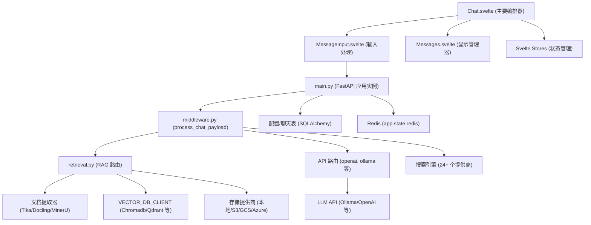
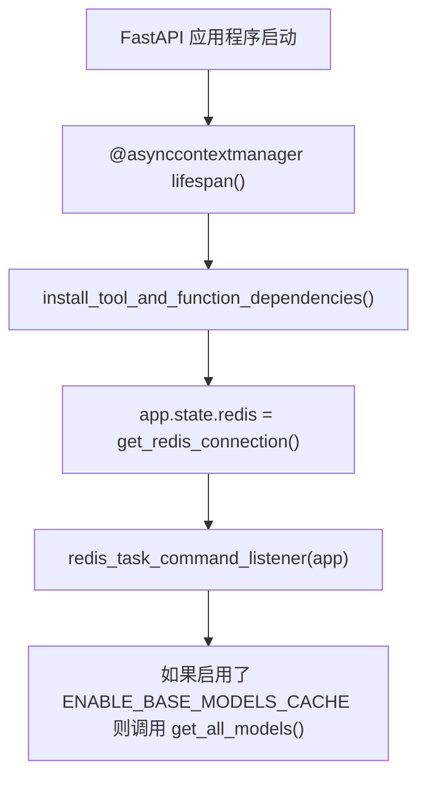
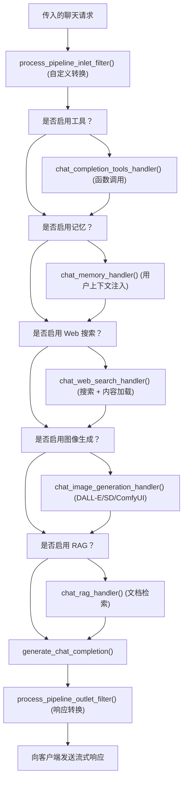
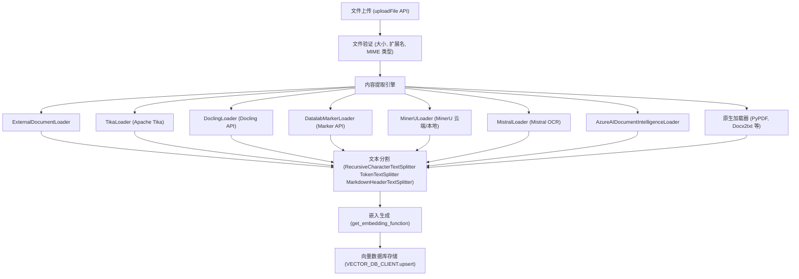
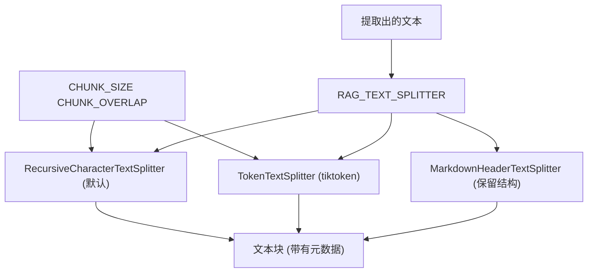
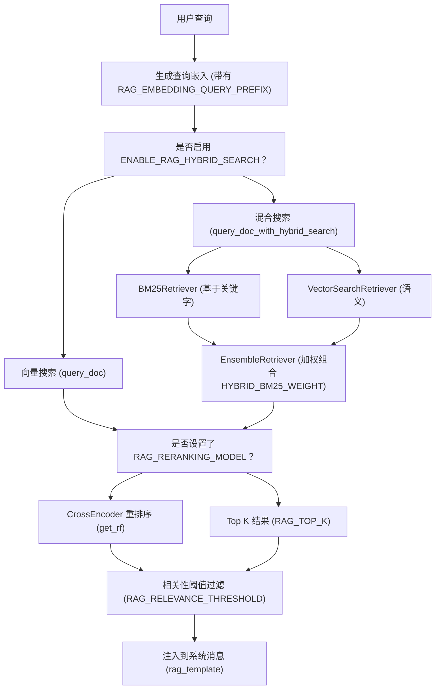
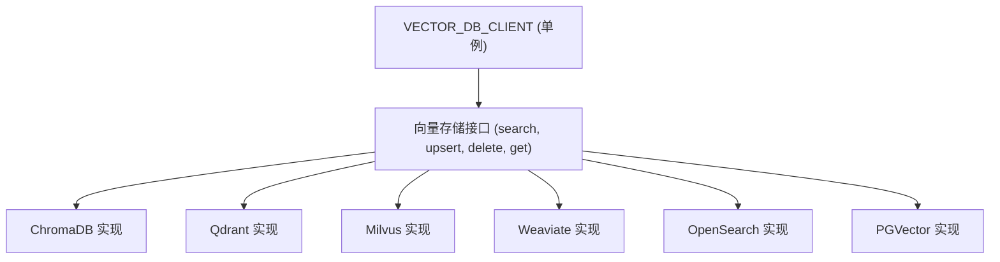
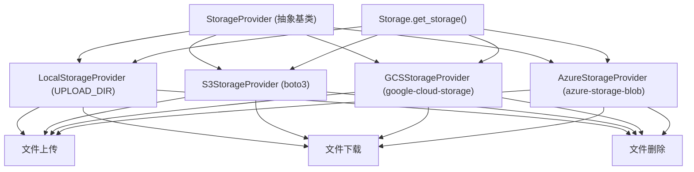

# 系统组件与数据流

相关源文件

-   [backend/open\_webui/config.py](https://github.com/open-webui/open-webui/blob/a7271532/backend/open_webui/config.py)
-   [backend/open\_webui/main.py](https://github.com/open-webui/open-webui/blob/a7271532/backend/open_webui/main.py)
-   [backend/open\_webui/retrieval/loaders/datalab\_marker.py](https://github.com/open-webui/open-webui/blob/a7271532/backend/open_webui/retrieval/loaders/datalab_marker.py)
-   [backend/open\_webui/retrieval/loaders/external\_document.py](https://github.com/open-webui/open-webui/blob/a7271532/backend/open_webui/retrieval/loaders/external_document.py)
-   [backend/open\_webui/retrieval/loaders/external\_web.py](https://github.com/open-webui/open-webui/blob/a7271532/backend/open_webui/retrieval/loaders/external_web.py)
-   [backend/open\_webui/retrieval/loaders/main.py](https://github.com/open-webui/open-webui/blob/a7271532/backend/open_webui/retrieval/loaders/main.py)
-   [backend/open\_webui/retrieval/loaders/mineru.py](https://github.com/open-webui/open-webui/blob/a7271532/backend/open_webui/retrieval/loaders/mineru.py)
-   [backend/open\_webui/retrieval/loaders/mistral.py](https://github.com/open-webui/open-webui/blob/a7271532/backend/open_webui/retrieval/loaders/mistral.py)
-   [backend/open\_webui/retrieval/utils.py](https://github.com/open-webui/open-webui/blob/a7271532/backend/open_webui/retrieval/utils.py)
-   [backend/open\_webui/routers/retrieval.py](https://github.com/open-webui/open-webui/blob/a7271532/backend/open_webui/routers/retrieval.py)
-   [backend/open\_webui/utils/middleware.py](https://github.com/open-webui/open-webui/blob/a7271532/backend/open_webui/utils/middleware.py)
-   [src/lib/apis/retrieval/index.ts](https://github.com/open-webui/open-webui/blob/a7271532/src/lib/apis/retrieval/index.ts)
-   [src/lib/components/admin/Settings/Documents.svelte](https://github.com/open-webui/open-webui/blob/a7271532/src/lib/components/admin/Settings/Documents.svelte)
-   [src/lib/components/admin/Settings/WebSearch.svelte](https://github.com/open-webui/open-webui/blob/a7271532/src/lib/components/admin/Settings/WebSearch.svelte)
-   [src/lib/components/channel/MessageInput.svelte](https://github.com/open-webui/open-webui/blob/a7271532/src/lib/components/channel/MessageInput.svelte)
-   [src/lib/components/chat/Chat.svelte](https://github.com/open-webui/open-webui/blob/a7271532/src/lib/components/chat/Chat.svelte)
-   [src/lib/components/chat/ChatPlaceholder.svelte](https://github.com/open-webui/open-webui/blob/a7271532/src/lib/components/chat/ChatPlaceholder.svelte)
-   [src/lib/components/chat/MessageInput.svelte](https://github.com/open-webui/open-webui/blob/a7271532/src/lib/components/chat/MessageInput.svelte)
-   [src/lib/components/chat/Placeholder.svelte](https://github.com/open-webui/open-webui/blob/a7271532/src/lib/components/chat/Placeholder.svelte)
-   [src/lib/components/chat/Suggestions.svelte](https://github.com/open-webui/open-webui/blob/a7271532/src/lib/components/chat/Suggestions.svelte)
-   [src/lib/components/common/FileItem.svelte](https://github.com/open-webui/open-webui/blob/a7271532/src/lib/components/common/FileItem.svelte)
-   [src/lib/components/common/FileItemModal.svelte](https://github.com/open-webui/open-webui/blob/a7271532/src/lib/components/common/FileItemModal.svelte)

本页面详细介绍了 Open WebUI 的主要系统组件及其在应用程序中的数据流转。内容涵盖了前后端交互、请求处理管道、RAG 文档系统以及存储架构。有关聊天界面本身的具体实现细节，请参阅[聊天系统](/open-webui/open-webui/4-chat-system)。有关数据流中涉及的身份验证和安全性方面，请参阅[身份验证与安全性](/open-webui/open-webui/10-authentication-and-security)。

## 组件架构概览

Open WebUI 由三个主要层级组成，它们协同工作以处理用户请求并提供由 AI 驱动的响应：

**前端层 (SvelteKit)**：由 Svelte 组件构建的客户端应用程序，负责处理用户交互、富文本编辑以及实时的消息渲染。其主要入口点是 `Chat.svelte`。

**后端层 (FastAPI)**：一个基于 Python 的 API 服务器，负责编排 LLM 交互、应用中间件转换，并通过 `main.py` 管理系统资源。

**存储层 (多数据库)**：持久化存储跨越了关系型数据库（SQLite/PostgreSQL）、用于嵌入的向量数据库、用于缓存/会话的 Redis，以及文件存储提供商（本地/S3/GCS/Azure）。


**来源：** [src/lib/components/chat/Chat.svelte](https://github.com/open-webui/open-webui/blob/a7271532/src/lib/components/chat/Chat.svelte) [backend/open\_webui/main.py](https://github.com/open-webui/open-webui/blob/a7271532/backend/open_webui/main.py) [backend/open\_webui/utils/middleware.py](https://github.com/open-webui/open-webui/blob/a7271532/backend/open_webui/utils/middleware.py) [backend/open\_webui/routers/retrieval.py](https://github.com/open-webui/open-webui/blob/a7271532/backend/open_webui/routers/retrieval.py)

## 前端到后端的数据流

从用户输入到后端处理的数据流遵循一条结构化路径，通过 Svelte 组件、事件分发器和 API 调用。

### 用户输入处理

当用户提交消息时，`Chat.svelte` 负责协调交互：

> **[Mermaid sequence]**
> *(图表结构无法解析)*

[Chat.svelte1639-1800](https://github.com/open-webui/open-webui/blob/a7271532/Chat.svelte#L1639-L1800) 中的 `submitPrompt` 函数负责处理提交：

1.  通过 `chatFiles` 处理附加的文件
2.  构建包含 `selectedModels`、`selectedToolIds`、`webSearchEnabled` 等信息的请求载荷 (payload)
3.  根据模型类型调用 `sendPromptOllama` 或 `sendPromptOpenAI`
4.  通过 `chatEventHandler` 注册 WebSocket 事件处理程序，以接收流式响应

变量替换发生在 [MessageInput.svelte178-289](https://github.com/open-webui/open-webui/blob/a7271532/MessageInput.svelte#L178-L289) 中，使用的是 `textVariableHandler`：

-   `{{CLIPBOARD}}` → 剪贴板内容 + 图像提取
-   `{{USER_LOCATION}}` → 通过 `getUserPosition()` 获取地理位置
-   `{{CURRENT_DATE}}` → 通过 `getFormattedDate()` 获取格式化日期
-   `{{USER_NAME}}`, `{{USER_BIO}}`, `{{USER_AGE}}` → 会话中的用户数据

**来源：** [src/lib/components/chat/Chat.svelte1639-1800](https://github.com/open-webui/open-webui/blob/a7271532/src/lib/components/chat/Chat.svelte#L1639-L1800) [src/lib/components/chat/MessageInput.svelte178-289](https://github.com/open-webui/open-webui/blob/a7271532/src/lib/components/chat/MessageInput.svelte#L178-L289)

### 请求结构

前端构建一个标准化的请求载荷：

| 字段 | 类型 | 描述 |
| --- | --- | --- |
| `model` | `string` | 选定的模型 ID |
| `messages` | `array` | OpenAI 格式的聊天历史 |
| `stream` | `boolean` | 是否启用流式响应 |
| `files` | `array` | 已上传文件的元数据 |
| `metadata` | `object` | 包含 `chat_id`, `session_id`, `filter_ids`, `tool_ids` |

请求载荷结构示例：

```
{
  model: "gpt-4",
  messages: [{role: "user", content: "Hello"}],
  stream: true,
  metadata: {
    chat_id: "uuid",
    session_id: "socket-id",
    tool_ids: ["web_search"],
    filter_ids: []
  }
}
```
**来源：** [src/lib/components/chat/Chat.svelte1639-1800](https://github.com/open-webui/open-webui/blob/a7271532/src/lib/components/chat/Chat.svelte#L1639-L1800)

## 后端请求处理管道

后端实现了一个复杂的中间件管道，在请求到达 LLM 提供商之前对其进行增强。

### 主应用程序初始化

[main.py571-631](https://github.com/open-webui/open-webui/blob/a7271532/main.py#L571-L631) 定义了应用程序的生命周期 (lifespan) 上下文管理器：


`lifespan()` 中的关键初始化步骤：

1.  **第 566 行**：`instance_id` - 为分布式部署设置唯一的 `INSTANCE_ID`
2.  **第 572-573 行**：验证许可证密钥（如果提供了话）
3.  **第 577-578 行**：`install_tool_and_function_dependencies()` - 同步安装外部函数/工具的依赖项
4.  **第 580-587 行**：`app.state.redis = get_redis_connection()` - 建立用于分布式状态的 Redis 连接
5.  **第 589-592 行**：`redis_task_command_listener(app)` - 启动用于异步操作的后台任务监听器
6.  **第 594-596 行**：配置 AnyIO 线程池大小
7.  **第 600-619 行**：`get_all_models()` - 如果启用，预先缓存模型列表

应用程序在 [main.py70-96](https://github.com/open-webui/open-webui/blob/a7271532/main.py#L70-L96) 中注册路由：

-   `openai` - 兼容 OpenAI 的 API 代理
-   `ollama` - Ollama API 代理
-   `retrieval` - RAG 文档处理
-   `chats`, `files`, `tools`, `users` - 核心资源管理
-   `auths` - 身份验证端点

**来源：** [backend/open\_webui/main.py571-631](https://github.com/open-webui/open-webui/blob/a7271532/backend/open_webui/main.py#L571-L631) [backend/open\_webui/main.py70-96](https://github.com/open-webui/open-webui/blob/a7271532/backend/open_webui/main.py#L70-L96)

### 中间件处理管道

[middleware.py571-1142](https://github.com/open-webui/open-webui/blob/a7271532/middleware.py#L571-L1142) 中的 `process_chat_payload` 函数编排了请求增强过程：


**管道阶段：**

1.  **入口 (Inlet) 过滤器** [middleware.py651-672](https://github.com/open-webui/open-webui/blob/a7271532/middleware.py#L651-L672)
    -   通过 `process_pipeline_inlet_filter` 进行自定义管道转换
    -   在处理之前修改 `form_data` 和 `extra_params`
2.  **工具执行** [middleware.py286-514](https://github.com/open-webui/open-webui/blob/a7271532/middleware.py#L286-L514)
    -   函数：`chat_completion_tools_handler`
    -   从已注册的工具中提取工具规范
    -   使用任务模型通过 `tools_function_calling_generation_template` 生成工具调用
    -   执行工具：直接调用（基于事件）、可调用（Python 函数）或 MCP（外部）
    -   将工具结果作为来源注入到消息上下文中
3.  **记忆集成** [middleware.py516-552](https://github.com/open-webui/open-webui/blob/a7271532/middleware.py#L516-L552)
    -   函数：`chat_memory_handler`
    -   使用最后一条用户消息通过 `query_memory` 查询记忆系统
    -   检索前 3 个相关的记忆条目
    -   作为 "User Context" 注入到系统消息中
4.  **Web 搜索** [middleware.py555-676](https://github.com/open-webui/open-webui/blob/a7271532/middleware.py#L555-L676)
    -   函数：`chat_web_search_handler`
    -   通过 `generate_queries` 任务生成搜索查询
    -   通过配置的引擎（24+ 个选项）执行搜索
    -   通过 `get_web_loader`（Playwright/Firecrawl/Tavily）加载网页内容
    -   如果 `BYPASS_WEB_SEARCH_EMBEDDING_AND_RETRIEVAL` 为 False，则嵌入并索引结果
5.  **图像生成** [middleware.py679-827](https://github.com/open-webui/open-webui/blob/a7271532/middleware.py#L679-L827)
    -   函数：`chat_image_generation_handler`
    -   通过 `generate_image_prompt` 生成优化的图像提示词
    -   调用图像生成 API (OpenAI/Automatic1111/ComfyUI/Gemini)
    -   返回图像 URL 或 base64 编码数据
6.  **RAG 处理** [middleware.py830-1017](https://github.com/open-webui/open-webui/blob/a7271532/middleware.py#L830-L1017)
    -   函数：`chat_rag_handler`
    -   通过文档加载器处理上传的文件
    -   如果启用，则执行混合搜索 (BM25 + 向量)
    -   通过 CrossEncoder 应用重排序
    -   通过 `rag_template` 注入检索到的上下文
7.  **出口 (Outlet) 过滤器** [middleware.py1099-1126](https://github.com/open-webui/open-webui/blob/a7271532/middleware.py#L1099-L1126)
    -   通过 `process_pipeline_outlet_filter` 进行自定义响应转换
    -   在流式传输给客户端之前对 LLM 输出进行后处理

**来源：** [backend/open\_webui/utils/middleware.py571-1142](https://github.com/open-webui/open-webui/blob/a7271532/backend/open_webui/utils/middleware.py#L571-L1142) [backend/open\_webui/utils/middleware.py286-514](https://github.com/open-webui/open-webui/blob/a7271532/backend/open_webui/utils/middleware.py#L286-L514)

## RAG 系统数据流

检索增强生成系统通过多个阶段处理文档，以实现语义搜索。

### 文档摄取管道


**内容提取引擎：**

[retrieval/loaders/main.py184-343](https://github.com/open-webui/open-webui/blob/a7271532/retrieval/loaders/main.py#L184-L343) 中的 `Loader` 类根据 `CONTENT_EXTRACTION_ENGINE` 路由文档：

1.  **Tika** [retrieval/loaders/main.py92-131](https://github.com/open-webui/open-webui/blob/a7271532/retrieval/loaders/main.py#L92-L131)
    -   通过 PUT 请求将文件发送到 Tika 服务器
    -   提取文本和元数据
    -   支持使用 `PDF_EXTRACT_IMAGES` 进行 OCR
2.  **Docling** [retrieval/loaders/main.py134-182](https://github.com/open-webui/open-webui/blob/a7271532/retrieval/loaders/main.py#L134-L182)
    -   将文件 POST 到 Docling API 的 `/v1/convert/file` 端点
    -   根据可配置参数返回 Markdown 内容
    -   使用 `DOCLING_PARAMS` 进行高级配置
3.  **Datalab Marker** [retrieval/loaders/datalab\_marker.py14-215](https://github.com/open-webui/open-webui/blob/a7271532/retrieval/loaders/datalab_marker.py#L14-L215)
    -   提交到 Datalab Marker API 并进行轮询
    -   通过 `DATALAB_MARKER_ADDITIONAL_CONFIG` 支持广泛的配置
    -   选项包括：`skip_cache` (跳过缓存), `force_ocr` (强制 OCR), `paginate` (分页), `use_llm` (使用 LLM)
4.  **MinerU** [retrieval/loaders/mineru.py14-297](https://github.com/open-webui/open-webui/blob/a7271532/retrieval/loaders/mineru.py#L14-L297)
    -   两种模式：云端 API（基于异步任务）和本地 API（同步）
    -   云端：创建作业 → 轮询状态 → 下载结果
    -   通过 `MINERU_PARAMS` JSON 进行配置
5.  **Mistral OCR** [retrieval/loaders/mistral.py18-383](https://github.com/open-webui/open-webui/blob/a7271532/retrieval/loaders/mistral.py#L18-L383)
    -   将文件 POST 到 Mistral OCR 端点
    -   采用指数退避算法的智能重试
    -   针对大文件采用内存高效的流式传输
6.  **Azure Document Intelligence** [retrieval/loaders/main.py241-245](https://github.com/open-webui/open-webui/blob/a7271532/retrieval/loaders/main.py#L241-L245)
    -   使用来自 LangChain 的 `AzureAIDocumentIntelligenceLoader`
    -   需要 `DOCUMENT_INTELLIGENCE_ENDPOINT` 和 `DOCUMENT_INTELLIGENCE_KEY`
7.  **原生加载器 (Native Loaders)** [retrieval/loaders/main.py247-339](https://github.com/open-webui/open-webui/blob/a7271532/retrieval/loaders/main.py#L247-L339)
    -   针对特定文件类型：PyPDFLoader, Docx2txtLoader, CSVLoader 等
    -   使用 `known_source_ext` 列表通过 TextLoader 加载代码文件
    -   UnstructuredEPubLoader, UnstructuredExcelLoader 等

**来源：** [backend/open\_webui/retrieval/loaders/main.py184-343](https://github.com/open-webui/open-webui/blob/a7271532/backend/open_webui/retrieval/loaders/main.py#L184-L343) [backend/open\_webui/retrieval/loaders/datalab\_marker.py14-215](https://github.com/open-webui/open-webui/blob/a7271532/backend/open_webui/retrieval/loaders/datalab_marker.py#L14-L215) [backend/open\_webui/retrieval/loaders/mineru.py14-297](https://github.com/open-webui/open-webui/blob/a7271532/backend/open_webui/retrieval/loaders/mineru.py#L14-L297) [backend/open\_webui/retrieval/loaders/mistral.py18-383](https://github.com/open-webui/open-webui/blob/a7271532/backend/open_webui/retrieval/loaders/mistral.py#L18-L383)

### 文本分割与分块

提取后，文档将在 [retrieval.py686-761](https://github.com/open-webui/open-webui/blob/a7271532/retrieval.py#L686-L761) 中分割为块：


[config.py1080-1083](https://github.com/open-webui/open-webui/blob/a7271532/config.py#L1080-L1083) 中的配置参数：

-   `CHUNK_SIZE`：默认 1500 个字符
-   `CHUNK_OVERLAP`：默认 100 个字符
-   `RAG_TEXT_SPLITTER`：可选 "default", "token", 或 "markdown\_header"

对于基于 token 的分割，使用带有 `TIKTOKEN_ENCODING_NAME`（默认："cl100k\_base"）的 `tiktoken`。

**来源：** [backend/open\_webui/routers/retrieval.py686-761](https://github.com/open-webui/open-webui/blob/a7271532/backend/open_webui/routers/retrieval.py#L686-L761) [backend/open\_webui/config.py1080-1083](https://github.com/open-webui/open-webui/blob/a7271532/backend/open_webui/config.py#L1080-L1083)

### 嵌入与向量存储

[retrieval.py126-146](https://github.com/open-webui/open-webui/blob/a7271532/retrieval.py#L126-L146) 中的嵌入函数初始化：

-   `get_ef()` 加载本地的 SentenceTransformer 模型
-   `get_embedding_function()` 包装了引擎特定的实现
-   通过 `RAG_EMBEDDING_CONTENT_PREFIX` 和 `RAG_EMBEDDING_QUERY_PREFIX` 支持前缀

向量数据库客户端通过来自 [retrieval/vector/factory.py](https://github.com/open-webui/open-webui/blob/a7271532/retrieval/vector/factory.py) 的 `VECTOR_DB_CLIENT` 单例初始化。

**来源：** [backend/open\_webui/routers/retrieval.py126-146](https://github.com/open-webui/open-webui/blob/a7271532/backend/open_webui/routers/retrieval.py#L126-L146) [backend/open\_webui/retrieval/vector/factory.py](https://github.com/open-webui/open-webui/blob/a7271532/backend/open_webui/retrieval/vector/factory.py)

### 查询与检索


[retrieval/utils.py](https://github.com/open-webui/open-webui/blob/a7271532/retrieval/utils.py) 中的关键检索函数：

**标准向量搜索** [retrieval/utils.py136-154](https://github.com/open-webui/open-webui/blob/a7271532/retrieval/utils.py#L136-L154)

```
def query_doc(collection_name: str, query_embedding: list[float], k: int, user: UserModel = None):
    result = VECTOR_DB_CLIENT.search(
        collection_name=collection_name,
        vectors=[query_embedding],
        limit=k,
    )
    return result
```
**混合搜索** [retrieval/utils.py208-338](https://github.com/open-webui/open-webui/blob/a7271532/retrieval/utils.py#L208-L338)

```
async def query_doc_with_hybrid_search(
    collection_name: str,
    collection_result: GetResult,
    query: str,
    embedding_function,
    k: int,
    reranking_function,
    k_reranker: int,
    r: float,
    hybrid_bm25_weight: float,
    enable_enriched_texts: bool = False,
):
    # 为关键字搜索创建 BM25Retriever
    bm25_retriever = BM25Retriever.from_texts(...)

    # 为语义搜索创建 VectorSearchRetriever
    vector_search_retriever = VectorSearchRetriever(...)

    # 使用 EnsembleRetriever 进行组合
    ensemble_retriever = EnsembleRetriever(
        retrievers=[bm25_retriever, vector_search_retriever],
        weights=[hybrid_bm25_weight, 1.0 - hybrid_bm25_weight]
    )

    # 通过 ContextualCompressionRetriever 应用重排序
    compression_retriever = ContextualCompressionRetriever(
        base_compressor=compressor,
        base_retriever=ensemble_retriever
    )
```
**增强文本特性** [retrieval/utils.py170-205](https://github.com/open-webui/open-webui/blob/a7271532/retrieval/utils.py#L170-L205) 当启用 `ENABLE_RAG_HYBRID_SEARCH_ENRICHED_TEXTS` 时，`get_enriched_texts()` 会对分块进行如下增强：

-   文件名令牌（重复以增加 BM25 权重）
-   文档标题
-   来自 Markdown 分割器的章节标题
-   来源 URL/路径
-   Web 搜索摘要

**来源：** [backend/open\_webui/retrieval/utils.py136-154](https://github.com/open-webui/open-webui/blob/a7271532/backend/open_webui/retrieval/utils.py#L136-L154) [backend/open\_webui/retrieval/utils.py208-338](https://github.com/open-webui/open-webui/blob/a7271532/backend/open_webui/retrieval/utils.py#L208-L338) [backend/open\_webui/retrieval/utils.py170-205](https://github.com/open-webui/open-webui/blob/a7271532/backend/open_webui/retrieval/utils.py#L170-L205)

## 存储层架构

Open WebUI 利用了四种不同的存储系统，每种系统都针对不同的数据类型进行了优化。

### 关系型数据库 (SQLite/PostgreSQL)

主数据库通过 SQLAlchemy ORM 存储结构化的应用程序数据：

**核心表：**

-   `user` - 用户帐户和资料
-   `chat` - 聊天历史和元数据
-   `file` - 文件元数据和引用
-   `config` - 持久化配置（见[配置管理](https://github.com/open-webui/open-webui/blob/a7271532/Configuration Management)）
-   `oauth_sessions` - OAuth 令牌存储
-   `folder` - 组织结构
-   `knowledge` - 知识库条目
-   `tool`, `function`, `model` - 扩展项注册表

[main.py571-631](https://github.com/open-webui/open-webui/blob/a7271532/main.py#L571-L631) 中的数据库初始化：

```
from open_webui.internal.db import Session, engine
```
通过 [config.py73-81](https://github.com/open-webui/open-webui/blob/a7271532/config.py#L73-L81) 中的 `Config` 表存储配置：

```
class Config(Base):
    __tablename__ = "config"
    id = Column(Integer, primary_key=True)
    data = Column(JSON, nullable=False)
    version = Column(Integer, nullable=False, default=0)
    created_at = Column(DateTime, nullable=False, server_default=func.now())
    updated_at = Column(DateTime, nullable=True, onupdate=func.now())
```
**来源：** [backend/open\_webui/main.py571-631](https://github.com/open-webui/open-webui/blob/a7271532/backend/open_webui/main.py#L571-L631) [backend/open\_webui/config.py73-81](https://github.com/open-webui/open-webui/blob/a7271532/backend/open_webui/config.py#L73-L81)

### 向量数据库

通过 `VECTOR_DB_CLIENT` 抽象层处理嵌入存储和相似度搜索：


**关键操作：**

-   `VECTOR_DB_CLIENT.search()` - 使用向量进行相似度搜索
-   `VECTOR_DB_CLIENT.upsert()` - 插入/更新嵌入
-   `VECTOR_DB_CLIENT.delete()` - 移除集合
-   `VECTOR_DB_CLIENT.get()` - 检索所有文档

集合是以文件/知识库为单位的，命名模式为：`collection_{file_id}` 或 `knowledge_{knowledge_id}`。

**来源：** [backend/open\_webui/retrieval/vector/factory.py](https://github.com/open-webui/open-webui/blob/a7271532/backend/open_webui/retrieval/vector/factory.py)

### Redis 缓存

Redis 提供分布式缓存和实时功能：

**用例：**

1.  **配置缓存** [config.py257-283](https://github.com/open-webui/open-webui/blob/a7271532/config.py#L257-L283)

```
class AppConfig:
    def __getattr__(self, key):
        if self._redis:
            redis_key = f"{self._redis_key_prefix}:config:{key}"
            redis_value = self._redis.get(redis_key)
            if redis_value is not None:
                decoded_value = json.loads(redis_value)
                # 如果内存中的值不同，则进行更新
```
2.  **令牌吊销** (通过 `REDIS_KEY_PREFIX:token_blacklist:{token}`)
3.  **WebSocket 分发**，用于多实例部署
4.  **跨实例的速率限制** 状态
5.  在使用 `ENABLE_STAR_SESSIONS_MIDDLEWARE` 时的 **会话存储**

[main.py586-593](https://github.com/open-webui/open-webui/blob/a7271532/main.py#L586-L593) 中的 Redis 初始化：

```
app.state.redis = get_redis_connection(
    redis_url=REDIS_URL,
    redis_sentinels=get_sentinels_from_env(REDIS_SENTINEL_HOSTS, REDIS_SENTINEL_PORT),
    redis_cluster=REDIS_CLUSTER,
    async_mode=True,
)
```
**来源：** [backend/open\_webui/config.py257-283](https://github.com/open-webui/open-webui/blob/a7271532/backend/open_webui/config.py#L257-L283) [backend/open\_webui/main.py586-593](https://github.com/open-webui/open-webui/blob/a7271532/backend/open_webui/main.py#L586-L593)

### 文件存储

支持多种后端的多态存储提供者系统：


**提供者选择：** 通过 `STORAGE_PROVIDER` 环境变量配置：

-   `local` (默认) - 本地文件系统，位于 `UPLOAD_DIR`
-   `s3` - Amazon S3 (需要 `S3_BUCKET_NAME`, `AWS_ACCESS_KEY_ID`, `AWS_SECRET_ACCESS_KEY`)
-   `gcs` - Google Cloud Storage (需要 `GCS_BUCKET_NAME` 及凭据)
-   `azure` - Azure Blob Storage (需要 `AZURE_STORAGE_ACCOUNT_NAME`, `AZURE_STORAGE_KEY`)

文件元数据存储在关系型数据库中，实际文件内容存储在配置的存储提供者中。

**来源：** [backend/open\_webui/storage/provider.py](https://github.com/open-webui/open-webui/blob/a7271532/backend/open_webui/storage/provider.py)

## 配置管理

Open WebUI 实现了一个两层配置系统，结合了环境变量和持久化数据库存储。

### PersistentConfig 系统

[config.py165-222](https://github.com/open-webui/open-webui/blob/a7271532/config.py#L165-L222) 中的 `PersistentConfig` 类提供了数据库支持的配置：

**关键特性：**

1.  **环境优先级**：在首次运行时，来自环境变量的值具有最高优先级
2.  **数据库持久化**：通过 `save_to_db()` 将更改保存到 `Config` 表
3.  **Redis 分发**：配置更改通过 Redis 发布/订阅在实例间传播
4.  **自动重载**：`PERSISTENT_CONFIG_REGISTRY` 跟踪所有实例以进行批量更新

[config.py290-316](https://github.com/open-webui/open-webui/blob/a7271532/config.py#L290-L316) 中的配置定义示例：

```
ENABLE_API_KEYS = PersistentConfig(
    "ENABLE_API_KEYS",
    "auth.enable_api_keys",
    os.environ.get("ENABLE_API_KEYS", "False").lower() == "true",
)

JWT_EXPIRES_IN = PersistentConfig(
    "JWT_EXPIRES_IN",
    "auth.jwt_expiry",
    os.environ.get("JWT_EXPIRES_IN", "4w")
)
```
[config.py224-284](https://github.com/open-webui/open-webui/blob/a7271532/config.py#L224-L284) 中的 AppConfig 用法：

```
class AppConfig:
    def __setattr__(self, key, value):
        self._state[key].value = value
        self._state[key].save()

        if self._redis:
            redis_key = f"{self._redis_key_prefix}:config:{key}"
            self._redis.set(redis_key, json.dumps(self._state[key].value))

    def __getattr__(self, key):
        if self._redis:
            redis_key = f"{self._redis_key_prefix}:config:{key}"
            redis_value = self._redis.get(redis_key)
            if redis_value is not None:
                decoded_value = json.loads(redis_value)
                if self._state[key].value != decoded_value:
                    self._state[key].value = decoded_value
        return self._state[key].value
```
**来源：** [backend/open\_webui/config.py165-222](https://github.com/open-webui/open-webui/blob/a7271532/backend/open_webui/config.py#L165-L222) [backend/open\_webui/config.py290-316](https://github.com/open-webui/open-webui/blob/a7271532/backend/open_webui/config.py#L290-L316) [backend/open\_webui/config.py224-284](https://github.com/open-webui/open-webui/blob/a7271532/backend/open_webui/config.py#L224-L284)

### 应用程序状态管理

FastAPI 的 `app.state` 对象保存着运行时的配置：

**关键状态变量：**

-   `app.state.config` - 包含所有 PersistentConfig 值的 AppConfig 实例
-   `app.state.redis` - 用于分布式状态的 Redis 连接
-   `app.state.BASE_MODELS` - 缓存的模型列表
-   `app.state.ef` - 嵌入函数实例
-   `app.state.EMBEDDING_FUNCTION` - 用于生成嵌入的包装器
-   `app.state.TOOLS` - 已注册的工具定义
-   `app.state.FUNCTIONS` - 已注册的函数模块

[main.py649-828](https://github.com/open-webui/open-webui/blob/a7271532/main.py#L649-L828) 中的状态初始化：

```
app.state.config = AppConfig(
    redis_url=REDIS_URL,
    redis_sentinels=get_sentinels_from_env(REDIS_SENTINEL_HOSTS, REDIS_SENTINEL_PORT),
    redis_cluster=REDIS_CLUSTER,
    redis_key_prefix=REDIS_KEY_PREFIX,
)

app.state.config.ENABLE_OLLAMA_API = ENABLE_OLLAMA_API
app.state.config.OLLAMA_BASE_URLS = OLLAMA_BASE_URLS
# ... 数百个配置赋值
```
通过 `/api/config` 端点进行的前端配置访问会将选定的值暴露给客户端。

**来源：** [backend/open\_webui/main.py649-828](https://github.com/open-webui/open-webui/blob/a7271532/backend/open_webui/main.py#L649-L828)

## WebSocket 事件系统

实时通信通过 Socket.IO 实现了流式响应和状态更新。

### 事件流

> **[Mermaid sequence]**
> *(图表结构无法解析)*

[Chat.svelte351-478](https://github.com/open-webui/open-webui/blob/a7271532/Chat.svelte#L351-L478) 中的事件处理程序：

```
const chatEventHandler = async (event, cb) => {
    if (event.chat_id === $chatId) {
        let message = history.messages[event.message_id];
        const type = event?.data?.type ?? null;
        const data = event?.data?.data ?? null;

        if (type === 'status') {
            message.statusHistory.push(data);
        } else if (type === 'chat:completion') {
            chatCompletionEventHandler(data, message, event.chat_id);
        } else if (type === 'chat:message:delta') {
            message.content += data.content;
        } else if (type === 'source') {
            message.sources.push(data);
        }
        // ... 15 种以上事件类型
    }
}
```
**事件类型：**

-   `status` - 状态更新 (web\_search, processing 等)
-   `chat:message:delta` - 流式内容分块
-   `chat:message` - 完整的消息替换
-   `chat:message:files` - 文件附件
-   `chat:message:embeds` - 嵌入式 UI 组件
-   `chat:message:error` - 错误消息
-   `chat:title` - 自动生成的聊天标题
-   `source`/`citation` - 检索到的来源和代码执行结果
-   `notification` - Toast 通知
-   `confirmation` - 用户确认提示
-   `input` - 用户输入请求

**来源：** [src/lib/components/chat/Chat.svelte351-478](https://github.com/open-webui/open-webui/blob/a7271532/src/lib/components/chat/Chat.svelte#L351-L478) [backend/open\_webui/socket/main.py](https://github.com/open-webui/open-webui/blob/a7271532/backend/open_webui/socket/main.py)

## 总结

Open WebUI 架构展现了清晰的关注点分离和定义良好的数据流路径：

1.  **前端层** (`Chat.svelte`, `MessageInput.svelte`) - 处理用户交互、变量替换和实时更新
2.  **后端 API** (`main.py`, `middleware.py`) - 通过顺序中间件管道编排请求处理
3.  **RAG 系统** (`retrieval.py`, 文档加载器) - 通过 提取 → 分割 → 嵌入 → 向量存储 处理文档
4.  **存储层** - 针对不同数据类型采用专门系统的多数据库架构
5.  **配置** (`config.py`, `AppConfig`) - 结合了环境变量和数据库持久化的两层系统

数据从用户输入流经前端组件，进入后端中间件处理，可能通过 RAG/工具/Web 搜索进行增强，然后到达 LLM API，响应通过 WebSocket 事件流回，以进行实时渲染。
