# 前端架构

相关源文件

-   [CHANGELOG.md](https://github.com/open-webui/open-webui/blob/a7271532/CHANGELOG.md)
-   [package-lock.json](https://github.com/open-webui/open-webui/blob/a7271532/package-lock.json)
-   [package.json](https://github.com/open-webui/open-webui/blob/a7271532/package.json)
-   [src/app.css](https://github.com/open-webui/open-webui/blob/a7271532/src/app.css)
-   [src/lib/components/ChangelogModal.svelte](https://github.com/open-webui/open-webui/blob/a7271532/src/lib/components/ChangelogModal.svelte)
-   [src/lib/components/channel/MessageInput.svelte](https://github.com/open-webui/open-webui/blob/a7271532/src/lib/components/channel/MessageInput.svelte)
-   [src/lib/components/chat/Chat.svelte](https://github.com/open-webui/open-webui/blob/a7271532/src/lib/components/chat/Chat.svelte)
-   [src/lib/components/chat/ChatPlaceholder.svelte](https://github.com/open-webui/open-webui/blob/a7271532/src/lib/components/chat/ChatPlaceholder.svelte)
-   [src/lib/components/chat/MessageInput.svelte](https://github.com/open-webui/open-webui/blob/a7271532/src/lib/components/chat/MessageInput.svelte)
-   [src/lib/components/chat/Messages.svelte](https://github.com/open-webui/open-webui/blob/a7271532/src/lib/components/chat/Messages.svelte)
-   [src/lib/components/chat/Messages/ResponseMessage.svelte](https://github.com/open-webui/open-webui/blob/a7271532/src/lib/components/chat/Messages/ResponseMessage.svelte)
-   [src/lib/components/chat/Messages/UserMessage.svelte](https://github.com/open-webui/open-webui/blob/a7271532/src/lib/components/chat/Messages/UserMessage.svelte)
-   [src/lib/components/chat/Placeholder.svelte](https://github.com/open-webui/open-webui/blob/a7271532/src/lib/components/chat/Placeholder.svelte)
-   [src/lib/components/chat/Settings/Interface.svelte](https://github.com/open-webui/open-webui/blob/a7271532/src/lib/components/chat/Settings/Interface.svelte)
-   [src/lib/components/chat/SettingsModal.svelte](https://github.com/open-webui/open-webui/blob/a7271532/src/lib/components/chat/SettingsModal.svelte)
-   [src/lib/components/chat/Suggestions.svelte](https://github.com/open-webui/open-webui/blob/a7271532/src/lib/components/chat/Suggestions.svelte)
-   [src/lib/components/common/FileItem.svelte](https://github.com/open-webui/open-webui/blob/a7271532/src/lib/components/common/FileItem.svelte)
-   [src/lib/components/common/FileItemModal.svelte](https://github.com/open-webui/open-webui/blob/a7271532/src/lib/components/common/FileItemModal.svelte)
-   [src/lib/components/common/Modal.svelte](https://github.com/open-webui/open-webui/blob/a7271532/src/lib/components/common/Modal.svelte)
-   [src/lib/components/common/RichTextInput.svelte](https://github.com/open-webui/open-webui/blob/a7271532/src/lib/components/common/RichTextInput.svelte)
-   [src/lib/components/icons/XMark.svelte](https://github.com/open-webui/open-webui/blob/a7271532/src/lib/components/icons/XMark.svelte)
-   [src/lib/utils/index.ts](https://github.com/open-webui/open-webui/blob/a7271532/src/lib/utils/index.ts)
-   [src/routes/(app)/+layout.svelte](https://github.com/open-webui/open-webui/blob/a7271532/src/routes/(app)/+layout.svelte)
-   [src/routes/(app)/+page.svelte](https://github.com/open-webui/open-webui/blob/a7271532/src/routes/(app)/+page.svelte)
-   [src/routes/(app)/c/ˈidˈ/+page.svelte](src/routes/(app)/c/%5Bid%5D/+page.svelte)

## 目的和范围

本文档描述了 Open WebUI 的前端架构，该架构是使用 SvelteKit 构建的。内容涵盖了框架结构、组件层次结构、状态管理模式、富文本编辑系统以及客户端渲染管道。有关后端请求处理和中间件的信息，请参阅[后端架构](/open-webui/open-webui/2.3-backend-architecture)。有关实时通信的实现细节，请参阅[实时通信](/open-webui/open-webui/16-real-time-communication)。

---

## SvelteKit 应用程序结构

Open WebUI 使用 SvelteKit 作为其前端框架，并使用 Vite 作为构建工具。应用程序遵循 SvelteKit 基于文件的路由约定，并支持 Node.js 适配器和静态适配器。

### 框架配置

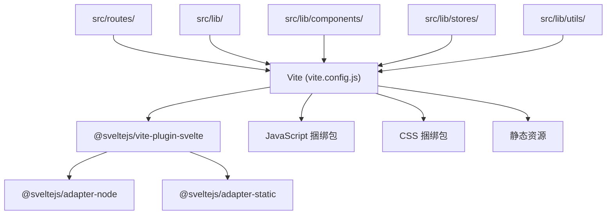
**来源：** [package.json1-153](https://github.com/open-webui/open-webui/blob/a7271532/package.json#L1-L153) [vite.config.js](https://github.com/open-webui/open-webui/blob/a7271532/vite.config.js) (推断)

### 路由结构

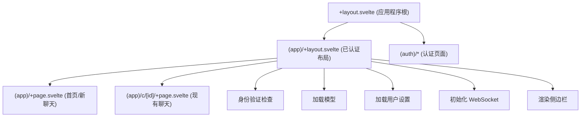
应用程序使用嵌套布局结构，其中 [src/routes/(app)/+layout.svelte1-300](https://github.com/open-webui/open-webui/blob/a7271532/src/routes/(app)/+layout.svelte#L1-L300) 处理身份验证、加载初始数据并渲染侧边栏。具体的页面如 [src/routes/(app)/+page.svelte1-16](https://github.com/open-webui/open-webui/blob/a7271532/src/routes/(app)/+page.svelte#L1-L16) 和 src/routes/(app)/c/ˈidˈ/+page.svelte:1-8 则使用适当的 Prop 渲染 `Chat.svelte` 组件。

**来源：** [src/routes/(app)/+layout.svelte1-300](https://github.com/open-webui/open-webui/blob/a7271532/src/routes/(app)/+layout.svelte#L1-L300) [src/routes/(app)/+page.svelte1-16](https://github.com/open-webui/open-webui/blob/a7271532/src/routes/(app)/+page.svelte#L1-L16) src/routes/(app)/c/ˈidˈ/+page.svelte:1-8

---

## 组件层次结构

前端遵循层次化的组件结构，`Chat.svelte` 是聊天功能的主要编排器。

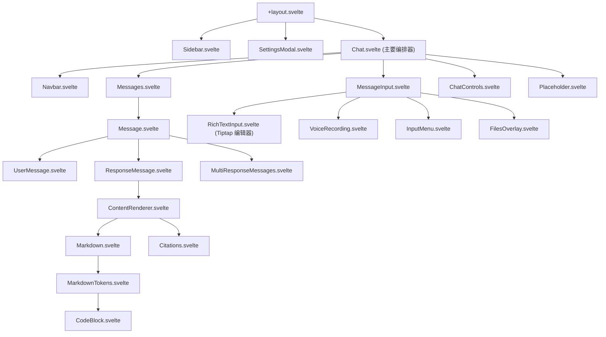
**来源：** [src/lib/components/chat/Chat.svelte1-2070](https://github.com/open-webui/open-webui/blob/a7271532/src/lib/components/chat/Chat.svelte#L1-L2070) [src/lib/components/chat/Messages.svelte1-340](https://github.com/open-webui/open-webui/blob/a7271532/src/lib/components/chat/Messages.svelte#L1-L340) [src/lib/components/chat/MessageInput.svelte1-2075](https://github.com/open-webui/open-webui/blob/a7271532/src/lib/components/chat/MessageInput.svelte#L1-L2075) [src/lib/components/chat/Messages/ResponseMessage.svelte1-1200](https://github.com/open-webui/open-webui/blob/a7271532/src/lib/components/chat/Messages/ResponseMessage.svelte#L1-L1200)

### Chat.svelte - 主要编排器

`Chat.svelte` 是编排所有聊天功能的中心组件。它负责管理：

| 职责 | 实现 |
| --- | --- |
| **消息历史管理** | 在 `history.messages` 对象中维护基于树的消息历史，包含父子关系 |
| **模型选择** | 跟踪 `selectedModels` 数组和用于 @ 提到的 `atSelectedModel` |
| **文件处理** | 管理已上传的文件数组和文件处理状态 |
| **WebSocket 事件** | 通过 `chatEventHandler` 函数订阅 Socket 事件 |
| **LLM 流式传输** | 处理流式响应并逐步更新消息状态 |
| **用户操作** | 委托给处理函数：`editMessage`, `deleteMessage`, `rateMessage`, `regenerateResponse` |

Chat.svelte 中的关键状态变量：

```
// 来自 Chat.svelte
let selectedModels = [''];           // 模型 ID 数组
let atSelectedModel: Model | undefined;  // 来自 @ 提到的模型
let history = {
  messages: {},
                      // 以消息 ID 为键
  currentId: null                    // 当前显示的消息
};
let prompt = '';                     // 当前输入文本
let files = [];                      // 已上传的文件
let generating = false;              // 响应正在生成中
let autoScroll = true;               // 自动滚动行为
```
**来源：** [src/lib/components/chat/Chat.svelte1-150](https://github.com/open-webui/open-webui/blob/a7271532/src/lib/components/chat/Chat.svelte#L1-L150) [src/lib/components/chat/Chat.svelte549-648](https://github.com/open-webui/open-webui/blob/a7271532/src/lib/components/chat/Chat.svelte#L549-L648)

### MessageInput.svelte - 输入编排

`MessageInput.svelte` 管理消息输入区域并协调多个输入相关组件：

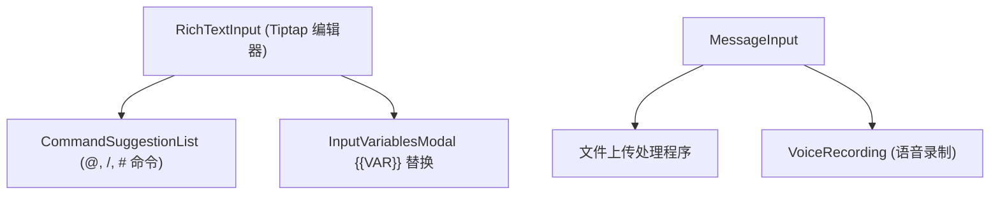
该组件通过 [src/lib/components/chat/MessageInput.svelte178-289](https://github.com/open-webui/open-webui/blob/a7271532/src/lib/components/chat/MessageInput.svelte#L178-L289) 中的 `textVariableHandler` 函数处理 `{{CLIPBOARD}}`、`{{CURRENT_DATE}}`、`{{USER_NAME}}` 等令牌的变量替换。

**来源：** [src/lib/components/chat/MessageInput.svelte1-2075](https://github.com/open-webui/open-webui/blob/a7271532/src/lib/components/chat/MessageInput.svelte#L1-L2075) [src/lib/components/chat/MessageInput.svelte178-289](https://github.com/open-webui/open-webui/blob/a7271532/src/lib/components/chat/MessageInput.svelte#L178-L289)

---

## 使用 Svelte Stores 进行状态管理

Open WebUI 使用 Svelte 内置的 Store 系统进行响应式状态管理。Store 定义在 `src/lib/stores/` 中，并在整个组件中通过 `$` 前缀语法访问。

### 核心 Store 架构

```mermaid
flowchart TD
    user["user (用户对象)"]
    config["config (后端配置)"]
    settings["settings (用户偏好)"]
    models["models (可用模型)"]
    chats["chats (聊天列表)"]
    chatId["chatId (当前聊天 ID)"]
    socket["socket (Socket.io 实例)"]
    showSidebar["showSidebar (显示侧边栏)"]
    showSettings["showSettings (显示设置)"]
    showControls["showControls (显示控件)"]
    mobile["mobile (移动端)"]
    temporaryChatEnabled["temporaryChatEnabled (已启用临时聊天)"]
    tools["tools (可用工具)"]
    functions["functions (可用函数)"]
    prompts["prompts (提示词模板)"]
    knowledge["knowledge (知识库)"]
    ChatComponent["Chat.svelte"]
    SidebarComponent["Sidebar.svelte"]
    MessageInputComponent["MessageInput.svelte"]

    user --> ChatComponent
    config --> ChatComponent
    settings --> ChatComponent
    models --> ChatComponent
    socket --> ChatComponent
    chats --> SidebarComponent
    showSidebar --> SidebarComponent
    tools --> MessageInputComponent
    settings --> MessageInputComponent
```
### Store 使用模式

组件使用 Svelte 的响应式 `$` 语法订阅 Store：

```
// Store 定义 (在 src/lib/stores/index.ts 中)
export const user = writable(null);
export const config = writable(null);
export const settings = writable({});

// 组件用法 (在任何 .svelte 文件中)
import { user, config, settings } from '$lib/stores';

// 使用 $ 前缀进行响应式访问
$: if ($user) {
  console.log($user.name);
}

// 直接更新
settings.update(s => ({ ...s, theme: 'dark' }));
```
### 关键 Store 类别

| Store | 类型 | 用途 | 更新者 |
| --- | --- | --- | --- |
| `user` | Writable | 当前用户对象 | 挂载时的 [+layout.svelte85-107](https://github.com/open-webui/open-webui/blob/a7271532/+layout.svelte#L85-L107) |
| `config` | Writable | 后端配置 | 挂载时的 [+layout.svelte85-107](https://github.com/open-webui/open-webui/blob/a7271532/+layout.svelte#L85-L107) |
| `settings` | Writable | 用户 UI 偏好设置 | SettingsModal, 已持久化到后端 |
| `models` | Writable | 可用的 LLM 模型 | 挂载和刷新时的 [+layout.svelte109-116](https://github.com/open-webui/open-webui/blob/a7271532/+layout.svelte#L109-L116) |
| `socket` | Writable | Socket.io 连接 | [+layout.svelte](https://github.com/open-webui/open-webui/blob/a7271532/+layout.svelte) 中的 WebSocket 初始化 |
| `chatId` | Writable | 当前活跃的聊天 ID | Chat.svelte 导航 |
| `history` | 局部状态 | 非全局 Store，按 Chat 实例维护 | Chat.svelte |

**来源：** [src/lib/stores/index.ts](https://github.com/open-webui/open-webui/blob/a7271532/src/lib/stores/index.ts) (根据导入推断), [src/routes/(app)/+layout.svelte85-136](https://github.com/open-webui/open-webui/blob/a7271532/src/routes/(app)/+layout.svelte#L85-L136) [src/lib/components/chat/Chat.svelte17-46](https://github.com/open-webui/open-webui/blob/a7271532/src/lib/components/chat/Chat.svelte#L17-L46)

---

## 富文本输入系统

消息输入使用了 Tiptap（一个构建在 ProseMirror 之上的无头编辑器框架），提供了具有 Markdown 互操作性的富文本编辑能力。

### Tiptap 编辑器架构

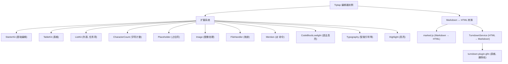
**来源：** [src/lib/components/common/RichTextInput.svelte1-1200](https://github.com/open-webui/open-webui/blob/a7271532/src/lib/components/common/RichTextInput.svelte#L1-L1200) [src/lib/components/common/RichTextInput.svelte117-162](https://github.com/open-webui/open-webui/blob/a7271532/src/lib/components/common/RichTextInput.svelte#L117-L162)

### Markdown-HTML 双向转换

编辑器维护了 Markdown 和 HTML 之间的双向转换：

**Markdown → HTML** (通过 marked.js):

-   任务列表自定义渲染器: [src/lib/components/common/RichTextInput.svelte5-29](https://github.com/open-webui/open-webui/blob/a7271532/src/lib/components/common/RichTextInput.svelte#L5-L29)
-   将 `- [ ]` 转换为 `<li data-type="taskItem" data-checked="false">`
-   将表格转换为 HTML 表格元素
-   使用 GFM (GitHub Flavored Markdown) 扩展

**HTML → Markdown** (通过 TurndownService):

-   表格自定义规则: [src/lib/components/common/RichTextInput.svelte42-82](https://github.com/open-webui/open-webui/blob/a7271532/src/lib/components/common/RichTextInput.svelte#L42-L82)
-   任务列表项自定义规则: [src/lib/components/common/RichTextInput.svelte84-94](https://github.com/open-webui/open-webui/blob/a7271532/src/lib/components/common/RichTextInput.svelte#L84-L94)
-   提及 (Mention) 自定义规则: [src/lib/components/common/RichTextInput.svelte97-106](https://github.com/open-webui/open-webui/blob/a7271532/src/lib/components/common/RichTextInput.svelte#L97-L106)
-   将 `<span data-type="mention">` 转回 `<@modelId>` 语法

```
// 来自 RichTextInput.svelte 的表格转换示例
turndownService.addRule('tables', {
  filter: 'table',
  replacement: function (content, node) {
    const rows = Array.from(node.querySelectorAll('tr'));
    let markdown = '\n';
    rows.forEach((row, rowIndex) => {
      const cells = Array.from(row.querySelectorAll('th, td'));
      const cellContents = cells.map((cell) => {
        let cellContent = turndownService.turndown(cell.innerHTML).trim();
        cellContent = cellContent.replace(/^\n+|\n+$/g, '');
        return cellContent;
      });
      markdown += '| ' + cellContents.join(' | ') + ' |\n';
      if (rowIndex === 0) {
        const separator = cells.map(() => '---').join(' | ');
        markdown += '| ' + separator + ' |\n';
      }
    });
    return markdown + '\n';
  }
});
```
**来源：** [src/lib/components/common/RichTextInput.svelte5-106](https://github.com/open-webui/open-webui/blob/a7271532/src/lib/components/common/RichTextInput.svelte#L5-L106)

### 命令建议系统

编辑器使用 Tiptap 的 Mention 扩展为 `@`, `/`, 和 `#` 命令实现了一个建议系统：

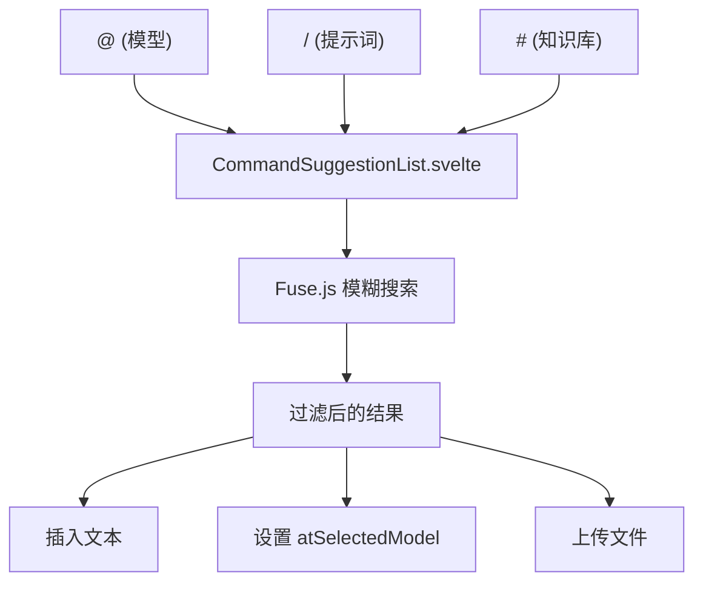
每个触发字符都会打开一个由 `CommandSuggestionList.svelte` 渲染的建议下拉菜单，该菜单会过滤可用选项（模型、提示词或知识文件）并处理选择。

**来源：** [src/lib/components/chat/MessageInput.svelte829-936](https://github.com/open-webui/open-webui/blob/a7271532/src/lib/components/chat/MessageInput.svelte#L829-L936) [src/lib/components/chat/MessageInput/CommandSuggestionList.svelte](https://github.com/open-webui/open-webui/blob/a7271532/src/lib/components/chat/MessageInput/CommandSuggestionList.svelte) (推断)

---

## 消息渲染管道

消息渲染系统将原始消息内容转换为丰富的、可交互的显示形式，包括 Markdown、代码块、引用等。

### 内容渲染流

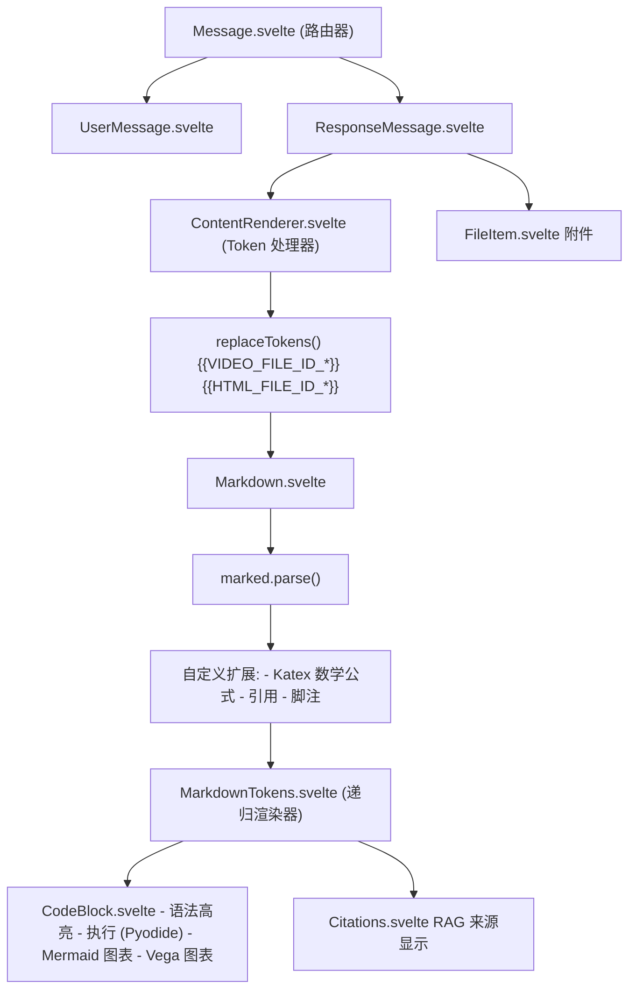
**来源：** [src/lib/components/chat/Messages/ResponseMessage.svelte1-1200](https://github.com/open-webui/open-webui/blob/a7271532/src/lib/components/chat/Messages/ResponseMessage.svelte#L1-L1200) [src/lib/components/chat/Messages/ContentRenderer.svelte](https://github.com/open-webui/open-webui/blob/a7271532/src/lib/components/chat/Messages/ContentRenderer.svelte) (推断), [src/lib/components/chat/Messages/Markdown.svelte](https://github.com/open-webui/open-webui/blob/a7271532/src/lib/components/chat/Messages/Markdown.svelte) (推断)

### Token 替换系统

[src/lib/utils/index.ts36-75](https://github.com/open-webui/open-webui/blob/a7271532/src/lib/utils/index.ts#L36-L75) 中的 `replaceTokens` 函数在渲染之前处理消息内容中的特殊 Token：

| Token 模式 | 替换内容 | 用途 |
| --- | --- | --- |
| `{{char}}` | 模型名称 | 角色扮演中的角色替换 |
| `{{user}}` | 用户名称 | 用户占位符 |
| `{{VIDEO_FILE_ID_*}}` | `<video>` 元素 | 内联视频播放 |
| `{{HTML_FILE_ID_*}}` | `<file type="html">` | HTML 文件嵌入 |

该函数通过在代码围栏标记处进行拆分，避免替换代码块内的 Token。

**来源：** [src/lib/utils/index.ts36-75](https://github.com/open-webui/open-webui/blob/a7271532/src/lib/utils/index.ts#L36-L75)

### Markdown 扩展

Open WebUI 使用自定义扩展扩展了 marked.js，用于数学表达式 (Katex)、引用和脚注：

**Katex 数学渲染：**

-   行内数学公式: `$...$` 或 `\(...\)`
-   块级数学公式: `$$...$$` 或 `\[...\]`
-   由 [src/lib/utils/marked/katex-extension.ts](https://github.com/open-webui/open-webui/blob/a7271532/src/lib/utils/marked/katex-extension.ts) 处理 (根据 package.json 推断)

**引用 (Citations):**

-   格式: `【†source_id†】` 或 `【†1†】`
-   渲染为可交互的引用按钮，链接到来源侧边栏
-   由自定义的 marked 扩展处理

**脚注 (Footnotes):**

-   标准 Markdown 脚注语法: `[^1]` 和 `[^1]: 脚注文本`
-   渲染在消息底部

**来源：** [package.json110](https://github.com/open-webui/open-webui/blob/a7271532/package.json#L110-L110) (katex 依赖), [src/lib/utils/marked/extension.ts](https://github.com/open-webui/open-webui/blob/a7271532/src/lib/utils/marked/extension.ts) (推断), [src/lib/components/chat/Messages/Citations.svelte](https://github.com/open-webui/open-webui/blob/a7271532/src/lib/components/chat/Messages/Citations.svelte) (推断)

### CodeBlock 执行

`CodeBlock.svelte` 提供了交互式的代码执行能力：

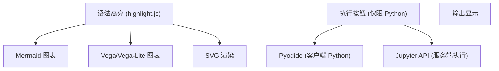
代码执行模式：

-   **Pyodide**：使用 WebAssembly 的客户端 Python 执行，从 [package.json132](https://github.com/open-webui/open-webui/blob/a7271532/package.json#L132-L132) 依赖加载
-   **Jupyter**：通过 `/jupyter/run` 端点进行服务端执行
-   **Mermaid**：针对语言为 `mermaid` 的代码块进行图表渲染
-   **Vega**：针对 `vega` 和 `vega-lite` 代码块的数据可视化

**来源：** [package.json132](https://github.com/open-webui/open-webui/blob/a7271532/package.json#L132-L132) (pyodide), [package.json116](https://github.com/open-webui/open-webui/blob/a7271532/package.json#L116-L116) (mermaid), [package.json141-142](https://github.com/open-webui/open-webui/blob/a7271532/package.json#L141-L142) (vega), [src/lib/components/chat/Messages/CodeBlock.svelte](https://github.com/open-webui/open-webui/blob/a7271532/src/lib/components/chat/Messages/CodeBlock.svelte) (推断)

---

## 实时 WebSocket 集成

前端使用 Socket.io 维持一个持久的 WebSocket 连接以进行实时更新。

### WebSocket 事件处理

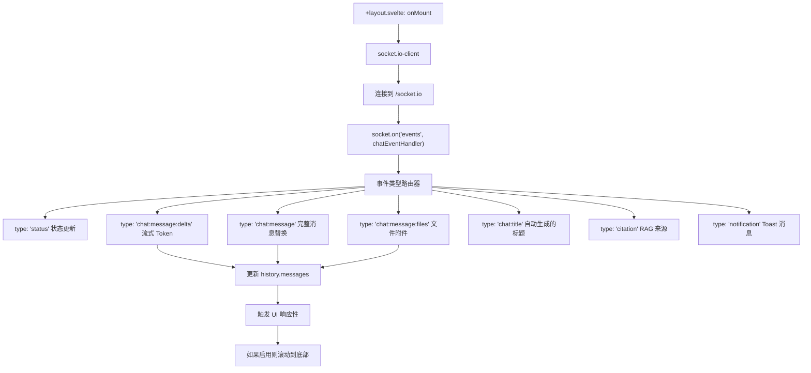
### 事件处理实现

[src/lib/components/chat/Chat.svelte351-478](https://github.com/open-webui/open-webui/blob/a7271532/src/lib/components/chat/Chat.svelte#L351-L478) 中的 `chatEventHandler` 函数处理入站的 WebSocket 事件：

```
const chatEventHandler = async (event, cb) => {
  if (event.chat_id === $chatId) {
    let message = history.messages[event.message_id];

    const type = event?.data?.type ?? null;
    const data = event?.data?.data ?? null;

    if (type === 'status') {
      // 追加到 statusHistory 数组
      message.statusHistory.push(data);
    } else if (type === 'chat:message:delta') {
      // 追加流式 Token
      message.content += data.content;
    } else if (type === 'chat:message') {
      // 替换整个消息
      message.content = data.content;
    } else if (type === 'citation') {
      // 添加 RAG 来源
      message.sources.push(data);
    }
    // ... 更多事件类型

    history.messages[event.message_id] = message;
  }
};
```
仅当 `event.chat_id` 与当前的 `$chatId` 匹配时才会处理事件，从而防止跨聊天的干扰。

**来源：** [src/lib/components/chat/Chat.svelte351-478](https://github.com/open-webui/open-webui/blob/a7271532/src/lib/components/chat/Chat.svelte#L351-L478) [src/lib/components/chat/Chat.svelte552](https://github.com/open-webui/open-webui/blob/a7271532/src/lib/components/chat/Chat.svelte#L552-L552) (socket 订阅), [package.json133](https://github.com/open-webui/open-webui/blob/a7271532/package.json#L133-L133) (socket.io-client)

---

## 前端依赖项

前端利用了大量的库来实现 UI、内容处理和特殊功能。

### 核心框架与 UI

| 包名 | 版本 | 用途 |
| --- | --- | --- |
| `svelte` | ^5.0.0 | 响应式 UI 框架 |
| `@sveltejs/kit` | ^2.5.27 | 应用程序框架 |
| `vite` | ^5.4.14 | 构建工具和开发服务器 |
| `tailwindcss` | ^4.0.0 | 原子化 CSS 框架 |
| `@tailwindcss/typography` | ^0.5.13 | 针对 Markdown 的 Prose 样式 |

**来源：** [package.json44](https://github.com/open-webui/open-webui/blob/a7271532/package.json#L44-L44) [package.json27](https://github.com/open-webui/open-webui/blob/a7271532/package.json#L27-L27) [package.json50](https://github.com/open-webui/open-webui/blob/a7271532/package.json#L50-L50) [package.json47](https://github.com/open-webui/open-webui/blob/a7271532/package.json#L47-L47) [package.json31](https://github.com/open-webui/open-webui/blob/a7271532/package.json#L31-L31)

### 富文本编辑

| 包名 | 用途 |
| --- | --- |
| `@tiptap/core` | 无头编辑器框架 |
| `@tiptap/starter-kit` | 基础编辑扩展 |
| `@tiptap/extension-table` | 表格支持 |
| `@tiptap/extension-mention` | @ 命令建议 |
| `@tiptap/extension-file-handler` | 拖放文件 |
| `marked` | Markdown 解析 |
| `turndown` | HTML 到 Markdown 转换 |
| `dompurify` | HTML 清洗 |

**来源：** [package.json67-84](https://github.com/open-webui/open-webui/blob/a7271532/package.json#L67-L84) [package.json115](https://github.com/open-webui/open-webui/blob/a7271532/package.json#L115-L115) [package.json137-138](https://github.com/open-webui/open-webui/blob/a7271532/package.json#L137-L138) [package.json95](https://github.com/open-webui/open-webui/blob/a7271532/package.json#L95-L95)

### 内容处理与渲染

| 包名 | 用途 |
| --- | --- |
| `highlight.js` | 语法高亮 |
| `lowlight` | 针对 Tiptap 的 highlight.js 集成 |
| `katex` | 数学表达式渲染 |
| `mermaid` | 图表生成 |
| `vega` / `vega-lite` | 数据可视化 |
| `pyodide` | 客户端 Python 执行 |

**来源：** [package.json101](https://github.com/open-webui/open-webui/blob/a7271532/package.json#L101-L101) [package.json113](https://github.com/open-webui/open-webui/blob/a7271532/package.json#L113-L113) [package.json110](https://github.com/open-webui/open-webui/blob/a7271532/package.json#L110-L110) [package.json116](https://github.com/open-webui/open-webui/blob/a7271532/package.json#L116-L116) [package.json141-142](https://github.com/open-webui/open-webui/blob/a7271532/package.json#L141-L142) [package.json132](https://github.com/open-webui/open-webui/blob/a7271532/package.json#L132-L132)

### 实用工具库

| 包名 | 用途 |
| --- | --- |
| `uuid` | 用于消息 ID 的 UUID 生成 |
| `dayjs` | 日期格式化与处理 |
| `fuse.js` | 用于命令建议的模糊搜索 |
| `socket.io-client` | WebSocket 通信 |
| `svelte-sonner` | Toast 通知 |
| `mammoth` | DOCX 文件解析 |
| `pdfjs-dist` | PDF 渲染 |

**来源：** [package.json140](https://github.com/open-webui/open-webui/blob/a7271532/package.json#L140-L140) [package.json94](https://github.com/open-webui/open-webui/blob/a7271532/package.json#L94-L94) [package.json99](https://github.com/open-webui/open-webui/blob/a7271532/package.json#L99-L99) [package.json133](https://github.com/open-webui/open-webui/blob/a7271532/package.json#L133-L133) [package.json135](https://github.com/open-webui/open-webui/blob/a7271532/package.json#L135-L135) [package.json114](https://github.com/open-webui/open-webui/blob/a7271532/package.json#L114-L114) [package.json119](https://github.com/open-webui/open-webui/blob/a7271532/package.json#L119-L119)

### 构建与开发

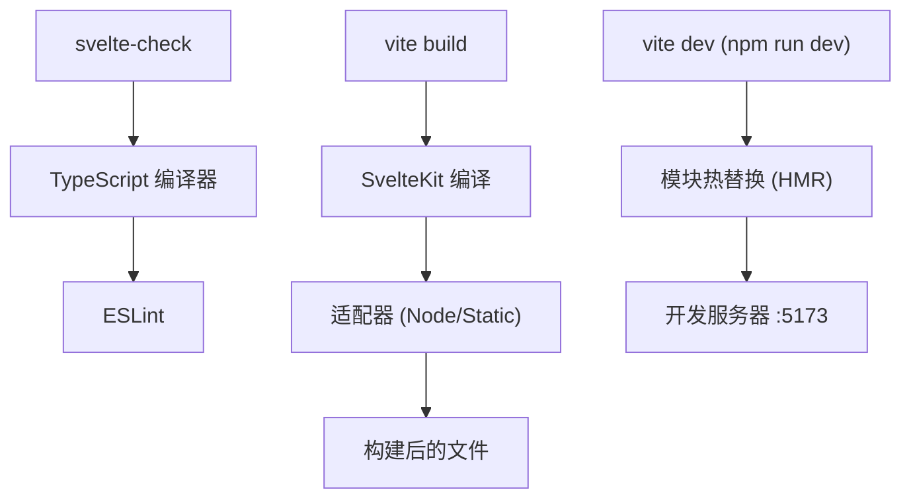
项目使用了自定义构建脚本：

-   `npm run dev`：启动带有 Pyodide 资源准备的 Vite 开发服务器
-   `npm run build`：带有 Pyodide 资源的生产环境构建
-   `npm run check`：使用 svelte-check 进行类型检查
-   `npm run pyodide:fetch`：预取 Pyodide 运行时文件

**来源：** [package.json5-22](https://github.com/open-webui/open-webui/blob/a7271532/package.json#L5-L22) [package.json24-51](https://github.com/open-webui/open-webui/blob/a7271532/package.json#L24-L51) (devDependencies)

---

## 国际化 (i18n)

Open WebUI 支持 20 种语言，并使用 i18next 提供全面的翻译系统。

### 翻译架构

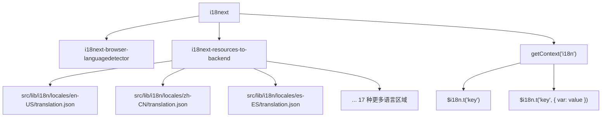
组件通过 Svelte 上下文访问翻译：

```
import { getContext } from 'svelte';
const i18n = getContext('i18n');

// 简单翻译
$i18n.t('Hello World')

// 带有插值
$i18n.t('Welcome, {{name}}!', { name: $user.name })

// 带有复数形式
$i18n.t('{{count}} messages', { count: 5 })
```
**来源：** [package.json104-106](https://github.com/open-webui/open-webui/blob/a7271532/package.json#L104-L106) (i18n 相关包), [src/lib/components/chat/Chat.svelte8](https://github.com/open-webui/open-webui/blob/a7271532/src/lib/components/chat/Chat.svelte#L8-L8) (用法模式), [CHANGELOG.md58](https://github.com/open-webui/open-webui/blob/a7271532/CHANGELOG.md#L58-L58) (提到了 20 种语言区域)

---

本文档涵盖了核心的前端架构。有关具体的消息渲染详情，请参阅[消息渲染](/open-webui/open-webui/5-message-rendering)。有关实时通信的实现，请参阅[实时通信](/open-webui/open-webui/16-real-time-communication)。有关富文本编辑的协作特性，请参阅[协作编辑](/open-webui/open-webui/9.3-collaborative-editing)。
