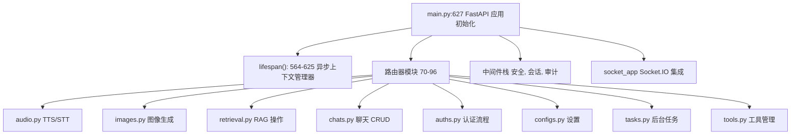
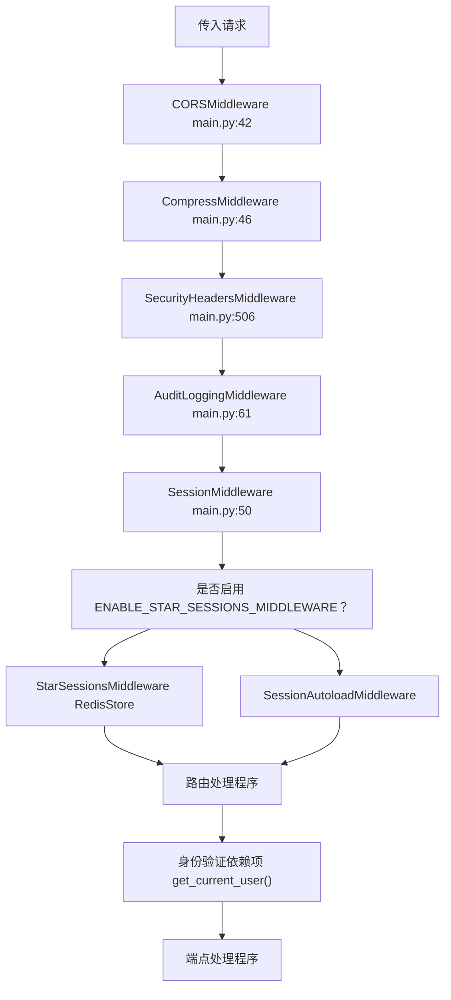
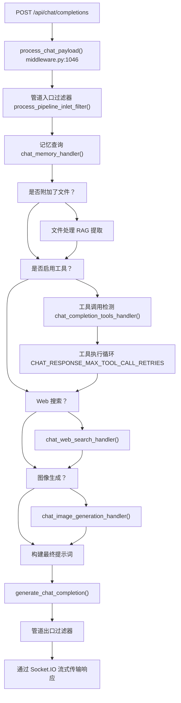
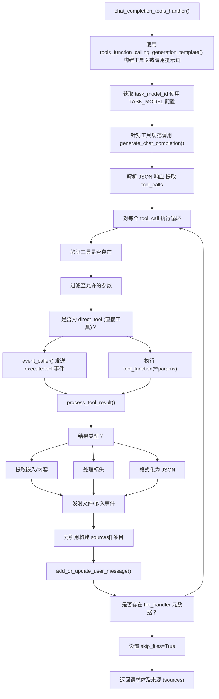
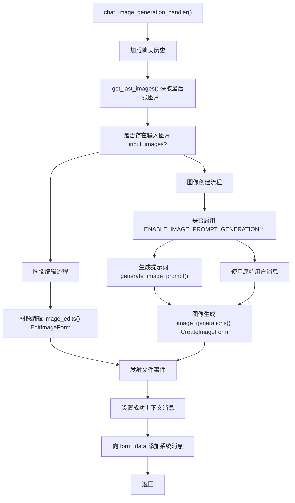
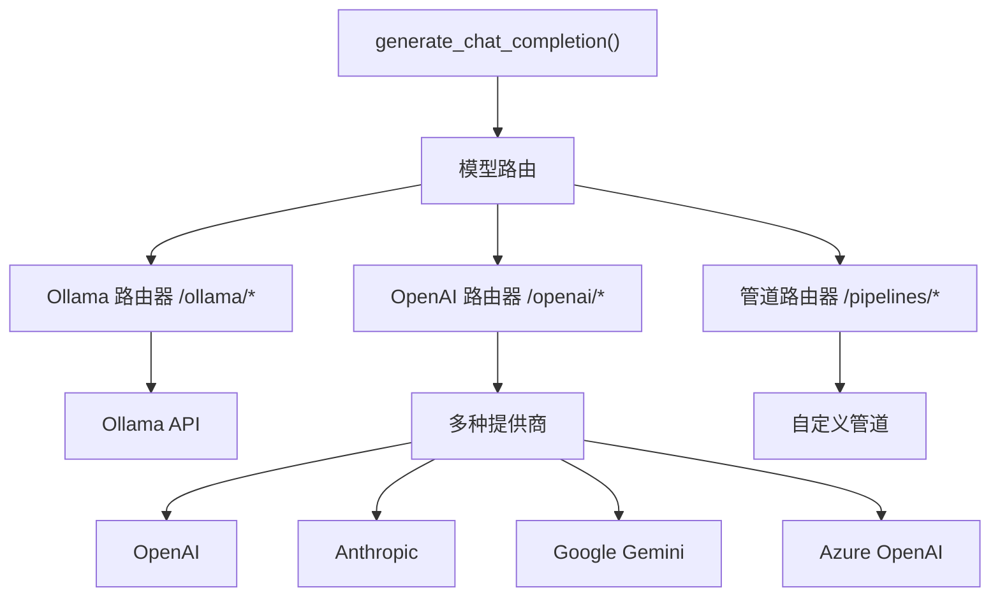
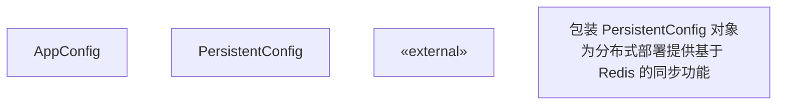

# 后端架构

相关源文件

-   [backend/open\_webui/config.py](https://github.com/open-webui/open-webui/blob/a7271532/backend/open_webui/config.py)
-   [backend/open\_webui/env.py](https://github.com/open-webui/open-webui/blob/a7271532/backend/open_webui/env.py)
-   [backend/open\_webui/main.py](https://github.com/open-webui/open-webui/blob/a7271532/backend/open_webui/main.py)
-   [backend/open\_webui/retrieval/loaders/datalab\_marker.py](https://github.com/open-webui/open-webui/blob/a7271532/backend/open_webui/retrieval/loaders/datalab_marker.py)
-   [backend/open\_webui/retrieval/loaders/external\_document.py](https://github.com/open-webui/open-webui/blob/a7271532/backend/open_webui/retrieval/loaders/external_document.py)
-   [backend/open\_webui/retrieval/loaders/external\_web.py](https://github.com/open-webui/open-webui/blob/a7271532/backend/open_webui/retrieval/loaders/external_web.py)
-   [backend/open\_webui/retrieval/loaders/main.py](https://github.com/open-webui/open-webui/blob/a7271532/backend/open_webui/retrieval/loaders/main.py)
-   [backend/open\_webui/retrieval/loaders/mineru.py](https://github.com/open-webui/open-webui/blob/a7271532/backend/open_webui/retrieval/loaders/mineru.py)
-   [backend/open\_webui/retrieval/loaders/mistral.py](https://github.com/open-webui/open-webui/blob/a7271532/backend/open_webui/retrieval/loaders/mistral.py)
-   [backend/open\_webui/retrieval/utils.py](https://github.com/open-webui/open-webui/blob/a7271532/backend/open_webui/retrieval/utils.py)
-   [backend/open\_webui/routers/audio.py](https://github.com/open-webui/open-webui/blob/a7271532/backend/open_webui/routers/audio.py)
-   [backend/open\_webui/routers/auths.py](https://github.com/open-webui/open-webui/blob/a7271532/backend/open_webui/routers/auths.py)
-   [backend/open\_webui/routers/ollama.py](https://github.com/open-webui/open-webui/blob/a7271532/backend/open_webui/routers/ollama.py)
-   [backend/open\_webui/routers/openai.py](https://github.com/open-webui/open-webui/blob/a7271532/backend/open_webui/routers/openai.py)
-   [backend/open\_webui/routers/retrieval.py](https://github.com/open-webui/open-webui/blob/a7271532/backend/open_webui/routers/retrieval.py)
-   [backend/open\_webui/utils/auth.py](https://github.com/open-webui/open-webui/blob/a7271532/backend/open_webui/utils/auth.py)
-   [backend/open\_webui/utils/embeddings.py](https://github.com/open-webui/open-webui/blob/a7271532/backend/open_webui/utils/embeddings.py)
-   [backend/open\_webui/utils/middleware.py](https://github.com/open-webui/open-webui/blob/a7271532/backend/open_webui/utils/middleware.py)
-   [backend/open\_webui/utils/misc.py](https://github.com/open-webui/open-webui/blob/a7271532/backend/open_webui/utils/misc.py)
-   [backend/open\_webui/utils/oauth.py](https://github.com/open-webui/open-webui/blob/a7271532/backend/open_webui/utils/oauth.py)
-   [backend/open\_webui/utils/response.py](https://github.com/open-webui/open-webui/blob/a7271532/backend/open_webui/utils/response.py)
-   [src/lib/apis/retrieval/index.ts](https://github.com/open-webui/open-webui/blob/a7271532/src/lib/apis/retrieval/index.ts)
-   [src/lib/components/admin/Settings/Documents.svelte](https://github.com/open-webui/open-webui/blob/a7271532/src/lib/components/admin/Settings/Documents.svelte)
-   [src/lib/components/admin/Settings/WebSearch.svelte](https://github.com/open-webui/open-webui/blob/a7271532/src/lib/components/admin/Settings/WebSearch.svelte)

## 目的和范围

本文档描述了 Open WebUI 基于 FastAPI 的后端架构，包括应用程序结构、路由组织、中间件栈以及复杂的聊天完成 (chat completion) 处理管道。有关数据层（数据库、向量存储、缓存）的信息，请参阅[数据层](/open-webui/open-webui/2.3-backend-architecture)。有关前端架构详情，请参阅[前端架构](/open-webui/open-webui/2.1-system-components-and-data-flow)。

---

## 应用程序结构概览

后端是一个具有模块化路由架构的 FastAPI 应用程序。主应用程序定义在 [backend/open\_webui/main.py627-633](https://github.com/open-webui/open-webui/blob/a7271532/backend/open_webui/main.py#L627-L633) 中，并负责编排多个路由器、中间件组件和状态管理系统。

**应用程序入口点结构**


**来源：** [backend/open\_webui/main.py1-627](https://github.com/open-webui/open-webui/blob/a7271532/backend/open_webui/main.py#L1-L627)

---

## FastAPI 应用程序初始化

应用程序初始化分为两个阶段：启动配置和生命周期管理。

### 生命周期上下文管理器

`lifespan` 异步上下文管理器 [backend/open\_webui/main.py564-625](https://github.com/open-webui/open-webui/blob/a7271532/backend/open_webui/main.py#L564-L625) 处理启动和关闭：

> **[Mermaid sequence]**
> *(图表结构无法解析)*

**关键初始化步骤：**

1.  **实例标识** [main.py566](https://github.com/open-webui/open-webui/blob/a7271532/main.py#L566-L566)：为分布式部署设置唯一的 `INSTANCE_ID`。
2.  **许可证验证** [main.py572-573](https://github.com/open-webui/open-webui/blob/a7271532/main.py#L572-L573)：如果提供了许可证密钥，则进行验证。
3.  **依赖安装** [main.py577-578](https://github.com/open-webui/open-webui/blob/a7271532/main.py#L577-L578)：同步安装外部函数/工具的依赖项。
4.  **Redis 连接** [main.py580-587](https://github.com/open-webui/open-webui/blob/a7271532/main.py#L580-L587)：建立用于分布式状态的 Redis 连接。
5.  **任务监听器** [main.py589-592](https://github.com/open-webui/open-webui/blob/a7271532/main.py#L589-L592)：启动后台任务命令监听器。
6.  **线程池** [main.py594-596](https://github.com/open-webui/open-webui/blob/a7271532/main.py#L594-L596)：配置 AnyIO 线程池大小。
7.  **模型缓存** [main.py600-619](https://github.com/open-webui/open-webui/blob/a7271532/main.py#L600-L619)：（可选）预取模型列表。

**来源：** [backend/open\_webui/main.py564-625](https://github.com/open-webui/open-webui/blob/a7271532/backend/open_webui/main.py#L564-L625) [backend/open\_webui/env.py142-143](https://github.com/open-webui/open-webui/blob/a7271532/backend/open_webui/env.py#L142-L143)

---

## 路由组织

后端将端点组织到 17 个不同的路由器中，每个路由器处理特定的功能领域：

| 路由器 | 路径前缀 | 主要职责 | 关键文件 |
| --- | --- | --- | --- |
| `auths` | `/api/v1/auths` | 身份验证流程、OAuth、LDAP | [routers/auths.py](https://github.com/open-webui/open-webui/blob/a7271532/routers/auths.py) |
| `chats` | `/api/v1/chats` | 聊天 CRUD 操作、历史记录管理 | [routers/chats.py](https://github.com/open-webui/open-webui/blob/a7271532/routers/chats.py) |
| `channels` | `/api/v1/channels` | 基于频道的通信 | [routers/channels.py](https://github.com/open-webui/open-webui/blob/a7271532/routers/channels.py) |
| `retrieval` | `/api/v1/retrieval` | RAG 操作、Web 搜索、嵌入 | [routers/retrieval.py](https://github.com/open-webui/open-webui/blob/a7271532/routers/retrieval.py) |
| `tasks` | `/api/v1/tasks` | 后台任务生成（标题、标签） | [routers/tasks.py](https://github.com/open-webui/open-webui/blob/a7271532/routers/tasks.py) |
| `tools` | `/api/v1/tools` | 工具管理、MCP/OpenAPI 服务器 | [routers/tools.py](https://github.com/open-webui/open-webui/blob/a7271532/routers/tools.py) |
| `functions` | `/api/v1/functions` | 自定义函数管理 | [routers/functions.py](https://github.com/open-webui/open-webui/blob/a7271532/routers/functions.py) |
| `configs` | `/api/v1/configs` | 配置端点、工具服务器 | [routers/configs.py](https://github.com/open-webui/open-webui/blob/a7271532/routers/configs.py) |
| `images` | `/api/v1/images` | 图像生成 (SD, ComfyUI, OpenAI) | [routers/images.py](https://github.com/open-webui/open-webui/blob/a7271532/routers/images.py) |
| `audio` | `/api/v1/audio` | TTS/STT 服务 | [routers/audio.py](https://github.com/open-webui/open-webui/blob/a7271532/routers/audio.py) |
| `pipelines` | `/api/v1/pipelines` | 管道过滤器 (inlet/outlet) | [routers/pipelines.py](https://github.com/open-webui/open-webui/blob/a7271532/routers/pipelines.py) |
| `models` | `/api/v1/models` | 模型管理操作 | [routers/models.py](https://github.com/open-webui/open-webui/blob/a7271532/routers/models.py) |
| `users` | `/api/v1/users` | 用户管理 | [routers/users.py](https://github.com/open-webui/open-webui/blob/a7271532/routers/users.py) |
| `groups` | `/api/v1/groups` | 基于角色的访问控制 (RBAC) 组管理 | [routers/groups.py](https://github.com/open-webui/open-webui/blob/a7271532/routers/groups.py) |
| `files` | `/api/v1/files` | 文件上传/存储 | [routers/files.py](https://github.com/open-webui/open-webui/blob/a7271532/routers/files.py) |
| `knowledge` | `/api/v1/knowledge` | 知识库管理 | [routers/knowledge.py](https://github.com/open-webui/open-webui/blob/a7271532/routers/knowledge.py) |
| `memories` | `/api/v1/memories` | 记忆存储/检索 | [routers/memories.py](https://github.com/open-webui/open-webui/blob/a7271532/routers/memories.py) |
| `prompts` | `/api/v1/prompts` | 提示词模板管理 | [routers/prompts.py](https://github.com/open-webui/open-webui/blob/a7271532/routers/prompts.py) |
| `notes` | `/api/v1/notes` | 笔记功能 | [routers/notes.py](https://github.com/open-webui/open-webui/blob/a7271532/routers/notes.py) |
| `folders` | `/api/v1/folders` | 聊天文件夹组织 | [routers/folders.py](https://github.com/open-webui/open-webui/blob/a7271532/routers/folders.py) |
| `evaluations` | `/api/v1/evaluations` | 模型评价竞技场 | [routers/evaluations.py](https://github.com/open-webui/open-webui/blob/a7271532/routers/evaluations.py) |
| `utils` | `/api/v1/utils` | 工具性端点 | [routers/utils.py](https://github.com/open-webui/open-webui/blob/a7271532/routers/utils.py) |
| `scim` | `/api/scim/v2` | SCIM 用户置办 | [routers/scim.py](https://github.com/open-webui/open-webui/blob/a7271532/routers/scim.py) |
| `ollama` | `/ollama` | Ollama 代理 | [routers/ollama.py](https://github.com/open-webui/open-webui/blob/a7271532/routers/ollama.py) |
| `openai` | `/openai` | 兼容 OpenAI 的 API | [routers/openai.py](https://github.com/open-webui/open-webui/blob/a7271532/routers/openai.py) |

**路由器注册模式** [backend/open\_webui/main.py70-96](https://github.com/open-webui/open-webui/blob/a7271532/backend/open_webui/main.py#L70-L96)：

```
from open_webui.routers import (
    audio, images, ollama, openai, retrieval, pipelines,
    tasks, auths, channels, chats, notes, folders,
    configs, groups, files, functions, memories,
    models, knowledge, prompts, evaluations,
    tools, users, utils, scim,
)
```
通过 FastAPI 的 `app.include_router()` 机制，每个路由器都以其对应的路径前缀包含在主应用中。该应用程序包含 25 个不同的路由器，涵盖了身份验证、数据管理、AI 操作和实用功能。

**来源：** [backend/open\_webui/main.py70-96](https://github.com/open-webui/open-webui/blob/a7271532/backend/open_webui/main.py#L70-L96)

---

## 中间件栈

中间件栈按特定顺序处理请求，实现了安全性、身份验证、会话管理和审计功能：


### 中间件组件

1.  **CORSMiddleware** [main.py - CORS 配置](https://github.com/open-webui/open-webui/blob/a7271532/main.py - CORS 配置)
    -   通过 `CORS_ALLOW_ORIGIN` 环境变量配置
    -   处理针对前端的跨源请求
2.  **CompressMiddleware** [main.py46](https://github.com/open-webui/open-webui/blob/a7271532/main.py#L46-L46)
    -   可通过 `ENABLE_COMPRESSION_MIDDLEWARE` 选择性开启
    -   压缩响应以减少带宽消耗
3.  **SecurityHeadersMiddleware** [utils/security\_headers.py](https://github.com/open-webui/open-webui/blob/a7271532/utils/security_headers.py)
    -   添加安全标头（CSP, X-Frame-Options 等）
4.  **AuditLoggingMiddleware** [utils/audit.py](https://github.com/open-webui/open-webui/blob/a7271532/utils/audit.py)
    -   根据 `AUDIT_LOG_LEVEL` 记录请求
    -   排除匹配 `AUDIT_EXCLUDED_PATHS` 的路径
    -   将请求体截断至 `MAX_BODY_LOG_SIZE` 大小
5.  **会话管理**
    -   **标准模式**：使用 `WEBUI_SECRET_KEY` 的 `SessionMiddleware`
    -   **基于 Redis 的模式**：使用 `RedisStore` 的 `StarSessionsMiddleware` [main.py - 会话配置](https://github.com/open-webui/open-webui/blob/a7271532/main.py - 会话配置)
    -   Cookie 配置：`WEBUI_SESSION_COOKIE_SAME_SITE`, `WEBUI_SESSION_COOKIE_SECURE`

**来源：** [backend/open\_webui/main.py](https://github.com/open-webui/open-webui/blob/a7271532/backend/open_webui/main.py) [backend/open\_webui/utils/security\_headers.py](https://github.com/open-webui/open-webui/blob/a7271532/backend/open_webui/utils/security_headers.py) [backend/open\_webui/utils/audit.py](https://github.com/open-webui/open-webui/blob/a7271532/backend/open_webui/utils/audit.py) [backend/open\_webui/env.py454-481](https://github.com/open-webui/open-webui/blob/a7271532/backend/open_webui/env.py#L454-L481)

---

## 聊天完成处理管道

聊天完成处理管道是后端最复杂的组件，在请求到达 LLM 之前编排了多个阶段的请求转换。

### 管道架构


### 中间件入口点

`process_chat_payload()` 函数 [backend/open\_webui/utils/middleware.py1046-1449](https://github.com/open-webui/open-webui/blob/a7271532/backend/open_webui/utils/middleware.py#L1046-L1449) 是中心编排器：

**函数签名：**

```
async def process_chat_payload(
    request: Request,
    form_data: dict,
    metadata: dict,
    user: UserModel,
    files: list = [],
)
```
**主要职责：**

1.  提取并验证请求参数
2.  设置用于实时更新的事件发射器 (event emitter)
3.  按顺序执行各个处理阶段
4.  从多个源构建上下文
5.  处理流式响应

**来源：** [backend/open\_webui/utils/middleware.py1046-1449](https://github.com/open-webui/open-webui/blob/a7271532/backend/open_webui/utils/middleware.py#L1046-L1449)

### 处理阶段详情

#### 第 1 阶段：入口 (Inlet) 过滤器

**函数**：`process_pipeline_inlet_filter()` [backend/open\_webui/routers/pipelines.py](https://github.com/open-webui/open-webui/blob/a7271532/backend/open_webui/routers/pipelines.py)

应用系统中注册的自定义管道过滤器。过滤器可以：

-   修改消息
-   添加上下文
-   阻止请求
-   转换载荷

**来源：** [backend/open\_webui/routers/pipelines.py](https://github.com/open-webui/open-webui/blob/a7271532/backend/open_webui/routers/pipelines.py)

#### 第 2 阶段：记忆查询

**函数**：`chat_memory_handler()` [backend/open\_webui/utils/middleware.py517-554](https://github.com/open-webui/open-webui/blob/a7271532/backend/open_webui/utils/middleware.py#L517-L554)

从用户的记忆存储中检索相关的过去交互：

> **[Mermaid sequence]**
> *(图表结构无法解析)*

记忆查询过程：

1.  提取最后一条用户消息作为查询
2.  搜索用户的记忆集合 (top-k=3)
3.  使用创建时间戳对结果进行格式化
4.  作为用户上下文附加到系统消息中

**来源：** [backend/open\_webui/utils/middleware.py517-554](https://github.com/open-webui/open-webui/blob/a7271532/backend/open_webui/utils/middleware.py#L517-L554) [backend/open\_webui/routers/memories.py56-70](https://github.com/open-webui/open-webui/blob/a7271532/backend/open_webui/routers/memories.py#L56-L70)

#### 第 3 阶段：文件/RAG 处理

**函数**：`chat_completion_files_handler()` [backend/open\_webui/utils/middleware.py997-1043](https://github.com/open-webui/open-webui/blob/a7271532/backend/open_webui/utils/middleware.py#L997-L1043)

处理附加的文件，并在存在文件时执行 RAG 检索。此阶段负责：

-   从请求中提取文件元数据
-   生成检索查询（如果已启用）
-   跨文件集合执行向量搜索
-   对结果应用重排序
-   将相关上下文注入系统消息

RAG 系统支持多种文档加载器，包括：

-   **PyPDFLoader**：标准的 PDF 处理
-   **TikaLoader**：Apache Tika 服务器集成 [backend/open\_webui/retrieval/loaders/main.py93-132](https://github.com/open-webui/open-webui/blob/a7271532/backend/open_webui/retrieval/loaders/main.py#L93-L132)
-   **DatalabMarkerLoader**：高级 PDF/文档处理，可选 LLM 增强 [backend/open\_webui/retrieval/loaders/datalab\_marker.py13-204](https://github.com/open-webui/open-webui/blob/a7271532/backend/open_webui/retrieval/loaders/datalab_marker.py#L13-L204)
-   **DoclingLoader**：Docling 服务器集成 [backend/open\_webui/retrieval/loaders/main.py134-185](https://github.com/open-webui/open-webui/blob/a7271532/backend/open_webui/retrieval/loaders/main.py#L134-L185)
-   **MinerULoader**：OCR 及公式检测 [backend/open\_webui/retrieval/loaders/mineru.py](https://github.com/open-webui/open-webui/blob/a7271532/backend/open_webui/retrieval/loaders/mineru.py)
-   **ExternalDocumentLoader**：外部服务集成 [backend/open\_webui/retrieval/loaders/external\_document.py15-92](https://github.com/open-webui/open-webui/blob/a7271532/backend/open_webui/retrieval/loaders/external_document.py#L15-L92)

**来源：** [backend/open\_webui/utils/middleware.py997-1043](https://github.com/open-webui/open-webui/blob/a7271532/backend/open_webui/utils/middleware.py#L997-L1043) [backend/open\_webui/retrieval/loaders/main.py187-336](https://github.com/open-webui/open-webui/blob/a7271532/backend/open_webui/retrieval/loaders/main.py#L187-L336) [backend/open\_webui/retrieval/loaders/datalab\_marker.py1-204](https://github.com/open-webui/open-webui/blob/a7271532/backend/open_webui/retrieval/loaders/datalab_marker.py#L1-L204)

#### 第 4 阶段：工具执行

**函数**：`chat_completion_tools_handler()` [backend/open\_webui/utils/middleware.py287-514](https://github.com/open-webui/open-webui/blob/a7271532/backend/open_webui/utils/middleware.py#L287-L514)

实现了一个复杂的工具调用机制，并带有重试循环：

**工具检测流程：**


**关键特性：**

-   **规范生成**：从工具定义中创建 JSON Schema
-   **基于 LLM 的检测**：使用任务模型确定调用哪些工具
-   **参数验证**：将参数过滤为仅限 OpenAPI 规范中允许的参数
-   **直接调用 vs 可调用**：同时支持客户端（直接）工具和服务器端工具
-   **结果处理**：处理 HTML 嵌入、文件附件、JSON 数据
-   **引用支持**：为工具结果构建来源条目
-   **文件处理跳过**：工具可以将自己标记为文件处理程序，以跳过文件处理

工具执行支持多种工具类型：

-   **OpenAPI 工具**：具有 OpenAPI 规范的标准 RESTful API 工具
-   **MCP (Model Context Protocol) 工具**：动态客户端注册与执行
-   **直接 (Direct) 工具**：通过 Socket.IO 事件在客户端执行

**来源：** [backend/open\_webui/utils/middleware.py287-514](https://github.com/open-webui/open-webui/blob/a7271532/backend/open_webui/utils/middleware.py#L287-L514) [backend/open\_webui/utils/task.py78-82](https://github.com/open-webui/open-webui/blob/a7271532/backend/open_webui/utils/task.py#L78-L82) [backend/open\_webui/utils/middleware.py144-284](https://github.com/open-webui/open-webui/blob/a7271532/backend/open_webui/utils/middleware.py#L144-L284)

#### 第 5 阶段：Web 搜索

**函数**：`chat_web_search_handler()` [backend/open\_webui/utils/middleware.py556-716](https://github.com/open-webui/open-webui/blob/a7271532/backend/open_webui/utils/middleware.py#L556-L716)

执行 Web 搜索并整合结果：

**搜索流程：**

> **[Mermaid sequence]**
> *(图表结构无法解析)*

**查询生成：**

-   使用 `generate_queries()` [backend/open\_webui/routers/tasks.py](https://github.com/open-webui/open-webui/blob/a7271532/backend/open_webui/routers/tasks.py)
-   尝试 JSON 解析，若失败则回退至单一查询
-   可通过 `ENABLE_QUERIES_CACHE` 进行缓存 [backend/open\_webui/env.py611-613](https://github.com/open-webui/open-webui/blob/a7271532/backend/open_webui/env.py#L611-L613)

**搜索执行：**

-   并发请求（由 `WEB_SEARCH_CONCURRENT_REQUESTS` 配置）
-   支持 20 多种搜索引擎，包括：
    -   **Brave Search** [backend/open\_webui/retrieval/web/brave.py](https://github.com/open-webui/open-webui/blob/a7271532/backend/open_webui/retrieval/web/brave.py)
    -   **Tavily** [backend/open\_webui/retrieval/web/tavily.py](https://github.com/open-webui/open-webui/blob/a7271532/backend/open_webui/retrieval/web/tavily.py)
    -   **SearXNG** [backend/open\_webui/retrieval/web/searxng.py](https://github.com/open-webui/open-webui/blob/a7271532/backend/open_webui/retrieval/web/searxng.py)
    -   **Google PSE** [backend/open\_webui/retrieval/web/google\_pse.py](https://github.com/open-webui/open-webui/blob/a7271532/backend/open_webui/retrieval/web/google_pse.py)
    -   **DuckDuckGo** [backend/open\_webui/retrieval/web/duckduckgo.py](https://github.com/open-webui/open-webui/blob/a7271532/backend/open_webui/retrieval/web/duckduckgo.py)
    -   **Serper**, **Serpstack**, **SerpAPI** [backend/open\_webui/retrieval/web/serper.py](https://github.com/open-webui/open-webui/blob/a7271532/backend/open_webui/retrieval/web/serper.py)
    -   **Perplexity** [backend/open\_webui/retrieval/web/perplexity.py](https://github.com/open-webui/open-webui/blob/a7271532/backend/open_webui/retrieval/web/perplexity.py)
    -   **External** 自定义搜索引擎 [backend/open\_webui/retrieval/web/external.py](https://github.com/open-webui/open-webui/blob/a7271532/backend/open_webui/retrieval/web/external.py)
-   结果要么嵌入到向量存储中，要么作为原始文档返回（由 `BYPASS_WEB_SEARCH_EMBEDDING_AND_RETRIEVAL` 控制）

**来源：** [backend/open\_webui/utils/middleware.py556-716](https://github.com/open-webui/open-webui/blob/a7271532/backend/open_webui/utils/middleware.py#L556-L716) [backend/open\_webui/routers/retrieval.py687-994](https://github.com/open-webui/open-webui/blob/a7271532/backend/open_webui/routers/retrieval.py#L687-L994) [backend/open\_webui/retrieval/web/](https://github.com/open-webui/open-webui/blob/a7271532/backend/open_webui/retrieval/web/)

#### 第 6 阶段：图像生成

**函数**：`chat_image_generation_handler()` [backend/open\_webui/utils/middleware.py755-924](https://github.com/open-webui/open-webui/blob/a7271532/backend/open_webui/utils/middleware.py#L755-L924)

处理图像的创建和编辑：

**图像操作决策：**


**提示词增强：**

-   使用 `generate_image_prompt()` [backend/open\_webui/routers/tasks.py](https://github.com/open-webui/open-webui/blob/a7271532/backend/open_webui/routers/tasks.py) 通过 LLM 改进提示词
-   如果生成失败，则回退到原始用户消息

**上下文注入：**

-   添加系统消息，指示图像已被创建/编辑
-   帮助 LLM 理解发生了什么并做出适当响应

**来源：** [backend/open\_webui/utils/middleware.py755-924](https://github.com/open-webui/open-webui/blob/a7271532/backend/open_webui/utils/middleware.py#L755-L924) [backend/open\_webui/routers/images.py46-181](https://github.com/open-webui/open-webui/blob/a7271532/backend/open_webui/routers/images.py#L46-L181) [backend/open\_webui/routers/tasks.py142-184](https://github.com/open-webui/open-webui/blob/a7271532/backend/open_webui/routers/tasks.py#L142-L184)

### 最终 LLM 调用

在所有增强阶段完成后，最终的提示词将通过 `generate_chat_completion()` [backend/open\_webui/utils/chat.py74-327](https://github.com/open-webui/open-webui/blob/a7271532/backend/open_webui/utils/chat.py#L74-L327) 发送给 LLM。

**请求流：**


**针对工具调用的重试循环：**

系统实现了一个重试循环（最大重试次数：`CHAT_RESPONSE_MAX_TOOL_CALL_RETRIES` [backend/open\_webui/env.py602-604](https://github.com/open-webui/open-webui/blob/a7271532/backend/open_webui/env.py#L602-L604)），以处理多步骤的工具交互，其中 LLM 可能需要根据之前的结果多次调用工具。

**出口 (Outlet) 过滤器：**

LLM 响应后，`process_pipeline_outlet_filter()` 函数 [backend/open\_webui/routers/pipelines.py](https://github.com/open-webui/open-webui/blob/a7271532/backend/open_webui/routers/pipelines.py) 会应用后处理过滤器，这些过滤器可以：

-   修改最终响应
-   添加元数据
-   过滤内容
-   记录交互

**来源：** [backend/open\_webui/utils/middleware.py1046-1449](https://github.com/open-webui/open-webui/blob/a7271532/backend/open_webui/utils/middleware.py#L1046-L1449) [backend/open\_webui/env.py602-604](https://github.com/open-webui/open-webui/blob/a7271532/backend/open_webui/env.py#L602-L604) [backend/open\_webui/utils/chat.py74-327](https://github.com/open-webui/open-webui/blob/a7271532/backend/open_webui/utils/chat.py#L74-L327)

---

## 应用程序状态管理

FastAPI 应用程序在 `app.state` 中维护状态，该状态可跨所有请求和中间件访问。

### 状态结构

**核心状态变量** [main.py643-976](https://github.com/open-webui/open-webui/blob/a7271532/main.py#L643-L976)：

| 状态变量 | 类型 | 用途 | 初始化位置 |
| --- | --- | --- | --- |
| `instance_id` | str | 唯一实例标识符 | [main.py566](https://github.com/open-webui/open-webui/blob/a7271532/main.py#L566-L566) |
| `config` | AppConfig | 集中式配置 | [main.py644-649](https://github.com/open-webui/open-webui/blob/a7271532/main.py#L644-L649) |
| `redis` | Redis/RedisCluster | Redis 连接 | [main.py580-587](https://github.com/open-webui/open-webui/blob/a7271532/main.py#L580-L587) |
| `oauth_manager` | OAuthManager | OAuth 提供商管理器 | [main.py636-637](https://github.com/open-webui/open-webui/blob/a7271532/main.py#L636-L637) |
| `oauth_client_manager` | OAuthClientManager | OAuth 客户端管理器 | [main.py640-641](https://github.com/open-webui/open-webui/blob/a7271532/main.py#L640-L641) |
| `EMBEDDING_FUNCTION` | Callable | 嵌入生成器 | [main.py1005-1033](https://github.com/open-webui/open-webui/blob/a7271532/main.py#L1005-L1033) |
| `RERANKING_FUNCTION` | Callable | 重排序函数 | [main.py1035-1039](https://github.com/open-webui/open-webui/blob/a7271532/main.py#L1035-L1039) |
| `ef` | SentenceTransformer | 本地嵌入模型 | [main.py982-986](https://github.com/open-webui/open-webui/blob/a7271532/main.py#L982-L986) |
| `rf` | CrossEncoder | 本地重排序模型 | [main.py987-1002](https://github.com/open-webui/open-webui/blob/a7271532/main.py#L987-L1002) |
| `BASE_MODELS` | list | 缓存的模型列表 | [main.py727](https://github.com/open-webui/open-webui/blob/a7271532/main.py#L727-L727) |
| `TOOLS` | dict | 已加载的工具定义 | [main.py816](https://github.com/open-webui/open-webui/blob/a7271532/main.py#L816-L816) |
| `FUNCTIONS` | dict | 已加载的函数定义 | [main.py819](https://github.com/open-webui/open-webui/blob/a7271532/main.py#L819-L819) |

### AppConfig 类

`AppConfig` 类 [backend/open\_webui/config.py224-283](https://github.com/open-webui/open-webui/blob/a7271532/backend/open_webui/config.py#L224-L283) 提供了一个统一的、带有 Redis 同步功能的配置接口：


**配置流程：**

1.  **初始化** [backend/open\_webui/config.py230-249](https://github.com/open-webui/open-webui/blob/a7271532/backend/open_webui/config.py#L230-L249)
    -   如果提供了 URL，则连接到 Redis
    -   初始化空的 state 字典
2.  **设置值** [backend/open\_webui/config.py251-260](https://github.com/open-webui/open-webui/blob/a7271532/backend/open_webui/config.py#L251-L260)
    -   更新 `PersistentConfig.value`
    -   通过 `save_to_db()` [backend/open\_webui/config.py88-99](https://github.com/open-webui/open-webui/blob/a7271532/backend/open_webui/config.py#L88-L99) 保存到数据库
    -   发布到 Redis 以通知其他实例
3.  **获取值** [backend/open\_webui/config.py262-283](https://github.com/open-webui/open-webui/blob/a7271532/backend/open_webui/config.py#L262-L283)
    -   首先检查 Redis 中是否有更新的值
    -   如果 Redis 不可用，则返回内存中的值
    -   如果 Redis 中有较新版本，则更新内存中的值

**Redis 键模式**：`{prefix}:config:{key}` [backend/open\_webui/config.py259](https://github.com/open-webui/open-webui/blob/a7271532/backend/open_webui/config.py#L259-L259)

`PersistentConfig` 类 [backend/open\_webui/config.py165-222](https://github.com/open-webui/open-webui/blob/a7271532/backend/open_webui/config.py#L165-L222) 包装了单个配置值，支持：

-   环境变量默认值
-   数据库持久化
-   运行时更新
-   自动注册以便进行批量更新

**来源：** [backend/open\_webui/config.py224-283](https://github.com/open-webui/open-webui/blob/a7271532/backend/open_webui/config.py#L224-L283) [backend/open\_webui/config.py165-222](https://github.com/open-webui/open-webui/blob/a7271532/backend/open_webui/config.py#L165-L222) [backend/open\_webui/config.py88-99](https://github.com/open-webui/open-webui/blob/a7271532/backend/open_webui/config.py#L88-L99) [backend/open\_webui/main.py646-651](https://github.com/open-webui/open-webui/blob/a7271532/backend/open_webui/main.py#L646-L651)

---

## 请求处理架构

通过后端的完整请求流结合了身份验证、路由和业务逻辑：

> **[Mermaid sequence]**
> *(图表结构无法解析)*

### 身份验证流详情

身份验证系统 [utils/auth.py](https://github.com/open-webui/open-webui/blob/a7271532/utils/auth.py) 支持多种方法：

**令牌类型：**

1.  **JWT 令牌**：标准用户身份验证
    -   通过 `decode_token()` [utils/auth.py](https://github.com/open-webui/open-webui/blob/a7271532/utils/auth.py) 进行验证
    -   通过 Redis 进行基于 JTI 的吊销 [utils/auth.py](https://github.com/open-webui/open-webui/blob/a7271532/utils/auth.py)
    -   过期时间由 `JWT_EXPIRES_IN` [config.py314-316](https://github.com/open-webui/open-webui/blob/a7271532/config.py#L314-L316) 配置
2.  **API 密钥**：编程式访问
    -   格式：以 `sk-*` 为前缀 [utils/auth.py](https://github.com/open-webui/open-webui/blob/a7271532/utils/auth.py)
    -   通过 `Users.get_user_by_api_key()` 验证
    -   可选的端点限制 [config.py296-312](https://github.com/open-webui/open-webui/blob/a7271532/config.py#L296-L312)
3.  **受信任标头 (Trusted Headers)**：反向代理验证
    -   `WEBUI_AUTH_TRUSTED_EMAIL_HEADER` [env.py425-431](https://github.com/open-webui/open-webui/blob/a7271532/env.py#L425-L431)
    -   绕过密码验证

**依赖项层级：**

```
get_current_user()
    ├─> get_verified_user()  (要求非 pending 状态的用户)
    └─> get_admin_user()      (要求具有管理员角色)
```
**来源：** [backend/open\_webui/utils/auth.py](https://github.com/open-webui/open-webui/blob/a7271532/backend/open_webui/utils/auth.py) [backend/open\_webui/config.py290-316](https://github.com/open-webui/open-webui/blob/a7271532/backend/open_webui/config.py#L290-L316) [backend/open\_webui/env.py425-431](https://github.com/open-webui/open-webui/blob/a7271532/backend/open_webui/env.py#L425-L431)

---

## 错误处理与响应模式

### 标准错误格式

所有路由器通过 `ERROR_MESSAGES` 常量 [constants.py19-81](https://github.com/open-webui/open-webui/blob/a7271532/constants.py#L19-L81) 使用一致的错误响应：

```
raise HTTPException(
    status_code=status.HTTP_400_BAD_REQUEST,
    detail=ERROR_MESSAGES.DEFAULT(error_message)
)
```
### 流式响应模式

聊天完成使用带有 JSON 增量块 (delta chunks) 的 `StreamingResponse` [env.py568-580](https://github.com/open-webui/open-webui/blob/a7271532/env.py#L568-L580)：

**分块格式：**

```
{
  "choices": [{
    "delta": {
      "content": "text chunk",
      "role": "assistant"
    }
  }],
  "done": false
}
```
**增量块大小**：通过 `CHAT_RESPONSE_STREAM_DELTA_CHUNK_SIZE` [env.py568-580](https://github.com/open-webui/open-webui/blob/a7271532/env.py#L568-L580) 配置。

### 后台任务

异步操作使用 FastAPI 的 `BackgroundTasks`：

**标题生成** [backend/open\_webui/routers/tasks.py186-240](https://github.com/open-webui/open-webui/blob/a7271532/backend/open_webui/routers/tasks.py#L186-L240)：

-   使用任务模型生成简洁的聊天标题
-   当 `ENABLE_TITLE_GENERATION` 为 true 时触发
-   处理聊天历史以创建具有上下文的标题

**标签生成** [backend/open\_webui/routers/tasks.py242-291](https://github.com/open-webui/open-webui/blob/a7271532/backend/open_webui/routers/tasks.py#L242-L291)：

-   从对话中提取相关标签
-   通过 `ENABLE_TAGS_GENERATION` 开启
-   返回语义标签数组

**后续问题生成** [backend/open\_webui/routers/tasks.py293-347](https://github.com/open-webui/open-webui/blob/a7271532/backend/open_webui/routers/tasks.py#L293-L347)：

-   生成建议的后续问题
-   由 `ENABLE_FOLLOW_UP_GENERATION` 控制
-   有助于自然地延续对话

**查询生成** [backend/open\_webui/routers/tasks.py415-471](https://github.com/open-webui/open-webui/blob/a7271532/backend/open_webui/routers/tasks.py#L415-L471)：

-   为 RAG/Web 搜索创建搜索查询
-   同时用于 Web 搜索和 RAG 检索
-   支持生成多个查询以获得更好的覆盖面

**来源：** [backend/open\_webui/routers/tasks.py186-471](https://github.com/open-webui/open-webui/blob/a7271532/backend/open_webui/routers/tasks.py#L186-L471) [backend/open\_webui/constants.py19-81](https://github.com/open-webui/open-webui/blob/a7271532/backend/open_webui/constants.py#L19-L81) [backend/open\_webui/env.py568-580](https://github.com/open-webui/open-webui/blob/a7271532/backend/open_webui/env.py#L568-L580)

---

## 集成点

### Socket.IO 集成

Socket.IO 服务器 [socket/main.py](https://github.com/open-webui/open-webui/blob/a7271532/socket/main.py) 挂载在 FastAPI 应用上：

**挂载点** [main.py64-67](https://github.com/open-webui/open-webui/blob/a7271532/backend/open_webui/main.py#L64-L67)：

```
from open_webui.socket.main import app as socket_app
```
**事件流：**

-   `chat:completion` - 流式聊天响应
-   `execute:python` - 客户端 Python 执行请求
-   `execute:tool` - 客户端工具执行请求
-   `notification` - 用户通知

### Redis 集成

Redis 提供分布式状态管理 [utils/redis.py](https://github.com/open-webui/open-webui/blob/a7271532/backend/open_webui/utils/redis.py)：

**使用模式：**

1.  **配置同步**：`AppConfig` 发布更改 [config.py258-260](https://github.com/open-webui/open-webui/blob/a7271532/config.py#L258-L260)
2.  **令牌吊销**：JWT JTI 黑名单 [utils/auth.py](https://github.com/open-webui/open-webui/blob/a7271532/utils/auth.py)
3.  **任务命令**：后台任务协调 [tasks.py](https://github.com/open-webui/open-webui/blob/a7271532/tasks.py)
4.  **会话存储**：带有 `RedisStore` 的 `StarSessionsMiddleware`

**连接方式：**

-   标准 Redis：单实例
-   Redis Cluster：多节点集群
-   Redis Sentinel：带故障转移的高可用

**来源：** [backend/open\_webui/socket/main.py](https://github.com/open-webui/open-webui/blob/a7271532/backend/open_webui/socket/main.py) [backend/open\_webui/utils/redis.py](https://github.com/open-webui/open-webui/blob/a7271532/backend/open_webui/utils/redis.py) [backend/open\_webui/config.py224-283](https://github.com/open-webui/open-webui/blob/a7271532/backend/open_webui/config.py#L224-L283) [backend/open\_webui/env.py380-397](https://github.com/open-webui/open-webui/blob/a7271532/backend/open_webui/env.py#L380-L397)
