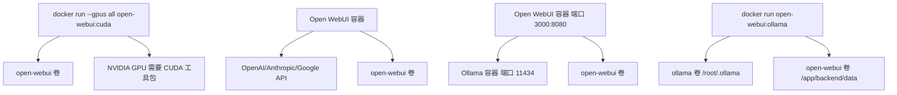
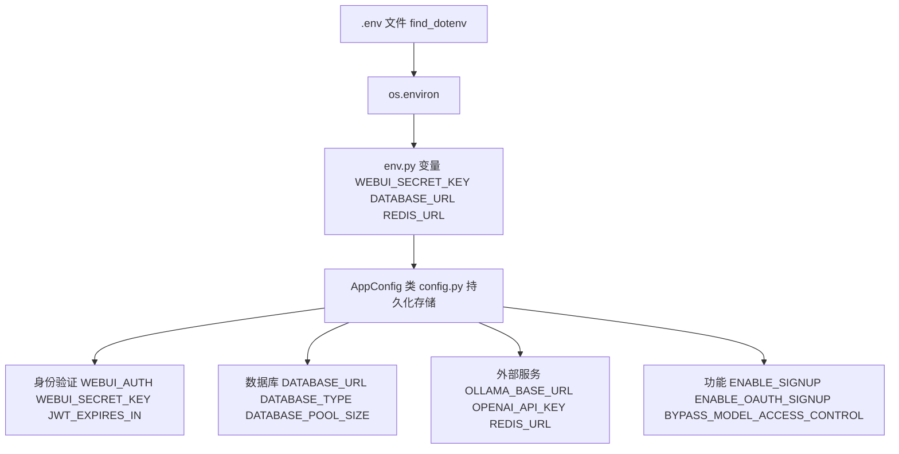
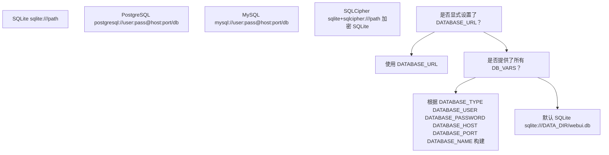
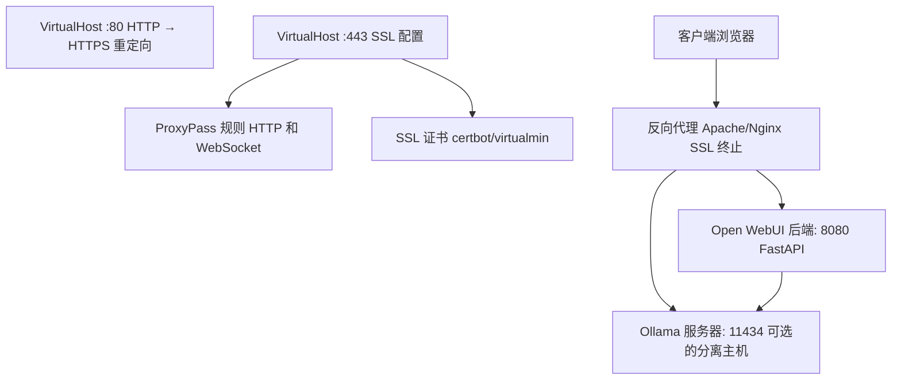

# 安装和部署

相关源文件

-   [LICENSE](https://github.com/open-webui/open-webui/blob/a7271532/LICENSE)
-   [README.md](https://github.com/open-webui/open-webui/blob/a7271532/README.md)
-   [TROUBLESHOOTING.md](https://github.com/open-webui/open-webui/blob/a7271532/TROUBLESHOOTING.md)
-   [backend/open_webui/env.py](https://github.com/open-webui/open-webui/blob/a7271532/backend/open_webui/env.py)
-   [backend/open_webui/routers/audio.py](https://github.com/open-webui/open-webui/blob/a7271532/backend/open_webui/routers/audio.py)
-   [backend/open_webui/routers/auths.py](https://github.com/open-webui/open-webui/blob/a7271532/backend/open_webui/routers/auths.py)
-   [backend/open_webui/routers/ollama.py](https://github.com/open-webui/open-webui/blob/a7271532/backend/open_webui/routers/ollama.py)
-   [backend/open_webui/routers/openai.py](https://github.com/open-webui/open-webui/blob/a7271532/backend/open_webui/routers/openai.py)
-   [backend/open_webui/utils/auth.py](https://github.com/open-webui/open-webui/blob/a7271532/backend/open_webui/utils/auth.py)
-   [backend/open_webui/utils/embeddings.py](https://github.com/open-webui/open-webui/blob/a7271532/backend/open_webui/utils/embeddings.py)
-   [backend/open_webui/utils/misc.py](https://github.com/open-webui/open-webui/blob/a7271532/backend/open_webui/utils/misc.py)
-   [backend/open_webui/utils/oauth.py](https://github.com/open-webui/open-webui/blob/a7271532/backend/open_webui/utils/oauth.py)
-   [backend/open_webui/utils/response.py](https://github.com/open-webui/open-webui/blob/a7271532/backend/open_webui/utils/response.py)
-   [docs/apache.md](https://github.com/open-webui/open-webui/blob/a7271532/docs/apache.md)
-   [src/lib/components/chat/Settings/About.svelte](https://github.com/open-webui/open-webui/blob/a7271532/src/lib/components/chat/Settings/About.svelte)
-   [src/lib/constants.ts](https://github.com/open-webui/open-webui/blob/a7271532/src/lib/constants.ts)

本文档涵盖了 Open WebUI 的安装方法、Docker 部署拓扑、环境配置以及反向代理设置。有关前端、后端和存储层的详细架构信息，请参阅[架构概览](/open-webui/open-webui/2-architecture-overview)。有关具体的配置管理详细信息，请参阅[配置管理](/open-webui/open-webui/11-configuration-management)。

---

## 安装方法

Open WebUI 支持两种主要的安装方法：Python pip 安装和 Docker 容器化。该应用程序由 FastAPI 后端 ([backend/open_webui/main.py](https://github.com/open-webui/open-webui/blob/a7271532/backend/open_webui/main.py)) 和 SvelteKit 前端 ([src/](https://github.com/open-webui/open-webui/blob/a7271532/src/)) 组成。

### Python pip 安装

Open WebUI 可以作为 Python 包安装，需要 Python 3.11 或更高版本以避免兼容性问题：

```
pip install open-webui
open-webui serve
```
默认情况下，这将在 `http://localhost:8080` 上启动服务器。`open-webui serve` 命令会初始化 [backend/open_webui/main.py](https://github.com/open-webui/open-webui/blob/a7271532/backend/open_webui/main.py) 中定义的 FastAPI 应用程序，并同时提供后端 API 和来自 `FRONTEND_BUILD_DIR` ([backend/open_webui/env.py238-243](https://github.com/open-webui/open-webui/blob/a7271532/backend/open_webui/env.py#L238-L243)) 的预构建前端静态文件。

**目录结构**：

-   `DATA_DIR`：根据安装方法的不同，默认为 `backend/data` 或 `open_webui/data` ([backend/open_webui/env.py210-232](https://github.com/open-webui/open-webui/blob/a7271532/backend/open_webui/env.py#L210-L232))
-   `FRONTEND_BUILD_DIR`：构建后的前端资源位置 ([backend/open_webui/env.py238-243](https://github.com/open-webui/open-webui/blob/a7271532/backend/open_webui/env.py#L238-L243))
-   数据库文件：`DATA_DIR/webui.db` (默认 SQLite) ([backend/open_webui/env.py257](https://github.com/open-webui/open-webui/blob/a7271532/backend/open_webui/env.py#L257-L257))

### Docker 安装

Docker 部署是推荐的生产环境安装方法。所有 Docker 镜像都托管在 `ghcr.io/open-webui/open-webui`，具有多个标签：

| 标签 | 描述 |
| --- | --- |
| `main` | 最新的稳定版本，包含后端 + 前端 |
| `ollama` | 与 Ollama 捆绑，单容器部署 |
| `cuda` | 支持 NVIDIA CUDA 以实现 GPU 加速 |
| `dev` | 开发分支，不稳定 |

**关键 Docker 概念**：

-   端口映射：容器端口 `8080` 默认映射到主机端口 `3000`
-   卷挂载：`-v open-webui:/app/backend/data` 持久化数据库和文件 ([README.md114](https://github.com/open-webui/open-webui/blob/a7271532/README.md#L114-L114))
-   `OLLAMA_BASE_URL` 环境变量配置后端到 Ollama 的连接 ([backend/open_webui/env.py](https://github.com/open-webui/open-webui/blob/a7271532/backend/open_webui/env.py))

**关键卷挂载**：必须始终挂载数据卷以防止数据丢失。后端期望在容器内的 `/app/backend/data` 处进行持久化存储。

来源：[README.md88-106](https://github.com/open-webui/open-webui/blob/a7271532/README.md#L88-L106) [README.md108-167](https://github.com/open-webui/open-webui/blob/a7271532/README.md#L108-L167) [backend/open_webui/env.py210-243](https://github.com/open-webui/open-webui/blob/a7271532/backend/open_webui/env.py#L210-L243)

---

## Docker 部署拓扑


### 拓扑 1：一体化 Docker (捆绑 Ollama)

结合了 Open WebUI 和 Ollama 服务器的单容器镜像。个人用户最简单的部署方式。

**Docker 命令**：

```
# 使用 GPU
docker run -d -p 3000:8080 --gpus=all \
  -v ollama:/root/.ollama \
  -v open-webui:/app/backend/data \
  --name open-webui --restart always \
  ghcr.io/open-webui/open-webui:ollama

# 仅使用 CPU
docker run -d -p 3000:8080 \
  -v ollama:/root/.ollama \
  -v open-webui:/app/backend/data \
  --name open-webui --restart always \
  ghcr.io/open-webui/open-webui:ollama
```
**卷用途**：

-   `ollama:/root/.ollama`：存储 Ollama 模型
-   `open-webui:/app/backend/data`：存储 SQLite 数据库、上传内容、缓存

来源：[README.md149-167](https://github.com/open-webui/open-webui/blob/a7271532/README.md#L149-L167)

### 拓扑 2：分离容器

Open WebUI 和 Ollama 在不同的容器中运行。允许 Ollama 在配备 GPU 的机器上运行，而 UI 在 CPU 节点上水平扩展。

**Docker 命令**：

```
# Ollama 在同一台主机上
docker run -d -p 3000:8080 \
  --add-host=host.docker.internal:host-gateway \
  -v open-webui:/app/backend/data \
  --name open-webui --restart always \
  ghcr.io/open-webui/open-webui:main

# Ollama 在不同的服务器上
docker run -d -p 3000:8080 \
  -e OLLAMA_BASE_URL=https://example.com \
  -v open-webui:/app/backend/data \
  --name open-webui --restart always \
  ghcr.io/open-webui/open-webui:main
```
**网络配置**：

-   `--add-host=host.docker.internal:host-gateway`：将 `host.docker.internal` 映射到主机的网关，允许容器通过 `http://host.docker.internal:11434` 访问基于主机的 Ollama
-   替代方案：使用 `--network=host`（端口从 3000 变为 8080）([TROUBLESHOOTING.md13-19](https://github.com/open-webui/open-webui/blob/a7271532/TROUBLESHOOTING.md#L13-L19))

后端将请求从前端 `/ollama` 路由代理到 `OLLAMA_BASE_URL` ([backend/open_webui/routers/ollama.py](https://github.com/open-webui/open-webui/blob/a7271532/backend/open_webui/routers/ollama.py))。例如，对 `/ollama/api/tags` 的请求会被转发到 `{OLLAMA_BASE_URL}/api/tags`。

来源：[README.md119-133](https://github.com/open-webui/open-webui/blob/a7271532/README.md#L119-L133) [TROUBLESHOOTING.md5-36](https://github.com/open-webui/open-webui/blob/a7271532/TROUBLESHOOTING.md#L5-L36)

### 拓扑 3：仅 Cloud LLM

不带 Ollama 的 Open WebUI，仅连接到外部 API（OpenAI、Anthropic 等）。

**Docker 命令**：

```
docker run -d -p 3000:8080 \
  -e OPENAI_API_KEY=your_secret_key \
  -v open-webui:/app/backend/data \
  --name open-webui --restart always \
  ghcr.io/open-webui/open-webui:main
```
后端通过 `get_all_models()` ([backend/open_webui/routers/openai.py343-453](https://github.com/open-webui/open-webui/blob/a7271532/backend/open_webui/routers/openai.py#L343-L453)) 从配置的 API 端点聚合模型。每个 API 端点都可以配置：

-   `OPENAI_API_BASE_URLS`：基础 URL 列表 ([backend/open_webui/routers/openai.py211](https://github.com/open-webui/open-webui/blob/a7271532/backend/open_webui/routers/openai.py#L211-L211))
-   `OPENAI_API_KEYS`：对应的 API 密钥 ([backend/open_webui/routers/openai.py212](https://github.com/open-webui/open-webui/blob/a7271532/backend/open_webui/routers/openai.py#L212-L212))
-   `OPENAI_API_CONFIGS`：每个端点的配置 ([backend/open_webui/routers/openai.py213](https://github.com/open-webui/open-webui/blob/a7271532/backend/open_webui/routers/openai.py#L213-L213))

来源：[README.md141-147](https://github.com/open-webui/open-webui/blob/a7271532/README.md#L141-L147) [backend/open_webui/routers/openai.py207-265](https://github.com/open-webui/open-webui/blob/a7271532/backend/open_webui/routers/openai.py#L207-L265)

### 拓扑 4：GPU 支持

启用 CUDA 加速以进行本地推理或嵌入。需要在 Linux/WSL 上安装 [Nvidia CUDA 容器工具包](https://docs.nvidia.com/dgx/nvidia-container-runtime-upgrade/)。

**Docker 命令**：

```
docker run -d -p 3000:8080 --gpus all \
  --add-host=host.docker.internal:host-gateway \
  -v open-webui:/app/backend/data \
  --name open-webui --restart always \
  ghcr.io/open-webui/open-webui:cuda
```
GPU 检测和配置发生在 [backend/open_webui/env.py44-69](https://github.com/open-webui/open-webui/blob/a7271532/backend/open_webui/env.py#L44-L69)：

-   `USE_CUDA_DOCKER` 环境变量触发 CUDA 检测
-   如果 CUDA 不可用，则回退到 `cpu`
-   自动检测 Apple Silicon MPS 后端

来源：[README.md117-139](https://github.com/open-webui/open-webui/blob/a7271532/README.md#L117-L139) [backend/open_webui/env.py44-69](https://github.com/open-webui/open-webui/blob/a7271532/backend/open_webui/env.py#L44-L69)

---

## 环境配置


### 核心环境变量

环境变量通过 `dotenv` 从 `BASE_DIR` 中的 `.env` 文件加载 ([backend/open_webui/env.py34-39](https://github.com/open-webui/open-webui/blob/a7271532/backend/open_webui/env.py#L34-L39))。所有变量都通过具有默认值的 `os.environ.get()` 访问。

**关键变量**：

| 变量 | 默认值 | 用途 |
| --- | --- | --- |
| `WEBUI_SECRET_KEY` | `t0p-s3cr3t` | JWT 签名密钥，**在生产环境中必须更改** |
| `DATABASE_URL` | `sqlite:///DATA_DIR/webui.db` | 数据库连接字符串 |
| `OLLAMA_BASE_URL` | None | 后端到 Ollama 的连接 URL |
| `REDIS_URL` | `""` | 用于分布式部署的 Redis 连接 |
| `DATA_DIR` | `backend/data` | 数据存储目录 |

来源：[backend/open_webui/env.py20-40](https://github.com/open-webui/open-webui/blob/a7271532/backend/open_webui/env.py#L20-L40) [backend/open_webui/env.py450-455](https://github.com/open-webui/open-webui/blob/a7271532/backend/open_webui/env.py#L450-L455)

### 数据库配置


**数据库 URL 构建** ([backend/open_webui/env.py257-286](https://github.com/open-webui/open-webui/blob/a7271532/backend/open_webui/env.py#L257-L286))：

1.  如果显式设置了 `DATABASE_URL`，则使用它
2.  否则，如果设置了 `DATABASE_TYPE`、`DATABASE_USER`、`DATABASE_PASSWORD`、`DATABASE_HOST`、`DATABASE_PORT`、`DATABASE_NAME` 中的所有变量，则构建 URL
3.  否则，默认使用位于 `sqlite:///{DATA_DIR}/webui.db` 的 SQLite

**PostgreSQL 示例**：

```
DATABASE_TYPE=postgresql
DATABASE_USER=openwebui
DATABASE_PASSWORD=secret
DATABASE_HOST=localhost
DATABASE_PORT=5432
DATABASE_NAME=openwebui
```
**连接池设置** ([backend/open_webui/env.py289-325](https://github.com/open-webui/open-webui/blob/a7271532/backend/open_webui/env.py#L289-L325))：

-   `DATABASE_POOL_SIZE`：连接池大小（默认值：None，使用 SQLAlchemy 默认值）
-   `DATABASE_POOL_MAX_OVERFLOW`：最大溢出连接数（默认值：0）
-   `DATABASE_POOL_TIMEOUT`：连接超时秒数（默认值：30）
-   `DATABASE_POOL_RECYCLE`：连接回收秒数（默认值：3600）

来源：[backend/open_webui/env.py246-330](https://github.com/open-webui/open-webui/blob/a7271532/backend/open_webui/env.py#L246-L330)

### Redis 配置

Redis 是可选的，但对于具有多个 worker 或跨节点 WebSocket 支持的分布式部署是必需的。

**Redis 变量** ([backend/open_webui/env.py358-383](https://github.com/open-webui/open-webui/blob/a7271532/backend/open_webui/env.py#L358-L383))：

```
REDIS_URL=redis://localhost:6379
REDIS_CLUSTER=False  # 对于 Redis 集群设置为 True
REDIS_KEY_PREFIX=open-webui
REDIS_SENTINEL_HOSTS=""  # 用于 Sentinel 的逗号分隔主机列表
REDIS_SENTINEL_PORT=26379
REDIS_SOCKET_CONNECT_TIMEOUT=""  # 连接超时 (float)
```
**用例**：

-   令牌吊销跟踪 ([backend/open_webui/utils/auth.py213-247](https://github.com/open-webui/open-webui/blob/a7271532/backend/open_webui/utils/auth.py#L213-L247))
-   WebSocket 消息分发 ([backend/open_webui/env.py611-668](https://github.com/open-webui/open-webui/blob/a7271532/backend/open_webui/env.py#L611-L668))
-   会话存储
-   速率限制 ([backend/open_webui/routers/auths.py84-86](https://github.com/open-webui/open-webui/blob/a7271532/backend/open_webui/routers/auths.py#L84-L86))

来源：[backend/open_webui/env.py358-383](https://github.com/open-webui/open-webui/blob/a7271532/backend/open_webui/env.py#L358-L383) [backend/open_webui/env.py611-668](https://github.com/open-webui/open-webui/blob/a7271532/backend/open_webui/env.py#L611-L668)

### 身份验证配置

**JWT 设置** ([backend/open_webui/env.py400-476](https://github.com/open-webui/open-webui/blob/a7271532/backend/open_webui/env.py#L400-L476))：

```
WEBUI_AUTH=True  # 启用身份验证（出于安全考虑是必需的）
WEBUI_SECRET_KEY=your-secret-key  # JWT 签名密钥
WEBUI_SESSION_COOKIE_SAME_SITE=lax  # Cookie SameSite 属性
WEBUI_SESSION_COOKIE_SECURE=false  # 仅限 HTTPS 的 cookie
ENABLE_SIGNUP=True  # 允许新用户注册
```
**OAuth 配置** ([backend/open_webui/env.py483-500](https://github.com/open-webui/open-webui/blob/a7271532/backend/open_webui/env.py#L483-L500))：

```
ENABLE_OAUTH_SIGNUP=True
OAUTH_CLIENT_INFO_ENCRYPTION_KEY=your-encryption-key
OAUTH_PROVIDERS='[{"id": "google", "name": "Google", ...}]'
```
OAuth 实现使用动态客户端注册 ([backend/open_webui/utils/oauth.py284-400](https://github.com/open-webui/open-webui/blob/a7271532/backend/open_webui/utils/oauth.py#L284-L400))，支持多个提供商（Google、Microsoft、GitHub、通用 OIDC）。

**LDAP 配置**：

```
ENABLE_LDAP=True
LDAP_SERVER_HOST=ldap.example.com
LDAP_SERVER_PORT=389
LDAP_SEARCH_BASE=dc=example,dc=com
LDAP_APP_DN=cn=admin,dc=example,dc=com
LDAP_APP_PASSWORD=secret
```
LDAP 身份验证处理程序位于 [backend/open_webui/routers/auths.py216-503](https://github.com/open-webui/open-webui/blob/a7271532/backend/open_webui/routers/auths.py#L216-L503)

来源：[backend/open_webui/env.py400-509](https://github.com/open-webui/open-webui/blob/a7271532/backend/open_webui/env.py#L400-L509) [backend/open_webui/utils/oauth.py284-400](https://github.com/open-webui/open-webui/blob/a7271532/backend/open_webui/utils/oauth.py#L284-L400) [backend/open_webui/routers/auths.py216-503](https://github.com/open-webui/open-webui/blob/a7271532/backend/open_webui/routers/auths.py#L216-L503)

### 外部服务配置

**Ollama** ([backend/open_webui/routers/ollama.py267-303](https://github.com/open-webui/open-webui/blob/a7271532/backend/open_webui/routers/ollama.py#L267-L303))：

```
ENABLE_OLLAMA_API=True
OLLAMA_BASE_URLS='["http://localhost:11434"]'  # JSON 数组
OLLAMA_API_CONFIGS='{}'  # 每个 URL 的配置
```
**OpenAI 兼容 API** ([backend/open_webui/routers/openai.py207-265](https://github.com/open-webui/open-webui/blob/a7271532/backend/open_webui/routers/openai.py#L207-L265))：

```
ENABLE_OPENAI_API=True
OPENAI_API_BASE_URLS='["https://api.openai.com/v1"]'
OPENAI_API_KEYS='["sk-..."]'
OPENAI_API_CONFIGS='{}'
```
**音频处理**：

```
# 文本转语音 (TTS)
TTS_ENGINE=openai  # openai, elevenlabs, azure, transformers
TTS_OPENAI_API_BASE_URL=https://api.openai.com/v1
TTS_OPENAI_API_KEY=sk-...

# 语音转文本 (STT)
STT_ENGINE=openai  # "", openai, whisper, deepgram, azure, mistral
WHISPER_MODEL=base  # 用于本地 Whisper
```
来源：[backend/open_webui/env.py](https://github.com/open-webui/open-webui/blob/a7271532/backend/open_webui/env.py) [backend/open_webui/routers/ollama.py267-303](https://github.com/open-webui/open-webui/blob/a7271532/backend/open_webui/routers/ollama.py#L267-L303) [backend/open_webui/routers/openai.py207-265](https://github.com/open-webui/open-webui/blob/a7271532/backend/open_webui/routers/openai.py#L207-L265) [backend/open_webui/routers/audio.py155-190](https://github.com/open-webui/open-webui/blob/a7271532/backend/open_webui/routers/audio.py#L155-L190)

### 功能标志

**模型和内容控制**：

```
BYPASS_MODEL_ACCESS_CONTROL=False  # 跳过模型 RBAC
ENABLE_CUSTOM_MODEL_FALLBACK=False  # 允许未定义的模型
MODELS_CACHE_TTL=1  # 模型列表缓存 TTL（秒）
```
**WebSocket 配置** ([backend/open_webui/env.py611-668](https://github.com/open-webui/open-webui/blob/a7271532/backend/open_webui/env.py#L611-L668))：

```
ENABLE_WEBSOCKET_SUPPORT=True
WEBSOCKET_MANAGER=""  # 本地留空，分布式设置
WEBSOCKET_REDIS_URL=$REDIS_URL
WEBSOCKET_REDIS_CLUSTER=False
WEBSOCKET_SERVER_PING_TIMEOUT=20
WEBSOCKET_SERVER_PING_INTERVAL=25
```
**可观测性** ([backend/open_webui/env.py808-875](https://github.com/open-webui/open-webui/blob/a7271532/backend/open_webui/env.py#L808-L875))：

```
# OpenTelemetry
ENABLE_OTEL=False
ENABLE_OTEL_TRACES=False
ENABLE_OTEL_METRICS=False
OTEL_EXPORTER_OTLP_ENDPOINT=http://localhost:4317

# 审计日志
AUDIT_LOG_LEVEL=NONE  # NONE, METADATA, REQUEST, REQUEST_RESPONSE
AUDIT_LOGS_FILE_PATH=DATA_DIR/audit.log
```
来源：[backend/open_webui/env.py542-606](https://github.com/open-webui/open-webui/blob/a7271532/backend/open_webui/env.py#L542-L606) [backend/open_webui/env.py611-716](https://github.com/open-webui/open-webui/blob/a7271532/backend/open_webui/env.py#L611-L716) [backend/open_webui/env.py778-875](https://github.com/open-webui/open-webui/blob/a7271532/backend/open_webui/env.py#L778-L875)

---

## 反向代理设置


生产部署通常使用 Apache 或 Nginx 作为反向代理，用于 SSL 终止、负载均衡和安全性。

### Apache 配置

**HTTP 到 HTTPS 虚拟主机** ([docs/apache.md12-24](https://github.com/open-webui/open-webui/blob/a7271532/docs/apache.md#L12-L24))：

```
<VirtualHost 192.168.1.100:80>
    ServerName server.com
    DocumentRoot /home/server/public_html

    ProxyPass / http://server.com:3000/ nocanon
    ProxyPassReverse / http://server.com:3000/

    # WebSocket 支持 (Open WebUI 0.5+ 所需)
    ProxyPass / ws://server.com:3000/ nocanon
    ProxyPassReverse / ws://server.com:3000/
</VirtualHost>
```
**SSL 虚拟主机** ([docs/apache.md31-49](https://github.com/open-webui/open-webui/blob/a7271532/docs/apache.md#L31-L49))：

```
<VirtualHost 192.168.1.100:443>
    ServerName server.com
    DocumentRoot /home/server/public_html

    ProxyPass / http://server.com:3000/ nocanon
    ProxyPassReverse / http://server.com:3000/

    # WebSocket 支持
    ProxyPass / ws://server.com:3000/ nocanon
    ProxyPassReverse / ws://server.com:3000/

    SSLEngine on
    SSLCertificateFile /etc/ssl/virtualmin/170514456861234/ssl.cert
    SSLCertificateKeyFile /etc/ssl/virtualmin/170514456861234/ssl.key
    SSLProtocol all -SSLv2 -SSLv3 -TLSv1 -TLSv1.1

    SSLProxyEngine on
    SSLCACertificateFile /etc/ssl/virtualmin/170514456865864/ssl.ca
</VirtualHost>
```
**关键配置点**：

-   带有 `nocanon` 标志的 `ProxyPass`：防止 URL 解码/重新编码，这可能会破坏 API 路径
-   WebSocket 代理：实时功能所需（Open WebUI 0.5+ 中添加）
-   SSL 协议限制：禁用不安全的协议（SSLv2, SSLv3, TLSv1, TLSv1.1）
-   `SSLProxyEngine on`：代理到 HTTPS 后端时所需

**启用站点并请求 SSL 证书**：

```
# 启用站点
a2ensite server.com.conf

# 使用 certbot 请求 SSL 证书
snap install certbot --classic
snap apt install python3-certbot-apache
cd /etc/apache2/sites-available/
certbot --apache -d server.com
```
这将创建带有 SSL 配置的 `server.com-le-ssl.conf`。

来源：[docs/apache.md8-68](https://github.com/open-webui/open-webui/blob/a7271532/docs/apache.md#L8-L68)

### 分离的 Ollama 服务器代理

在另一台服务器上托管 Ollama 时，配置额外的代理 ([docs/apache.md118-154](https://github.com/open-webui/open-webui/blob/a7271532/docs/apache.md#L118-L154))：

```
<VirtualHost 192.168.254.109:443>
    DocumentRoot "/var/www/html/"
    ServerName models.server.city

    <Directory "/var/www/html/">
        Options None
        Require all granted
    </Directory>

    ProxyRequests Off
    ProxyPreserveHost On
    ProxyAddHeaders On
    SSLProxyEngine on

    ProxyPass / http://server.city:11434/ nocanon
    ProxyPassReverse / http://server.city:11434/

    SSLCertificateFile /etc/letsencrypt/live/models.server.city/fullchain.pem
    SSLCertificateKeyFile /etc/letsencrypt/live/models.server.city/privkey.pem
    Include /etc/letsencrypt/options-ssl-apache.conf
</VirtualHost>
```
**Ollama systemd 服务配置** ([docs/apache.md77-111](https://github.com/open-webui/open-webui/blob/a7271532/docs/apache.md#L77-L111))：

```
sudo nano /etc/systemd/system/ollama.service
```
添加环境变量：

```
[Service]
ExecStart=/usr/local/bin/ollama serve
Environment="OLLAMA_HOST=0.0.0.0:11434"
Environment="OLLAMA_ORIGINS=http://192.168.254.106:11434,https://models.server.city"
User=ollama
Group=ollama
```
然后：

```
systemctl daemon-reload
systemctl restart ollama
```
来源：[docs/apache.md70-194](https://github.com/open-webui/open-webui/blob/a7271532/docs/apache.md#L70-L194)

### Nginx 配置

对于 Nginx 部署，等效配置如下：

```nginx
server {
    listen 80;
    server_name server.com;
    return 301 https://$server_name$request_uri;
}

server {
    listen 443 ssl http2;
    server_name server.com;

    ssl_certificate /etc/letsencrypt/live/server.com/fullchain.pem;
    ssl_certificate_key /etc/letsencrypt/live/server.com/privkey.pem;

    location / {
        proxy_pass http://localhost:3000;
        proxy_http_version 1.1;
        proxy_set_header Upgrade $http_upgrade;
        proxy_set_header Connection "upgrade";
        proxy_set_header Host $host;
        proxy_set_header X-Real-IP $remote_addr;
        proxy_set_header X-Forwarded-For $proxy_add_x_forwarded_for;
        proxy_set_header X-Forwarded-Proto $scheme;
    }
}
```
**关键 Nginx 指令**：

-   `proxy_http_version 1.1`：WebSocket 支持所需
-   `Upgrade` 和 `Connection` 标头：启用 WebSocket 升级
-   `X-Forwarded-*` 标头：通过代理保留客户端信息

来源：[TROUBLESHOOTING.md5-36](https://github.com/open-webui/open-webui/blob/a7271532/TROUBLESHOOTING.md#L5-L36)

---

## 安装后配置

部署后，通过 Web 界面或环境变量配置应用程序：

1.  **初始管理员帐户**：第一次注册将创建管理员用户 ([backend/open_webui/routers/auths.py642-684](https://github.com/open-webui/open-webui/blob/a7271532/backend/open_webui/routers/auths.py#L642-L684))
2.  **模型配置**：通过 设置 > 管理员 > 连接 添加 Ollama/OpenAI 端点
3.  **存储后端**：配置 `STORAGE_PROVIDER` (local, s3, gcs, azure)
4.  **向量数据库**：设置用于 RAG 的 `VECTOR_DB_TYPE` (chromadb, qdrant, milvus 等)

后端提供来自 `FRONTEND_BUILD_DIR` ([backend/open_webui/env.py238-243](https://github.com/open-webui/open-webui/blob/a7271532/backend/open_webui/env.py#L238-L243)) 的前端服务，API 路由挂载在 `/api/v1`、`/ollama` 和 `/openai` ([backend/open_webui/main.py](https://github.com/open-webui/open-webui/blob/a7271532/backend/open_webui/main.py))。

来源：[backend/open_webui/env.py238-243](https://github.com/open-webui/open-webui/blob/a7271532/backend/open_webui/env.py#L238-L243) [backend/open_webui/routers/auths.py642-684](https://github.com/open-webui/open-webui/blob/a7271532/backend/open_webui/routers/auths.py#L642-L684)
