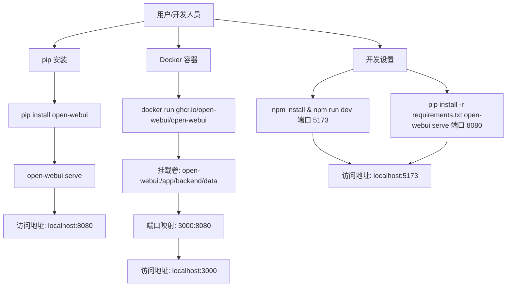
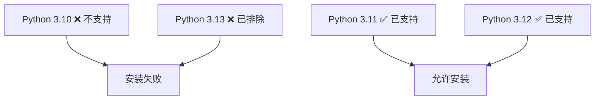
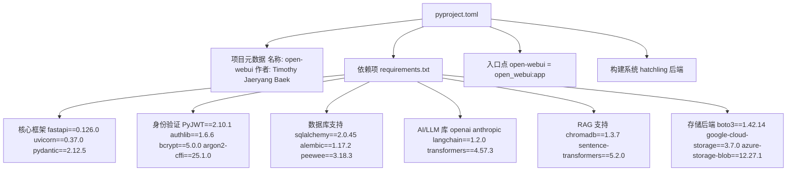
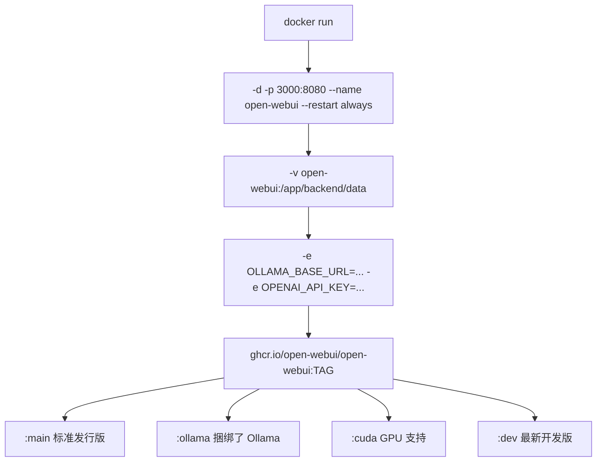
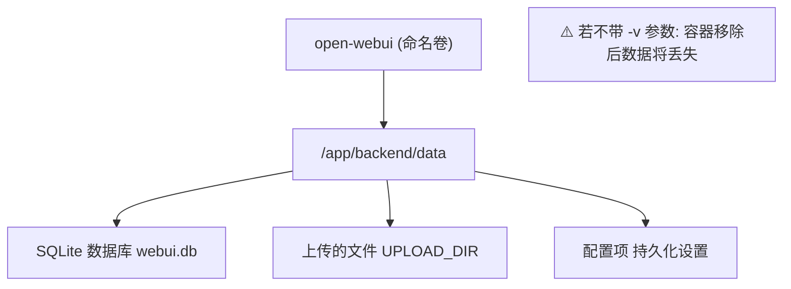
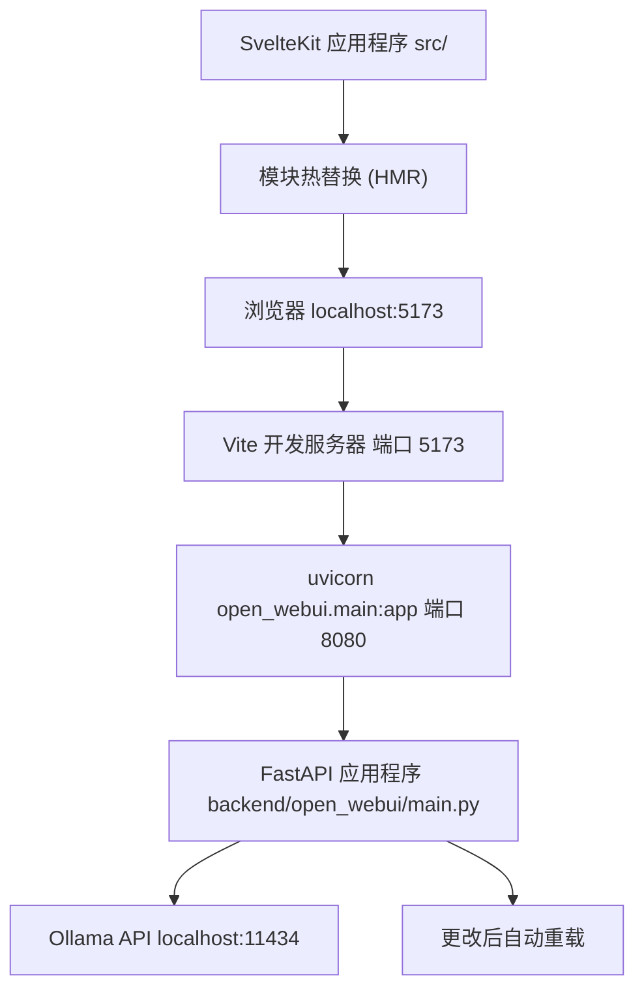
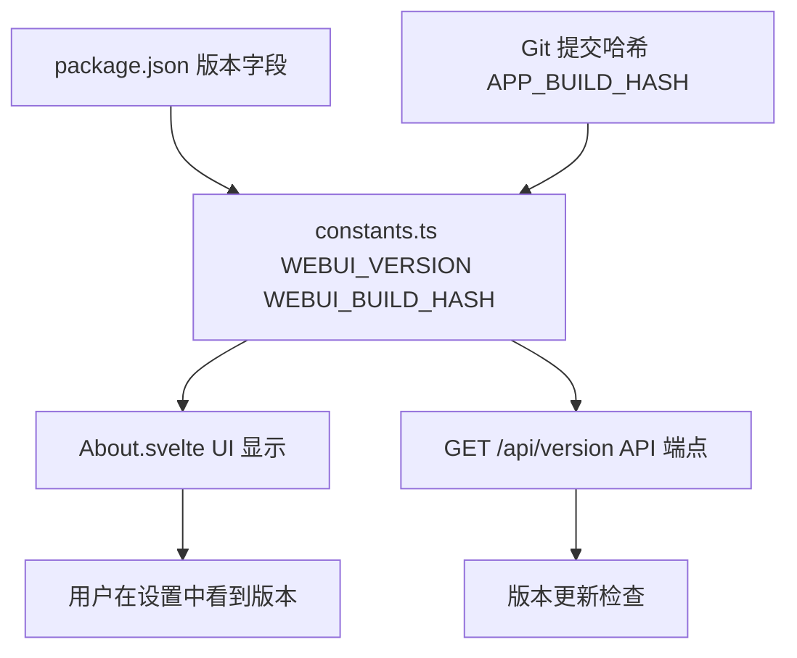

# 安装方法

相关源文件

-   [.github/workflows/integration-test.disabled](https://github.com/open-webui/open-webui/blob/a7271532/.github/workflows/integration-test.disabled)
-   [LICENSE](https://github.com/open-webui/open-webui/blob/a7271532/LICENSE)
-   [README.md](https://github.com/open-webui/open-webui/blob/a7271532/README.md)
-   [TROUBLESHOOTING.md](https://github.com/open-webui/open-webui/blob/a7271532/TROUBLESHOOTING.md)
-   [backend/open_webui/storage/provider.py](https://github.com/open-webui/open-webui/blob/a7271532/backend/open_webui/storage/provider.py)
-   [backend/open_webui/test/apps/webui/storage/test_provider.py](https://github.com/open-webui/open-webui/blob/a7271532/backend/open_webui/test/apps/webui/storage/test_provider.py)
-   [backend/requirements-min.txt](https://github.com/open-webui/open-webui/blob/a7271532/backend/requirements-min.txt)
-   [backend/requirements.txt](https://github.com/open-webui/open-webui/blob/a7271532/backend/requirements.txt)
-   [docker-compose.playwright.yaml](https://github.com/open-webui/open-webui/blob/a7271532/docker-compose.playwright.yaml)
-   [docs/apache.md](https://github.com/open-webui/open-webui/blob/a7271532/docs/apache.md)
-   [pyproject.toml](https://github.com/open-webui/open-webui/blob/a7271532/pyproject.toml)
-   [src/lib/components/chat/Settings/About.svelte](https://github.com/open-webui/open-webui/blob/a7271532/src/lib/components/chat/Settings/About.svelte)
-   [src/lib/constants.ts](https://github.com/open-webui/open-webui/blob/a7271532/src/lib/constants.ts)
-   [uv.lock](https://github.com/open-webui/open-webui/blob/a7271532/uv.lock)

## 目的和范围

本页面记录了 Open WebUI 的三种主要安装方法：Python pip 安装、Docker 容器部署以及本地开发环境设置。每种方法都有不同的要求和适用场景。有关特定 Docker 部署拓扑（捆绑 Ollama、GPU 支持、仅限云端）的信息，请参阅 [Docker 部署选项](/open-webui/open-webui/3.2-docker-deployment-options)。有关环境变量配置，请参阅[环境配置](/open-webui/open-webui/3.3-environment-configuration)。有关详细的开发工作流，请参阅[开发环境设置](/open-webui/open-webui/18.1-development-environment-setup)。

---

## 安装概览


**安装方法决策树**

**来源：** [README.md86-176](https://github.com/open-webui/open-webui/blob/a7271532/README.md#L86-L176) [pyproject.toml1-210](https://github.com/open-webui/open-webui/blob/a7271532/pyproject.toml#L1-L210)

---

## Python 版本要求

Open WebUI 需要 **Python 3.11 或 3.12**。由于依赖兼容性问题，明确排除了 Python 3.13。


**Python 版本兼容性矩阵**

版本约束在 `pyproject.toml` 中定义：

| 配置项 | 取值 |
| --- | --- |
| 最低版本 | `>= 3.11` |
| 最高版本 | `< 3.13.0a1` |
| 受支持版本 | 3.11.x, 3.12.x |

**来源：** [pyproject.toml122](https://github.com/open-webui/open-webui/blob/a7271532/pyproject.toml#L122-L122) [uv.lock3](https://github.com/open-webui/open-webui/blob/a7271532/uv.lock#L3-L3)

---

## 安装方法 1：pip 包安装

### 安装命令

最简单的安装方法是使用 Python 的包管理器：

```
pip install open-webui
```
这将从 PyPI 安装 `open-webui` 包，其中包含了 [backend/requirements.txt1-156](https://github.com/open-webui/open-webui/blob/a7271532/backend/requirements.txt#L1-L156) 中定义的所有必需依赖项。

### 包配置

该包通过 `pyproject.toml` 进行配置，结构如下：


**包架构与依赖项**

**来源：** [pyproject.toml1-210](https://github.com/open-webui/open-webui/blob/a7271532/pyproject.toml#L1-L210) [backend/requirements.txt1-156](https://github.com/open-webui/open-webui/blob/a7271532/backend/requirements.txt#L1-L156)

### 启动服务器

安装完成后，使用控制台脚本入口点启动 Open WebUI：

```
open-webui serve
```
此命令映射到 [pyproject.toml165](https://github.com/open-webui/open-webui/blob/a7271532/pyproject.toml#L165-L165) 中的 `open_webui:app`。服务器默认在端口 **8080** 启动，可以通过 `http://localhost:8080` 访问。

### 关键特征

| 维度 | 详情 |
| --- | --- |
| 安装目标 | 系统环境或虚拟环境 |
| 依赖项 | 约 150+ 个包自动安装 |
| 数据目录 | 工作目录下的 `./data` |
| 端口 | 8080 (默认) |
| 进程管理 | 手动管理 (前台进程) |
| 更新方式 | `pip install --upgrade open-webui` |

**来源：** [README.md88-106](https://github.com/open-webui/open-webui/blob/a7271532/README.md#L88-L106) [pyproject.toml164-165](https://github.com/open-webui/open-webui/blob/a7271532/pyproject.toml#L164-L165)

---

## 安装方法 2：Docker 容器部署

### 基础 Docker 命令结构


**Docker 命令组件拆解**

### Docker 镜像标签

Open WebUI 提供了多种镜像变体：

| 标签 | 用途 | 大小 | 适用场景 |
| --- | --- | --- | --- |
| `:main` | 稳定版本 | 较小 | 生产环境部署 |
| `:ollama` | 捆绑了 Ollama | 较大 | 全合一单容器设置 |
| `:cuda` | NVIDIA GPU 支持 | 最大 | GPU 加速推理 |
| `:dev` | 开发分支 | 不固定 | 测试未发布的功能 |

### 标准安装 (分离式 Ollama)

当 Ollama 在同一台主机上运行时：

```
docker run -d \
  -p 3000:8080 \
  --add-host=host.docker.internal:host-gateway \
  -v open-webui:/app/backend/data \
  --name open-webui \
  --restart always \
  ghcr.io/open-webui/open-webui:main
```
**关键参数：**

-   `-p 3000:8080`：将容器的 8080 端口映射到主机的 3000 端口
-   `--add-host=host.docker.internal:host-gateway`：允许容器访问主机网络（用于访问 `localhost:11434` 上的 Ollama）
-   `-v open-webui:/app/backend/data`：**关键** - 持久化数据库和上传的文件

### 远程 Ollama 服务器

当 Ollama 在另一台服务器上运行时：

```
docker run -d \
  -p 3000:8080 \
  -e OLLAMA_BASE_URL=https://ollama.example.com \
  -v open-webui:/app/backend/data \
  --name open-webui \
  --restart always \
  ghcr.io/open-webui/open-webui:main
```
### 仅使用 OpenAI API

针对无需本地 Ollama 的云端 LLM 提供商：

```
docker run -d \
  -p 3000:8080 \
  -e OPENAI_API_KEY=your_secret_key \
  -v open-webui:/app/backend/data \
  --name open-webui \
  --restart always \
  ghcr.io/open-webui/open-webui:main
```
### GPU 支持

针对 NVIDIA GPU 加速（需要安装 [NVIDIA Container Toolkit](https://docs.nvidia.com/dgx/nvidia-container-runtime-upgrade/)）：

```
docker run -d \
  -p 3000:8080 \
  --gpus all \
  --add-host=host.docker.internal:host-gateway \
  -v open-webui:/app/backend/data \
  --name open-webui \
  --restart always \
  ghcr.io/open-webui/open-webui:cuda
```
### 捆绑式 Ollama 安装

集成了 Ollama 的单容器部署：

```
# 带 GPU
docker run -d \
  -p 3000:8080 \
  --gpus=all \
  -v ollama:/root/.ollama \
  -v open-webui:/app/backend/data \
  --name open-webui \
  --restart always \
  ghcr.io/open-webui/open-webui:ollama

# 仅 CPU
docker run -d \
  -p 3000:8080 \
  -v ollama:/root/.ollama \
  -v open-webui:/app/backend/data \
  --name open-webui \
  --restart always \
  ghcr.io/open-webui/open-webui:ollama
```
**注意：** 此镜像需要两个卷：`ollama` 用于模型存储，`open-webui` 用于应用程序数据。

### Docker 卷持久化


**数据持久化的关键卷挂载**

卷挂载 `-v open-webui:/app/backend/data` 是 **强制性** 的，用于保持数据持久。如果没有它：

-   数据库是临时的
-   上传的文件会丢失
-   容器重新创建时配置会重置

**来源：** [README.md108-169](https://github.com/open-webui/open-webui/blob/a7271532/README.md#L108-L169) [TROUBLESHOOTING.md11-19](https://github.com/open-webui/open-webui/blob/a7271532/TROUBLESHOOTING.md#L11-L19)

---

## 安装方法 3：开发设置

### 开发架构


**开发环境请求流**

### 前提条件

-   **Node.js** 和 **npm** (用于前端)
-   **Python 3.11 或 3.12** (用于后端)
-   **Ollama** (可选，用于本地 LLM 推理)

### 前端设置

1.  安装依赖项：

```
npm install
```
2.  启动开发服务器：

```
npm run dev
```
前端服务器在端口 **5173** 启动，并启用了模块热替换。Vite 配置会将 API 请求代理到 `localhost:8080` 的后端：

**来源：** [src/lib/constants.ts6-7](https://github.com/open-webui/open-webui/blob/a7271532/src/lib/constants.ts#L6-L7)

### 后端设置

1.  安装 Python 依赖项：

```
pip install -r backend/requirements.txt
```
对于最小化安装（仅核心功能）：

```
pip install -r backend/requirements-min.txt
```
2.  启动后端服务器：

```
open-webui serve
```
或者直接使用 uvicorn：

```
cd backend
uvicorn open_webui.main:app --port 8080 --reload
```
`--reload` 标志可在代码更改时自动重启。

### 开发配置

| 组件 | 端口 | 热重载 | 命令 |
| --- | --- | --- | --- |
| 前端 (Vite) | 5173 | 是 | `npm run dev` |
| 后端 (FastAPI) | 8080 | 是 (带 `--reload`) | `open-webui serve` 或 `uvicorn` |
| 访问 URL | 5173 | - | `http://localhost:5173` |

### 开发环境变量

在后端目录下创建一个 `.env` 文件：

```
# 后端配置
WEBUI_SECRET_KEY=development-secret-key
GLOBAL_LOG_LEVEL=debug

# LLM 提供商
OLLAMA_BASE_URL=http://localhost:11434

# 数据库 (可选，默认为 SQLite)
DATABASE_URL=sqlite:///./webui.db

# 存储 (可选，默认为本地)
STORAGE_PROVIDER=local
UPLOAD_DIR=./data/uploads
```
**来源：** [README.md175](https://github.com/open-webui/open-webui/blob/a7271532/README.md#L175-L175) [backend/requirements.txt1-156](https://github.com/open-webui/open-webui/blob/a7271532/backend/requirements.txt#L1-L156) [backend/requirements-min.txt1-52](https://github.com/open-webui/open-webui/blob/a7271532/backend/requirements-min.txt#L1-L52)

---

## 安装验证

### 版本检查

应用程序通过 UI 和 API 暴露版本信息：


**版本信息流**

版本定义在 `package.json` 中，并通过以下方式暴露：

-   **UI**：设置 → 关于 → "Open WebUI Version" 部分
-   **API**：`/api/version` 端点
-   **常量**：[src/lib/constants.ts16-17](https://github.com/open-webui/open-webui/blob/a7271532/src/lib/constants.ts#L16-L17) 中的 `WEBUI_VERSION` 和 `WEBUI_BUILD_HASH`

### 健康检查端点

| 端点 | 目的 | 预期响应 |
| --- | --- | --- |
| `/health` | 应用程序健康状况 | `{"status": "ok"}` |
| `/health/db` | 数据库连通性 | `{"status": "ok"}` |
| `/api/config` | 配置已加载 | 配置对象 |

### 安装测试

#### pip 安装测试

```
# 启动服务器
open-webui serve

# 在另一个终端测试端点
curl http://localhost:8080/api/config
```
#### Docker 安装测试

```
# 检查容器状态
docker ps | grep open-webui

# 检查日志
docker logs open-webui

# 测试端点
curl http://localhost:3000/api/config
```
#### 开发设置测试

```
# 前端可访问性
curl http://localhost:5173

# 后端 API 可访问性
curl http://localhost:8080/api/config

# 检查 Ollama 连通性 (如果已安装)
curl http://localhost:11434/api/tags
```
**来源：** [src/lib/components/chat/Settings/About.svelte1-177](https://github.com/open-webui/open-webui/blob/a7271532/src/lib/components/chat/Settings/About.svelte#L1-L177) [.github/workflows/integration-test.disabled156-210](https://github.com/open-webui/open-webui/blob/a7271532/.github/workflows/integration-test.disabled#L156-L210)

---

## 安装后配置

安装成功后，请配置：

1.  **LLM 提供商连接**：设置 `OLLAMA_BASE_URL` 或 API 密钥（见[环境配置](/open-webui/open-webui/3.3-environment-configuration)）
2.  **存储后端**：配置本地或云存储（见[数据与存储层](/open-webui/open-webui/2.4-data-and-storage-layer)）
3.  **身份验证**：设置用户管理和访问控制（见[身份验证方法](/open-webui/open-webui/10.1-authentication-methods)）
4.  **反向代理**：用于通过 Apache/Nginx 进行生产环境部署（见[反向代理设置](/open-webui/open-webui/3.4-reverse-proxy-setup)）

---

## 安装常见问题排查

### 与 Ollama 的连接错误

**症状**："无法连接到 Ollama 服务器"

**Docker 安装的解决方法：**

```
# 使用 --network=host 直接访问主机网络
docker run -d --network=host \
  -v open-webui:/app/backend/data \
  -e OLLAMA_BASE_URL=http://127.0.0.1:11434 \
  --name open-webui \
  --restart always \
  ghcr.io/open-webui/open-webui:main
```
**注意：** 使用 `--network=host` 后，端口会从 3000 变为 8080，请通过 `http://localhost:8080` 访问。

### 容器重启后数据丢失

**原因：** 卷未挂载

**解决方法：** 在 Docker 命令中始终包含 `-v open-webui:/app/backend/data`

### Python 版本不兼容

**症状：** 安装失败并提示依赖错误

**解决方法：** 验证 Python 版本：

```
python --version  # 应为 3.11.x 或 3.12.x
```
如果版本错误，请使用虚拟环境或 pyenv：

```
# 使用 venv
python3.11 -m venv venv
source venv/bin/activate
pip install open-webui
```
### 离线安装

针对断网环境，设置 `HF_HUB_OFFLINE=1` 以防止 Hugging Face 模型下载：

```
export HF_HUB_OFFLINE=1
docker run -d -p 3000:8080 \
  -e HF_HUB_OFFLINE=1 \
  -v open-webui:/app/backend/data \
  --name open-webui \
  --restart always \
  ghcr.io/open-webui/open-webui:main
```
**来源：** [README.md178-212](https://github.com/open-webui/open-webui/blob/a7271532/README.md#L178-L212) [TROUBLESHOOTING.md1-36](https://github.com/open-webui/open-webui/blob/a7271532/TROUBLESHOOTING.md#L1-L36)

---

## 安装方法对比矩阵

| 特性 | pip 安装 | Docker 标准版 | Docker 捆绑版 | 开发环境 |
| --- | --- | --- | --- | --- |
| **复杂度** | 低 | 中 | 低 | 高 |
| **隔离性** | 无 | 完全隔离 | 完全隔离 | 无 |
| **更新流程** | `pip install -U` | `docker pull` | `docker pull` | `git pull` |
| **数据持久化** | 本地文件系统 | Docker 卷 | Docker 卷 | 本地文件系统 |
| **资源占用** | 最小 | 中 | 高 | 中 |
| **Ollama 集成** | 需分离部署 | 需分离部署 | 已捆绑 | 需分离部署 |
| **GPU 支持** | 原生支持 | 需使用 `:cuda` 标签 | 需使用 `--gpus` 参数 | 原生支持 |
| **端口** | 8080 | 3000 → 8080 | 3000 → 8080 | 5173 (前端), 8080 (后端) |
| **最佳用途** | 测试、简单设置 | 生产环境、隔离环境 | 快速开始 | 代码贡献 |

**来源：** [README.md86-176](https://github.com/open-webui/open-webui/blob/a7271532/README.md#L86-L176) [pyproject.toml1-210](https://github.com/open-webui/open-webui/blob/a7271532/pyproject.toml#L1-L210) [backend/requirements.txt1-156](https://github.com/open-webui/open-webui/blob/a7271532/backend/requirements.txt#L1-L156)
