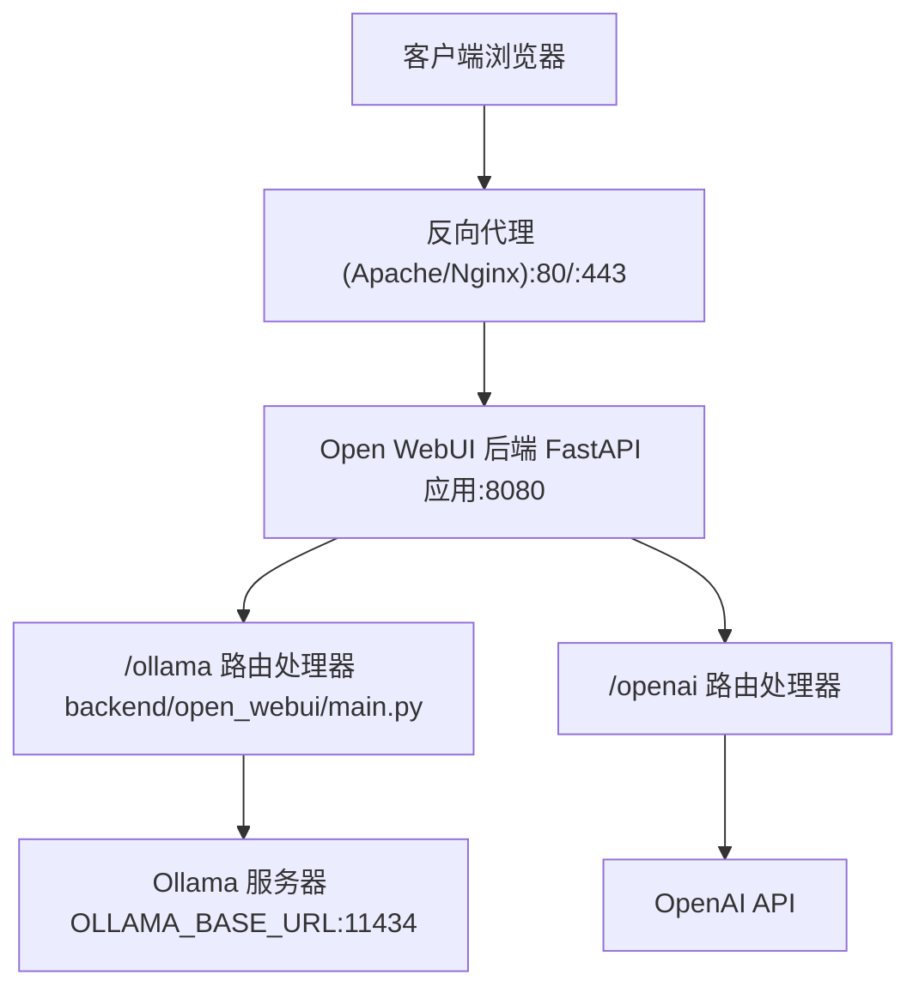
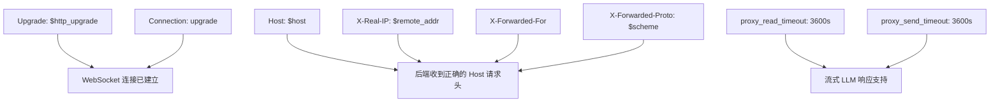
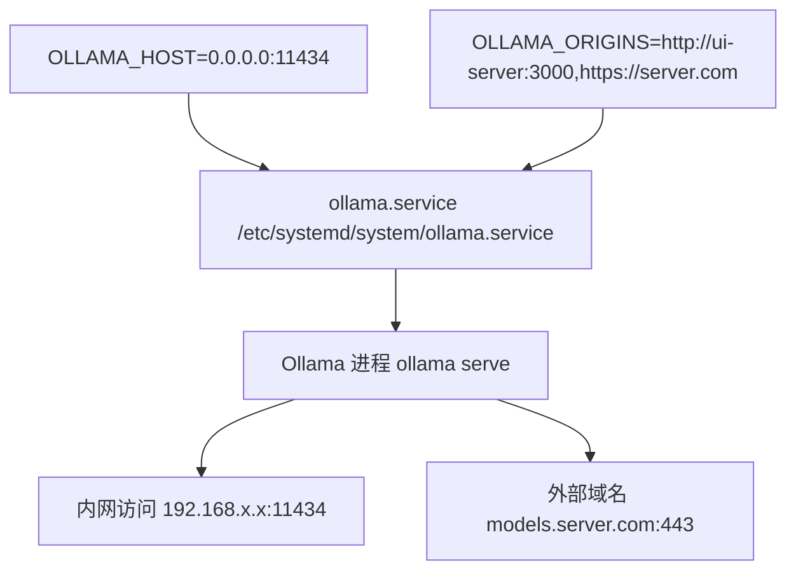
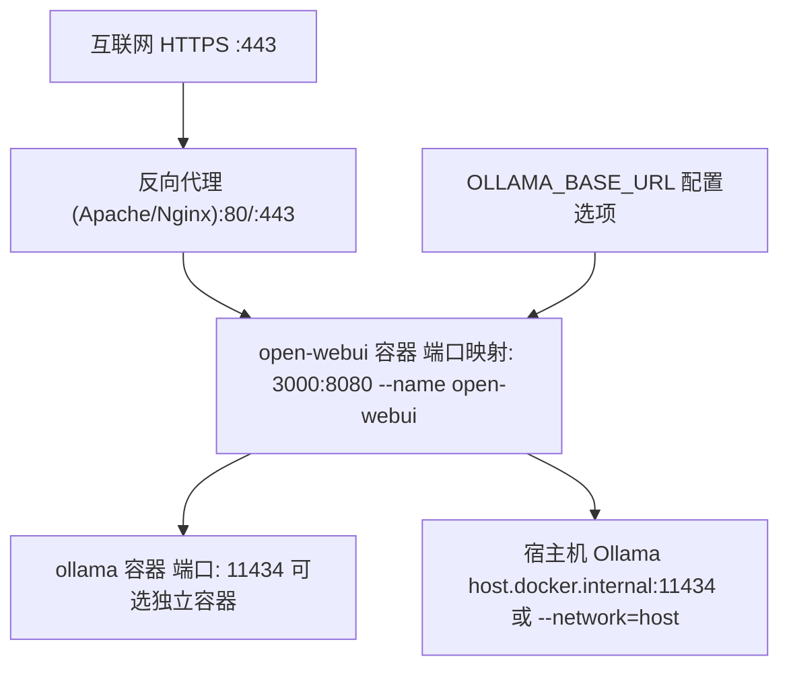
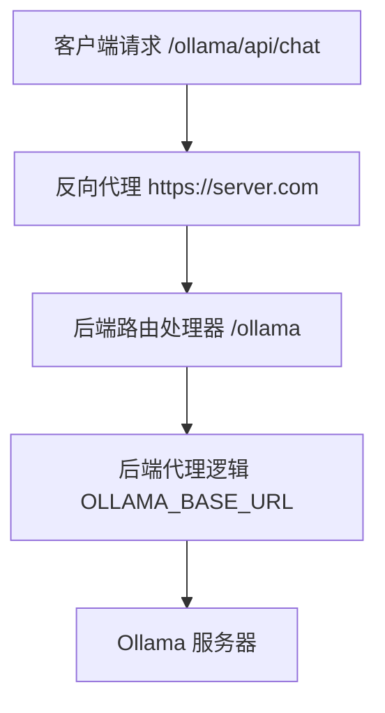

# 反向代理设置

相关源文件

-   [LICENSE](https://github.com/open-webui/open-webui/blob/a7271532/LICENSE)
-   [README.md](https://github.com/open-webui/open-webui/blob/a7271532/README.md)
-   [TROUBLESHOOTING.md](https://github.com/open-webui/open-webui/blob/a7271532/TROUBLESHOOTING.md)
-   [docs/apache.md](https://github.com/open-webui/open-webui/blob/a7271532/docs/apache.md)
-   [src/lib/components/chat/Settings/About.svelte](https://github.com/open-webui/open-webui/blob/a7271532/src/lib/components/chat/Settings/About.svelte)
-   [src/lib/constants.ts](https://github.com/open-webui/open-webui/blob/a7271532/src/lib/constants.ts)

本文档涵盖了 Open WebUI 生产部署中反向代理服务器（Apache, Nginx）的配置。反向代理提供 SSL 终止、增强安全性、负载均衡以及对实时功能所需的 WebSocket 连接的正确处理。

有关常规安装和部署选项，请参阅 [安装与部署](/open-webui/open-webui/3-installation-and-deployment)。有关环境配置详情，请参阅 [环境配置](/open-webui/open-webui/3.3-environment-configuration)。有关将请求路由到 LLM 提供者的内部后端代理架构，请参阅 [后端架构](/open-webui/open-webui/2.3-backend-architecture) 和 [LLM 提供者集成](/open-webui/open-webui/13-llm-provider-integration)。

## 反向代理架构

Open WebUI 以双代理架构运行。应用程序后端本身充当 LLM 提供者（Ollama, OpenAI 等）的反向代理，而外部反向代理（Apache/Nginx）处理 SSL 终止、路由和外部访问。

### 请求流程图


来源： [TROUBLESHOOTING.md1-10](https://github.com/open-webui/open-webui/blob/a7271532/TROUBLESHOOTING.md#L1-L10) [docs/apache.md1-50](https://github.com/open-webui/open-webui/blob/a7271532/docs/apache.md#L1-L50)

外部反向代理终止 SSL 并将请求转发到 Open WebUI 容器的 8080 端口（内部）或 3000 端口（Docker 暴露端口）。然后，后端通过 `/ollama` 和 `/openai` 等路由将请求代理到配置的 LLM 提供者。

## Apache 配置

Apache 需要启用 `mod_proxy`、`mod_proxy_http`、`mod_proxy_wstunnel` 和 `mod_ssl` 模块才能实现完整功能。

### 基础 HTTP 配置

```
<VirtualHost *:80>
    ServerName server.com
    DocumentRoot /var/www/html

    ProxyPreserveHost On
    ProxyRequests Off

    # HTTP 请求代理
    ProxyPass / http://localhost:3000/ nocanon
    ProxyPassReverse / http://localhost:3000/

    # WebSocket 支持 (0.5+ 版本必需)
    ProxyPass / ws://localhost:3000/ nocanon
    ProxyPassReverse / ws://localhost:3000/
</VirtualHost>
```
来源： [docs/apache.md11-24](https://github.com/open-webui/open-webui/blob/a7271532/docs/apache.md#L11-L24)

**配置元素：**

| 指令 |
| --- |
| `ProxyPreserveHost On` | 将原始 `Host` 请求头转发到后端 |
| `ProxyRequests Off` | 禁用正向代理模式（安全性） |
| `ProxyPass / http://localhost:3000/` | 将所有请求路由到 Open WebUI 后端 |
| `ProxyPass / ws://localhost:3000/` | 为实时事件启用 WebSocket 连接 |
| `nocanon` | 防止 URL 解码/重新编码（保留路径） |

WebSocket 代理配置对于实时功能（包括流式响应、状态更新和协作编辑）至关重要。如果没有 WebSocket 支持，[WebSocket 事件处理](/open-webui/open-webui/4.5-websocket-event-handling) 和 [实时通信](/open-webui/open-webui/16-real-time-communication) 中记录的功能将无法运行。

来源： [docs/apache.md11-24](https://github.com/open-webui/open-webui/blob/a7271532/docs/apache.md#L11-L24) [README.md183-189](https://github.com/open-webui/open-webui/blob/a7271532/README.md#L183-L189)

### SSL/HTTPS 配置

#### 使用 Certbot 自动配置 SSL

```
# 安装 certbot
snap install certbot --classic
apt install python3-certbot-apache

# 进入 Apache 配置目录
cd /etc/apache2/sites-available/

# 创建初始 HTTP 配置 (server.com.conf)
# 然后请求 SSL 证书
certbot --apache -d server.com
```
来源： [docs/apache.md53-68](https://github.com/open-webui/open-webui/blob/a7271532/docs/apache.md#L53-L68)

Certbot 会自动创建一个单独的 SSL 配置文件（`server.com-le-ssl.conf`）并配置 HTTPS 重定向。

#### 手动 SSL 配置

```
<VirtualHost *:443>
    ServerName server.com
    DocumentRoot /var/www/html

    # 代理配置
    ProxyPreserveHost On
    ProxyRequests Off
    ProxyPass / http://localhost:3000/ nocanon
    ProxyPassReverse / http://localhost:3000/

    # WebSocket 支持
    ProxyPass / ws://localhost:3000/ nocanon
    ProxyPassReverse / ws://localhost:3000/

    # SSL 引擎
    SSLEngine on
    SSLCertificateFile /etc/ssl/certs/ssl.cert
    SSLCertificateKeyFile /etc/ssl/private/ssl.key
    SSLProtocol all -SSLv2 -SSLv3 -TLSv1 -TLSv1.1

    # 代理 SSL 设置
    SSLProxyEngine on
    SSLCACertificateFile /etc/ssl/certs/ssl.ca
</VirtualHost>
```
来源： [docs/apache.md30-50](https://github.com/open-webui/open-webui/blob/a7271532/docs/apache.md#L30-L50)

**SSL 配置参数：**

| 参数 |
| --- |
| `SSLEngine` | `on` | 启用 SSL/TLS |
| `SSLProtocol` | `all -SSLv2 -SSLv3 -TLSv1 -TLSv1.1` | 仅使用 TLS 1.2+ (安全性) |
| `SSLProxyEngine` | `on` | 为后端代理连接启用 SSL |
| `SSLCertificateFile` | 证书路径 | 公钥证书 |
| `SSLCertificateKeyFile` | 密钥路径 | 私钥 |
| `SSLCACertificateFile` | CA 捆绑包路径 | 证书颁发机构链 |

#### 启用配置

```
# 启用站点
a2ensite server.com.conf

# 启用所需模块
a2enmod proxy
a2enmod proxy_http
a2enmod proxy_wstunnel
a2enmod ssl

# 测试配置
apache2ctl configtest

# 重新加载 Apache
systemctl reload apache2
```
来源： [docs/apache.md28](https://github.com/open-webui/open-webui/blob/a7271532/docs/apache.md#L28-L28) [docs/apache.md193](https://github.com/open-webui/open-webui/blob/a7271532/docs/apache.md#L193-L193)

## Nginx 配置

Nginx 是 Apache 的替代方案，能够高效处理并发连接并支持 WebSocket。

### 基础 Nginx 配置

```
server {
    listen 80;
    server_name server.com;

    location / {
        proxy_pass http://localhost:3000;
        proxy_http_version 1.1;

        # WebSocket 支持
        proxy_set_header Upgrade $http_upgrade;
        proxy_set_header Connection "upgrade";

        # 保留请求头
        proxy_set_header Host $host;
        proxy_set_header X-Real-IP $remote_addr;
        proxy_set_header X-Forwarded-For $proxy_add_x_forwarded_for;
        proxy_set_header X-Forwarded-Proto $scheme;

        # 流式输出的超时设置
        proxy_read_timeout 3600s;
        proxy_send_timeout 3600s;
    }
}
```
**WebSocket 配置元素：**


`proxy_read_timeout` 和 `proxy_send_timeout` 的值必须足以支持长时间运行的 LLM 流式响应。Open WebUI 中的默认超时为 300 秒（5 分钟），可通过 `AIOHTTP_CLIENT_TIMEOUT` 环境变量进行配置。

来源： [TROUBLESHOOTING.md22-23](https://github.com/open-webui/open-webui/blob/a7271532/TROUBLESHOOTING.md#L22-L23)

### Nginx SSL 配置

```
server {
    listen 443 ssl http2;
    server_name server.com;

    ssl_certificate /etc/letsencrypt/live/server.com/fullchain.pem;
    ssl_certificate_key /etc/letsencrypt/live/server.com/privkey.pem;

    ssl_protocols TLSv1.2 TLSv1.3;
    ssl_ciphers HIGH:!aNULL:!MD5;
    ssl_prefer_server_ciphers on;

    location / {
        proxy_pass http://localhost:3000;
        proxy_http_version 1.1;

        proxy_set_header Upgrade $http_upgrade;
        proxy_set_header Connection "upgrade";
        proxy_set_header Host $host;
        proxy_set_header X-Real-IP $remote_addr;
        proxy_set_header X-Forwarded-For $proxy_add_x_forwarded_for;
        proxy_set_header X-Forwarded-Proto $scheme;

        proxy_read_timeout 3600s;
        proxy_send_timeout 3600s;
    }
}

# HTTP 到 HTTPS 重定向
server {
    listen 80;
    server_name server.com;
    return 301 https://$server_name$request_uri;
}
```
#### 使用 Certbot 配置 Nginx

```
# 安装 certbot
snap install certbot --classic
apt install python3-certbot-nginx

# 请求并配置 SSL
certbot --nginx -d server.com
```
Certbot 会自动修改 Nginx 配置以添加 SSL 指令及 HTTPS 重定向。

## 独立 Ollama 服务器配置

在企业级部署中，Ollama 通常运行在配备 GPU 的独立服务器上。这需要配置 Ollama 服务器以允许外部访问，并为 Ollama API 配置反向代理。

### Ollama 服务器配置


来源： [docs/apache.md70-115](https://github.com/open-webui/open-webui/blob/a7271532/docs/apache.md#L70-L115)

编辑 `/etc/systemd/system/ollama.service`：

```
[Unit]
Description=Ollama Service
After=network-online.target

[Service]
ExecStart=/usr/local/bin/ollama serve
Environment="OLLAMA_HOST=0.0.0.0:11434"
Environment="OLLAMA_ORIGINS=http://192.168.1.100:3000,https://server.com"
User=ollama
Group=ollama
Restart=always
RestartSec=3

[Install]
WantedBy=default.target
```
来源： [docs/apache.md80-111](https://github.com/open-webui/open-webui/blob/a7271532/docs/apache.md#L80-L111)

**配置参数：**

| 参数 |
| --- |
| `OLLAMA_HOST` | `0.0.0.0:11434` | 监听所有接口（外部访问必需） |
| `OLLAMA_ORIGINS` | 逗号分隔的 URL | CORS 允许的来源（包含 UI 服务器 URL） |

编辑后，重新加载 systemd 配置：

```
sudo systemctl daemon-reload
sudo systemctl restart ollama
```
### Ollama API 的 Apache 配置

```
<VirtualHost *:443>
    ServerName models.server.com
    DocumentRoot /var/www/html

    ProxyRequests Off
    ProxyPreserveHost On
    ProxyAddHeaders On
    SSLProxyEngine on

    ProxyPass / http://ollama-server:11434/ nocanon
    ProxyPassReverse / http://ollama-server:11434/

    SSLEngine on
    SSLCertificateFile /etc/letsencrypt/live/models.server.com/fullchain.pem
    SSLCertificateKeyFile /etc/letsencrypt/live/models.server.com/privkey.pem
    Include /etc/letsencrypt/options-ssl-apache.conf
</VirtualHost>

<VirtualHost *:80>
    ServerName models.server.com
    RewriteEngine on
    RewriteRule ^ https://%{SERVER_NAME}%{REQUEST_URI} [END,NE,R=permanent]
</VirtualHost>
```
来源： [docs/apache.md129-190](https://github.com/open-webui/open-webui/blob/a7271532/docs/apache.md#L129-L190)

Open WebUI 后端随后使用 `OLLAMA_BASE_URL=https://models.server.com` 通过反向代理连接到 Ollama API。

## Docker 部署集成

当 Open WebUI 在 Docker 中运行时，反向代理配置必须考虑容器网络。

### 部署拓扑


来源： [README.md108-170](https://github.com/open-webui/open-webui/blob/a7271532/README.md#L108-L170) [TROUBLESHOOTING.md11-19](https://github.com/open-webui/open-webui/blob/a7271532/TROUBLESHOOTING.md#L11-L19)

### Docker 端口映射

Open WebUI 在内部暴露 8080 端口，外部映射到 3000 端口：

```
docker run -d \
  -p 3000:8080 \
  -v open-webui:/app/backend/data \
  --name open-webui \
  --restart always \
  ghcr.io/open-webui/open-webui:main
```
来源： [README.md124-125](https://github.com/open-webui/open-webui/blob/a7271532/README.md#L124-L125)

反向代理必须转发到 `localhost:3000` 而不是 `localhost:8080`，因为 3000 是宿主机暴露的端口。

### 网络模式考量

**网桥模式 (默认)：**

```
docker run -d -p 3000:8080 \
  --add-host=host.docker.internal:host-gateway \
  -e OLLAMA_BASE_URL=http://host.docker.internal:11434 \
  -v open-webui:/app/backend/data \
  --name open-webui \
  ghcr.io/open-webui/open-webui:main
```
来源： [README.md124-125](https://github.com/open-webui/open-webui/blob/a7271532/README.md#L124-L125) [TROUBLESHOOTING.md16-18](https://github.com/open-webui/open-webui/blob/a7271532/TROUBLESHOOTING.md#L16-L18)

**主机模式 (替代方案)：**

```
docker run -d --network=host \
  -e OLLAMA_BASE_URL=http://127.0.0.1:11434 \
  -v open-webui:/app/backend/data \
  --name open-webui \
  ghcr.io/open-webui/open-webui:main
```
来源： [README.md188-189](https://github.com/open-webui/open-webui/blob/a7271532/README.md#L188-L189) [TROUBLESHOOTING.md16-18](https://github.com/open-webui/open-webui/blob/a7271532/TROUBLESHOOTING.md#L16-L18)

使用 `--network=host` 时，容器直接使用宿主机的网络栈。应用程序监听 8080 端口（而不是 3000），因此反向代理必须使用 `http://localhost:8080`。

## 前端 URL 配置

前端根据环境动态构造 API URL。[src/lib/constants.ts1-14](https://github.com/open-webui/open-webui/blob/a7271532/src/lib/constants.ts#L1-L14) 中的这些常量定义了 URL 结构：

```
export const WEBUI_HOSTNAME = browser ? (dev ? `${location.hostname}:8080` : ``) : '';
export const WEBUI_BASE_URL = browser ? (dev ? `http://${WEBUI_HOSTNAME}` : ``) : ``;
export const WEBUI_API_BASE_URL = `${WEBUI_BASE_URL}/api/v1`;

export const OLLAMA_API_BASE_URL = `${WEBUI_BASE_URL}/ollama`;
export const OPENAI_API_BASE_URL = `${WEBUI_BASE_URL}/openai`;
export const AUDIO_API_BASE_URL = `${WEBUI_BASE_URL}/api/v1/audio`;
export const IMAGES_API_BASE_URL = `${WEBUI_BASE_URL}/api/v1/images`;
export const RETRIEVAL_API_BASE_URL = `${WEBUI_BASE_URL}/api/v1/retrieval`;
```
来源： [src/lib/constants.ts6-14](https://github.com/open-webui/open-webui/blob/a7271532/src/lib/constants.ts#L6-L14)

在生产环境（非开发模式）中，`WEBUI_BASE_URL` 为空，导致前端使用相对 URL。这确保了请求无论通过什么域名都能路由通过反向代理。

**URL 解析示例：**

| 环境 | 前端请求 | 解析后的 URL |
| --- | --- | --- |
| 开发环境 | `/api/v1/chats` | `http://localhost:8080/api/v1/chats` |
| 生产环境 (通过代理) | `/api/v1/chats` | `https://server.com/api/v1/chats` |
| 生产环境 (通过代理) | `/ollama/api/tags` | `https://server.com/ollama/api/tags` |

位于 `/ollama` 的后端随后将请求转发到配置的 `OLLAMA_BASE_URL`。

## 环境变量

反向代理部署的关键环境变量：

| 变量 |
| --- |
| `OLLAMA_BASE_URL` | `http://localhost:11434` | Ollama API 端点（内部路由） |
| `OPENAI_API_BASE_URL` | 
 | 兼容 OpenAI 的 API 端点 |
| `WEBUI_URL` | 
 | 用于回调的外部 URL（OAuth, webhooks） |
| `AIOHTTP_CLIENT_TIMEOUT` | `300` | 后端 HTTP 客户端超时时间（秒） |
| `ENABLE_WEBSOCKET_SUPPORT` | `true` | WebSocket 功能开关 |

来源： [README.md129-133](https://github.com/open-webui/open-webui/blob/a7271532/README.md#L129-L133) [TROUBLESHOOTING.md22-23](https://github.com/open-webui/open-webui/blob/a7271532/TROUBLESHOOTING.md#L22-L23)

`WEBUI_URL` 应设置为外部 HTTPS URL（例如 `https://server.com`），用于需要绝对 URL 的功能，如 OAuth 回调和共享聊天链接。

## 故障排除

### 连接错误

**问题：** “服务器连接错误”或“获取失败” (Failed to fetch)

**常见原因：**

1.  **WebSocket 代理未配置**：0.5+ 版本需要 WebSocket 支持
2.  **OLLAMA_BASE_URL 配置错误**：容器无法访问指定的 URL
3.  **超时时间太短**：流式响应超过了 `AIOHTTP_CLIENT_TIMEOUT`

来源： [TROUBLESHOOTING.md11-36](https://github.com/open-webui/open-webui/blob/a7271532/TROUBLESHOOTING.md#L11-L36)

**诊断步骤：**

```
# 检查反向代理是否在转发请求
curl -I https://server.com

# 检查 WebSocket 连接 (需要 wscat)
wscat -c wss://server.com

# 从容器内部检查 Ollama 的可访问性
docker exec open-webui curl http://host.docker.internal:11434/api/tags

# 查看容器日志
docker logs open-webui
```
### 超时配置

对于慢速模型响应或大型上下文窗口：

```
# 将后端超时增加到 10 分钟
docker run -d -p 3000:8080 \
  -e AIOHTTP_CLIENT_TIMEOUT=600 \
  -v open-webui:/app/backend/data \
  --name open-webui \
  ghcr.io/open-webui/open-webui:main
```
反向代理的超时也必须适应长响应：

**Apache:**

```
ProxyTimeout 600
```
**Nginx:**

```
proxy_read_timeout 600s;
proxy_send_timeout 600s;
```
来源： [TROUBLESHOOTING.md22-23](https://github.com/open-webui/open-webui/blob/a7271532/TROUBLESHOOTING.md#L22-L23)

### CORS 问题

如果 Ollama 在独立服务器上运行且遇到 CORS 错误：

1.  在 `/etc/systemd/system/ollama.service` 中设置 `OLLAMA_ORIGINS` 以包含 Open WebUI 的 URL
2.  重启 Ollama：`systemctl restart ollama`
3.  验证配置：`systemctl status ollama`

来源： [docs/apache.md89](https://github.com/open-webui/open-webui/blob/a7271532/docs/apache.md#L89-L89) [docs/apache.md102](https://github.com/open-webui/open-webui/blob/a7271532/docs/apache.md#L102-L102)

### SSL 证书问题

**Apache SSL 测试：**

```
apache2ctl configtest
```
**常见 SSL 错误：**

-   **证书不匹配**：ServerName 与证书的 CN/SAN 不匹配
-   **缺少中间证书**：在 SSLCertificateFile 中应包含完整链
-   **弱密码**：使用现代密码套件 (TLS 1.2+)

**验证 SSL 配置：**

```
openssl s_client -connect server.com:443 -servername server.com
```
### 后端代理架构

内部代理架构（Open WebUI 如何转发到 LLM 提供者）与外部反向代理是分开的。后端在 `/ollama` 和 `/openai` 等路由接收请求，然后使用配置的 `*_BASE_URL` 环境变量转发请求。


来源： [TROUBLESHOOTING.md1-9](https://github.com/open-webui/open-webui/blob/a7271532/TROUBLESHOOTING.md#L1-L9)

后端代理提供了包括 CORS 处理、身份验证强制执行以及 [后端处理流水线](/open-webui/open-webui/6-backend-processing-pipeline) 中记录的请求增强等安全优势。
