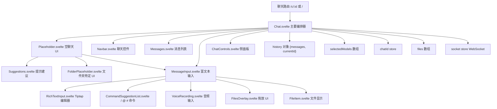
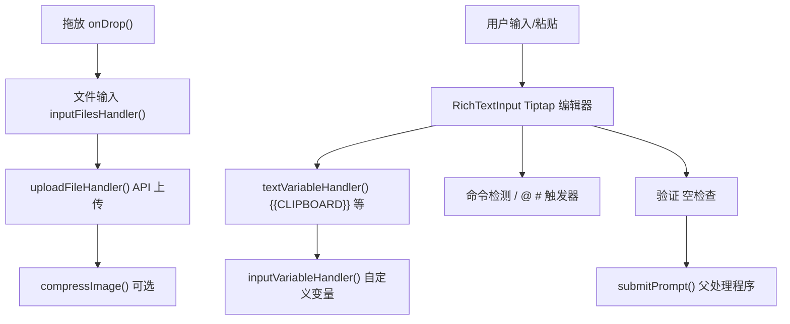
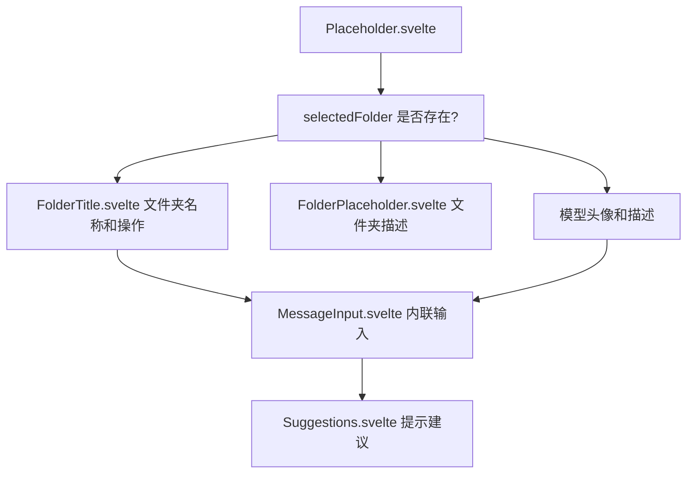

# 聊天系统

相关源文件

-   [src/lib/components/channel/MessageInput.svelte](https://github.com/open-webui/open-webui/blob/a7271532/src/lib/components/channel/MessageInput.svelte)
-   [src/lib/components/chat/Chat.svelte](https://github.com/open-webui/open-webui/blob/a7271532/src/lib/components/chat/Chat.svelte)
-   [src/lib/components/chat/ChatPlaceholder.svelte](https://github.com/open-webui/open-webui/blob/a7271532/src/lib/components/chat/ChatPlaceholder.svelte)
-   [src/lib/components/chat/MessageInput.svelte](https://github.com/open-webui/open-webui/blob/a7271532/src/lib/components/chat/MessageInput.svelte)
-   [src/lib/components/chat/Placeholder.svelte](https://github.com/open-webui/open-webui/blob/a7271532/src/lib/components/chat/Placeholder.svelte)
-   [src/lib/components/chat/Suggestions.svelte](https://github.com/open-webui/open-webui/blob/a7271532/src/lib/components/chat/Suggestions.svelte)
-   [src/lib/components/common/FileItem.svelte](https://github.com/open-webui/open-webui/blob/a7271532/src/lib/components/common/FileItem.svelte)
-   [src/lib/components/common/FileItemModal.svelte](https://github.com/open-webui/open-webui/blob/a7271532/src/lib/components/common/FileItemModal.svelte)

## 目的和范围

聊天系统是 Open WebUI 中与语言模型交互的主要用户界面。本文档涵盖了前端聊天界面的架构，包括主要的 Chat 组件编排、消息输入处理、文件附件、实时事件处理以及空状态管理。

有关后端聊天处理和中间件增强（工具、RAG、Web 搜索），请参阅[后端处理管道](/open-webui/open-webui/6-backend-processing-pipeline)。有关消息渲染和显示，请参阅[消息渲染](/open-webui/open-webui/5-message-rendering)。有关导航和聊天组织，请参阅[导航和组织](/open-webui/open-webui/8-navigation-and-organization)。

## 概览

聊天系统围绕 `Chat.svelte` 构建，它是负责管理的中心编排组件：

-   **聊天生命周期**：初始化、加载现有聊天、创建新对话
-   **模型选择**：具有功能检测功能的单模型或多模型选择
-   **消息输入**：具有变量替换和文件附件功能的富文本编辑
-   **历史管理**：具有分支支持的基于树的消息结构
-   **实时更新**：用于流式传输响应的 WebSocket 事件处理
-   **空状态**：带有模型信息和建议提示的占位符 UI

系统以两种主要模式运行：

1.  **新聊天模式**：显示带有建议和模型信息的 `Placeholder.svelte`
2.  **活跃聊天模式**：通过 `Messages.svelte` 显示消息历史记录，并通过 `MessageInput.svelte` 进行输入

来源：[src/lib/components/chat/Chat.svelte1-2747](https://github.com/open-webui/open-webui/blob/a7271532/src/lib/components/chat/Chat.svelte#L1-L2747)

## 组件架构


**关键组件职责：**

| 组件 | 文件 | 主要职责 |
| --- | --- | --- |
| `Chat.svelte` | `src/lib/components/chat/Chat.svelte` | 编排整个聊天界面，管理生命周期和状态 |
| `Placeholder.svelte` | `src/lib/components/chat/Placeholder.svelte` | 显示带有模型信息和建议的空状态 |
| `MessageInput.svelte` | `src/lib/components/chat/MessageInput.svelte` | 处理用户输入、文件上传、变量替换 |
| `Messages.svelte` | `src/lib/components/chat/Messages.svelte` | 渲染消息历史树 |
| `Suggestions.svelte` | `src/lib/components/chat/Suggestions.svelte` | 显示具有模糊搜索功能的提示建议 |

来源：[src/lib/components/chat/Chat.svelte1-100](https://github.com/open-webui/open-webui/blob/a7271532/src/lib/components/chat/Chat.svelte#L1-L100) [src/lib/components/chat/Placeholder.svelte1-251](https://github.com/open-webui/open-webui/blob/a7271532/src/lib/components/chat/Placeholder.svelte#L1-L251) [src/lib/components/chat/MessageInput.svelte1-100](https://github.com/open-webui/open-webui/blob/a7271532/src/lib/components/chat/MessageInput.svelte#L1-L100)

## 聊天编排器组件

### Chat.svelte 结构

`Chat.svelte` 作为一个具有复杂组件生命周期的中心编排器：

> **[Mermaid stateDiagram]**
> *(图表结构无法解析)*

**组件属性：**

```javascript
export let chatIdProp = '';  // 来自路由参数的聊天 ID
```
**关键内部状态：**

```javascript
let loading = true;                    // 初始加载状态
let autoScroll = true;                // 自动滚动到底部
let generating = false;                // LLM 生成激活状态
let generationController = null;      // 用于取消的 AbortController

let selectedModels = [''];            // 选定的模型 ID
let atSelectedModel: Model | undefined; // @-选定的模型覆盖

let history = {                       // 消息树结构
  messages: {},
  currentId: null
};

let prompt = '';                      // 当前输入文本
let files = [];                       // 附加文件
let chatFiles = [];                   // 来自已加载聊天的文件
let params = {};                      // 模型参数

let selectedToolIds = [];             // 选定的工具
let selectedFilterIds = [];           // 选定的过滤器
let imageGenerationEnabled = false;   // 图像生成开关
let webSearchEnabled = false;         // Web 搜索开关
let codeInterpreterEnabled = false;   // 代码执行开关
```
来源：[src/lib/components/chat/Chat.svelte101-162](https://github.com/open-webui/open-webui/blob/a7271532/src/lib/components/chat/Chat.svelte#L101-L162)

### 生命周期钩子

**`onMount` 初始化：**

该组件注册 WebSocket 事件处理程序，初始化音频队列，并设置订阅：

```javascript
onMount(async () => {
  window.addEventListener('message', onMessageHandler);
  $socket?.on('events', chatEventHandler);

  audioQueue.set(new AudioQueue(document.getElementById('audioElement')));

  pageSubscribe = page.subscribe(async (p) => {
    if (p.url.pathname === '/') {
      initNewChat();
    }
    stopAudio();
  });

  // ... 额外订阅
});
```
来源：[src/lib/components/chat/Chat.svelte548-634](https://github.com/open-webui/open-webui/blob/a7271532/src/lib/components/chat/Chat.svelte#L548-L634)

**路由导航处理程序：**

`navigateHandler` 函数在路由参数更改时管理聊天加载：

```javascript
const navigateHandler = async () => {
  loading = true;

  prompt = '';
  messageInput?.setText('');
  files = [];
  selectedToolIds = [];
  // ... 重置状态

  if (chatIdProp && (await loadChat())) {
    await tick();
    loading = false;
    window.setTimeout(() => scrollToBottom(), 0);

    // 从 sessionStorage 恢复保存的输入
    const storageChatInput = sessionStorage.getItem(`chat-input-${chatIdProp}`);
    // ... 恢复逻辑
  } else {
    await goto('/');
  }
};
```
来源：[src/lib/components/chat/Chat.svelte167-213](https://github.com/open-webui/open-webui/blob/a7271532/src/lib/components/chat/Chat.svelte#L167-L213)

## 聊天初始化和加载

### 新聊天初始化

`initNewChat` 函数通过模型选择逻辑设置新对话：

```javascript
const initNewChat = async () => {
  // 检查临时聊天权限
  if ($user?.role !== 'admin') {
    if ($user?.permissions?.chat?.temporary_enforced) {
      await temporaryChatEnabled.set(true);
    }
  }

  // 应用默认临时聊天设置
  if ($settings?.temporaryChatByDefault ?? false) {
    // ... 临时聊天逻辑
  }

  const availableModels = $models
    .filter((m) => !(m?.info?.meta?.hidden ?? false))
    .map((m) => m.id);

  // 模型选择优先级：
  // 1. URL 参数 (?models=id1,id2)
  // 2. 所选文件夹模型
  // 3. 会话存储 (Session storage)
  // 4. 用户设置
  // 5. 配置默认模型 (Config default_models)
  // 6. 第一个可用模型

  if ($page.url.searchParams.get('models')) {
    selectedModels = $page.url.searchParams.get('models').split(',');
  } else if ($selectedFolder?.data?.model_ids) {
    selectedModels = $selectedFolder.data.model_ids;
  } else if (sessionStorage.selectedModels) {
    selectedModels = JSON.parse(sessionStorage.selectedModels);
  } else if ($settings?.models) {
    selectedModels = $settings.models;
  } else if ($config?.default_models) {
    selectedModels = $config.default_models.split(',');
  }

  // 仅过滤到可用模型
  selectedModels = selectedModels.filter(id => availableModels.includes(id));

  // 应用 URL 参数以开启功能
  if ($page.url.searchParams.get('web-search') === 'true') {
    webSearchEnabled = true;
  }
  // ... 其他 URL 参数
};
```
来源：[src/lib/components/chat/Chat.svelte890-1056](https://github.com/open-webui/open-webui/blob/a7271532/src/lib/components/chat/Chat.svelte#L890-L1056)

### 现有聊天加载

`loadChat` 函数检索并重构聊天状态：

```javascript
const loadChat = async () => {
  chatId.set(chatIdProp);

  if ($temporaryChatEnabled) {
    temporaryChatEnabled.set(false);
  }

  chat = await getChatById(localStorage.token, $chatId).catch(async (error) => {
    await goto('/');
    return null;
  });

  if (chat) {
    tags = await getTagsById(localStorage.token, $chatId);
    const chatContent = chat.chat;

    if (chatContent) {
      selectedModels = (chatContent?.models ?? undefined) !== undefined
        ? chatContent.models
        : [chatContent.models ?? ''];

      history = (chatContent?.history ?? undefined) !== undefined
        ? chatContent.history
        : convertMessagesToHistory(chatContent.messages);

      chatTitle.set(chatContent.title);
      params = chatContent?.params ?? {};
      chatFiles = chatContent?.files ?? [];

      autoScroll = true;
      await tick();

      // 将所有助手消息标记为完成（防止重新生成）
      if (history.currentId) {
        for (const message of Object.values(history.messages)) {
          if (message.role === 'assistant') {
            message.done = true;
          }
        }
      }

      // 加载任何活跃任务
      const taskRes = await getTaskIdsByChatId(localStorage.token, $chatId);
      if (taskRes) {
        taskIds = taskRes.task_ids;
      }

      return true;
    }
  }
};
```
来源：[src/lib/components/chat/Chat.svelte1058-1127](https://github.com/open-webui/open-webui/blob/a7271532/src/lib/components/chat/Chat.svelte#L1058-L1127)

## 消息输入系统

### MessageInput.svelte 架构

`MessageInput.svelte` 是一个复杂的组件，处理富文本输入、文件上传、变量替换和命令建议：


**组件 Props：**

```javascript
export let onUpload: Function = (e) => {};
export let onChange: Function = () => {};
export let createMessagePair: Function;
export let stopResponse: Function;

export let autoScroll = false;
export let generating = false;

export let atSelectedModel: Model | undefined = undefined;
export let selectedModels: [''];

export let history;
export let taskIds = null;

export let prompt = '';
export let files = [];

export let selectedToolIds = [];
export let selectedFilterIds = [];

export let imageGenerationEnabled = false;
export let webSearchEnabled = false;
export let codeInterpreterEnabled = false;
```
来源：[src/lib/components/chat/MessageInput.svelte96-122](https://github.com/open-webui/open-webui/blob/a7271532/src/lib/components/chat/MessageInput.svelte#L96-L122)

### 变量替换

输入系统支持两种类型的变量替换：

**1. 文本变量 (内置)：**

这些变量在输入文本时会自动替换：

```javascript
const textVariableHandler = async (text: string) => {
  if (text.includes('{{CLIPBOARD}}')) {
    const clipboardText = await navigator.clipboard.readText();
    const clipboardItems = await navigator.clipboard.read();

    // 同时处理剪贴板中的文本和图像
    for (const item of clipboardItems) {
      for (const type of item.types) {
        if (type.startsWith('image/')) {
          const blob = await item.getType(type);
          const file = new File([blob], `clipboard-image.${type.split('/')[1]}`, {
            type: type
          });
          inputFilesHandler([file]);
        }
      }
    }

    text = text.replaceAll('{{CLIPBOARD}}', clipboardText);
  }

  if (text.includes('{{USER_LOCATION}}')) {
    let location = await getUserPosition();
    text = text.replaceAll('{{USER_LOCATION}}', String(location));
  }

  if (text.includes('{{CURRENT_DATE}}')) {
    const date = getFormattedDate();
    text = text.replaceAll('{{CURRENT_DATE}}', date);
  }

  // ... 额外变量：
  // {{USER_NAME}}, {{USER_BIO}}, {{USER_GENDER}}, {{USER_BIRTH_DATE}},
  // {{USER_AGE}}, {{USER_LANGUAGE}}, {{CURRENT_TIME}}, {{CURRENT_DATETIME}},
  // {{CURRENT_TIMEZONE}}, {{CURRENT_WEEKDAY}}

  return text;
};
```
来源：[src/lib/components/chat/MessageInput.svelte178-289](https://github.com/open-webui/open-webui/blob/a7271532/src/lib/components/chat/MessageInput.svelte#L178-L289)

**2. 输入变量 (自定义)：**

自定义变量会触发一个模态框供用户输入：

```javascript
const inputVariableHandler = async (text: string): Promise<string> => {
  inputVariables = extractInputVariables(text);

  // 无变量？立即返回
  if (Object.keys(inputVariables).length === 0) {
    return text;
  }

  // 显示模态框并等待用户输入
  showInputVariablesModal = true;
  return await new Promise<string>((resolve) => {
    inputVariablesModalCallback = (variableValues) => {
      inputVariableValues = { ...inputVariableValues, ...variableValues };
      replaceVariables(inputVariableValues);
      showInputVariablesModal = false;
      resolve(text);
    };
  });
};
```
来源：[src/lib/components/chat/MessageInput.svelte158-176](https://github.com/open-webui/open-webui/blob/a7271532/src/lib/components/chat/MessageInput.svelte#L158-L176)

### 文件上传处理

**文件上传流程：**

> **[Mermaid sequence]**
> *(图表结构无法解析)*

**上传处理程序实现：**

```javascript
const uploadFileHandler = async (file, process = true, itemData = {}) => {
  // 权限检查
  if ($_user?.role !== 'admin' && !($_user?.permissions?.chat?.file_upload ?? true)) {
    toast.error($i18n.t('You do not have permission to upload files.'));
    return null;
  }

  // 功能检查
  if (fileUploadCapableModels.length !== selectedModels.length) {
    toast.error($i18n.t('Model(s) do not support file upload'));
    return null;
  }

  const tempItemId = uuidv4();
  const fileItem = {
    type: 'file',
    file: '',
    id: null,
    url: '',
    name: file.name,
    collection_name: '',
    status: 'uploading',
    size: file.size,
    error: '',
    itemId: tempItemId,
    ...itemData
  };

  if (fileItem.size == 0) {
    toast.error($i18n.t('You cannot upload an empty file.'));
    return null;
  }

  files = [...files, fileItem];

  if (!$temporaryChatEnabled) {
    try {
      // 为音频文件添加语言元数据 (STT)
      let metadata = null;
      if ((file.type.startsWith('audio/') || file.type.startsWith('video/')) &&
          $settings?.audio?.stt?.language) {
        metadata = {
          language: $settings?.audio?.stt?.language
        };
      }

      // 上传并自动提取内容
      const uploadedFile = await uploadFile(localStorage.token, file, metadata, process);

      if (uploadedFile) {
        fileItem.status = 'uploaded';
        fileItem.file = uploadedFile;
        fileItem.id = uploadedFile.id;
        fileItem.collection_name = uploadedFile?.meta?.collection_name;
        fileItem.content_type = uploadedFile.meta?.content_type;
        fileItem.url = `${uploadedFile.id}`;

        files = files;
      } else {
        files = files.filter((item) => item?.itemId !== tempItemId);
      }
    } catch (e) {
      toast.error(`${e}`);
      files = files.filter((item) => item?.itemId !== tempItemId);
    }
  } else {
    // 临时聊天：在客户端提取内容而不上传
    const content = await extractContentFromFile(file);

    if (content === null) {
      toast.error($i18n.t('Failed to extract content from the file.'));
      files = files.filter((item) => item?.itemId !== tempItemId);
      return null;
    } else {
      fileItem.status = 'uploaded';
      fileItem.type = 'text';
      fileItem.content = content;
      fileItem.id = uuidv4();

      files = files;
    }
  }
};
```
来源：[src/lib/components/chat/MessageInput.svelte535-641](https://github.com/open-webui/open-webui/blob/a7271532/src/lib/components/chat/MessageInput.svelte#L535-L641)

### 图像压缩

根据用户设置和服务器配置，可以选择性地压缩图像：

```javascript
const compressImageHandler = async (imageUrl, settings = {}, config = {}) => {
  const settingsCompression = settings?.imageCompression ?? false;
  const configWidth = config?.file?.image_compression?.width ?? null;
  const configHeight = config?.file?.image_compression?.height ?? null;

  // 如果设置和配置都不需要压缩，则返回原图
  if (!settingsCompression && !configWidth && !configHeight) {
    return imageUrl;
  }

  let width = null;
  let height = null;

  // 如果用户/设置需要压缩，选择其首选大小
  if (settingsCompression) {
    width = settings?.imageCompressionSize?.width ?? null;
    height = settings?.imageCompressionSize?.height ?? null;
  }

  // 应用配置限制作为上限
  if (configWidth && (width === null || width > configWidth)) {
    width = configWidth;
  }
  if (configHeight && (height === null || height > configHeight)) {
    height = configHeight;
  }

  // 如果需要，执行压缩
  if (width || height) {
    return await compressImage(imageUrl, width, height);
  }
  return imageUrl;
};
```
来源：[src/lib/components/chat/MessageInput.svelte688-722](https://github.com/open-webui/open-webui/blob/a7271532/src/lib/components/chat/MessageInput.svelte#L688-L722)

## WebSocket 事件处理

聊天系统使用 WebSocket 连接在 LLM 生成期间进行实时更新：

### 事件注册

WebSocket 事件在 `Chat.svelte` 的 `onMount` 中注册：

```javascript
onMount(async () => {
  $socket?.on('events', chatEventHandler);
  // ... 其他初始化
});

onDestroy(() => {
  $socket?.off('events', chatEventHandler);
  // ... 清理
});
```
来源：[src/lib/components/chat/Chat.svelte552](https://github.com/open-webui/open-webui/blob/a7271532/src/lib/components/chat/Chat.svelte#L552-L552) [src/lib/components/chat/Chat.svelte643](https://github.com/open-webui/open-webui/blob/a7271532/src/lib/components/chat/Chat.svelte#L643-L643)

### 事件处理程序实现

`chatEventHandler` 处理各种事件类型：

```mermaid
flowchart TD
    Event["WebSocket 事件 {chat_id, message_id, data}"]
    CheckChatId["chat_id 是否匹配 $chatId?"]
    Ignore["忽略事件"]
    GetMessage["从历史记录中获取消息"]
    EventType["事件类型?"]
    Status["追加到 statusHistory[]"]
    Completion["chatCompletionEventHandler()"]
    TaskCancel["设置 taskIds = null 标记消息完成"]
    Delta["追加到 message.content"]
    Replace["替换 message.content"]
    Files["更新 message.files"]
    Embeds["更新 message.embeds"]
    Error["设置 message.error"]
    FollowUps["更新 message.followUps"]
    Title["更新聊天标题 刷新聊天列表"]
    Tags["重新加载聊天标签"]
    Source["添加到 message.sources 或 code_executions"]
    Toast["显示 Toast 通知"]
    Confirm["显示确认对话框"]
    Execute["通过 Function() 执行代码"]
    Input["显示输入模态框"]
    UpdateHistory["更新 history.messages"]

    Event --> CheckChatId
    CheckChatId --> Ignore
    CheckChatId --> GetMessage
    GetMessage --> EventType
    EventType --> Status
    EventType --> Completion
    EventType --> TaskCancel
    EventType --> Delta
    EventType --> Replace
    EventType --> Files
    EventType --> Embeds
    EventType --> Error
    EventType --> FollowUps
    EventType --> Title
    EventType --> Tags
    EventType --> Source
    EventType --> Toast
    EventType --> Confirm
    EventType --> Execute
    EventType --> Input
    Status --> UpdateHistory
    Completion --> UpdateHistory
    TaskCancel --> UpdateHistory
    Delta --> UpdateHistory
    Replace --> UpdateHistory
    Files --> UpdateHistory
    Embeds --> UpdateHistory
    Error --> UpdateHistory
    FollowUps --> UpdateHistory
    Source --> UpdateHistory
```


**事件类型详情：**

| 事件类型 | 用途 | 数据结构 |
| --- | --- | --- |
| `status` | 生成期间的状态更新 | `{type: 'status', data: statusObject}` |
| `chat:completion` | 最终完成事件 | 触发 `chatCompletionEventHandler` |
| `chat:message:delta` | 流式内容块 | `{content: string}` - 追加到消息 |
| `chat:message` | 全量消息替换 | `{content: string}` - 替换消息 |
| `chat:message:files` | 文件附件 | `{files: FileObject[]}` |
| `chat:message:error` | 发生错误 | `{error: string}` |
| `chat:title` | 生成聊天标题 | `{title: string}` |
| `source` | 引用/代码执行 | `{type?: 'code_execution', ...}` |
| `notification` | Toast 通知 | 
```javascript
{type: 'info' |
```javascript
// ... 其他 toast 类型
```javascript
// ... 处理其他事件类型

      history.messages[event.message_id] = message;
    }
  }
};
```
来源：[src/lib/components/chat/Chat.svelte351-478](https://github.com/open-webui/open-webui/blob/a7271532/src/lib/components/chat/Chat.svelte#L351-L478)

## 空状态和占位符

当没有消息存在时，聊天系统会显示一个带有模型信息和建议提示的占位符 UI。

### 占位符组件结构


**模型显示：**

当选定模型时，占位符会显示带有元数据的模型头像：

```html
<!-- 带有描述提示工具的模型头像显示 -->
{#each models as model, modelIdx}
  <Tooltip
    content={(models[modelIdx]?.info?.meta?.tags ?? [])
      .map((tag) => tag.name.toUpperCase())
      .join(', ')}
    placement="top"
  >
    <button
      on:click={() => {
        selectedModelIdx = modelIdx;
      }}
    >
      
    </button>
  </Tooltip>
{/each}
```
来源：[src/lib/components/chat/Placeholder.svelte106-132](https://github.com/open-webui/open-webui/blob/a7271532/src/lib/components/chat/Placeholder.svelte#L106-L132)

### 建议组件

`Suggestions.svelte` 提供可模糊搜索的提示建议：

**功能：**

-   **模糊搜索**：在建议内容和标题上使用 Fuse.js 进行搜索
-   **动态过滤**：基于当前输入值进行过滤
-   **瀑布流动画**：用于建议卡片的展示
-   **随机排序**：以鼓励用户探索

**实现：**

```javascript
let sortedPrompts = [];
let filteredPrompts = [];

const fuseOptions = {
  keys: ['content', 'title'],
  threshold: 0.5
};

let fuse;

// 使用排序后的提示初始化 Fuse
$: fuse = new Fuse(sortedPrompts, fuseOptions);

// 基于输入过滤提示
const getFilteredPrompts = (inputValue) => {
  if (inputValue.length > 500) {
    filteredPrompts = [];
  } else {
    const newFilteredPrompts =
      inputValue.trim() && fuse
        ? fuse.search(inputValue.trim()).map((result) => result.item)
        : sortedPrompts;

    // 仅在更改时更新（优化）
    if (!arraysEqual(filteredPrompts, newFilteredPrompts)) {
      filteredPrompts = newFilteredPrompts;
    }
  }
};

// 挂载时随机化顺序
$: if (suggestionPrompts) {
  sortedPrompts = [...(suggestionPrompts ?? [])].sort(() => Math.random() - 0.5);
  getFilteredPrompts(inputValue);
}
```
来源：[src/lib/components/chat/Suggestions.svelte15-64](https://github.com/open-webui/open-webui/blob/a7271532/src/lib/components/chat/Suggestions.svelte#L15-L64)

**带有瀑布流动画的显示：**

```html
<div role="list" class="max-h-40 overflow-auto scrollbar-none items-start {className}">
  {#each filteredPrompts as prompt, idx (prompt.id || `${prompt.content}-${idx}`)}
    <button
      role="listitem"
      class="waterfall flex flex-col flex-1 shrink-0 w-full justify-between
             px-3 py-2 rounded-xl bg-transparent hover:bg-black/5
             dark:hover:bg-white/5 transition group"
      style="animation-delay: {idx * 60}ms"
      on:click={() => onSelect({ type: 'prompt', data: prompt.content })}
    >
      <div class="flex flex-col text-left">
        {#if prompt.title && prompt.title[0] !== ''}
          <div class="font-medium dark:text-gray-300 dark:group-hover:text-gray-200 transition line-clamp-1">
            {prompt.title[0]}
          </div>
          <div class="text-xs text-gray-600 dark:text-gray-400 font-normal line-clamp-1">
            {prompt.title[1]}
          </div>
        {:else}
          <div class="font-medium dark:text-gray-300 dark:group-hover:text-gray-200 transition line-clamp-1">
            {prompt.content}
          </div>
        {/if}
      </div>
    </button>
  {/each}
</div>
```
来源：[src/lib/components/chat/Suggestions.svelte84-122](https://github.com/open-webui/open-webui/blob/a7271532/src/lib/components/chat/Suggestions.svelte#L84-L122)

## 状态管理

聊天系统使用 Svelte stores 进行响应式状态管理：

**关键 Stores：**

| Store | 类型 | 用途 |
| --- | --- | --- |
| `chatId` | `Writable<string>` | 当前聊天 ID |
| `chatTitle` | `Writable<string>` | 当前聊天标题 |
| `chats` | `Writable<Chat[]>` | 所有聊天列表 |
| `models` | `Writable<Model[]>` | 可用模型 |
| `selectedFolder` | `Writable<Folder>` | 当前选定的文件夹 |
| `temporaryChatEnabled` | `Writable<boolean>` | 临时聊天模式 |
| `socket` | `Writable<Socket>` | WebSocket 连接 |
| `showControls` | `Writable<boolean>` | 显示侧面板 |
| `showOverview` | `Writable<boolean>` | 显示概览面板 |
| `showArtifacts` | `Writable<boolean>` | 显示 Artifacts 面板 |

**本地状态：**

`history` 对象是本地组件状态（不是 store），具有以下结构：

```typescript
type History = {
  messages: {
    [messageId: string]: {
      id: string;
      parentId: string | null;
      childrenIds: string[];
      role: 'user' | 'assistant';
      content: string;
      done: boolean;
      timestamp: number;
      model?: string;
      modelName?: string;
      files?: File[];
      sources?: Source[];
      statusHistory?: Status[];
      error?: ErrorObject;
    }
  };
  currentId: string | null;
};
```
这种基于树的结构支持消息分支和导航。有关消息历史树的详细信息，请参阅[消息历史树](/open-webui/open-webui/4.3-message-history-tree)。

来源：[src/lib/components/chat/Chat.svelte17-46](https://github.com/open-webui/open-webui/blob/a7271532/src/lib/components/chat/Chat.svelte#L17-L46) [src/lib/components/chat/Chat.svelte150-154](https://github.com/open-webui/open-webui/blob/a7271532/src/lib/components/chat/Chat.svelte#L150-L154)

## 文件显示组件

### FileItem.svelte

`FileItem.svelte` 提供紧凑的文件显示，具有预览功能：

**组件 Props：**

```javascript
export let className = 'w-60';
export let colorClassName = 'bg-white dark:bg-gray-850 border border-gray-50/30';
export let url: string | null = null;

export let dismissible = false;  // 显示删除按钮
export let modal = false;         // 点击打开模态框
export let loading = false;       // 显示加载动画
export let small = false;         // 紧凑模式

export let item = null;          // 完整的项对象
export let edit = false;         // 启用编辑

export let name: string;
export let type: string;         // 文件类型 (file, collection, note, chat)
export let size: number;         // 以字节为单位的文件大小
```
**类型特定的图标：**

组件根据文件类型显示不同的图标：

```html
{#if type === 'collection'}
  <Database />
{:else if type === 'note'}
  <PageEdit />
{:else if type === 'chat'}
  <ChatBubble />
{:else if type === 'folder'}
  <Folder />
{:else}
  <DocumentPage />
{/if}
```
来源：[src/lib/components/common/FileItem.svelte17-48](https://github.com/open-webui/open-webui/blob/a7271532/src/lib/components/common/FileItem.svelte#L17-L48)

### FileItemModal.svelte

`FileItemModal.svelte` 提供详细的文件预览，具有内容渲染功能：

**支持的预览类型：**

-   **PDF**：嵌入式 iframe 查看器
-   **音频**：HTML5 音频播放器
-   **Excel/CSV**：呈现带有工作表标签的表格（使用 xlsx 库）
-   **代码文件**：语法高亮的代码块
-   **Markdown**：渲染的 Markdown 预览
-   **文本**：纯文本显示

**Excel/CSV 渲染：**

```javascript
const loadExcelContent = async () => {
  try {
    const response = await fetch(`${WEBUI_API_BASE_URL}/files/${item.id}/content`, {
      headers: {
        Authorization: `Bearer ${localStorage.token}`
      }
    });

    const arrayBuffer = await response.arrayBuffer();
    excelWorkbook = XLSX.read(arrayBuffer, { type: 'array' });
    excelSheetNames = excelWorkbook.SheetNames;

    if (excelSheetNames.length > 0) {
      selectedSheet = excelSheetNames[0];
      renderExcelSheet();
    }
  } catch (error) {
    console.error('Error loading Excel/CSV file:', error);
    excelError = 'Failed to load Excel/CSV file. Please try downloading it instead.';
  }
};

const renderExcelSheet = () => {
  if (!excelWorkbook || !selectedSheet) return;

  const worksheet = excelWorkbook.Sheets[selectedSheet];
  // 计算行数
  const range = XLSX.utils.decode_range(worksheet['!ref'] || 'A1:A1');
  rowCount = range.e.r - range.s.r + 1;

  excelHtml = XLSX.utils.sheet_to_html(worksheet, {
    id: 'excel-table',
    editable: false,
    header: ''
  });
};
```
来源：[src/lib/components/common/FileItemModal.svelte93-133](https://github.com/open-webui/open-webui/blob/a7271532/src/lib/components/common/FileItemModal.svelte#L93-L133)

## 会话存储集成

聊天系统使用 `sessionStorage` 在导航过程中持久化输入状态：

**已保存的输入状态：**

```javascript
$: onChange({
  prompt,
  files: files
    .filter((file) => file.type !== 'image')
    .map((file) => {
      return {
        ...file,
        user: undefined,
        access_control: undefined
      };
    }),
  selectedToolIds,
  selectedFilterIds,
  imageGenerationEnabled,
  webSearchEnabled,
  codeInterpreterEnabled
});
```
此状态存储在 `sessionStorage` 中，键模式为：

-   `chat-input` 用于新聊天
-   `chat-input-{chatId}` 用于现有聊天

**加载时的恢复：**

```javascript
const storageChatInput = sessionStorage.getItem(
  `chat-input${chatIdProp ? `-${chatIdProp}` : ''}`
);

if (storageChatInput) {
  try {
    const input = JSON.parse(storageChatInput);

    if (!$temporaryChatEnabled) {
      messageInput?.setText(input.prompt);
      files = input.files;
      selectedToolIds = input.selectedToolIds;
      selectedFilterIds = input.selectedFilterIds;
      webSearchEnabled = input.webSearchEnabled;
      imageGenerationEnabled = input.imageGenerationEnabled;
      codeInterpreterEnabled = input.codeInterpreterEnabled;
    }
  } catch (e) {}
}
```
来源：[src/lib/components/chat/MessageInput.svelte140-156](https://github.com/open-webui/open-webui/blob/a7271532/src/lib/components/chat/MessageInput.svelte#L140-L156) [src/lib/components/chat/Chat.svelte179-206](https://github.com/open-webui/open-webui/blob/a7271532/src/lib/components/chat/Chat.svelte#L179-L206)

---

**主要来源：**

-   [src/lib/components/chat/Chat.svelte1-2747](https://github.com/open-webui/open-webui/blob/a7271532/src/lib/components/chat/Chat.svelte#L1-L2747)
-   [src/lib/components/chat/MessageInput.svelte1-2047](https://github.com/open-webui/open-webui/blob/a7271532/src/lib/components/chat/MessageInput.svelte#L1-L2047)
-   [src/lib/components/chat/Placeholder.svelte1-251](https://github.com/open-webui/open-webui/blob/a7271532/src/lib/components/chat/Placeholder.svelte#L1-L251)
-   [src/lib/components/chat/Suggestions.svelte1-145](https://github.com/open-webui/open-webui/blob/a7271532/src/lib/components/chat/Suggestions.svelte#L1-L145)
-   [src/lib/components/common/FileItem.svelte1-206](https://github.com/open-webui/open-webui/blob/a7271532/src/lib/components/common/FileItem.svelte#L1-L206)
-   [src/lib/components/common/FileItemModal.svelte1-484](https://github.com/open-webui/open-webui/blob/a7271532/src/lib/components/common/FileItemModal.svelte#L1-L484)

```