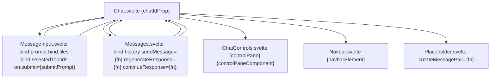
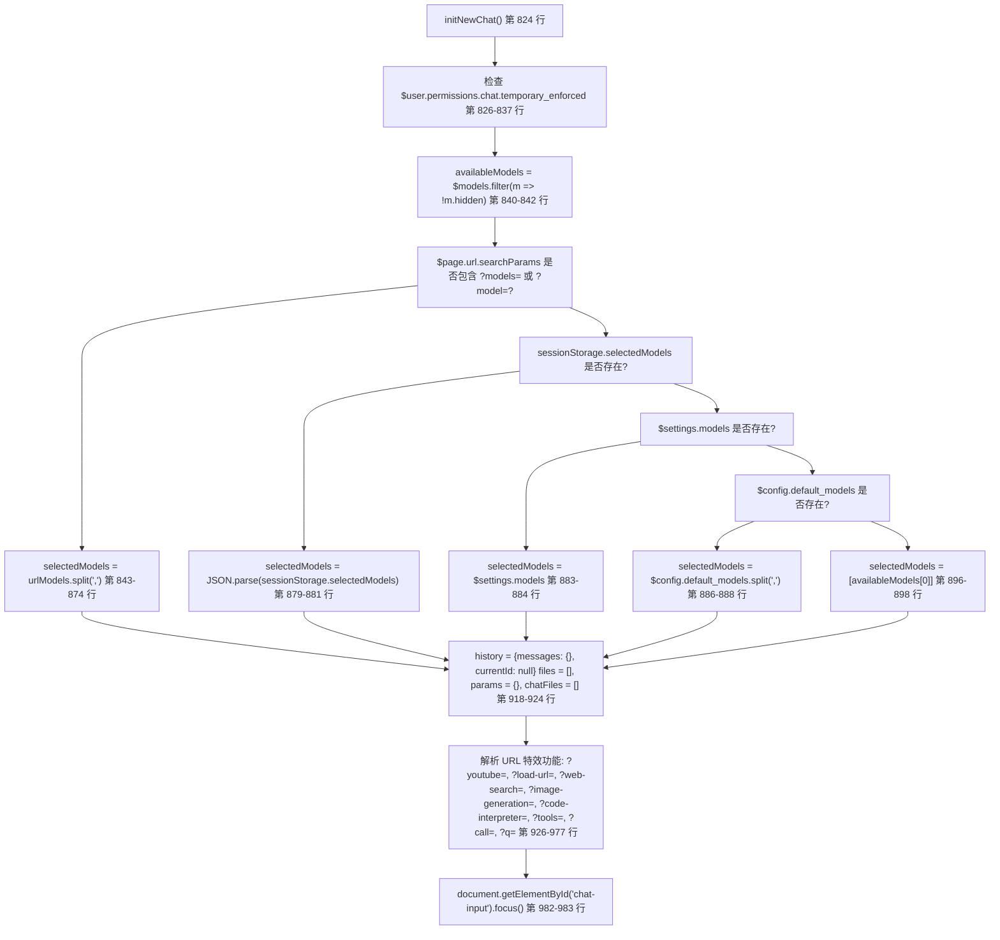
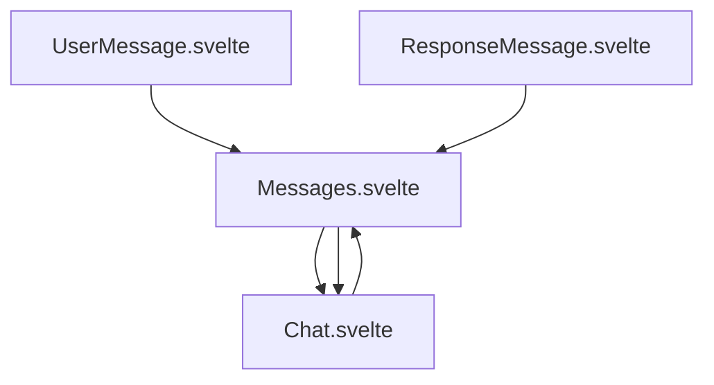
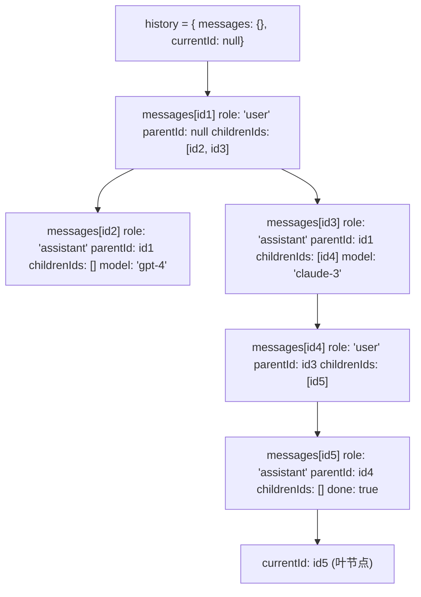
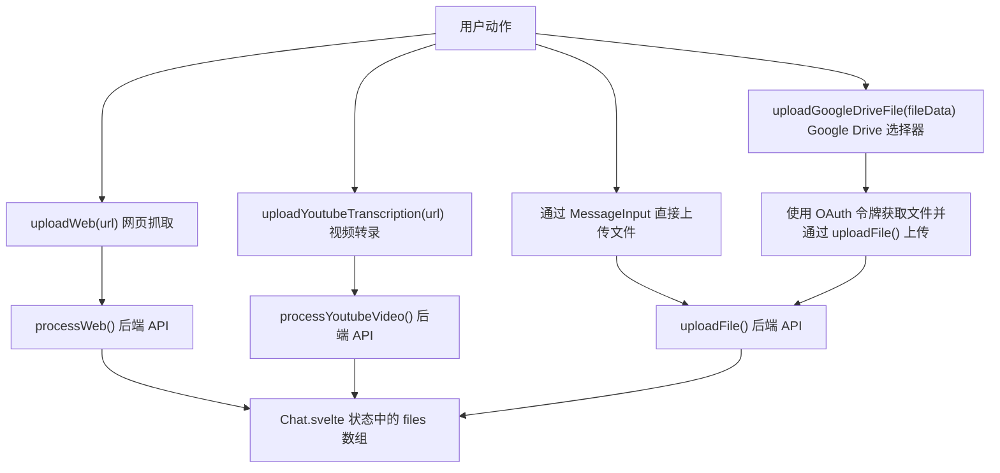

# 聊天组件架构

相关源文件

-   [src/lib/components/channel/MessageInput.svelte](https://github.com/open-webui/open-webui/blob/a7271532/src/lib/components/channel/MessageInput.svelte)
-   [src/lib/components/chat/Chat.svelte](https://github.com/open-webui/open-webui/blob/a7271532/src/lib/components/chat/Chat.svelte)
-   [src/lib/components/chat/ChatPlaceholder.svelte](https://github.com/open-webui/open-webui/blob/a7271532/src/lib/components/chat/ChatPlaceholder.svelte)
-   [src/lib/components/chat/MessageInput.svelte](https://github.com/open-webui/open-webui/blob/a7271532/src/lib/components/chat/MessageInput.svelte)
-   [src/lib/components/chat/Placeholder.svelte](https://github.com/open-webui/open-webui/blob/a7271532/src/lib/components/chat/Placeholder.svelte)
-   [src/lib/components/chat/Suggestions.svelte](https://github.com/open-webui/open-webui/blob/a7271532/src/lib/components/chat/Suggestions.svelte)
-   [src/lib/components/common/FileItem.svelte](https://github.com/open-webui/open-webui/blob/a7271532/src/lib/components/common/FileItem.svelte)
-   [src/lib/components/common/FileItemModal.svelte](https://github.com/open-webui/open-webui/blob/a7271532/src/lib/components/common/FileItemModal.svelte)

## 概述

`Chat.svelte` [src/lib/components/chat/Chat.svelte1-2618](https://github.com/open-webui/open-webui/blob/a7271532/src/lib/components/chat/Chat.svelte#L1-L2618) 编排了 Open WebUI 的整个聊天生命周期。它将消息历史记录管理为有向无环图，协调子组件，处理 Socket.IO 流式事件，并将聊天状态持久化到后端数据库和浏览器 sessionStorage。

### 核心职责

| 职责 | 关键变量/函数 | 行号 |
| --- | --- | --- |
| 状态管理 | `history`, `selectedModels`, `files`, `prompt`, `generating` | [src/lib/components/chat/Chat.svelte141-161](https://github.com/open-webui/open-webui/blob/a7271532/src/lib/components/chat/Chat.svelte#L141-L161) |
| 子组件协调 | `<MessageInput>`, `<Messages>`, `<ChatControls>`, `<Navbar>` | [src/lib/components/chat/Chat.svelte2748-2799](https://github.com/open-webui/open-webui/blob/a7271532/src/lib/components/chat/Chat.svelte#L2748-L2799) |
| 事件处理 | `chatEventHandler()`, `$socket.on('events')` | [src/lib/components/chat/Chat.svelte340-467](https://github.com/open-webui/open-webui/blob/a7271532/src/lib/components/chat/Chat.svelte#L340-L467) |
| 聊天生命周期 | `initNewChat()`, `loadChat()`, `submitPrompt()`, `sendMessage()` | [src/lib/components/chat/Chat.svelte824-2182](https://github.com/open-webui/open-webui/blob/a7271532/src/lib/components/chat/Chat.svelte#L824-L2182) |
| 会话持久化 | `sessionStorage.setItem('chat-input-{id}')`, `sessionStorage.selectedModels` | [src/lib/components/chat/Chat.svelte170-195](https://github.com/open-webui/open-webui/blob/a7271532/src/lib/components/chat/Chat.svelte#L170-L195) |
| URL 路由 | `?models=`, `?q=`, `?submit=`, `?youtube=`, `?load-url=` | [src/lib/components/chat/Chat.svelte843-977](https://github.com/open-webui/open-webui/blob/a7271532/src/lib/components/chat/Chat.svelte#L843-L977) |

**来源：** [src/lib/components/chat/Chat.svelte1-2618](https://github.com/open-webui/open-webui/blob/a7271532/src/lib/components/chat/Chat.svelte#L1-L2618)

---

## 组件层级与数据流

**图表：Chat.svelte 组件组成**


**绑定模式：**

| 组件 | 绑定类型 | 变量 | 用途 |
| --- | --- | --- | --- |
| `MessageInput` | 双向 | `bind:prompt` | 同步用户输入文本 |
| `MessageInput` | 双向 | `bind:files` | 附件文件数组 |
| `MessageInput` | 双向 | `bind:selectedToolIds` | 已启用的工具 |
| `MessageInput` | 事件 | `on:submit` | 触发 `submitPrompt(e.detail)` |
| `Messages` | 双向 | `bind:history` | 消息图谱结构 |
| `Messages` | 回调 | `sendMessage={fn}` | 生成 AI 响应 |
| `Messages` | 回调 | `regenerateResponse={fn}` | 创建消息变体 |
| `Messages` | 引用 | `bind:messagesContainerElement` | 滚动控制 |

**来源：** [src/lib/components/chat/Chat.svelte2688-2815](https://github.com/open-webui/open-webui/blob/a7271532/src/lib/components/chat/Chat.svelte#L2688-L2815)

---

## 初始化与生命周期

## 状态管理

**图表：Chat.svelte 状态变量**

```mermaid
flowchart TD
    autoScroll["autoScroll 第 103 行"]
    showCommands["showCommands 第 133 行"]
    loading["loading 第 94 行"]
    generating["generating 第 135 行 boolean"]
    generationController["generationController 第 136 行 AbortController"]
    taskIds["taskIds 第 146 行 string[] | null"]
    selectedToolIds["selectedToolIds[] 第 127 行"]
    selectedFilterIds["selectedFilterIds[] 第 128 行"]
    imageGenerationEnabled["imageGenerationEnabled 第 129 行"]
    webSearchEnabled["webSearchEnabled 第 130 行"]
    codeInterpreterEnabled["codeInterpreterEnabled 第 131 行"]
    selectedModels["selectedModels[] 第 118 行 string[]"]
    atSelectedModel["atSelectedModel 第 119 行 Model | undefined"]
    selectedModelIds["selectedModelIds[] 第 120-125 行 computed"]
    history["history 第 141-144 行 {messages: {}, currentId: null}"]
    chat["chat 第 138 行 DB 元数据对象"]
    tags["tags[] 第 139 行 聊天标签"]
    prompt["prompt 第 149 行 string"]
    files["files[] 第 150 行 FileItem[]"]
    chatFiles["chatFiles[] 第 151 行 已持久化的文件"]
    params["params 第 152 行 聊天参数"]
    MessageInput["MessageInput.svelte"]
    Messages["Messages.svelte"]

    prompt --> MessageInput
    files --> MessageInput
    history --> Messages
    atSelectedModel --> selectedModelIds
    selectedModels --> selectedModelIds
```


**关键响应式语句：**

```
// 第 121-125 行：计算 selectedModelIds
$: if (atSelectedModel !== undefined) {
  selectedModelIds = [atSelectedModel.id];
} else {
  selectedModelIds = selectedModels;
}

// 第 220-235 行：将模型保存到 sessionStorage
$: if (selectedModels && chatIdProp !== '') {
  saveSessionSelectedModels();
}

// 第 237-244 行：模型更改时重置输入
$: if (JSON.stringify(selectedModelIds) !== JSON.stringify(oldSelectedModelIds)) {
  onSelectedModelIdsChange();
}

// 第 514-516 行：将模型保存到文件夹
$: if (selectedModels !== null) {
  savedModelIds();
}
```
**来源：** [src/lib/components/chat/Chat.svelte94-152](https://github.com/open-webui/open-webui/blob/a7271532/src/lib/components/chat/Chat.svelte#L94-L152) [src/lib/components/chat/Chat.svelte121-125](https://github.com/open-webui/open-webui/blob/a7271532/src/lib/components/chat/Chat.svelte#L121-L125) [src/lib/components/chat/Chat.svelte220-244](https://github.com/open-webui/open-webui/blob/a7271532/src/lib/components/chat/Chat.svelte#L220-L244) [src/lib/components/chat/Chat.svelte514-516](https://github.com/open-webui/open-webui/blob/a7271532/src/lib/components/chat/Chat.svelte#L514-L516)

## 生命周期：初始化与加载

### initNewChat() - 新聊天设置

**图表：initNewChat() 执行流程**


**模型选择优先级 (第 843-901 行)：**

1.  `$page.url.searchParams.get('models')` 或 `get('model')` - 逗号分隔的列表
2.  `sessionStorage.selectedModels` - JSON 解析后的数组
3.  `$settings.models` - 用户偏好
4.  `$config.default_models` - 系统默认值（逗号分隔）
5.  `availableModels[0]` - 第一个可用模型

**来源：** [src/lib/components/chat/Chat.svelte824-993](https://github.com/open-webui/open-webui/blob/a7271532/src/lib/components/chat/Chat.svelte#L824-L993)

### loadChat() - 加载现有聊天

**图表：loadChat() 数据库恢复**

> **[Mermaid sequence]**
> *(图表结构无法解析)*

**来源：** [src/lib/components/chat/Chat.svelte995-1072](https://github.com/open-webui/open-webui/blob/a7271532/src/lib/components/chat/Chat.svelte#L995-L1072)

`initNewChat` 函数 [src/lib/components/chat/Chat.svelte824-993](https://github.com/open-webui/open-webui/blob/a7271532/src/lib/components/chat/Chat.svelte#L824-L993) 处理以下内容：

1.  **临时聊天模式**：如果用户权限要求，则强制进入临时聊天 [src/lib/components/chat/Chat.svelte826-837](https://github.com/open-webui/open-webui/blob/a7271532/src/lib/components/chat/Chat.svelte#L826-L837)
2.  **模型选择优先级**：URL 参数 → 会话存储 → 用户设置 → 配置默认值 [src/lib/components/chat/Chat.svelte843-901](https://github.com/open-webui/open-webui/blob/a7271532/src/lib/components/chat/Chat.svelte#L843-L901)
3.  **URL 参数处理**：处理 `?models=`, `?q=`, `?youtube=`, `?load-url=`, `?web-search=`, `?image-generation=`, `?code-interpreter=`, `?tools=`, `?call=` [src/lib/components/chat/Chat.svelte926-977](https://github.com/open-webui/open-webui/blob/a7271532/src/lib/components/chat/Chat.svelte#L926-L977)
4.  **状态重置**：清除历史记录、文件和参数，开启新聊天 [src/lib/components/chat/Chat.svelte918-924](https://github.com/open-webui/open-webui/blob/a7271532/src/lib/components/chat/Chat.svelte#L918-L924)

### 加载现有聊天：loadChat()

**图表：从数据库加载聊天**

> **[Mermaid sequence]**
> *(图表结构无法解析)*

**实现细节：**

-   **历史记录格式处理** [src/lib/components/chat/Chat.svelte1028-1031](https://github.com/open-webui/open-webui/blob/a7271532/src/lib/components/chat/Chat.svelte#L1028-L1031)：优先检查 `chat.chat.history`，如果不存在则调用 `convertMessagesToHistory(chat.chat.messages)` 处理旧格式。
-   **模型规范化** [src/lib/components/chat/Chat.svelte1017-1023](https://github.com/open-webui/open-webui/blob/a7271532/src/lib/components/chat/Chat.svelte#L1017-L1023)：将单个模型字符串转换为数组，对非管理员用户强制执行单模型限制。
-   **消息完成化** [src/lib/components/chat/Chat.svelte1049-1055](https://github.com/open-webui/open-webui/blob/a7271532/src/lib/components/chat/Chat.svelte#L1049-L1055)：将所有助手消息设置为 `done: true`，以防止重新流式输出。
-   **任务恢复** [src/lib/components/chat/Chat.svelte1057-1063](https://github.com/open-webui/open-webui/blob/a7271532/src/lib/components/chat/Chat.svelte#L1057-L1063)：获取活跃的后台任务 ID，用于标题生成、标签提取等。

**来源：** [src/lib/components/chat/Chat.svelte995-1072](https://github.com/open-webui/open-webui/blob/a7271532/src/lib/components/chat/Chat.svelte#L995-L1072)

`loadChat` 函数：

1.  通过 `getChatById` 获取聊天数据 [src/lib/components/chat/Chat.svelte1002-1005](https://github.com/open-webui/open-webui/blob/a7271532/src/lib/components/chat/Chat.svelte#L1002-L1005)
2.  同时处理现代基于图的历史记录和旧的消息数组 [src/lib/components/chat/Chat.svelte1028-1031](https://github.com/open-webui/open-webui/blob/a7271532/src/lib/components/chat/Chat.svelte#L1028-L1031)
3.  恢复模型选择、文件和参数 [src/lib/components/chat/Chat.svelte1017-1044](https://github.com/open-webui/open-webui/blob/a7271532/src/lib/components/chat/Chat.svelte#L1017-L1044)
4.  将进行中的消息标记为已完成 [src/lib/components/chat/Chat.svelte1049-1055](https://github.com/open-webui/open-webui/blob/a7271532/src/lib/components/chat/Chat.svelte#L1049-L1055)
5.  检索活跃的后台任务 [src/lib/components/chat/Chat.svelte1057-1063](https://github.com/open-webui/open-webui/blob/a7271532/src/lib/components/chat/Chat.svelte#L1057-L1063)

---

## 消息提交流水线

**图表：submitPrompt() → sendMessage() → 后端流式输出**

> **[Mermaid sequence]**
> *(图表结构无法解析)*

**关键函数签名：**

```
// 第 1598-1782 行
const submitPrompt = async (prompt: string, command?: string) => {
  // 1. 验证已选择的模型
  // 2. 处理 {{VARIABLE}} 变量替换
  // 3. 创建消息图谱节点
  // 4. 调用 sendMessage()
}

// 第 1784-2182 行
const sendMessage = async (history: History, messageId: string) => {
  // 1. createMessagesList(history, messageId) - 展平图谱
  // 2. 遍历 selectedModels
  // 3. 为每个模型调用 generateOpenAIChatCompletion()
  // 4. 通过 chatEventHandler 处理流式输出
  // 5. 完成后调用 chatCompletedHandler()
}

// 第 1083-1141 行
const chatCompletedHandler = async (
  chatId: string,
  modelId: string,
  responseMessageId: string,
  messages: Message[]
) => {
  // 1. POST /api/chat/completed
  // 2. 合并后端更新的消息
  // 3. 通过 updateChatById() 持久化到数据库
}
```
**来源：** [src/lib/components/chat/Chat.svelte1598-1782](https://github.com/open-webui/open-webui/blob/a7271532/src/lib/components/chat/Chat.svelte#L1598-L1782) [src/lib/components/chat/Chat.svelte1784-2182](https://github.com/open-webui/open-webui/blob/a7271532/src/lib/components/chat/Chat.svelte#L1784-L2182) [src/lib/components/chat/Chat.svelte1083-1141](https://github.com/open-webui/open-webui/blob/a7271532/src/lib/components/chat/Chat.svelte#L1083-L1141) [src/lib/components/chat/Chat.svelte340-467](https://github.com/open-webui/open-webui/blob/a7271532/src/lib/components/chat/Chat.svelte#L340-L467)

### submitPrompt 函数

`submitPrompt` 函数 [src/lib/components/chat/Chat.svelte1598-1782](https://github.com/open-webui/open-webui/blob/a7271532/src/lib/components/chat/Chat.svelte#L1598-L1782) 负责编排：

1.  **验证**：

    -   检查是否选择了模型 [src/lib/components/chat/Chat.svelte1608-1611](https://github.com/open-webui/open-webui/blob/a7271532/src/lib/components/chat/Chat.svelte#L1608-L1611)
    -   验证消息是否非空 [src/lib/components/chat/Chat.svelte1613-1616](https://github.com/open-webui/open-webui/blob/a7271532/src/lib/components/chat/Chat.svelte#L1613-L1616)
2.  **变量处理**：

    -   通过 `getPromptVariables()` 处理花括号变量，如 `{{USER_NAME}}` [src/lib/components/chat/Chat.svelte1624-1639](https://github.com/open-webui/open-webui/blob/a7271532/src/lib/components/chat/Chat.svelte#L1624-L1639)
    -   处理条件变量替换 [src/lib/components/chat/Chat.svelte1641-1662](https://github.com/open-webui/open-webui/blob/a7271532/src/lib/components/chat/Chat.svelte#L1641-L1662)
3.  **消息创建**：

    -   创建具有唯一 ID 的用户消息 [src/lib/components/chat/Chat.svelte1672-1691](https://github.com/open-webui/open-webui/blob/a7271532/src/lib/components/chat/Chat.svelte#L1672-L1691)
    -   为每个选择的模型创建响应消息占位符 [src/lib/components/chat/Chat.svelte1694-1710](https://github.com/open-webui/open-webui/blob/a7271532/src/lib/components/chat/Chat.svelte#L1694-L1710)
    -   在历史图谱中链接消息 [src/lib/components/chat/Chat.svelte1712-1731](https://github.com/open-webui/open-webui/blob/a7271532/src/lib/components/chat/Chat.svelte#L1712-L1731)
4.  **后端调用**：

    -   调用 `sendMessage(history, userMessageId)` [src/lib/components/chat/Chat.svelte1750](https://github.com/open-webui/open-webui/blob/a7271532/src/lib/components/chat/Chat.svelte#L1750-L1750)
    -   传递完整的消息历史和上下文

**来源：** [src/lib/components/chat/Chat.svelte1598-1782](https://github.com/open-webui/open-webui/blob/a7271532/src/lib/components/chat/Chat.svelte#L1598-L1782)

### sendMessage 函数

> **[Mermaid sequence]**
> *(图表结构无法解析)*

**来源：** [src/lib/components/chat/Chat.svelte1784-2182](https://github.com/open-webui/open-webui/blob/a7271532/src/lib/components/chat/Chat.svelte#L1784-L2182)

`sendMessage` 的关键点：

-   通过 `createMessagesList()` 从图谱创建扁平消息列表 [src/lib/components/chat/Chat.svelte1792](https://github.com/open-webui/open-webui/blob/a7271532/src/lib/components/chat/Chat.svelte#L1792-L1792)
-   遍历所选模型以支持多模型响应 [src/lib/components/chat/Chat.svelte1805-1810](https://github.com/open-webui/open-webui/blob/a7271532/src/lib/components/chat/Chat.svelte#L1805-L1810)
-   在完整上下文中调用 `generateChatCompletion()` [src/lib/components/chat/Chat.svelte1942-1969](https://github.com/open-webui/open-webui/blob/a7271532/src/lib/components/chat/Chat.svelte#L1942-L1969)
-   通过 `createOpenAITextStream()` 处理流式传输 [src/lib/components/chat/Chat.svelte1971-2044](https://github.com/open-webui/open-webui/blob/a7271532/src/lib/components/chat/Chat.svelte#L1971-L2044)
-   在 `chatEventHandler` 中处理各种事件类型 [src/lib/components/chat/Chat.svelte340-467](https://github.com/open-webui/open-webui/blob/a7271532/src/lib/components/chat/Chat.svelte#L340-L467)

---

## Socket.IO 事件处理

**图表：chatEventHandler() 事件路由**

**事件注册 (第 534, 621 行)：**

```
// onMount - 第 534 行
$socket?.on('events', chatEventHandler);

// onDestroy - 第 621 行
$socket?.off('events', chatEventHandler);
```
**来源：** [src/lib/components/chat/Chat.svelte340-467](https://github.com/open-webui/open-webui/blob/a7271532/src/lib/components/chat/Chat.svelte#L340-L467) [src/lib/components/chat/Chat.svelte534](https://github.com/open-webui/open-webui/blob/a7271532/src/lib/components/chat/Chat.svelte#L534-L534) [src/lib/components/chat/Chat.svelte621](https://github.com/open-webui/open-webui/blob/a7271532/src/lib/components/chat/Chat.svelte#L621-L621)

### Socket.IO 生命周期

**图表：Socket.IO 事件监听器生命周期**

> **[Mermaid sequence]**
> *(图表结构无法解析)*

**监听器注册：**

-   **挂载 (Mount)** [src/lib/components/chat/Chat.svelte534](https://github.com/open-webui/open-webui/blob/a7271532/src/lib/components/chat/Chat.svelte#L534-L534)：`$socket?.on('events', chatEventHandler)`
-   **销毁 (Destroy)** [src/lib/components/chat/Chat.svelte621](https://github.com/open-webui/open-webui/blob/a7271532/src/lib/components/chat/Chat.svelte#L621-L621)：`$socket?.off('events', chatEventHandler)`
-   **过滤** [src/lib/components/chat/Chat.svelte343](https://github.com/open-webui/open-webui/blob/a7271532/src/lib/components/chat/Chat.svelte#L343-L343)：`if (event.chat_id === $chatId)` 确保只处理相关事件

**来源：** [src/lib/components/chat/Chat.svelte534](https://github.com/open-webui/open-webui/blob/a7271532/src/lib/components/chat/Chat.svelte#L534-L534) [src/lib/components/chat/Chat.svelte621](https://github.com/open-webui/open-webui/blob/a7271532/src/lib/components/chat/Chat.svelte#L621-L621) [src/lib/components/chat/Chat.svelte343](https://github.com/open-webui/open-webui/blob/a7271532/src/lib/components/chat/Chat.svelte#L343-L343)

---

## 子组件集成

### MessageInput 集成

Chat.svelte 通过 **双向绑定** 和 **事件分发** 与 MessageInput.svelte 协调：

**组件绑定 ([src/lib/components/chat/Chat.svelte2748-2778](https://github.com/open-webui/open-webui/blob/a7271532/src/lib/components/chat/Chat.svelte#L2748-L2778))：**

```
<MessageInput
  bind:this={messageInput}
  bind:prompt
  bind:files
  bind:selectedToolIds
  bind:selectedFilterIds
  bind:imageGenerationEnabled
  bind:webSearchEnabled
  bind:codeInterpreterEnabled
  {history}
  {selectedModels}
  {atSelectedModel}
  {autoScroll}
  {generating}
  {taskIds}
  onChange={handleInputChange}
  {createMessagePair}
  {stopResponse}
  on:submit={async (e) => { await submitPrompt(e.detail ?? prompt); }}
  on:upload={handleUploadEvent}
/>
```
**绑定语义：**

-   **`bind:this={messageInput}`**：存储组件实例引用以便进行编程式访问。
-   **`bind:prompt`**：双向绑定 - 用户输入时更新，也可从 Chat.svelte 写入。
-   **`bind:files`**：附件文件数组，由两个组件共同修改。
-   **`bind:selectedToolIds`** 等：由双方修改的功能开关。

**编程式控制方法：**

-   `messageInput?.setText(text, callback?)` [src/lib/components/chat/MessageInput.svelte294-312](https://github.com/open-webui/open-webui/blob/a7271532/src/lib/components/chat/MessageInput.svelte#L294-L312) - 设置输入文本并提供可选的完成回调。
-   `messageInput?.focus()` - 聚焦输入元素。
-   `messageInput?.getWordAtDocPos()` - 获取光标所在位置的单词，用于命令补全。

**事件流：**

> **[Mermaid sequence]**
> *(图表结构无法解析)*

**来源：** [src/lib/components/chat/Chat.svelte2748-2778](https://github.com/open-webui/open-webui/blob/a7271532/src/lib/components/chat/Chat.svelte#L2748-L2778) [src/lib/components/chat/MessageInput.svelte86-142](https://github.com/open-webui/open-webui/blob/a7271532/src/lib/components/chat/MessageInput.svelte#L86-L142) [src/lib/components/chat/MessageInput.svelte294-312](https://github.com/open-webui/open-webui/blob/a7271532/src/lib/components/chat/MessageInput.svelte#L294-L312)

### Messages 组件协调

Chat.svelte 将 **回调函数** 作为 props 传递给 Messages.svelte 以进行向上通信：

**组件绑定 ([src/lib/components/chat/Chat.svelte2780-2799](https://github.com/open-webui/open-webui/blob/a7271532/src/lib/components/chat/Chat.svelte#L2780-L2799))：**

```
<Messages
  {className}
  {chatId}
  {user}
  bind:history
  bind:prompt
  {selectedModels}
  {atSelectedModel}
  {autoScroll}
  {setInputText}
  {sendMessage}
  {continueResponse}
  {regenerateResponse}
  {mergeResponses}
  {chatActionHandler}
  {showMessage}
  {submitMessage}
  {addMessages}
  {readOnly}
  {editCodeBlock}
  {topPadding}
  {bottomPadding}
  {onSelect}
  bind:messagesContainerElement
/>
```
**回调引用表：**

| 回调 | 签名 | 用途 | 实现 |
| --- | --- | --- | --- |
| `sendMessage` | `(history, userMessageId) => Promise<void>` | 生成新的 AI 响应 | [src/lib/components/chat/Chat.svelte1784-2182](https://github.com/open-webui/open-webui/blob/a7271532/src/lib/components/chat/Chat.svelte#L1784-L2182) |
| `continueResponse` | `(messageId) => Promise<void>` | 从光标位置继续未完成的响应 | [src/lib/components/chat/Chat.svelte2184-2283](https://github.com/open-webui/open-webui/blob/a7271532/src/lib/components/chat/Chat.svelte#L2184-L2283) |
| `regenerateResponse` | `(message, prompt?) => Promise<void>` | 创建现有消息的新变体 | [src/lib/components/chat/Chat.svelte2285-2404](https://github.com/open-webui/open-webui/blob/a7271532/src/lib/components/chat/Chat.svelte#L2285-L2404) |
| `mergeResponses` | `(messageId, responses[], chatId) => Promise<void>` | 通过 MoA 合并多模型输出 | [src/lib/components/chat/Chat.svelte2406-2505](https://github.com/open-webui/open-webui/blob/a7271532/src/lib/components/chat/Chat.svelte#L2406-L2505) |
| `chatActionHandler` | `(chatId, actionId, modelId, responseMessageId, event?) => Promise<void>` | 执行自定义模型动作 | [src/lib/components/chat/Chat.svelte1143-1194](https://github.com/open-webui/open-webui/blob/a7271532/src/lib/components/chat/Chat.svelte#L1143-L1194) |
| `showMessage` | `(message, ignoreSettings?) => Promise<void>` | 导航至图谱中的特定消息 | [src/lib/components/chat/Chat.svelte303-338](https://github.com/open-webui/open-webui/blob/a7271532/src/lib/components/chat/Chat.svelte#L303-L338) |
| `submitMessage` | `(userMessage, command?) => Promise<void>` | 编程式提交消息 | `submitPrompt()` 的包装器 |
| `addMessages` | `({modelId, parentId, messages}) => Promise<void>` | 在历史图谱中插入消息 | [src/lib/components/chat/Chat.svelte1266-1327](https://github.com/open-webui/open-webui/blob/a7271532/src/lib/components/chat/Chat.svelte#L1266-L1327) |
| `setInputText` | `(text) => void` | 编程式更新 MessageInput | 设置 `prompt` 并调用 `messageInput?.setText()` |

**数据流模式：**


**使用回调而非事件的原因：**

-   **类型安全**：作为 props 传递的函数具有明确的签名。
-   **异步处理**：可以等待 (await) 回调以进行错误处理。
-   **直接调用**：无需编写事件分发的样板代码。
-   **Prop 钻取**：回调通过 Message.svelte → UserMessage/ResponseMessage 进行传播。

**来源：** [src/lib/components/chat/Chat.svelte2780-2799](https://github.com/open-webui/open-webui/blob/a7271532/src/lib/components/chat/Chat.svelte#L2780-L2799) [src/lib/components/chat/Messages.svelte39-52](https://github.com/open-webui/open-webui/blob/a7271532/src/lib/components/chat/Messages.svelte#L39-L52)

### 历史图谱结构

`history` 对象 [src/lib/components/chat/Chat.svelte141-144](https://github.com/open-webui/open-webui/blob/a7271532/src/lib/components/chat/Chat.svelte#L141-L144) 实现了一个 **有向无环图 (DAG)**，支持消息分支和变体跟踪。

**图表：消息历史图谱结构**


**消息对象 Schema：**

```
history.messages[messageId] = {
  id: string,                   // UUID
  parentId: string | null,      // 父消息 ID（根消息为 null）
  childrenIds: string[],        // 子消息 ID 数组
  role: 'user' | 'assistant',
  content: string,              // 消息文本/Markdown
  timestamp: number,            // Unix 时间戳（秒）

  // 助手专用字段
  model?: string,               // 模型 ID（例如 'gpt-4'）
  modelIdx?: number,            // 多模型数组中的索引
  modelName?: string,           // 显示名称
  done?: boolean,               // 完成状态

  // 附件与上下文
  files?: FileItem[],           // 上传的文件
  sources?: Source[],           // RAG 引用
  code_executions?: Execution[], // 代码执行结果
  embeds?: string[],            // 嵌入的 iframe URL
  followUps?: string[],         // 建议的后续问题

  // 元数据
  annotation?: {                // 用户反馈
    rating: number,
    comment?: string,
    tags?: string[]
  },
  statusHistory?: Status[],     // 进度更新
  error?: {content: string} | boolean,
  usage?: {                     // Token 使用量
    prompt_tokens: number,
    completion_tokens: number
  }
}
```
**图谱操作：**

-   **createMessagesList(history, messageId)** [src/lib/utils/index.ts818-851](https://github.com/open-webui/open-webui/blob/a7271532/src/lib/utils/index.ts#L818-L851)：通过 `parentId` 从根节点遍历到 `messageId`，返回扁平数组。
-   **showPreviousMessage(message)** [src/lib/components/chat/Messages.svelte157-202](https://github.com/open-webui/open-webui/blob/a7271532/src/lib/components/chat/Messages.svelte#L157-L202)：在 `childrenIds` 中导航到前一个兄弟节点。
-   **showNextMessage(message)** [src/lib/components/chat/Messages.svelte204-253](https://github.com/open-webui/open-webui/blob/a7271532/src/lib/components/chat/Messages.svelte#L204-L253)：导航到下一个兄弟节点。
-   **showMessage(message)** [src/lib/components/chat/Chat.svelte303-338](https://github.com/open-webui/open-webui/blob/a7271532/src/lib/components/chat/Chat.svelte#L303-L338)：遍历到最深的叶节点，设置 `history.currentId`。

**来源：** [src/lib/components/chat/Chat.svelte141-144](https://github.com/open-webui/open-webui/blob/a7271532/src/lib/components/chat/Chat.svelte#L141-L144) [src/lib/utils/index.ts818-851](https://github.com/open-webui/open-webui/blob/a7271532/src/lib/utils/index.ts#L818-L851) [src/lib/components/chat/Chat.svelte303-338](https://github.com/open-webui/open-webui/blob/a7271532/src/lib/components/chat/Chat.svelte#L303-L338)

---

## 文件上传编排

### 多源上传支持

`Chat.svelte` 处理来自多个来源的文件上传：


**来源：** [src/lib/components/chat/Chat.svelte754-818](https://github.com/open-webui/open-webui/blob/a7271532/src/lib/components/chat/Chat.svelte#L754-L818) [src/lib/components/chat/Chat.svelte787-818](https://github.com/open-webui/open-webui/blob/a7271532/src/lib/components/chat/Chat.svelte#L787-L818) [src/lib/components/chat/Chat.svelte629-752](https://github.com/open-webui/open-webui/blob/a7271532/src/lib/components/chat/Chat.svelte#L629-L752)

### 上传函数

**uploadWeb** [src/lib/components/chat/Chat.svelte754-785](https://github.com/open-webui/open-webui/blob/a7271532/src/lib/components/chat/Chat.svelte#L754-L785)：

-   创建 `type: 'text'` 的文件项。
-   调用 `processWeb(token, '', url)` 后端 API。
-   成功后使用 collection\_name 更新文件项。

**uploadYoutubeTranscription** [src/lib/components/chat/Chat.svelte787-818](https://github.com/open-webui/open-webui/blob/a7271532/src/lib/components/chat/Chat.svelte#L787-L818)：

-   类似于 uploadWeb，但针对 YouTube URL。
-   调用 `processYoutubeVideo(token, url)`。
-   设置 `context: 'full'` 以包含整个转录文本。

**uploadGoogleDriveFile** [src/lib/components/chat/Chat.svelte629-752](https://github.com/open-webui/open-webui/blob/a7271532/src/lib/components/chat/Chat.svelte#L629-L752)：

-   使用 OAuth Authorization 请求头从 Google Drive URL 获取文件。
-   将响应转换为 Blob，然后转换为 File 对象。
-   调用 `uploadFile(token, file, metadata)` 在服务器端进行处理。
-   处理包含 STT 语言元数据的音频/视频文件 [src/lib/components/chat/Chat.svelte713-721](https://github.com/open-webui/open-webui/blob/a7271532/src/lib/components/chat/Chat.svelte#L713-L721)。

### 文件状态管理

`Chat.svelte` 中的文件使用如下结构：

```
files = [
  {
    type: 'file' | 'text' | 'image',
    file: object,           // 后端文件响应
    id: string | null,      // 后端文件 ID
    url: string,            // 文件 URL
    name: string,           // 显示名称
    collection_name: string,// RAG 集合 ID
    status: 'uploading' | 'uploaded',
    error: string,
    itemId: string,         // 临时客户端 ID
    size: number,
    context?: 'full'        // 转录文本的全上下文标志
  }
]
```
**来源：** [src/lib/components/chat/Chat.svelte645-656](https://github.com/open-webui/open-webui/blob/a7271532/src/lib/components/chat/Chat.svelte#L645-L656)

---

## URL 参数与深层链接 (Deep Linking)

`Chat.svelte` 处理大量的 URL 参数以支持深层链接：

| 参数 | 用途 | 处理方式 |
| --- | --- | --- |
| `?models=` 或 `?model=` | 预选择模型 | 解析逗号分隔列表，并对照可用模型进行验证 [src/lib/components/chat/Chat.svelte843-874](https://github.com/open-webui/open-webui/blob/a7271532/src/lib/components/chat/Chat.svelte#L843-L874) |
| `?q=` | 预填输入文本 | 通过 `messageInput?.setText()` 设置 [src/lib/components/chat/Chat.svelte967-977](https://github.com/open-webui/open-webui/blob/a7271532/src/lib/components/chat/Chat.svelte#L967-L977) |
| `?submit=true` | 自动提交查询 | 设置文本后调用 `submitPrompt(q)` [src/lib/components/chat/Chat.svelte972-975](https://github.com/open-webui/open-webui/blob/a7271532/src/lib/components/chat/Chat.svelte#L972-L975) |
| `?youtube=` | 加载 YouTube 视频 | 调用 `uploadYoutubeTranscription()` [src/lib/components/chat/Chat.svelte926-929](https://github.com/open-webui/open-webui/blob/a7271532/src/lib/components/chat/Chat.svelte#L926-L929) |
| `?load-url=` | 抓取网页 | 调用 `uploadWeb()` [src/lib/components/chat/Chat.svelte932-934](https://github.com/open-webui/open-webui/blob/a7271532/src/lib/components/chat/Chat.svelte#L932-L934) |
| `?web-search=true` | 启用联网搜索 | 设置 `webSearchEnabled = true` [src/lib/components/chat/Chat.svelte936-938](https://github.com/open-webui/open-webui/blob/a7271532/src/lib/components/chat/Chat.svelte#L936-L938) |
| `?image-generation=true` | 启用图像生成 | 设置 `imageGenerationEnabled = true` [src/lib/components/chat/Chat.svelte940-942](https://github.com/open-webui/open-webui/blob/a7271532/src/lib/components/chat/Chat.svelte#L940-L942) |
| `?code-interpreter=true` | 启用代码执行 | 设置 `codeInterpreterEnabled = true` [src/lib/components/chat/Chat.svelte944-946](https://github.com/open-webui/open-webui/blob/a7271532/src/lib/components/chat/Chat.svelte#L944-L946) |
| `?tools=` 或 `?tool-ids=` | 预选择工具 | 解析逗号分隔的工具 ID [src/lib/components/chat/Chat.svelte948-960](https://github.com/open-webui/open-webui/blob/a7271532/src/lib/components/chat/Chat.svelte#L948-L960) |
| `?call=true` | 开启通话模式 | 显示通话叠加层和控制按钮 [src/lib/components/chat/Chat.svelte962-965](https://github.com/open-webui/open-webui/blob/a7271532/src/lib/components/chat/Chat.svelte#L962-L965) |

**来源：** [src/lib/components/chat/Chat.svelte824-993](https://github.com/open-webui/open-webui/blob/a7271532/src/lib/components/chat/Chat.svelte#L824-L993)

---

## 函数参考

### 生命周期函数

| 函数 | 行号 | 用途 | 关键步骤 |
| --- | --- | --- | --- |
| `initNewChat()` | [src/lib/components/chat/Chat.svelte824-993](https://github.com/open-webui/open-webui/blob/a7271532/src/lib/components/chat/Chat.svelte#L824-L993) | 初始化新聊天会话 | 1. 检查临时聊天权限<br>2. 选择模型 (URL → session → settings → config)<br>3. 重置 `history`, `files`, `params`<br>4. 处理 URL 特性 (?youtube, ?load-url, ?q)<br>5. 聚焦输入框 |
| `loadChat()` | [src/lib/components/chat/Chat.svelte995-1072](https://github.com/open-webui/open-webui/blob/a7271532/src/lib/components/chat/Chat.svelte#L995-L1072) | 从数据库加载聊天 | 1. 调用 `getChatById(token, chatId)`<br>2. 解析模型数组<br>3. 恢复 `history` 或转换旧版 `messages`<br>4. 设置 `chatTitle`, `params`, `chatFiles`<br>5. 通过 `getTaskIdsByChatId()` 获取 `taskIds` |
| `navigateHandler()` | [src/lib/components/chat/Chat.svelte158-202](https://github.com/open-webui/open-webui/blob/a7271532/src/lib/components/chat/Chat.svelte#L158-L202) | 处理路由变更 | 1. 设置 `loading = true`<br>2. 如果有 `chatIdProp` 则调用 `loadChat()`<br>3. 从 sessionStorage 恢复会话输入内容<br>4. 若加载失败则 `goto('/')` |

### 消息流水线函数

| 函数 | 行号 | 用途 | 关键步骤 |
| --- | --- | --- | --- |
| `submitPrompt(prompt, command?)` | [src/lib/components/chat/Chat.svelte1598-1782](https://github.com/open-webui/open-webui/blob/a7271532/src/lib/components/chat/Chat.svelte#L1598-L1782) | 提交用户消息 | 1. 验证 `selectedModels.length > 0`<br>2. 调用 `getPromptVariables()` 进行 {{VAR}} 替换<br>3. 创建 `userMessage` 和 `responseMessage` 节点<br>4. 在 `history.messages` 图谱中建立链接<br>5. 调用 `sendMessage(history, userMessageId)` |
| `sendMessage(history, messageId)` | [src/lib/components/chat/Chat.svelte1784-2182](https://github.com/open-webui/open-webui/blob/a7271532/src/lib/components/chat/Chat.svelte#L1784-L2182) | 生成 AI 响应 | 1. 调用 `createMessagesList(history, messageId)`<br>2. 遍历 `selectedModels`<br>3. 为每个模型调用 `generateOpenAIChatCompletion()`<br>4. 通过 `chatEventHandler` 处理流式传输<br>5. 完成后调用 `chatCompletedHandler()` |
| `chatCompletedHandler(chatId, modelId, responseMessageId, messages)` | [src/lib/components/chat/Chat.svelte1083-1141](https://github.com/open-webui/open-webui/blob/a7271532/src/lib/components/chat/Chat.svelte#L1083-L1141) | 生成后的处理 | 1. POST `/api/chat/completed`<br>2. 将后端更新的消息合并到 `history`<br>3. 调用 `updateChatById()` 进行持久化<br>4. 通过 `getChatList()` 刷新侧边栏聊天列表 |

### 消息操作系统函数

| 函数 | 行号 | 用途 |
| --- | --- | --- |
| `createMessagePair(userPrompt)` | [src/lib/components/chat/Chat.svelte1206-1264](https://github.com/open-webui/open-webui/blob/a7271532/src/lib/components/chat/Chat.svelte#L1206-L1264) | 创建带有占位符内容的用户 + 助手消息对。 |
| `addMessages({modelId, parentId, messages})` | [src/lib/components/chat/Chat.svelte1266-1327](https://github.com/open-webui/open-webui/blob/a7271532/src/lib/components/chat/Chat.svelte#L1266-L1327) | 在历史图谱的 `parentId` 处编程式插入消息。 |
| `showMessage(message, ignoreSettings?)` | [src/lib/components/chat/Chat.svelte303-338](https://github.com/open-webui/open-webui/blob/a7271532/src/lib/components/chat/Chat.svelte#L303-L338) | 导航至消息：遍历到叶节点，设置 `history.currentId`，并滚动。 |
| `continueResponse(messageId)` | [src/lib/components/chat/Chat.svelte2184-2283](https://github.com/open-webui/open-webui/blob/a7271532/src/lib/components/chat/Chat.svelte#L2184-L2283) | 继续部分响应：追加到现有的 `message.content`。 |
| `regenerateResponse(message, prompt?)` | [src/lib/components/chat/Chat.svelte2285-2404](https://github.com/open-webui/open-webui/blob/a7271532/src/lib/components/chat/Chat.svelte#L2285-L2404) | 创建新变体：生成新消息 ID，添加到父节点的 `childrenIds`。 |
| `mergeResponses(messageId, responses, chatId)` | [src/lib/components/chat/Chat.svelte2406-2505](https://github.com/open-webui/open-webui/blob/a7271532/src/lib/components/chat/Chat.svelte#L2406-L2505) | 通过 `generateMoACompletion()` 合并多模型响应。 |

### 事件处理函数

| 函数 | 行号 | 用途 |
| --- | --- | --- |
| `chatEventHandler(event, cb?)` | [src/lib/components/chat/Chat.svelte340-467](https://github.com/open-webui/open-webui/blob/a7271532/src/lib/components/chat/Chat.svelte#L340-L467) | 处理 Socket.IO 事件：根据 `event.data.type` 进行分发。 |
| `chatCompletionEventHandler(data, message, chatId)` | [src/lib/components/chat/Chat.svelte1329-1396](https://github.com/open-webui/open-webui/blob/a7271532/src/lib/components/chat/Chat.svelte#L1329-L1396) | 处理 `'chat:completion'` 事件：完成响应，设置 `done=true`。 |
| `chatActionHandler(chatId, actionId, modelId, responseMessageId, event?)` | [src/lib/components/chat/Chat.svelte1143-1194](https://github.com/open-webui/open-webui/blob/a7271532/src/lib/components/chat/Chat.svelte#L1143-L1194) | 执行聊天动作：POST `/api/chat/actions/{actionId}`。 |

### 文件上传函数

| 函数 | 行号 | 用途 |
| --- | --- | --- |
| `uploadGoogleDriveFile(fileData)` | [src/lib/components/chat/Chat.svelte629-752](https://github.com/open-webui/open-webui/blob/a7271532/src/lib/components/chat/Chat.svelte#L629-L752) | 使用 OAuth 从 Google Drive URL 获取并上传。 |
| `uploadWeb(urls)` | [src/lib/components/chat/Chat.svelte754-785](https://github.com/open-webui/open-webui/blob/a7271532/src/lib/components/chat/Chat.svelte#L754-L785) | 通过 `processWeb()` API 抓取网页。 |
| `uploadYoutubeTranscription(url)` | [src/lib/components/chat/Chat.svelte787-818](https://github.com/open-webui/open-webui/blob/a7271532/src/lib/components/chat/Chat.svelte#L787-L818) | 通过 `processYoutubeVideo()` API 提取 YouTube 转录。 |

### 控制函数

| 函数 | 行号 | 用途 |
| --- | --- | --- |
| `stopResponse(messageId?)` | [src/lib/components/chat/Chat.svelte2562-2618](https://github.com/open-webui/open-webui/blob/a7271532/src/lib/components/chat/Chat.svelte#L2562-L2618) | 取消生成：中止 `generationController`，并调用 `stopTask()`。 |
| `setDefaults()` | [src/lib/components/chat/Chat.svelte257-301](https://github.com/open-webui/open-webui/blob/a7271532/src/lib/components/chat/Chat.svelte#L257-L301) | 从 `model.info.meta.toolIds` 初始化工具/过滤器。 |
| `resetInput()` | [src/lib/components/chat/Chat.svelte247-255](https://github.com/open-webui/open-webui/blob/a7271532/src/lib/components/chat/Chat.svelte#L247-L255) | 清除所有输入状态：工具、过滤器、功能标志。 |
| `scrollToBottom(behavior?)` | [src/lib/components/chat/Chat.svelte1074-1082](https://github.com/open-webui/open-webui/blob/a7271532/src/lib/components/chat/Chat.svelte#L1074-L1082) | 将 `messagesContainerElement` 滚动到底部。 |
| `saveChatHandler(chatId, history)` | [src/lib/components/chat/Chat.svelte2507-2560](https://github.com/open-webui/open-webui/blob/a7271532/src/lib/components/chat/Chat.svelte#L2507-L2560) | 保存聊天：调用 `createNewChat()` 或 `updateChatById()`。 |

**来源：** [src/lib/components/chat/Chat.svelte1-2618](https://github.com/open-webui/open-webui/blob/a7271532/src/lib/components/chat/Chat.svelte#L1-L2618)

---

## 会话存储与状态持久化

### 聊天输入持久化

`Chat.svelte` 通过 sessionStorage 保存和恢复输入状态：

```
// 输入更改时保存
sessionStorage.setItem(
  `chat-input${chatIdProp ? `-${chatIdProp}` : ''}`,
  JSON.stringify({
    prompt,
    files,
    selectedToolIds,
    selectedFilterIds,
    webSearchEnabled,
    imageGenerationEnabled,
    codeInterpreterEnabled
  })
);

// 在挂载/导航时恢复
const storageChatInput = sessionStorage.getItem(`chat-input${chatIdProp ? `-${chatIdProp}` : ''}`);
if (storageChatInput) {
  const input = JSON.parse(storageChatInput);
  messageInput?.setText(input.prompt);
  files = input.files;
  selectedToolIds = input.selectedToolIds;
  // ... 恢复其他字段
}
```
**来源：** [src/lib/components/chat/Chat.svelte170-195](https://github.com/open-webui/open-webui/blob/a7271532/src/lib/components/chat/Chat.svelte#L170-L195) [src/lib/components/chat/Chat.svelte543-576](https://github.com/open-webui/open-webui/blob/a7271532/src/lib/components/chat/Chat.svelte#L543-L576)

### 已选模型持久化

所选模型通过 sessionStorage 跨导航持久化：

```
// 模型更改时保存
$: if (selectedModels && chatIdProp !== '') {
  sessionStorage.selectedModels = JSON.stringify(selectedModels);
}

// 在 initNewChat 中恢复
if (sessionStorage.selectedModels) {
  selectedModels = JSON.parse(sessionStorage.selectedModels);
  sessionStorage.removeItem('selectedModels');
}
```
**来源：** [src/lib/components/chat/Chat.svelte222-233](https://github.com/open-webui/open-webui/blob/a7271532/src/lib/components/chat/Chat.svelte#L222-L233) [src/lib/components/chat/Chat.svelte879-881](https://github.com/open-webui/open-webui/blob/a7271532/src/lib/components/chat/Chat.svelte#L879-L881)

---

## 响应式状态订阅

`Chat.svelte` 订阅了多个 store 的变化：

### 页面路由订阅

```
pageSubscribe = page.subscribe(async (p) => {
  if (p.url.pathname === '/') {
    await tick();
    initNewChat();
  }
});
```
导航到根路径时自动初始化新聊天。

**来源：** [src/lib/components/chat/Chat.svelte536-541](https://github.com/open-webui/open-webui/blob/a7271532/src/lib/components/chat/Chat.svelte#L536-L541)

### 控制面板订阅

```
showControlsSubscribe = showControls.subscribe(async (value) => {
  if (controlPane && !$mobile) {
    if (value) {
      controlPaneComponent.openPane();
    } else {
      controlPane.collapse();
    }
  }

  if (!value) {
    showCallOverlay.set(false);
    showOverview.set(false);
    showArtifacts.set(false);
    showEmbeds.set(false);
  }
});
```
管理侧边面板 (ChatControls) 的可见性并重置叠加层状态。

**来源：** [src/lib/components/chat/Chat.svelte578-597](https://github.com/open-webui/open-webui/blob/a7271532/src/lib/components/chat/Chat.svelte#L578-L597)

### 所选文件夹订阅

```
selectedFolderSubscribe = selectedFolder.subscribe(async (folder) => {
  if (folder?.data?.model_ids &&
      JSON.stringify(selectedModels) !== JSON.stringify(folder.data.model_ids)) {
    selectedModels = folder.data.model_ids;
  }
});
```
自动选择与当前文件夹关联的模型。

**来源：** [src/lib/components/chat/Chat.svelte599-608](https://github.com/open-webui/open-webui/blob/a7271532/src/lib/components/chat/Chat.svelte#L599-L608)

---

## 组件生命周期

### onMount Hook

`onMount` 生命周期 [src/lib/components/chat/Chat.svelte530-612](https://github.com/open-webui/open-webui/blob/a7271532/src/lib/components/chat/Chat.svelte#L530-L612) 执行以下操作：

1.  **事件监听器注册**：

    -   针对 iframe postMessage API 的 `window.addEventListener('message', onMessageHandler)` [src/lib/components/chat/Chat.svelte533](https://github.com/open-webui/open-webui/blob/a7271532/src/lib/components/chat/Chat.svelte#L533-L533)。
    -   针对 Socket.IO 事件的 `$socket?.on('events', chatEventHandler)` [src/lib/components/chat/Chat.svelte534](https://github.com/open-webui/open-webui/blob/a7271532/src/lib/components/chat/Chat.svelte#L534-L534)。
2.  **Store 订阅**：

    -   页面路由变更 [src/lib/components/chat/Chat.svelte536-541](https://github.com/open-webui/open-webui/blob/a7271532/src/lib/components/chat/Chat.svelte#L536-L541)。
    -   控制面板可见性 [src/lib/components/chat/Chat.svelte578-597](https://github.com/open-webui/open-webui/blob/a7271532/src/lib/components/chat/Chat.svelte#L578-L597)。
    -   所选文件夹变更 [src/lib/components/chat/Chat.svelte599-608](https://github.com/open-webui/open-webui/blob/a7271532/src/lib/components/chat/Chat.svelte#L599-L608)。
3.  **状态恢复**：

    -   从 sessionStorage 恢复聊天输入 [src/lib/components/chat/Chat.svelte543-576](https://github.com/open-webui/open-webui/blob/a7271532/src/lib/components/chat/Chat.svelte#L543-L576)。
    -   若非临时聊天模式，则应用到 MessageInput 组件。
4.  **聚焦管理**：

    -   聚焦聊天输入框元素 [src/lib/components/chat/Chat.svelte610-611](https://github.com/open-webui/open-webui/blob/a7271532/src/lib/components/chat/Chat.svelte#L610-L611)。

### onDestroy Hook

`onDestroy` 生命周期 [src/lib/components/chat/Chat.svelte614-625](https://github.com/open-webui/open-webui/blob/a7271532/src/lib/components/chat/Chat.svelte#L614-L625) 负责清理：

-   取消订阅所有 store [src/lib/components/chat/Chat.svelte616-619](https://github.com/open-webui/open-webui/blob/a7271532/src/lib/components/chat/Chat.svelte#L616-L619)。
-   移除 window 消息事件监听器 [src/lib/components/chat/Chat.svelte620](https://github.com/open-webui/open-webui/blob/a7271532/src/lib/components/chat/Chat.svelte#L620-L620)。
-   移除 Socket.IO 事件监听器 [src/lib/components/chat/Chat.svelte621](https://github.com/open-webui/open-webui/blob/a7271532/src/lib/components/chat/Chat.svelte#L621-L621)。

**来源：** [src/lib/components/chat/Chat.svelte530-625](https://github.com/open-webui/open-webui/blob/a7271532/src/lib/components/chat/Chat.svelte#L530-L625)

---

## 与后端 API 的集成

### 主要 API 调用

`Chat.svelte` 直接调用以下后端 API：

| API 函数 | 模块 | 用途 |
| --- | --- | --- |
| `getChatById(token, chatId)` | [src/lib/apis/chats](https://github.com/open-webui/open-webui/blob/a7271532/src/lib/apis/chats) | 获取聊天数据 [src/lib/components/chat/Chat.svelte1002](https://github.com/open-webui/open-webui/blob/a7271532/src/lib/components/chat/Chat.svelte#L1002-L1002) |
| `updateChatById(token, chatId, data)` | [src/lib/apis/chats](https://github.com/open-webui/open-webui/blob/a7271532/src/lib/apis/chats) | 保存聊天变更 [src/lib/components/chat/Chat.svelte1127](https://github.com/open-webui/open-webui/blob/a7271532/src/lib/components/chat/Chat.svelte#L1127-L1127) |
| `createNewChat(token, data)` | [src/lib/apis/chats](https://github.com/open-webui/open-webui/blob/a7271532/src/lib/apis/chats) | 创建新聊天条目 [src/lib/components/chat/Chat.svelte2526](https://github.com/open-webui/open-webui/blob/a7271532/src/lib/components/chat/Chat.svelte#L2526-L2526) |
| `getChatList(token, page)` | [src/lib/apis/chats](https://github.com/open-webui/open-webui/blob/a7271532/src/lib/apis/chats) | 刷新侧边栏聊天列表 [src/lib/components/chat/Chat.svelte1136](https://github.com/open-webui/open-webui/blob/a7271532/src/lib/components/chat/Chat.svelte#L1136-L1136) |
| `getTagsById(token, chatId)` | [src/lib/apis/chats](https://github.com/open-webui/open-webui/blob/a7271532/src/lib/apis/chats) | 获取聊天标签 [src/lib/components/chat/Chat.svelte1008](https://github.com/open-webui/open-webui/blob/a7271532/src/lib/components/chat/Chat.svelte#L1008-L1008) |
| `generateOpenAIChatCompletion(...)` | [src/lib/apis/openai](https://github.com/open-webui/open-webui/blob/a7271532/src/lib/apis/openai) | 生成 AI 响应 [src/lib/components/chat/Chat.svelte1942](https://github.com/open-webui/open-webui/blob/a7271532/src/lib/components/chat/Chat.svelte#L1942-L1942) |
| `generateMoACompletion(...)` | [src/lib/apis](https://github.com/open-webui/open-webui/blob/a7271532/src/lib/apis) | 合并多个响应 [src/lib/components/chat/Chat.svelte2459](https://github.com/open-webui/open-webui/blob/a7271532/src/lib/components/chat/Chat.svelte#L2459-L2459) |
| `chatCompleted(token, data)` | [src/lib/apis](https://github.com/open-webui/open-webui/blob/a7271532/src/lib/apis) | 完成后的处理 [src/lib/components/chat/Chat.svelte1084](https://github.com/open-webui/open-webui/blob/a7271532/src/lib/components/chat/Chat.svelte#L1084-L1084) |
| `chatAction(token, actionId, data)` | [src/lib/apis](https://github.com/open-webui/open-webui/blob/a7271532/src/lib/apis) | 执行聊天动作 [src/lib/components/chat/Chat.svelte1146](https://github.com/open-webui/open-webui/blob/a7271532/src/lib/components/chat/Chat.svelte#L1146-L1146) |
| `stopTask(token, taskId)` | [src/lib/apis](https://github.com/open-webui/open-webui/blob/a7271532/src/lib/apis) | 取消后台任务 [src/lib/components/chat/Chat.svelte2586](https://github.com/open-webui/open-webui/blob/a7271532/src/lib/components/chat/Chat.svelte#L2586-L2586) |
| `processWeb(token, collectionName, url)` | [src/lib/apis/retrieval](https://github.com/open-webui/open-webui/blob/a7271532/src/lib/apis/retrieval) | 抓取网页 [src/lib/components/chat/Chat.svelte768](https://github.com/open-webui/open-webui/blob/a7271532/src/lib/components/chat/Chat.svelte#L768-L768) |
| `processYoutubeVideo(token, url)` | [src/lib/apis/retrieval](https://github.com/open-webui/open-webui/blob/a7271532/src/lib/apis/retrieval) | 提取 YouTube 转录 [src/lib/components/chat/Chat.svelte802](https://github.com/open-webui/open-webui/blob/a7271532/src/lib/components/chat/Chat.svelte#L802-L802) |
| `uploadFile(token, file, metadata)` | [src/lib/apis/files](https://github.com/open-webui/open-webui/blob/a7271532/src/lib/apis/files) | 上传文件到服务器 [src/lib/components/chat/Chat.svelte725](https://github.com/open-webui/open-webui/blob/a7271532/src/lib/components/chat/Chat.svelte#L725-L725) |

**来源：** [src/lib/components/chat/Chat.svelte54-77](https://github.com/open-webui/open-webui/blob/a7271532/src/lib/components/chat/Chat.svelte#L54-L77)
