# 消息输入系统

相关源文件

-   [src/lib/components/channel/MessageInput.svelte](https://github.com/open-webui/open-webui/blob/a7271532/src/lib/components/channel/MessageInput.svelte)
-   [src/lib/components/chat/Chat.svelte](https://github.com/open-webui/open-webui/blob/a7271532/src/lib/components/chat/Chat.svelte)
-   [src/lib/components/chat/ChatPlaceholder.svelte](https://github.com/open-webui/open-webui/blob/a7271532/src/lib/components/chat/ChatPlaceholder.svelte)
-   [src/lib/components/chat/MessageInput.svelte](https://github.com/open-webui/open-webui/blob/a7271532/src/lib/components/chat/MessageInput.svelte)
-   [src/lib/components/chat/Placeholder.svelte](https://github.com/open-webui/open-webui/blob/a7271532/src/lib/components/chat/Placeholder.svelte)
-   [src/lib/components/chat/Suggestions.svelte](https://github.com/open-webui/open-webui/blob/a7271532/src/lib/components/chat/Suggestions.svelte)
-   [src/lib/components/common/FileItem.svelte](https://github.com/open-webui/open-webui/blob/a7271532/src/lib/components/common/FileItem.svelte)
-   [src/lib/components/common/FileItemModal.svelte](https://github.com/open-webui/open-webui/blob/a7271532/src/lib/components/common/FileItemModal.svelte)

本文档解释了 `MessageInput.svelte` 组件在处理聊天界面用户输入方面的作用。该组件管理文本录入、文件附件、语音录制、命令建议以及输入变量处理，是用户与 AI 聊天系统之间的主要接口。

有关提交后消息渲染和显示的信息，请参阅第 3.3 页。有关编排工作的 Chat 组件的详情，请参阅第 3.1 页。

## 输入组件架构

消息输入系统以 `MessageInput.svelte` 为核心，它通过多个子组件协调文本编辑、文件处理和命令建议。

### MessageInput 组件结构

**图表：MessageInput.svelte 组件层级**

```mermaid
flowchart TD
    setTextFunc["setText(text, cb) 第 302-320 行"]
    uploadFileHandlerFunc["uploadFileHandler(file, process) 第 535-641 行"]
    inputFilesHandlerFunc["inputFilesHandler(inputFiles) 第 643-755 行"]
    textVariableHandlerFunc["textVariableHandler(text) 第 178-289 行"]
    inputVariableHandlerFunc["inputVariableHandler(text) 第 158-176 行"]
    insertTextAtCursorFunc["insertTextAtCursor(text) 第 340-375 行"]
    screenCaptureHandlerFunc["screenCaptureHandler() 第 497-533 行"]
    onUpload["onUpload: 函数 第 96 行"]
    onChange["onChange: 函数 第 97 行"]
    createMessagePair["createMessagePair: 函数 第 99 行"]
    stopResponse["stopResponse: 函数 第 100 行"]
    promptProp["prompt: string 第 114 行"]
    filesProp["files: 数组 第 115 行"]
    selectedToolIdsProp["selectedToolIds: 数组 第 117 行"]
    selectedFilterIdsProp["selectedFilterIds: 数组 第 118 行"]
    imageGenerationEnabled["imageGenerationEnabled: boolean 第 120 行"]
    webSearchEnabled["webSearchEnabled: boolean 第 121 行"]
    codeInterpreterEnabled["codeInterpreterEnabled: boolean 第 122 行"]
    ChatParent["Chat.svelte bind:this={messageInput} 第 109 行"]
    RichTextInputComp["RichTextInput.svelte bind:this={chatInputElement} 第 1157-1174 行"]
    VoiceRecordingComp["VoiceRecording.svelte bind:recording 第 1120-1145 行"]
    FilesOverlayComp["FilesOverlay.svelte show={dragged} 第 979 行"]
    InputMenuComp["InputMenu.svelte 第 1054-1118 行"]
    CommandSuggestionListComp["CommandSuggestionList.svelte 通过 suggestions 数组 第 830-936 行"]
    InputVariablesModalComp["InputVariablesModal.svelte bind:show 第 982-986 行"]
    IntegrationsMenuComp["IntegrationsMenu.svelte 第 1020-1051 行"]

    ChatParent --> MessageInputSvelte
    MessageInputSvelte --> RichTextInputComp
    MessageInputSvelte --> VoiceRecordingComp
    MessageInputSvelte --> FilesOverlayComp
    MessageInputSvelte --> InputMenuComp
    MessageInputSvelte --> CommandSuggestionListComp
    MessageInputSvelte --> InputVariablesModalComp
    MessageInputSvelte --> IntegrationsMenuComp
```
来源： [src/lib/components/chat/MessageInput.svelte1-100](https://github.com/open-webui/open-webui/blob/a7271532/src/lib/components/chat/MessageInput.svelte#L1-L100) [src/lib/components/chat/MessageInput.svelte96-123](https://github.com/open-webui/open-webui/blob/a7271532/src/lib/components/chat/MessageInput.svelte#L96-L123) [src/lib/components/chat/Chat.svelte89-109](https://github.com/open-webui/open-webui/blob/a7271532/src/lib/components/chat/Chat.svelte#L89-L109)

### 输入状态管理

该组件通过导出的 props 和本地变量管理状态，并通过 `onChange` 响应式语句与 `Chat.svelte` 同步：

| 状态变量 | 类型 | 声明位置 | 用途 |
| --- | --- | --- | --- |
| `prompt` | string | 第 114 行 | 来自 RichTextInput 的当前文本内容 |
| `files` | 数组 | 第 115 行 | 带有元数据结构的已上传文件 |
| `selectedToolIds` | 数组 | 第 117 行 | 用于函数调用的活跃工具 ID |
| `selectedFilterIds` | 数组 | 第 118 行 | 用于流水线处理的活跃过滤器 ID |
| `imageGenerationEnabled` | boolean | 第 120 行 | DALL-E/ComfyUI 生成开关 |
| `webSearchEnabled` | boolean | 第 121 行 | 联网搜索中间件开关 |
| `codeInterpreterEnabled` | boolean | 第 122 行 | Pyodide/Jupyter 执行开关 |
| `inputContent` | 对象 | 第 124 行 | 富文本内容 ({md, html, json}) |
| `recording` | boolean | 第 385 行 | 语音录制活跃状态 |
| `showCommands` | boolean | 第 378 行 | 命令下拉框可见性 |
| `command` | string | 第 377 行 | 当前触发字符 + 文本 |
| `dragged` | boolean | 第 423 行 | FilesOverlay 的拖拽悬停状态 |

**状态同步流程：**

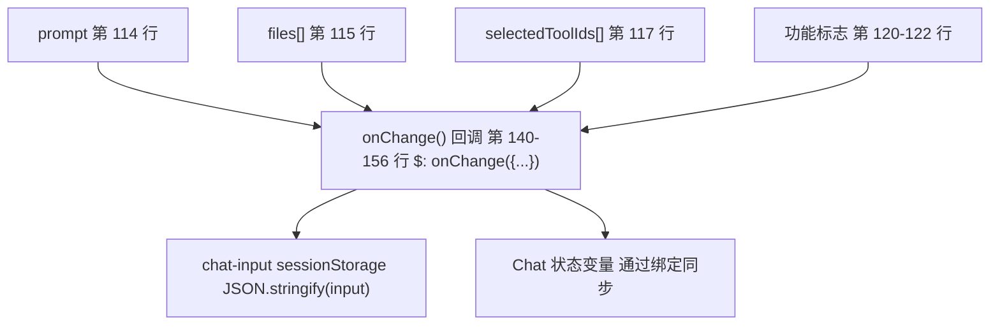
来源： [src/lib/components/chat/MessageInput.svelte114-124](https://github.com/open-webui/open-webui/blob/a7271532/src/lib/components/chat/MessageInput.svelte#L114-L124) [src/lib/components/chat/MessageInput.svelte140-156](https://github.com/open-webui/open-webui/blob/a7271532/src/lib/components/chat/MessageInput.svelte#L140-L156) [src/lib/components/chat/MessageInput.svelte377-385](https://github.com/open-webui/open-webui/blob/a7271532/src/lib/components/chat/MessageInput.svelte#L377-L385) [src/lib/components/chat/Chat.svelte158-162](https://github.com/open-webui/open-webui/blob/a7271532/src/lib/components/chat/Chat.svelte#L158-L162)

## 文本输入与变量处理

文本输入系统使用 `RichTextInput.svelte` 作为编辑器，并通过二级流水线处理模板变量。

### 变量替换流水线

系统通过二级流水线处理变量：首先是内置模板变量，然后是自定义输入变量。

**图表：变量处理流水线**

```mermaid
flowchart TD
    UserInput["用户输入 RichTextInput"]
    setTextEntry["setText(text, cb) 第 302-320 行"]
    textVarHandler["textVariableHandler(text) 第 178-289 行"]
    CLIPBOARD["{{CLIPBOARD}} navigator.clipboard.readText() 第 179-203 行"]
    USER_LOCATION["{{USER_LOCATION}} 来自 utils 的 getUserPosition() 第 206-214 行"]
    USER_NAME["{{USER_NAME}} sessionUser.name 第 219-222 行"]
    USER_BIO["{{USER_BIO}} sessionUser.bio 第 224-230 行"]
    USER_GENDER["{{USER_GENDER}} sessionUser.gender 第 232-238 行"]
    USER_BIRTH_DATE["{{USER_BIRTH_DATE}} sessionUser.date_of_birth 第 240-246 行"]
    USER_AGE["{{USER_AGE}} getAge(birthDate) 第 248-256 行"]
    USER_LANGUAGE["{{USER_LANGUAGE}} localStorage.locale 第 258-261 行"]
    CURRENT_DATE["{{CURRENT_DATE}} getFormattedDate() 第 263-266 行"]
    CURRENT_TIME["{{CURRENT_TIME}} getFormattedTime() 第 268-271 行"]
    CURRENT_DATETIME["{{CURRENT_DATETIME}} getCurrentDateTime() 第 273-276 行"]
    CURRENT_TIMEZONE["{{CURRENT_TIMEZONE}} getUserTimezone() 第 278-281 行"]
    CURRENT_WEEKDAY["{{CURRENT_WEEKDAY}} getWeekday() 第 283-286 行"]
    inputVarHandler["inputVariableHandler(text) 第 158-176 行"]
    extractInputVars["extractInputVariables(text) 来自 $lib/utils 解析 {{var|description}}"]
    showModal["showInputVariablesModal = true 第 167-175 行 InputVariablesModal.svelte"]
    replaceVars["replaceVariables(variables) 第 291-300 行 chatInputElement.replaceVariables()"]

    UserInput --> setTextEntry
    setTextEntry --> textVarHandler
    textVarHandler --> CLIPBOARD
    textVarHandler --> USER_LOCATION
    textVarHandler --> USER_NAME
    textVarHandler --> USER_BIO
    textVarHandler --> USER_GENDER
    textVarHandler --> USER_BIRTH_DATE
    textVarHandler --> USER_AGE
    textVarHandler --> USER_LANGUAGE
    textVarHandler --> CURRENT_DATE
    textVarHandler --> CURRENT_TIME
    textVarHandler --> CURRENT_DATETIME
    textVarHandler --> CURRENT_TIMEZONE
    textVarHandler --> CURRENT_WEEKDAY
    textVarHandler --> inputVarHandler
    inputVarHandler --> extractInputVars
    extractInputVars --> showModal
    showModal --> replaceVars
    extractInputVars --> replaceVars
    replaceVars --> UserInput
```
来源： [src/lib/components/chat/MessageInput.svelte178-289](https://github.com/open-webui/open-webui/blob/a7271532/src/lib/components/chat/MessageInput.svelte#L178-L289) [src/lib/components/chat/MessageInput.svelte158-176](https://github.com/open-webui/open-webui/blob/a7271532/src/lib/components/chat/MessageInput.svelte#L158-L176) [src/lib/components/chat/MessageInput.svelte291-300](https://github.com/open-webui/open-webui/blob/a7271532/src/lib/components/chat/MessageInput.svelte#L291-L300) [src/lib/components/chat/MessageInput.svelte302-320](https://github.com/open-webui/open-webui/blob/a7271532/src/lib/components/chat/MessageInput.svelte#L302-L320) [src/lib/utils/index.ts](https://github.com/open-webui/open-webui/blob/a7271532/src/lib/utils/index.ts)

### 富文本编辑器集成

`MessageInput` 通过 `chatInputElement` 绑定集成了 `RichTextInput.svelte`（基于 TipTap/ProseMirror），用于高级文本编辑。

**由 MessageInput 调用的编辑器方法**

| 方法 | 用途 | 调用位置 |
| --- | --- | --- |
| `setText(text)` | 设置编辑器的 Markdown 内容 | 第 310, 589, 1262 行 |
| `focus()` | 以编程式方式聚焦编辑器 | 第 311, 842, 877, 912, 1322 行 |
| `getWordAtDocPos()` | 获取光标处的单词（用于命令检测） | 第 327 行 |
| `replaceCommandWithText(text)` | 将斜杠命令替换为文本 | 第 338 行 |
| `insertContent(text)` | 在光标位置插入内容 | 第 349 行 |
| `replaceVariables(variables)` | 在编辑器中替换 {{var}} 占位符 | 第 297 行 |
| `setContent(content)` | 设置 ProseMirror JSON 内容 | 第 1007 行 |

**编辑器组件配置：**

```mermaid
flowchart TD
    RichTextInputComponent["RichTextInput.svelte 第 1157-1174 行"]
    thisBinding["bind:this={chatInputElement} 第 1158 行"]
    contentBinding["bind:value={inputContent} 第 1159 行"]
    promptBinding["bind:text={prompt} 第 1160 行"]
    placeholderProp["placeholder 第 1161 行"]
    suggestionsProp["suggestions={suggestions} 第 1162 行"]
    onFileDrop["on:file 第 1165 行"]
    onCommandChange["on:command-change 第 1171 行"]
    fileDropHandler["on:file={(e) => inputFilesHandler(e.detail)} 第 1165-1167 行"]
    commandChangeHandler["on:command-change={(e) => command = e.detail} 第 1171-1173 行"]
    inputFilesHandler["inputFilesHandler() 第 643-755 行"]
    commandState["command 变量 第 377 行"]

    RichTextInputComponent --> thisBinding
    RichTextInputComponent --> contentBinding
    RichTextInputComponent --> promptBinding
    RichTextInputComponent --> placeholderProp
    RichTextInputComponent --> suggestionsProp
    RichTextInputComponent --> onFileDrop
    RichTextInputComponent --> onCommandChange
    fileDropHandler --> inputFilesHandler
    commandChangeHandler --> commandState
```
编辑器挂载在 DOM 中，ID 为 `chat-input`（第 1157 行），并在父应用配置了 Socket.IO 时支持通过 Yjs 进行协作编辑。

来源： [src/lib/components/chat/MessageInput.svelte1157-1174](https://github.com/open-webui/open-webui/blob/a7271532/src/lib/components/chat/MessageInput.svelte#L1157-L1174) [src/lib/components/chat/MessageInput.svelte302-320](https://github.com/open-webui/open-webui/blob/a7271532/src/lib/components/chat/MessageInput.svelte#L302-L320) [src/lib/components/chat/MessageInput.svelte322-375](https://github.com/open-webui/open-webui/blob/a7271532/src/lib/components/chat/MessageInput.svelte#L322-L375) [src/lib/components/common/RichTextInput.svelte](https://github.com/open-webui/open-webui/blob/a7271532/src/lib/components/common/RichTextInput.svelte)

## 文件上传系统

文件上传系统处理多种输入方式，并通过统一的流水线处理不同的文件类型。

### 文件上传架构

**图表：文件上传处理流程**

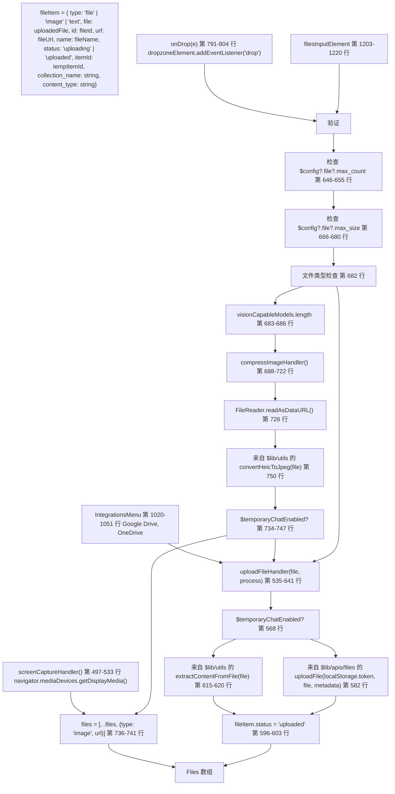
来源： [src/lib/components/chat/MessageInput.svelte643-755](https://github.com/open-webui/open-webui/blob/a7271532/src/lib/components/chat/MessageInput.svelte#L643-L755) [src/lib/components/chat/MessageInput.svelte535-641](https://github.com/open-webui/open-webui/blob/a7271532/src/lib/components/chat/MessageInput.svelte#L535-L641) [src/lib/components/chat/MessageInput.svelte791-804](https://github.com/open-webui/open-webui/blob/a7271532/src/lib/components/chat/MessageInput.svelte#L791-L804) [src/lib/components/chat/MessageInput.svelte497-533](https://github.com/open-webui/open-webui/blob/a7271532/src/lib/components/chat/MessageInput.svelte#L497-L533) [src/lib/apis/files/index.ts](https://github.com/open-webui/open-webui/blob/a7271532/src/lib/apis/files/index.ts)

### 文件类型处理

不同的文件类型遵循不同的处理路径，并进行模型能力检查：

| 文件类型 | 检测逻辑 | 处理函数 | 元数据 | `files[]` 中的结果 |
| --- | --- | --- | --- | --- |
| 图像 (PNG, JPG, WebP) | `file.type.startsWith('image/')` 第 682 行 | `FileReader.readAsDataURL()` + `compressImage()` 第 688-750 行 | 无 | `{type: 'image', url: dataURL}` |
| HEIC 图像 | `file.type === 'image/heic'` 第 750 行 | utils 中的 `convertHeicToJpeg()` + 压缩 | 无 | `{type: 'image', url: dataURL}` |
| PDF, DOCX, TXT | 其他类型 | `uploadFile(token, file, metadata)` API 第 582 行 | `{channel_id}` (仅限频道) | `{type: 'file', file: {id, meta}, collection_name, status: 'uploaded'}` |
| 音频文件 | `file.type.startsWith('audio/')` | 带语言元数据的 `uploadFile()` 第 571-579 行 | `{language: $settings?.audio?.stt?.language}` | `{type: 'file', file: {id}, status: 'uploaded'}` |
| 视频文件 | `file.type.startsWith('video/')` | 同音频 (STT 提取) | `{language: $settings?.audio?.stt?.language}` | `{type: 'file', file: {id}, status: 'uploaded'}` |

**模型能力检查：**

该组件计算响应式的能力数组，以验证上传内容是否与所选模型匹配：

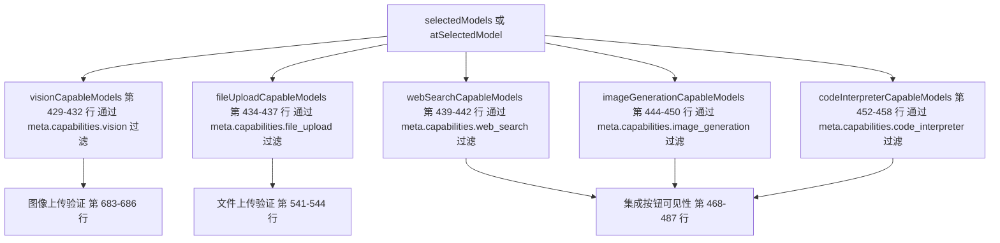
来源： [src/lib/components/chat/MessageInput.svelte429-458](https://github.com/open-webui/open-webui/blob/a7271532/src/lib/components/chat/MessageInput.svelte#L429-L458) [src/lib/components/chat/MessageInput.svelte682-750](https://github.com/open-webui/open-webui/blob/a7271532/src/lib/components/chat/MessageInput.svelte#L682-L750) [src/lib/components/chat/MessageInput.svelte535-641](https://github.com/open-webui/open-webui/blob/a7271532/src/lib/components/chat/MessageInput.svelte#L535-L641) [src/lib/apis/files/index.ts](https://github.com/open-webui/open-webui/blob/a7271532/src/lib/apis/files/index.ts)

### 拖放系统

拖放界面将事件监听器附加到 `#chat-container` 元素用于文件上传：

**事件监听器生命周期：**

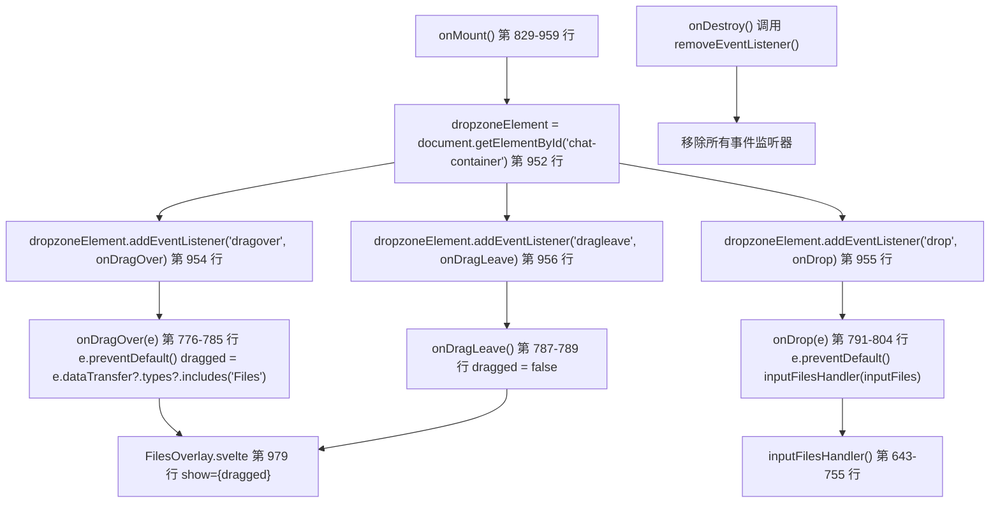
当文件被拖拽到聊天容器上方时，`dragged` 状态变量（第 423 行）会触发 `FilesOverlay.svelte` 显示全屏投放区域指示。

来源： [src/lib/components/chat/MessageInput.svelte776-804](https://github.com/open-webui/open-webui/blob/a7271532/src/lib/components/chat/MessageInput.svelte#L776-L804) [src/lib/components/chat/MessageInput.svelte952-956](https://github.com/open-webui/open-webui/blob/a7271532/src/lib/components/chat/MessageInput.svelte#L952-L956) [src/lib/components/chat/MessageInput.svelte961-976](https://github.com/open-webui/open-webui/blob/a7271532/src/lib/components/chat/MessageInput.svelte#L961-L976) [src/lib/components/chat/MessageInput/FilesOverlay.svelte](https://github.com/open-webui/open-webui/blob/a7271532/src/lib/components/chat/MessageInput/FilesOverlay.svelte)

## 命令建议系统

命令系统利用 TipTap 的 suggestion 扩展，为模型、提示词和文件提供自动补全功能。

### 命令触发与处理

**图表：命令建议系统**

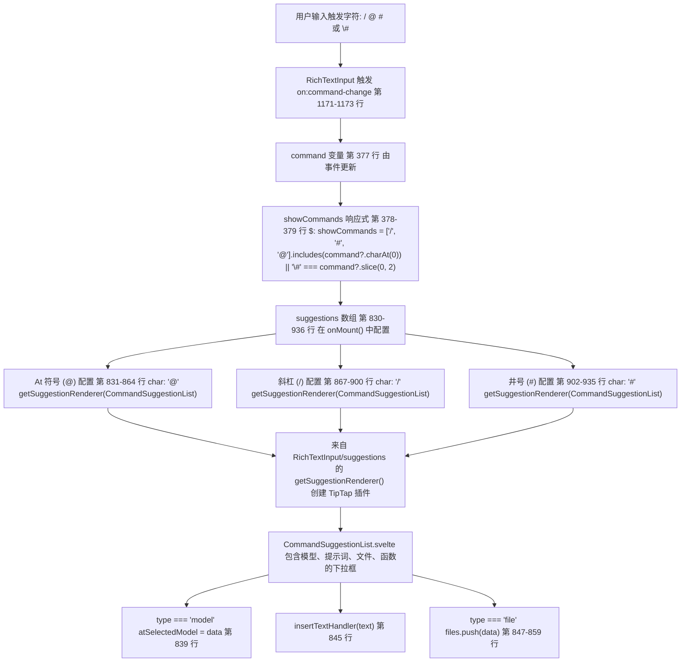
`suggestions` 数组在 `onMount()`（第 830-936 行）中初始化，包含三个传递给 `RichTextInput.svelte`（第 1162 行）的配置。每个配置都使用来自 `src/lib/components/common/RichTextInput/suggestions.ts` 的 `getSuggestionRenderer()` 来创建一个 TipTap Suggestion 插件，该插件在浮动下拉框中渲染 `CommandSuggestionList.svelte`。

来源： [src/lib/components/chat/MessageInput.svelte830-936](https://github.com/open-webui/open-webui/blob/a7271532/src/lib/components/chat/MessageInput.svelte#L830-L936) [src/lib/components/chat/MessageInput.svelte378-379](https://github.com/open-webui/open-webui/blob/a7271532/src/lib/components/chat/MessageInput.svelte#L378-L379) [src/lib/components/chat/MessageInput.svelte1171-1173](https://github.com/open-webui/open-webui/blob/a7271532/src/lib/components/chat/MessageInput.svelte#L1171-L1173) [src/lib/components/chat/MessageInput/CommandSuggestionList.svelte](https://github.com/open-webui/open-webui/blob/a7271532/src/lib/components/chat/MessageInput/CommandSuggestionList.svelte) [src/lib/components/common/RichTextInput/suggestions.ts](https://github.com/open-webui/open-webui/blob/a7271532/src/lib/components/common/RichTextInput/suggestions.ts)

### 命令选择动作

当用户从命令下拉框中选择一项时，会根据选择类型执行不同的处理程序：

| 选择类型 | 处理逻辑 | 位置 | 结果 |
| --- | --- | --- | --- |
| 模型选择 | `if (type === 'model') { atSelectedModel = data; }` | 第 838-840 行 | 设置 `@model` 覆盖，用于单模型聊天 |
| 提示词文本 | 调用 `insertTextHandler(text)` | 第 845 行 | 调用 `insertTextAtCursor()` 插入提示词内容 |
| 知识库文件 | `if (type === 'file') { files = [...files, {...data, status: 'processed'}]; }` | 第 847-859 行 | 将现有文件添加到 `files[]`，无需重新上传 |
| 函数/工具 | 带函数内容的 `insertTextHandler(text)` | 第 845 行 | 插入函数调用语法 |
| 网页 URL | 分发 `onUpload(e)` | 第 861 行 | 调用 Chat.svelte 中的 `uploadWeb()` 或 `uploadGoogleDriveFile()` |

**insertTextAtCursor 流程：**

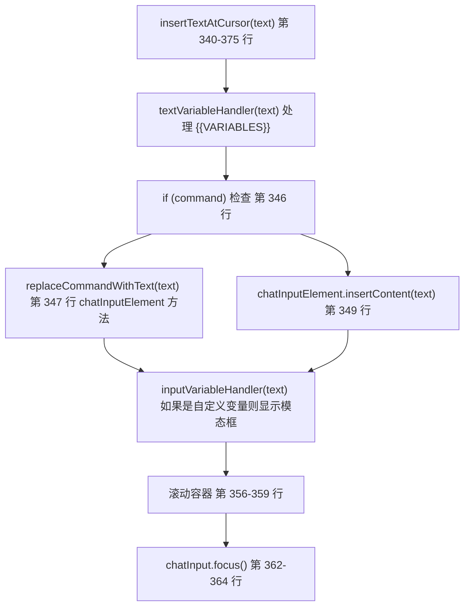
来源： [src/lib/components/chat/MessageInput.svelte835-862](https://github.com/open-webui/open-webui/blob/a7271532/src/lib/components/chat/MessageInput.svelte#L835-L862) [src/lib/components/chat/MessageInput.svelte340-375](https://github.com/open-webui/open-webui/blob/a7271532/src/lib/components/chat/MessageInput.svelte#L340-L375) [src/lib/components/chat/MessageInput/CommandSuggestionList.svelte](https://github.com/open-webui/open-webui/blob/a7271532/src/lib/components/chat/MessageInput/CommandSuggestionList.svelte)

## 消息提交流程

提交过程协调输入验证、文件处理，并触发父级 `Chat.svelte` 中的消息生成流水线。

### 提交触发与验证

**提交表单处理程序：**

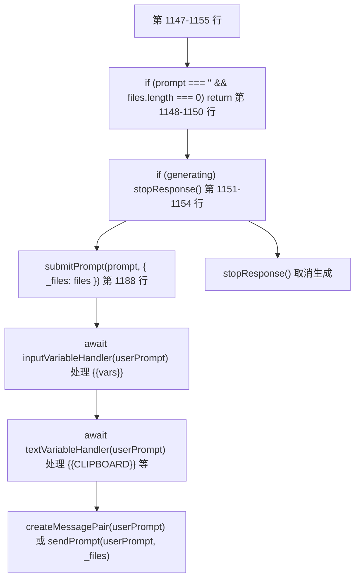
`submitPrompt` 函数定义在 `Chat.svelte` 中，并通过 prop 绑定调用。它接收处理后的提示词和文件数组。

来源： [src/lib/components/chat/MessageInput.svelte1147-1190](https://github.com/open-webui/open-webui/blob/a7271532/src/lib/components/chat/MessageInput.svelte#L1147-L1190) [src/lib/components/chat/Chat.svelte1761-1862](https://github.com/open-webui/open-webui/blob/a7271532/src/lib/components/chat/Chat.svelte#L1761-L1862)

### 输入组件动作

`InputMenu.svelte` 组件（第 1054-1118 行）提供了用于填充消息输入的快速操作：

**InputMenu 组件：**

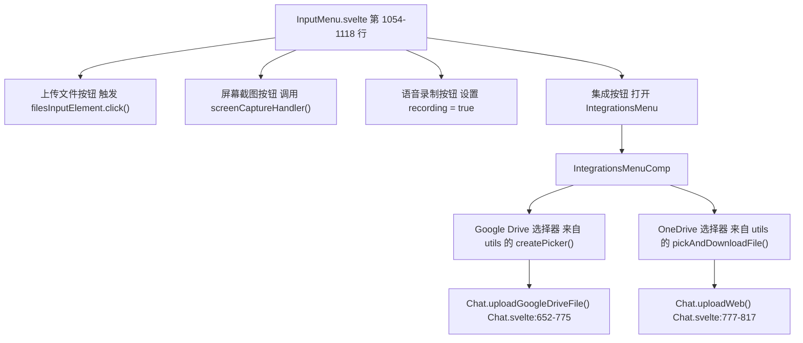
来源： [src/lib/components/chat/MessageInput.svelte1054-1118](https://github.com/open-webui/open-webui/blob/a7271532/src/lib/components/chat/MessageInput.svelte#L1054-1118) [src/lib/components/chat/MessageInput/IntegrationsMenu.svelte](https://github.com/open-webui/open-webui/blob/a7271532/src/lib/components/chat/MessageInput/IntegrationsMenu.svelte) [src/lib/components/chat/Chat.svelte652-817](https://github.com/open-webui/open-webui/blob/a7271532/src/lib/components/chat/Chat.svelte#L652-L817)

### 输入状态集成

`onChange` 回调将输入状态与父聊天组件同步：

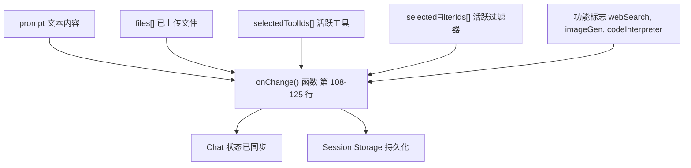
来源： [src/lib/components/chat/MessageInput.svelte108-125](https://github.com/open-webui/open-webui/blob/a7271532/src/lib/components/chat/MessageInput.svelte#L108-L125) [src/lib/components/chat/Chat.svelte166-191](https://github.com/open-webui/open-webui/blob/a7271532/src/lib/components/chat/MessageInput.svelte#L166-L191)

消息输入和处理系统为用户交互提供了一个全面的界面，处理从简单的文本输入到复杂的文件上传和变量替换的所有事务，确保所有用户内容在发送到 AI 模型进行生成之前都得到了妥善处理。
