# 消息历史树

相关源文件

-   [src/lib/components/channel/MessageInput.svelte](https://github.com/open-webui/open-webui/blob/a7271532/src/lib/components/channel/MessageInput.svelte)
-   [src/lib/components/chat/Chat.svelte](https://github.com/open-webui/open-webui/blob/a7271532/src/lib/components/chat/Chat.svelte)
-   [src/lib/components/chat/ChatPlaceholder.svelte](https://github.com/open-webui/open-webui/blob/a7271532/src/lib/components/chat/ChatPlaceholder.svelte)
-   [src/lib/components/chat/MessageInput.svelte](https://github.com/open-webui/open-webui/blob/a7271532/src/lib/components/chat/MessageInput.svelte)
-   [src/lib/components/chat/Messages.svelte](https://github.com/open-webui/open-webui/blob/a7271532/src/lib/components/chat/Messages.svelte)
-   [src/lib/components/chat/Messages/ResponseMessage.svelte](https://github.com/open-webui/open-webui/blob/a7271532/src/lib/components/chat/Messages/ResponseMessage.svelte)
-   [src/lib/components/chat/Messages/UserMessage.svelte](https://github.com/open-webui/open-webui/blob/a7271532/src/lib/components/chat/Messages/UserMessage.svelte)
-   [src/lib/components/chat/Placeholder.svelte](https://github.com/open-webui/open-webui/blob/a7271532/src/lib/components/chat/Placeholder.svelte)
-   [src/lib/components/chat/Settings/Interface.svelte](https://github.com/open-webui/open-webui/blob/a7271532/src/lib/components/chat/Settings/Interface.svelte)
-   [src/lib/components/chat/SettingsModal.svelte](https://github.com/open-webui/open-webui/blob/a7271532/src/lib/components/chat/SettingsModal.svelte)
-   [src/lib/components/chat/Suggestions.svelte](https://github.com/open-webui/open-webui/blob/a7271532/src/lib/components/chat/Suggestions.svelte)
-   [src/lib/components/common/FileItem.svelte](https://github.com/open-webui/open-webui/blob/a7271532/src/lib/components/common/FileItem.svelte)
-   [src/lib/components/common/FileItemModal.svelte](https://github.com/open-webui/open-webui/blob/a7271532/src/lib/components/common/FileItemModal.svelte)
-   [src/lib/components/common/Modal.svelte](https://github.com/open-webui/open-webui/blob/a7271532/src/lib/components/common/Modal.svelte)
-   [src/lib/utils/index.ts](https://github.com/open-webui/open-webui/blob/a7271532/src/lib/utils/index.ts)
-   [src/routes/(app)/+layout.svelte](https://github.com/open-webui/open-webui/blob/a7271532/src/routes/(app)/+layout.svelte)
-   [src/routes/(app)/+page.svelte](https://github.com/open-webui/open-webui/blob/a7271532/src/routes/(app)/+page.svelte)
-   [src/routes/(app)/c/\[id\]/+page.svelte](src/routes/(app)/c/%5Bid%5D/+page.svelte)

## 目的与范围

本文档解释了 Open WebUI 聊天系统中使用的基于树的消息历史结构。消息历史树支持分叉对话，允许用户重新生成响应、编辑消息以及在不同的对话路径之间导航，同时保留所有变体。

有关单个消息渲染的信息，请参阅 [消息渲染](/open-webui/open-webui/5-message-rendering)。有关如何创建和提交消息的详情，请参阅 [消息输入系统](/open-webui/open-webui/4.2-message-input-system)。

---

## 概述

Open WebUI 将聊天历史实现为树状结构，而非线性列表。这种设计选择实现了：

-   **多个响应变体**：在重新生成助手响应时，新的响应将成为一个兄弟分支。
-   **对话编辑**：用户可以编辑任何消息并创建替代的对话路径。
-   **完整历史保留**：所有消息变体都会被保留，而不是被覆盖。
-   **分支导航**：用户可以在不同的对话路径之间导航。

该树以带有父子关系的扁平字典形式存储，并结合了一个指向当前可见消息路径的指针。

**来源：** [src/lib/components/chat/Chat.svelte150-153](https://github.com/open-webui/open-webui/blob/a7271532/src/lib/components/chat/Chat.svelte#L150-L153) [src/lib/utils/index.ts187-218](https://github.com/open-webui/open-webui/blob/a7271532/src/lib/utils/index.ts#L187-L218)

---

## 数据结构

### 历史对象架构 (History Object Schema)

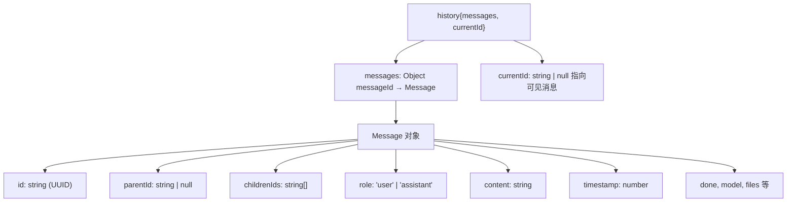
**来源：** [src/lib/components/chat/Chat.svelte150-153](https://github.com/open-webui/open-webui/blob/a7271532/src/lib/components/chat/Chat.svelte#L150-L153) [src/lib/components/chat/Messages.svelte76-88](https://github.com/open-webui/open-webui/blob/a7271532/src/lib/components/chat/Messages.svelte#L76-L88)

### 消息对象属性

| 属性 | 类型 | 描述 |
| --- | --- | --- |
| `id` | `string` | 标识此消息的 UUID |
| `parentId` | `string | null` | 父消息 ID；根消息为 `null` |
| `childrenIds` | `string[]` | 子消息 ID 数组（重新生成时为兄弟节点） |
| `role` | `'user' | 'assistant'` | 消息作者角色 |
| `content` | `string` | 消息文本内容 |
| `timestamp` | `number` | Unix 时间戳 |
| `done` | `boolean` | 消息生成是否已完成 |
| `model` | `string` | 模型 ID（针对助手消息） |
| `files` | `array` | 附件文件（可选） |
| `sources` | `array` | RAG 来源/引用（可选） |
| `annotation` | `object` | 用户反馈评分（可选） |

**来源：** [src/lib/components/chat/Messages/ResponseMessage.svelte66-115](https://github.com/open-webui/open-webui/blob/a7271532/src/lib/components/chat/Messages/ResponseMessage.svelte#L66-L115)

---

## 树结构示例

下图说明了当用户重新生成响应时消息树的工作方式：

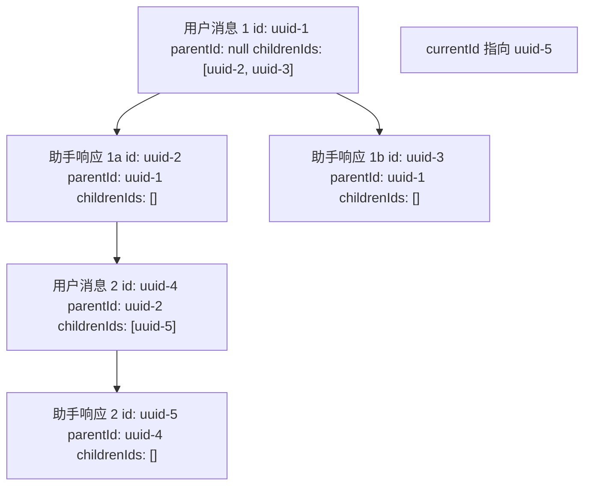
在此示例中：

-   用户发送消息 (uuid-1)
-   助手响应 (uuid-2)
-   用户重新生成响应 → 创建兄弟节点 (uuid-3)
-   从第一个响应路径中，用户继续发送 uuid-4
-   助手响应 (uuid-5)
-   `currentId` 指向 uuid-5，使得可见路径为：uuid-1 → uuid-2 → uuid-4 → uuid-5

**来源：** [src/lib/components/chat/Chat.svelte1261-1318](https://github.com/open-webui/open-webui/blob/a7271532/src/lib/components/chat/Chat.svelte#L1261-L1318)

---

## 导航函数

### showMessage: 导航至特定消息

`showMessage()` 函数导航至一条消息，并自动沿树结构跟随该分支中最深层的子节点。

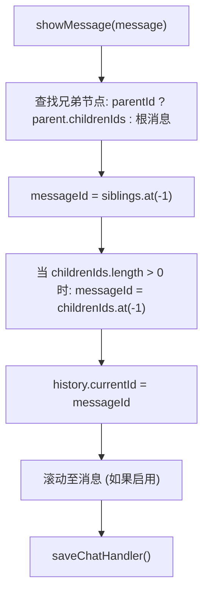
**算法：**

1.  如果 `messageId` 为 null，查找根消息；否则获取父节点的子节点。
2.  选择最后一个兄弟节点（最新的变体）。
3.  通过重复选择最后一个子节点，向下钻取到最深层的子节点。
4.  更新 `history.currentId`。
5.  滚动至消息（如果启用了 `settings.scrollOnBranchChange`）。
6.  将聊天状态保存到数据库。

**来源：** [src/lib/components/chat/Chat.svelte314-349](https://github.com/open-webui/open-webui/blob/a7271532/src/lib/components/chat/Chat.svelte#L314-L349)

### showPreviousMessage / showNextMessage: 兄弟节点导航

这些函数在兄弟消息（替代响应/分支）之间进行导航：

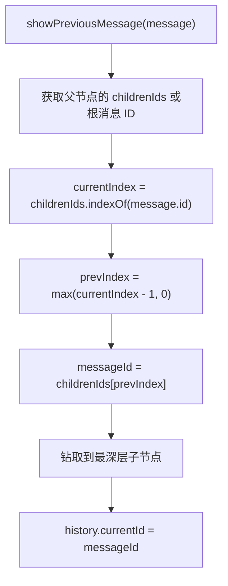
**关键行为：**

-   `showPreviousMessage()`：移动到前一个兄弟节点（索引更小），限制最小为 0。
-   `showNextMessage()`：移动到后一个兄弟节点（索引更大），限制最大为 数组长度-1。
-   选择兄弟节点后，钻取到该分支上最深层的子节点。
-   更新 `currentId` 并可选地进行滚动。

**来源：** [src/lib/components/chat/Messages.svelte157-253](https://github.com/open-webui/open-webui/blob/a7271532/src/lib/components/chat/Messages.svelte#L157-L253)

### gotoMessage: 跳转至特定兄弟索引

`gotoMessage()` 函数允许通过索引直接导航到特定的兄弟节点：

| 参数 | 类型 | 描述 |
| --- | --- | --- |
| `message` | `Message` | 起始消息 |
| `idx` | `number` | 目标兄弟节点索引 (从 0 开始) |

**流程：**

1.  确定兄弟节点列表（父节点的子节点或根消息）。
2.  将索引限制在有效范围内：`[0, siblings.length-1]`。
3.  选择该索引处的消息。
4.  钻取到最深层子节点。
5.  更新 `currentId`。
6.  如果启用则自动滚动。

**来源：** [src/lib/components/chat/Messages.svelte116-155](https://github.com/open-webui/open-webui/blob/a7271532/src/lib/components/chat/Messages.svelte#L116-L155)

---

## 创建与修改树

### 将线性消息转换为树

当加载旧聊天或从线性消息格式迁移时，`convertMessagesToHistory()` 会创建树结构：

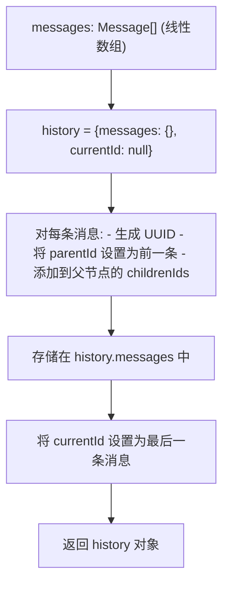
**来源：** [src/lib/utils/index.ts187-218](https://github.com/open-webui/open-webui/blob/a7271532/src/lib/utils/index.ts#L187-L218) [src/lib/components/chat/Chat.svelte1091-1094](https://github.com/open-webui/open-webui/blob/a7271532/src/lib/components/chat/Chat.svelte#L1091-L1094)

### 添加消息：分支点

当消息被编辑或重新生成时，会创建新的分支：

#### 用户消息编辑（提交）

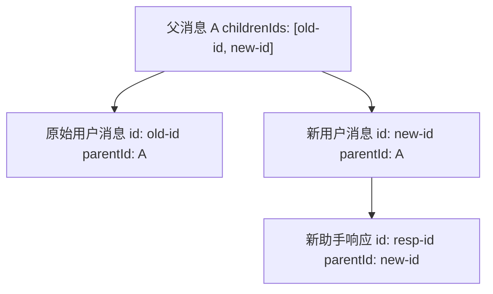
**流程：**

1.  使用新 UUID 创建新的用户消息。
2.  将 `parentId` 设置为原始消息的父节点。
3.  将新消息 ID 添加到父节点的 `childrenIds` 中。
4.  将 `currentId` 设置为新用户消息。
5.  触发 `sendMessage()` 以生成响应。

**来源：** [src/lib/components/chat/Messages.svelte264-305](https://github.com/open-webui/open-webui/blob/a7271532/src/lib/components/chat/Messages.svelte#L264-L305)

#### 响应重新生成

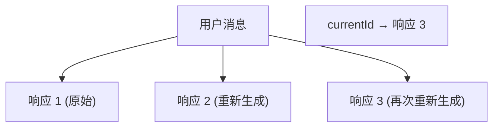
**流程：**

1.  使用新 UUID 创建新的助手消息。
2.  将 `parentId` 设置为用户消息。
3.  追加到用户消息的 `childrenIds` 数组中。
4.  生成响应内容。
5.  将 `currentId` 更新为新响应。

**来源：** [src/lib/components/chat/Chat.svelte1321-1368](https://github.com/open-webui/open-webui/blob/a7271532/src/lib/components/chat/Chat.svelte#L1321-L1368)

---

## 提取线性消息列表

UI 需要一个用于渲染的线性消息数组。`createMessagesList()` 工具函数从 `currentId` 向上遍历到根节点：

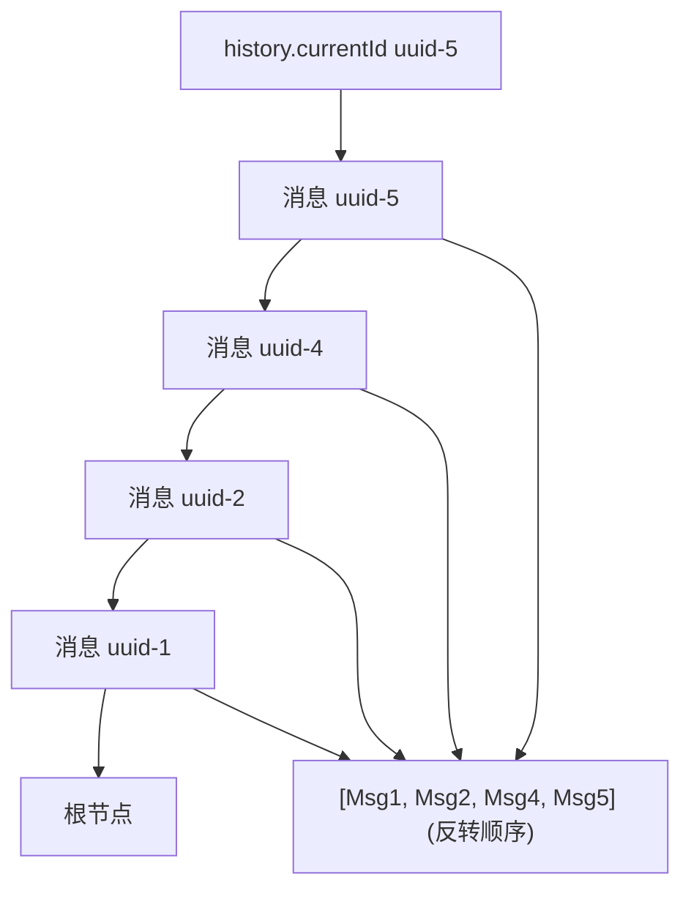
**算法：**

1.  从 `history.currentId` 处的消息开始。
2.  当消息存在且未超过计数限制时：
    -   将消息添加到结果数组（在开头插入）。
    -   移动到父节点：`message = history.messages[message.parentId]`。
3.  返回反转后的数组（从根节点到当前节点）。

**来源：** [src/lib/utils/index.ts1076-1094](https://github.com/open-webui/open-webui/blob/a7271532/src/lib/utils/index.ts#L1076-L1094) [src/lib/components/chat/Messages.svelte76-88](https://github.com/open-webui/open-webui/blob/a7271532/src/lib/components/chat/Messages.svelte#L76-L88)

---

## 消息删除与树维护

删除消息需要仔细重构树结构以保持完整性：

### 删除算法

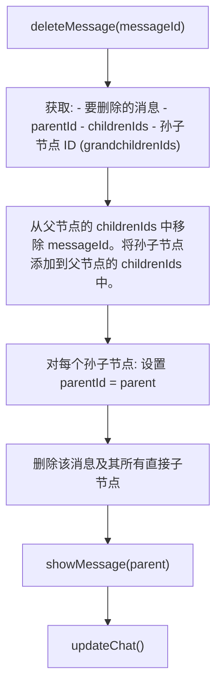
**关键操作：**

1.  收集孙子节点（子节点的子节点）。
2.  从父节点的 `childrenIds` 中移除目标。
3.  将孙子节点添加到父节点的 `childrenIds` 中（绕过被删除的节点）。
4.  更新孙子节点的 `parentId` 以指向祖父节点。
5.  删除目标消息及其直接子节点。
6.  导航到父消息。
7.  保存更新后的历史记录。

**来源：** [src/lib/components/chat/Messages.svelte353-389](https://github.com/open-webui/open-webui/blob/a7271532/src/lib/components/chat/Messages.svelte#L353-L389)

---

## UI 组件与导航控制

### 分支导航 UI

用户通过在消息组件中渲染的 UI 控件导航分支：

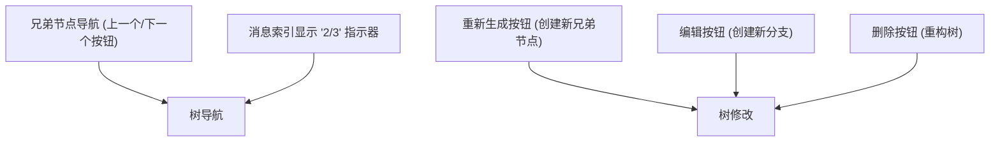
**组件：**

-   **ResponseMessage**：为具有兄弟节点的助手消息显示导航控件。
-   **UserMessage**：为具有兄弟节点的用户消息显示导航控件。
-   **Message**：根据角色和分支位置编排渲染。

**来源：** [src/lib/components/chat/Messages/ResponseMessage.svelte843-970](https://github.com/open-webui/open-webui/blob/a7271532/src/lib/components/chat/Messages/ResponseMessage.svelte#L843-L970) [src/lib/components/chat/Messages/UserMessage.svelte223-334](https://github.com/open-webui/open-webui/blob/a7271532/src/lib/components/chat/Messages/UserMessage.svelte#L223-L334)

### 兄弟节点计数显示

UI 将分支位置显示为 "当前索引 / 兄弟节点总数"：

```
// 计算兄弟节点位置
let siblings;
if (message.parentId !== null) {
    siblings = history.messages[message.parentId].childrenIds;
} else {
    siblings = Object.values(history.messages)
        .filter(m => m.parentId === null)
        .map(m => m.id);
}
const currentIndex = siblings.indexOf(message.id) + 1;
const totalSiblings = siblings.length;
```
**来源：** [src/lib/components/chat/Messages/ResponseMessage.svelte129-135](https://github.com/open-webui/open-webui/blob/a7271532/src/lib/components/chat/Messages/ResponseMessage.svelte#L129-L135)

---

## 持久化与序列化

### 数据库存储

整个历史对象被序列化为 JSON 并存储在数据库中：

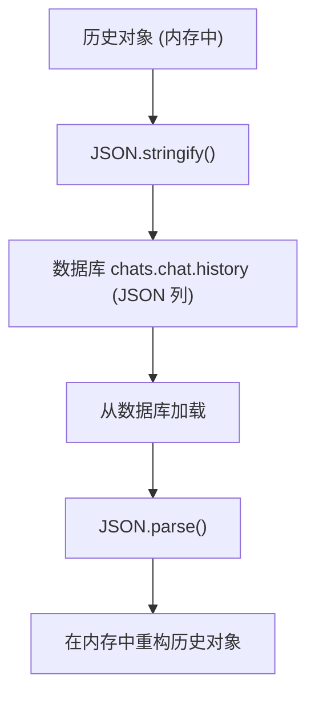
**存储位置：** `chats` 表，`chat` 列 (JSON)，`history` 字段。

**回退方案：** 如果缺少 `history` 字段（旧聊天），`convertMessagesToHistory()` 会从 `messages` 数组进行迁移。

**来源：** [src/lib/components/chat/Chat.svelte1058-1127](https://github.com/open-webui/open-webui/blob/a7271532/src/lib/components/chat/Chat.svelte#L1058-L1127) [src/lib/apis/chats/index.ts](https://github.com/open-webui/open-webui/blob/a7271532/src/lib/apis/chats/index.ts)

### 会话存储 (Session Storage)

当前输入被保存到会话存储中，以便在导航时保留状态：

| 键 | 值 | 用途 |
| --- | --- | --- |
| `chat-input` | 输入内容 | 保留未发送的消息文本 |
| `chat-input-{chatId}` | 输入内容 | 保留每个聊天的草稿 |

**来源：** [src/lib/components/chat/Chat.svelte179-206](https://github.com/open-webui/open-webui/blob/a7271532/src/lib/components/chat/Chat.svelte#L179-L206)

---

## 性能考量

### 消息懒加载

为了处理极长的对话，系统支持分页：

```
// 在 Messages.svelte 中
let messagesCount: number | null = 20;

$: if (history.currentId) {
    let _messages = [];
    let message = history.messages[history.currentId];

    // 向上遍历树，限制为 messagesCount
    while (message &&
           (messagesCount !== null ? _messages.length <= messagesCount : true)) {
        _messages.unshift({ ...message });
        message = message.parentId !== null ?
            history.messages[message.parentId] : null;
    }
    messages = _messages;
}
```
**行为：**

-   初始加载当前分支中最近的 20 条消息。
-   "加载更多" 按钮将 `messagesCount` 增加 20。
-   `null` 值会加载完整历史记录。

**来源：** [src/lib/components/chat/Messages.svelte63-88](https://github.com/open-webui/open-webui/blob/a7271532/src/lib/components/chat/Messages.svelte#L63-L88)

### 消息对象克隆

深度克隆可防止响应式更新问题：

```
let message = JSON.parse(JSON.stringify(history.messages[messageId]));
$: if (history.messages) {
    if (JSON.stringify(message) !==
        JSON.stringify(history.messages[messageId])) {
        message = JSON.parse(JSON.stringify(history.messages[messageId]));
    }
}
```
**来源：** [src/lib/components/chat/Messages/ResponseMessage.svelte122-127](https://github.com/open-webui/open-webui/blob/a7271532/src/lib/components/chat/Messages/ResponseMessage.svelte#L122-L127)

---

## 集成点

### 代码符号参考

| 符号 | 位置 | 用途 |
| --- | --- | --- |
| `history` | Chat.svelte:150-153 | 主历史状态对象 |
| `history.messages` | \- | 所有消息的字典 |
| `history.currentId` | \- | 指向可见消息的指针 |
| `showMessage()` | Chat.svelte:314-349 | 导航至消息分支 |
| `showPreviousMessage()` | Messages.svelte:157-202 | 前一个兄弟节点 |
| `showNextMessage()` | Messages.svelte:204-253 | 后一个兄弟节点 |
| `gotoMessage()` | Messages.svelte:116-155 | 跳转至兄弟节点索引 |
| `createMessagesList()` | utils/index.ts:1076-1094 | 提取线性数组 |
| `convertMessagesToHistory()` | utils/index.ts:187-218 | 迁移旧格式 |
| `editMessage()` | Messages.svelte:264-342 | 创建新分支 |
| `deleteMessage()` | Messages.svelte:353-389 | 移除节点并重构 |
| `saveMessage()` | Messages.svelte:348-351 | 更新单条消息 |
| `updateChat()` | Messages.svelte:102-114 | 持久化到数据库 |

**来源：** 上述列出的所有文件引用
