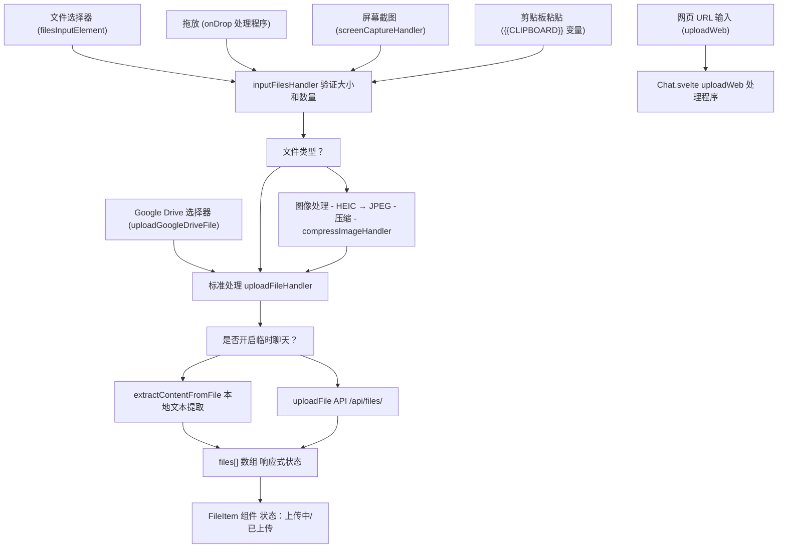
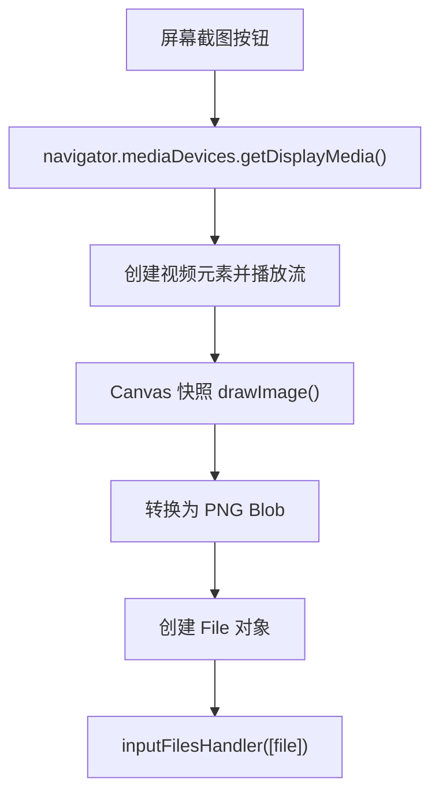
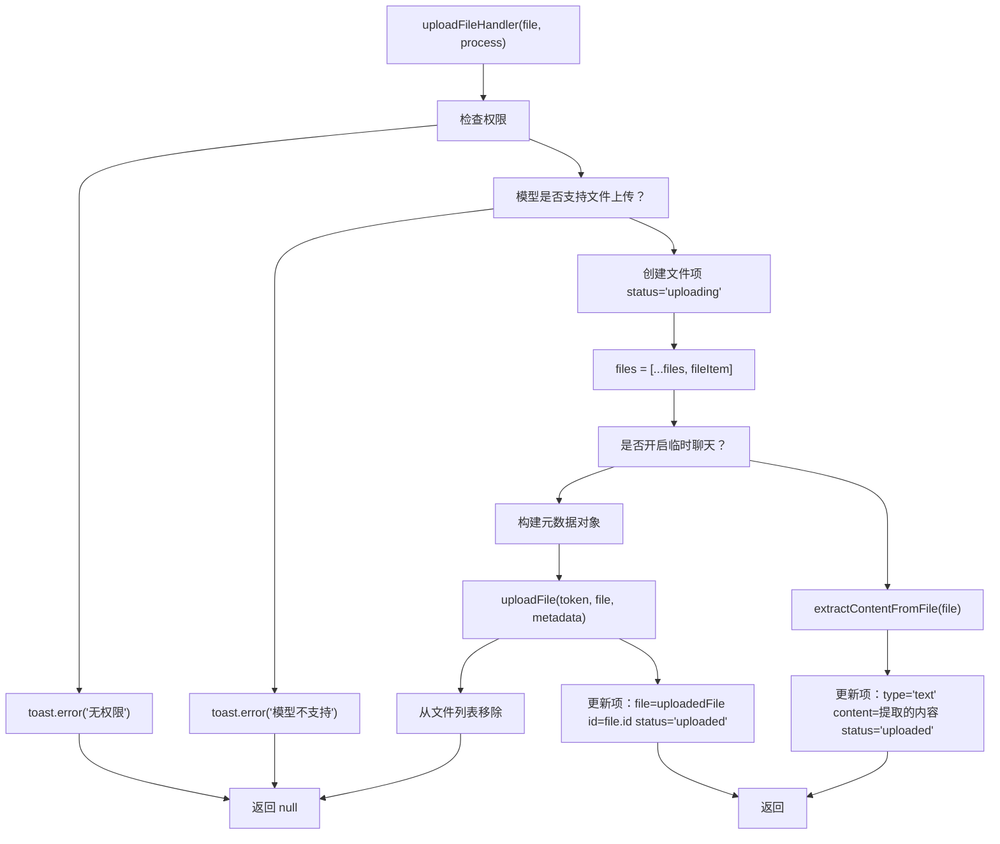
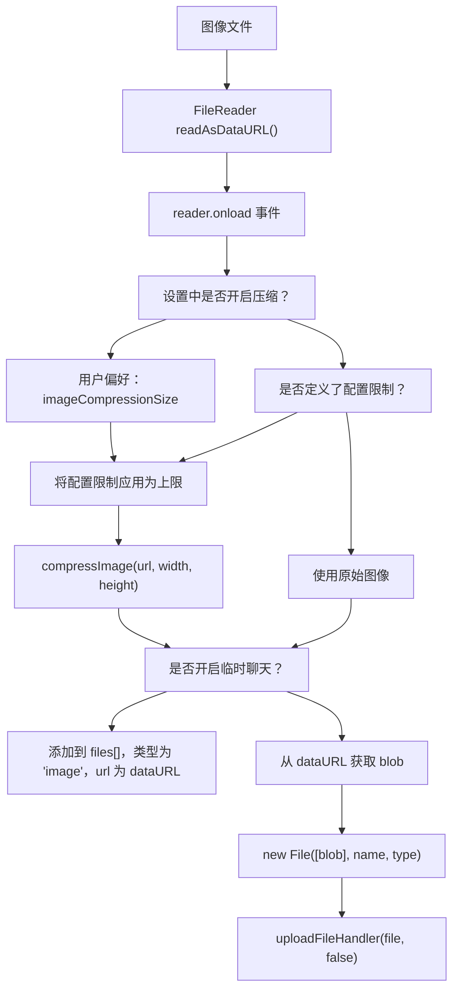
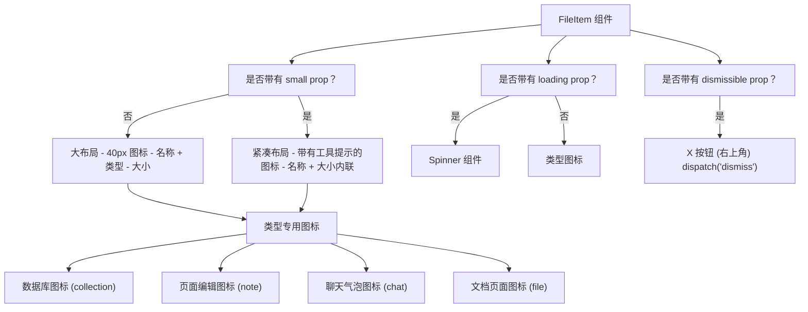

# 文件上传与处理

相关源文件

-   [src/lib/components/channel/MessageInput.svelte](https://github.com/open-webui/open-webui/blob/a7271532/src/lib/components/channel/MessageInput.svelte)
-   [src/lib/components/chat/Chat.svelte](https://github.com/open-webui/open-webui/blob/a7271532/src/lib/components/chat/Chat.svelte)
-   [src/lib/components/chat/ChatPlaceholder.svelte](https://github.com/open-webui/open-webui/blob/a7271532/src/lib/components/chat/ChatPlaceholder.svelte)
-   [src/lib/components/chat/MessageInput.svelte](https://github.com/open-webui/open-webui/blob/a7271532/src/lib/components/chat/MessageInput.svelte)
-   [src/lib/components/chat/Placeholder.svelte](https://github.com/open-webui/open-webui/blob/a7271532/src/lib/components/chat/Placeholder.svelte)
-   [src/lib/components/chat/Suggestions.svelte](https://github.com/open-webui/open-webui/blob/a7271532/src/lib/components/chat/Suggestions.svelte)
-   [src/lib/components/common/FileItem.svelte](https://github.com/open-webui/open-webui/blob/a7271532/src/lib/components/common/FileItem.svelte)
-   [src/lib/components/common/FileItemModal.svelte](https://github.com/open-webui/open-webui/blob/a7271532/src/lib/components/common/FileItemModal.svelte)

## 目的与范围

本文档涵盖了 Open WebUI 聊天界面中的文件上传和处理系统。它解释了用户如何将文件附加到聊天消息中、这些文件如何被验证、处理并上传到服务器，以及不同的文件类型如何接收专门的处理。有关处理后的上传文件如何用于 RAG 检索的信息，请参阅 [文档摄取流水线](/open-webui/open-webui/7.1-document-ingestion-pipeline)。有关文件存储后端的详情，请参阅 [存储提供者架构](/open-webui/open-webui/12.1-storage-provider-architecture)。

该系统支持 40 多种文件类型，包括图像、文档、音频、视频和网页内容。关键特性包括拖放上传、图像压缩、HEIC 转换、屏幕截图、剪贴板集成，以及在不上传服务器的情况下在本地处理文件的临时聊天模式。

---

## 系统架构概览

文件上传系统主要在 `MessageInput` 组件中实现，并由父级 `Chat` 组件提供支持。文件流经多个阶段的流水线：输入收集、验证、转换（针对图像）、上传到服务器以及状态跟踪。

### 文件上传架构


**来源：**

-   [src/lib/components/chat/MessageInput.svelte643-755](https://github.com/open-webui/open-webui/blob/a7271532/src/lib/components/chat/MessageInput.svelte#L643-L755)
-   [src/lib/components/chat/MessageInput.svelte535-641](https://github.com/open-webui/open-webui/blob/a7271532/src/lib/components/chat/MessageInput.svelte#L535-L641)
-   [src/lib/components/chat/Chat.svelte652-827](https://github.com/open-webui/open-webui/blob/a7271532/src/lib/components/chat/Chat.svelte#L652-L827)

---

## 文件输入方式

### 拖放

系统监控聊天容器上的拖拽事件，以提供视觉反馈并处理文件投放。

> **[Mermaid sequence]**
> *(图表结构无法解析)*

拖放实现使用在 `chat-container` 元素上注册的原生 HTML5 事件：

-   **onDragOver** [src/lib/components/chat/MessageInput.svelte776-785](https://github.com/open-webui/open-webui/blob/a7271532/src/lib/components/chat/MessageInput.svelte#L776-L785)：如果检测到文件，则设置 `dragged = true`。
-   **onDrop** [src/lib/components/chat/MessageInput.svelte791-804](https://github.com/open-webui/open-webui/blob/a7271532/src/lib/components/chat/MessageInput.svelte#L791-L804)：从 `dataTransfer` 中提取文件并调用 `inputFilesHandler`。
-   **onDragLeave** [src/lib/components/chat/MessageInput.svelte787-789](https://github.com/open-webui/open-webui/blob/a7271532/src/lib/components/chat/MessageInput.svelte#L787-L789)：清除视觉反馈。

当 `dragged` 为 true 时，`FilesOverlay` 组件会显示全屏遮罩层，提供可以投放文件的视觉反馈。

**来源：**

-   [src/lib/components/chat/MessageInput.svelte776-804](https://github.com/open-webui/open-webui/blob/a7271532/src/lib/components/chat/MessageInput.svelte#L776-L804)
-   [src/lib/components/chat/MessageInput.svelte952-956](https://github.com/open-webui/open-webui/blob/a7271532/src/lib/components/chat/MessageInput.svelte#L952-L956)

### 文件选择器

标准的文件输入元素允许用户从文件系统中选择多个文件：

```
<input bind:this={filesInputElement}
       bind:files={inputFiles}
       type="file"
       hidden
       multiple
       on:change={...} />
```
当通过 UI 按钮点击触发时，文件选择器会打开，选定的文件将通过 `inputFilesHandler` 进行处理。

**来源：**

-   [src/lib/components/chat/MessageInput.svelte1269-1285](https://github.com/open-webui/open-webui/blob/a7271532/src/lib/components/chat/MessageInput.svelte#L1269-L1285)

### 屏幕截图

`screenCaptureHandler` 允许用户捕获屏幕截图或窗口：


处理程序 [src/lib/components/chat/MessageInput.svelte497-533](https://github.com/open-webui/open-webui/blob/a7271532/src/lib/components/chat/MessageInput.svelte#L497-L533) 的逻辑如下：

1.  通过 `getDisplayMedia()` 请求屏幕共享。
2.  创建一个临时的视频元素来捕获帧。
3.  将该帧绘制到 canvas 上。
4.  将 canvas 转换为 PNG data URL。
5.  创建一个文件名为 `screen-capture-{timestamp}.png` 的 File 对象。
6.  传递给 `inputFilesHandler`。

**来源：**

-   [src/lib/components/chat/MessageInput.svelte497-533](https://github.com/open-webui/open-webui/blob/a7271532/src/lib/components/chat/MessageInput.svelte#L497-L533)

### 剪贴板集成

提示词中的 `{{CLIPBOARD}}` 变量会触发剪贴板访问 [src/lib/components/chat/MessageInput.svelte179-203](https://github.com/open-webui/open-webui/blob/a7271532/src/lib/components/chat/MessageInput.svelte#L179-L203)：

```
if (text.includes('{{CLIPBOARD}}')) {
    const clipboardText = await navigator.clipboard.readText();
    const clipboardItems = await navigator.clipboard.read();

    for (const item of clipboardItems) {
        for (const type of item.types) {
            if (type.startsWith('image/')) {
                const blob = await item.getType(type);
                const file = new File([blob], `clipboard-image.${type.split('/')[1]}`, {
                    type: type
                });
                inputFilesHandler([file]);
            }
        }
    }

    text = text.replaceAll('{{CLIPBOARD}}', clipboardText);
}
```
这会从剪贴板中同时提取文本和图像。文本会替换变量，而图像会被添加到文件列表中。

**来源：**

-   [src/lib/components/chat/MessageInput.svelte179-203](https://github.com/open-webui/open-webui/blob/a7271532/src/lib/components/chat/MessageInput.svelte#L179-L203)

### Google Drive 和 OneDrive

与云存储提供商的集成：

-   **Google Drive**：通过 `createPicker` 工具使用 Google Drive Picker API [src/lib/components/chat/Chat.svelte652-775](https://github.com/open-webui/open-webui/blob/a7271532/src/lib/components/chat/Chat.svelte#L652-L775)。
-   **OneDrive**：使用 `pickAndDownloadFile` 工具 [src/lib/components/chat/MessageInput.svelte17](https://github.com/open-webui/open-webui/blob/a7271532/src/lib/components/chat/MessageInput.svelte#L17-L17)。

`uploadGoogleDriveFile` 函数 [src/lib/components/chat/Chat.svelte652-775](https://github.com/open-webui/open-webui/blob/a7271532/src/lib/components/chat/Chat.svelte#L652-L775) 执行以下操作：

1.  验证文件数据（ID、名称、URL、授权头）。
2.  使用 OAuth 令牌从 Google Drive 获取文件内容。
3.  将响应转换为 Blob，然后转换为 File 对象。
4.  调用标准的 `uploadFile` API。
5.  使用已上传文件的元数据更新文件项。

**来源：**

-   [src/lib/components/chat/Chat.svelte652-775](https://github.com/open-webui/open-webui/blob/a7271532/src/lib/components/chat/Chat.svelte#L652-L775)
-   [src/lib/components/chat/MessageInput.svelte16-17](https://github.com/open-webui/open-webui/blob/a7271532/src/lib/components/chat/MessageInput.svelte#L16-L17)

### 网页 URL 上传

`uploadWeb` 函数处理网页 URL 和 YouTube 视频 [src/lib/components/chat/Chat.svelte777-817](https://github.com/open-webui/open-webui/blob/a7271532/src/lib/components/chat/Chat.svelte#L777-L817)：

```
const uploadWeb = async (urls) => {
    if (!Array.isArray(urls)) {
        urls = [urls];
    }

    const fileItems = urls.map((url) => ({
        type: 'text',
        name: url,
        collection_name: '',
        status: 'uploading',
        context: 'full',
        url,
        error: ''
    }));

    files = [...files, ...fileItems];

    for (const fileItem of fileItems) {
        try {
            const res = isYoutubeUrl(fileItem.url)
                ? await processYoutubeVideo(localStorage.token, fileItem.url)
                : await processWeb(localStorage.token, '', fileItem.url);

            if (res) {
                fileItem.status = 'uploaded';
                fileItem.collection_name = res.collection_name;
                fileItem.file = { ...res.file, ...fileItem.file };
            }

            files = [...files];
        } catch (e) {
            files = files.filter((f) => f.name !== url);
            toast.error(`${e}`);
        }
    }
};
```
这会调用后端 API `processWeb` 或 `processYoutubeVideo`，它们会提取内容并创建文档集合。

**来源：**

-   [src/lib/components/chat/Chat.svelte777-817](https://github.com/open-webui/open-webui/blob/a7271532/src/lib/components/chat/Chat.svelte#L777-L817)

---

## 文件上传流水线

### 输入验证

`inputFilesHandler` 函数 [src/lib/components/chat/MessageInput.svelte643-755](https://github.com/open-webui/open-webui/blob/a7271532/src/lib/components/chat/MessageInput.svelte#L643-L755) 在处理前执行验证：

| 验证项 | 配置 | 行为 |
| --- | --- | --- |
| **文件数量限制** | `$config?.file?.max_count` | 如果 `files.length + inputFiles.length > max_count` 则拒绝上传 |
| **文件大小限制** | `$config?.file?.max_size` (MB) | 拒绝超过 `max_size * 1024 * 1024` 字节的单个文件 |
| **空文件检查** | 无 | 拒绝 `size === 0` 的文件 |
| **模型能力检查** | `visionCapableModels` | 对于图像，验证选定模型是否支持视觉 (vision) |
| **文件上传权限** | `$_user?.permissions?.chat?.file_upload` | 非管理员用户需要此权限 |

**来源：**

-   [src/lib/components/chat/MessageInput.svelte643-680](https://github.com/open-webui/open-webui/blob/a7271532/src/lib/components/chat/MessageInput.svelte#L643-L680)
-   [src/lib/components/chat/MessageInput.svelte535-544](https://github.com/open-webui/open-webui/blob/a7271532/src/lib/components/chat/MessageInput.svelte#L535-L544)

### 文件上传状态机

每个文件都会在 `files` 数组追踪的一个状态机中流转：

> **[Mermaid stateDiagram]**
> *(图表结构无法解析)*

文件项结构：

```
{
    type: 'file',        // 或 'image', 'text'
    file: '',            // 上传后填充
    id: null,            // 来自服务器的文件 ID
    url: '',             // 文件 URL 或 data URL
    name: string,        // 原始文件名
    collection_name: '', // RAG 集合名称
    status: 'uploading' | 'uploaded',
    size: number,
    error: '',
    itemId: string       // 用于追踪的临时 UUID
}
```
**来源：**

-   [src/lib/components/chat/MessageInput.svelte546-559](https://github.com/open-webui/open-webui/blob/a7271532/src/lib/components/chat/MessageInput.svelte#L546-L559)
-   [src/lib/components/chat/Chat.svelte668-679](https://github.com/open-webui/open-webui/blob/a7271532/src/lib/components/chat/Chat.svelte#L668-L679)

### 上传处理器函数

核心的 `uploadFileHandler` 函数 [src/lib/components/chat/MessageInput.svelte535-641](https://github.com/open-webui/open-webui/blob/a7271532/src/lib/components/chat/MessageInput.svelte#L535-L641)：


关键步骤：

1.  **权限检查**：验证用户具有 `chat.file_upload` 权限。
2.  **能力检查**：确保选定模型支持文件上传。
3.  **临时 ID**：生成 `uuidv4()` 用于上传过程中的追踪。
4.  **空文件检查**：拒绝 `size === 0` 的文件。
5.  **元数据构建**：对于音频/视频，包含 STT 语言设置。
6.  **上传或提取**：根据是否开启临时聊天模式，调用 `uploadFile` API 或 `extractContentFromFile`。
7.  **更新文件项**：成功后填充 `id`、`collection_name`、`content_type`。

**来源：**

-   [src/lib/components/chat/MessageInput.svelte535-641](https://github.com/open-webui/open-webui/blob/a7271532/src/lib/components/chat/MessageInput.svelte#L535-L641)

---

## 图像处理

图像在上传前会接收包括格式转换和压缩在内的专门处理。

### HEIC 转 JPEG

HEIC 图像（iOS 格式）会使用 `convertHeicToJpeg` 工具转换为 JPEG：

```
reader.readAsDataURL(
    file['type'] === 'image/heic'
        ? await convertHeicToJpeg(file)
        : file
);
```
此转换发生在压缩之前，确保了浏览器和模型之间的兼容性。

**来源：**

-   [src/lib/components/chat/MessageInput.svelte750](https://github.com/open-webui/open-webui/blob/a7271532/src/lib/components/chat/MessageInput.svelte#L750-L750)
-   [src/lib/components/channel/MessageInput.svelte425](https://github.com/open-webui/open-webui/blob/a7271532/src/lib/components/channel/MessageInput.svelte#L425-L425)

### 图像压缩流水线


压缩逻辑 [src/lib/components/chat/MessageInput.svelte688-722](https://github.com/open-webui/open-webui/blob/a7271532/src/lib/components/chat/MessageInput.svelte#L688-L722) 如下：

```
const compressImageHandler = async (imageUrl, settings = {}, config = {}) => {
    const settingsCompression = settings?.imageCompression ?? false;
    const configWidth = config?.file?.image_compression?.width ?? null;
    const configHeight = config?.file?.image_compression?.height ?? null;

    // 如果设置和配置都不要求压缩，则返回原始 URL。
    if (!settingsCompression && !configWidth && !configHeight) {
        return imageUrl;
    }

    let width = null;
    let height = null;

    // 如果用户/设置要求压缩，则选取其偏好的尺寸。
    if (settingsCompression) {
        width = settings?.imageCompressionSize?.width ?? null;
        height = settings?.imageCompressionSize?.height ?? null;
    }

    // 将配置限制应用为上限（如果有）。
    if (configWidth && (width === null || width > configWidth)) {
        width = configWidth;
    }
    if (configHeight && (height === null || height > configHeight)) {
        height = configHeight;
    }

    // 如果需要则执行压缩。
    if (width || height) {
        return await compressImage(imageUrl, width, height);
    }
    return imageUrl;
};
```
**配置层级：**

1.  用户设置：`$settings.imageCompression` 和 `$settings.imageCompressionSize`。
2.  服务器配置：`$config.file.image_compression.width` 和 `.height` 充当最大边界。
3.  如果两者都未开启，则不进行压缩。

**来源：**

-   [src/lib/components/chat/MessageInput.svelte688-722](https://github.com/open-webui/open-webui/blob/a7271532/src/lib/components/chat/MessageInput.svelte#L688-L722)
-   [src/lib/components/chat/MessageInput.svelte724-747](https://github.com/open-webui/open-webui/blob/a7271532/src/lib/components/chat/MessageInput.svelte#L724-L747)

### 视觉模型验证

在处理图像前，系统会检查选定模型是否支持视觉：

```
let visionCapableModels = [];
$: visionCapableModels = (atSelectedModel?.id ? [atSelectedModel.id] : selectedModels).filter(
    (model) => $models.find((m) => m.id === model)?.info?.meta?.capabilities?.vision ?? true
);

// 在 inputFilesHandler 中：
if (file['type'].startsWith('image/')) {
    if (visionCapableModels.length === 0) {
        toast.error($i18n.t('Selected model(s) do not support image inputs'));
        return;
    }
    // ... 处理图像
}
```
**来源：**

-   [src/lib/components/chat/MessageInput.svelte429-432](https://github.com/open-webui/open-webui/blob/a7271532/src/lib/components/chat/MessageInput.svelte#L429-L432)
-   [src/lib/components/chat/MessageInput.svelte682-686](https://github.com/open-webui/open-webui/blob/a7271532/src/lib/components/chat/MessageInput.svelte#L682-L686)

---

## 临时聊天模式

当 `temporaryChatEnabled` 为 true 时，文件会在本地处理而不会上传服务器。这用于需要隐私保护且不希望保存聊天历史的场景。

### 本地内容提取

系统不会调用 `uploadFile`，而是会在本地提取内容：

```
if ($temporaryChatEnabled) {
    const content = await extractContentFromFile(file).catch((error) => {
        toast.error(
            $i18n.t('Failed to extract content from the file: {{error}}', { error: error })
        );
        return null;
    });

    if (content === null) {
        toast.error($i18n.t('Failed to extract content from the file.'));
        files = files.filter((item) => item?.itemId !== tempItemId);
        return null;
    } else {
        fileItem.status = 'uploaded';
        fileItem.type = 'text';
        fileItem.content = content;
        fileItem.id = uuidv4(); // 文件的临时 ID

        files = files;
    }
}
```
`extractContentFromFile` 工具处理各种文件类型：

-   **文本文件**：作为文本读取。
-   **PDF**：使用 PDF.js 提取文本。
-   **Office 文档**：尝试提取文本。
-   **图像**：返回 base64 data URL。

在临时聊天模式下，图像直接作为 data URL 添加，无需提取：

```
if ($temporaryChatEnabled) {
    files = [
        ...files,
        {
            type: 'image',
            url: imageUrl  // base64 data URL
        }
    ];
}
```
**来源：**

-   [src/lib/components/chat/MessageInput.svelte612-640](https://github.com/open-webui/open-webui/blob/a7271532/src/lib/components/chat/MessageInput.svelte#L612-L640)
-   [src/lib/components/chat/MessageInput.svelte734-741](https://github.com/open-webui/open-webui/blob/a7271532/src/lib/components/chat/MessageInput.svelte#L734-L741)

---

## 文件显示与管理

### FileItem 组件

已上传的文件使用 `FileItem` 组件 [src/lib/components/common/FileItem.svelte](https://github.com/open-webui/open-webui/blob/a7271532/src/lib/components/common/FileItem.svelte) 显示，该组件根据文件类型和大小渲染不同的布局：


Props：

-   `item`：带有元数据的完整文件对象。
-   `name`、`type`、`size`：显示属性。
-   `loading`：上传期间显示微调器 (spinner)。
-   `dismissible`：添加用于移除文件的 X 按钮。
-   `small`：用于消息输入的紧凑布局。
-   `edit`：启用模态框中的编辑功能。
-   `modal`：点击时打开 `FileItemModal`。

**来源：**

-   [src/lib/components/common/FileItem.svelte1-206](https://github.com/open-webui/open-webui/blob/a7271532/src/lib/components/common/FileItem.svelte#L1-L206)

### FileItemModal 组件

点击文件项会打开 `FileItemModal` [src/lib/components/common/FileItemModal.svelte](https://github.com/open-webui/open-webui/blob/a7271532/src/lib/components/common/FileItemModal.svelte)，它根据文件类型使用不同的渲染器显示文件内容：

| 文件类型 | 检测方式 | 渲染器 |
| --- | --- | --- |
| **PDF** | `content_type === 'application/pdf'` 或 `.pdf` 后缀 | 使用 `/files/{id}/content` 的 `<iframe>` |
| **音频** | `content_type` 以 `audio/` 开头或音频后缀 | `<audio>` 元素 |
| **Excel/CSV** | Excel/CSV 内容类型或后缀 | XLSX.js 渲染为带工作表标签的 HTML 表格 |
| **Markdown** | `.md` 后缀或 `text/markdown` | `Markdown` 组件 |
| **代码** | 代码文件后缀 (`.py`, `.js` 等) | 带有语法高亮的 `CodeBlock` 组件 |
| **集合 (Collection)** | `type === 'collection'` | 知识库中的文件列表 |
| **文本** | 默认 | `<pre>` 中的纯文本 |

**Excel/CSV 渲染：**

> **[Mermaid sequence]**
> *(图表结构无法解析)*

**来源：**

-   [src/lib/components/common/FileItemModal.svelte1-484](https://github.com/open-webui/open-webui/blob/a7271532/src/lib/components/common/FileItemModal.svelte#L1-L484)
-   [src/lib/components/common/FileItemModal.svelte93-133](https://github.com/open-webui/open-webui/blob/a7271532/src/lib/components/common/FileItemModal.svelte#L93-L133)

### 文件管理 UI

在消息输入区域，文件显示在水平可滚动的列表中：

```
{#if files.length > 0}
    <div class="mx-2 mt-2.5 -mb-1 flex flex-wrap gap-2">
        {#each files as file, fileIdx}
            {#if file.type === 'image' || (file?.content_type ?? '').startsWith('image/')}
                <!-- 带有 X 按钮的图像预览 -->
                <div class="relative group">
                    <Image src={fileUrl} imageClassName="size-10 rounded-xl" />
                    <button class="absolute -top-1 -right-1"
                            on:click={() => { files.splice(fileIdx, 1); files = files; }}>
                        <XMark />
                    </button>
                </div>
            {:else}
                <!-- FileItem 组件 -->
                <FileItem {file} small={true} dismissible={true}
                          on:dismiss={() => { files.splice(fileIdx, 1); files = files; }} />
            {/if}
        {/each}
    </div>
{/if}
```
图像显示缩略图预览，而其他文件使用 `FileItem` 组件显示。所有文件都可以通过取消按钮移除。

**来源：**

-   [src/lib/components/chat/MessageInput.svelte1287-1350](https://github.com/open-webui/open-webui/blob/a7271532/src/lib/components/chat/MessageInput.svelte#L1287-L1350)
-   [src/lib/components/channel/MessageInput.svelte800-856](https://github.com/open-webui/open-webui/blob/a7271532/src/lib/components/channel/MessageInput.svelte#L800-L856)

---

## 与聊天系统的集成

### 文件持久化

文件通过 `files` 字段持久化在聊天历史中：

```
// 在 Chat.svelte saveChatHandler 中：
chat = await updateChatById(localStorage.token, _chatId, {
    models: selectedModels,
    messages: messages,
    history: history,
    params: params,
    files: chatFiles  // 全局文件数组，与单条消息的文件分开
});
```
**两个文件存储位置：**

1.  **聊天级文件** (`chatFiles`)：在整个聊天会话中持久存在。
2.  **消息级文件** (`files`)：附加到单条消息，在 `submitPrompt` 中传递。

提交消息时，`files` 数组会转换为文件引用：

```
// 在 submitPrompt 中：
const userMessageContent = buildMessageContent(prompt, files);
```
`context === 'full'` 的文件将其全部内容注入到提示词上下文中，而其他文件则使用分段检索。

**来源：**

-   [src/lib/components/chat/Chat.svelte1180-1192](https://github.com/open-webui/open-webui/blob/a7271532/src/lib/components/chat/Chat.svelte#L1180-L1192)
-   [src/lib/components/chat/MessageInput.svelte140-156](https://github.com/open-webui/open-webui/blob/a7271532/src/lib/components/chat/MessageInput.svelte#L140-L156)

### onChange 事件处理器

每当文件或提示词发生变化时，`MessageInput` 组件都会触发 `onChange` 事件：

```
$: onChange({
    prompt,
    files: files
        .filter((file) => file.type !== 'image')
        .map((file) => {
            return {
                ...file,
                user: undefined,
                access_control: undefined
            };
        }),
    selectedToolIds,
    selectedFilterIds,
    imageGenerationEnabled,
    webSearchEnabled,
    codeInterpreterEnabled
});
```
图像被排除在此事件之外，因为它们作为 base64 直接嵌入在消息内容中。父组件 `Chat` 将此状态保存到 `sessionStorage` 中，以便在页面重新加载时保持持久化。

**来源：**

-   [src/lib/components/chat/MessageInput.svelte140-156](https://github.com/open-webui/open-webui/blob/a7271532/src/lib/components/chat/MessageInput.svelte#L140-L156)
-   [src/lib/components/chat/Chat.svelte179-212](https://github.com/open-webui/open-webui/blob/a7271532/src/lib/components/chat/Chat.svelte#L179-L212)

### 音频文件语言元数据

上传音频或视频文件时，系统会包含用户偏好的 STT 语言：

```
let metadata = null;
if (
    (file.type.startsWith('audio/') || file.type.startsWith('video/')) &&
    $settings?.audio?.stt?.language
) {
    metadata = {
        language: $settings?.audio?.stt?.language
    };
}

const uploadedFile = await uploadFile(localStorage.token, file, metadata);
```
该元数据由后端的语音转文本处理程序使用，以提高转录准确性。

**来源：**

-   [src/lib/components/chat/MessageInput.svelte570-579](https://github.com/open-webui/open-webui/blob/a7271532/src/lib/components/chat/MessageInput.svelte#L570-L579)
-   [src/lib/components/chat/Chat.svelte735-744](https://github.com/open-webui/open-webui/blob/a7271532/src/lib/components/chat/Chat.svelte#L735-L744)

---

## 文件上传 API 集成

### uploadFile API 函数

来自 `$lib/apis/files` 的 `uploadFile` 函数处理 HTTP 请求：

```
const uploadedFile = await uploadFile(
    localStorage.token,  // 身份验证令牌
    file,                // 文件对象
    metadata,           // 可选：{ language, channel_id 等 }
    process             // 布尔值：是否提取内容
);
```
**请求格式：**

-   方法：`POST`
-   端点：`/api/files/`
-   Content-Type：`multipart/form-data`
-   Body：文件数据 + 元数据 JSON

**响应格式：**

```
{
    id: string,                 // 唯一文件标识符
    filename: string,           // 原始文件名
    meta: {
        name: string,
        content_type: string,
        size: number,
        collection_name?: string  // 针对经过 RAG 处理的文件
    },
    data?: {
        content: string          // 提取出的文本内容
    }
}
```
`process` 参数控制服务器是否提取文本内容。当为 `false`（针对图像）时，文件会被存储但跳过内容提取。

**来源：**

-   [src/lib/components/chat/MessageInput.svelte582](https://github.com/open-webui/open-webui/blob/a7271532/src/lib/components/chat/MessageInput.svelte#L582-L582)
-   [src/lib/components/chat/Chat.svelte748](https://github.com/open-webui/open-webui/blob/a7271532/src/lib/components/chat/Chat.svelte#L748-L748)

---

## 总结

文件上传系统提供了一种全面的多模态输入体验：

**关键组件：**

-   `MessageInput.svelte`：主要的上传编排。
-   `Chat.svelte`：针对网页/云端来源的专门处理程序。
-   `FileItem.svelte`：显示组件。
-   `FileItemModal.svelte`：内容预览模态框。

**上传方式：**

-   文件选择器、拖放、屏幕截图、剪贴板粘贴。
-   Google Drive、OneDrive 集成。
-   网页 URL 和 YouTube 视频处理。

**处理流水线：**

1.  输入验证（大小、数量、权限）。
2.  图像转换（HEIC→JPEG、压缩）。
3.  上传或本地提取（临时聊天模式）。
4.  带有响应式 UI 更新的状态追踪。
5.  在聊天历史中持久化。

**特别特性：**

-   带有用户和服务器限制的可配置图像压缩。
-   模型能力验证（视觉、文件上传）。
-   针对隐私敏感场景的临时聊天模式。
-   带有类型专用渲染器（PDF、Excel、音频、代码）的丰富文件预览。
-   针对音频文件的 STT 语言元数据。
