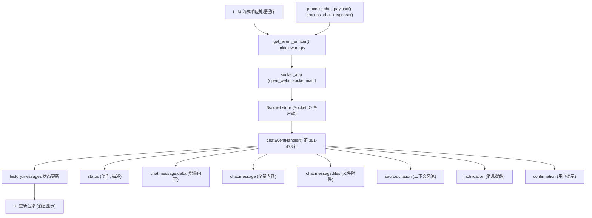
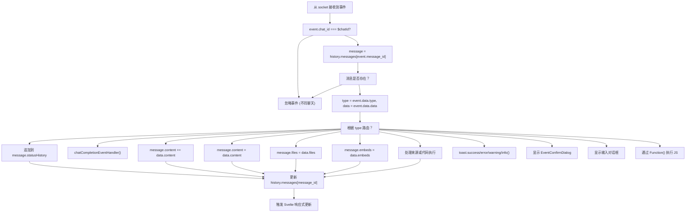
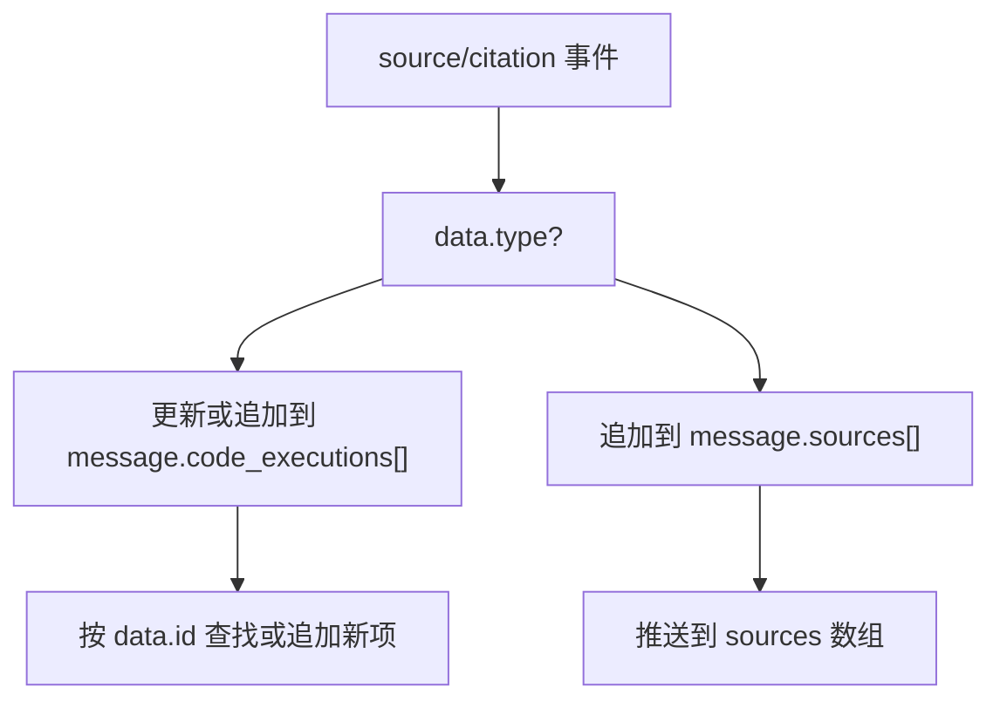
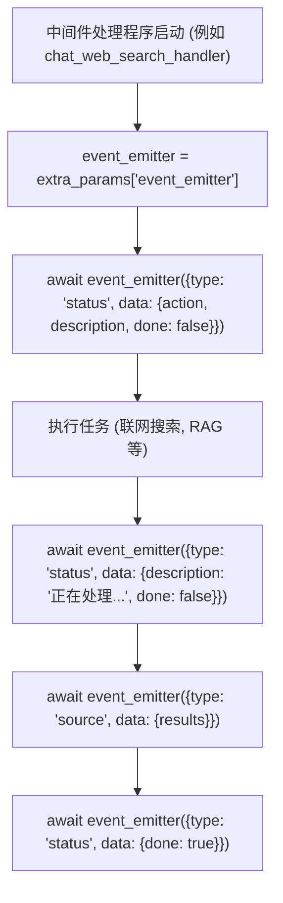

# WebSocket 事件处理

相关源文件

-   [backend/open\_webui/config.py](https://github.com/open-webui/open-webui/blob/a7271532/backend/open_webui/config.py)
-   [backend/open\_webui/main.py](https://github.com/open-webui/open-webui/blob/a7271532/backend/open_webui/main.py)
-   [backend/open\_webui/retrieval/loaders/datalab\_marker.py](https://github.com/open-webui/open-webui/blob/a7271532/backend/open_webui/retrieval/loaders/datalab_marker.py)
-   [backend/open\_webui/retrieval/loaders/external\_document.py](https://github.com/open-webui/open-webui/blob/a7271532/backend/open_webui/retrieval/loaders/external_document.py)
-   [backend/open\_webui/retrieval/loaders/external\_web.py](https://github.com/open-webui/open-webui/blob/a7271532/backend/open_webui/retrieval/loaders/external_web.py)
-   [backend/open\_webui/retrieval/loaders/main.py](https://github.com/open-webui/open-webui/blob/a7271532/backend/open_webui/retrieval/loaders/main.py)
-   [backend/open\_webui/retrieval/loaders/mineru.py](https://github.com/open-webui/open-webui/blob/a7271532/backend/open_webui/retrieval/loaders/mineru.py)
-   [backend/open\_webui/retrieval/loaders/mistral.py](https://github.com/open-webui/open-webui/blob/a7271532/backend/open_webui/retrieval/loaders/mistral.py)
-   [backend/open\_webui/retrieval/utils.py](https://github.com/open-webui/open-webui/blob/a7271532/backend/open_webui/retrieval/utils.py)
-   [backend/open\_webui/routers/retrieval.py](https://github.com/open-webui/open-webui/blob/a7271532/backend/open_webui/routers/retrieval.py)
-   [backend/open\_webui/utils/middleware.py](https://github.com/open-webui/open-webui/blob/a7271532/backend/open_webui/utils/middleware.py)
-   [src/lib/apis/retrieval/index.ts](https://github.com/open-webui/open-webui/blob/a7271532/src/lib/apis/retrieval/index.ts)
-   [src/lib/components/admin/Settings/Documents.svelte](https://github.com/open-webui/open-webui/blob/a7271532/src/lib/components/admin/Settings/Documents.svelte)
-   [src/lib/components/admin/Settings/WebSearch.svelte](https://github.com/open-webui/open-webui/blob/a7271532/src/lib/components/admin/Settings/WebSearch.svelte)
-   [src/lib/components/channel/MessageInput.svelte](https://github.com/open-webui/open-webui/blob/a7271532/src/lib/components/channel/MessageInput.svelte)
-   [src/lib/components/chat/Chat.svelte](https://github.com/open-webui/open-webui/blob/a7271532/src/lib/components/chat/Chat.svelte)
-   [src/lib/components/chat/ChatPlaceholder.svelte](https://github.com/open-webui/open-webui/blob/a7271532/src/lib/components/chat/ChatPlaceholder.svelte)
-   [src/lib/components/chat/MessageInput.svelte](https://github.com/open-webui/open-webui/blob/a7271532/src/lib/components/chat/MessageInput.svelte)
-   [src/lib/components/chat/Placeholder.svelte](https://github.com/open-webui/open-webui/blob/a7271532/src/lib/components/chat/Placeholder.svelte)
-   [src/lib/components/chat/Suggestions.svelte](https://github.com/open-webui/open-webui/blob/a7271532/src/lib/components/chat/Suggestions.svelte)
-   [src/lib/components/common/FileItem.svelte](https://github.com/open-webui/open-webui/blob/a7271532/src/lib/components/common/FileItem.svelte)
-   [src/lib/components/common/FileItemModal.svelte](https://github.com/open-webui/open-webui/blob/a7271532/src/lib/components/common/FileItemModal.svelte)

本文档描述了在聊天交互期间实现 Open WebUI 前端和后端之间双向通信的实时事件系统。WebSocket 事件处理系统管理聊天会话期间的流式响应、状态更新、文件通知和交互式提示词。

有关整体聊天组件架构的信息，请参阅 [聊天组件架构](/open-webui/open-webui/4.1-chat-component-architecture)。有关 WebSocket 交付内容的详细消息渲染，请参阅 [响应消息组件](/open-webui/open-webui/5.1-response-message-component)。

---

## 架构概览

Open WebUI 使用基于 Socket.IO 的 WebSocket 系统在聊天交互期间交付实时更新。后端通过 `socket` store 发送事件，前端在主 Chat 组件中订阅这些事件。

### WebSocket 通信架构


**来源：** [src/lib/components/chat/Chat.svelte29](https://github.com/open-webui/open-webui/blob/a7271532/src/lib/components/chat/Chat.svelte#L29-L29) [src/lib/components/chat/Chat.svelte351-478](https://github.com/open-webui/open-webui/blob/a7271532/src/lib/components/chat/Chat.svelte#L351-L478) [backend/open\_webui/main.py63-69](https://github.com/open-webui/open-webui/blob/a7271532/backend/open_webui/main.py#L63-L69) [backend/open\_webui/utils/middleware.py332-334](https://github.com/open-webui/open-webui/blob/a7271532/backend/open_webui/utils/middleware.py#L332-L334)

---

## 事件订阅与生命周期

### 前端事件订阅

Chat 组件在 `onMount` 生命周期中订阅 WebSocket 事件，并在组件销毁时取消订阅：

> **[Mermaid sequence]**
> *(图表结构无法解析)*

**事件订阅代码：**

-   订阅：[src/lib/components/chat/Chat.svelte552](https://github.com/open-webui/open-webui/blob/a7271532/src/lib/components/chat/Chat.svelte#L552-L552)
-   取消订阅：[src/lib/components/chat/Chat.svelte643](https://github.com/open-webui/open-webui/blob/a7271532/src/lib/components/chat/Chat.svelte#L643-L643)
-   处理函数：[src/lib/components/chat/Chat.svelte351-478](https://github.com/open-webui/open-webui/blob/a7271532/src/lib/components/chat/Chat.svelte#L351-L478)

**来源：** [src/lib/components/chat/Chat.svelte548-634](https://github.com/open-webui/open-webui/blob/a7271532/src/lib/components/chat/Chat.svelte#L548-L634) [src/lib/components/chat/Chat.svelte636-648](https://github.com/open-webui/open-webui/blob/a7271532/src/lib/components/chat/Chat.svelte#L636-L648)

---

## 事件类型参考

`chatEventHandler` 根据 `event.data` 中的 `type` 字段处理事件。下表列出了所有受支持的事件类型：

| 事件类型 | 用途 | 数据负载 | 状态更新 |
| --- | --- | --- | --- |
| `status` | 显示处理状态（例如“正在搜索网络”） | `{action, description, done}` | 追加到 `message.statusHistory` |
| `chat:completion` | 触发完成后的任务（标题生成、标签） | `{content}` | 调用 `chatCompletionEventHandler()` |
| `chat:tasks:cancel` | 取消正在运行的任务并将消息标记为完成 | `{}` | 将消息设置为 `done: true` |
| `chat:message:delta` | 流式传输增量内容块 | `{content}` | 追加到 `message.content` |
| `chat:message` (或 `replace`) | 替换完整消息内容 | `{content}` | 替换 `message.content` |
| `chat:message:files` (或 `files`) | 向消息添加文件附件 | `{files: [...]}` | 设置 `message.files` |
| `chat:message:embeds` (或 `embeds`) | 添加嵌入的 UI 组件 | `{embeds: [...]}` | 设置 `message.embeds` |
| `chat:message:error` | 在消息中显示错误 | `{error}` | 设置 `message.error` |
| `chat:message:follow_ups` | 显示后续建议按钮 | `{follow_ups: [...]}` | 设置 `message.followUps` |
| `chat:title` | 更新聊天标题 | `{title}` | 更新 `chatTitle` store |
| `chat:tags` | 重新生成聊天标签 | `{}` | 重新获取聊天和标签 |
| `source` 或 `citation` | 添加检索来源或代码执行结果 | `{type, ...}` | 追加到 `message.sources` 或 `message.code_executions` |
| `notification` | 显示 Toast 通知 | `{type, content}` | 触发 Toast UI |
| `confirmation` | 请求用户确认 | `{title, message}` | 显示 `EventConfirmDialog` |
| `input` | 请求用户文本输入 | `{title, message, placeholder, value}` | 显示输入对话框 |
| `execute` | 执行客户端 JavaScript | `{code}` | 通过 `Function()` 执行代码 |

**来源：** [src/lib/components/chat/Chat.svelte357-473](https://github.com/open-webui/open-webui/blob/a7271532/src/lib/components/chat/Chat.svelte#L357-L473)

---

## 事件数据结构

### 事件封装 (Event Envelope)

所有 WebSocket 事件都遵循一致的封装结构：

```
{
  chat_id: string,           // 当前聊天会话 ID
  message_id: string,        // 历史树中的目标消息 ID
  data: {
    type: string,            // 事件类型 (见上表)
    data: object            // 针对特定类型的有效负载
  }
}
```
### 事件过滤

`chatEventHandler` 仅处理与当前 `$chatId` 匹配的事件：

```
if (event.chat_id === $chatId) {
  // 处理事件
  let message = history.messages[event.message_id];
  // ...
}
```
这确保了来自其他聊天会话（例如在不同浏览器标签页中）的事件被忽略。

**来源：** [src/lib/components/chat/Chat.svelte354-356](https://github.com/open-webui/open-webui/blob/a7271532/src/lib/components/chat/Chat.svelte#L354-L356)

---

## 事件处理流程

### 主事件处理器流程


**来源：** [src/lib/components/chat/Chat.svelte351-478](https://github.com/open-webui/open-webui/blob/a7271532/src/lib/components/chat/Chat.svelte#L351-L478)

---

## 特殊事件处理器

### 状态事件处理

状态事件维护一个历史数组，显示后端处理的进度：

```
if (type === 'status') {
  if (message?.statusHistory) {
    message.statusHistory.push(data);
  } else {
    message.statusHistory = [data];
  }
}
```
状态数据示例：

```
{
  action: "web_search",
  description: "正在搜索网络",
  done: false
}
```
**来源：** [src/lib/components/chat/Chat.svelte362-367](https://github.com/open-webui/open-webui/blob/a7271532/src/lib/components/chat/Chat.svelte#L362-L367)

### 来源与引用处理

`source` 或 `citation` 事件类型处理两种不同的数据结构：


**代码执行来源：**

-   追踪执行 ID 以进行更新：[src/lib/components/chat/Chat.svelte407-417](https://github.com/open-webui/open-webui/blob/a7271532/src/lib/components/chat/Chat.svelte#L407-L417)
-   结构：`{type: 'code_execution', id, result, ...}`

**常规来源：**

-   RAG 检索来源
-   网络搜索结果
-   工具输出

**来源：** [src/lib/components/chat/Chat.svelte400-425](https://github.com/open-webui/open-webui/blob/a7271532/src/lib/components/chat/Chat.svelte#L400-L425)

### 通知事件处理

通知映射到 Toast 严重级别：

```
if (type === 'notification') {
  const toastType = data?.type ?? 'info';
  const toastContent = data?.content ?? '';

  if (toastType === 'success') {
    toast.success(toastContent);
  } else if (toastType === 'error') {
    toast.error(toastContent);
  } else if (toastType === 'warning') {
    toast.warning(toastContent);
  } else {
    toast.info(toastContent);
  }
}
```
**来源：** [src/lib/components/chat/Chat.svelte426-438](https://github.com/open-webui/open-webui/blob/a7271532/src/lib/components/chat/Chat.svelte#L426-L438)

### 交互式事件处理

**确认对话框：**

```
if (type === 'confirmation') {
  eventCallback = cb;
  showEventConfirmation = true;
  eventConfirmationTitle = data.title;
  eventConfirmationMessage = data.message;
}
```
**输入对话框：**

```
if (type === 'input') {
  eventCallback = cb;
  eventConfirmationInput = true;
  showEventConfirmation = true;
  eventConfirmationTitle = data.title;
  eventConfirmationMessage = data.message;
  eventConfirmationInputPlaceholder = data.placeholder;
  eventConfirmationInputValue = data?.value ?? '';
}
```
两者都存储一个回调函数 (`cb`)，该函数在用户响应时被调用，允许后端根据用户输入继续处理。

**来源：** [src/lib/components/chat/Chat.svelte439-471](https://github.com/open-webui/open-webui/blob/a7271532/src/lib/components/chat/Chat.svelte#L439-L471)

---

## 后端事件发射

### 事件发射器函数

后端使用通过中间件流水线传递的 `event_emitter` 函数：

```python
# 在 middleware.py 中
event_emitter = extra_params["__event_emitter__"]

await event_emitter({
    "type": "status",
    "data": {
        "action": "web_search",
        "description": "正在搜索网络",
        "done": False
    }
})
```
`__event_emitter__` 由 `open_webui.socket.main` 中的 `get_event_emitter()` 创建，并通过 `extra_params` 字典传递给所有中间件处理程序。

**来源：** [backend/open\_webui/utils/middleware.py332-334](https://github.com/open-webui/open-webui/blob/a7271532/backend/open_webui/utils/middleware.py#L332-L334) [backend/open\_webui/utils/middleware.py558-568](https://github.com/open-webui/open-webui/blob/a7271532/backend/open_webui/utils/middleware.py#L558-L568)

### 事件发射器使用模式


**来源：** [backend/open\_webui/utils/middleware.py555-620](https://github.com/open-webui/open-webui/blob/a7271532/backend/open_webui/utils/middleware.py#L555-L620)

---

## 与聊天状态的集成

### 消息状态更新

`history.messages` 对象是所有消息状态的唯一事实来源。WebSocket 事件会修改此对象，从而触发 Svelte 响应式更新：

```javascript
// 事件处理器更新消息
history.messages[event.message_id] = message;

// Svelte 检测到变动并重新渲染
```
**由事件更新的关键状态属性：**

| 属性 | 事件类型 | 用途 |
| --- | --- | --- |
| `content` | `chat:message:delta`, `chat:message` | 消息文本 |
| `statusHistory` | `status` | 处理步骤 |
| `sources` | `source`, `citation` | 上下文来源 |
| `code_executions` | `source` (类型为 code\_execution) | 代码执行结果 |
| `files` | `chat:message:files` | 文件附件 |
| `embeds` | `chat:message:embeds` | 嵌入式 UI |
| `error` | `chat:message:error` | 错误状态 |
| `followUps` | `chat:message:follow_ups` | 建议按钮 |
| `done` | `chat:tasks:cancel` | 完成标志 |

**来源：** [src/lib/components/chat/Chat.svelte147-153](https://github.com/open-webui/open-webui/blob/a7271532/src/lib/components/chat/Chat.svelte#L147-L153) [src/lib/components/chat/Chat.svelte475](https://github.com/open-webui/open-webui/blob/a7271532/src/lib/components/chat/Chat.svelte#L475-L475)

### 自动滚动行为

更新消息状态后，系统会检查是否启用了自动滚动，并滚动以显示新内容：

```javascript
if (type === 'chat:message:follow_ups') {
  message.followUps = data.follow_ups;

  if (autoScroll) {
    scrollToBottom('smooth');
  }
}
```
**来源：** [src/lib/components/chat/Chat.svelte387-392](https://github.com/open-webui/open-webui/blob/a7271532/src/lib/components/chat/Chat.svelte#L387-L392)

---

## 基于 Redis 的分发

在分布式部署中，WebSocket 事件通过 Redis 进行广播，以确保所有连接的客户端都能接收到更新：

```python
# 在 main.py 中
app.state.redis = get_redis_connection(
    redis_url=REDIS_URL,
    redis_sentinels=get_sentinels_from_env(
        REDIS_SENTINEL_HOSTS, REDIS_SENTINEL_PORT
    ),
    redis_cluster=REDIS_CLUSTER,
    async_mode=True,
)
```
这允许水平扩展，多个后端服务器可以向连接到任何服务器实例的客户端发射事件。

**来源：** [backend/open\_webui/main.py586-593](https://github.com/open-webui/open-webui/blob/a7271532/backend/open_webui/main.py#L586-L593) [backend/open\_webui/main.py656](https://github.com/open-webui/open-webui/blob/a7271532/backend/open_webui/main.py#L656-L656)

---

## 错误处理

事件处理器包含错误恢复机制：

1.  **事件过滤**：仅处理与 `$chatId` 匹配的事件。
2.  **消息存在检查**：在更新前验证消息是否存在于 `history.messages` 中。
3.  **安全属性访问**：使用可选链 (`message?.property`)。
4.  **优雅降级**：记录未知的事件类型，但不会导致处理器崩溃。

```javascript
if (event.chat_id === $chatId) {
  await tick();
  let message = history.messages[event.message_id];

  if (message) {
    // 处理事件
  }
}
```
**来源：** [src/lib/components/chat/Chat.svelte354-476](https://github.com/open-webui/open-webui/blob/a7271532/src/lib/components/chat/Chat.svelte#L354-L476)
