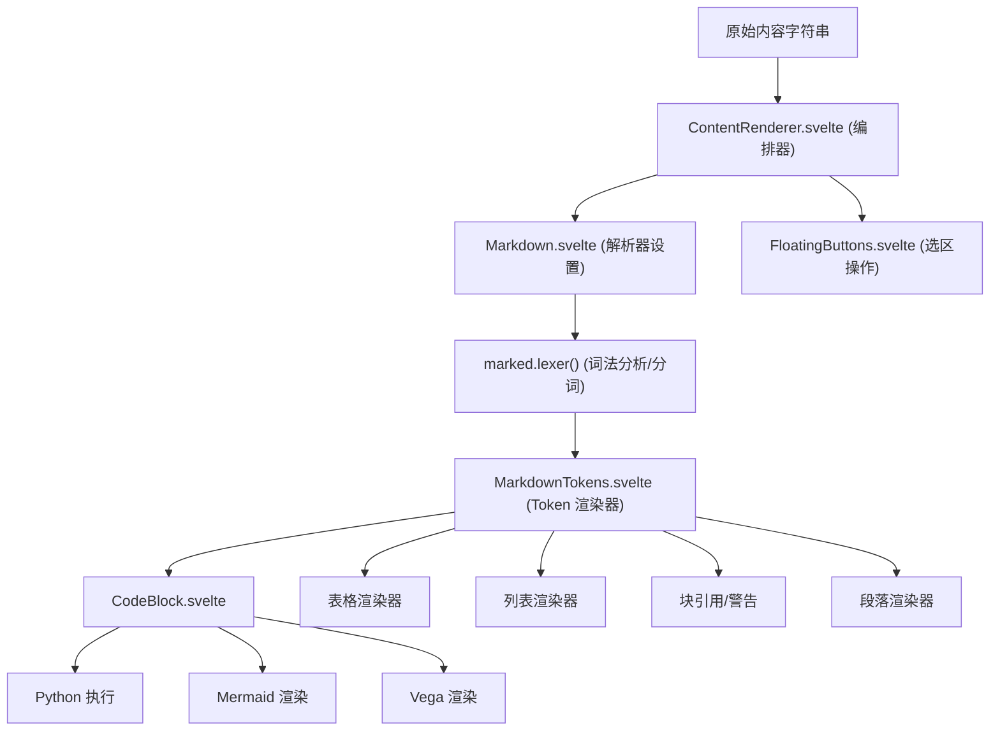
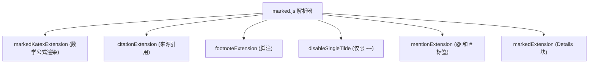
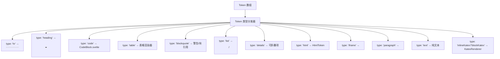

# 消息内容渲染

相关源文件

-   [src/lib/components/chat/ContentRenderer/FloatingButtons.svelte](https://github.com/open-webui/open-webui/blob/a7271532/src/lib/components/chat/ContentRenderer/FloatingButtons.svelte)
-   [src/lib/components/chat/Messages.svelte](https://github.com/open-webui/open-webui/blob/a7271532/src/lib/components/chat/Messages.svelte)
-   [src/lib/components/chat/Messages/CodeBlock.svelte](https://github.com/open-webui/open-webui/blob/a7271532/src/lib/components/chat/Messages/CodeBlock.svelte)
-   [src/lib/components/chat/Messages/ContentRenderer.svelte](https://github.com/open-webui/open-webui/blob/a7271532/src/lib/components/chat/Messages/ContentRenderer.svelte)
-   [src/lib/components/chat/Messages/Markdown.svelte](https://github.com/open-webui/open-webui/blob/a7271532/src/lib/components/chat/Messages/Markdown.svelte)
-   [src/lib/components/chat/Messages/Markdown/AlertRenderer.svelte](https://github.com/open-webui/open-webui/blob/a7271532/src/lib/components/chat/Messages/Markdown/AlertRenderer.svelte)
-   [src/lib/components/chat/Messages/Markdown/MarkdownTokens.svelte](https://github.com/open-webui/open-webui/blob/a7271532/src/lib/components/chat/Messages/Markdown/MarkdownTokens.svelte)
-   [src/lib/components/chat/Messages/Message.svelte](https://github.com/open-webui/open-webui/blob/a7271532/src/lib/components/chat/Messages/Message.svelte)
-   [src/lib/components/chat/Messages/MultiResponseMessages.svelte](https://github.com/open-webui/open-webui/blob/a7271532/src/lib/components/chat/Messages/MultiResponseMessages.svelte)
-   [src/lib/components/chat/Messages/ResponseMessage.svelte](https://github.com/open-webui/open-webui/blob/a7271532/src/lib/components/chat/Messages/ResponseMessage.svelte)
-   [src/lib/components/chat/Messages/UserMessage.svelte](https://github.com/open-webui/open-webui/blob/a7271532/src/lib/components/chat/Messages/UserMessage.svelte)
-   [src/lib/components/chat/Settings/Interface.svelte](https://github.com/open-webui/open-webui/blob/a7271532/src/lib/components/chat/Settings/Interface.svelte)
-   [src/lib/components/chat/SettingsModal.svelte](https://github.com/open-webui/open-webui/blob/a7271532/src/lib/components/chat/SettingsModal.svelte)
-   [src/lib/components/common/Modal.svelte](https://github.com/open-webui/open-webui/blob/a7271532/src/lib/components/common/Modal.svelte)
-   [src/lib/utils/index.ts](https://github.com/open-webui/open-webui/blob/a7271532/src/lib/utils/index.ts)
-   [src/lib/utils/marked/strikethrough-extension.ts](https://github.com/open-webui/open-webui/blob/a7271532/src/lib/utils/marked/strikethrough-extension.ts)
-   [src/lib/workers/pyodide.worker.ts](https://github.com/open-webui/open-webui/blob/a7271532/src/lib/workers/pyodide.worker.ts)
-   [src/routes/(app)/+layout.svelte](https://github.com/open-webui/open-webui/blob/a7271532/src/routes/(app)/+layout.svelte)
-   [src/routes/(app)/+page.svelte](https://github.com/open-webui/open-webui/blob/a7271532/src/routes/(app)/+page.svelte)
-   [src/routes/(app)/c/ˈidˈ/+page.svelte](src/routes/(app)/c/%5Bid%5D/+page.svelte)

## 目的和范围

本文档描述了富内容渲染系统，该系统将带有嵌入代码、图表和数学公式的 Markdown 文本转换为完全渲染的交互式 HTML。渲染管道处理以下内容：

-   带有自定义扩展（KaTeX 数学公式、引用、脚注）的 Markdown 解析
-   代码块语法高亮和执行（通过 Jupyter 或浏览器内的 Python）
-   图表渲染（Mermaid, Vega/Vega-Lite）
-   带有 CSV 导出功能的表格渲染
-   针对所选文本的上下文操作（提问、解释）

有关消息如何在聊天界面中显示和组织的详细信息，请参阅[响应消息渲染](/open-webui/open-webui/3.4-reverse-proxy-setup)。有关编排消息流的聊天组件，请参阅[聊天组件架构](/open-webui/open-webui/3.1-installation-methods)。

---

## 架构概览

消息内容渲染系统遵循从原始 Markdown 文本到完全渲染的交互式内容的多阶段管道：

### 内容渲染管道


**来源：** [src/lib/components/chat/Messages/ContentRenderer.svelte1-223](https://github.com/open-webui/open-webui/blob/a7271532/src/lib/components/chat/Messages/ContentRenderer.svelte#L1-L223) [src/lib/components/chat/Messages/Markdown.svelte1-79](https://github.com/open-webui/open-webui/blob/a7271532/src/lib/components/chat/Messages/Markdown.svelte#L1-L79) [src/lib/components/chat/Messages/Markdown/MarkdownTokens.svelte1-416](https://github.com/open-webui/open-webui/blob/a7271532/src/lib/components/chat/Messages/Markdown/MarkdownTokens.svelte#L1-L416)

---

## 组件层次结构

### ContentRenderer 组件

`ContentRenderer.svelte` 作为内容渲染的顶级编排器。它包装了 Markdown 组件，并管理用于上下文操作的悬浮按钮定位。

**主要职责：**

-   管理 Markdown 渲染生命周期
-   根据选中的文本定位 `FloatingButtons`
-   检测 Artifacts（HTML/SVG 代码）并触发 Artifact 面板显示
-   处理用于选区跟踪的鼠标事件

**Props：**

| Prop | 类型 | 描述 | 
| --- | --- | --- |
| `content` | string | 要渲染的原始 Markdown 内容 |
| `history` | object | 用于上下文的消息历史记录 |
| `messageId` | string | 当前消息的 ID |
| `done` | boolean | 流式传输是否已完成 |
| `sources` | array | 带有引用的 RAG 来源 |
| `save` | boolean | 启用代码块上的保存按钮 |
| `editCodeBlock` | boolean | 启用代码编辑 |
| `floatingButtons` | boolean | 启用选区操作 |

**来源：** [src/lib/components/chat/Messages/ContentRenderer.svelte1-223](https://github.com/open-webui/open-webui/blob/a7271532/src/lib/components/chat/Messages/ContentRenderer.svelte#L1-L223)

---

### Markdown 组件

`Markdown.svelte` 使用自定义扩展配置 `marked.js` 解析器并启动分词。

**扩展配置：**


**扩展加载：**

```
// Markdown.svelte 中的第 43-50 行
marked.use(markedKatexExtension(options));
marked.use(markedExtension(options));
marked.use(citationExtension(options));
marked.use(footnoteExtension(options));
marked.use(disableSingleTilde);
marked.use({
    extensions: [mentionExtension({ triggerChar: '@' }),
                 mentionExtension({ triggerChar: '#' })]
});
```
**Token 处理：** 组件使用 `marked.lexer()` 将 Markdown 转换为 Token 树，然后将这些 Token 传递给 `MarkdownTokens` 进行渲染。

**来源：** [src/lib/components/chat/Messages/Markdown.svelte1-79](https://github.com/open-webui/open-webui/blob/a7271532/src/lib/components/chat/Messages/Markdown.svelte#L1-L79) [src/lib/utils/marked/strikethrough-extension.ts1-30](https://github.com/open-webui/open-webui/blob/a7271532/src/lib/utils/marked/strikethrough-extension.ts#L1-L30)

---

## Token 渲染系统

### MarkdownTokens 组件

`MarkdownTokens.svelte` 递归地渲染由 `marked.lexer()` 生成的 Token 树。每种 Token 类型都有专门的渲染逻辑。

**Token 类型分发：**


**关键 Token 处理程序：**

| Token 类型 | 处理程序 | 描述 |
| --- | --- | --- |
| `code` | `CodeBlock.svelte` | 语法高亮、执行、图表 |
| `table` | 表格渲染器 | 渲染带有 CSV 导出功能的表格 |
| `blockquote` | 警告或块引用 | GitHub 风格的警告（NOTE, TIP 等） |
| `list` | 列表渲染器 | 带有任务复选框的有序/无序列表 |
| `details` | `Collapsible.svelte` | 可展开的详细信息块 |
| `inlineKatex`/`blockKatex` | `KatexRenderer.svelte` | 数学公式渲染 |

**来源：** [src/lib/components/chat/Messages/Markdown/MarkdownTokens.svelte1-416](https://github.com/open-webui/open-webui/blob/a7271532/src/lib/components/chat/Messages/Markdown/MarkdownTokens.svelte#L1-L416)

---

### 表格渲染与导出

表格渲染具有交互功能：

**表格功能：**

-   支持对齐的可排序列
-   将表格复制为 Markdown
-   导出为 CSV 格式

**CSV 导出实现：**

```
// MarkdownTokens.svelte 中的第 53-87 行
const exportTableToCSVHandler = (token, tokenIdx = 0) => {
    const header = token.header.map((headerCell) =>
        `"${headerCell.text.replace(/