# 响应消息组件

相关源文件

-   [src/lib/components/chat/Messages.svelte](https://github.com/open-webui/open-webui/blob/a7271532/src/lib/components/chat/Messages.svelte)
-   [src/lib/components/chat/Messages/ResponseMessage.svelte](https://github.com/open-webui/open-webui/blob/a7271532/src/lib/components/chat/Messages/ResponseMessage.svelte)
-   [src/lib/components/chat/Messages/UserMessage.svelte](https://github.com/open-webui/open-webui/blob/a7271532/src/lib/components/chat/Messages/UserMessage.svelte)
-   [src/lib/components/chat/Settings/Interface.svelte](https://github.com/open-webui/open-webui/blob/a7271532/src/lib/components/chat/Settings/Interface.svelte)
-   [src/lib/components/chat/SettingsModal.svelte](https://github.com/open-webui/open-webui/blob/a7271532/src/lib/components/chat/SettingsModal.svelte)
-   [src/lib/components/common/Modal.svelte](https://github.com/open-webui/open-webui/blob/a7271532/src/lib/components/common/Modal.svelte)
-   [src/lib/utils/index.ts](https://github.com/open-webui/open-webui/blob/a7271532/src/lib/utils/index.ts)
-   [src/routes/(app)/+layout.svelte](https://github.com/open-webui/open-webui/blob/a7271532/src/routes/(app)/+layout.svelte)
-   [src/routes/(app)/+page.svelte](https://github.com/open-webui/open-webui/blob/a7271532/src/routes/(app)/+page.svelte)
-   [src/routes/(app)/c/\[id\]/+page.svelte](src/routes/(app)/c/%5Bid%5D/+page.svelte)

## 目的与范围

响应消息组件 (`ResponseMessage.svelte`) 负责在聊天界面中渲染单个助手/模型消息。它管理消息内容的显示，处理用户交互（编辑、复制、评分、TTS），并集成了包括引用、代码执行、联网搜索结果和后续问题在内的多种功能。

有关整体消息渲染流水线的信息，请参阅 [内容渲染流水线](/open-webui/open-webui/5.2-content-rendering-pipeline)。有关用户发起的消息，请参阅 Messages 系统中的 UserMessage 组件。有关处理多个模型响应的信息，请参阅 [多模型响应显示](/open-webui/open-webui/5.5-multi-model-response-display)。

---

## 组件架构

### 组件角色与职责

`ResponseMessage.svelte` 充当助手响应渲染的编排者。它由 `Message.svelte` 为对话树中的每个助手消息实例化，并管理：

-   通过 `ContentRenderer` 显示消息内容
-   操作按钮（编辑、复制、评分、TTS、重新生成）
-   状态更新和流式传输指示器
-   引用和代码执行结果
-   文件附件和嵌入式 iframe
-   兄弟消息导航
-   反馈/评分收集

**组件层级：**

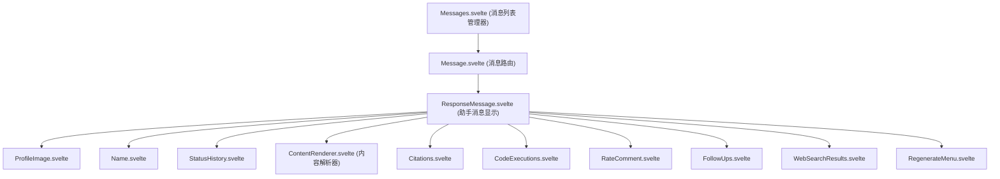
来源： [src/lib/components/chat/Messages/ResponseMessage.svelte1-65](https://github.com/open-webui/open-webui/blob/a7271532/src/lib/components/chat/Messages/ResponseMessage.svelte#L1-L65) [src/lib/components/chat/Messages.svelte1-50](https://github.com/open-webui/open-webui/blob/a7271532/src/lib/components/chat/Messages.svelte#L1-L50)

---

## Props 与数据接口

### 消息数据结构

组件接收一个 `MessageType` 接口，该接口定义了消息结构：

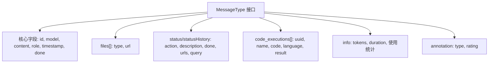
**关键 Props：**

| Prop | 类型 | 用途 |
| --- | --- | --- |
| `chatId` | string | 当前聊天标识符 |
| `history` | object | 完整的消息树结构 |
| `messageId` | string | 此特定消息的 ID |
| `siblings` | array | 同一层级的兄弟消息 ID 数组 |
| `selectedModels` | array | 当前选定的模型 ID 列表 |
| `isLastMessage` | boolean | 是否为最新的一条消息 |
| `readOnly` | boolean | 禁用编辑功能 |
| `editCodeBlock` | boolean | 启用代码块编辑 |

来源： [src/lib/components/chat/Messages/ResponseMessage.svelte66-152](https://github.com/open-webui/open-webui/blob/a7271532/src/lib/components/chat/Messages/ResponseMessage.svelte#L66-L152)

---

## 操作处理器系统

### 操作处理器流程

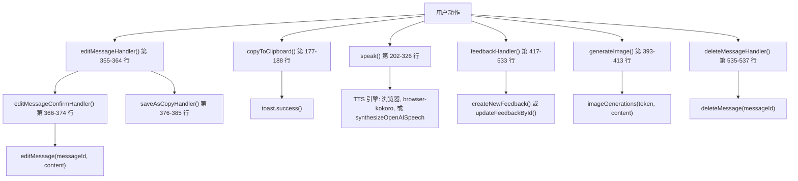
### 复制到剪贴板处理器

复制功能会移除 `<details>` 标签，并可在复制前可选地添加水印：

-   **函数：** `copyToClipboard` [src/lib/components/chat/Messages/ResponseMessage.svelte177-188](https://github.com/open-webui/open-webui/blob/a7271532/src/lib/components/chat/Messages/ResponseMessage.svelte#L177-L188)
-   **流程：**
    1.  通过 `removeAllDetails()` 移除所有 `<details>` 块。
    2.  如果已配置，则追加 `$config?.ui?.response_watermark`。
    3.  调用 `_copyToClipboard()` 复制格式化后的内容。
    4.  通过 `$settings?.copyFormatted` 支持格式化复制。

### 文本转语音 (TTS) 处理器

TTS 系统支持多个引擎和流式音频播放：

**TTS 特性：**

-   **内容分割：** 消息按标点符号或换行符分割，以便进行渐进式播放。
-   **Browser Kokoro：** 使用 WebAssembly worker 的本地 TTS [src/lib/components/chat/Messages/ResponseMessage.svelte270-299](https://github.com/open-webui/open-webui/blob/a7271532/src/lib/components/chat/Messages/ResponseMessage.svelte#L270-L299)。
-   **OpenAI TTS：** 通过 API 进行服务器端合成 [src/lib/components/chat/Messages/ResponseMessage.svelte301-323](https://github.com/open-webui/open-webui/blob/a7271532/src/lib/components/chat/Messages/ResponseMessage.svelte#L301-L323)。
-   **音频队列：** 具有播放速率控制的渐进式流媒体 [src/lib/components/chat/Messages/ResponseMessage.svelte247-252](https://github.com/open-webui/open-webui/blob/a7271532/src/lib/components/chat/Messages/ResponseMessage.svelte#L247-L252)。
-   **对话模式：** TTS 完成后自动触发语音输入 [src/lib/components/chat/Messages/ResponseMessage.svelte234-236](https://github.com/open-webui/open-webui/blob/a7271532/src/lib/components/chat/Messages/ResponseMessage.svelte#L234-L236)。

来源： [src/lib/components/chat/Messages/ResponseMessage.svelte202-326](https://github.com/open-webui/open-webui/blob/a7271532/src/lib/components/chat/Messages/ResponseMessage.svelte#L202-L326)

### 编辑消息系统

编辑系统在编辑期间会保留 `<details>` 块：

**编辑流程：**

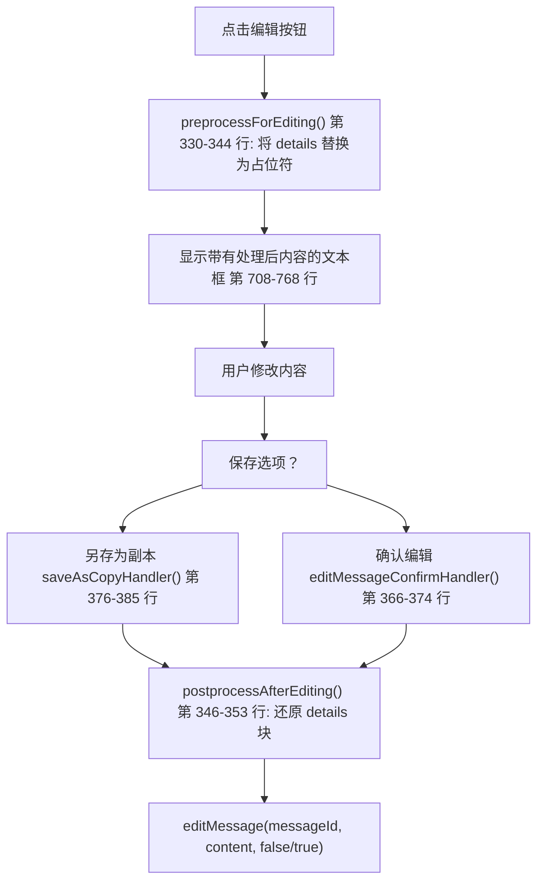
**Details 块处理：**

-   `preprocessForEditing()` 将 `<details>...</details>` 替换为占位符，如 `<details id="__DETAIL_0__"/>`。
-   块内容存储在 `preprocessedDetailsCache` 数组中。
-   `postprocessAfterEditing()` 根据 ID 还原原始块。
-   支持在不破坏结构化内容的情况下进行编辑。

来源： [src/lib/components/chat/Messages/ResponseMessage.svelte330-391](https://github.com/open-webui/open-webui/blob/a7271532/src/lib/components/chat/Messages/ResponseMessage.svelte#L330-L391)

### 反馈与评分系统

反馈处理器创建或更新评估记录：

**反馈数据流：**

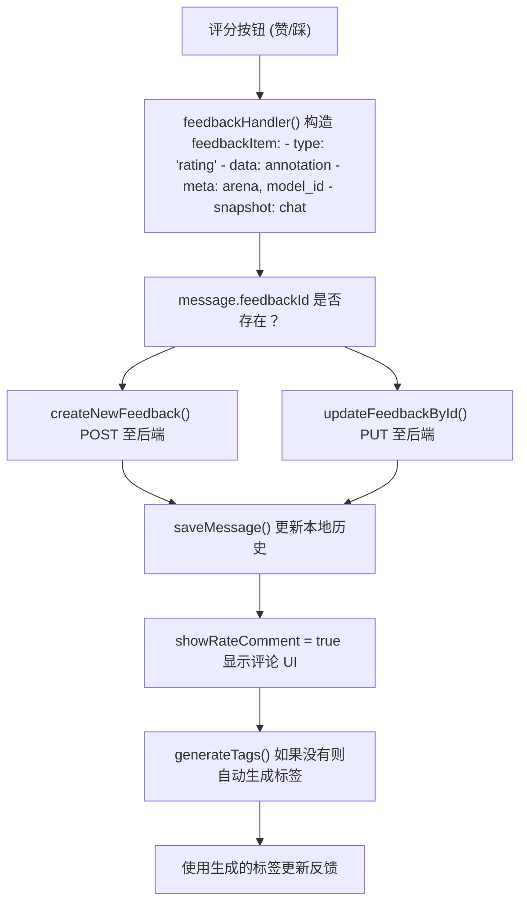
**反馈项结构：**

```
{
  type: 'rating',
  data: {
    rating: number,
    model_id: string,
    sibling_model_ids?: string[],  // 用于竞技场 (arena) 比较
    tags?: string[]
  },
  meta: {
    arena: boolean,
    model_id: string,
    message_id: string,
    message_index: number,
    chat_id: string,
    base_models: { [modelId]: base_model_id }
  },
  snapshot: {
    chat: ChatObject
  }
}
```
来源： [src/lib/components/chat/Messages/ResponseMessage.svelte417-533](https://github.com/open-webui/open-webui/blob/a7271532/src/lib/components/chat/Messages/ResponseMessage.svelte#L417-L533)

---

## 内容显示系统

### 渲染流程

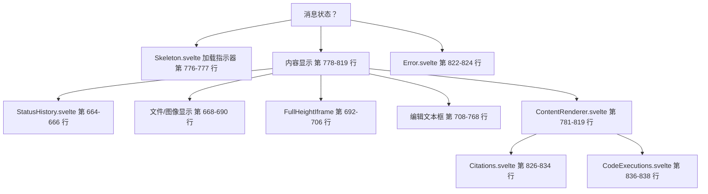
### ContentRenderer 集成

组件将内容解析委托给 `ContentRenderer.svelte`：

**ContentRenderer Props：**

| Prop | 值 | 用途 |
| --- | --- | --- |
| `id` | `${chatId}-${message.id}` | 唯一标识符 |
| `messageId` | message.id | 消息引用 |
| `history` | history | 完整的消息树 |
| `selectedModels` | selectedModels | 模型上下文 |
| `content` | message.content | 原始消息文本 |
| `sources` | message.sources | 引用来源 |
| `floatingButtons` | 条件判断 | 显示文本选择操作 |
| `save` | !readOnly | 启用保存功能 |
| `preview` | !readOnly | 启用预览模式 |
| `editCodeBlock` | editCodeBlock | 代码块编辑 |
| `done` | message.done | 流式传输完成标志 |
| `model` | model | 模型元数据 |

**事件处理器：**

-   `onSourceClick`：通过 `citationsElement?.showSourceModal(id)` 打开引用模态框 [src/lib/components/chat/Messages/ResponseMessage.svelte802-808](https://github.com/open-webui/open-webui/blob/a7271532/src/lib/components/chat/Messages/ResponseMessage.svelte#L802-L808)。
-   `onAddMessages`：通过 `addMessages({ modelId, parentId, messages })` 向树中添加消息 [src/lib/components/chat/Messages/ResponseMessage.svelte809-811](https://github.com/open-webui/open-webui/blob/a7271532/src/lib/components/chat/Messages/ResponseMessage.svelte#L809-L811)。
-   `onSave`：更新消息内容并通过 `updateChat()` 持久化 [src/lib/components/chat/Messages/ResponseMessage.svelte812-818](https://github.com/open-webui/open-webui/blob/a7271532/src/lib/components/chat/Messages/ResponseMessage.svelte#L812-L818)。

来源： [src/lib/components/chat/Messages/ResponseMessage.svelte771-819](https://github.com/open-webui/open-webui/blob/a7271532/src/lib/components/chat/Messages/ResponseMessage.svelte#L771-L819)

---

## 操作按钮布局

### 按钮容器系统

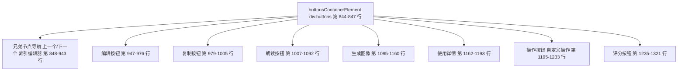
### 水平滚动处理器

按钮容器支持在溢出时进行水平滚动：

-   **元素：** `buttonsContainerElement` [src/lib/components/chat/Messages/ResponseMessage.svelte157](https://github.com/open-webui/open-webui/blob/a7271532/src/lib/components/chat/Messages/ResponseMessage.svelte#L157-L157)。
-   **处理器：** `buttonsWheelHandler` [src/lib/components/chat/Messages/ResponseMessage.svelte545-559](https://github.com/open-webui/open-webui/blob/a7271532/src/lib/components/chat/Messages/ResponseMessage.svelte#L545-L559)。
-   **逻辑：** 在内容溢出时，将垂直滚轮事件转换为水平滚动。
-   **生命周期：** 在 `onMount()` 中添加，在 `onDestroy()` 中移除。

来源： [src/lib/components/chat/Messages/ResponseMessage.svelte545-610](https://github.com/open-webui/open-webui/blob/a7271532/src/lib/components/chat/Messages/ResponseMessage.svelte#L545-L610)

---

## 兄弟消息导航

### 导航系统

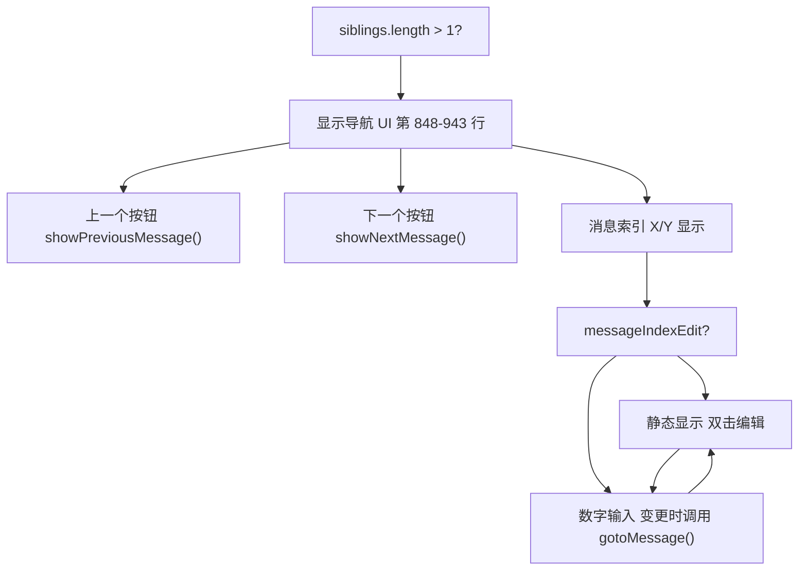
**导航函数：**

-   `showPreviousMessage(message)`：导航到上一个兄弟节点 [作为 prop 传递]。
-   `showNextMessage(message)`：导航到下一个兄弟节点 [作为 prop 传递]。
-   `gotoMessage(message, idx)`：跳转到特定的兄弟节点索引 [作为 prop 传递]。

**索引编辑器：**

-   双击索引数字激活编辑模式。
-   输入数字并按 Enter 或失焦以进行导航。
-   为具有多个兄弟节点的消息提供直接跳转功能。

来源： [src/lib/components/chat/Messages/ResponseMessage.svelte848-943](https://github.com/open-webui/open-webui/blob/a7271532/src/lib/components/chat/Messages/ResponseMessage.svelte#L848-L943)

---

## 状态更新与流式传输

### 状态显示机制

组件在消息生成期间显示实时状态更新：

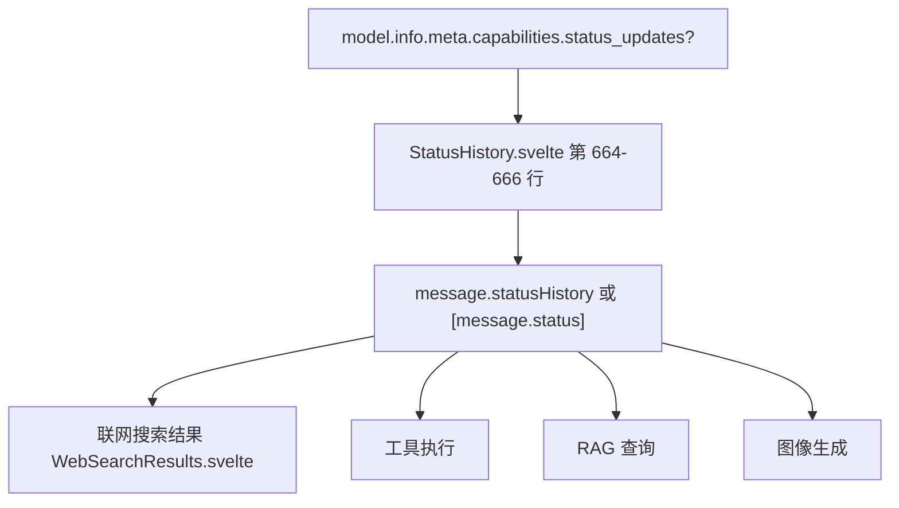
**状态历史结构 (Status History Structure)：**

```
statusHistory?: {
  done: boolean;
  action: string;
  description: string;
  urls?: string[];
  query?: string;
}[]
```
**显示逻辑：**

-   当 `content === ''` 且没有可见的状态更新时显示 `Skeleton.svelte` [src/lib/components/chat/Messages/ResponseMessage.svelte776-777](https://github.com/open-webui/open-webui/blob/a7271532/src/lib/components/chat/Messages/ResponseMessage.svelte#L776-L777)。
-   隐藏的状态更新 (`.hidden === true`) 不会阻止骨架屏显示。
-   可通过 `model.info.meta.capabilities.status_updates` 为每个模型禁用该功能。

来源： [src/lib/components/chat/Messages/ResponseMessage.svelte664-690](https://github.com/open-webui/open-webui/blob/a7271532/src/lib/components/chat/Messages/ResponseMessage.svelte#L664-L690) [src/lib/components/chat/Messages/ResponseMessage/StatusHistory.svelte](https://github.com/open-webui/open-webui/blob/a7271532/src/lib/components/chat/Messages/ResponseMessage/StatusHistory.svelte)

---

## 附加功能集成

### 后续问题系统

消息完成后显示后续建议：

-   **组件：** `FollowUps.svelte` [src/lib/components/chat/Messages/ResponseMessage.svelte1323-1340](https://github.com/open-webui/open-webui/blob/a7271532/src/lib/components/chat/Messages/ResponseMessage.svelte#L1323-L1340)。
-   **条件：** `message.done && message.followUps?.length > 0`。
-   **Props：**
    -   `chatId`：当前聊天 ID。
    -   `followUps`：后续提示词数组。
    -   `submitMessage`：将后续问题作为新消息发送的回调函数。

### 重新生成菜单

消息完成后提供重新生成选项：

-   **组件：** `RegenerateMenu.svelte` [src/lib/components/chat/Messages/ResponseMessage.svelte1343-1360](https://github.com/open-webui/open-webui/blob/a7271532/src/lib/components/chat/Messages/ResponseMessage.svelte#L1343-L1360)。
-   **显示条件：**
    -   `isLastMessage === true`
    -   `!readOnly`
    -   用户具有重新生成权限
    -   `$settings?.regenerateMenu !== false`
-   **动作：**
    -   `regenerateResponse(message, mergeMode)`
    -   `continueResponse(message)`

### 内容复制处理器

针对样式内容的自定义复制行为：

-   **处理器：** `contentCopyHandler` [src/lib/components/chat/Messages/ResponseMessage.svelte561-587](https://github.com/open-webui/open-webui/blob/a7271532/src/lib/components/chat/Messages/ResponseMessage.svelte#L561-L587)。
-   **功能：** 拦截复制事件以清理 HTML 样式。
-   **流程：**
    1.  从 DOM 中捕获选定的内容。
    2.  移除背景、颜色和字体样式。
    3.  格式化表格以保持样式一致。
    4.  为剪贴板设置 HTML 和纯文本数据。

来源： [src/lib/components/chat/Messages/ResponseMessage.svelte1323-1360](https://github.com/open-webui/open-webui/blob/a7271532/src/lib/components/chat/Messages/ResponseMessage.svelte#L1323-L1340) [src/lib/components/chat/Messages/ResponseMessage.svelte561-610](https://github.com/open-webui/open-webui/blob/a7271532/src/lib/components/chat/Messages/ResponseMessage.svelte#L561-L610)

---

## 状态管理

### 本地状态变量

| 变量 | 类型 | 用途 |
| --- | --- | --- |
| `message` | MessageType | 消息数据的本地副本，响应式同步 |
| `model` | object | 来自 `$models` store 的模型元数据 |
| `edit` | boolean | 编辑模式开关 |
| `editedContent` | string | 编辑期间的内容 |
| `speaking` | boolean | TTS 播放处于活跃状态 |
| `loadingSpeech` | boolean | TTS 生成进行中 |
| `generatingImage` | boolean | 图像生成进行中 |
| `showRateComment` | boolean | 评分评论 UI 可见 |
| `feedbackLoading` | boolean | 反馈提交进行中 |
| `messageIndexEdit` | boolean | 消息索引输入处于活跃状态 |

### 响应式同步模式

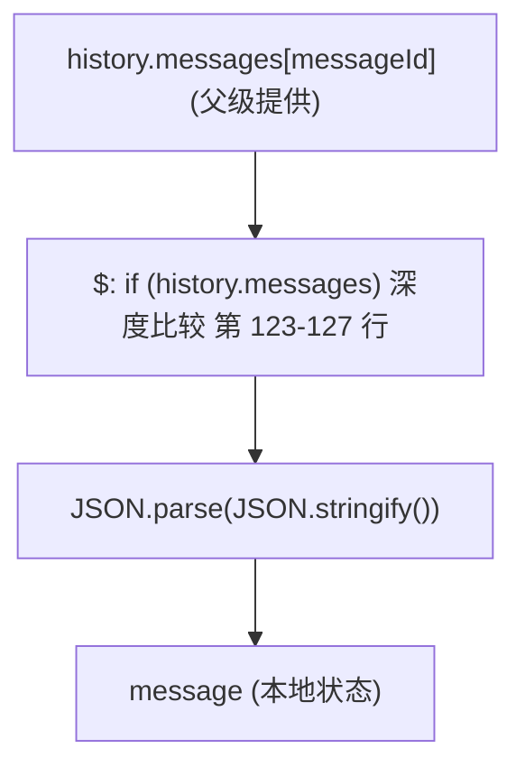
**同步逻辑：**

-   比较序列化后的 JSON 以检测变化 [src/lib/components/chat/Messages/ResponseMessage.svelte123-127](https://github.com/open-webui/open-webui/blob/a7271532/src/lib/components/chat/Messages/ResponseMessage.svelte#L123-L127)。
-   创建深拷贝以防止引用变动。
-   确保 UI 反映父级提供的最新消息状态。

来源： [src/lib/components/chat/Messages/ResponseMessage.svelte122-152](https://github.com/open-webui/open-webui/blob/a7271532/src/lib/components/chat/Messages/ResponseMessage.svelte#L122-L152)

---

## 集成点

### 父级通信

**来自 Messages.svelte 的 Props：**

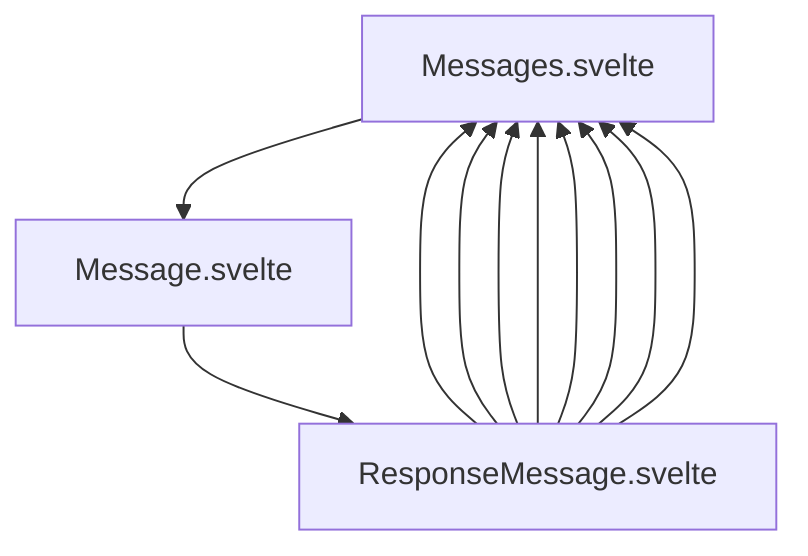
**回调函数：**

-   `editMessage(messageId, content, submit)`：修改消息内容 [prop]。
-   `deleteMessage(messageId)`：从树中移除消息 [prop]。
-   `rateMessage(messageId, rating)`：更新评分 [prop]。
-   `saveMessage(messageId, message)`：持久化消息变更 [prop]。
-   `updateChat()`：同步变更至后端 [prop]。
-   `submitMessage()`：发送新消息 [prop]。
-   `regenerateResponse(message, mergeMode)`：重新生成响应 [prop]。
-   `continueResponse(message)`：继续部分响应 [prop]。
-   `addMessages(params)`：向树中添加消息 [prop]。

来源： [src/lib/components/chat/Messages/ResponseMessage.svelte131-148](https://github.com/open-webui/open-webui/blob/a7271532/src/lib/components/chat/Messages/ResponseMessage.svelte#L131-L148) [src/lib/components/chat/Messages.svelte255-389](https://github.com/open-webui/open-webui/blob/a7271532/src/lib/components/chat/Messages.svelte#L255-L389)

---

## 总结

`ResponseMessage.svelte` 是一个功能丰富的组件，它编排了助手消息的显示，并具有广泛的操作处理能力。它集成了多个子系统（TTS、引用、代码执行、反馈），同时通过组件组合保持了关注点的清晰分离。响应式状态管理确保了 UI 的一致性，而编辑系统则在修改期间保留了复杂的内容结构。

关键架构模式：

-   **深拷贝同步**：用于安全的本地状态管理。
-   **条件渲染**：基于消息状态和能力的渲染。
-   **事件委托**：将树修改操作委托给父级。
-   **渐进式增强**：通过功能标志和权限进行控制。
-   **预处理/后处理**：用于在编辑期间保留内容。

来源： [src/lib/components/chat/Messages/ResponseMessage.svelte1-1791](https://github.com/open-webui/open-webui/blob/a7271532/src/lib/components/chat/Messages/ResponseMessage.svelte#L1-L1791)
