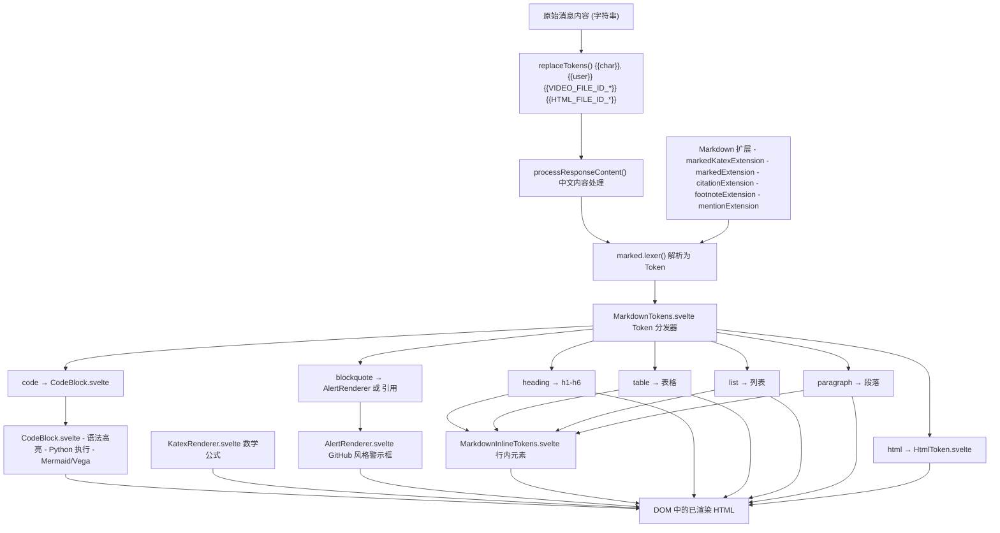
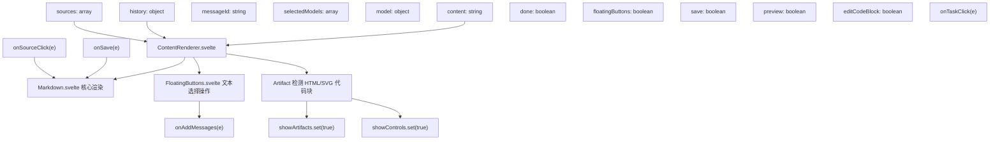
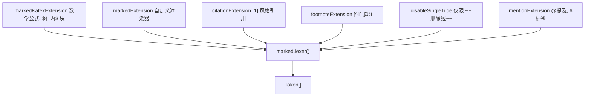
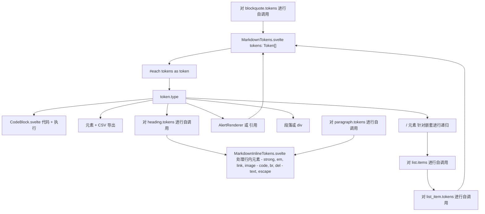
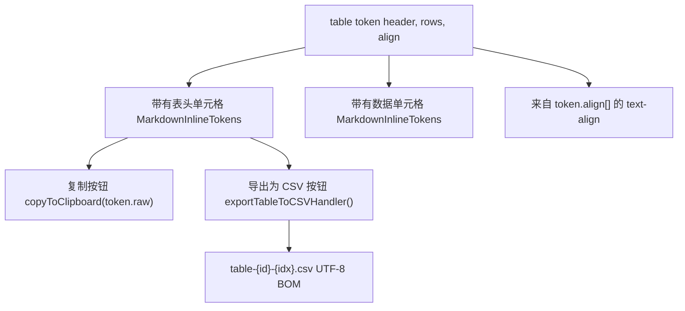
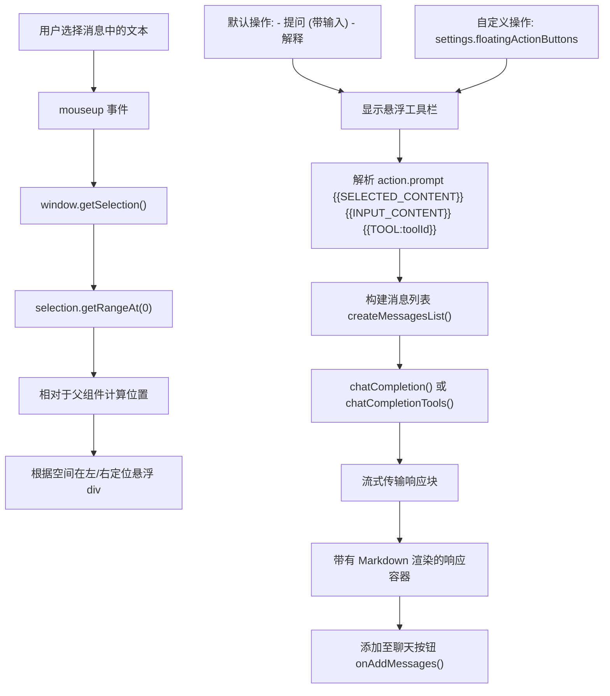
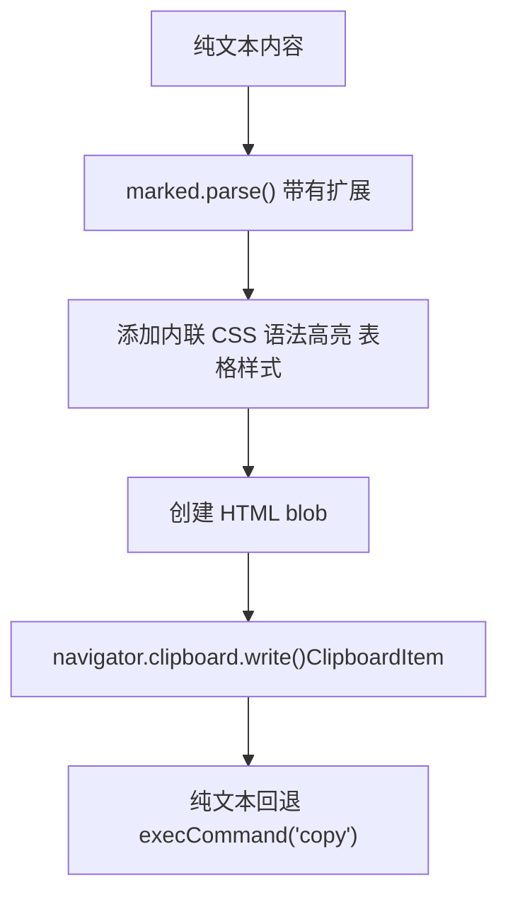

# 内容渲染流水线

相关源文件

-   [src/lib/components/chat/ContentRenderer/FloatingButtons.svelte](https://github.com/open-webui/open-webui/blob/a7271532/src/lib/components/chat/ContentRenderer/FloatingButtons.svelte)
-   [src/lib/components/chat/Messages.svelte](https://github.com/open-webui/open-webui/blob/a7271532/src/lib/components/chat/Messages.svelte)
-   [src/lib/components/chat/Messages/CodeBlock.svelte](https://github.com/open-webui/open-webui/blob/a7271532/src/lib/components/chat/Messages/CodeBlock.svelte)
-   [src/lib/components/chat/Messages/ContentRenderer.svelte](https://github.com/open-webui/open-webui/blob/a7271532/src/lib/components/chat/Messages/ContentRenderer.svelte)
-   [src/lib/components/chat/Messages/Markdown.svelte](https://github.com/open-webui/open-webui/blob/a7271532/src/lib/components/chat/Messages/Markdown.svelte)
-   [src/lib/components/chat/Messages/Markdown/AlertRenderer.svelte](https://github.com/open-webui/open-webui/blob/a7271532/src/lib/components/chat/Messages/Markdown/AlertRenderer.svelte)
-   [src/lib/components/chat/Messages/Markdown/MarkdownTokens.svelte](https://github.com/open-webui/open-webui/blob/a7271532/src/lib/components/chat/Messages/Markdown/MarkdownTokens.svelte)
-   [src/lib/components/chat/Messages/Message.svelte](https://github.com/open-webui/open-webui/blob/a7271532/src/lib/components/chat/Messages/Message.svelte)
-   [src/lib/components/chat/Messages/MultiResponseMessages.svelte](https://github.com/open-webui/open-webui/blob/a7271532/src/lib/components/chat/Messages/MultiResponseMessages.svelte)
-   [src/lib/components/chat/Messages/ResponseMessage.svelte](https://github.com/open-webui/open-webui/blob/a7271532/src/lib/components/chat/Messages/ResponseMessage.svelte)
-   [src/lib/components/chat/Messages/UserMessage.svelte](https://github.com/open-webui/open-webui/blob/a7271532/src/lib/components/chat/Messages/UserMessage.svelte)
-   [src/lib/components/chat/Settings/Interface.svelte](https://github.com/open-webui/open-webui/blob/a7271532/src/lib/components/chat/Settings/Interface.svelte)
-   [src/lib/components/chat/SettingsModal.svelte](https://github.com/open-webui/open-webui/blob/a7271532/src/lib/components/chat/SettingsModal.svelte)
-   [src/lib/components/common/Modal.svelte](https://github.com/open-webui/open-webui/blob/a7271532/src/lib/components/common/Modal.svelte)
-   [src/lib/utils/index.ts](https://github.com/open-webui/open-webui/blob/a7271532/src/lib/utils/index.ts)
-   [src/lib/utils/marked/strikethrough-extension.ts](https://github.com/open-webui/open-webui/blob/a7271532/src/lib/utils/marked/strikethrough-extension.ts)
-   [src/lib/workers/pyodide.worker.ts](https://github.com/open-webui/open-webui/blob/a7271532/src/lib/workers/pyodide.worker.ts)
-   [src/routes/(app)/+layout.svelte](https://github.com/open-webui/open-webui/blob/a7271532/src/routes/(app)/+layout.svelte)
-   [src/routes/(app)/+page.svelte](https://github.com/open-webui/open-webui/blob/a7271532/src/routes/(app)/+page.svelte)
-   [src/routes/(app)/c/ˈidˈ/+page.svelte](src/routes/(app)/c/%5Bid%5D/+page.svelte)

## 目的与范围

内容渲染流水线将来自 LLM 响应的原始消息内容（通常是 Markdown 文本）转换为丰富的交互式 HTML，支持数学公式、代码执行、图表、引用和上下文相关的操作。该流水线处理从纯文本到完全渲染的 UI 组件的完整转换过程。

有关编排消息显示和用户交互的 ResponseMessage 组件的信息，请参阅 [5.1](/open-webui/open-webui/5.1-response-message-component)。有关 Markdown 语法和扩展的详情，请参阅 [5.3](/open-webui/open-webui/5.3-markdown-processing)。有关代码执行能力，请参阅 [5.4](/open-webui/open-webui/5.4-code-block-execution)。有关文本选择操作，请参阅 [5.6](/open-webui/open-webui/5.6-content-selection-actions)。

---

## 流水线架构概览

渲染流水线由三个主要阶段组成：预处理、Token 生成以及针对不同内容类型的专用处理程序的递归渲染。

**流水线流程图**


**来源：**

-   [src/lib/components/chat/Messages/ContentRenderer.svelte1-217](https://github.com/open-webui/open-webui/blob/a7271532/src/lib/components/chat/Messages/ContentRenderer.svelte#L1-L217)
-   [src/lib/components/chat/Messages/Markdown.svelte1-79](https://github.com/open-webui/open-webui/blob/a7271532/src/lib/components/chat/Messages/Markdown.svelte#L1-L79)
-   [src/lib/components/chat/Messages/Markdown/MarkdownTokens.svelte1-448](https://github.com/open-webui/open-webui/blob/a7271532/src/lib/components/chat/Messages/Markdown/MarkdownTokens.svelte#L1-L448)
-   [src/lib/utils/index.ts36-75](https://github.com/open-webui/open-webui/blob/a7271532/src/lib/utils/index.ts#L36-L75)
-   [src/lib/utils/index.ts88-135](https://github.com/open-webui/open-webui/blob/a7271532/src/lib/utils/index.ts#L88-L135)

---

## ContentRenderer 组件

`ContentRenderer.svelte` 是渲染流水线的入口点。它包装了 Markdown 组件，并管理交互式功能，如悬浮操作按钮和产物 (Artifact) 检测。

**组件职责**


**来源 ID 处理 (Source ID Processing)**

ContentRenderer 将 `sources` 数组转换为用于引用链接的 `sourceIds`。处理每个来源的文档以提取可识别的名称或 URL。

来源：

-   [src/lib/components/chat/Messages/ContentRenderer.svelte1-217](https://github.com/open-webui/open-webui/blob/a7271532/src/lib/components/chat/Messages/ContentRenderer.svelte#L1-L217)
-   [src/lib/components/chat/Messages/ContentRenderer.svelte136-202](https://github.com/open-webui/open-webui/blob/a7271532/src/lib/components/chat/Messages/ContentRenderer.svelte#L136-L202)

---

## Token 替换与预处理

在 Markdown 解析之前，原始内容会经过 Token 替换和预处理，以处理特殊的占位符和特定语言的格式化问题。

**replaceTokens 函数**

`utils/index.ts` 中的 `replaceTokens` 函数在保留代码块的同时处理占位符 Token：

| Token 模式 | 替换内容 | 用途 |
| --- | --- | --- |
| `{{char}}` | 模型名称 | 模型人格化 |
| `{{user}}` | 用户名称 | 用户识别 |
| `{{VIDEO_FILE_ID_*}}` | `<video>` 标签 | 嵌入视频 |
| `{{HTML_FILE_ID_*}}` | `<file type="html">` | HTML 文件引用 |

该函数通过代码块（` ``` ` 和 `` ` ``）分割内容，以避免替换代码内部的 Token。

**processResponseContent 函数**

处理中文内容格式化问题，即当 Markdown 加粗/斜体语法（`**文本**`, `*文本*`）被中文括号或引号包围时，解析可能失败的问题。它在标记符周围添加空格以确保正确解析。

来源：

-   [src/lib/utils/index.ts36-75](https://github.com/open-webui/open-webui/blob/a7271532/src/lib/utils/index.ts#L36-L75)
-   [src/lib/utils/index.ts88-161](https://github.com/open-webui/open-webui/blob/a7271532/src/lib/utils/index.ts#L88-L161)

---

## 带有扩展的 Markdown 处理

`Markdown.svelte` 使用具有多个自定义扩展的 `marked` 库将内容解析为 Token。这些扩展增加了对数学公式、引用、脚注、提及和特殊格式的支持。

**扩展架构**


**扩展能力**

-   **markedKatexExtension**：使用 KaTeX 库渲染 LaTeX 数学公式，支持行内公式（`$x^2$`）和块级公式（`$$\\int$$`）。
-   **markedExtension**：针对特殊元素的自定义渲染逻辑。
-   **citationExtension**：处理具有自定义样式的引用链接，如 `[1]`, `[2]` 等。
-   **footnoteExtension**：将 `[^1]` 语法转换为可点击的脚注引用。
-   **disableSingleTilde**：防止单波浪线（`~文本~`）被解释为删除线，仅允许双波浪线（`~~文本~~`）。
-   **mentionExtension**：处理 `@用户` 提及和 `#标签` 引用。

来源：

-   [src/lib/components/chat/Messages/Markdown.svelte1-79](https://github.com/open-webui/open-webui/blob/a7271532/src/lib/components/chat/Messages/Markdown.svelte#L1-L79)
-   [src/lib/components/chat/Messages/Markdown.svelte38-50](https://github.com/open-webui/open-webui/blob/a7271532/src/lib/components/chat/Messages/Markdown.svelte#L38-L50)
-   [src/lib/utils/marked/strikethrough-extension.ts1-30](https://github.com/open-webui/open-webui/blob/a7271532/src/lib/utils/marked/strikethrough-extension.ts#L1-L30)

---

## 基于 Token 的递归渲染

`MarkdownTokens.svelte` 通过将每种 Token 类型分发到其相应的处理程序来实现递归 Token 渲染。该组件是渲染流水线的核心分发器。

**Token 类型分发表**

| Token 类型 | 处理程序 | 组件/元素 | 描述 |
| --- | --- | --- | --- |
| `hr` | 直接渲染 | `<hr>` | 水平分割线 |
| `heading` | 组件渲染 | `<h1>`-`<h6>` | 深度为 1-6 的标题 |
| `code` | 组件渲染 | `CodeBlock.svelte` | 带执行功能的代码块 |
| `table` | 模板渲染 | `<table>` | 可导出为 CSV 的表格 |
| `blockquote` | 条件渲染 | `AlertRenderer.svelte` 或 `<blockquote>` | 引用或 GitHub 警示框 |
| `list` | 递归渲染 | `<ul>`/`<ol>` | 有序/无序列表 |
| `list_item` | 递归渲染 | `<li>` | 支持任务列表的列表项 |
| `paragraph` | 组件渲染 | `<p>` 或 `<div>` | 文本段落 |
| `html` | 组件渲染 | `HtmlToken.svelte` | 经过清理的原始 HTML |
| `space` | 忽略 | - | 空白符 Token |

**递归渲染流程**


**任务列表支持**

具有复选框语法的列表项渲染为交互式复选框：

-   `[ ]` 未勾选任务 → `<input type="checkbox" disabled />`
-   `[x]` 已勾选任务 → `<input type="checkbox" checked disabled />`

`onTaskClick` 回调允许处理任务点击事件，以便未来实现交互功能。

来源：

-   [src/lib/components/chat/Messages/Markdown/MarkdownTokens.svelte1-448](https://github.com/open-webui/open-webui/blob/a7271532/src/lib/components/chat/Messages/Markdown/MarkdownTokens.svelte#L1-L448)
-   [src/lib/components/chat/Messages/Markdown/MarkdownTokens.svelte91-448](https://github.com/open-webui/open-webui/blob/a7271532/src/lib/components/chat/Messages/Markdown/MarkdownTokens.svelte#L91-L448)

---

## CodeBlock 组件

`CodeBlock.svelte` 是一个复杂的组件，处理代码语法高亮、执行和可视化渲染。它支持多种执行引擎和图表格式。

**CodeBlock 特性矩阵**

**Python 执行流程**

`executePython` 函数根据配置路由到 Jupyter 后端或 Pyodide worker：

1.  **Jupyter 后端**（`$config?.code?.engine === 'jupyter'`）：

    -   调用 `executeCode(localStorage.token, code)` API。
    -   具有完整 Python 环境的服务器端执行。
    -   返回结构化输出：`{ stdout, stderr, result }`。
2.  **Pyodide Worker**（默认）：

    -   从 web worker 创建 `PyodideWorker` 实例。
    -   从 import 语句自动检测所需包（numpy, pandas, matplotlib 等）。
    -   具有 60 秒超时的客户端执行。
    -   拦截 matplotlib 绘图并将其转换为 base64 图像。

**图表渲染**

-   **Mermaid**：使用 `initMermaid()` 和 `renderMermaidDiagram()` 工具函数，在带有平移/缩放控制的 `SvgPanZoom` 组件中渲染。
-   **Vega/Vega-lite**：使用 `renderVegaVisualization()` 进行声明式数据可视化。

来源：

-   [src/lib/components/chat/Messages/CodeBlock.svelte1-616](https://github.com/open-webui/open-webui/blob/a7271532/src/lib/components/chat/Messages/CodeBlock.svelte#L1-L616)
-   [src/lib/components/chat/Messages/CodeBlock.svelte139-329](https://github.com/open-webui/open-webui/blob/a7271532/src/lib/components/chat/Messages/CodeBlock.svelte#L139-L329)
-   [src/lib/components/chat/Messages/CodeBlock.svelte332-363](https://github.com/open-webui/open-webui/blob/a7271532/src/lib/components/chat/Messages/CodeBlock.svelte#L332-L363)
-   [src/lib/workers/pyodide.worker.ts1-141](https://github.com/open-webui/open-webui/blob/a7271532/src/lib/workers/pyodide.worker.ts#L1-L141)

---

## 专用 Token 渲染器

### Alert 渲染器

`AlertRenderer.svelte` 为引用块实现了 GitHub 风格的警示框语法：

**警示框语法检测**

```
> [!NOTE]
> 这是一条备注

> [!TIP]
> 这是一个提示
```
`alertComponent()` 函数使用正则表达式检测警示框类型前缀，并提取内容进行自定义渲染。

**警示框类型样式**

| 警示类型 | 边框颜色 | 图标组件 |
| --- | --- | --- |
| `NOTE` | `border-sky-500` | `Info` |
| `TIP` | `border-emerald-500` | `LightBulb` |
| `IMPORTANT` | `border-purple-500` | `Star` |
| `WARNING` | `border-yellow-500` | `ArrowRightCircle` |
| `CAUTION` | `border-rose-500` | `Bolt` |

来源：

-   [src/lib/components/chat/Messages/Markdown/AlertRenderer.svelte1-148](https://github.com/open-webui/open-webui/blob/a7271532/src/lib/components/chat/Messages/Markdown/AlertRenderer.svelte#L1-L148)
-   [src/lib/components/chat/Messages/Markdown/AlertRenderer.svelte46-62](https://github.com/open-webui/open-webui/blob/a7271532/src/lib/components/chat/Messages/Markdown/AlertRenderer.svelte#L46-L62)

### Katex 渲染器

使用 KaTeX 库渲染数学公式。支持行内和块级数学公式，并带有错误处理。

### HtmlToken

渲染带有 DOMPurify 清理的原始 HTML Token，以防止 XSS 攻击。处理特殊的文件嵌入 Token：

-   `<file type="html" id="{fileId}" />` - 在 iframe 中渲染 HTML 文件。
-   通过设置可配置 iframe 沙箱 (sandbox) 属性。

来源：

-   [src/lib/components/chat/Messages/Markdown/MarkdownTokens.svelte286-307](https://github.com/open-webui/open-webui/blob/a7271532/src/lib/components/chat/Messages/Markdown/MarkdownTokens.svelte#L286-L307)

---

## 表格渲染与导出

表格渲染具有增强的功能，包括 CSV 导出能力。

**表格特性**


`exportTableToCSVHandler` 函数：

1.  提取表头文本并针对 CSV 格式转义引号。
2.  将行单元格映射为文本并转义引号。
3.  使用逗号和换行符连接。
4.  添加 UTF-8 BOM 以支持 Unicode。
5.  使用 FileSaver.js 下载文件。

来源：

-   [src/lib/components/chat/Messages/Markdown/MarkdownTokens.svelte130-215](https://github.com/open-webui/open-webui/blob/a7271532/src/lib/components/chat/Messages/Markdown/MarkdownTokens.svelte#L130-L215)
-   [src/lib/components/chat/Messages/Markdown/MarkdownTokens.svelte53-87](https://github.com/open-webui/open-webui/blob/a7271532/src/lib/components/chat/Messages/Markdown/MarkdownTokens.svelte#L53-L87)

---

## 交互式特性

### FloatingButtons 组件

`FloatingButtons.svelte` 针对选定文本提供上下文操作。当用户在消息中选择内容时，它会以悬浮工具栏的形式出现。

**FloatingButtons 架构**


**操作提示词变量**

| 变量 | 替换内容 | 描述 |
| --- | --- | --- |
| `{{SELECTED_CONTENT}}` | 引用块中选定的文本 | 用户的选择内容 |
| `{{INPUT_CONTENT}}` | 来自文本框的用户输入 | 额外提示词 |
| `{{TOOL:toolId}}` | 空字符串 | 工具 ID 提取 (旧格式) |
| `{{variable|tool:id="toolId"}}` | variable | 工具 ID 提取 (新格式) |

该组件维护自己的响应状态，并可以使用 `onAddMessages` 回调将响应添加到主聊天中。

来源：

-   [src/lib/components/chat/ContentRenderer/FloatingButtons.svelte1-404](https://github.com/open-webui/open-webui/blob/a7271532/src/lib/components/chat/ContentRenderer/FloatingButtons.svelte#L1-L404)
-   [src/lib/components/chat/ContentRenderer/FloatingButtons.svelte70-224](https://github.com/open-webui/open-webui/blob/a7271532/src/lib/components/chat/ContentRenderer/FloatingButtons.svelte#L70-L224)
-   [src/lib/components/chat/Messages/ContentRenderer.svelte46-133](https://github.com/open-webui/open-webui/blob/a7271532/src/lib/components/chat/Messages/ContentRenderer.svelte#L46-L133)

### 产物 (Artifact) 检测

ContentRenderer 监控代码块渲染以检测潜在的产物（HTML/SVG 代码）。一旦检测到，它会自动打开产物面板：

```javascript
if (
  ($settings?.detectArtifacts ?? true) &&
  (['html', 'svg'].includes(lang) || (lang === 'xml' && code.includes('svg'))) &&
  !$mobile &&
  $chatId
) {
  showArtifacts.set(true);
  showControls.set(true);
}
```
这会触发右侧面板中的产物查看器，以便进行预览和交互。

来源：

-   [src/lib/components/chat/Messages/ContentRenderer.svelte179-202](https://github.com/open-webui/open-webui/blob/a7271532/src/lib/components/chat/Messages/ContentRenderer.svelte#L179-L202)

---

## 内容清理 (Content Sanitization)

### sanitizeResponseContent

通过以下方式清理 LLM 响应内容：

1.  移除不完整的特殊 Token：`<|*$`, `<|*|$`, `<$`
2.  转义 HTML 实体：`<` → `&lt;`, `>` → `&gt;`
3.  移除完整的特殊 Token：`<|*|>`

### removeDetails / removeAllDetails

从内容中移除 `<details>` HTML 标签：

-   `removeDetails(content, types)` - 移除具有特定类型属性的 details 标签。
-   `removeAllDetails(content)` - 移除所有 details 标签，不论其类型。

在将内容复制到剪贴板或生成 TTS 时使用，以排除可展开的部分。

来源：

-   [src/lib/utils/index.ts77-86](https://github.com/open-webui/open-webui/blob/a7271532/src/lib/utils/index.ts#L77-L86)
-   [src/lib/utils/index.ts844-858](https://github.com/open-webui/open-webui/blob/a7271532/src/lib/utils/index.ts#L844-L858)

---

## 带格式的内容复制

`copyToClipboard` 函数支持纯文本和格式化 HTML 复制：

**格式化复制流水线**


格式化复制包括：

-   语法高亮的代码块
-   带有边框的样式化表格
-   引用块格式化
-   链接保留

当粘贴到富文本编辑器（Word, Google Docs, Notion）时，格式将被保留。

来源：

-   [src/lib/utils/index.ts383-513](https://github.com/open-webui/open-webui/blob/a7271532/src/lib/utils/index.ts#L383-L513)
-   [src/lib/components/chat/Messages/ResponseMessage.svelte177-188](https://github.com/open-webui/open-webui/blob/a7271532/src/lib/components/chat/Messages/ResponseMessage.svelte#L177-L188)

---

## 与 ResponseMessage 的集成

渲染流水线与 `ResponseMessage.svelte` 集成，后者编排了完整的消息显示：

**ResponseMessage 集成点**

```mermaid
flowchart TD
    ResponseMessage["ResponseMessage.svelte"]
    StatusHistory["StatusHistory statusHistory 数组"]
    Files["文件附件 图像, 文档"]
    Embeds["Iframe 嵌入"]
    ContentRenderer["ContentRenderer.svelte 主内容流水线"]
    Citations["Citations 来源链接"]
    CodeExecutions["CodeExecutions 执行结果"]
    Error["Error.svelte 错误显示"]
    EditButton["编辑消息"]
    CopyButton["复制内容"]
    TTSButton["朗读"]
    RegenerateButton["重新生成"]
    RateButton["评分响应"]

    ResponseMessage --> StatusHistory
    ResponseMessage --> Files
    ResponseMessage --> Embeds
    ResponseMessage --> ContentRenderer
    ResponseMessage --> Citations
    ResponseMessage --> CodeExecutions
    ResponseMessage --> Error
    ResponseMessage --> EditButton
    ResponseMessage --> CopyButton
    ResponseMessage --> TTSButton
    ResponseMessage --> RegenerateButton
    ResponseMessage --> RateButton
```


ResponseMessage 处理：

-   消息元数据（模型名称、时间戳）。
-   带有 textarea 的编辑模式。
-   操作按钮（复制、TTS、图像生成、评分）。
-   多个响应变体的兄弟节点导航。
-   与反馈系统的集成。

来源：

-   [src/lib/components/chat/Messages/ResponseMessage.svelte1-1891](https://github.com/open-webui/open-webui/blob/a7271532/src/lib/components/chat/Messages/ResponseMessage.svelte#L1-L1891)
-   [src/lib/components/chat/Messages/ResponseMessage.svelte661-840](https://github.com/open-webui/open-webui/blob/a7271532/src/lib/components/chat/Messages/ResponseMessage.svelte#L661-L840)

---

## 性能考量

### 懒渲染 (Lazy Rendering)

-   代码块按需渲染，并具有折叠功能。
-   大型标准输出/错误输出 (>100 行) 使用 `max-h-96` 的可滚动容器。
-   表格使用 `scrollbar-hidden` 类进行水平滚动，而不显示可见滚动条。

### Token 流式传输

流水线支持 `done=false` 的流式响应：

-   优雅地处理不完整的 Token。
-   代码块等待闭合的 \`\`\` 后再进行渲染。
-   数学公式需要完整的定界符。
-   设置控制淡入效果：`chatFadeStreamingText` 设置在流式传输期间切换不透明度。

### Markdown 缓存

`marked.lexer()` 调用是响应式的，但结果不会在渲染之间缓存。每次内容更改都会触发通过扩展链的完整重新解析。

来源：

-   [src/lib/components/chat/Messages/CodeBlock.svelte564-611](https://github.com/open-webui/open-webui/blob/a7271532/src/lib/components/chat/Messages/CodeBlock.svelte#L564-L611)
-   [src/lib/components/chat/Settings/Interface.svelte69](https://github.com/open-webui/open-webui/blob/a7271532/src/lib/components/chat/Settings/Interface.svelte#L69-L69)
-   [src/lib/components/chat/Messages/ResponseMessage.svelte795-797](https://github.com/open-webui/open-webui/blob/a7271532/src/lib/components/chat/Messages/ResponseMessage.svelte#L795-L797)
