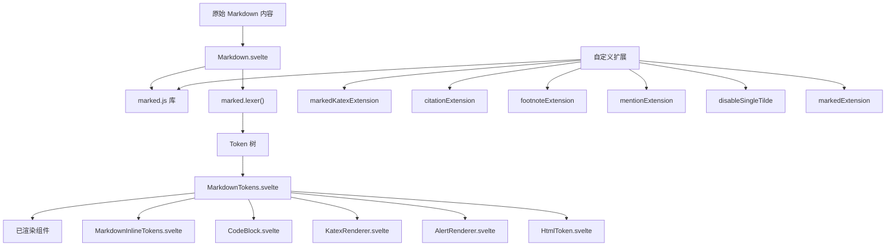
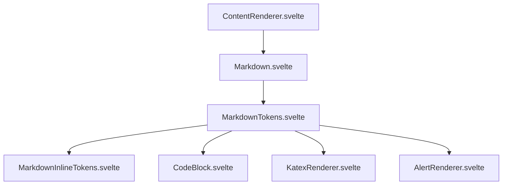
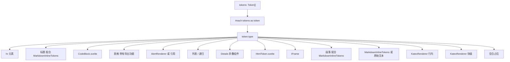
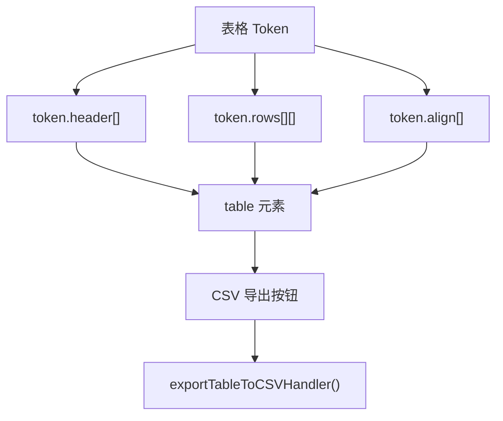
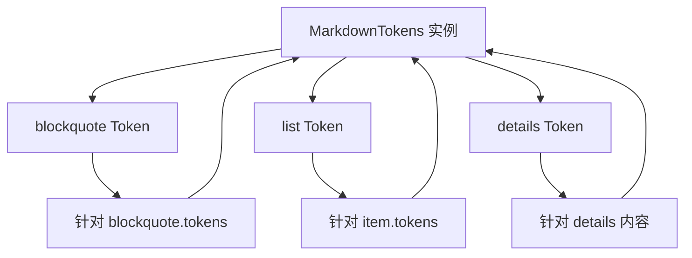
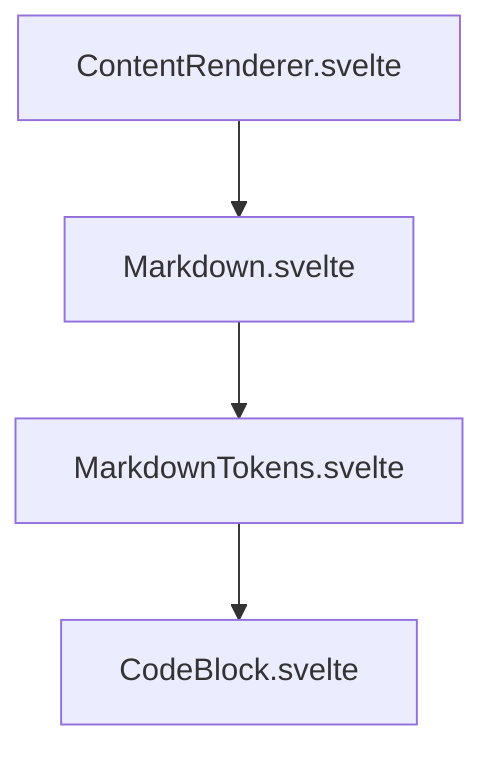

# Markdown 处理

相关源文件

-   [src/lib/components/chat/ContentRenderer/FloatingButtons.svelte](https://github.com/open-webui/open-webui/blob/a7271532/src/lib/components/chat/ContentRenderer/FloatingButtons.svelte)
-   [src/lib/components/chat/Messages/CodeBlock.svelte](https://github.com/open-webui/open-webui/blob/a7271532/src/lib/components/chat/Messages/CodeBlock.svelte)
-   [src/lib/components/chat/Messages/ContentRenderer.svelte](https://github.com/open-webui/open-webui/blob/a7271532/src/lib/components/chat/Messages/ContentRenderer.svelte)
-   [src/lib/components/chat/Messages/Markdown.svelte](https://github.com/open-webui/open-webui/blob/a7271532/src/lib/components/chat/Messages/Markdown.svelte)
-   [src/lib/components/chat/Messages/Markdown/AlertRenderer.svelte](https://github.com/open-webui/open-webui/blob/a7271532/src/lib/components/chat/Messages/Markdown/AlertRenderer.svelte)
-   [src/lib/components/chat/Messages/Markdown/MarkdownTokens.svelte](https://github.com/open-webui/open-webui/blob/a7271532/src/lib/components/chat/Messages/Markdown/MarkdownTokens.svelte)
-   [src/lib/components/chat/Messages/Message.svelte](https://github.com/open-webui/open-webui/blob/a7271532/src/lib/components/chat/Messages/Message.svelte)
-   [src/lib/components/chat/Messages/MultiResponseMessages.svelte](https://github.com/open-webui/open-webui/blob/a7271532/src/lib/components/chat/Messages/MultiResponseMessages.svelte)
-   [src/lib/utils/marked/strikethrough-extension.ts](https://github.com/open-webui/open-webui/blob/a7271532/src/lib/utils/marked/strikethrough-extension.ts)
-   [src/lib/workers/pyodide.worker.ts](https://github.com/open-webui/open-webui/blob/a7271532/src/lib/workers/pyodide.worker.ts)

## 目的与范围

本页记录了将原始 Markdown 文本转换为已渲染 HTML 组件的 Markdown 处理系统。该系统使用 marked.js 库，并辅以自定义扩展以支持数学公式 (KaTeX)、引用、脚注、提及和 GitHub 风格的警示框。渲染流水线对 Markdown 内容进行 Token 化，并递归处理 Token 树以生成 Svelte 组件。

有关代码块执行能力的信息，请参阅 [代码块执行](/open-webui/open-webui/5.4-code-block-execution)。有关调用 Markdown 处理的更广泛的内容渲染流水线，请参阅 [内容渲染流水线](/open-webui/open-webui/5.2-content-rendering-pipeline)。

## Markdown 处理架构

Markdown 处理系统由三个主要层级组成：解析、扩展增强和递归渲染。

### 高层处理流程


**来源：** [src/lib/components/chat/Messages/Markdown.svelte1-79](https://github.com/open-webui/open-webui/blob/a7271532/src/lib/components/chat/Messages/Markdown.svelte#L1-L79) [src/lib/components/chat/Messages/Markdown/MarkdownTokens.svelte1-416](https://github.com/open-webui/open-webui/blob/a7271532/src/lib/components/chat/Messages/Markdown/MarkdownTokens.svelte#L1-L416)

### 组件层级


**来源：** [src/lib/components/chat/Messages/ContentRenderer.svelte1-223](https://github.com/open-webui/open-webui/blob/a7271532/src/lib/components/chat/Messages/ContentRenderer.svelte#L1-L223) [src/lib/components/chat/Messages/Markdown.svelte1-79](https://github.com/open-webui/open-webui/blob/a7271532/src/lib/components/chat/Messages/Markdown.svelte#L1-L79)

## Markdown.svelte：入口点

`Markdown.svelte` 组件充当 Markdown 处理的入口点。它为 marked.js 库配置自定义扩展，并生成初始 Token 树。

### 配置与扩展加载

[src/lib/components/chat/Messages/Markdown.svelte38-50](https://github.com/open-webui/open-webui/blob/a7271532/src/lib/components/chat/Messages/Markdown.svelte#L38-L50) 为 marked.js 配置了六个自定义扩展：

| 扩展 | 用途 | 配置 |
| --- | --- | --- |
| `markedKatexExtension` | 使用 KaTeX 渲染数学公式 | `throwOnError: false, breaks: true` |
| `markedExtension` | Open WebUI 的基础自定义扩展 | 相同选项 |
| `citationExtension` | 处理引用参考文献 `[^1]` | 相同选项 |
| `footnoteExtension` | 处理脚注定义 | 相同选项 |
| `disableSingleTilde` | 防止单个 `~` 触发删除线 | 通过 `marked.use()` 应用 |
| `mentionExtension` | 支持 `@` 和 `#` 提及语法 | 具有不同触发字符的两个实例 |

### Token 化过程

当内容发生变化时，Token 化会响应式地发生 [src/lib/components/chat/Messages/Markdown.svelte52-58](https://github.com/open-webui/open-webui/blob/a7271532/src/lib/components/chat/Messages/Markdown.svelte#L52-L58)：

```
content (原始 Markdown 字符串)
    ↓
processResponseContent() - 清理/格式化内容
    ↓
replaceTokens() - 替换 {{MODEL_NAME}}, {{USER_NAME}}
    ↓
marked.lexer() - 转换为 Token 树
    ↓
tokens[] - Token 对象数组
```
`marked.lexer()` 函数解析 Markdown 并返回 Token 对象数组。每个 Token 都有一个 `type` 字段以及特定于类型的属性，如 `text`、`tokens`（针对嵌套内容）、`raw`（原始 Markdown）等。

**来源：** [src/lib/components/chat/Messages/Markdown.svelte52-58](https://github.com/open-webui/open-webui/blob/a7271532/src/lib/components/chat/Messages/Markdown.svelte#L52-L58)

## 自定义 Marked 扩展

### KaTeX 扩展

使用 KaTeX 语法渲染行内和块级数学公式。支持两种定界符：

-   行内：`$...$` 或 `\(...\)`
-   块级：`$$...$$` 或 `\[...\]`

### 引用扩展 (Citation Extension)

以 `[^identifier]` 格式处理引用参考文献，并将其链接到源文档。该扩展生成 `inlineKatex` Token，稍后由 `KatexRenderer.svelte` 进行渲染。

### 脚注扩展 (Footnote Extension)

处理脚注定义 `[^note]: description` 和引用。脚注可以出现在文档中的任何位置，并收集在末尾显示。

### 提及扩展 (Mention Extension)

检测具有可配置触发字符的提及（用户使用 `@`，频道/标签使用 `#`）。该扩展使用不同的触发器实例化了两次 [src/lib/components/chat/Messages/Markdown.svelte48-50](https://github.com/open-webui/open-webui/blob/a7271532/src/lib/components/chat/Messages/Markdown.svelte#L48-L50)：

```javascript
{
  extensions: [
    mentionExtension({ triggerChar: '@' }),
    mentionExtension({ triggerChar: '#' })
  ]
}
```
### 删除线扩展 (Strikethrough Extension)

`disableSingleTilde` 扩展 [src/lib/utils/marked/strikethrough-extension.ts1-30](https://github.com/open-webui/open-webui/blob/a7271532/src/lib/utils/marked/strikethrough-extension.ts#L1-L30) 修改了默认的删除线行为，要求使用双波浪线 `~~text~~`，并防止单波浪线 `~text~` 被解释为删除线。单波浪线作为纯文本 Token 返回。

**来源：** [src/lib/components/chat/Messages/Markdown.svelte43-50](https://github.com/open-webui/open-webui/blob/a7271532/src/lib/components/chat/Messages/Markdown.svelte#L43-L50) [src/lib/utils/marked/strikethrough-extension.ts1-30](https://github.com/open-webui/open-webui/blob/a7271532/src/lib/utils/marked/strikethrough-extension.ts#L1-L30)

## MarkdownTokens.svelte：递归 Token 渲染器

`MarkdownTokens.svelte` 实现了核心递归渲染引擎，将 Token 树转换为 Svelte 组件。它处理 14 种不同的 Token 类型。

### Token 类型分发系统


**来源：** [src/lib/components/chat/Messages/Markdown/MarkdownTokens.svelte91-415](https://github.com/open-webui/open-webui/blob/a7271532/src/lib/components/chat/Messages/Markdown/MarkdownTokens.svelte#L91-L415)

### Token 类型实现

#### 标题 Token (Heading Tokens)

[src/lib/components/chat/Messages/Markdown/MarkdownTokens.svelte94-103](https://github.com/open-webui/open-webui/blob/a7271532/src/lib/components/chat/Messages/Markdown/MarkdownTokens.svelte#L94-L103) 使用 `headerComponent()` 辅助函数渲染标题，该函数返回 `'h' + depth` (h1-h6)。标题内容委托给 `MarkdownInlineTokens` 进行行内元素处理。

#### 代码 Token (Code Tokens)

[src/lib/components/chat/Messages/Markdown/MarkdownTokens.svelte104-129](https://github.com/open-webui/open-webui/blob/a7271532/src/lib/components/chat/Messages/Markdown/MarkdownTokens.svelte#L104-L129) 有条件地渲染代码块：

-   如果 `token.raw` 包含三个反引号：渲染具有完整编辑/执行能力的 `CodeBlock.svelte`。
-   否则：渲染纯文本（用于行内代码）。

`CodeBlock` 组件接收：

-   `id`：结合消息 ID 和 Token 索引的唯一标识符。
-   `collapsed`：来自 `$settings?.collapseCodeBlocks` 的用户偏好。
-   `token`：用于渲染更新的完整 Token 对象。
-   `lang`：来自围栏代码块 (fenced code block) 的语言标识符。
-   `code`：代码内容。
-   `attributes`：预执行代码的元数据。
-   `save`、`preview`、`edit`：能力标志位。
-   `onSave`、`onUpdate`、`onPreview`：回调处理程序。

#### 表格 Token (Table Tokens)

[src/lib/components/chat/Messages/Markdown/MarkdownTokens.svelte130-215](https://github.com/open-webui/open-webui/blob/a7271532/src/lib/components/chat/Messages/Markdown/MarkdownTokens.svelte#L130-L215) 渲染带有导出功能的表格：


导出处理程序 [src/lib/components/chat/Messages/Markdown/MarkdownTokens.svelte53-87](https://github.com/open-webui/open-webui/blob/a7271532/src/lib/components/chat/Messages/Markdown/MarkdownTokens.svelte#L53-L87) 提取表格数据并生成带有 BOM 前缀的 UTF-8 CSV 文件以实现正确编码。每个单元格的 Token 都映射为文本、进行转义并包装在引号中。

#### 引用块与警示框 Token (Blockquote and Alert Tokens)

[src/lib/components/chat/Messages/Markdown/MarkdownTokens.svelte216-232](https://github.com/open-webui/open-webui/blob/a7271532/src/lib/components/chat/Messages/Markdown/MarkdownTokens.svelte#L216-L232) 检查引用块是否为 GitHub 风格的警示框：

```
> [!NOTE]
> 内容
```
`alertComponent()` 函数 [src/lib/components/chat/Messages/Markdown/AlertRenderer.svelte46-62](https://github.com/open-webui/open-webui/blob/a7271532/src/lib/components/chat/Messages/Markdown/AlertRenderer.svelte#L46-L62) 使用正则表达式检测警示类型 (NOTE, TIP, IMPORTANT, WARNING, CAUTION) 并提取警示内容。如果匹配，则渲染 `AlertRenderer.svelte`；否则，渲染标准的 `<blockquote>`。

警示样式定义在 [src/lib/components/chat/Messages/Markdown/AlertRenderer.svelte18-44](https://github.com/open-webui/open-webui/blob/a7271532/src/lib/components/chat/Messages/Markdown/AlertRenderer.svelte#L18-L44) 中，为每种类型设置了边框颜色、文本颜色和图标。

#### 列表 Token (List Tokens)

[src/lib/components/chat/Messages/Markdown/MarkdownTokens.svelte233-317](https://github.com/open-webui/open-webui/blob/a7271532/src/lib/components/chat/Messages/Markdown/MarkdownTokens.svelte#L233-L317) 处理有序列表 (`<ol>`) 和无序列表 (`<ul>`)。任务列表（复选框）通过 `item?.task` 属性检测。该组件：

1.  为任务项渲染 `<input type="checkbox">`。
2.  当选中状态改变时调用 `onTaskClick()` 回调。
3.  通过 `<svelte:self>` 递归渲染子 Token。

#### 详情 Token (Details Tokens)

[src/lib/components/chat/Messages/Markdown/MarkdownTokens.svelte318-338](https://github.com/open-webui/open-webui/blob/a7271532/src/lib/components/chat/Messages/Markdown/MarkdownTokens.svelte#L318-L338) 使用 `Collapsible` 组件渲染可折叠部分。该 Token 包含：

-   `token.summary`：可点击的摘要文本。
-   `token.text`：折叠内容。
-   `token.attributes`：自定义属性。

在递归渲染之前，内容会使用 `marked.lexer(decode(token.text))` 重新进行词法分析。

#### HTML 与 IFrame Token (HTML and IFrame Tokens)

[src/lib/components/chat/Messages/Markdown/MarkdownTokens.svelte339-353](https://github.com/open-webui/open-webui/blob/a7271532/src/lib/components/chat/Messages/Markdown/MarkdownTokens.svelte#L339-L353)：

-   **HTML Token**：委托给 `HtmlToken.svelte` 进行清理和安全渲染。
-   **IFrame Token**：特殊的 Token 类型，用于通过 `<iframe src="/api/v1/files/{fileId}/content">` 嵌入文件。

iframe 根据内容自动调整高度 [src/lib/components/chat/Messages/Markdown/MarkdownTokens.svelte347-352](https://github.com/open-webui/open-webui/blob/a7271532/src/lib/components/chat/Messages/Markdown/MarkdownTokens.svelte#L347-L352)：

```javascript
on:load={(e) => {
  e.currentTarget.style.height =
    e.currentTarget.contentWindow.document.body.scrollHeight + 20 + 'px';
}}
```
#### 段落与文本 Token (Paragraph and Text Tokens)

[src/lib/components/chat/Messages/Markdown/MarkdownTokens.svelte354-401](https://github.com/open-webui/open-webui/blob/a7271532/src/lib/components/chat/Messages/Markdown/MarkdownTokens.svelte#L354-L401)：

-   **段落 (Paragraph)**：可以根据 `paragraphTag` prop 渲染为 `<p>` 或 `<span>`。
-   **文本 (Text)**：根据 `top` prop（是否在顶层）进行不同的渲染。顶层文本被包装在 `<p>` 中，嵌套文本则不包装。

如果 Token 包含子 Token，两者都委托给 `MarkdownInlineTokens`；否则使用 `unescapeHtml()` 工具函数。

#### 数学 Token (Math Tokens)

[src/lib/components/chat/Messages/Markdown/MarkdownTokens.svelte402-409](https://github.com/open-webui/open-webui/blob/a7271532/src/lib/components/chat/Messages/Markdown/MarkdownTokens.svelte#L402-L409) 渲染行内和块级 KaTeX：

-   `inlineKatex`：段落流中的数学公式。
-   `blockKatex`：独立的等式显示。

两者都使用 `KatexRenderer`，通过 `displayMode` 标志控制行内与块级渲染。

**来源：** [src/lib/components/chat/Messages/Markdown/MarkdownTokens.svelte91-415](https://github.com/open-webui/open-webui/blob/a7271532/src/lib/components/chat/Messages/Markdown/MarkdownTokens.svelte#L91-L415)

## 递归渲染与自引用

`MarkdownTokens.svelte` 使用 Svelte 的 `<svelte:self>` 特性来递归渲染嵌套的 Token 结构。这种模式出现在几种 Token 类型中：


代码库中的示例：

**引用块 (Blockquote)** [src/lib/components/chat/Messages/Markdown/MarkdownTokens.svelte221-231](https://github.com/open-webui/open-webui/blob/a7271532/src/lib/components/chat/Messages/Markdown/MarkdownTokens.svelte#L221-L231)：

```html
<svelte:self
  id={`${id}-${tokenIdx}`}
  tokens={token.tokens}
  {done}
  {editCodeBlock}
  {onTaskClick}
  {sourceIds}
  {onSourceClick}
/>
```
**列表项 (List items)** [src/lib/components/chat/Messages/Markdown/MarkdownTokens.svelte256-265](https://github.com/open-webui/open-webui/blob/a7271532/src/lib/components/chat/Messages/Markdown/MarkdownTokens.svelte#L256-L265)：

```html
<svelte:self
  id={`${id}-${tokenIdx}-${itemIdx}`}
  tokens={item.tokens}
  top={token.loose}
  {done}
  {editCodeBlock}
  {onTaskClick}
  {sourceIds}
  {onSourceClick}
/>
```
每次递归调用都会通过追加 Token 和项索引来生成唯一的 ID：`${id}-${tokenIdx}-${itemIdx}`。这确保了组件的正确 keying 和事件处理。

**来源：** [src/lib/components/chat/Messages/Markdown/MarkdownTokens.svelte221-231](https://github.com/open-webui/open-webui/blob/a7271532/src/lib/components/chat/Messages/Markdown/MarkdownTokens.svelte#L221-L231) [src/lib/components/chat/Messages/Markdown/MarkdownTokens.svelte256-265](https://github.com/open-webui/open-webui/blob/a7271532/src/lib/components/chat/Messages/Markdown/MarkdownTokens.svelte#L256-L265)

## 特殊特性

### 表格 CSV 导出

表格导出功能 [src/lib/components/chat/Messages/Markdown/MarkdownTokens.svelte53-87](https://github.com/open-webui/open-webui/blob/a7271532/src/lib/components/chat/Messages/Markdown/MarkdownTokens.svelte#L53-L87) 实现了以下算法：

1.  提取表头单元格：`token.header.map(cell => escape(cell.text))`。
2.  提取行单元格：`token.rows.map(row => row.map(cell => joinTokens(cell.tokens)))`。
3.  转义双引号：`text.replace(/"/g, '""')`。
4.  用引号包裹：`"${escaped}"`。
5.  使用逗号和换行符连接。
6.  添加 UTF-8 BOM 前缀：`'\uFEFF'`。
7.  创建 Blob 并通过 FileSaver.js 触发下载。

文件名格式为 `table-{messageId}-{tokenIdx}.csv`。

### 来源引用 (Source Citations)

通过将 `sourceIds` prop 传递到渲染链中来处理引用链接 [src/lib/components/chat/Messages/Markdown/MarkdownTokens.svelte30](https://github.com/open-webui/open-webui/blob/a7271532/src/lib/components/chat/Messages/Markdown/MarkdownTokens.svelte#L30-L30)：

```
ContentRenderer 根据 sources prop 计算 sourceIds
    ↓
传递给 Markdown.svelte
    ↓
传递给 MarkdownTokens
    ↓
传递给 MarkdownInlineTokens
    ↓
渲染为可点击的引用，并带有 onSourceClick 回调
```
`sourceIds` 数组包含源文档的名称或 URL，可以在 Markdown 中使用引用语法引用它们。

### 代码块集成

当检测到代码 Token 时 [src/lib/components/chat/Messages/Markdown/MarkdownTokens.svelte106-126](https://github.com/open-webui/open-webui/blob/a7271532/src/lib/components/chat/Messages/Markdown/MarkdownTokens.svelte#L106-L126)，组件会使用父组件的配置实例化 `CodeBlock.svelte`：

-   `collapsed`：来自 `$settings?.collapseCodeBlocks` store。
-   `save`、`preview`：从父级 props 传播。
-   `edit`：来自 `editCodeBlock` prop（可以在只读上下文中禁用编辑）。
-   `stickyButtonsClassName`：根据 `topPadding` prop 调整按钮位置。

`onSave` 回调 [src/lib/components/chat/Messages/Markdown/MarkdownTokens.svelte117-123](https://github.com/open-webui/open-webui/blob/a7271532/src/lib/components/chat/Messages/Markdown/MarkdownTokens.svelte#L117-L123) 返回一个包含以下内容的对象：

-   `raw`：原始 Markdown。
-   `oldContent`：先前的代码。
-   `newContent`：要保存的新代码。

这允许父组件对原始 Markdown 内容执行查找和替换操作。

**来源：** [src/lib/components/chat/Messages/Markdown/MarkdownTokens.svelte53-87](https://github.com/open-webui/open-webui/blob/a7271532/src/lib/components/chat/Messages/Markdown/MarkdownTokens.svelte#L53-L87) [src/lib/components/chat/Messages/Markdown/MarkdownTokens.svelte106-126](https://github.com/open-webui/open-webui/blob/a7271532/src/lib/components/chat/Messages/Markdown/MarkdownTokens.svelte#L106-L126)

## Props 与配置流

### MarkdownTokens Props

[src/lib/components/chat/Messages/Markdown/MarkdownTokens.svelte26-48](https://github.com/open-webui/open-webui/blob/a7271532/src/lib/components/chat/Messages/Markdown/MarkdownTokens.svelte#L26-L48) 定义了该组件的接口：

| Prop | 类型 | 用途 |
| --- | --- | --- |
| `id` | string | 组件实例的唯一标识符 |
| `tokens` | Token\[\] | 要渲染的 marked Token 数组 |
| `top` | boolean | Token 是否处于顶层（影响文本包装） |
| `attributes` | object | 传递给代码块的自定义属性 |
| `sourceIds` | string\[\] | 参考文献来源标识符 |
| `done` | boolean | 流式传输是否完成 |
| `save` | boolean | 启用代码块的保存功能 |
| `preview` | boolean | 启用 HTML/SVG 代码的预览 |
| `paragraphTag` | string | 用于段落的标签 ('p' 或 'span') |
| `editCodeBlock` | boolean | 允许编辑代码块 |
| `topPadding` | boolean | 调整吸附按钮的位置 |
| `onSave` | 函数 | 代码保存回调 |
| `onUpdate` | 函数 | Token 更新回调 |
| `onPreview` | 函数 | 预览触发回调 |
| `onTaskClick` | 函数 | 复选框点击处理程序 |
| `onSourceClick` | 函数 | 引用点击处理程序 |

### 配置级联 (Configuration Cascade)


Props 从 `ContentRenderer`（从 `ResponseMessage` 接收）通过 `Markdown` 流向 `MarkdownTokens`，最后到达专门的组件如 `CodeBlock`。这实现了渲染能力的集中控制，同时保持了组件的模块化。

**来源：** [src/lib/components/chat/Messages/Markdown/MarkdownTokens.svelte26-48](https://github.com/open-webui/open-webui/blob/a7271532/src/lib/components/chat/Messages/Markdown/MarkdownTokens.svelte#L26-L48) [src/lib/components/chat/Messages/Markdown.svelte15-35](https://github.com/open-webui/open-webui/blob/a7271532/src/lib/components/chat/Messages/Markdown.svelte#L15-L35) [src/lib/components/chat/Messages/ContentRenderer.svelte19-41](https://github.com/open-webui/open-webui/blob/a7271532/src/lib/components/chat/Messages/ContentRenderer.svelte#L19-L41)
