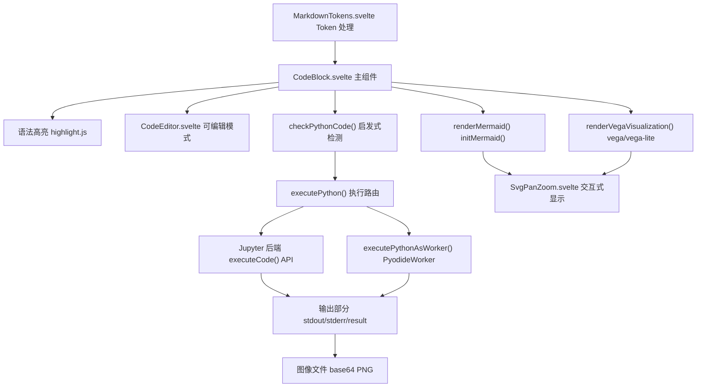
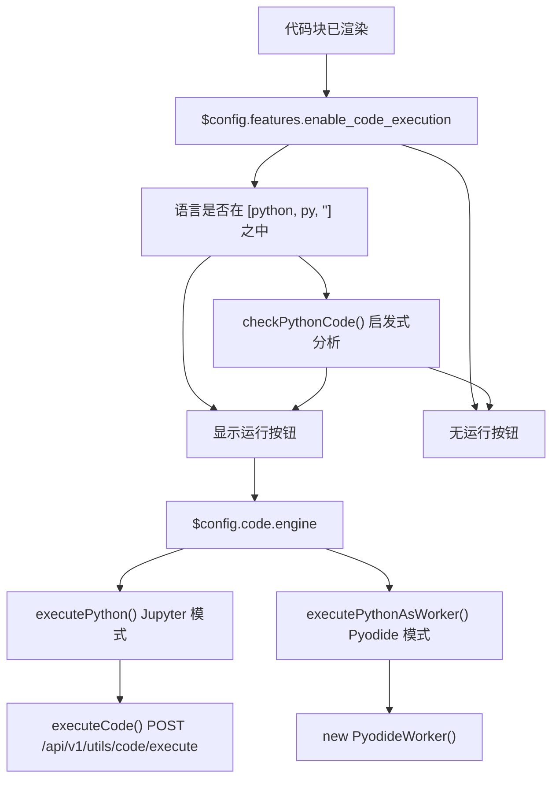
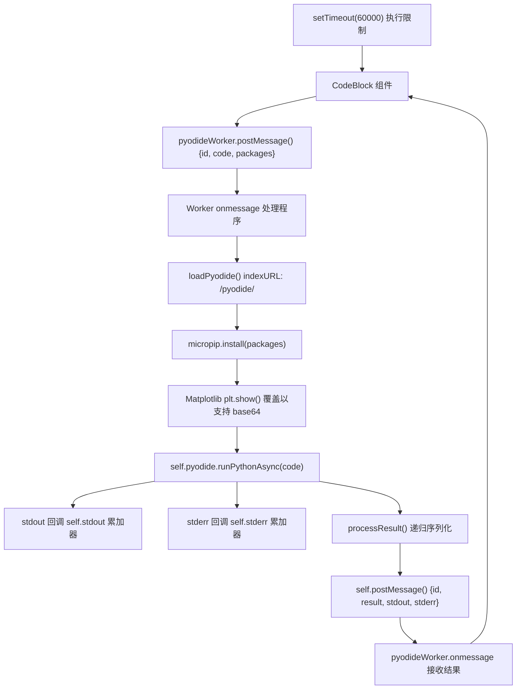
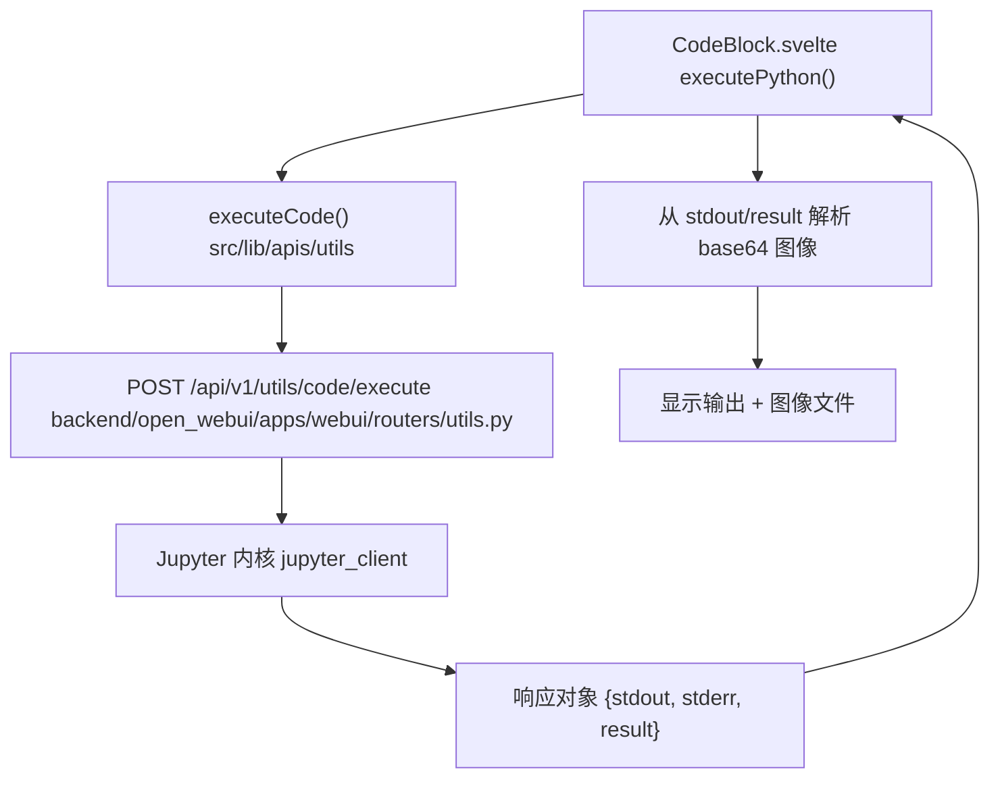
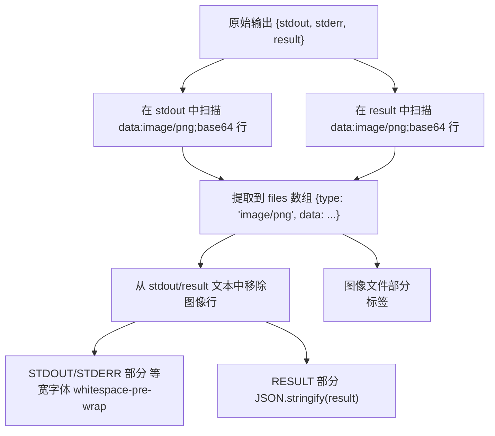
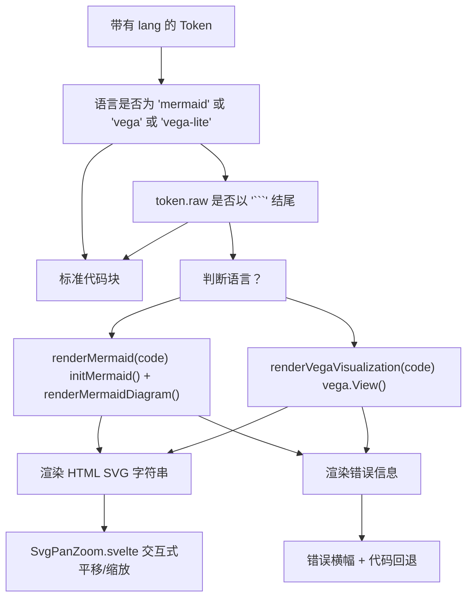
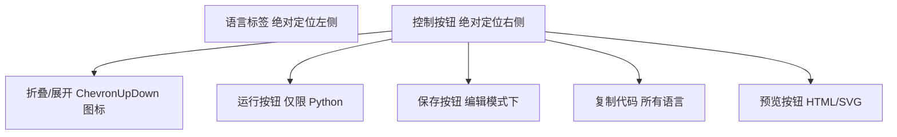
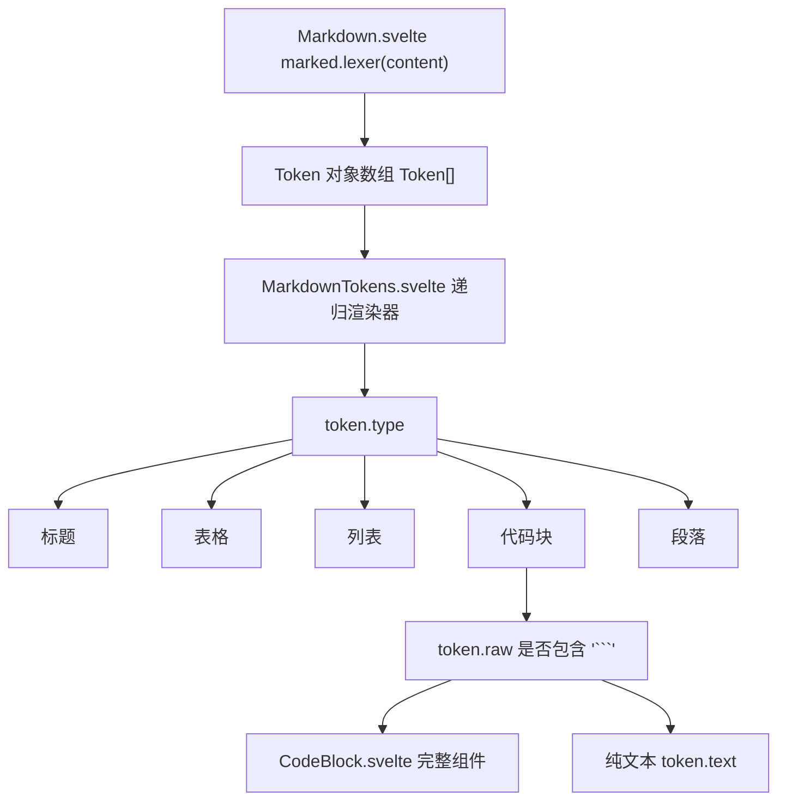

# 代码块执行

相关源文件

-   [src/lib/components/chat/ContentRenderer/FloatingButtons.svelte](https://github.com/open-webui/open-webui/blob/a7271532/src/lib/components/chat/Messages/CodeBlock.svelte)
-   [src/lib/components/chat/Messages/CodeBlock.svelte](https://github.com/open-webui/open-webui/blob/a7271532/src/lib/components/chat/Messages/CodeBlock.svelte)
-   [src/lib/components/chat/Messages/ContentRenderer.svelte](https://github.com/open-webui/open-webui/blob/a7271532/src/lib/components/chat/Messages/ContentRenderer.svelte)
-   [src/lib/components/chat/Messages/Markdown.svelte](https://github.com/open-webui/open-webui/blob/a7271532/src/lib/components/chat/Messages/Markdown.svelte)
-   [src/lib/components/chat/Messages/Markdown/AlertRenderer.svelte](https://github.com/open-webui/open-webui/blob/a7271532/src/lib/components/chat/Messages/Markdown/AlertRenderer.svelte)
-   [src/lib/components/chat/Messages/Markdown/MarkdownTokens.svelte](https://github.com/open-webui/open-webui/blob/a7271532/src/lib/components/chat/Messages/Markdown/MarkdownTokens.svelte)
-   [src/lib/components/chat/Messages/Message.svelte](https://github.com/open-webui/open-webui/blob/a7271532/src/lib/components/chat/Messages/Message.svelte)
-   [src/lib/components/chat/Messages/MultiResponseMessages.svelte](https://github.com/open-webui/open-webui/blob/a7271532/src/lib/components/chat/Messages/MultiResponseMessages.svelte)
-   [src/lib/utils/marked/strikethrough-extension.ts](https://github.com/open-webui/open-webui/blob/a7271532/src/lib/utils/marked/strikethrough-extension.ts)
-   [src/lib/workers/pyodide.worker.ts](https://github.com/open-webui/open-webui/blob/a7271532/src/lib/workers/pyodide.worker.ts)

## 目的与范围

本文档描述了 Open WebUI 中的代码块执行系统，该系统实现了聊天消息中代码的渲染和交互式执行。该系统支持所有语言的语法高亮，通过 Pyodide 实现浏览器内 Python 执行，通过 Jupyter 实现服务器端 Python 执行，以及针对 Mermaid 图表和 Vega/Vega-Lite 可视化的专门渲染。

有关如何从 Markdown 解析代码块的信息，请参阅 [Markdown 处理](/open-webui/open-webui/5.3-markdown-processing)。有关通用的消息渲染架构，请参阅 [响应消息组件](/open-webui/open-webui/5.1-response-message-component)。

来源： [src/lib/components/chat/Messages/CodeBlock.svelte1-616](https://github.com/open-webui/open-webui/blob/a7271532/src/lib/components/chat/Messages/CodeBlock.svelte#L1-L616)

---

## 组件架构

`CodeBlock.svelte` 组件充当代码块渲染和执行的主要接口。它在处理来自 Markdown 词法分析器的 `code` Token 时被 `MarkdownTokens.svelte` 调用。

### CodeBlock 组件流程


**关键组件 Props**

| Prop | 类型 | 用途 |
| --- | --- | --- |
| `lang` | string | 语法高亮和执行路由的语言标识符 |
| `code` | string | 源代码内容 |
| `token` | Token | 包含原始 Markdown 的 Marked.js Token |
| `edit` | boolean | 通过 CodeEditor 组件启用代码编辑 |
| `run` | boolean | 显示 Python 代码的执行按钮 |
| `save` | boolean | 显示代码修改的保存按钮 |
| `preview` | boolean | 显示 HTML/SVG 的预览按钮 |
| `collapsed` | boolean | 初始折叠状态 |
| `attributes` | object | 额外的元数据（例如保存的输出） |

来源： [src/lib/components/chat/Messages/CodeBlock.svelte28-47](https://github.com/open-webui/open-webui/blob/a7271532/src/lib/components/chat/Messages/CodeBlock.svelte#L28-L47) [src/lib/components/chat/Messages/Markdown/MarkdownTokens.svelte104-129](https://github.com/open-webui/open-webui/blob/a7271532/src/lib/components/chat/Messages/Markdown/MarkdownTokens.svelte#L104-L129)

---

## 执行模式选择

系统根据配置和语言检测来确定执行模式。

### 执行决策流程


`checkPythonCode()` 函数在未指定语言时使用启发式模式匹配来检测 Python 语法。它搜索常见的 Python 关键字，如 `def`, `import`, `lambda`, `True`, `False`, `None`，以及运算符如 `and`, `or`, `not`, `in`, `is`。

来源： [src/lib/components/chat/Messages/CodeBlock.svelte104-137](https://github.com/open-webui/open-webui/blob/a7271532/src/lib/components/chat/Messages/CodeBlock.svelte#L104-L137) [src/lib/components/chat/Messages/CodeBlock.svelte466-486](https://github.com/open-webui/open-webui/blob/a7271532/src/lib/components/chat/Messages/CodeBlock.svelte#L466-L486)

---

## Pyodide Worker 实现

Pyodide 执行完全通过 Web Worker 在浏览器中运行，提供沙箱化的 Python 执行环境，无需服务器依赖。

### Pyodide Worker 架构


### 包检测与安装

`executePythonAsWorker()` 函数使用正则表达式分析代码，以检测常用的库导入，并自动将它们包含在发送给 worker 的包列表中：

| 模式 | 包名称 |
| --- | --- |
| `\bimport\s+requests\b` | `requests` |
| `\bimport\s+numpy\b` | `numpy` |
| `\bimport\s+pandas\b` | `pandas` |
| `\bimport\s+matplotlib\b` | `matplotlib` |
| `\bimport\s+seaborn\b` | `seaborn` |
| `\bimport\s+sklearn\b` | `scikit-learn` |
| `\bimport\s+scipy\b` | `scipy` |
| `\bimport\s+sympy\b` | `sympy` |
| `\bimport\s+tiktoken\b` | `tiktoken` |
| `\bfrom\s+bs4\b` | `beautifulsoup4` |

Worker 使用 `micropip.install()` 从 PyPI 获取并安装这些包。

来源： [src/lib/components/chat/Messages/CodeBlock.svelte220-246](https://github.com/open-webui/open-webui/blob/a7271532/src/lib/components/chat/Messages/CodeBlock.svelte#L220-L246) [src/lib/workers/pyodide.worker.ts16-64](https://github.com/open-webui/open-webui/blob/a7271532/src/lib/workers/pyodide.worker.ts#L16-L64)

### Matplotlib 集成

对于 matplotlib 绘图，worker 补丁了 `plt.show()`，以捕获图形输出为 base64 编码的 PNG 数据，而不是尝试在不存在的浏览器窗口中显示：

```python
def show(*, block=None):
    buf = BytesIO()
    matplotlib.pyplot.savefig(buf, format="png")
    buf.seek(0)
    img_str = base64.b64encode(buf.read()).decode('utf-8')
    matplotlib.pyplot.clf()
    buf.close()
    print(f"data:image/png;base64,{img_str}")
```
这个补丁函数将图像作为 data URI 打印到 stdout，然后由主线程捕获并提取。

来源： [src/lib/workers/pyodide.worker.ts81-106](https://github.com/open-webui/open-webui/blob/a7271532/src/lib/workers/pyodide.worker.ts#L81-L106)

### 结果序列化

`processResult()` 函数递归地将 Python 对象转换为 JSON 安全的表示形式：

1.  **基本类型**：字符串、数字、布尔值直接通过
2.  **BigInt**：转换为字符串
3.  **数组**：递归处理各子项
4.  **Pyodide 代理**：调用 `.toJs()` 方法并递归
5.  **对象**：递归处理所有属性
6.  **回退**：对未处理类型使用 JSON.stringify()

来源： [src/lib/workers/pyodide.worker.ts135-174](https://github.com/open-webui/open-webui/blob/a7271532/src/lib/workers/pyodide.worker.ts#L135-L174)

---

## Jupyter 后端集成

当 `$config.code.engine` 设置为 `"jupyter"` 时，执行将通过 `/api/v1/utils/code/execute` 端点委托给后端 Jupyter 内核。

### Jupyter 执行流程


后端执行提供了：

-   **持久化内核**：变量在同一会话的多次执行之间保持持久
-   **丰富输出**：支持 IPython 显示对象和 matplotlib 集成
-   **服务器资源**：可以访问服务器文件系统、GPU 和已安装的包

响应格式与 Pyodide 输出结构相匹配：

```json
{
  "stdout": "string",  // 标准输出
  "stderr": "string",  // 标准错误
  "result": "any"      // 返回值或最后一个表达式
}
```
来源： [src/lib/components/chat/Messages/CodeBlock.svelte139-218](https://github.com/open-webui/open-webui/blob/a7271532/src/lib/components/chat/Messages/CodeBlock.svelte#L139-L218) [src/lib/apis/utils/index.ts1-30](https://github.com/open-webui/open-webui/blob/a7271532/src/lib/apis/utils/index.ts#L1-L30) (暗示)

---

## 输出处理与显示

两种执行模式都以一致的格式生成输出，由 CodeBlock 组件进行解析和显示。

### 输出处理流水线


### 图像提取逻辑

组件扫描 `stdout` 和 `result` 中以 `"data:image/png;base64"` 开头的行。一旦发现：

1.  该行被添加到类型为 `"image/png"` 的 `files` 数组中
2.  该行从文本输出中移除（包括或不包括尾随换行符）
3.  图像以全宽（最大 36rem）渲染在结果下方

这使得来自 Pyodide 或 Jupyter 的 matplotlib 绘图能够无缝集成到输出显示中。

来源： [src/lib/components/chat/Messages/CodeBlock.svelte153-209](https://github.com/open-webui/open-webui/blob/a7271532/src/lib/components/chat/Messages/CodeBlock.svelte#L153-L209) [src/lib/components/chat/Messages/CodeBlock.svelte261-317](https://github.com/open-webui/open-webui/blob/a7271532/src/lib/components/chat/Messages/CodeBlock.svelte#L261-L317) [src/lib/components/chat/Messages/CodeBlock.svelte570-611](https://github.com/open-webui/open-webui/blob/a7271532/src/lib/components/chat/Messages/CodeBlock.svelte#L570-L611)

---

## 图表渲染

CodeBlock 组件为 Mermaid 图表和 Vega/Vega-Lite 可视化提供了专门的渲染。

### 图表渲染流程


### Mermaid 初始化

Mermaid 采用懒加载方式，仅在首次需要时初始化：

```javascript
let mermaid = null;
const renderMermaid = async (code) => {
    if (!mermaid) {
        mermaid = await initMermaid();  // 来自 $lib/utils
    }
    return await renderMermaidDiagram(mermaid, code);
};
```
`render()` 函数在 Token 更新时响应式调用，并在尝试可视化之前检查代码块是否完整（以结束反引号结尾）。

来源： [src/lib/components/chat/Messages/CodeBlock.svelte331-363](https://github.com/open-webui/open-webui/blob/a7271532/src/lib/components/chat/Messages/CodeBlock.svelte#L331-L363) [src/lib/components/chat/Messages/CodeBlock.svelte423-441](https://github.com/open-webui/open-webui/blob/a7271532/src/lib/components/chat/Messages/CodeBlock.svelte#L423-L441)

### SVG 平移与缩放 (Pan and Zoom)

所有渲染的图表都包装在 `SvgPanZoom` 组件中，该组件提供：

-   **平移 (Pan)**：点击并拖动以移动图表
-   **缩放 (Zoom)**：滚动鼠标滚轮或双指缩放
-   **重置 (Reset)**：点击按钮恢复原始视图
-   **全屏 (Fullscreen)**：扩展到整个视口

组件接收原始 SVG 字符串和原始 Token 文本作为参考。

来源： [src/lib/components/chat/Messages/CodeBlock.svelte425-429](https://github.com/open-webui/open-webui/blob/a7271532/src/lib/components/chat/Messages/CodeBlock.svelte#L425-L429) [src/lib/components/common/SVGPanZoom.svelte1-100](https://github.com/open-webui/open-webui/blob/a7271532/src/lib/components/common/SVGPanZoom.svelte#L1-L100) (暗示)

---

## 代码编辑与 UI 控件

CodeBlock 组件提供了一个具有多个交互式控件的丰富 UI。

### 控制栏布局


### 按钮条件

| 按钮 | 条件 | 动作 |
| --- | --- | --- |
| **折叠/展开** | 始终显示 | 切换 `collapsed` 状态；显示“X 行已隐藏”消息 |
| **运行** | 语言在 [python, py] 中且启用了代码执行 | 调用 `executePython(code)` |
| **保存** | `save=true` prop | 调用 `onSave(code)` 回调 |
| **复制** | 始终显示 | 调用 `copyToClipboard(_code)` |
| **预览** | `preview=true` 且语言在 [html, svg] 中 | 调用 `onPreview(code)` 回调 |

### 折叠状态

当 `collapsed=true` 时：

-   代码显示被隐藏
-   显示灰色文本：“{{COUNT}} 行已隐藏”，其中 COUNT 为 `code.split('\n').length`
-   执行输出（如果有）仍然会被隐藏
-   点击折叠/展开按钮切换状态

来源： [src/lib/components/chat/Messages/CodeBlock.svelte449-514](https://github.com/open-webui/open-webui/blob/a7271532/src/lib/components/chat/Messages/CodeBlock.svelte#L449-L514) [src/lib/components/chat/Messages/CodeBlock.svelte552-561](https://github.com/open-webui/open-webui/blob/a7271532/src/lib/components/chat/Messages/CodeBlock.svelte#L552-L561)

### 编辑模式

当 `edit=true` 时，代码使用 `CodeEditor.svelte` 而不是语法高亮的 `<pre>` 块渲染。该编辑器提供：

-   **语法高亮**：基于 monaco-editor 或 CodeMirror 的编辑
-   **保存回调**：在显式保存或 Ctrl+S 时触发
-   **更改回调**：在用户输入时更新内部 `_code` 状态

这实现了消息内的内联代码修改，对于使用编辑后的代码重新生成响应非常有用。

来源： [src/lib/components/chat/Messages/CodeBlock.svelte526-537](https://github.com/open-webui/open-webui/blob/a7271532/src/lib/components/chat/Messages/CodeBlock.svelte#L526-L537)

---

## 与 Markdown 流水线的集成

CodeBlock 组件在递归 Token 渲染期间由 `MarkdownTokens.svelte` 实例化。

### 调用上下文


对 `token.raw.includes('```')` 的检查确保了只有实际的代码块（带有三个反引号）才会被渲染为交互式 CodeBlock 组件。没有反引号的行内代码片段将渲染为纯文本。

### Prop 映射

MarkdownTokens 组件传递了几个 prop：

```javascript
<CodeBlock
    id={`${id}-${tokenIdx}`}
    collapsed={$settings?.collapseCodeBlocks ?? false}
    {token}
    lang={token?.lang ?? ''}
    code={token?.text ?? ''}
    {attributes}
    {save}
    {preview}
    edit={editCodeBlock}
    stickyButtonsClassName={topPadding ? 'top-10' : 'top-0'}
    onSave={(value) => { ... }}
    {onUpdate}
    {onPreview}
/>
```
关键映射：

-   `token.lang` → `lang` prop（语言标识符）
-   `token.text` → `code` prop（源代码内容）
-   `token` → `token` prop（用于访问原始数据的完整 Token）
-   全局 `$settings.collapseCodeBlocks` → `collapsed` 初始状态

来源： [src/lib/components/chat/Messages/Markdown/MarkdownTokens.svelte104-127](https://github.com/open-webui/open-webui/blob/a7271532/src/lib/components/chat/Messages/Markdown/MarkdownTokens.svelte#L104-L127) [src/lib/components/chat/Messages/Markdown.svelte1-79](https://github.com/open-webui/open-webui/blob/a7271532/src/lib/components/chat/Messages/Markdown.svelte#L1-L79)

---

## 保存输出的持久化

代码执行输出可以通过 `attributes` prop 持久化在消息元数据中。

### 属性格式

`attributes.output` 字段包含一个经过 HTML 转义的 JSON 字符串：

```javascript
{
  "output": "&quot;{...}&quot;"  // 双重编码的 JSON
}
```
组件在挂载时会进行反转义和解析：

```javascript
const unescapeHtml = (html) => {
    const textArea = document.createElement('textarea');
    textArea.innerHTML = html;
    return textArea.value;
};

const output = JSON.parse(unescapeHtml(attributes.output));
stdout = output.stdout;
stderr = output.stderr;
result = output.result;
```
这使得先前执行的代码块能够立即显示其输出而无需重新执行，这对于以下情况至关重要：

-   **共享聊天**：接收者可以在不运行代码的情况下看到执行结果
-   **消息历史**：结果在会话之间保持持久
-   **重新生成的响应**：保留了原始的执行状态

来源： [src/lib/components/chat/Messages/CodeBlock.svelte379-403](https://github.com/open-webui/open-webui/blob/a7271532/src/lib/components/chat/Messages/CodeBlock.svelte#L379-L403)

---

## 配置设置

代码执行行为受配置值和用户设置控制。

### 配置标志

| 配置路径 | 类型 | 默认值 | 用途 |
| --- | --- | --- | --- |
| `$config.features.enable_code_execution` | boolean | `true` | 执行功能的主开关 |
| `$config.code.engine` | string | undefined | 执行引擎：`"jupyter"` 或 undefined (Pyodide) |
| `$settings.collapseCodeBlocks` | boolean | `false` | 所有代码块的初始折叠状态 |

### 执行超时

Pyodide 执行具有硬编码的 60 秒超时时间：

```javascript
setTimeout(() => {
    if (executing) {
        executing = false;
        stderr = 'Execution Time Limit Exceeded';
        pyodideWorker.terminate();
    }
}, 60000);
```
这可以防止失控的循环导致浏览器挂起。Jupyter 执行超时由服务器端控制。

来源： [src/lib/components/chat/Messages/CodeBlock.svelte247-253](https://github.com/open-webui/open-webui/blob/a7271532/src/lib/components/chat/Messages/CodeBlock.svelte#L247-L253) [src/lib/components/chat/Messages/CodeBlock.svelte466](https://github.com/open-webui/open-webui/blob/a7271532/src/lib/components/chat/Messages/CodeBlock.svelte#L466-L466) [src/lib/components/chat/Messages/Markdown/MarkdownTokens.svelte108](https://github.com/open-webui/open-webui/blob/a7271532/src/lib/components/chat/Messages/Markdown/MarkdownTokens.svelte#L108-L108)

---

## 错误处理

系统在多个级别处理错误以提供优雅降级。

### 错误类别

1.  **图表渲染错误**

    -   Mermaid 语法错误会显示带有错误消息的红色横幅
    -   回退到在 `<pre>` 块中显示原始代码
2.  **Python 执行错误**

    -   在 `stderr` 输出中捕获
    -   在“STDOUT/STDERR”部分以等宽字体显示
    -   Worker 错误会触发 `pyodideWorker.onerror` 处理程序
3.  **超时错误**

    -   Pyodide worker 在 60 秒后终止
    -   设置 `stderr = 'Execution Time Limit Exceeded'`
    -   通过 `terminate()` 进行 Worker 清理
4.  **网络错误** (Jupyter 模式)

    -   API 调用失败会被捕获并通过 `toast.error()` 显示
    -   返回 `null` 以防止进一步处理

来源： [src/lib/components/chat/Messages/CodeBlock.svelte342-361](https://github.com/open-webui/open-webui/blob/a7271532/src/lib/components/chat/Messages/CodeBlock.svelte#L342-L361) [src/lib/components/chat/Messages/CodeBlock.svelte325-328](https://github.com/open-webui/open-webui/blob/a7271532/src/lib/components/chat/Messages/CodeBlock.svelte#L325-L328) [src/lib/components/chat/Messages/CodeBlock.svelte147-150](https://github.com/open-webui/open-webui/blob/a7271532/src/lib/components/chat/Messages/CodeBlock.svelte#L147-L150) [src/lib/components/chat/Messages/CodeBlock.svelte432-438](https://github.com/open-webui/open-webui/blob/a7271532/src/lib/components/chat/Messages/CodeBlock.svelte#L432-L438)
