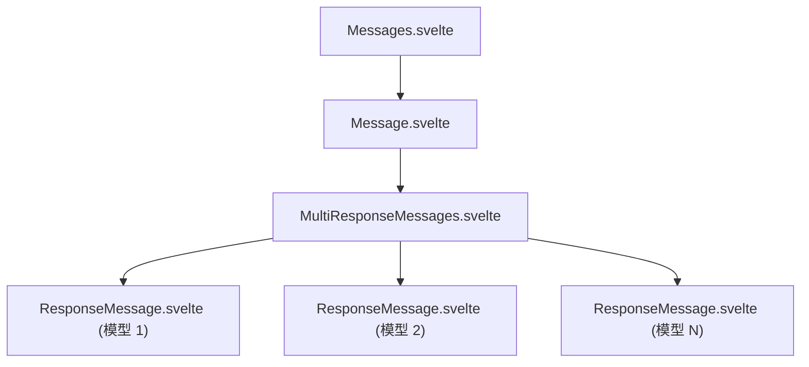
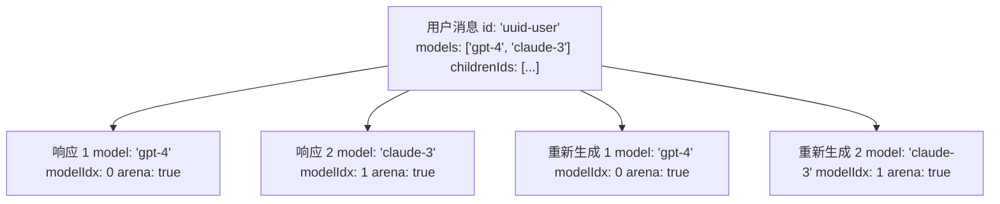
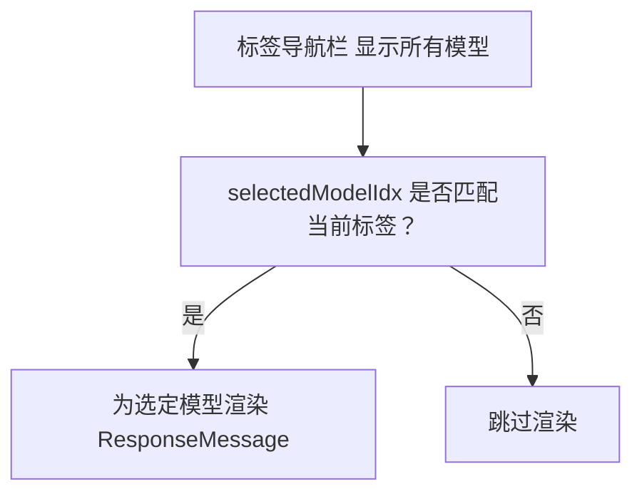
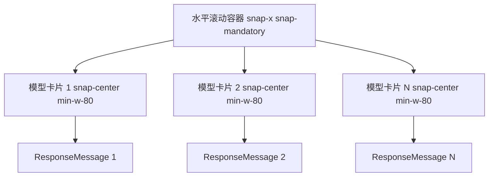
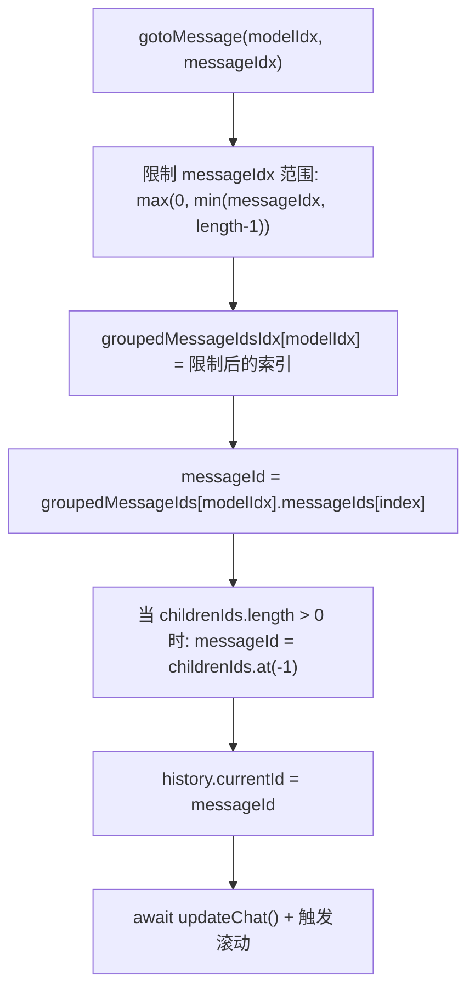
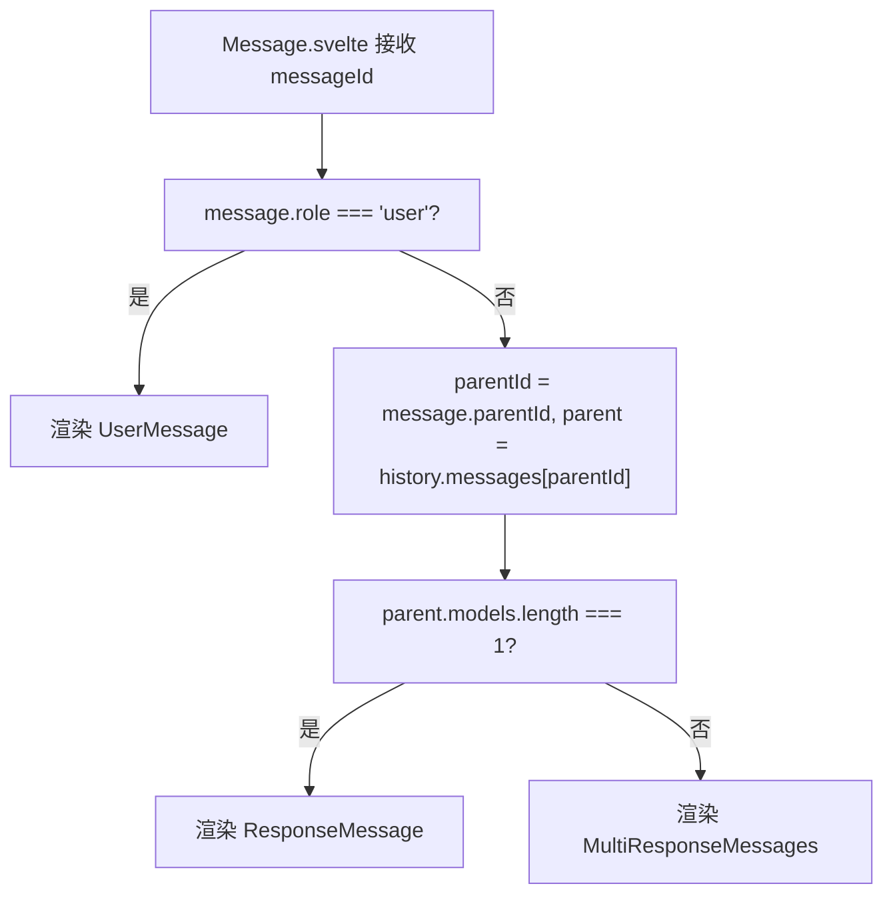
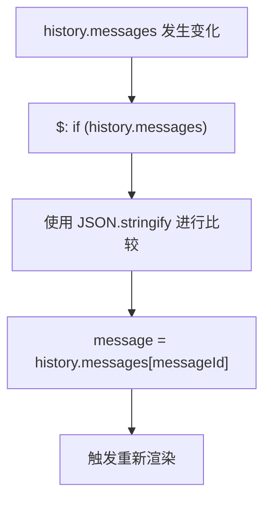
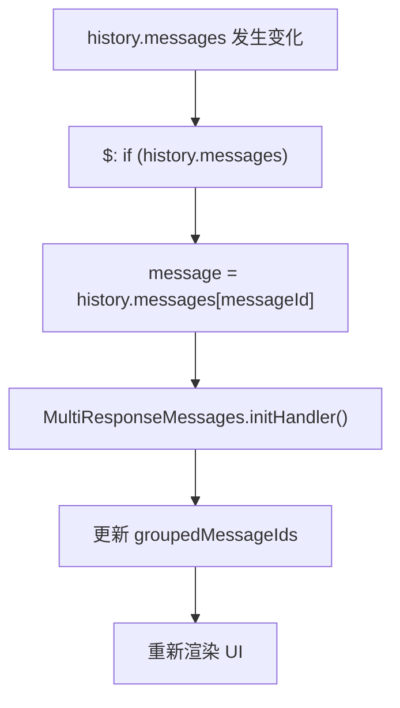

# 多模型响应显示

相关源文件

-   [src/lib/components/chat/ContentRenderer/FloatingButtons.svelte](https://github.com/open-webui/open-webui/blob/a7271532/src/lib/components/chat/ContentRenderer/FloatingButtons.svelte)
-   [src/lib/components/chat/Messages.svelte](https://github.com/open-webui/open-webui/blob/a7271532/src/lib/components/chat/Messages.svelte)
-   [src/lib/components/chat/Messages/CodeBlock.svelte](https://github.com/open-webui/open-webui/blob/a7271532/src/lib/components/chat/Messages/CodeBlock.svelte)
-   [src/lib/components/chat/Messages/ContentRenderer.svelte](https://github.com/open-webui/open-webui/blob/a7271532/src/lib/components/chat/Messages/ContentRenderer.svelte)
-   [src/lib/components/chat/Messages/Markdown.svelte](https://github.com/open-webui/open-webui/blob/a7271532/src/lib/components/chat/Messages/Markdown.svelte)
-   [src/lib/components/chat/Messages/Markdown/AlertRenderer.svelte](https://github.com/open-webui/open-webui/blob/a7271532/src/lib/components/chat/Messages/Markdown/AlertRenderer.svelte)
-   [src/lib/components/chat/Messages/Markdown/MarkdownTokens.svelte](https://github.com/open-webui/open-webui/blob/a7271532/src/lib/components/chat/Messages/Markdown/MarkdownTokens.svelte)
-   [src/lib/components/chat/Messages/Message.svelte](https://github.com/open-webui/open-webui/blob/a7271532/src/lib/components/chat/Messages/Message.svelte)
-   [src/lib/components/chat/Messages/MultiResponseMessages.svelte](https://github.com/open-webui/open-webui/blob/a7271532/src/lib/components/chat/Messages/MultiResponseMessages.svelte)
-   [src/lib/components/chat/Messages/ResponseMessage.svelte](https://github.com/open-webui/open-webui/blob/a7271532/src/lib/components/chat/Messages/ResponseMessage.svelte)
-   [src/lib/components/chat/Messages/UserMessage.svelte](https://github.com/open-webui/open-webui/blob/a7271532/src/lib/components/chat/Messages/UserMessage.svelte)
-   [src/lib/components/chat/Settings/Interface.svelte](https://github.com/open-webui/open-webui/blob/a7271532/src/lib/components/chat/Settings/Interface.svelte)
-   [src/lib/components/chat/SettingsModal.svelte](https://github.com/open-webui/open-webui/blob/a7271532/src/lib/components/chat/SettingsModal.svelte)
-   [src/lib/components/common/Modal.svelte](https://github.com/open-webui/open-webui/blob/a7271532/src/lib/components/common/Modal.svelte)
-   [src/lib/utils/index.ts](https://github.com/open-webui/open-webui/blob/a7271532/src/lib/utils/index.ts)
-   [src/lib/utils/marked/strikethrough-extension.ts](https://github.com/open-webui/open-webui/blob/a7271532/src/lib/utils/marked/strikethrough-extension.ts)
-   [src/lib/workers/pyodide.worker.ts](https://github.com/open-webui/open-webui/blob/a7271532/src/lib/workers/pyodide.worker.ts)
-   [src/routes/(app)/+layout.svelte](https://github.com/open-webui/open-webui/blob/a7271532/src/routes/(app)/+layout.svelte)
-   [src/routes/(app)/+page.svelte](https://github.com/open-webui/open-webui/blob/a7271532/src/routes/(app)/+page.svelte)
-   [src/routes/(app)/c/\[id\]/+page.svelte](src/routes/(app)/c/%5Bid%5D/+page.svelte)

## 目的与范围

本页记录了 `MultiResponseMessages` 组件，该组件负责显示和管理来自多个模型的响应，或同一个模型的多次重新生成结果。当一条用户消息拥有来自不同模型的响应（竞技场模式）时，该组件会通过标签页界面或并排卡片的形式组织并呈现这些响应。

该组件处理：

-   使用 `modelIdx` 字段按模型对响应进行分组。
-   为每个模型的响应维护独立的导航历史。
-   两种显示模式：标签页界面或并排卡片。
-   使用混合专家 (Mixture of Agents, MoA) 进行响应合并。

**注意：** 有关模型选择和消息分发的信息，请参阅第 [4.1 节 聊天组件架构](/open-webui/open-webui/4.1-chat-component-architecture)。有关整体消息渲染系统的信息，请参阅第 [5 节 消息渲染](/open-webui/open-webui/5-message-rendering)。

---

## 组件架构

`MultiResponseMessages` 组件接收一个消息 ID，并按模型组织其兄弟响应消息。它为每个模型维护独立的导航状态，允许用户浏览不同的重新生成结果，而不会影响其他模型显示的响应。

### 组件层级


### 关键 Props 与状态

| 变量 | 类型 | 用途 | 初始化位置 |
| --- | --- | --- | --- |
| `history` | `object` | 消息树结构 | 外部传递的 Prop |
| `messageId` | `string` | 当前消息 ID | 外部传递的 Prop |
| `parentMessage` | `object` | 带有 `models` 数组的用户消息 | `initHandler()` |
| `groupedMessageIds` | `object` | 按 `modelIdx` 分组的消息 | `initHandler()` |
| `groupedMessageIdsIdx` | `object` | 每个模型的当前显示索引 | `initHandler()` |
| `selectedModelIdx` | `number | null` | 标签页模式下的活跃模型 | `initHandler()` |

**来源：**

-   [src/lib/components/chat/Messages/MultiResponseMessages.svelte1-68](https://github.com/open-webui/open-webui/blob/a7271532/src/lib/components/chat/Messages/MultiResponseMessages.svelte#L1-L68)
-   [src/lib/components/chat/Messages.svelte76-88](https://github.com/open-webui/open-webui/blob/a7271532/src/lib/components/chat/Messages.svelte#L76-L88)
-   [src/lib/components/chat/Messages/Message.svelte76-126](https://github.com/open-webui/open-webui/blob/a7271532/src/lib/components/chat/Messages/Message.svelte#L76-L126)

---

## 消息结构

该组件要求消息呈树状结构：当一条用户消息对应多个模型时，该消息拥有多个子响应，每个子响应都标记有 `modelIdx`。

### 竞技场 (Arena) 消息结构


### 关键消息字段

| 字段 | 类型 | 位置 | 用途 |
| --- | --- | --- | --- |
| `models` | `string[]` | 用户消息 | 竞技场模式的模型 ID 数组 |
| `modelIdx` | `number` | 响应消息 | 在父级 `models` 数组中的索引 |
| `arena` | `boolean` | 响应消息 | 指示是否为竞技场模式的标志 |
| `childrenIds` | `string[]` | 任意消息 | 子消息引用列表 |
| `parentId` | `string` | 任意消息 | 父消息引用 |

**来源：**

-   [src/lib/components/chat/Messages/MultiResponseMessages.svelte147-176](https://github.com/open-webui/open-webui/blob/a7271532/src/lib/components/chat/Messages/MultiResponseMessages.svelte#L147-L176)
-   [src/lib/components/chat/Chat.svelte1471-1555](https://github.com/open-webui/open-webui/blob/a7271532/src/lib/components/chat/Chat.svelte#L1471-L1555)

---

## 响应分组与组织

`MultiResponseMessages` 组件按模型组织响应，并支持在每个模型的响应历史记录中进行独立导航。

### 初始化过程：`initHandler()`

> **[Mermaid sequence]**
> *(图表结构无法解析)*

### 数据结构：`groupedMessageIds`

`groupedMessageIds` 对象按模型索引组织消息：

```javascript
// 结构示例
groupedMessageIds = {
  0: { messageIds: ['uuid1', 'uuid3', 'uuid5'] },  // 模型[0]的所有响应
  1: { messageIds: ['uuid2', 'uuid4', 'uuid6'] },  // 模型[1]的所有响应
  2: { messageIds: ['uuid7', 'uuid8'] }             // 模型[2]的所有响应
}

// 对应的索引追踪器
groupedMessageIdsIdx = {
  0: 2,  // 当前显示模型 0 的第 3 条响应 (uuid5)
  1: 0,  // 当前显示模型 1 的第 1 条响应 (uuid2)
  2: 1   // 当前显示模型 2 的第 2 条响应 (uuid8)
}
```
位于 [src/lib/components/chat/Messages/MultiResponseMessages.svelte142-198](https://github.com/open-webui/open-webui/blob/a7271532/src/lib/components/chat/Messages/MultiResponseMessages.svelte#L142-L198) 的初始化执行以下操作：

1.  **获取父级消息** (第 147-149 行)：读取 `history.messages[message.parentId]` 以获取用户消息。
2.  **分组逻辑** (第 151-176 行)：针对 `parentMessage.models` 中的每个模型：
    -   通过匹配 `modelIdx` 来过滤 `childrenIds`。
    -   对于旧版消息（没有 modelIdx），回退到 `model` 字段进行过滤。
    -   使用正确的 `modelIdx` 更新旧版消息。
    -   将过滤后的消息 ID 存储在 `groupedMessageIds[modelIdx]` 中。
3.  **索引初始化** (第 178-191 行)：将 `groupedMessageIdsIdx[modelIdx]` 设置为每个组内当前显示的消息索引。
4.  **标签页选择** (第 193-196 行)：如果是标签页模式，则设置 `selectedModelIdx = 0`；否则设置为 `null`。

**来源：**

-   [src/lib/components/chat/Messages/MultiResponseMessages.svelte142-198](https://github.com/open-webui/open-webui/blob/a7271532/src/lib/components/chat/Messages/MultiResponseMessages.svelte#L142-L198)

---

## 显示模式

组件支持两种显示模式，由 `$settings?.displayMultiModelResponsesInTabs` 控制。

### 基于标签页的显示

当 `$settings?.displayMultiModelResponsesInTabs` 为 `true` 时：

**标签页渲染流程：**


**实现细节** ([src/lib/components/chat/Messages/MultiResponseMessages.svelte246-324](https://github.com/open-webui/open-webui/blob/a7271532/src/lib/components/chat/Messages/MultiResponseMessages.svelte#L246-L324))：

-   第 246-288 行：为每个模型渲染标签页按钮。
    -   通过 `$models.find(m => m.id === parentMessage.models[modelIdx])` 提取模型名称。
    -   标签页上的计数徽标显示 `groupedMessageIds[modelIdx].messageIds.length`。
    -   点击处理程序设置 `selectedModelIdx` 并调用 `onGroupClick(modelIdx)`。
-   第 290-324 行：仅为选定的模型渲染单个 `ResponseMessage`。
    -   使用条件语句 `{#if selectedModelIdx === modelIdx}`。
    -   消息 ID 取自 `groupedMessageIds[modelIdx].messageIds[groupedMessageIdsIdx[modelIdx]]`。

### 并排卡片显示

当禁用标签页显示时：

**卡片布局流程：**


**实现细节** ([src/lib/components/chat/Messages/MultiResponseMessages.svelte325-383](https://github.com/open-webui/open-webui/blob/a7271532/src/lib/components/chat/Messages/MultiResponseMessages.svelte#L325-L383))：

-   第 325 行：使用 `flex snap-x snap-mandatory overflow-x-auto` 的容器。
-   第 327-383 行：遍历模型，为每个模型渲染卡片：
    -   第 331-335 行：卡片样式为 `min-w-80`（桌面端）或 `min-w-full`（移动端）。
    -   第 336-340 行：如果是当前活跃项，边框样式为 `border-2`；否则为 `border-dashed`。
    -   第 342-348 行：带有名称和导航控件的模型头部。
    -   第 350-378 行：渲染 `ResponseMessage` 组件。
-   所有卡片同时渲染；浏览器处理屏幕外优化。

**来源：**

-   [src/lib/components/chat/Messages/MultiResponseMessages.svelte246-383](https://github.com/open-webui/open-webui/blob/a7271532/src/lib/components/chat/Messages/MultiResponseMessages.svelte#L246-L383)
-   [src/lib/stores/index.ts](https://github.com/open-webui/open-webui/blob/a7271532/src/lib/stores/index.ts) (settings store)

---

## 导航系统

每个模型通过 `groupedMessageIdsIdx` 维护独立的导航状态，允许用户浏览不同的重新生成结果，而不会影响其他模型显示的消息。

### 导航函数

| 函数 | 签名 | 用途 |
| --- | --- | --- |
| `gotoMessage` | `(modelIdx, messageIdx)` | 跳转到特定响应索引 |
| `showPreviousMessage` | `(modelIdx)` | 递减该模型的索引 |
| `showNextMessage` | `(modelIdx)` | 递增该模型的索引 |

### 导航流程：`gotoMessage()`


**实现细节** ([src/lib/components/chat/Messages/MultiResponseMessages.svelte70-97](https://github.com/open-webui/open-webui/blob/a7271532/src/lib/components/chat/Messages/MultiResponseMessages.svelte#L70-L97))：

1.  **索引限制** (第 72-75 行)：确保 `messageIdx` 在有效范围 `[0, length-1]` 内。
2.  **状态更新** (第 72 行)：将 `groupedMessageIdsIdx[modelIdx]` 更新为新索引。
3.  **消息查找** (第 78 行)：从 `groupedMessageIds[modelIdx].messageIds[index]` 获取消息 ID。
4.  **分支遍历** (第 83-86 行)：使用 `while` 循环遍历到最深层的子节点。
    -   始终遵循最后一个子节点：`messageId = messageChildrenIds.at(-1)`。
    -   确保 `history.currentId` 指向叶节点。
5.  **同步** (第 89-95 行)：更新历史记录，调用 `updateChat()`，并触发滚动。

### 独立导航示例

```
模型 0 (GPT-4): [Resp1, Resp2, Resp3] → 当前位于索引 2 (Resp3)
模型 1 (Claude): [Resp1, Resp2]       → 当前位于索引 0 (Resp1)

用户点击模型 1 的“下一步 (Next)”：
- groupedMessageIdsIdx[1] 从 0 变为 1
- 模型 0 保持在索引 2
- history.currentId 更新为模型 1 的 Resp2
```
**来源：**

-   [src/lib/components/chat/Messages/MultiResponseMessages.svelte70-140](https://github.com/open-webui/open-webui/blob/a7271532/src/lib/components/chat/Messages/MultiResponseMessages.svelte#L70-L140)

---

## 响应合并

组件支持使用混合专家 (Mixture of Agents, MoA) 方法合并所有模型的响应。

### 合并按钮可见性

合并按钮在以下情况出现：

-   `isLastMessage === true`（这是聊天中的最新一条消息）。
-   所有模型响应均已完成 (`done === true`)。

位于 [src/lib/components/chat/Messages/MultiResponseMessages.svelte421-439](https://github.com/open-webui/open-webui/blob/a7271532/src/lib/components/chat/Messages/MultiResponseMessages.svelte#L421-L439)。

### 合并流程

> **[Mermaid sequence]**
> *(图表结构无法解析)*

### 实现方式

**mergeResponsesHandler()** ([src/lib/components/chat/Messages/MultiResponseMessages.svelte217-225](https://github.com/open-webui/open-webui/blob/a7271532/src/lib/components/chat/Messages/MultiResponseMessages.svelte#L217-L225))：

1.  **响应收集** (第 218-223 行)：

    ```javascript
    const responses = [];
    for (const [modelIdx, model] of Object.entries(groupedMessageIds)) {
      const messageId = model.messageIds[groupedMessageIdsIdx[modelIdx]];
      const message = history.messages[messageId];
      responses.push(message.content);
    }
    ```

2.  **调用 API** (第 224 行)：
    -   调用 `mergeResponses(messageId, responses, chatId)`。
    -   触发来自 [src/lib/apis/index.ts](https://github.com/open-webui/open-webui/blob/a7271532/src/lib/apis/index.ts) 的 `generateMoACompletion()` API。
3.  **结果存储**：合并后的响应存储在 `history.messages[messageId].merged` 中：

    ```javascript
    merged: {
      status: boolean,
      content: string,
      timestamp: number
    }
    ```


**显示方式** ([src/lib/components/chat/Messages/MultiResponseMessages.svelte394-418](https://github.com/open-webui/open-webui/blob/a7271532/src/lib/components/chat/Messages/MultiResponseMessages.svelte#L394-L418))：

-   在所有模型响应下方渲染。
-   显示带有个人资料图片的“合并响应 (Merged Response)”头部。
-   使用 `Markdown` 组件渲染合并后的内容。

**来源：**

-   [src/lib/components/chat/Messages/MultiResponseMessages.svelte217-225](https://github.com/open-webui/open-webui/blob/a7271532/src/lib/components/chat/Messages/MultiResponseMessages.svelte#L217-L225)
-   [src/lib/components/chat/Messages/MultiResponseMessages.svelte394-439](https://github.com/open-webui/open-webui/blob/a7271532/src/lib/components/chat/Messages/MultiResponseMessages.svelte#L394-L439)
-   [src/lib/apis/index.ts](https://github.com/open-webui/open-webui/blob/a7271532/src/lib/apis/index.ts) (generateMoACompletion)

---

## 消息分组算法

组件通过 `modelIdx` 字段对兄弟响应消息进行分组，该字段对应于模型在父级 `models` 数组中的位置。

### 分组逻辑

**算法步骤** ([src/lib/components/chat/Messages/MultiResponseMessages.svelte151-176](https://github.com/open-webui/open-webui/blob/a7271532/src/lib/components/chat/Messages/MultiResponseMessages.svelte#L151-L176))：

```
对于 parentMessage.models 中的每个 modelIdx：
  1. 过滤 childrenIds，其中满足 message.modelIdx === modelIdx。
  2. 如果未找到匹配项（针对旧版消息）：
     - 根据满足 message.model === parentMessage.models[modelIdx] 进行过滤。
     - 使用 modelIdx 更新找到的消息。
  3. 将结果存储在 groupedMessageIds[modelIdx] 中。
```
**代码结构：**

```javascript
for (const [idx, model] of parentMessage.models.entries()) {
  let modelMessageIds = parentMessage.childrenIds.filter(
    (id) => history.messages[id]?.modelIdx === idx
  );

  // 旧版支持
  if (modelMessageIds.length === 0) {
    modelMessageIds = parentMessage.childrenIds.filter(
      (id) => history.messages[id].model === model
    );
    // 更新旧版消息
    modelMessageIds.forEach(id => {
      history.messages[id].modelIdx = idx;
    });
  }

  groupedMessageIds[idx] = { messageIds: modelMessageIds };
}
```
### 分组示例

```
父级消息：
  models: ['gpt-4', 'claude-3-opus']
  childrenIds: ['msg1', 'msg2', 'msg3', 'msg4']

子消息：
  msg1: { model: 'gpt-4', modelIdx: 0 }
  msg2: { model: 'claude-3-opus', modelIdx: 1 }
  msg3: { model: 'gpt-4', modelIdx: 0 }       (重新生成)
  msg4: { model: 'claude-3-opus', modelIdx: 1 } (重新生成)

结果：
  groupedMessageIds = {
    0: { messageIds: ['msg1', 'msg3'] },  // GPT-4 响应
    1: { messageIds: ['msg2', 'msg4'] }   // Claude 响应
  }
```
**来源：**

-   [src/lib/components/chat/Messages/MultiResponseMessages.svelte151-176](https://github.com/open-webui/open-webui/blob/a7271532/src/lib/components/chat/Messages/MultiResponseMessages.svelte#L151-L176)

---

## 组件路由

当父消息具有多个模型时，`Message` 组件会路由到 `MultiResponseMessages`。

### 路由逻辑


**实现细节** ([src/lib/components/chat/Messages/Message.svelte54-127](https://github.com/open-webui/open-webui/blob/a7271532/src/lib/components/chat/Messages/Message.svelte#L54-L127))：

-   **第 55-75 行**：如果 `message.role === 'user'`，渲染 `UserMessage`。
-   **第 76 行**：检查 `history.messages[message.parentId]?.models?.length`。
-   **第 77-101 行**：如果长度为 1，渲染单个 `ResponseMessage`。
-   **第 102-126 行**：如果长度 > 1，渲染 `MultiResponseMessages`。

这种条件路由确保仅当一条用户消息被发送到多个模型时，才会出现多模型界面。

**来源：**

-   [src/lib/components/chat/Messages/Message.svelte54-127](https://github.com/open-webui/open-webui/blob/a7271532/src/lib/components/chat/Messages/Message.svelte#L54-L127)
-   [src/lib/components/chat/Messages.svelte76-88](https://github.com/open-webui/open-webui/blob/a7271532/src/lib/components/chat/Messages.svelte#L76-L88)

---

## 状态同步

组件通过响应式更新和事件处理保持与消息树的一致性。

### 响应式消息更新


**实现方式** ([src/lib/components/chat/Messages/MultiResponseMessages.svelte63-68](https://github.com/open-webui/open-webui/blob/a7271532/src/lib/components/chat/Messages/MultiResponseMessages.svelte#L63-L68))：

```javascript
$: if (history.messages) {
  if (JSON.stringify(message) !== JSON.stringify(history.messages[messageId])) {
    message = JSON.parse(JSON.stringify(history.messages[messageId]));
  }
}
```
该响应式语句执行以下操作：

1.  监视 `history.messages` 的变动。
2.  对当前的 `message` 和 `history.messages[messageId]` 进行深层比较。
3.  如果不同，则更新本地 `message`。
4.  触发组件重新渲染。

### 事件驱动的更新

组件通过 `chatEventHandler` ([src/lib/components/chat/Chat.svelte350-477](https://github.com/open-webui/open-webui/blob/a7271532/src/lib/components/chat/Chat.svelte#L350-L477)) 响应聊天事件：

| 事件类型 | 对 MultiResponseMessages 的影响 |
| --- | --- |
| `chat:completion` | 更新特定模型的消息内容 |
| `status` | 添加到消息的 `statusHistory` |
| `chat:tasks:cancel` | 将所有响应标记为已完成 |
| `chat:message` | 替换整条消息的内容 |

所有更新都会修改 `history.messages[messageId]`，从而触发上述的响应式更新。

**来源：**

-   [src/lib/components/chat/Messages/MultiResponseMessages.svelte63-68](https://github.com/open-webui/open-webui/blob/a7271532/src/lib/components/chat/Messages/MultiResponseMessages.svelte#L63-L68)
-   [src/lib/components/chat/Messages/ResponseMessage.svelte122-127](https://github.com/open-webui/open-webui/blob/a7271532/src/lib/components/chat/Messages/ResponseMessage.svelte#L122-L127)
-   [src/lib/components/chat/Chat.svelte350-477](https://github.com/open-webui/open-webui/blob/a7271532/src/lib/components/chat/Chat.svelte#L350-L477)

---

## 状态同步 (补充)

竞技场系统通过响应式更新和事件处理保持 UI 状态与底层消息树的一致性。

### 响应式更新流程


### 事件驱动的更新 (补充)

位于 [src/lib/components/chat/Chat.svelte350-477](https://github.com/open-webui/open-webui/blob/a7271532/src/lib/components/chat/Chat.svelte#L350-L477) 的 `chatEventHandler` 处理实时事件：

| 事件类型 | 动作 | 行号 |
| --- | --- | --- |
| `chat:completion` | 更新消息内容 | 368 |
| `status` | 添加到 statusHistory | 361-366 |
| `chat:tasks:cancel` | 将所有响应标记为已完成 | 369-375 |
| `chat:message` | 替换消息内容 | 378-379 |

所有更新都会直接修改 `history.messages[messageId]`，触发子组件的响应式重新渲染。

**来源：**

-   [src/lib/components/chat/Chat.svelte350-477](https://github.com/open-webui/open-webui/blob/a7271532/src/lib/components/chat/Chat.svelte#L350-L477)
-   [src/lib/components/chat/Messages/MultiResponseMessages.svelte63-68](https://github.com/open-webui/open-webui/blob/a7271532/src/lib/components/chat/Messages/MultiResponseMessages.svelte#L63-L68)
-   [src/lib/components/chat/Messages/ResponseMessage.svelte122-127](https://github.com/open-webui/open-webui/blob/a7271532/src/lib/components/chat/Messages/ResponseMessage.svelte#L122-L127)

---

## 配置设置

组件的行为受来自 `$settings` store 的用户设置控制。

### 显示设置

| 设置键名 | 类型 | 默认值 | 效果 |
| --- | --- | --- | --- |
| `displayMultiModelResponsesInTabs` | `boolean` | `false` | 使用标签页 vs 并排卡片 |
| `scrollOnBranchChange` | `boolean` | `true` | 导航时自动滚动 |
| `widescreenMode` | `boolean` | `null` | 全宽消息布局 |
| `chatBubble` | `boolean` | `true` | 气泡风格格式化 |

**使用模式：**

```javascript
$settings?.displayMultiModelResponsesInTabs ?? false
```
可选链 (`?.`) 配合空值合并操作符 (`??`) 在设置未定义时提供安全默认值。

### 代码中的设置引用

-   **标签页模式检查** ([src/lib/components/chat/Messages/MultiResponseMessages.svelte246](https://github.com/open-webui/open-webui/blob/a7271532/src/lib/components/chat/Messages/MultiResponseMessages.svelte#L246-L246)): `$settings?.displayMultiModelResponsesInTabs`
-   **滚动行为** ([src/lib/components/chat/Messages/MultiResponseMessages.svelte93-95](https://github.com/open-webui/open-webui/blob/a7271532/src/lib/components/chat/Messages/MultiResponseMessages.svelte#L93-L95)): `$settings?.scrollOnBranchChange ?? true`
-   **布局宽度** ([src/lib/components/chat/Messages/Message.svelte51](https://github.com/open-webui/open-webui/blob/a7271532/src/lib/components/chat/Messages/Message.svelte#L51-L51)): `$settings?.widescreenMode`

**来源：**

-   [src/lib/components/chat/Messages/MultiResponseMessages.svelte246](https://github.com/open-webui/open-webui/blob/a7271532/src/lib/components/chat/Messages/MultiResponseMessages.svelte#L246-L246)
-   [src/lib/components/chat/Messages/MultiResponseMessages.svelte93-95](https://github.com/open-webui/open-webui/blob/a7271532/src/lib/components/chat/Messages/MultiResponseMessages.svelte#L93-L95)
-   [src/lib/stores/index.ts](https://github.com/open-webui/open-webui/blob/a7271532/src/lib/stores/index.ts) (settings store)

---

## 错误处理

该组件处理了几个边界情况以确保鲁棒运行。

### 旧版消息迁移

**问题**：在引入 `modelIdx` 字段之前创建的消息缺少此分组键。

**解决方案** ([src/lib/components/chat/Messages/MultiResponseMessages.svelte158-170](https://github.com/open-webui/open-webui/blob/a7271532/src/lib/components/chat/Messages/MultiResponseMessages.svelte#L158-L170))：

```javascript
// 首次尝试：按 modelIdx 过滤
let modelMessageIds = childrenIds.filter(
  (id) => history.messages[id]?.modelIdx === idx
);

// 针对旧版消息的回退处理
if (modelMessageIds.length === 0) {
  modelMessageIds = childrenIds.filter(
    (id) => history.messages[id].model === parentMessage.models[idx]
  );

  // 迁移旧版消息
  modelMessageIds.forEach(id => {
    history.messages[id].modelIdx = idx;
  });
}
```
这确保了向后兼容性，同时逐步迁移旧消息。

### 边界条件

| 条件 | 处理方式 | 位置 |
| --- | --- | --- |
| 无效的 `messageIdx` | 限制在 `[0, length-1]` 范围内 | 第 72-74 行 |
| 缺少父级消息 | 使用 `{#if parentMessage}` 条件渲染 | 第 240 行 |
| 空消息组 | 在导航计数器中显示 0 | 第 281 行 |
| 无模型 | 不渲染组件（路由至 `ResponseMessage`） | Message.svelte:76 |

### 独立重新生成

当用户重新生成单个模型的响应时：

-   其他模型保留其当前的 `groupedMessageIdsIdx`。
-   新消息追加到 `groupedMessageIds[modelIdx].messageIds` 中。
-   UI 仅更新受影响模型的显示内容。

**来源：**

-   [src/lib/components/chat/Messages/MultiResponseMessages.svelte72-74](https://github.com/open-webui/open-webui/blob/a7271532/src/lib/components/chat/Messages/MultiResponseMessages.svelte#L72-L74)
-   [src/lib/components/chat/Messages/MultiResponseMessages.svelte158-170](https://github.com/open-webui/open-webui/blob/a7271532/src/lib/components/chat/Messages/MultiResponseMessages.svelte#L158-L170)
-   [src/lib/components/chat/Messages/MultiResponseMessages.svelte240](https://github.com/open-webui/open-webui/blob/a7271532/src/lib/components/chat/Messages/MultiResponseMessages.svelte#L240-L240)

---

## 性能考量

竞技场系统通过几种策略优化性能：

### 懒渲染 (Lazy Rendering)

-   在标签页模式下，仅渲染当前活跃的标签。
-   使用 `{#key history.currentId}` 强制在导航时重新挂载。
-   卡片模式渲染所有项，但浏览器会高效处理屏幕外的卡片。

### 滚动优化

水平滚动使用 `snap-x snap-mandatory` CSS 以实现顺滑导航：

```html
<div class="flex snap-x snap-mandatory overflow-x-auto scrollbar-hidden">
```
卡片使用 `snap-center` 对齐以实现精准定位。

### 消息树遍历

导航函数使用 `while` 循环高效地遍历到叶节点：

```javascript
while (messageChildrenIds.length !== 0) {
  messageId = messageChildrenIds.at(-1);
  messageChildrenIds = history.messages[messageId].childrenIds;
}
```
这确保了 O(depth) 的复杂度，而不是搜索整棵树。

**来源：**

-   [src/lib/components/chat/Messages/MultiResponseMessages.svelte243-383](https://github.com/open-webui/open-webui/blob/a7271532/src/lib/components/chat/Messages/MultiResponseMessages.svelte#L243-L383)
-   [src/lib/components/chat/Messages/MultiResponseMessages.svelte82-86](https://github.com/open-webui/open-webui/blob/a7271532/src/lib/components/chat/Messages/MultiResponseMessages.svelte#L82-L86)
