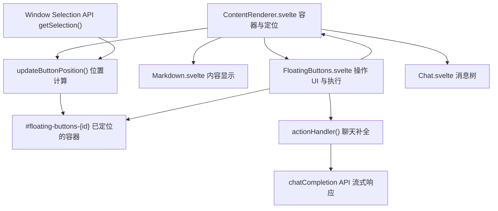
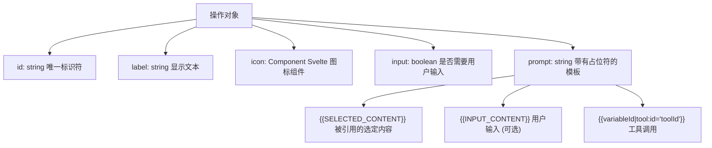
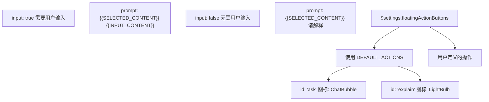
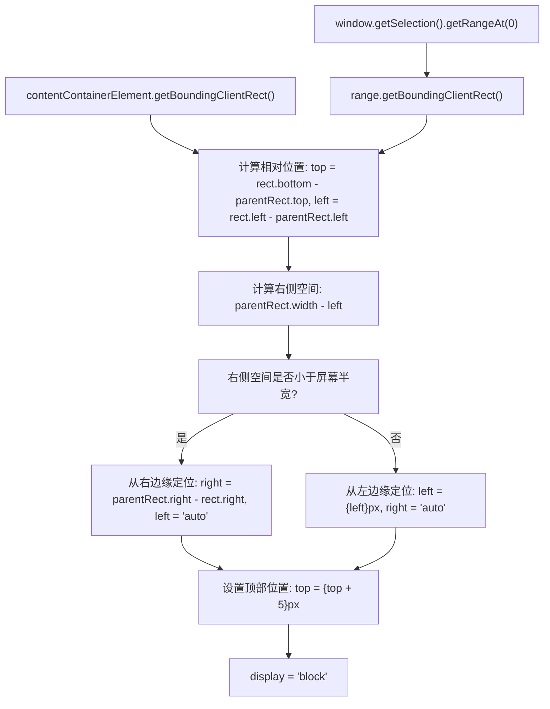
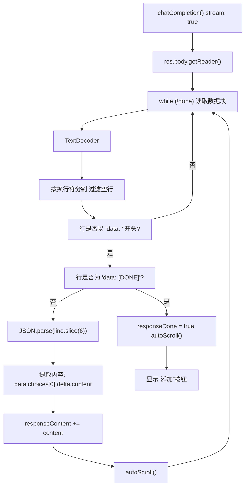
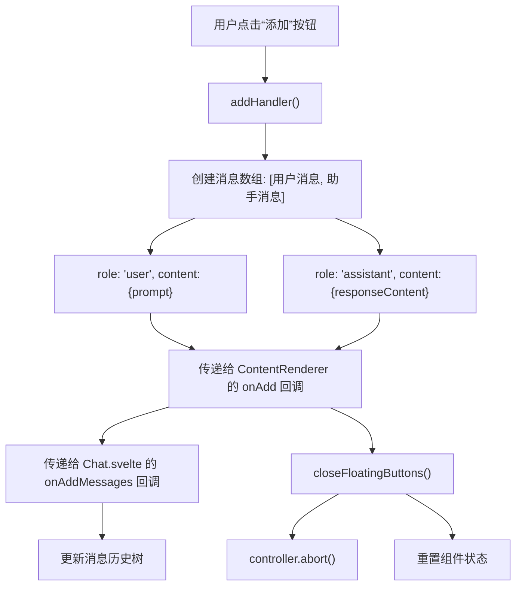
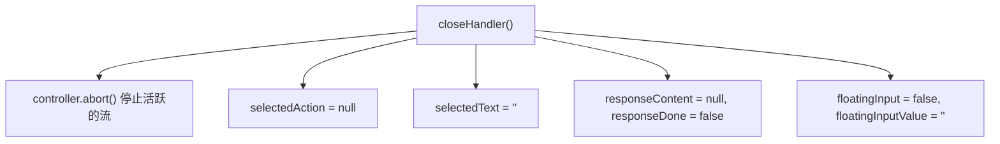

# 内容选择操作

相关源文件

-   [src/lib/components/chat/ContentRenderer/FloatingButtons.svelte](https://github.com/open-webui/open-webui/blob/a7271532/src/lib/components/chat/ContentRenderer/FloatingButtons.svelte)
-   [src/lib/components/chat/Messages/CodeBlock.svelte](https://github.com/open-webui/open-webui/blob/a7271532/src/lib/components/chat/Messages/CodeBlock.svelte)
-   [src/lib/components/chat/Messages/ContentRenderer.svelte](https://github.com/open-webui/open-webui/blob/a7271532/src/lib/components/chat/Messages/ContentRenderer.svelte)
-   [src/lib/components/chat/Messages/Markdown.svelte](https://github.com/open-webui/open-webui/blob/a7271532/src/lib/components/chat/Messages/Markdown.svelte)
-   [src/lib/components/chat/Messages/Markdown/AlertRenderer.svelte](https://github.com/open-webui/open-webui/blob/a7271532/src/lib/components/chat/Messages/Markdown/AlertRenderer.svelte)
-   [src/lib/components/chat/Messages/Markdown/MarkdownTokens.svelte](https://github.com/open-webui/open-webui/blob/a7271532/src/lib/components/chat/Messages/Markdown/MarkdownTokens.svelte)
-   [src/lib/components/chat/Messages/Message.svelte](https://github.com/open-webui/open-webui/blob/a7271532/src/lib/components/chat/Messages/Message.svelte)
-   [src/lib/components/chat/Messages/MultiResponseMessages.svelte](https://github.com/open-webui/open-webui/blob/a7271532/src/lib/components/chat/Messages/MultiResponseMessages.svelte)
-   [src/lib/utils/marked/strikethrough-extension.ts](https://github.com/open-webui/open-webui/blob/a7271532/src/lib/utils/marked/strikethrough-extension.ts)
-   [src/lib/workers/pyodide.worker.ts](https://github.com/open-webui/open-webui/blob/a7271532/src/lib/workers/pyodide.worker.ts)

## 目的与范围

内容选择操作系统在用户选择 AI 响应消息中的文本时提供上下文交互能力。当文本被高亮显示时，会出现一个悬浮工具栏，提供如“提问”（用于后续问题）和“解释”（用于澄清说明）等操作。这些操作会触发新的 AI 补全任务，并将选定的文本作为上下文，结果将显示在行内预览中，然后用户可选择将其添加到对话历史中。

本文档涵盖了 `FloatingButtons` 组件及其与内容渲染流水线的集成。有关整体消息渲染系统的信息，请参阅 [消息内容渲染](/open-webui/open-webui/4-chat-system)。有关聊天补全处理，请参阅 [聊天请求处理](/open-webui/open-webui/5.1-response-message-component)。

## 系统架构

内容选择操作系统由两个主要的协作组件组成，它们共同提供上下文交互：

### 组件集成图


**来源：**

-   [src/lib/components/chat/ContentRenderer/FloatingButtons.svelte1-365](https://github.com/open-webui/open-webui/blob/a7271532/src/lib/components/chat/ContentRenderer/FloatingButtons.svelte#L1-L365)
-   [src/lib/components/chat/Messages/ContentRenderer.svelte1-223](https://github.com/open-webui/open-webui/blob/a7271532/src/lib/components/chat/Messages/ContentRenderer.svelte#L1-L223)

### 组件职责

| 组件 | 文件 | 主要职责 |
| --- | --- | --- |
| `ContentRenderer` | `ContentRenderer.svelte` | - 通过 mouseup 事件检测文本选择<br>- 计算悬浮 UI 的定位<br>- 事件处理程序的注册与清理<br>- 与 Chat 组件集成 |
| `FloatingButtons` | `FloatingButtons.svelte` | - 渲染操作按钮<br>- 为参数化操作提供可选的输入框<br>- 执行聊天补全任务<br>- 响应的流式传输与显示<br>- 创建结果消息 |

**来源：**

-   [src/lib/components/chat/Messages/ContentRenderer.svelte1-223](https://github.com/open-webui/open-webui/blob/a7271532/src/lib/components/chat/Messages/ContentRenderer.svelte#L1-L223)
-   [src/lib/components/chat/ContentRenderer/FloatingButtons.svelte1-365](https://github.com/open-webui/open-webui/blob/a7271532/src/lib/components/chat/ContentRenderer/FloatingButtons.svelte#L1-L365)

## 操作定义系统

操作被定义为具有特定架构的对象，用于控制其行为和外观。系统同时支持默认操作和自定义用户定义操作。

### 操作架构 (Action Schema)


**来源：**

-   [src/lib/components/chat/ContentRenderer/FloatingButtons.svelte41-55](https://github.com/open-webui/open-webui/blob/a7271532/src/lib/components/chat/ContentRenderer/FloatingButtons.svelte#L41-L55)

### 默认操作

系统在 `DEFAULT_ACTIONS` 中提供了两个内置操作：


**实现细节：**

-   默认操作定义在 [src/lib/components/chat/ContentRenderer/FloatingButtons.svelte41-55](https://github.com/open-webui/open-webui/blob/a7271532/src/lib/components/chat/ContentRenderer/FloatingButtons.svelte#L41-L55)。
-   操作列表通过响应式语句解析：`$: if (actions.length === 0) { actions = DEFAULT_ACTIONS; }`（见[第 37-39 行](https://github.com/open-webui/open-webui/blob/a7271532/src/lib/components/chat/ContentRenderer/FloatingButtons.svelte#L37-L39)）。
-   导入的图标：`ChatBubble` 和 `LightBulb`（见[第 12-13 行](https://github.com/open-webui/open-webui/blob/a7271532/src/lib/components/chat/ContentRenderer/FloatingButtons.svelte#L12-L13)）。

**来源：**

-   [src/lib/components/chat/ContentRenderer/FloatingButtons.svelte37-55](https://github.com/open-webui/open-webui/blob/a7271532/src/lib/components/chat/ContentRenderer/FloatingButtons.svelte#L37-L55)

## 选择检测与定位

`ContentRenderer` 组件管理检测文本选择和定位悬浮按钮 UI 的生命周期。

### 事件流图

> **[Mermaid sequence]**
> *(图表结构无法解析)*

**来源：**

-   [src/lib/components/chat/Messages/ContentRenderer.svelte46-95](https://github.com/open-webui/open-webui/blob/a7271532/src/lib/components/chat/Messages/ContentRenderer.svelte#L46-L95)

### 位置计算逻辑

定位算法确保悬浮按钮出现在选定文本附近，同时保持在视口范围内：


**关键定位逻辑：**

-   移动端/桌面端的阈值计算为：`$mobile ? window.innerWidth / 2 : window.innerWidth / 3`（见 [src/lib/components/chat/Messages/ContentRenderer.svelte78](https://github.com/open-webui/open-webui/blob/a7271532/src/lib/components/chat/Messages/ContentRenderer.svelte#L78-L78)）。
-   当空间不足时，有条件地进行右对齐（见[第 80-88 行](https://github.com/open-webui/open-webui/blob/a7271532/src/lib/components/chat/Messages/ContentRenderer.svelte#L80-L88)）。
-   顶部位置增加 5px 的偏移间距（见[第 89 行](https://github.com/open-webui/open-webui/blob/a7271532/src/lib/components/chat/Messages/ContentRenderer.svelte#L89-L89)）。

**来源：**

-   [src/lib/components/chat/Messages/ContentRenderer.svelte61-90](https://github.com/open-webui/open-webui/blob/a7271532/src/lib/components/chat/Messages/ContentRenderer.svelte#L61-L90)

## 操作执行流程

当用户点击操作按钮时，系统会处理提示词模板，执行聊天补全任务，并显示流式响应。

### 执行序列图

> **[Mermaid sequence]**
> *(图表结构无法解析)*

**来源：**

-   [src/lib/components/chat/ContentRenderer/FloatingButtons.svelte70-204](https://github.com/open-webui/open-webui/blob/a7271532/src/lib/components/chat/ContentRenderer/FloatingButtons.svelte#L70-L204)

### 提示词模板处理

`actionHandler` 函数按特定顺序处理模板占位符：

**处理流水线：**

1.  **工具 ID 提取**（[第 92-106 行](https://github.com/open-webui/open-webui/blob/a7271532/src/lib/components/chat/ContentRenderer/FloatingButtons.svelte#L92-L106)）：
    -   模式：`{{variableId|tool:id="toolId"}}` 提取工具 ID 并用 variableId 替换。
    -   旧模式：`{{TOOL:toolId}}`（向后兼容）。
    -   提取出的工具 ID 作为 `tool_ids` 参数传递给聊天补全任务。
2.  **输入内容替换**（[第 108-111 行](https://github.com/open-webui/open-webui/blob/a7271532/src/lib/components/chat/ContentRenderer/FloatingButtons.svelte#L108-L111)）：
    -   如果操作包含 `input: true` 且提示词包含 `{{INPUT_CONTENT}}`。
    -   使用来自用户输入框的 `floatingInputValue` 进行替换。
3.  **选定内容替换**（[第 113-114 行](https://github.com/open-webui/open-webui/blob/a7271532/src/lib/components/chat/ContentRenderer/FloatingButtons.svelte#L113-L114)）：
    -   `{{CONTENT}}`：原始选定文本。
    -   `{{SELECTED_CONTENT}}`：每行都带有 `>` 前缀的文本（Markdown 引用格式）。
    -   引用格式在 [第 76-79 行](https://github.com/open-webui/open-webui/blob/a7271532/src/lib/components/chat/ContentRenderer/FloatingButtons.svelte#L76-L79) 应用。

**来源：**

-   [src/lib/components/chat/ContentRenderer/FloatingButtons.svelte70-114](https://github.com/open-webui/open-webui/blob/a7271532/src/lib/components/chat/ContentRenderer/FloatingButtons.svelte#L70-L114)
-   [src/lib/components/chat/ContentRenderer/FloatingButtons.svelte76-79](https://github.com/open-webui/open-webui/blob/a7271532/src/lib/components/chat/ContentRenderer/FloatingButtons.svelte#L76-L79)

## 响应流式传输与显示

系统使用服务器发送事件 (SSE) 增量地流式传输 AI 响应，提供实时反馈。

### 流式处理流程


**实现细节：**

-   在 [src/lib/components/chat/ContentRenderer/FloatingButtons.svelte148](https://github.com/open-webui/open-webui/blob/a7271532/src/lib/components/chat/ContentRenderer/FloatingButtons.svelte#L148-L148) 初始化流读取器。
-   在 [第 151-191 行](https://github.com/open-webui/open-webui/blob/a7271532/src/lib/components/chat/ContentRenderer/FloatingButtons.svelte#L151-L191) 进行逐行处理循环。
-   在 [第 179-183 行](https://github.com/open-webui/open-webui/blob/a7271532/src/lib/components/chat/ContentRenderer/FloatingButtons.svelte#L179-L183) 从增量数据中提取内容。
-   [第 57-68 行](https://github.com/open-webui/open-webui/blob/a7271532/src/lib/components/chat/ContentRenderer/FloatingButtons.svelte#L57-L68) 的自动滚动逻辑确保在响应容器接近底部（50px 缓冲区内）时自动滚动到底部。

**来源：**

-   [src/lib/components/chat/ContentRenderer/FloatingButtons.svelte119-204](https://github.com/open-webui/open-webui/blob/a7271532/src/lib/components/chat/ContentRenderer/FloatingButtons.svelte#L119-L204)
-   [src/lib/components/chat/ContentRenderer/FloatingButtons.svelte57-68](https://github.com/open-webui/open-webui/blob/a7271532/src/lib/components/chat/ContentRenderer/FloatingButtons.svelte#L57-L68)

### UI 状态转换

`FloatingButtons` 组件根据执行进度渲染不同的 UI 状态：

| 状态 | 条件 | 渲染的 UI |
| --- | --- | --- |
| **操作选择** | `responseContent === null && !floatingInput` | 带有图标和标签的操作按钮 |
| **输入模式** | `responseContent === null && floatingInput` | 圆角输入框及提交按钮 |
| **响应流式传输** | `responseContent !== null` | 带有 Markdown 渲染的响应容器 |
| **响应完成** | `responseContent !== null && responseDone` | 响应容器 + “添加”按钮 |

**条件渲染逻辑：**

-   [src/lib/components/chat/ContentRenderer/FloatingButtons.svelte250](https://github.com/open-webui/open-webui/blob/a7271532/src/lib/components/chat/ContentRenderer/FloatingButtons.svelte#L250-L250) 处的顶层条件。
-   [第 285-326 行](https://github.com/open-webui/open-webui/blob/a7271532/src/lib/components/chat/ContentRenderer/FloatingButtons.svelte#L285-L326) 的输入框渲染。
-   [第 327-363 行](https://github.com/open-webui/open-webui/blob/a7271532/src/lib/components/chat/ContentRenderer/FloatingButtons.svelte#L327-L363) 的响应容器。
-   当 `responseDone` 时显示“添加”按钮（见[第 350-359 行](https://github.com/open-webui/open-webui/blob/a7271532/src/lib/components/chat/ContentRenderer/FloatingButtons.svelte#L350-L359)）。

**来源：**

-   [src/lib/components/chat/ContentRenderer/FloatingButtons.svelte250-363](https://github.com/open-webui/open-webui/blob/a7271532/src/lib/components/chat/ContentRenderer/FloatingButtons.svelte#L250-L363)

## 消息集成

当用户在接收到响应后点击“添加”按钮时，系统会创建新消息并将其集成到聊天历史树中。

### 添加处理器流程 (Add Handler Flow)


**创建的消息结构：**

```javascript
const messages = [
  {
    role: 'user',
    content: content  // 替换占位符后的最终提示词
  },
  {
    role: 'assistant',
    content: responseContent  // 流式传输的 AI 响应
  }
];
```
**回调链：**

1.  `addHandler()` 在 [src/lib/components/chat/ContentRenderer/FloatingButtons.svelte206-223](https://github.com/open-webui/open-webui/blob/a7271532/src/lib/components/chat/ContentRenderer/FloatingButtons.svelte#L206-L223) 创建消息。
2.  在 [第 218-222 行](https://github.com/open-webui/open-webui/blob/a7271532/src/lib/components/chat/ContentRenderer/FloatingButtons.svelte#L218-L222) 调用 `onAdd({ modelId, parentId, messages })`。
3.  `ContentRenderer` 接收回调并在 [src/lib/components/chat/Messages/ContentRenderer.svelte216-220](https://github.com/open-webui/open-webui/blob/a7271532/src/lib/components/chat/Messages/ContentRenderer.svelte#L216-L220) 调用 `onAddMessages`。
4.  `Chat.svelte` 接收回调并将消息添加到历史树中（未在提供的文件中显示）。
5.  `closeFloatingButtons()` 在 [src/lib/components/chat/Messages/ContentRenderer.svelte219](https://github.com/open-webui/open-webui/blob/a7271532/src/lib/components/chat/Messages/ContentRenderer.svelte#L219-L219) 重置状态。

**来源：**

-   [src/lib/components/chat/ContentRenderer/FloatingButtons.svelte206-223](https://github.com/open-webui/open-webui/blob/a7271532/src/lib/components/chat/ContentRenderer/FloatingButtons.svelte#L206-L223)
-   [src/lib/components/chat/Messages/ContentRenderer.svelte216-220](https://github.com/open-webui/open-webui/blob/a7271532/src/lib/components/chat/Messages/ContentRenderer.svelte#L216-L220)
-   [src/lib/components/chat/ContentRenderer/FloatingButtons.svelte225-236](https://github.com/open-webui/open-webui/blob/a7271532/src/lib/components/chat/ContentRenderer/FloatingButtons.svelte#L225-L236)

### 状态清理 (State Cleanup)

`closeHandler()` 函数（公开给父组件访问）执行清理操作：


**调用位置：**

-   父组件 `ContentRenderer` 关闭按钮时（见 [src/lib/components/chat/Messages/ContentRenderer.svelte106-109](https://github.com/open-webui/open-webui/blob/a7271532/src/lib/components/chat/Messages/ContentRenderer.svelte#L106-L109)）。
-   按下 Escape 键时（见[第 113-116 行](https://github.com/open-webui/open-webui/blob/a7271532/src/lib/components/chat/Messages/ContentRenderer.svelte#L113-L116)）。
-   组件销毁生命周期（见 [src/lib/components/chat/ContentRenderer/FloatingButtons.svelte238-242](https://github.com/open-webui/open-webui/blob/a7271532/src/lib/components/chat/ContentRenderer/FloatingButtons.svelte#L238-L242)）。

**来源：**

-   [src/lib/components/chat/ContentRenderer/FloatingButtons.svelte225-236](https://github.com/open-webui/open-webui/blob/a7271532/src/lib/components/chat/ContentRenderer/FloatingButtons.svelte#L225-L236)
-   [src/lib/components/chat/Messages/ContentRenderer.svelte97-117](https://github.com/open-webui/open-webui/blob/a7271532/src/lib/components/chat/Messages/ContentRenderer.svelte#L97-L117)

## 配置与设置

悬浮按钮功能受存储在 `$settings` store 中的用户设置控制。

### 设置集成

| 设置键名 | 类型 | 默认值 | 用途 |
| --- | --- | --- | --- |
| `floatingActionButtons` | `Array<Action>` | `[]`（默认使用 `DEFAULT_ACTIONS`） | 自定义操作定义 |
| `detectArtifacts` | `boolean` | `true` | 为 HTML/SVG 自动显示产物面板（影响 ContentRenderer 行为） |

**设置访问：**

-   在 [src/lib/components/chat/ContentRenderer/FloatingButtons.svelte37-39](https://github.com/open-webui/open-webui/blob/a7271532/src/lib/components/chat/ContentRenderer/FloatingButtons.svelte#L37-L39) 从设置中解析操作。
-   在 [src/lib/components/chat/Messages/ContentRenderer.svelte209](https://github.com/open-webui/open-webui/blob/a7271532/src/lib/components/chat/Messages/ContentRenderer.svelte#L209-L209) 从 `ContentRenderer` 传递给 `FloatingButtons`。
-   从 `$lib/stores` 导入设置（见[第 15 行](https://github.com/open-webui/open-webui/blob/a7271532/src/lib/components/chat/Messages/ContentRenderer.svelte#L15-L15)）。

**条件渲染：**

可以通过将 `ContentRenderer` 上的 `floatingButtons` prop 设置为 `false` 来禁用整个悬浮按钮系统：

```html
{#if floatingButtons && model}
  <FloatingButtons ... />
{/if}
```
位于 [src/lib/components/chat/Messages/ContentRenderer.svelte204-222](https://github.com/open-webui/open-webui/blob/a7271532/src/lib/components/chat/Messages/ContentRenderer.svelte#L204-L222)。

**来源：**

-   [src/lib/components/chat/ContentRenderer/FloatingButtons.svelte37-39](https://github.com/open-webui/open-webui/blob/a7271532/src/lib/components/chat/ContentRenderer/FloatingButtons.svelte#L37-L39)
-   [src/lib/components/chat/Messages/ContentRenderer.svelte204-222](https://github.com/open-webui/open-webui/blob/a7271532/src/lib/components/chat/Messages/ContentRenderer.svelte#L204-L222)
-   [src/lib/components/chat/Messages/ContentRenderer.svelte9-15](https://github.com/open-webui/open-webui/blob/a7271532/src/lib/components/chat/Messages/ContentRenderer.svelte#L9-L15)
