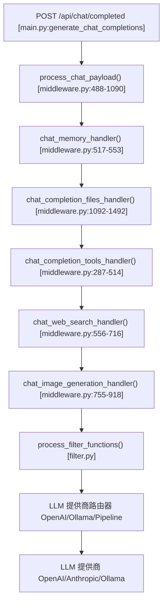
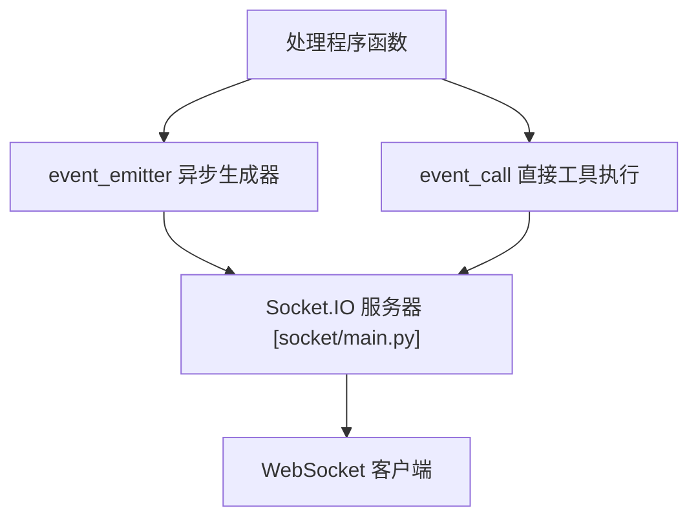
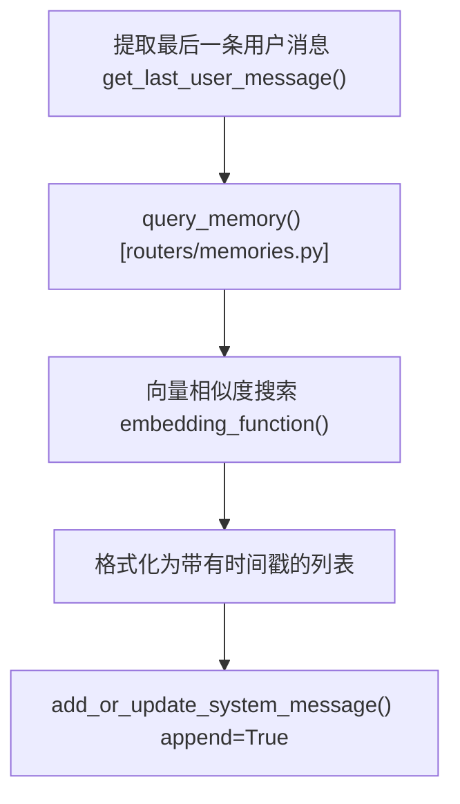
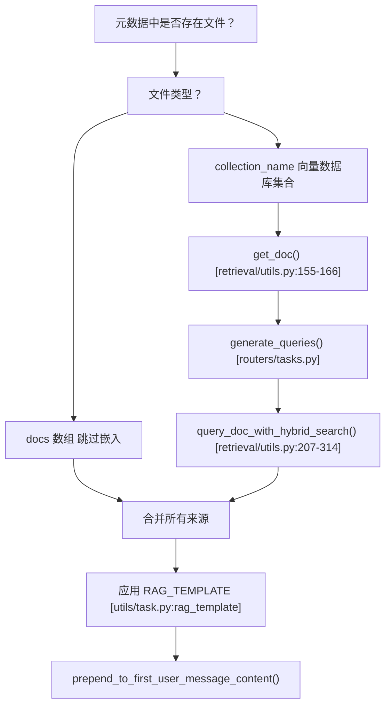
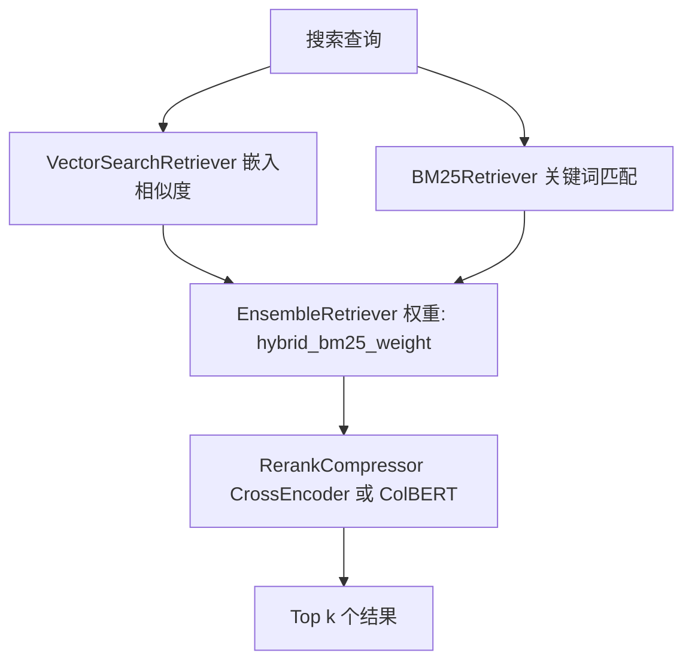
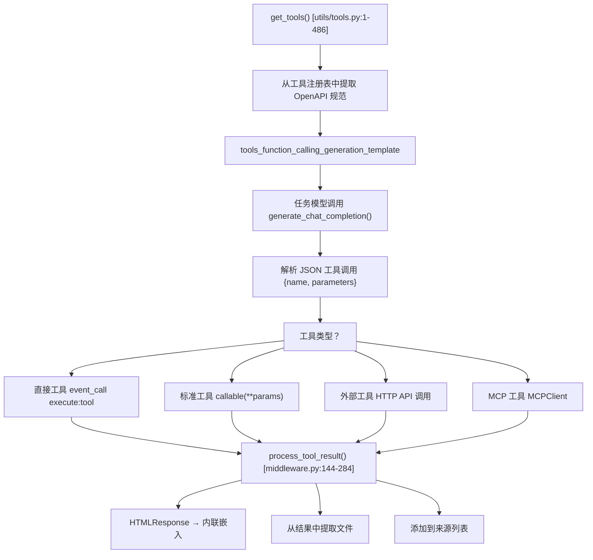
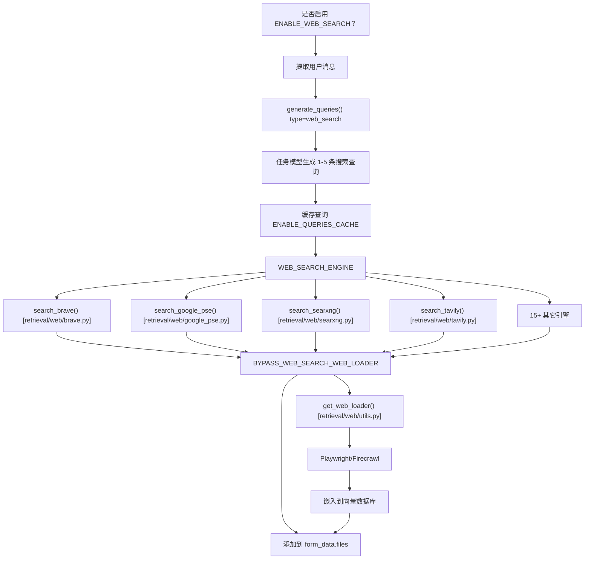
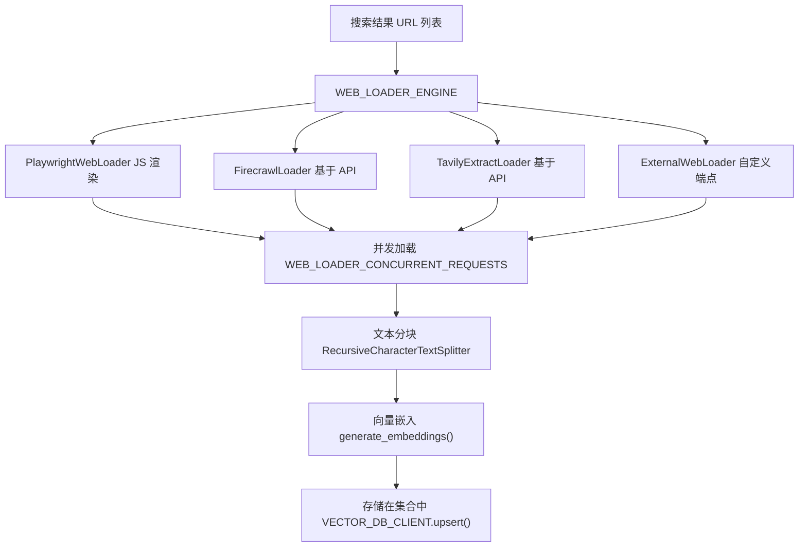
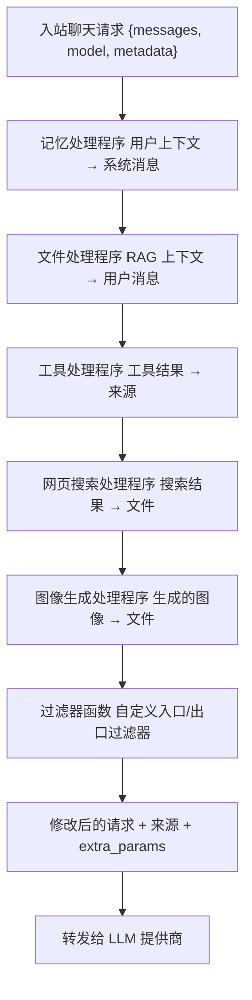
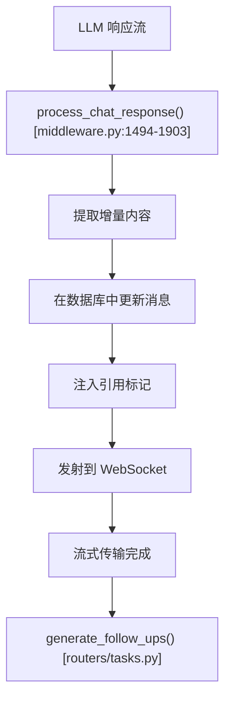

# 后端处理流水线 (Backend Processing Pipeline)

相关源文件

-   [backend/open_webui/config.py](https://github.com/open-webui/open-webui/blob/a7271532/backend/open_webui/config.py)
-   [backend/open_webui/main.py](https://github.com/open-webui/open-webui/blob/a7271532/backend/open_webui/main.py)
-   [backend/open_webui/retrieval/loaders/datalab_marker.py](https://github.com/open-webui/open-webui/blob/a7271532/backend/open_webui/retrieval/loaders/datalab_marker.py)
-   [backend/open_webui/retrieval/loaders/external_document.py](https://github.com/open-webui/open-webui/blob/a7271532/backend/open_webui/retrieval/loaders/external_document.py)
-   [backend/open_webui/retrieval/loaders/external_web.py](https://github.com/open-webui/open-webui/blob/a7271532/backend/open_webui/retrieval/loaders/external_web.py)
-   [backend/open_webui/retrieval/loaders/main.py](https://github.com/open-webui/open-webui/blob/a7271532/backend/open_webui/retrieval/loaders/main.py)
-   [backend/open_webui/retrieval/loaders/mineru.py](https://github.com/open-webui/open-webui/blob/a7271532/backend/open_webui/retrieval/loaders/mineru.py)
-   [backend/open_webui/retrieval/loaders/mistral.py](https://github.com/open-webui/open-webui/blob/a7271532/backend/open_webui/retrieval/loaders/mistral.py)
-   [backend/open_webui/retrieval/utils.py](https://github.com/open-webui/open-webui/blob/a7271532/backend/open_webui/retrieval/utils.py)
-   [backend/open_webui/routers/retrieval.py](https://github.com/open-webui/open-webui/blob/a7271532/backend/open_webui/routers/retrieval.py)
-   [backend/open_webui/utils/middleware.py](https://github.com/open-webui/open-webui/blob/a7271532/backend/open_webui/utils/middleware.py)
-   [src/lib/apis/retrieval/index.ts](https://github.com/open-webui/open-webui/blob/a7271532/src/lib/apis/retrieval/index.ts)
-   [src/lib/components/admin/Settings/Documents.svelte](https://github.com/open-webui/open-webui/blob/a7271532/src/lib/components/admin/Settings/Documents.svelte)
-   [src/lib/components/admin/Settings/WebSearch.svelte](https://github.com/open-webui/open-webui/blob/a7271532/src/lib/components/admin/Settings/WebSearch.svelte)

本文档描述了后端中间件系统，该系统在聊天补全请求到达 LLM 提供商之前对其进行拦截和增强。流水线通过向提示词注入额外的上下文，实现了诸如检索增强生成 (RAG)、工具执行、网页搜索和用户记忆等功能。

有关发起这些请求的前端聊天系统的信息，请参阅 [聊天系统](/open-webui/open-webui/3-installation-and-deployment)。有关 RAG 文档处理和向量存储子系统的详情，请参阅 [RAG 和知识系统](/open-webui/open-webui/6-backend-processing-pipeline)。有关 LLM 提供商集成和路由的信息，请参阅 [模型管理](/open-webui/open-webui/11-configuration-management)。

## 流水线概览

后端处理流水线被实现为一个中间件层，位于聊天 API 端点和 LLM 提供商代理路由器之间。当接收到聊天补全请求时，它会经过多个处理程序函数，这些函数可以在将请求转发给 LLM 之前修改请求负载。

### 请求流架构


**来源：** [backend/open_webui/utils/middleware.py488-1090](https://github.com/open-webui/open-webui/blob/a7271532/backend/open_webui/utils/middleware.py#L488-L1090) [backend/open_webui/main.py1-2826](https://github.com/open-webui/open-webui/blob/a7271532/backend/open_webui/main.py#L1-L2826)

### 处理程序执行控制

每个处理程序都会根据配置标志、用户权限和请求元数据进行有条件地调用。如果处理程序直接生成了响应（例如图像生成），流水线支持提前终止。

| 处理程序 | 配置标志 | 触发条件 |
| --- | --- | --- |
| 记忆 | 始终启用 | 用户具有记忆权限 |
| 文件 (RAG) | N/A | 请求元数据中存在 `files` |
| 工具 | `ENABLE_RAG_WEB_LOADER_SSL_VERIFICATION` | 请求体中存在 `tool_ids` |
| 网页搜索 | `ENABLE_WEB_SEARCH` | 模型启用了网页搜索 |
| 图像生成 | `ENABLE_IMAGE_GENERATION` | 请求带有图像生成标记 |
| 过滤器 | N/A | 用户被分配了过滤器 |

**来源：** [backend/open_webui/utils/middleware.py488-1090](https://github.com/open-webui/open-webui/blob/a7271532/backend/open_webui/utils/middleware.py#L488-L1090) [backend/open_webui/config.py1-3533](https://github.com/open-webui/open-webui/blob/a7271532/backend/open_webui/config.py#L1-L3533)

## 入口点：process_chat_payload

[backend/open_webui/utils/middleware.py488-1090](https://github.com/open-webui/open-webui/blob/a7271532/backend/open_webui/utils/middleware.py#L488-L1090) 中的 `process_chat_payload` 函数是处理流水线的核心编排器。它接收聊天补全请求、用户上下文和应用状态，然后按顺序调用各个处理程序。

### 函数签名与关键参数

```python
async def process_chat_payload(
    request: Request,
    form_data: dict,
    user: UserModel,
    metadata: dict
) -> tuple[dict, dict]
```
**关键参数：**

-   `form_data`：包含 `messages`、`model` 和可选 `metadata` 的聊天补全请求体。
-   `user`：发起请求的已认证用户。
-   `metadata`：请求元数据，包括 `chat_id`、`message_id`、`session_id` 和功能标志。
-   返回值：`(modified_form_data, extra_params)` 元组，其中 `extra_params` 包含 `sources` 和其它处理程序的输出。

**来源：** [backend/open_webui/utils/middleware.py488-550](https://github.com/open-webui/open-webui/blob/a7271532/backend/open_webui/utils/middleware.py#L488-L550)

### 事件发射器与调用者模式

流水线采用事件驱动架构，将状态更新和结果实时流式回传给客户端：


`__event_emitter__` 被传递给所有处理程序，允许它们发送事件：

```python
await event_emitter({
    "type": "status",
    "data": {
        "action": "web_search",
        "description": "正在搜索网页",
        "done": False
    }
})
```
**来源：** [backend/open_webui/utils/middleware.py559-569](https://github.com/open-webui/open-webui/blob/a7271532/backend/open_webui/utils/middleware.py#L559-L569) [backend/open_webui/socket/main.py1-1167](https://github.com/open-webui/open-webui/blob/a7271532/backend/open_webui/socket/main.py#L1-L1167)

## 记忆处理程序：用户上下文注入

`chat_memory_handler` 函数从用户的记忆存储中检索相关的历史上下文，并将其注入系统消息。此过程发生在所有其它处理程序之前，以提供一致的背景上下文。

### 记忆检索流程


**记忆上下文格式：**

```text
User Context:
1. [2024-01-15] 用户更倾向于使用 Python 进行脚本编写任务
2. [2024-01-20] 正在使用 PyTorch 进行机器学习项目
3. [2024-02-01] 使用 VS Code 作为主要编辑器
```
处理程序根据与当前用户消息的语义相似度，查询最多 `k=3` 条最相关的记忆文档。每条记忆条目都包含创建时间戳以提供时间维度上下文。

**来源：** [backend/open_webui/utils/middleware.py517-553](https://github.com/open-webui/open-webui/blob/a7271532/backend/open_webui/utils/middleware.py#L517-L553) [backend/open_webui/routers/memories.py1-338](https://github.com/open-webui/open-webui/blob/a7271532/backend/open_webui/routers/memories.py#L1-L338)

## 文件处理程序：RAG 集成

文件处理程序实现了检索增强生成 (RAG)，通过处理附加的文档、提取相关分块并将其注入提示词。这是流水线中最复杂的处理程序。

### 文档处理流


**来源：** [backend/open_webui/utils/middleware.py1092-1492](https://github.com/open-webui/open-webui/blob/a7271532/backend/open_webui/utils/middleware.py#L1092-L1492) [backend/open_webui/retrieval/utils.py1-879](https://github.com/open-webui/open-webui/blob/a7271532/backend/open_webui/retrieval/utils.py#L1-L879)

### 查询生成

对于存储在向量数据库中的文件，系统会使用任务模型根据用户消息生成多个优化的搜索查询：

```python
queries = await generate_queries(
    request,
    {
        "model": form_data["model"],
        "messages": messages,
        "prompt": user_message,
        "type": "retrieval"
    },
    user
)
```
任务模型会分析对话历史，并生成 1-5 条涵盖信息需求不同方面的搜索查询。与直接使用原始用户消息相比，这提高了检索质量。

**来源：** [backend/open_webui/utils/middleware.py1142-1180](https://github.com/open-webui/open-webui/blob/a7271532/backend/open_webui/utils/middleware.py#L1142-L1180) [backend/open_webui/routers/tasks.py1-1215](https://github.com/open-webui/open-webui/blob/a7271532/backend/open_webui/routers/tasks.py#L1-L1215)

### 混合搜索与重排序

文档检索结合了向量相似度搜索与 BM25 关键词匹配：


**配置参数：**

-   `TOP_K`：要检索的文档数量（默认：4）
-   `TOP_K_RERANKER`：在选出 top k 之前要进行重排序的文档数量（默认：4）
-   `RELEVANCE_THRESHOLD`：最小相似度得分（0.0-1.0）
-   `HYBRID_BM25_WEIGHT`：BM25 与向量搜索之间的平衡权重（0.0-1.0）

**来源：** [backend/open_webui/retrieval/utils.py207-314](https://github.com/open-webui/open-webui/blob/a7271532/backend/open_webui/retrieval/utils.py#L207-L314) [backend/open_webui/config.py832-835](https://github.com/open-webui/open-webui/blob/a7271532/backend/open_webui/config.py#L832-L835)

### RAG 上下文注入

检索到的文档将使用可配置的模板进行格式化，并注入到第一条用户消息中：

```python
context_string = rag_template(
    template=request.app.state.config.RAG_TEMPLATE,
    context="\n\n".join(docs),
    query=user_message
)
```
**默认 RAG 模板：**

```text
Use the following context as your learned knowledge:
[context]

Query: [query]

Based on the above context, provide a response to the query.
```
上下文会被添加到用户消息内容的前面，而来源信息会被单独跟踪，以便在 UI 中显示引用。

**来源：** [backend/open_webui/utils/middleware.py1336-1370](https://github.com/open-webui/open-webui/blob/a7271532/backend/open_webui/utils/middleware.py#L1336-L1370) [backend/open_webui/utils/task.py1-274](https://github.com/open-webui/open-webui/blob/a7271532/backend/open_webui/utils/task.py#L1-L274)

## 工具处理程序：函数调用

工具处理程序实现了一个两阶段执行模型：首先，由任务模型根据可用的规范生成结构化的工具调用；其次，系统执行这些调用并将结果格式化后提交给 LLM。

### 工具执行架构


**来源：** [backend/open_webui/utils/middleware.py287-514](https://github.com/open-webui/open-webui/blob/a7271532/backend/open_webui/utils/middleware.py#L287-L514) [backend/open_webui/utils/tools.py1-486](https://github.com/open-webui/open-webui/blob/a7271532/backend/open_webui/utils/tools.py#L1-L486)

### 工具调用生成提示词

系统向任务模型发送一个特殊的提示词，其中包含所有可用的工具规范：

```python
prompt = tools_function_calling_generation_template(
    template=TOOLS_FUNCTION_CALLING_PROMPT_TEMPLATE,
    tools_specs=json.dumps(specs)
)

payload = {
    "model": task_model_id,
    "messages": [
        {"role": "system", "content": prompt},
        {"role": "user", "content": user_message}
    ],
    "stream": False,
    "metadata": {"task": str(TASKS.FUNCTION_CALLING)}
}
```
任务模型返回包含工具调用的结构化 JSON：

```json
{
  "tool_calls": [
    {
      "name": "get_weather",
      "parameters": {
        "location": "San Francisco",
        "units": "celsius"
      }
    }
  ]
}
```
**来源：** [backend/open_webui/utils/middleware.py303-366](https://github.com/open-webui/open-webui/blob/a7271532/backend/open_webui/utils/middleware.py#L303-L366) [backend/open_webui/utils/task.py78-99](https://github.com/open-webui/open-webui/blob/a7271532/backend/open_webui/utils/task.py#L78-L99)

### 工具类型与执行

系统支持四种工具类型，每种类型都有不同的执行机制：

| 工具类型 | 执行方法 | 用例 |
| --- | --- | --- |
| 标准 (Standard) | 进程内可调用对象 | 作为插件加载的 Python 函数 |
| 直接 (Direct) | 基于 Socket.IO 的事件 | 浏览器端工具、UI 交互 |
| 外部 (External) | HTTP 请求 | REST API 工具服务器 |
| MCP | 模型上下文协议 | 结构化的工具服务器 |

**标准工具执行：**

```python
tool_function = tool["callable"]
tool_result = await tool_function(**tool_function_params)
```
**直接工具执行：**

```python
tool_result = await event_caller({
    "type": "execute:tool",
    "data": {
        "id": str(uuid4()),
        "name": tool_function_name,
        "params": tool_function_params,
        "server": tool.get("server", {}),
        "session_id": metadata.get("session_id")
    }
})
```
**来源：** [backend/open_webui/utils/middleware.py389-426](https://github.com/open-webui/open-webui/blob/a7271532/backend/open_webui/utils/middleware.py#L389-L426) [backend/open_webui/utils/tools.py220-486](https://github.com/open-webui/open-webui/blob/a7271532/backend/open_webui/utils/tools.py#L220-L486)

### 工具结果处理

工具结果在添加到来源之前会经过转换：

1.  **HTML 响应处理**：如果工具返回带有 `Content-Disposition: inline` 的 `HTMLResponse`，HTML 内容会被提取为嵌入项，并生成成功/错误消息。
2.  **文件提取**：提取 Data URL 和 base64 图像，并转换为文件引用。
3.  **来源构建**：将结果格式化为带有元数据的来源，以便进行引用。

```python
tool_result, tool_result_files, tool_result_embeds = process_tool_result(
    request, tool_function_name, tool_result,
    tool_type, direct_tool, metadata, user
)

sources.append({
    "source": {"name": f"{tool_id}/{tool_function_name}"},
    "document": [str(tool_result)],
    "metadata": [{
        "source": f"{tool_id}/{tool_function_name}",
        "parameters": tool_function_params
    }],
    "tool_result": True
})
```
**来源：** [backend/open_webui/utils/middleware.py144-284](https://github.com/open-webui/open-webui/blob/a7271532/backend/open_webui/utils/middleware.py#L144-L284) [backend/open_webui/utils/middleware.py428-486](https://github.com/open-webui/open-webui/blob/a7271532/backend/open_webui/utils/middleware.py#L428-L486)

## 网页搜索处理程序

网页搜索处理程序生成搜索查询，通过配置的搜索引擎执行搜索，并可选地加载和嵌入结果页面的完整内容。

### 网页搜索处理流


**来源：** [backend/open_webui/utils/middleware.py556-716](https://github.com/open-webui/open-webui/blob/a7271532/backend/open_webui/utils/middleware.py#L556-L716) [backend/open_webui/routers/retrieval.py655-1005](https://github.com/open-webui/open-webui/blob/a7271532/backend/open_webui/routers/retrieval.py#L655-L1005)

### 搜索查询生成

任务模型分析对话以生成优化的搜索查询：

```python
res = await generate_queries(
    request,
    {
        "model": form_data["model"],
        "messages": messages,
        "prompt": user_message,
        "type": "web_search"
    },
    user
)

# 响应示例：
{
  "queries": [
    "Python web scraping best practices 2024",
    "BeautifulSoup vs Scrapy comparison",
    "legal considerations web scraping"
  ]
}
```
如果查询生成失败，系统将回退到使用原始用户消息作为单条查询。

**来源：** [backend/open_webui/utils/middleware.py575-611](https://github.com/open-webui/open-webui/blob/a7271532/backend/open_webui/utils/middleware.py#L575-L611) [backend/open_webui/routers/tasks.py274-408](https://github.com/open-webui/open-webui/blob/a7271532/backend/open_webui/routers/tasks.py#L274-L408)

### 搜索引擎支持

该系统通过插件架构支持 20 多种搜索引擎。每种引擎都实现了一个返回 `SearchResult` 对象的 `search_*` 函数：

```python
@dataclass
class SearchResult:
    link: str
    title: Optional[str] = None
    snippet: Optional[str] = None
```
**支持的引擎：**

-   **商业 API**：Brave, Google PSE, Bing, Tavily, Kagi, Perplexity, Serper, SerpAPI
-   **自托管**：SearxNG, YaCy
-   **免费/基础版**：DuckDuckGo, Mojeek
-   **外部 (External)**：支持自定义端点

**来源：** [backend/open_webui/retrieval/web/main.py1-21](https://github.com/open-webui/open-webui/blob/a7271532/backend/open_webui/retrieval/web/main.py#L1-L21) [backend/open_webui/retrieval/web/brave.py1-66](https://github.com/open-webui/open-webui/blob/a7271532/backend/open_webui/retrieval/web/brave.py#L1-L66) [backend/open_webui/retrieval/web/searxng.py1-71](https://github.com/open-webui/open-webui/blob/a7271532/backend/open_webui/retrieval/web/searxng.py#L1-L71)

### 内容加载与嵌入

当禁用 `BYPASS_WEB_SEARCH_WEB_LOADER`（默认）时，系统将加载完整的页面内容：


**配置：**

-   `WEB_SEARCH_CONCURRENT_REQUESTS`：并行搜索查询的数量（默认：10）
-   `WEB_LOADER_CONCURRENT_REQUESTS`：并行页面加载的数量（默认：10）
-   `WEB_SEARCH_RESULT_COUNT`：每个查询的结果数量（默认：3）
-   `BYPASS_WEB_SEARCH_EMBEDDING_AND_RETRIEVAL`：跳过向量数据库，直接使用原始文本

**来源：** [backend/open_webui/routers/retrieval.py777-1005](https://github.com/open-webui/open-webui/blob/a7271532/backend/open_webui/routers/retrieval.py#L777-L1005) [backend/open_webui/retrieval/web/utils.py1-274](https://github.com/open-webui/open-webui/blob/a7271532/backend/open_webui/retrieval/web/utils.py#L1-L274)

### 文件条目结构

网页搜索结果将以两种格式之一添加到 `form_data["files"]` 中：

**使用向量数据库（默认）：**

```json
{
    "collection_name": "web_search_uuid",
    "name": "query1, query2, query3",
    "type": "web_search",
    "urls": ["url1", "url2", "url3"],
    "queries": ["query1", "query2", "query3"]
}
```
**跳过模式 (Bypass Mode)：**

```json
{
    "docs": [
        {"page_content": "...", "metadata": {...}},
        {"page_content": "...", "metadata": {...}}
    ],
    "name": "query1, query2",
    "type": "web_search",
    "urls": ["url1", "url2"],
    "queries": ["query1", "query2"]
}
```
随后，文件处理程序会使用与上传文档相同的 RAG 流水线处理这些条目。

**来源：** [backend/open_webui/utils/middleware.py646-674](https://github.com/open-webui/open-webui/blob/a7271532/backend/open_webui/utils/middleware.py#L646-L674)

## 流水线集成

完整的流水线按顺序集成所有处理程序，每个处理程序都有机会修改请求并添加上下文：


### extra_params 结构

处理程序通过 `process_chat_payload` 返回的 `extra_params` 字典来传达结果：

```python
extra_params = {
    "__event_emitter__": event_emitter,
    "__event_caller__": event_caller,
    "__metadata__": metadata,
    "sources": [
        {
            "source": {"name": "document.pdf"},
            "document": ["检索到的文本分块..."],
            "metadata": [{"page": 1, "score": 0.95}]
        },
        {
            "source": {"name": "web_search/get_weather"},
            "document": ["天气晴朗，72°F"],
            "metadata": [{"source": "weather_api", "parameters": {...}}],
            "tool_result": True
        }
    ],
    "citation": True,  # 启用引用显示
    "skip_files": False  # 是否绕过了 RAG
}
```
**来源：** [backend/open_webui/utils/middleware.py488-550](https://github.com/open-webui/open-webui/blob/a7271532/backend/open_webui/utils/middleware.py#L488-L550)

### 响应流式传输与数据库更新

流水线完成后，修改后的请求被发送给 LLM 提供商。响应通过 `process_chat_response` 中间件流式回传，该中间件负责：

1.  向 WebSocket 客户端发射令牌增量 (token deltas)。
2.  使用消息内容更新数据库。
3.  注入来源引用标记。
4.  针对思维链 (CoT) 模型处理推理标签 (reasoning tags)。
5.  触发后续问题生成。


**来源：** [backend/open_webui/utils/middleware.py1494-1903](https://github.com/open-webui/open-webui/blob/a7271532/backend/open_webui/utils/middleware.py#L1494-L1903) [backend/open_webui/utils/chat.py1-1251](https://github.com/open-webui/open-webui/blob/a7271532/backend/open_webui/utils/chat.py#L1-L1251)

## 处理程序配置

每个处理程序的行为受存储在 [backend/open_webui/config.py](https://github.com/open-webui/open-webui/blob/a7271532/backend/open_webui/config.py) 中的应用程序配置控制：

### RAG 配置

| 设置项 | 描述 | 默认值 |
| --- | --- | --- |
| `RAG_TEMPLATE` | 上下文注入模板 | 默认 RAG 模板 |
| `TOP_K` | 要检索的文档数量 | 4 |
| `TOP_K_RERANKER` | 要重排序的文档数量 | 4 |
| `RELEVANCE_THRESHOLD` | 最小相似度得分 | 0.0 |
| `ENABLE_RAG_HYBRID_SEARCH` | 使用 BM25 + 向量搜索 | False |
| `HYBRID_BM25_WEIGHT` | 混合搜索中 BM25 的权重 | 0.5 |
| `BYPASS_EMBEDDING_AND_RETRIEVAL` | 跳过向量数据库，使用完整文档 | False |

### 网页搜索配置

| 设置项 | 描述 | 默认值 |
| --- | --- | --- |
| `ENABLE_WEB_SEARCH` | 启用网页搜索 | False |
| `WEB_SEARCH_ENGINE` | 要使用的搜索引擎 | "" |
| `WEB_SEARCH_RESULT_COUNT` | 每个查询的结果数量 | 3 |
| `BYPASS_WEB_SEARCH_WEB_LOADER` | 跳过内容加载 | False |
| `BYPASS_WEB_SEARCH_EMBEDDING_AND_RETRIEVAL` | 跳过向量数据库 | False |
| `WEB_SEARCH_CONCURRENT_REQUESTS` | 并行查询数量 | 10 |

### 工具执行配置

| 设置项 | 描述 | 默认值 |
| --- | --- | --- |
| `TOOLS_FUNCTION_CALLING_PROMPT_TEMPLATE` | 工具选择提示词 | 默认模板 |
| `CHAT_RESPONSE_MAX_TOOL_CALL_RETRIES` | 工具执行最大重试次数 | 3 |

**来源：** [backend/open_webui/config.py832-1012](https://github.com/open-webui/open-webui/blob/a7271532/backend/open_webui/config.py#L832-L1012) [backend/open_webui/env.py1-516](https://github.com/open-webui/open-webui/blob/a7271532/backend/open_webui/env.py#L1-L516)

## 错误处理与弹性

流水线实现了多种错误处理模式：

### 处理程序隔离

每个处理程序都封装在 try-except 块中，防止单个处理程序崩溃导致整个流水线中断：

```python
try:
    form_data = await chat_memory_handler(
        request, form_data, extra_params, user
    )
except Exception as e:
    log.exception(f"Error in memory handler: {e}")
    # 继续执行下一个处理程序
```
### 优雅降级

当外部服务故障（网页搜索、文档加载）时，系统会优雅降级：

-   网页搜索失败 → 在没有网页结果的情况下继续执行。
-   工具执行失败 → 向 LLM 返回错误消息。
-   RAG 查询失败 → 回退到原始文档或在没有上下文的情况下继续执行。

### 状态事件报告

处理程序发射状态事件以提高用户可见性：

```python
await event_emitter({
    "type": "status",
    "data": {
        "action": "web_search",
        "description": "搜索网页时发生错误",
        "queries": queries,
        "done": True,
        "error": True
    }
})
```
**来源：** [backend/open_webui/utils/middleware.py517-716](https://github.com/open-webui/open-webui/blob/a7271532/backend/open_webui/utils/middleware.py#L517-L716) [backend/open_webui/utils/middleware.py1092-1492](https://github.com/open-webui/open-webui/blob/a7271532/backend/open_webui/utils/middleware.py#L1092-L1492)
