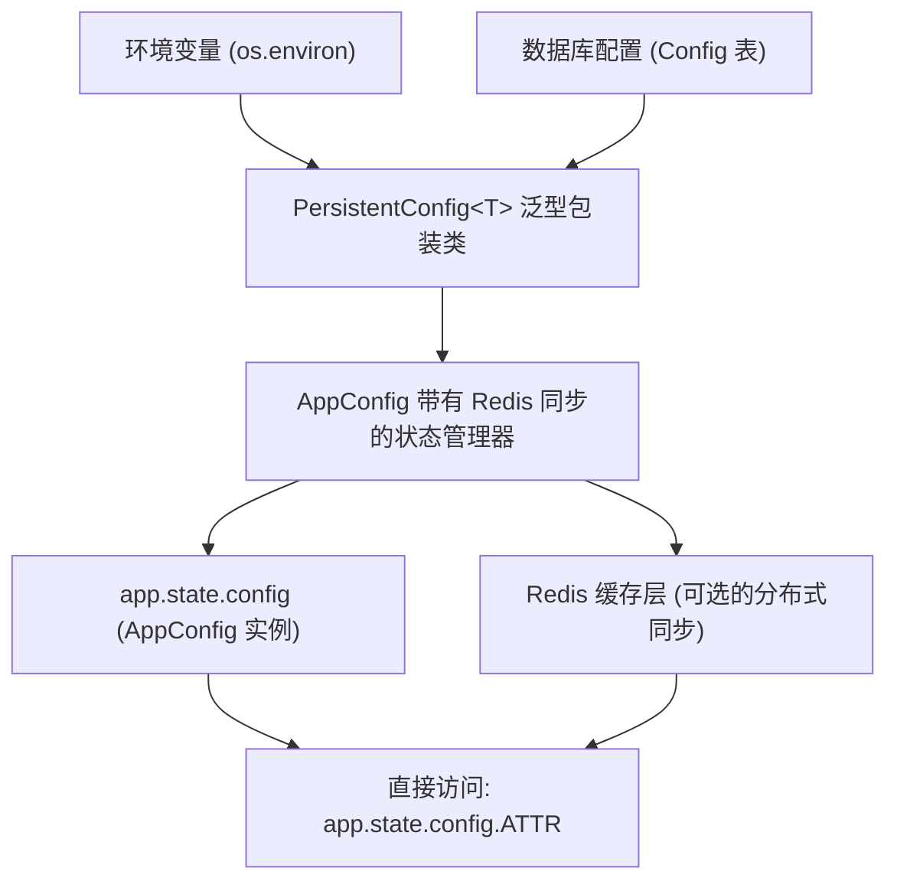
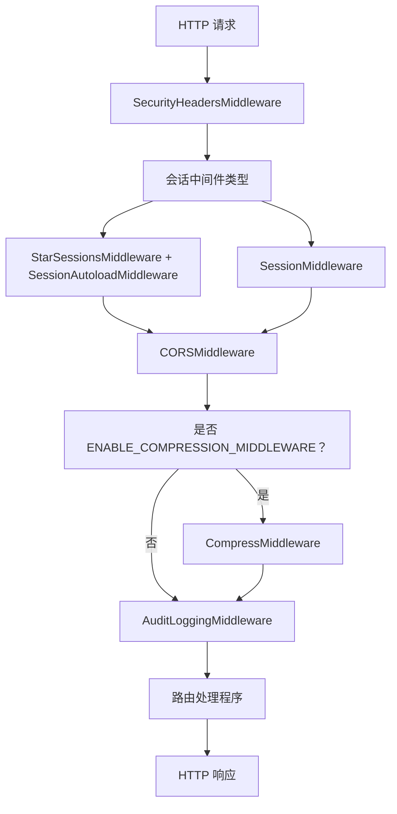
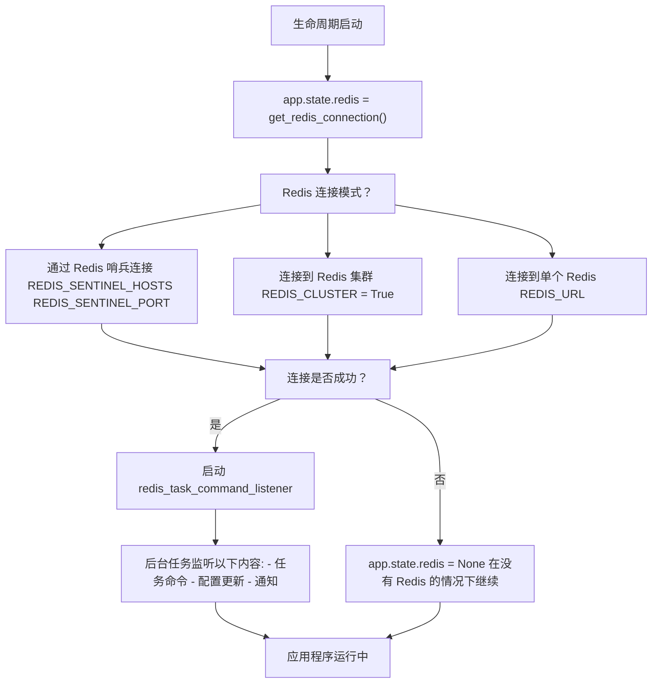
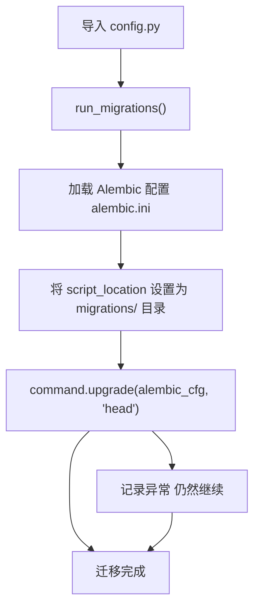

# FastAPI 应用核心

相关源文件

-   [backend/open\_webui/config.py](https://github.com/open-webui/open-webui/blob/a7271532/backend/open_webui/config.py)
-   [backend/open\_webui/main.py](https://github.com/open-webui/open-webui/blob/a7271532/backend/open_webui/main.py)
-   [backend/open\_webui/retrieval/loaders/datalab\_marker.py](https://github.com/open-webui/open-webui/blob/a7271532/backend/open_webui/retrieval/loaders/datalab_marker.py)
-   [backend/open\_webui/retrieval/loaders/external\_document.py](https://github.com/open-webui/open-webui/blob/a7271532/backend/open_webui/retrieval/loaders/external_document.py)
-   [backend/open\_webui/retrieval/loaders/external\_web.py](https://github.com/open-webui/open-webui/blob/a7271532/backend/open_webui/retrieval/loaders/external_web.py)
-   [backend/open\_webui/retrieval/loaders/main.py](https://github.com/open-webui/open-webui/blob/a7271532/backend/open_webui/retrieval/loaders/main.py)
-   [backend/open\_webui/retrieval/loaders/mineru.py](https://github.com/open-webui/open-webui/blob/a7271532/backend/open_webui/retrieval/loaders/mineru.py)
-   [backend/open\_webui/retrieval/loaders/mistral.py](https://github.com/open-webui/open-webui/blob/a7271532/backend/open_webui/retrieval/loaders/mistral.py)
-   [backend/open\_webui/retrieval/utils.py](https://github.com/open-webui/open-webui/blob/a7271532/backend/open_webui/retrieval/utils.py)
-   [backend/open\_webui/routers/retrieval.py](https://github.com/open-webui/open-webui/blob/a7271532/backend/open_webui/routers/retrieval.py)
-   [backend/open\_webui/utils/middleware.py](https://github.com/open-webui/open-webui/blob/a7271532/backend/open_webui/utils/middleware.py)
-   [src/lib/apis/retrieval/index.ts](https://github.com/open-webui/open-webui/blob/a7271532/src/lib/apis/retrieval/index.ts)
-   [src/lib/components/admin/Settings/Documents.svelte](https://github.com/open-webui/open-webui/blob/a7271532/src/lib/components/admin/Settings/Documents.svelte)
-   [src/lib/components/admin/Settings/WebSearch.svelte](https://github.com/open-webui/open-webui/blob/a7271532/src/lib/components/admin/Settings/WebSearch.svelte)

## 目的与范围

本文档涵盖了 Open WebUI 后端的核心 FastAPI 应用程序初始化、配置、中间件堆栈和路由注册。主要的应用程序入口点是 [backend/open\_webui/main.py](https://github.com/open-webui/open-webui/blob/a7271532/backend/open_webui/main.py)，它编排了整个后端系统。

有关特定后端处理流水线（RAG、工具、记忆）的信息，请参阅 [后端处理流水线](/open-webui/open-webui/6-backend-processing-pipeline)。有关身份验证机制的信息，请参阅 [身份验证方法](/open-webui/open-webui/10.1-authentication-methods)。有关初始化之外的配置管理详情，请参阅 [配置管理](/open-webui/open-webui/11-configuration-management)。

## 应用初始化与实例创建

FastAPI 应用程序作为全局实例创建，并针对开发和生产环境进行了特定配置：

```python
app = FastAPI(
    title="Open WebUI",
    docs_url="/docs" if ENV == "dev" else None,
    openapi_url="/openapi.json" if ENV == "dev" else None,
    redoc_url=None,
    lifespan=lifespan,
)
```
初始化的关键方面：

-   **文档端点**：仅在开发模式 (`ENV == "dev"`) 下启用。
-   **生命周期 (Lifespan) 上下文管理器**：通过 `lifespan` 函数处理启动和关闭任务。
-   **标题**：API 文档的标题设置为 "Open WebUI"。

来源： [backend/open\_webui/main.py633-639](https://github.com/open-webui/open-webui/blob/a7271532/backend/open_webui/main.py#L633-L639)

## 生命周期管理

应用程序生命周期通过一个异步上下文管理器进行管理，该管理器协调启动和关闭任务：

```mermaid
flowchart TD
    Start["应用程序启动"]
    Lifespan["lifespan(app)"]
    SetInstanceId["设置 app.state.instance_id = INSTANCE_ID"]
    StartLogger["start_logger()"]
    ResetConfig["是否 RESET_CONFIG_ON_START？"]
    DoReset["reset_config()"]
    CheckLicense["是否存在 LICENSE_KEY？"]
    LoadLicense["get_license_data(app, LICENSE_KEY)"]
    InstallDeps["install_tool_and_function_dependencies()"]
    SetupRedis["app.state.redis = get_redis_connection()"]
    RedisListener["Redis 是否可用？"]
    StartListener["启动 redis_task_command_listener 任务"]
    ThreadPool["THREAD_POOL_SIZE > 0？"]
    LimitTokens["设置 anyio 线程限制器令牌"]
    StartCleanup["启动 periodic_usage_pool_cleanup 任务"]
    CacheModels["是否 ENABLE_BASE_MODELS_CACHE？"]
    GetAllModels["await get_all_models()"]
    Yield["yield (应用运行中)"]
    Shutdown["触发关机"]
    CancelRedis["redis_task_command_listener 是否存在？"]
    CancelTask["取消 Redis 监听器任务"]
    End["应用程序已停止"]

    Start --> Lifespan
    Lifespan --> SetInstanceId
    SetInstanceId --> StartLogger
    StartLogger --> ResetConfig
    ResetConfig -- 是 --> DoReset
    ResetConfig -- 否 --> CheckLicense
    DoReset --> CheckLicense
    CheckLicense -- 是 --> LoadLicense
    CheckLicense -- 否 --> InstallDeps
    LoadLicense --> InstallDeps
    InstallDeps --> SetupRedis
    SetupRedis --> RedisListener
    RedisListener -- 是 --> StartListener
    RedisListener -- 否 --> ThreadPool
    StartListener --> ThreadPool
    ThreadPool -- 是 --> LimitTokens
    ThreadPool -- 否 --> StartCleanup
    LimitTokens --> StartCleanup
    StartCleanup --> CacheModels
    CacheModels -- 是 --> GetAllModels
    CacheModels -- 否 --> Yield
    GetAllModels --> Yield
    Yield --> Shutdown
    Shutdown --> CancelRedis
    CancelRedis -- 是 --> CancelTask
    CancelRedis -- 否 --> End
    CancelTask --> End
```


### 启动序列

生命周期管理器按顺序执行以下启动任务：

1.  **实例识别**：设置 `app.state.instance_id` 以唯一标识此实例。
2.  **日志初始化**：调用 `start_logger()` 配置日志记录。
3.  **配置重置**（可选）：如果启用了 `RESET_CONFIG_ON_START`，则清除持久化配置。
4.  **许可证验证**：加载并验证提供的许可证密钥。
5.  **插件依赖项**：安装工具和函数所需的依赖项（阻塞调用）。
6.  **Redis 连接**：为分布式功能建立与 Redis 的连接。
7.  **Redis 任务监听器**：启动后台任务以处理 Redis 命令。
8.  **线程池配置**：如果设置了 `THREAD_POOL_SIZE`，则配置 AnyIO 线程池大小。
9.  **用量清理**：启动模型用量追踪的定期清理任务。
10.  **模型缓存预热**：如果启用了 `ENABLE_BASE_MODELS_CACHE`，则预先获取所有模型。

### 关机序列

关机时，生命周期管理器：

-   如果 Redis 任务命令监听器已启动，则取消该任务。
-   允许后台任务优雅地完成。

来源： [backend/open\_webui/main.py570-631](https://github.com/open-webui/open-webui/blob/a7271532/backend/open_webui/main.py#L570-L631)

## 配置系统架构

Open WebUI 实现了一个复杂的二级配置系统，结合了环境变量与持久化数据库存储：


### PersistentConfig 类

`PersistentConfig` 是一个泛型包装器，用于管理具有自动持久化功能的单个配置值：

| 属性 | 类型 | 描述 |
| --- | --- | --- |
| `env_name` | str | 环境变量名称 |
| `config_path` | str | 数据库 JSON 中的点分隔路径 |
| `env_value` | T | 环境变量中的值 |
| `config_value` | T | 数据库中的值 (如果可用) |
| `value` | T | 有效值 (数据库覆盖环境变量) |

该类在 `PERSISTENT_CONFIG_REGISTRY` 中自动注册，以便进行全局配置更新。

**加载优先级**：如果 `ENABLE_PERSISTENT_CONFIG` 为 true 且存在数据库值，则数据库值优先于环境变量。

来源： [backend/open\_webui/config.py165-222](https://github.com/open-webui/open-webui/blob/a7271532/backend/open_webui/config.py#L165-L222)

### AppConfig 状态管理器

`AppConfig` 提供由 Redis 支持的分布式配置，并具有自动同步功能：

```python
class AppConfig:
    _redis: Union[redis.Redis, redis.cluster.RedisCluster]
    _redis_key_prefix: str
    _state: dict[str, PersistentConfig]
```
**关键特性**：

-   **Getter**：在返回本地状态之前，先检查 Redis 中是否有更新的值。
-   **Setter**：写入数据库并传播到 Redis 以进行集群同步。
-   **键格式**：`{_redis_key_prefix}:config:{key}`

**使用示例**：

```python
# main.py 中的初始设置
app.state.config = AppConfig(
    redis_url=REDIS_URL,
    redis_sentinels=get_sentinels_from_env(...),
    redis_cluster=REDIS_CLUSTER,
    redis_key_prefix=REDIS_KEY_PREFIX,
)

# 后续访问
chunk_size = app.state.config.CHUNK_SIZE  # 检查 Redis，返回缓存值
app.state.config.CHUNK_SIZE = 1500  # 写入数据库和 Redis
```
来源： [backend/open\_webui/config.py224-283](https://github.com/open-webui/open-webui/blob/a7271532/backend/open_webui/config.py#L224-L283) [backend/open\_webui/main.py650-655](https://github.com/open-webui/open-webui/blob/a7271532/backend/open_webui/main.py#L650-L655)

## 应用状态初始化

`app.state` 对象充当运行时状态、配置和共享资源的中央存储库。状态初始化在创建 FastAPI 实例后立即发生：


### 状态类别

**核心状态** [backend/open\_webui/main.py649-660](https://github.com/open-webui/open-webui/blob/a7271532/backend/open_webui/main.py#L649-L660)：

-   `instance_id`：此应用程序实例的唯一标识符 (`INSTANCE_ID`)。
-   `config`：管理所有持久化配置的 AppConfig 实例。
-   `redis`：用于分布式功能的 Redis 连接（在生命周期启动期间设置）。
-   `WEBUI_NAME`：应用程序的显示名称。
-   `LICENSE_METADATA`：许可证验证数据（如果适用）。
-   `USER_COUNT`：缓存的用户数量（初始化为 `None`）。

**OAuth 管理器** [backend/open\_webui/main.py641-647](https://github.com/open-webui/open-webui/blob/a7271532/backend/open_webui/main.py#L641-L647)：

-   `oauth_manager`：处理 Open WebUI 自身的 OAuth/OIDC 身份验证。
-   `oauth_client_manager`：管理第三方集成（Google Drive, OneDrive）的 OAuth 客户端。

**模型缓存** [backend/open\_webui/main.py685-733](https://github.com/open-webui/open-webui/blob/a7271532/backend/open_webui/main.py#L685-L733)：

-   `OLLAMA_MODELS`：Ollama 模型字典（动态填充）。
-   `OPENAI_MODELS`：兼容 OpenAI 的模型字典。
-   `BASE_MODELS`：所有可用基础模型的缓存列表。

**RAG 组件** [backend/open\_webui/main.py985-1050](https://github.com/open-webui/open-webui/blob/a7271532/backend/open_webui/main.py#L985-L1050)：

-   `EMBEDDING_FUNCTION`：生成嵌入的包装函数。
-   `RERANKING_FUNCTION`：重排序结果的包装函数。
-   `ef`：原始 SentenceTransformer 模型（用于本地嵌入）。
-   `rf`：原始 CrossEncoder 模型（用于本地重排序）。

**工具与函数状态** [backend/open\_webui/main.py706-827](https://github.com/open-webui/open-webui/blob/a7271532/backend/open_webui/main.py#L706-L827)：

-   `TOOLS`：可用工具字典。
-   `TOOL_CONTENTS`：工具源代码内容。
-   `FUNCTIONS`：可用函数字典。
-   `FUNCTION_CONTENTS`：函数源代码内容。
-   `TOOL_SERVERS`：连接的 MCP 工具服务器列表。

**SCIM 状态** [backend/open\_webui/main.py723-724](https://github.com/open-webui/open-webui/blob/a7271532/backend/open_webui/main.py#L723-L724)：

-   `ENABLE_SCIM`：是否启用 SCIM 配置。
-   `SCIM_TOKEN`：SCIM API 身份验证的 Bearer 令牌。

来源： [backend/open\_webui/main.py641-827](https://github.com/open-webui/open-webui/blob/a7271532/backend/open_webui/main.py#L641-L827) [backend/open\_webui/main.py985-1050](https://github.com/open-webui/open-webui/blob/a7271532/backend/open_webui/main.py#L985-L1050)

## 中间件堆栈

中间件堆栈按执行的逆序注册（最后注册的先执行）。Open WebUI 的中间件层处理安全性、会话、CORS、压缩和审计日志：


### 中间件注册顺序

中间件堆栈按以下顺序构建（执行顺序相反）：

1.  **SecurityHeadersMiddleware** [backend/open\_webui/main.py1298-1299](https://github.com/open-webui/open-webui/blob/a7271532/backend/open_webui/main.py#L1298-L1299)
    -   向所有响应添加安全头。
    -   配置 CSP、X-Frame-Options 等。
2.  **会话中间件** [backend/open\_webui/main.py1301-1334](https://github.com/open-webui/open-webui/blob/a7271532/backend/open_webui/main.py#L1301-L1334)
    -   **StarSessionsMiddleware** (如果开启 `ENABLE_STAR_SESSIONS_MIDDLEWARE`):
        -   通过 `RedisStore` 使用由 Redis 支持的会话存储。
        -   需要 `SessionAutoloadMiddleware` 以正确加载会话。
        -   使用 `WEBUI_SECRET_KEY`、Cookie 设置和会话生命周期进行配置。
    -   **SessionMiddleware** (标准 Starlette):
        -   内存中会话存储。
        -   使用相同的密钥和 Cookie 配置。
3.  **CORSMiddleware** [backend/open\_webui/main.py1336-1343](https://github.com/open-webui/open-webui/blob/a7271532/backend/open_webui/main.py#L1336-L1343)
    -   配置 `CORS_ALLOW_ORIGIN` (默认为 "*")。
    -   允许凭据 (Credentials) 以及所有方法/请求头。
4.  **CompressMiddleware** (可选) [backend/open\_webui/main.py1345-1346](https://github.com/open-webui/open-webui/blob/a7271532/backend/open_webui/main.py#L1345-L1346)
    -   对响应进行 Gzip 压缩。
    -   仅在 `ENABLE_COMPRESSION_MIDDLEWARE` 为 true 时添加。
5.  **AuditLoggingMiddleware** [backend/open\_webui/main.py1348-1354](https://github.com/open-webui/open-webui/blob/a7271532/backend/open_webui/main.py#L1348-L1354)
    -   根据 `AUDIT_LOG_LEVEL` (METADATA, REQUEST, REQUEST\_RESPONSE) 记录请求。
    -   排除匹配 `AUDIT_EXCLUDED_PATHS` 的路径。
    -   限制 Body 日志记录的大小为 `MAX_BODY_LOG_SIZE`。

### 会话配置

会话中间件配置包括：

| 参数 | 来源 | 描述 |
| --- | --- | --- |
| `secret_key` | `WEBUI_SECRET_KEY` | 用于会话加密的密钥 |
| `session_cookie` | `"open-webui-session"` | Cookie 名称 |
| `same_site` | `WEBUI_SESSION_COOKIE_SAME_SITE` | SameSite 属性 |
| `https_only` | `WEBUI_SESSION_COOKIE_SECURE` | 安全标志 (仅限 HTTPS) |
| `max_age` | 源自 `JWT_EXPIRES_IN` | 以秒为单位的会话寿命 |

来源： [backend/open\_webui/main.py1298-1354](https://github.com/open-webui/open-webui/blob/a7271532/backend/open_webui/main.py#L1298-L1354)

## 路由注册与组织

Open WebUI 将其 API 端点组织成模块化路由，每个路由处理特定的功能领域。路由使用 `app.include_router()` 注册到 FastAPI 应用程序中：


### 路由注册代码

路由在 [backend/open\_webui/main.py70-96](https://github.com/open-webui/open-webui/blob/a7271532/backend/open_webui/main.py#L70-L96) 顶部导入，并根据配置有条件地注册：

```python
# SCIM 路由 (有条件)
if app.state.ENABLE_SCIM:
    app.include_router(scim.router, prefix="/api/v1/scim", tags=["scim"])

# 核心路由 (始终包含)
app.include_router(users.router, prefix="/api/v1/users", tags=["users"])
app.include_router(auths.router, prefix="/api/v1/auths", tags=["auths"])
app.include_router(chats.router, prefix="/api/v1/chats", tags=["chats"])
# ... (所有路由都遵循此模式)
```
### 路由分类

**核心 API**：
-   `utils`：系统实用程序（健康检查、版本信息、任务管理）。
-   `configs`：应用程序配置端点（仅限管理员）。

**身份验证与用户**：
-   `auths`：身份验证流程（OAuth、JWT、LDAP、API 密钥）。
-   `users`：用户 CRUD 操作、个人资料管理。
-   `scim`：SCIM 2.0 配置（有条件，企业功能）。

**聊天与消息**：
-   `chats`：对话管理、消息历史。
-   `channels`：群组消息与协作。
-   `notes`：个人笔记。
-   `memories`：用于个性化的长期用户上下文存储。

**组织**：
-   `folders`：层级化的聊天组织。
-   `groups`：用于权限管理的用户组。

**知识库与 RAG**：
-   `files`：文件上传、存储和元数据。
-   `retrieval`：RAG 操作（嵌入、搜索、重排序）。
-   `knowledge`：知识库管理。

**LLM 集成**：
-   `ollama`：Ollama API 代理（模型推理）。
-   `openai`：兼容 OpenAI 的 API 代理。
-   `models`：模型元数据与访问控制。
-   `pipelines`：自定义流水线插件框架。

**AI 特性**：
-   `functions`：用户定义的 Python 函数（沙箱执行）。
-   `tools`：用于函数调用的工具定义。
-   `tasks`：后台任务执行（标题生成等）。
-   `evaluations`：模型比较与评估竞技场。

**内容生成**：
-   `audio`：文本转语音和语音转文本。
-   `images`：图像生成与编辑（DALL-E, Stable Diffusion）。

**模板**：
-   `prompts`：系统提示词模板与管理。

来源： [backend/open\_webui/main.py70-96](https://github.com/open-webui/open-webui/blob/a7271532/backend/open_webui/main.py#L70-L96) [backend/open\_webui/main.py1361-1426](https://github.com/open-webui/open-webui/blob/a7271532/backend/open_webui/main.py#L1361-L1426)

## Redis 集成

Redis 提供分布式功能，包括会话存储、配置同步和任务协调。Redis 连接在应用程序启动期间建立：


### Redis 连接设置

Redis 连接使用以下参数配置 [backend/open\_webui/main.py586-593](https://github.com/open-webui/open-webui/blob/a7271532/backend/open_webui/main.py#L586-L593)：

| 参数 | 环境变量 | 描述 |
| --- | --- | --- |
| `redis_url` | `REDIS_URL` | 单机/集群的连接字符串 |
| `redis_sentinels` | `REDIS_SENTINEL_HOSTS`, `REDIS_SENTINEL_PORT` | 用于高可用的哨兵配置 |
| `redis_cluster` | `REDIS_CLUSTER` | 是否使用 Redis 集群模式 |
| `async_mode` | - | 异步 Redis 客户端设为 `True` |

**哨兵配置**：如果提供了 `REDIS_SENTINEL_HOSTS`，系统使用 `get_sentinels_from_env()` 来解析哨兵主机/端口对，并建立高可用连接。

### Redis 任务命令监听器

当 Redis 可用时，会启动一个后台任务来监听命令：

```python
if app.state.redis is not None:
    app.state.redis_task_command_listener = asyncio.create_task(
        redis_task_command_listener(app)
    )
```
该监听器处理：
-   **任务管理命令**：启动、停止和监控后台任务。
-   **配置更新**：在实例间传播配置更改。
-   **实时通知**：WebSocket 消息分发。

监听器任务在关机期间被取消 [backend/open\_webui/main.py629-630](https://github.com/open-webui/open-webui/blob/a7271532/backend/open_webui/main.py#L629-L630)。

### 应用程序中的 Redis 用例

**会话存储** [backend/open\_webui/main.py1319-1325](https://github.com/open-webui/open-webui/blob/a7271532/backend/open_webui/main.py#L1319-L1325)：

```python
store = RedisStore(
    app.state.redis,
    prefix=REDIS_KEY_PREFIX,
    ttl=max_age,
)
```
**配置同步** [backend/open\_webui/config.py258-260](https://github.com/open-webui/open-webui/blob/a7271532/backend/open_webui/config.py#L258-L260)：
-   更新 `AppConfig` 属性时，值将写入 Redis。
-   所有实例在返回配置值之前都会检查 Redis。
-   键格式：`{REDIS_KEY_PREFIX}:config:{key}`。

**任务协调** [backend/open\_webui/tasks.py](https://github.com/open-webui/open-webui/blob/a7271532/backend/open_webui/tasks.py)：
-   任务创建、状态更新和取消命令。
-   用于后台操作的分布式任务队列。

**优雅降级**：如果 Redis 不可用 (`app.state.redis = None`)，应用程序将以受限功能继续运行：
-   会话回退到内存存储。
-   配置更新仅限本地。
-   任务以单实例模式运行。

来源： [backend/open\_webui/main.py586-598](https://github.com/open-webui/open-webui/blob/a7271532/backend/open_webui/main.py#L586-L598) [backend/open\_webui/main.py629-630](https://github.com/open-webui/open-webui/blob/a7271532/backend/open_webui/main.py#L629-L630) [backend/open\_webui/config.py224-283](https://github.com/open-webui/open-webui/blob/a7271532/backend/open_webui/config.py#L224-L283)

## 特殊 HTTP 端点

除了已注册的路由外，主应用程序还定义了几个特殊用途的 HTTP 端点：

### 健康检查端点

```python
@app.get("/health")
async def get_health():
    return {"status": True}
```
简单的健康检查，返回 200 OK 及 `{"status": true}`。由负载均衡器和监控系统使用。

### Manifest 与 PWA 端点

**动态 Manifest** [backend/open\_webui/main.py1618-1671](https://github.com/open-webui/open-webui/blob/a7271532/backend/open_webui/main.py#L1618-L1671)：

```python
@app.get("/manifest.json")
async def get_manifest_json() -> Response:
    # ... 动态生成包含应用名称、图标、主题颜色的 PWA manifest
```
动态生成渐进式 Web 应用 (PWA) manifest，使用 `WEBUI_NAME` 作为应用名称并配置主题颜色。如果设置了 `EXTERNAL_PWA_MANIFEST_URL`，该端点将改为代理到该 URL。

**Service Worker** [backend/open\_webui/main.py1674-1684](https://github.com/open-webui/open-webui/blob/a7271532/backend/open_webui/main.py#L1674-L1684)：

```python
@app.get("/sw.js")
async def get_service_worker():
    # 返回 PWA service worker 脚本
```
为离线功能提供 service worker JavaScript。

### 静态文件服务

**前端 SPA** [backend/open\_webui/main.py1698-1705](https://github.com/open-webui/open-webui/blob/a7271532/backend/open_webui/main.py#L1698-L1705)：

```python
app.mount(
    "/",
    SPAStaticFiles(directory=FRONTEND_BUILD_DIR, html=True),
    name="spa-static-files",
)
```
使用自定义的 `SPAStaticFiles` 类 [backend/open\_webui/main.py538-550](https://github.com/open-webui/open-webui/blob/a7271532/backend/open_webui/main.py#L538-L550)，该类：
-   从 `FRONTEND_BUILD_DIR` 提供文件。
-   对 404 错误返回 `index.html`（SPA 路由）。
-   对丢失的 `.js` 文件返回 404（防止误报）。

**静态资源** [backend/open\_webui/main.py1687-1695](https://github.com/open-webui/open-webui/blob/a7271532/backend/open_webui/main.py#L1687-L1695)：

```python
app.mount("/static", StaticFiles(directory=STATIC_DIR), name="static")
app.mount("/cache", StaticFiles(directory=CACHE_DIR), name="cache")
```
挂载用于静态资源和缓存文件的目录。

来源： [backend/open\_webui/main.py538-550](https://github.com/open-webui/open-webui/blob/a7271532/backend/open_webui/main.py#L538-L550) [backend/open\_webui/main.py1618-1705](https://github.com/open-webui/open-webui/blob/a7271532/backend/open_webui/main.py#L1618-L1705)

## 数据库迁移系统

数据库迁移在应用程序初始化期间使用 Alembic 自动执行：


迁移系统在导入 `config.py` 时自动触发 [backend/open\_webui/config.py53-70](https://github.com/open-webui/open-webui/blob/a7271532/backend/open_webui/config.py#L53-L70)：

```python
def run_migrations():
    log.info("Running migrations")
    try:
        from alembic import command
        from alembic.config import Config

        alembic_cfg = Config(OPEN_WEBUI_DIR / "alembic.ini")
        migrations_path = OPEN_WEBUI_DIR / "migrations"
        alembic_cfg.set_main_option("script_location", str(migrations_path))
        command.upgrade(alembic_cfg, "head")
    except Exception as e:
        log.exception(f"Error running migrations: {e}")

run_migrations()  # 在导入时执行
```
**关键特性**：
-   在导入期间同步运行（阻塞）。
-   升级到最新版本 ("head")。
-   错误会被记录但不会阻止启动。
-   迁移脚本位于 `backend/open_webui/migrations/`。

来源： [backend/open\_webui/config.py53-70](https://github.com/open-webui/open-webui/blob/a7271532/backend/open_webui/config.py#L53-L70)
