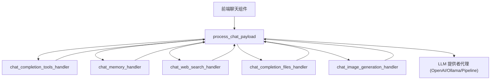
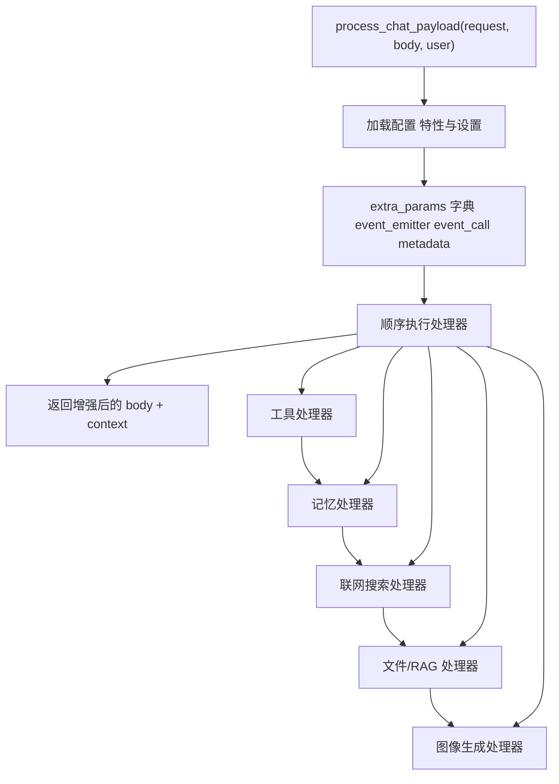
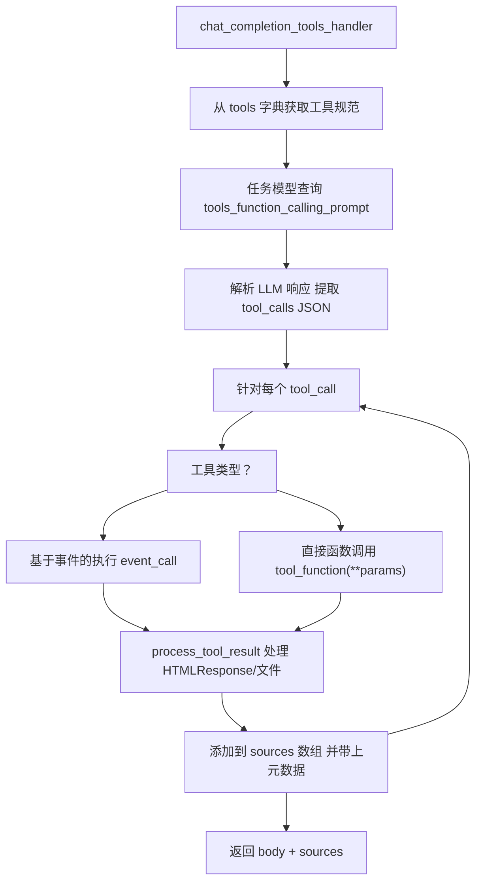
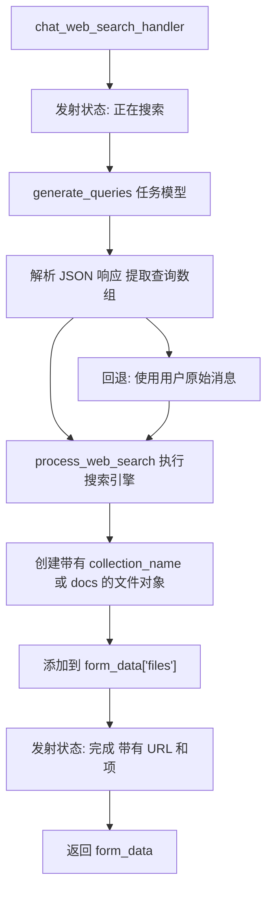
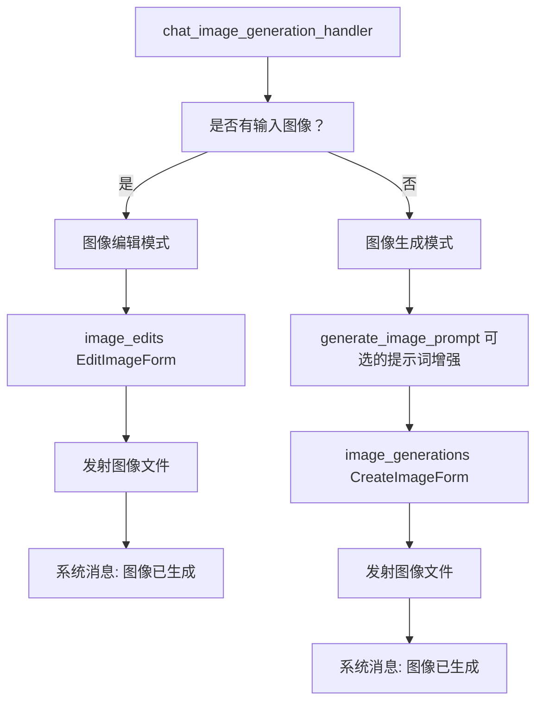
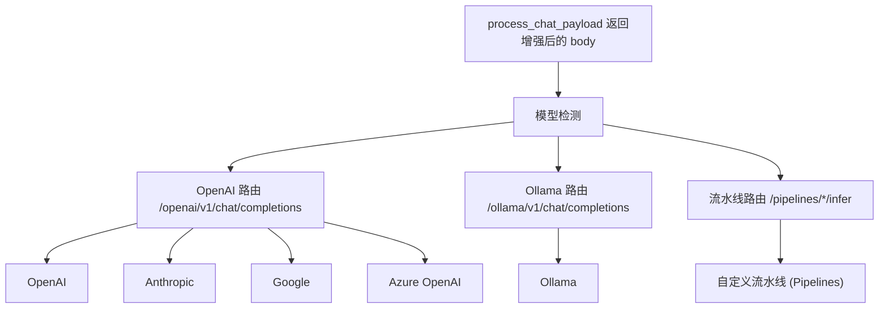

# 聊天请求处理

相关源文件

-   [backend/open_webui/config.py](https://github.com/open-webui/open-webui/blob/a7271532/backend/open_webui/config.py)
-   [backend/open_webui/main.py](https://github.com/open-webui/open-webui/blob/a7271532/backend/open_webui/main.py)
-   [backend/open_webui/retrieval/loaders/datalab_marker.py](https://github.com/open-webui/open-webui/blob/a7271532/backend/open_webui/retrieval/loaders/datalab_marker.py)
-   [backend/open_webui/retrieval/loaders/external_document.py](https://github.com/open-webui/open-webui/blob/a7271532/backend/open_webui/retrieval/loaders/external_document.py)
-   [backend/open_webui/retrieval/loaders/external_web.py](https://github.com/open-webui/open-webui/blob/a7271532/backend/open_webui/retrieval/loaders/external_web.py)
-   [backend/open_webui/retrieval/loaders/main.py](https://github.com/open-webui/open-webui/blob/a7271532/backend/open_webui/retrieval/loaders/main.py)
-   [backend/open_webui/retrieval/loaders/mineru.py](https://github.com/open-webui/open-webui/blob/a7271532/backend/open_webui/retrieval/loaders/mineru.py)
-   [backend/open_webui/retrieval/loaders/mistral.py](https://github.com/open-webui/open-webui/blob/a7271532/backend/open_webui/retrieval/loaders/mistral.py)
-   [backend/open_webui/retrieval/utils.py](https://github.com/open-webui/open-webui/blob/a7271532/backend/open_webui/retrieval/utils.py)
-   [backend/open_webui/routers/retrieval.py](https://github.com/open-webui/open-webui/blob/a7271532/backend/open_webui/routers/retrieval.py)
-   [backend/open_webui/utils/middleware.py](https://github.com/open-webui/open-webui/blob/a7271532/backend/open_webui/utils/middleware.py)
-   [src/lib/apis/retrieval/index.ts](https://github.com/open-webui/open-webui/blob/a7271532/src/lib/apis/retrieval/index.ts)
-   [src/lib/components/admin/Settings/Documents.svelte](https://github.com/open-webui/open-webui/blob/a7271532/src/lib/components/admin/Settings/Documents.svelte)
-   [src/lib/components/admin/Settings/WebSearch.svelte](https://github.com/open-webui/open-webui/blob/a7271532/src/lib/components/admin/Settings/WebSearch.svelte)

## 目的与范围

本页记录了 `process_chat_payload` 中间件系统，该系统在聊天补全请求发送到 LLM 提供者之前对其进行拦截和增强。该中间件充当中央编排层，通过来自多个来源的上下文来丰富用户提示词，这些来源包括 RAG 检索的文档、工具执行结果、联网搜索发现以及用户记忆。

有关特定增强子系统的详细信息，请参阅：

-   RAG 上下文注入：[RAG 集成](/open-webui/open-webui/5.2-content-rendering-pipeline)
-   工具执行机制：[工具执行系统](/open-webui/open-webui/5.3-markdown-processing)
-   联网搜索处理：[联网搜索集成](/open-webui/open-webui/5.4-code-block-execution)
-   记忆检索：[记忆与上下文管理](/open-webui/open-webui/5.5-multi-model-response-display)

## 概述

聊天请求处理流水线将基础的聊天补全请求转换为富含上下文信息的增强请求。该中间件层位于前端聊天界面和 LLM 提供者代理之间，实现了检索增强生成 (RAG)、函数调用、联网搜索和记忆集成，而无需更改底层的 LLM API。

**请求流程图**


来源： [backend/open_webui/utils/middleware.py1-1200](https://github.com/open-webui/open-webui/blob/a7271532/backend/open_webui/utils/middleware.py#L1-L1200)

## 架构组件

### 核心中间件函数

[backend/open_webui/utils/middleware.py](https://github.com/open-webui/open-webui/blob/a7271532/backend/open_webui/utils/middleware.py) 中的 `process_chat_payload` 函数是请求增强的主要入口点。它接收原始的聊天补全请求体，并协调各个处理器函数的执行。

**中间件结构**


来源： [backend/open_webui/utils/middleware.py900-1200](https://github.com/open-webui/open-webui/blob/a7271532/backend/open_webui/utils/middleware.py#L900-L1200)

### 额外参数对象 (Extra Parameters Object)

中间件创建了一个 `extra_params` 字典并传递给所有处理器函数，为它们提供共享的上下文和通信通道：

| 参数 | 类型 | 用途 |
| --- | --- | --- |
| `__event_emitter__` | 函数 | WebSocket 回调，用于向前端流式传输状态更新 |
| `__event_call__` | 函数 | 事件调用器，用于通过 WebSocket 执行直接工具 |
| `__metadata__` | 字典 | 包含 `chat_id`、`message_id`、`session_id`，用于上下文追踪 |
| `__user__` | UserModel | 用于访问控制的当前用户对象 |

这些参数实现了实时状态更新以及异步处理器操作之间的协调。

来源： [backend/open_webui/utils/middleware.py900-950](https://github.com/open-webui/open-webui/blob/a7271532/backend/open_webui/utils/middleware.py#L900-L950)

## 处理器执行流程

### 1. 工具处理器

**函数**：`chat_completion_tools_handler`
**位置**：[backend/open_webui/utils/middleware.py287-514](https://github.com/open-webui/open-webui/blob/a7271532/backend/open_webui/utils/middleware.py#L287-L514)

工具处理器实现了一个两阶段执行模型：

1.  **工具选择阶段**：使用任务模型分析用户查询和可用工具规范，生成结构化的工具调用请求。
2.  **工具执行阶段**：执行选定的工具并收集其结果。

**工具执行流程**


**关键函数**：

-   `get_tools_function_calling_payload`：为任务模型构造提示词 [middleware.py304-331](https://github.com/open-webui/open-webui/blob/a7271532/backend/open_webui/utils/middleware.py#L304-L331)。
-   `get_content_from_response`：从流式或非流式响应中提取内容 [middleware.py290-302](https://github.com/open-webui/open-webui/blob/a7271532/backend/open_webui/utils/middleware.py#L290-L302)。
-   `process_tool_result`：处理各种工具结果格式，包括 HTMLResponse 和嵌入内容 [middleware.py144-284](https://github.com/open-webui/open-webui/blob/a7271532/backend/open_webui/utils/middleware.py#L144-L284)。

处理器返回：

-   修改后的 `body`（如果使用了文件处理工具，则可能移除了 `files`）。
-   一个包含工具结果且格式化为 RAG 风格来源的 `sources` 数组。

来源： [backend/open_webui/utils/middleware.py287-514](https://github.com/open-webui/open-webui/blob/a7271532/backend/open_webui/utils/middleware.py#L287-L514)

### 2. 记忆处理器

**函数**：`chat_memory_handler`
**位置**：[backend/open_webui/utils/middleware.py517-553](https://github.com/open-webui/open-webui/blob/a7271532/backend/open_webui/utils/middleware.py#L517-L553)

从用户的记忆系统中检索相关的历史上下文，并将其注入到系统消息中。

**实现方式**：

```python
async def chat_memory_handler(
    request: Request, form_data: dict, extra_params: dict, user
):
    # 使用用户的最后一条消息查询记忆
    results = await query_memory(
        request,
        QueryMemoryForm(
            content=get_last_user_message(form_data["messages"]) or "",
            k=3,
        ),
        user,
    )

    # 格式化带有时间戳的记忆文档
    user_context = ""
    for doc_idx, doc in enumerate(results.documents[0]):
        created_at_date = format_timestamp(results.metadatas[0][doc_idx]["created_at"])
        user_context += f"{doc_idx + 1}. [{created_at_date}] {doc}\n"

    # 注入到系统消息中
    form_data["messages"] = add_or_update_system_message(
        f"User Context:\n{user_context}\n", form_data["messages"], append=True
    )
```
记忆内容是追加到系统消息末尾而不是放在开头，确保它出现在任何现有系统指令之后。

来源： [backend/open_webui/utils/middleware.py517-553](https://github.com/open-webui/open-webui/blob/a7271532/backend/open_webui/utils/middleware.py#L517-L553) [backend/open_webui/routers/memories.py](https://github.com/open-webui/open-webui/blob/a7271532/backend/open_webui/routers/memories.py)

### 3. 联网搜索处理器

**函数**：`chat_web_search_handler`
**位置**：[backend/open_webui/utils/middleware.py556-716](https://github.com/open-webui/open-webui/blob/a7271532/backend/open_webui/utils/middleware.py#L556-L716)

根据用户的消息生成搜索查询，执行联网搜索，并将结果作为文件上下文添加。

**联网搜索流水线**


**查询生成**：使用任务模型根据对话上下文生成 1-3 个优化的搜索查询 [middleware.py575-607](https://github.com/open-webui/open-webui/blob/a7271532/backend/open_webui/utils/middleware.py#L575-L607)。

**结果格式**：处理器创建两种可能格式的文件对象：

1.  **基于集合的 (Collection-based)**：启用嵌入时，结果存储在向量集合中。
2.  **直接文档 (Direct docs)**：当 `BYPASS_WEB_SEARCH_EMBEDDING_AND_RETRIEVAL` 为 true 时，直接传递原始文档。

来源： [backend/open_webui/utils/middleware.py556-716](https://github.com/open-webui/open-webui/blob/a7271532/backend/open_webui/utils/middleware.py#L556-L716) [backend/open_webui/routers/tasks.py](https://github.com/open-webui/open-webui/blob/a7271532/backend/open_webui/routers/tasks.py)

### 4. 文件/RAG 处理器

**函数**：`chat_completion_files_handler`
**位置**：[backend/open_webui/utils/middleware.py1000](https://github.com/open-webui/open-webui/blob/a7271532/backend/open_webui/utils/middleware.py#L1000-L1000)

处理附加在消息上的文件，执行 RAG 检索，并将上下文注入系统消息。该处理器在 [RAG 集成](/open-webui/open-webui/5.2-content-rendering-pipeline) 中有详细记录。

**关键操作**：

-   集合解析（文件集合、知识库、聊天、笔记）。
-   用于检索的查询生成。
-   带有重排序的混合搜索。
-   通过 RAG 模板进行上下文注入。
-   来源引用格式化。

来源： [backend/open_webui/utils/middleware.py1000-1300](https://github.com/open-webui/open-webui/blob/a7271532/backend/open_webui/utils/middleware.py#L1000-L1300)

### 5. 图像生成处理器

**函数**：`chat_image_generation_handler`
**位置**：[backend/open_webui/utils/middleware.py755-950](https://github.com/open-webui/open-webui/blob/a7271532/backend/open_webui/utils/middleware.py#L755-L950)

检测图像生成请求，并从头开始生成图像或编辑现有图像。

**逻辑流程**：


处理器通过 `__event_emitter__` 发射生成的图像，并注入一条上下文消息告知 LLM 图像已创建。

来源： [backend/open_webui/utils/middleware.py755-950](https://github.com/open-webui/open-webui/blob/a7271532/backend/open_webui/utils/middleware.py#L755-L950) [backend/open_webui/routers/images.py](https://github.com/open-webui/open-webui/blob/a7271532/backend/open_webui/routers/images.py)

## 请求增强详情

### 系统消息注入

多个处理器使用来自 [backend/open_webui/utils/misc.py](https://github.com/open-webui/open-webui/blob/a7271532/backend/open_webui/utils/misc.py) 的工具函数将内容注入到系统消息中：

| 函数 | 用途 |
| --- | --- |
| `add_or_update_system_message` | 添加或更新系统消息，可选是否追加 |
| `add_or_update_user_message` | 修改用户消息内容 |
| `prepend_to_first_user_message_content` | 向第一条用户消息内容的开头添加内容 |
| `get_system_message` | 获取当前系统消息 |

**注入顺序**：

1.  用户记忆上下文（追加到系统消息）。
2.  RAG 上下文（通过模板置于系统消息开头）。
3.  图像生成上下文（作为新的系统消息）。

### 元数据追踪

`__metadata__` 字典在整个请求生命周期中追踪上下文：

```python
metadata = {
    "chat_id": str,        # 聊天标识符 (临时聊天为 "local:")
    "message_id": str,     # 聊天树中的当前消息 ID
    "session_id": str,     # WebSocket 会话 ID
}
```
此元数据实现了：

-   带有正确所有权的文件 URL 生成。
-   WebSocket 事件定向发送。
-   用于 RAG 的聊天历史检索。
-   工具结果存储。

来源： [backend/open_webui/utils/middleware.py900-950](https://github.com/open-webui/open-webui/blob/a7271532/backend/open_webui/utils/middleware.py#L900-L950)

### 来源引用格式

处理器将增强信息作为“sources”返回，这些信息被格式化以便在前端进行引用显示：

```python
source = {
    "source": {
        "name": str,           # 显示名称 (例如 "工具名称" 或 "文件名")
    },
    "document": [str],         # 内容块数组
    "metadata": [{
        "source": str,         # 来源标识符
        "parameters": dict,    # 工具参数或文件元数据
    }],
    "tool_result": bool,       # 如果来自工具执行则为 True
}
```
来源在聊天 UI 中显示为可展开的引用，并链接到相关内容。

来源： [backend/open_webui/utils/middleware.py461-486](https://github.com/open-webui/open-webui/blob/a7271532/backend/open_webui/utils/middleware.py#L461-L486) [backend/open_webui/retrieval/utils.py](https://github.com/open-webui/open-webui/blob/a7271532/backend/open_webui/retrieval/utils.py)

## 集成点

### LLM 提供者路由

在中间件处理之后，增强后的请求将根据模型 ID 路由到相应的 LLM 提供者代理：

**路由逻辑**


来源： [backend/open_webui/main.py1500-1700](https://github.com/open-webui/open-webui/blob/a7271532/backend/open_webui/main.py#L1500-L1700) [backend/open_webui/routers/openai.py](https://github.com/open-webui/open-webui/blob/a7271532/backend/open_webui/routers/openai.py) [backend/open_webui/routers/ollama.py](https://github.com/open-webui/open-webui/blob/a7271532/backend/open_webui/routers/ollama.py) [backend/open_webui/routers/pipelines.py](https://github.com/open-webui/open-webui/blob/a7271532/backend/open_webui/routers/pipelines.py)

### WebSocket 事件发射

`__event_emitter__` 回调通过 Socket.IO 向前端发送实时状态更新：

**事件类型**：

| 事件类型 | 数据结构 | 用途 |
| --- | --- | --- |
| `status` | `{action, description, done, error?}` | 进度更新 |
| `files` | `{files: [{type, url}]}` | 附件文件 (图像, 文档) |
| `embeds` | `{embeds: [html_content]}` | 嵌入式 HTML 内容 |
| `sources` | `{sources: [source_objects]}` | 引用来源 |

用法示例：

```python
await event_emitter({
    "type": "status",
    "data": {
        "action": "web_search",
        "description": "正在搜索网络",
        "done": False,
    },
})
```
来源： [backend/open_webui/utils/middleware.py559-570](https://github.com/open-webui/open-webui/blob/a7271532/backend/open_webui/utils/middleware.py#L559-L570) [backend/open_webui/socket/main.py](https://github.com/open-webui/open-webui/blob/a7271532/backend/open_webui/socket/main.py)

### 配置访问

处理器函数通过 `request.app.state.config` 访问配置，它提供了运行时可更新的设置：

**关键配置参数**：

-   `ENABLE_WEB_SEARCH`：启用联网搜索处理器。
-   `WEB_SEARCH_ENGINE`：选定的搜索提供商。
-   `RAG_TEMPLATE`：用于 RAG 上下文注入的模板。
-   `TOP_K`：要检索的内容块数量。
-   `ENABLE_IMAGE_GENERATION`：启用图像生成。
-   `TASK_MODEL`：用于任务生成的模型（查询生成、工具选择）。

来源： [backend/open_webui/config.py224-284](https://github.com/open-webui/open-webui/blob/a7271532/backend/open_webui/config.py#L224-L284)

## 错误处理与韧性

### 处理器异常管理

每个处理器都包含 try-catch 块，以防止单个处理器的失败破坏整个流水线：

```python
try:
    results = await query_memory(request, form, user)
    # 处理结果...
except Exception as e:
    log.debug(e)
    results = None
    # 继续使用空结果
```
这种设计确保了如果记忆检索失败，请求仍然可以使用工具结果、联网搜索和 RAG 上下文进行处理。

来源： [backend/open_webui/utils/middleware.py520-533](https://github.com/open-webui/open-webui/blob/a7271532/backend/open_webui/utils/middleware.py#L520-L533)

### 优雅降级

当处理器遇到错误时：

1.  错误被记录但不会向上传播。
2.  处理器返回未修改的请求。
3.  后续处理器继续执行。
4.  请求带着部分增强信息继续发送至 LLM。

这使得系统即使在单个组件失效时也能保持可用。

来源： [backend/open_webui/utils/middleware.py500-510](https://github.com/open-webui/open-webui/blob/a7271532/backend/open_webui/utils/middleware.py#L500-L510) [backend/open_webui/utils/middleware.py701-714](https://github.com/open-webui/open-webui/blob/a7271532/backend/open_webui/utils/middleware.py#L701-L714)

## 性能考量

### 并行处理器执行

目前，处理器是顺序执行的。然而，有几个处理器是可以并行的：

-   记忆检索和联网搜索是相互独立的。
-   工具执行和文件处理是相互独立的。

未来的优化可以使用 `asyncio.gather()` 并发执行独立的处理器。

### 缓存

当 `ENABLE_QUERIES_CACHE` 开启时，系统实现了查询缓存：

```python
if ENABLE_QUERIES_CACHE:
    request.state.cached_queries = queries
```
这允许在同一会话的后续请求中复用生成的查询。

来源： [backend/open_webui/utils/middleware.py602-604](https://github.com/open-webui/open-webui/blob/a7271532/backend/open_webui/utils/middleware.py#L602-L604) [backend/open_webui/env.py](https://github.com/open-webui/open-webui/blob/a7271532/backend/open_webui/env.py)

### 任务模型选择

[backend/open_webui/utils/task.py](https://github.com/open-webui/open-webui/blob/a7271532/backend/open_webui/utils/task.py) 中的 `get_task_model_id` 函数决定了在执行辅助任务（查询生成、工具选择）时使用哪个模型。这允许针对这些操作使用快速、经济的模型，而将更强大的模型留给主要的聊天补全任务。

来源： [backend/open_webui/utils/task.py](https://github.com/open-webui/open-webui/blob/a7271532/backend/open_webui/utils/task.py) [backend/open_webui/utils/middleware.py337-342](https://github.com/open-webui/open-webui/blob/a7271532/backend/open_webui/utils/middleware.py#L337-L342)
