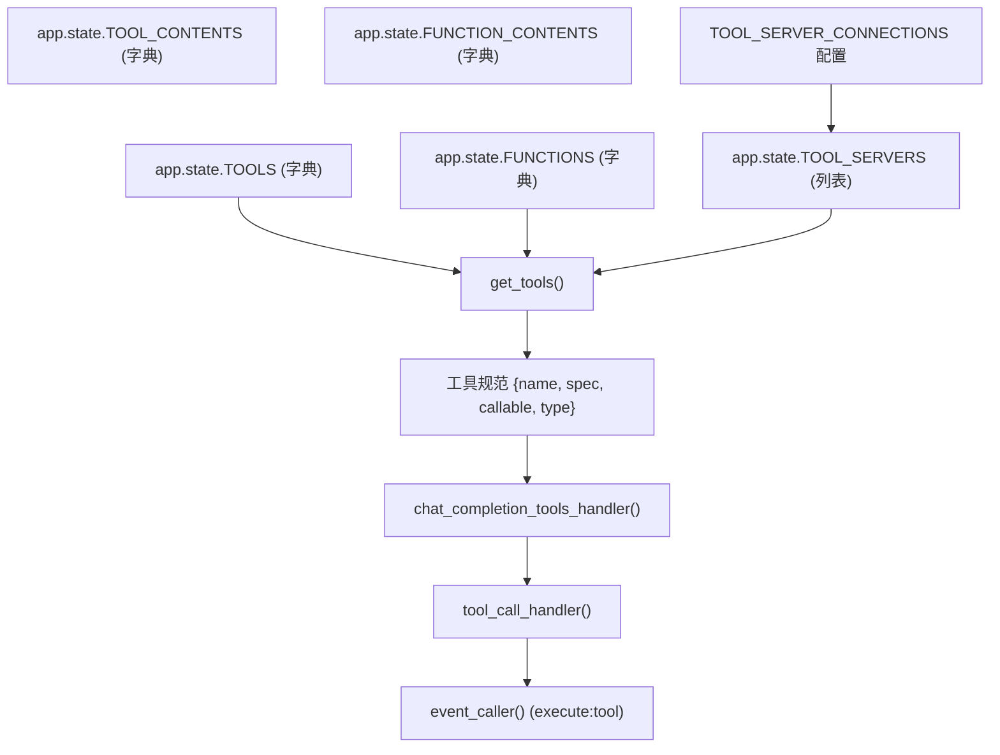
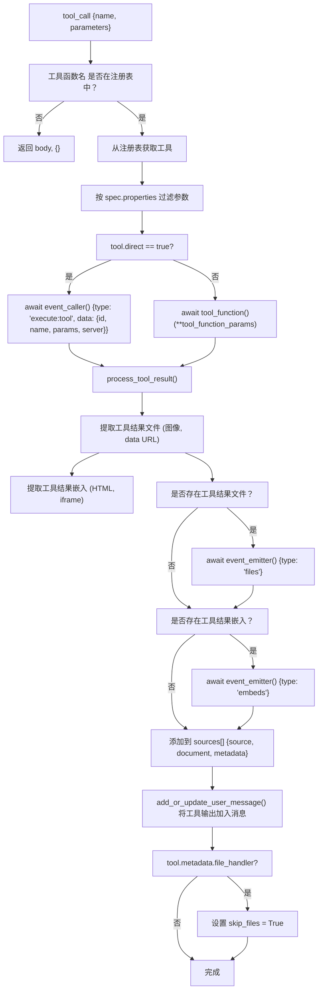
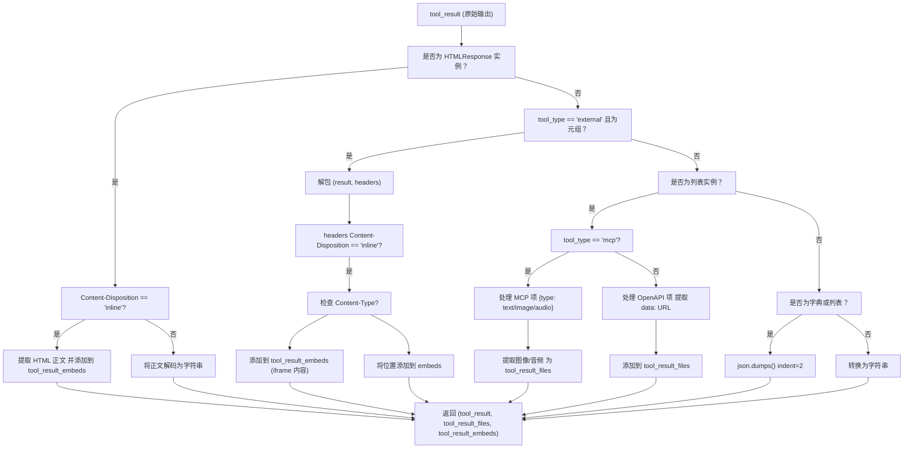
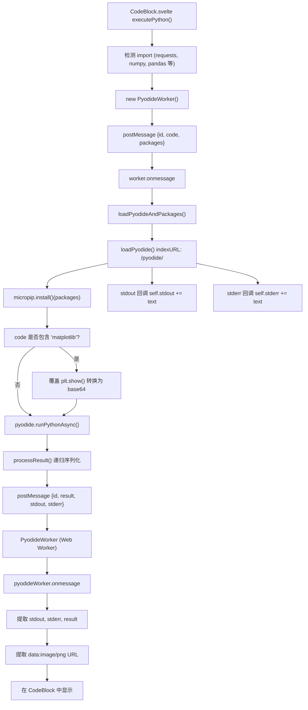
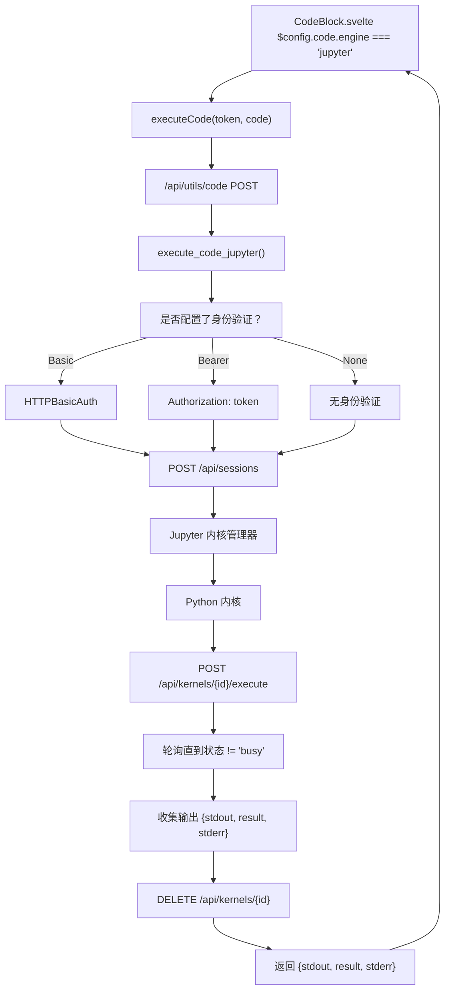
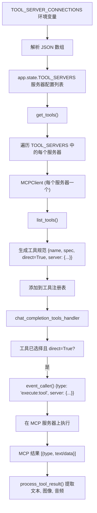
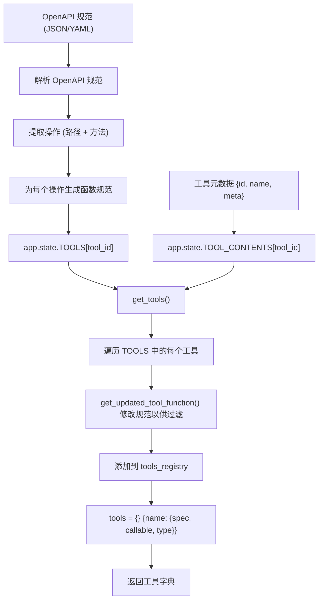
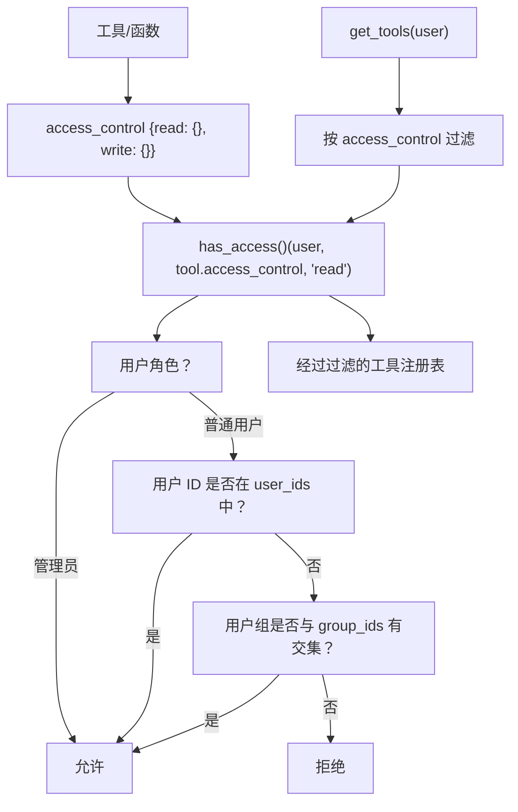

# 工具执行系统

相关源文件

-   [backend/open\_webui/config.py](https://github.com/open-webui/open-webui/blob/a7271532/backend/open_webui/config.py)
-   [backend/open\_webui/main.py](https://github.com/open-webui/open-webui/blob/a7271532/backend/open_webui/main.py)
-   [backend/open\_webui/retrieval/loaders/datalab\_marker.py](https://github.com/open-webui/open-webui/blob/a7271532/backend/open_webui/retrieval/loaders/datalab_marker.py)
-   [backend/open\_webui/retrieval/loaders/external\_document.py](https://github.com/open-webui/open-webui/blob/a7271532/backend/open_webui/retrieval/loaders/external_document.py)
-   [backend/open\_webui/retrieval/loaders/external\_web.py](https://github.com/open-webui/open-webui/blob/a7271532/backend/open_webui/retrieval/loaders/external_web.py)
-   [backend/open\_webui/retrieval/loaders/main.py](https://github.com/open-webui/open-webui/blob/a7271532/backend/open_webui/retrieval/loaders/main.py)
-   [backend/open\_webui/retrieval/loaders/mineru.py](https://github.com/open-webui/open-webui/blob/a7271532/backend/open_webui/retrieval/loaders/mineru.py)
-   [backend/open\_webui/retrieval/loaders/mistral.py](https://github.com/open-webui/open-webui/blob/a7271532/backend/open_webui/retrieval/loaders/mistral.py)
-   [backend/open\_webui/retrieval/utils.py](https://github.com/open-webui/open-webui/blob/a7271532/backend/open_webui/retrieval/utils.py)
-   [backend/open\_webui/routers/retrieval.py](https://github.com/open-webui/open-webui/blob/a7271532/backend/open_webui/routers/retrieval.py)
-   [backend/open\_webui/utils/middleware.py](https://github.com/open-webui/open-webui/blob/a7271532/backend/open_webui/utils/middleware.py)
-   [src/lib/apis/retrieval/index.ts](https://github.com/open-webui/open-webui/blob/a7271532/src/lib/apis/retrieval/index.ts)
-   [src/lib/components/admin/Settings/Documents.svelte](https://github.com/open-webui/open-webui/blob/a7271532/src/lib/components/admin/Settings/Documents.svelte)
-   [src/lib/components/admin/Settings/WebSearch.svelte](https://github.com/open-webui/open-webui/blob/a7271532/src/lib/components/admin/Settings/WebSearch.svelte)

## 目的与范围

工具执行系统使 AI 模型能够在聊天补全过程中调用外部函数、执行代码并与外部服务交互。该系统提供了三条主要的执行路径：**基于函数的工具**（在“工具/函数”中定义的 Python 代码）、**OpenAPI 工具**（外部 HTTP API）以及 **MCP 服务器**（模型上下文协议服务器）。该系统负责处理工具调用、结果处理以及将工具输出集成回对话上下文中。

有关编排工具调用的中间件流水线的信息，请参阅 [请求处理流程](/open-webui/open-webui/4.1-chat-component-architecture)。有关与工具独立运行的基于 RAG 的文档检索，请参阅 [RAG 与知识库系统](/open-webui/open-webui/5-message-rendering)。

## 工具类型与架构

### 工具类别

Open WebUI 支持三种不同的工具执行机制：

| 工具类型 | 描述 | 存储位置 | 执行上下文 |
| --- | --- | --- | --- |
| **函数 (Functions)** | 通过自定义 `Tools` 类在服务器端执行的 Python 代码 | `app.state.FUNCTIONS` | 后端 FastAPI 进程 |
| **OpenAPI 工具** | 通过 OpenAPI 规范定义的外部 HTTP API | `app.state.TOOLS` | 外部 HTTP 端点 |
| **MCP 服务器** | 提供资源和工具的模型上下文协议 (Model Context Protocol) 服务器 | `TOOL_SERVER_CONNECTIONS` 配置 | 外部 MCP 进程 |

来源： [backend/open\_webui/main.py813-817](https://github.com/open-webui/open-webui/blob/a7271532/backend/open_webui/main.py#L813-L817) [backend/open\_webui/utils/middleware.py285-516](https://github.com/open-webui/open-webui/blob/a7271532/backend/open_webui/utils/middleware.py#L285-L516)

### 工具状态管理


**图表：工具状态架构与注册表**

系统在应用程序状态中为工具和函数维护独立的字典。在运行时，`get_tools()` 将这些内容合并为一个统一的工具注册表，其规范与 OpenAI 函数调用兼容。

来源： [backend/open\_webui/main.py813-817](https://github.com/open-webui/open-webui/blob/a7271532/backend/open_webui/main.py#L813-L817) [backend/open\_webui/utils/middleware.py285-516](https://github.com/open-webui/open-webui/blob/a7271532/backend/open_webui/utils/middleware.py#L285-L516) [backend/open\_webui/utils/tools.py](https://github.com/open-webui/open-webui/blob/a7271532/backend/open_webui/utils/tools.py)

## 工具调用流程

### 函数调用生成

工具执行系统采用两阶段方法：首先通过任务模型生成工具调用，然后执行选定的工具。

> **[Mermaid sequence]**
> *(图表结构无法解析)*

**图表：工具调用序列**

系统使用 `TOOLS_FUNCTION_CALLING_PROMPT_TEMPLATE` 指示任务模型生成工具调用。模板包含工具规范和聊天历史，生成包含工具名称和参数的结构化 JSON。

来源： [backend/open\_webui/utils/middleware.py285-360](https://github.com/open-webui/open-webui/blob/a7271532/backend/open_webui/utils/middleware.py#L285-L360) [backend/open\_webui/utils/middleware.py368-502](https://github.com/open-webui/open-webui/blob/a7271532/backend/open_webui/utils/middleware.py#L368-L502)

### 工具调用处理器实现

核心工具调用逻辑位于 `chat_completion_tools_handler` 内部的 `tool_call_handler` 异步函数中：


**图表：工具调用处理器控制流**

该处理器验证工具是否存在，对照工具规范过滤参数，调用直接工具（通过事件系统）或可调用函数，处理结果，并将输出注入到对话上下文中。

来源： [backend/open\_webui/utils/middleware.py368-495](https://github.com/open-webui/open-webui/blob/a7271532/backend/open_webui/utils/middleware.py#L368-L495)

## 工具结果处理

### 结果类型处理

`process_tool_result` 函数处理来自工具的多种输出格式：


**图表：工具结果处理流水线**

该函数处理 HTMLResponse 对象、带请求头的元组（针对外部工具）、MCP 格式的响应，并将复杂对象转换为 JSON 字符串以便注入对话。

来源： [backend/open\_webui/utils/middleware.py142-282](https://github.com/open-webui/open-webui/blob/a7271532/backend/open_webui/utils/middleware.py#L142-L282)

### 结果集成

工具结果通过四种机制集成到聊天流中：

| 集成类型 | 用途 | 事件类型 | 存储 |
| --- | --- | --- | --- |
| **文件 (Files)** | 图像、音频、data URL | `{type: 'files', data: {files: []}}` | 在聊天中内联显示 |
| **嵌入 (Embeds)** | HTML/iframe 内容 | `{type: 'embeds', data: {embeds: []}}` | 渲染为嵌入式 UI |
| **来源 (Sources)** | 引用上下文 | 添加到 `sources[]` 数组 | 用于 RAG 风格的引用 |
| **用户消息** | 文本输出 | 通过 `add_or_update_user_message()` 追加 | 注入消息上下文 |

当工具在其元数据中声明 `file_handler = True` 时，将设置 `skip_files` 标志，防止对自行管理文件的工具进行默认文件处理。

来源： [backend/open\_webui/utils/middleware.py430-495](https://github.com/open-webui/open-webui/blob/a7271532/backend/open_webui/utils/middleware.py#L430-L495)

## 代码执行引擎

### 客户端：Pyodide Worker

基于浏览器的 Python 执行使用运行 Pyodide 的 Web Worker：


**图表：Pyodide Worker 执行流程**

Worker 加载 Pyodide 以及从 import 语句中检测到的可配置包集。对于 matplotlib 绘图，系统会覆盖 `plt.show()` 以捕获 base64 编码的 PNG 图像，而不是尝试在 Worker 上下文中显示。

来源： [src/lib/workers/pyodide.worker.ts1-167](https://github.com/open-webui/open-webui/blob/a7271532/src/lib/workers/pyodide.worker.ts#L1-L167) [src/lib/components/chat/Messages/CodeBlock.svelte139-329](https://github.com/open-webui/open-webui/blob/a7271532/src/lib/components/chat/Messages/CodeBlock.svelte#L139-L329)

### 服务器端：Jupyter 内核

对于服务器端执行，系统可以使用 Jupyter 内核：


**图表：Jupyter 内核执行流程**

Jupyter 执行路径创建一个临时的内核会话、执行代码、轮询完成状态、收集输出（包括显示数据）并清理内核。

来源： [backend/open\_webui/utils/code\_interpreter.py](https://github.com/open-webui/open-webui/blob/a7271532/backend/open_webui/utils/code_interpreter.py) [src/lib/components/chat/Messages/CodeBlock.svelte146-217](https://github.com/open-webui/open-webui/blob/a7271532/src/lib/components/chat/Messages/CodeBlock.svelte#L146-L217)

### 配置

代码执行通过环境变量和运行时配置进行设置：

| 配置项 | 环境变量 | 配置路径 | 默认值 |
| --- | --- | --- | --- |
| 启用代码执行 | `ENABLE_CODE_EXECUTION` | `app.state.config.ENABLE_CODE_EXECUTION` | `true` |
| 执行引擎 | `CODE_EXECUTION_ENGINE` | `app.state.config.CODE_EXECUTION_ENGINE` | `"pyodide"` |
| Jupyter URL | `CODE_EXECUTION_JUPYTER_URL` | `app.state.config.CODE_EXECUTION_JUPYTER_URL` | `""` |
| Jupyter 身份验证 | `CODE_EXECUTION_JUPYTER_AUTH` | `app.state.config.CODE_EXECUTION_JUPYTER_AUTH` | `""` |
| Jupyter 验证令牌 | `CODE_EXECUTION_JUPYTER_AUTH_TOKEN` | `app.state.config.CODE_EXECUTION_JUPYTER_AUTH_TOKEN` | `""` |
| Jupyter 验证密码 | `CODE_EXECUTION_JUPYTER_AUTH_PASSWORD` | `app.state.config.CODE_EXECUTION_JUPYTER_AUTH_PASSWORD` | `""` |
| Jupyter 超时时间 | `CODE_EXECUTION_JUPYTER_TIMEOUT` | `app.state.config.CODE_EXECUTION_JUPYTER_TIMEOUT` | `60` |

来源： [backend/open\_webui/main.py131-145](https://github.com/open-webui/open-webui/blob/a7271532/backend/open_webui/main.py#L131-L145) [backend/open\_webui/main.py1049-1071](https://github.com/open-webui/open-webui/blob/a7271532/backend/open_webui/main.py#L1049-L1071)

## 工具服务器集成

### MCP (模型上下文协议)

MCP 服务器通过标准化协议提供工具和资源。系统维护与已配置 MCP 服务器的连接：


**图表：MCP 服务器集成架构**

MCP 服务器通过 `TOOL_SERVER_CONNECTIONS` 以 JSON 数组形式配置。每个服务器提供的工具注册时 `direct=True`，这意味着它们是通过事件系统而非直接的可调用函数触发的。

来源： [backend/open\_webui/main.py700-702](https://github.com/open-webui/open-webui/blob/a7271532/backend/open_webui/main.py#L700-L702) [backend/open\_webui/utils/middleware.py399-410](https://github.com/open-webui/open-webui/blob/a7271532/backend/open_webui/utils/middleware.py#L399-L410)

### MCP 结果处理

MCP 工具以结构化格式返回结果，需要特殊处理：

```json
# MCP 结果结构示例
[
    {"type": "text", "text": "结果内容"},
    {"type": "image", "mimeType": "image/png", "data": "base64..."},
    {"type": "audio", "mimeType": "audio/wav", "blob": "base64..."}
]
```
`process_tool_result` 函数通过以下方式处理 MCP 结果：

1.  遍历结果项列表。
2.  提取文本项（如果适用，尝试进行 JSON 解析）。
3.  通过 `get_file_url_from_base64` 将图像/音频项转换为文件 URL。
4.  为每个媒体项构建包含类型和 URL 的 `tool_result_files` 数组。

来源： [backend/open\_webui/utils/middleware.py233-264](https://github.com/open-webui/open-webui/blob/a7271532/backend/open_webui/utils/middleware.py#L233-L264)

## OpenAPI 工具集成

### OpenAPI 工具加载

OpenAPI 工具通过 OpenAPI 规范定义，并存储在工具注册表中：


**图表：OpenAPI 工具注册流程**

OpenAPI 工具存储为将工具 ID 映射到其规范的字典。`get_tools()` 函数处理这些规范，并添加执行向 OpenAPI 端点发送 HTTP 请求的可调用函数。

来源： [backend/open\_webui/utils/tools.py](https://github.com/open-webui/open-webui/blob/a7271532/backend/open_webui/utils/tools.py) [backend/open\_webui/main.py813-817](https://github.com/open-webui/open-webui/blob/a7271532/backend/open_webui/main.py#L813-L817)

### 外部工具调用

OpenAPI 工具通过向外部端点发送 HTTP 请求来执行。工具的可调用函数：

1.  根据 OpenAPI 规范和参数构造 HTTP 请求。
2.  执行向外部端点的请求。
3.  将响应体和请求头作为元组返回。
4.  `process_tool_result` 处理该元组以提取内联内容。

当工具返回带有 `Content-Disposition: inline` 的请求头时，响应将被视为可嵌入内容（HTML iframe 或位置重定向）。

来源： [backend/open\_webui/utils/middleware.py186-229](https://github.com/open-webui/open-webui/blob/a7271532/backend/open_webui/utils/middleware.py#L186-L229)

## 工具访问控制

工具通过 `access_control` 字段支持细粒度的访问控制：


**图表：工具访问控制流程**

`get_tools()` 函数根据用户权限过滤工具。只有用户拥有“读取 (read)”权限的工具才会被包含在返回给工具执行系统的注册表中。

来源： [backend/open\_webui/utils/tools.py](https://github.com/open-webui/open-webui/blob/a7271532/backend/open_webui/utils/tools.py) [backend/open\_webui/utils/access\_control.py](https://github.com/open-webui/open-webui/blob/a7271532/backend/open_webui/utils/access_control.py)

## 错误处理与重试逻辑

工具执行系统包含全面的错误处理：

| 错误类型 | 处理策略 | 结果 |
| --- | --- | --- |
| **未找到工具** | 跳过工具调用 | 返回空的 `body, {}` |
| **无效参数** | 按规范过滤参数 | 仅传递允许的参数 |
| **执行异常** | 捕获并转换为字符串 | `tool_result = str(e)` |
| **HTML 解析错误** | 解码为 UTF-8 字符串 | 回退到文本内容 |
| **JSON 解析错误** | 返回原始响应 | 原样包含在工具结果中 |

针对代码执行的具体处理：

-   **Pyodide 超时**：60 秒限制，终止 worker。
-   **Jupyter 超时**：通过 `CODE_EXECUTION_JUPYTER_TIMEOUT` 配置。
-   **导入错误**：在 stderr 中捕获，显示给用户。

来源： [backend/open\_webui/utils/middleware.py415-416](https://github.com/open-webui/open-webui/blob/a7271532/backend/open_webui/utils/middleware.py#L415-L416) [src/lib/components/chat/Messages/CodeBlock.svelte247-253](https://github.com/open-webui/open-webui/blob/a7271532/src/lib/components/chat/Messages/CodeBlock.svelte#L247-L253)
