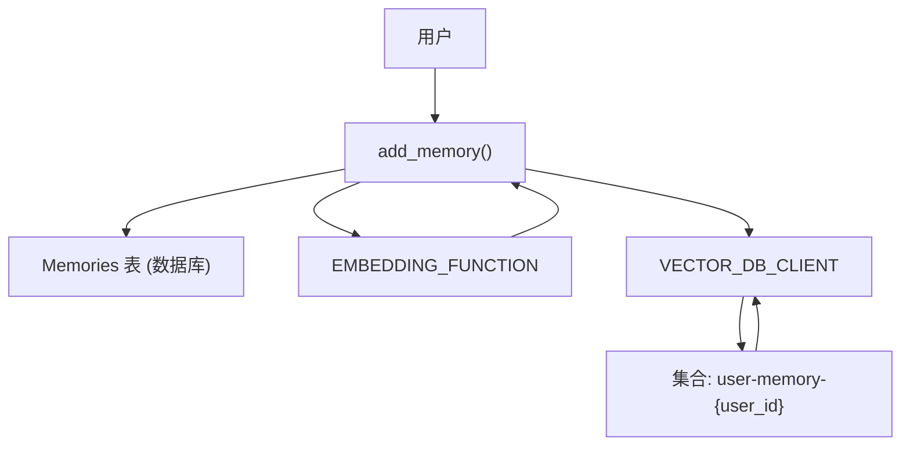
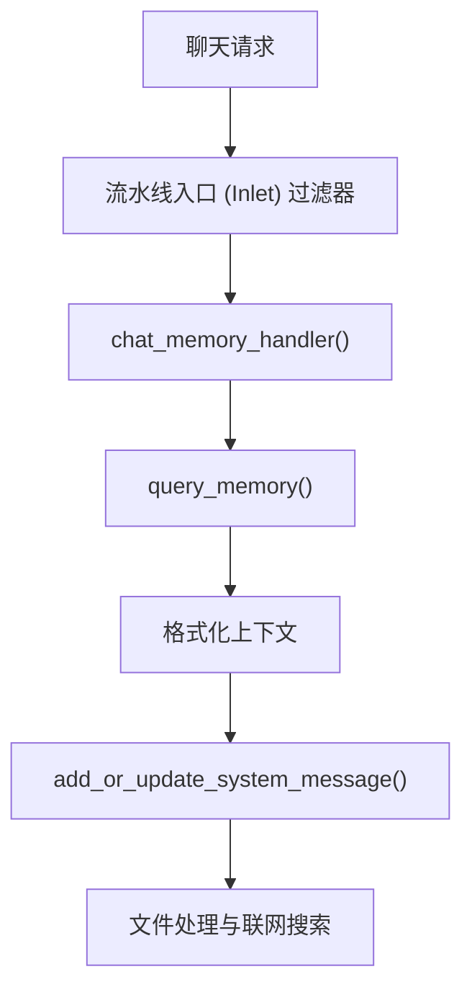
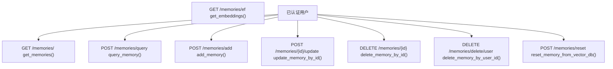
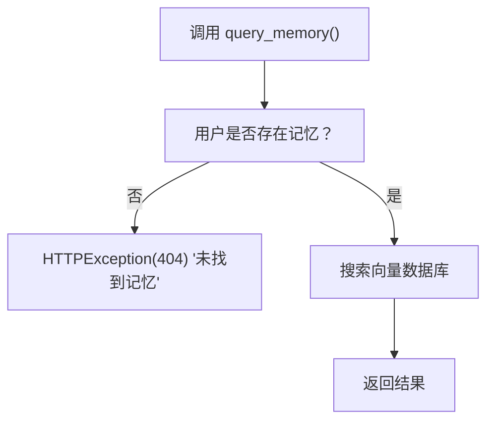

# 记忆与上下文管理

相关源文件

-   [backend/open_webui/config.py](https://github.com/open-webui/open-webui/blob/a7271532/backend/open_webui/config.py)
-   [backend/open_webui/main.py](https://github.com/open-webui/open-webui/blob/a7271532/backend/open_webui/main.py)
-   [backend/open_webui/retrieval/loaders/datalab_marker.py](https://github.com/open-webui/open-webui/blob/a7271532/backend/open_webui/retrieval/loaders/datalab_marker.py)
-   [backend/open_webui/retrieval/loaders/external_document.py](https://github.com/open-webui/open-webui/blob/a7271532/backend/open_webui/retrieval/loaders/external_document.py)
-   [backend/open_webui/retrieval/loaders/external_web.py](https://github.com/open-webui/open-webui/blob/a7271532/backend/open_webui/retrieval/loaders/external_web.py)
-   [backend/open_webui/retrieval/loaders/main.py](https://github.com/open-webui/open-webui/blob/a7271532/backend/open_webui/retrieval/loaders/main.py)
-   [backend/open_webui/retrieval/loaders/mineru.py](https://github.com/open-webui/open-webui/blob/a7271532/backend/open_webui/retrieval/loaders/mineru.py)
-   [backend/open_webui/retrieval/loaders/mistral.py](https://github.com/open-webui/open-webui/blob/a7271532/backend/open_webui/retrieval/loaders/mistral.py)
-   [backend/open_webui/retrieval/utils.py](https://github.com/open-webui/open-webui/blob/a7271532/backend/open_webui/retrieval/utils.py)
-   [backend/open_webui/routers/retrieval.py](https://github.com/open-webui/open-webui/blob/a7271532/backend/open_webui/routers/retrieval.py)
-   [backend/open_webui/utils/middleware.py](https://github.com/open-webui/open-webui/blob/a7271532/backend/open_webui/utils/middleware.py)
-   [src/lib/apis/retrieval/index.ts](https://github.com/open-webui/open-webui/blob/a7271532/src/lib/apis/retrieval/index.ts)
-   [src/lib/components/admin/Settings/Documents.svelte](https://github.com/open-webui/open-webui/blob/a7271532/src/lib/components/admin/Settings/Documents.svelte)
-   [src/lib/components/admin/Settings/WebSearch.svelte](https://github.com/open-webui/open-webui/blob/a7271532/src/lib/components/admin/Settings/WebSearch.svelte)

## 目的与范围

本文档描述了 Open WebUI 后端中间件流水线中的记忆与上下文管理系统。该系统通过存储和检索每位用户的相关历史交互，实现对话的个性化，并自动将这些信息作为上下文注入到 LLM 提示词中。

有关整体中间件流水线阶段的信息，请参阅 [后端中间件流水线](/open-webui/open-webui/4-chat-system)。有关基于 RAG 的文档检索，请参阅 [RAG 与知识库系统](/open-webui/open-webui/5-message-rendering)。

## 记忆存储架构

记忆系统维护一个双重存储架构：关系数据库中的结构化数据，以及每个用户专用向量数据库集合中的向量嵌入。

### 记忆存储流程


**来源：** [backend/open_webui/routers/memories.py47-69](https://github.com/open-webui/open-webui/blob/a7271532/backend/open_webui/routers/memories.py#L47-L69) [backend/open_webui/models/memories.py](https://github.com/open-webui/open-webui/blob/a7271532/backend/open_webui/models/memories.py)

### 存储组件

| 组件 | 实现 | 用途 |
| --- | --- | --- |
| `Memories` 数据库表 | SQLAlchemy 模型 | 记忆文本和元数据的持久化存储 |
| `VECTOR_DB_CLIENT` | 向量数据库抽象层 | 存储用于语义搜索的嵌入向量 |
| 集合命名 | `user-memory-{user.id}` | 实现用户间的记忆隔离 |
| `EMBEDDING_FUNCTION` | 可配置的嵌入模型 | 将文本转换为向量 |

数据库存储原始记忆内容以及时间戳 (`created_at`, `updated_at`)，而向量数据库存储嵌入表示以实现高效的语义搜索。每个用户都有一个由其用户 ID 标识的专用集合。

**来源：** [backend/open_webui/routers/memories.py56-67](https://github.com/open-webui/open-webui/blob/a7271532/backend/open_webui/routers/memories.py#L56-L67) [backend/open_webui/retrieval/vector/factory.py](https://github.com/open-webui/open-webui/blob/a7271532/backend/open_webui/retrieval/vector/factory.py)

## 记忆检索系统

检索系统使用语义搜索，根据当前的对话上下文查找相关的历史交互。

### 检索流程图

> **[Mermaid sequence]**
> *(图表结构无法解析)*

**来源：** [backend/open_webui/routers/memories.py82-98](https://github.com/open-webui/open-webui/blob/a7271532/backend/open_webui/routers/memories.py#L82-L98) [backend/open_webui/utils/middleware.py530-566](https://github.com/open-webui/open-webui/blob/a7271532/backend/open_webui/utils/middleware.py#L530-L566)

### 查询记忆函数

[backend/open_webui/routers/memories.py82-98](https://github.com/open-webui/open-webui/blob/a7271532/backend/open_webui/routers/memories.py#L82-L98) 中的 `query_memory` 函数实现了检索逻辑：

```python
class QueryMemoryForm(BaseModel):
    content: str
    k: Optional[int] = 1
```
该函数执行以下步骤：

1.  验证用户在数据库中存有记忆。
2.  使用 `EMBEDDING_FUNCTION` 为查询内容生成嵌入向量。
3.  通过 `VECTOR_DB_CLIENT.search()` 执行向量搜索。
4.  返回前 `k` 个结果及元数据。

向量搜索返回一个结构化结果，包含：

-   `ids`：来自数据库的记忆 ID。
-   `metadatas`：关联的元数据（created_at, updated_at）。
-   `documents`：原始记忆文本。
-   `distances`：相似度分数。

**来源：** [backend/open_webui/routers/memories.py77-98](https://github.com/open-webui/open-webui/blob/a7271532/backend/open_webui/routers/memories.py#L77-L98)

## 上下文注入流水线

记忆系统通过 `chat_memory_handler` 集成到中间件流水线中，该处理器会自动为提示词增加相关的历史上下文。

### 中间件集成流程


**来源：** [backend/open_webui/utils/middleware.py530-566](https://github.com/open-webui/open-webui/blob/a7271532/backend/open_webui/utils/middleware.py#L530-L566) [backend/open_webui/utils/middleware.py1-2000](https://github.com/open-webui/open-webui/blob/a7271532/backend/open_webui/utils/middleware.py#L1-L2000)

### 记忆处理器实现

`chat_memory_handler` 函数 [backend/open_webui/utils/middleware.py530-566](https://github.com/open-webui/open-webui/blob/a7271532/backend/open_webui/utils/middleware.py#L530-L566) 实现了上下文注入：

```python
async def chat_memory_handler(
    request: Request, form_data: dict, extra_params: dict, user
):
```
**处理步骤：**

1.  **记忆查询** - 调用 `query_memory`：
    -   `content`：来自 `form_data["messages"]` 的最后一条用户消息。
    -   `k`：3（检索前 3 个最相关的记忆）。
2.  **上下文格式化** - 遍历结果：
    ```python
    for doc_idx, doc in enumerate(results.documents[0]):
        created_at_date = time.strftime("%Y-%m-%d", ...)
        user_context += f"{doc_idx + 1}. [{created_at_date}] {doc}\n"
    ```
3.  **系统消息注入** - 使用 `add_or_update_system_message`：
    ```python
    form_data["messages"] = add_or_update_system_message(
        f"User Context:\n{user_context}\n",
        form_data["messages"],
        append=True
    )
    ```

上下文被追加到现有的系统消息中，带有清晰的 "User Context:" 前缀和带时间戳的编号条目。

**来源：** [backend/open_webui/utils/middleware.py530-566](https://github.com/open-webui/open-webui/blob/a7271532/backend/open_webui/utils/middleware.py#L530-L566)

### 上下文格式示例

检索到的记忆格式化如下：

```text
User Context:
1. [2024-01-15] 用户更偏好技术性的解释
2. [2024-01-20] 正在开发一个使用 FastAPI 的 Python 项目
3. [2024-01-22] 对向量数据库感兴趣
```
这种格式提供了时间上下文，并允许 LLM 理解每条记忆的时效性和相关性。

**来源：** [backend/open_webui/utils/middleware.py548-560](https://github.com/open-webui/open-webui/blob/a7271532/backend/open_webui/utils/middleware.py#L548-L560)

## 记忆管理 API

系统为管理用户记忆提供了一个全面的 REST API，在 `memories` 路由中实现。

### API 端点概览


**来源：** [backend/open_webui/routers/memories.py1-213](https://github.com/open-webui/open-webui/blob/a7271532/backend/open_webui/routers/memories.py#L1-L213)

### 核心 API 函数

| 端点 | 函数 | 描述 |
| --- | --- | --- |
| `GET /memories/` | `get_memories()` | 返回已认证用户的所有记忆 |
| `POST /memories/add` | `add_memory()` | 创建带有向量嵌入的新记忆 |
| `POST /memories/query` | `query_memory()` | 在用户记忆中进行语义搜索 |
| `POST /memories/{memory_id}/update` | `update_memory_by_id()` | 更新记忆内容并重新生成嵌入 |
| `DELETE /memories/{memory_id}` | `delete_memory_by_id()` | 从两个存储层中删除记忆 |
| `DELETE /memories/delete/user` | `delete_memory_by_user_id()` | 移除该用户的所有记忆 |
| `POST /memories/reset` | `reset_memory_from_vector_db()` | 从数据库源重新构建向量数据库 |

**来源：** [backend/open_webui/routers/memories.py29-213](https://github.com/open-webui/open-webui/blob/a7271532/backend/open_webui/routers/memories.py#L29-L213)

### 添加记忆操作

添加操作 [backend/open_webui/routers/memories.py47-69](https://github.com/open-webui/open-webui/blob/a7271532/backend/open_webui/routers/memories.py#L47-L69) 执行同步写入：

```python
@router.post("/add", response_model=Optional[MemoryModel])
async def add_memory(
    request: Request,
    form_data: AddMemoryForm,
    user=Depends(get_verified_user),
):
```
**同步步骤：**

1.  插入数据库：`Memories.insert_new_memory(user.id, content)`
2.  生成嵌入：`await request.app.state.EMBEDDING_FUNCTION(memory.content, user=user)`
3.  更新向量库：`VECTOR_DB_CLIENT.upsert(collection_name, items=[...])`

向量数据库项包含：

-   `id`：数据库中的记忆 ID（确保一致性）。
-   `text`：记忆内容。
-   `vector`：生成的嵌入向量。
-   `metadata`：`created_at` 时间戳。

**来源：** [backend/open_webui/routers/memories.py47-69](https://github.com/open-webui/open-webui/blob/a7271532/backend/open_webui/routers/memories.py#L47-L69)

### 更新记忆操作

更新操作通过重新生成嵌入并更新两个存储层来维护一致性 [backend/open_webui/routers/memories.py163-194](https://github.com/open-webui/open-webui/blob/a7271532/backend/open_webui/routers/memories.py#L163-L194)：

```python
@router.post("/{memory_id}/update", response_model=Optional[MemoryModel])
async def update_memory_by_id(
    memory_id: str,
    request: Request,
    form_data: MemoryUpdateModel,
    user=Depends(get_verified_user),
):
```
该函数：

1.  更新数据库：`Memories.update_memory_by_id_and_user_id()`。
2.  如果内容发生变化，则重新生成嵌入。
3.  使用新嵌入和 `updated_at` 元数据更新向量数据库。

**来源：** [backend/open_webui/routers/memories.py163-194](https://github.com/open-webui/open-webui/blob/a7271532/backend/open_webui/routers/memories.py#L163-L194)

### 重置记忆操作

重置操作 [backend/open_webui/routers/memories.py104-136](https://github.com/open-webui/open-webui/blob/a7271532/backend/open_webui/routers/memories.py#L104-L136) 从权威数据库源重新构建向量数据库：

```python
@router.post("/reset", response_model=bool)
async def reset_memory_from_vector_db(
    request: Request, user=Depends(get_verified_user)
):
```
**重建过程：**

1.  删除现有集合：`VECTOR_DB_CLIENT.delete_collection()`。
2.  从数据库获取所有记忆：`Memories.get_memories_by_user_id()`。
3.  使用 `asyncio.gather()` 并行生成嵌入。
4.  将所有记忆批量更新 (Bulk upsert) 到向量数据库。

该操作适用于：

-   从向量数据库损坏中恢复。
-   迁移到新的嵌入模型。
-   在手动修改数据库后进行同步。

**来源：** [backend/open_webui/routers/memories.py104-136](https://github.com/open-webui/open-webui/blob/a7271532/backend/open_webui/routers/memories.py#L104-L136)

## 向量数据库集成

记忆系统对所有向量操作使用抽象的 `VECTOR_DB_CLIENT`，支持多种后端实现。

### 向量客户端操作

| 操作 | 方法 | 用途 |
| --- | --- | --- |
| 存储/更新 | `VECTOR_DB_CLIENT.upsert()` | 添加或更新记忆向量 |
| 搜索 | `VECTOR_DB_CLIENT.search()` | 语义相似度搜索 |
| 删除 | `VECTOR_DB_CLIENT.delete()` | 移除特定的记忆 |
| 重置 | `VECTOR_DB_CLIENT.delete_collection()` | 清除用户的所有记忆 |

客户端处理：

-   首次 upsert 时创建集合。
-   用于高效搜索的索引管理。
-   用于批量更新的批处理操作。
-   距离度量计算（余弦相似度）。

**来源：** [backend/open_webui/retrieval/vector/factory.py](https://github.com/open-webui/open-webui/blob/a7271532/backend/open_webui/retrieval/vector/factory.py) [backend/open_webui/routers/memories.py56-67](https://github.com/open-webui/open-webui/blob/a7271532/backend/open_webui/routers/memories.py#L56-L67)

## 嵌入函数配置

`EMBEDDING_FUNCTION` 在应用程序启动时配置，支持多个后端：

### 受支持的嵌入引擎

| 引擎 | 配置 | 用途 |
| --- | --- | --- |
| 本地 (SentenceTransformers) | `RAG_EMBEDDING_ENGINE=""` | 自托管，注重隐私 |
| OpenAI | `RAG_EMBEDDING_ENGINE="openai"` | 高质量嵌入 |
| Ollama | `RAG_EMBEDDING_ENGINE="ollama"` | 本地 LLM 嵌入 |
| Azure OpenAI | `RAG_EMBEDDING_ENGINE="azure_openai"` | 企业级部署 |

嵌入函数在 [backend/open_webui/main.py1005-1033](https://github.com/open-webui/open-webui/blob/a7271532/backend/open_webui/main.py#L1005-L1033) 中初始化，并在所有记忆操作中一致使用，以确保向量兼容性。

**配置示例：**

```python
app.state.EMBEDDING_FUNCTION = get_embedding_function(
    app.state.config.RAG_EMBEDDING_ENGINE,
    app.state.config.RAG_EMBEDDING_MODEL,
    embedding_function=app.state.ef,
    url=...,
    key=...,
    embedding_batch_size=...
)
```
**来源：** [backend/open_webui/main.py1005-1033](https://github.com/open-webui/open-webui/blob/a7271532/backend/open_webui/main.py#L1005-L1033) [backend/open_webui/config.py885-906](https://github.com/open-webui/open-webui/blob/a7271532/backend/open_webui/config.py#L885-L906)

## 记忆查询参数

记忆系统使用可配置的参数进行检索优化：

### 查询配置

| 参数 | 默认值 | 用途 | 位置 |
| --- | --- | --- | --- |
| `k` | 3 | 要检索的记忆数量 | `chat_memory_handler` |
| `content` | 最后一条用户消息 | 语义搜索的查询文本 | `QueryMemoryForm` |
| 集合名称 | `user-memory-{user.id}` | 用户专属隔离 | 向量库操作 |

[backend/open_webui/utils/middleware.py539](https://github.com/open-webui/open-webui/blob/a7271532/backend/open_webui/utils/middleware.py#L539-L539) 中的默认值 `k=3` 在上下文丰富度与提示词长度限制之间取得了平衡。这可以根据以下因素进行调整：

-   模型上下文窗口大小。
-   记忆相关性阈值。
-   特定于应用程序的需求。

**来源：** [backend/open_webui/utils/middleware.py534-541](https://github.com/open-webui/open-webui/blob/a7271532/backend/open_webui/utils/middleware.py#L534-L541) [backend/open_webui/routers/memories.py77-79](https://github.com/open-webui/open-webui/blob/a7271532/backend/open_webui/routers/memories.py#L77-L79)

## 错误处理与边界情况

记忆系统包含针对常见场景的健壮错误处理：

### 未找到记忆的处理


**来源：** [backend/open_webui/routers/memories.py86-88](https://github.com/open-webui/open-webui/blob/a7271532/backend/open_webui/routers/memories.py#L86-L88)

### 中间件中的异常处理

`chat_memory_handler` [backend/open_webui/utils/middleware.py533-546](https://github.com/open-webui/open-webui/blob/a7271532/backend/open_webui/utils/middleware.py#L533-L546) 使用 try-except 优雅地处理错误：

```python
try:
    results = await query_memory(...)
except Exception as e:
    log.debug(e)
    results = None
```
如果记忆检索失败：

-   记录错误但不会向上传播。
-   请求在没有记忆上下文的情况下继续处理。
-   用户体验不会中断。

**来源：** [backend/open_webui/utils/middleware.py533-546](https://github.com/open-webui/open-webui/blob/a7271532/backend/open_webui/utils/middleware.py#L533-L546)

## 记忆生命周期管理

记忆的完整生命周期涉及跨多个组件的协调操作：

### 记忆生命周期图

> **[Mermaid stateDiagram]**
> *(图表结构无法解析)*

**来源：** [backend/open_webui/routers/memories.py1-213](https://github.com/open-webui/open-webui/blob/a7271532/backend/open_webui/routers/memories.py#L1-L213)
