# 联网搜索集成

相关源文件

-   [backend/open\_webui/config.py](https://github.com/open-webui/open-webui/blob/a7271532/backend/open_webui/config.py)
-   [backend/open\_webui/main.py](https://github.com/open-webui/open-webui/blob/a7271532/backend/open_webui/main.py)
-   [backend/open\_webui/retrieval/loaders/datalab\_marker.py](https://github.com/open-webui/open-webui/blob/a7271532/backend/open_webui/retrieval/loaders/datalab_marker.py)
-   [backend/open\_webui/retrieval/loaders/external\_document.py](https://github.com/open-webui/open-webui/blob/a7271532/backend/open_webui/retrieval/loaders/external_document.py)
-   [backend/open\_webui/retrieval/loaders/external\_web.py](https://github.com/open-webui/open-webui/blob/a7271532/backend/open_webui/retrieval/loaders/external_web.py)
-   [backend/open\_webui/retrieval/loaders/main.py](https://github.com/open-webui/open-webui/blob/a7271532/backend/open_webui/retrieval/loaders/main.py)
-   [backend/open\_webui/retrieval/loaders/mineru.py](https://github.com/open-webui/open-webui/blob/a7271532/backend/open_webui/retrieval/loaders/mineru.py)
-   [backend/open\_webui/retrieval/loaders/mistral.py](https://github.com/open-webui/open-webui/blob/a7271532/backend/open_webui/retrieval/loaders/mistral.py)
-   [backend/open\_webui/retrieval/utils.py](https://github.com/open-webui/open-webui/blob/a7271532/backend/open_webui/retrieval/utils.py)
-   [backend/open\_webui/routers/retrieval.py](https://github.com/open-webui/open-webui/blob/a7271532/backend/open_webui/routers/retrieval.py)
-   [backend/open\_webui/utils/middleware.py](https://github.com/open-webui/open-webui/blob/a7271532/backend/open_webui/utils/middleware.py)
-   [src/lib/apis/retrieval/index.ts](https://github.com/open-webui/open-webui/blob/a7271532/src/lib/apis/retrieval/index.ts)
-   [src/lib/components/admin/Settings/Documents.svelte](https://github.com/open-webui/open-webui/blob/a7271532/src/lib/components/admin/Settings/Documents.svelte)
-   [src/lib/components/admin/Settings/WebSearch.svelte](https://github.com/open-webui/open-webui/blob/a7271532/src/lib/components/admin/Settings/WebSearch.svelte)

## 目的与范围

联网搜索集成系统通过 `chat_web_search_handler` 中间件函数，利用实时的互联网内容来增强聊天补全效果。该处理器拦截用户查询，生成优化的搜索查询，在 24 个以上受支持的引擎中执行搜索，加载网页内容，并将结果注入 RAG 流水线供 LLM 使用。

关键组件：

-   **处理器 (Handler)**：`chat_web_search_handler` 位于 [backend/open\_webui/utils/middleware.py555-716](https://github.com/open-webui/open-webui/blob/a7271532/backend/open_webui/utils/middleware.py#L555-L716)。
-   **搜索执行 (Search Execution)**：`process_web_search` 位于 [backend/open\_webui/routers/retrieval.py803-1062](https://github.com/open-webui/open-webui/blob/a7271532/backend/open_webui/routers/retrieval.py#L803-L1062)。
-   **引擎实现 (Engine Implementations)**：位于 [backend/open\_webui/retrieval/web/](https://github.com/open-webui/open-webui/blob/a7271532/backend/open_webui/retrieval/web/) 中的各个模块。

有关更广泛的 RAG 流水线文档，请参阅第 7 页。有关嵌入和向量存储的详情，请参阅第 7.4 和 7.5 页。

**来源：** [backend/open\_webui/utils/middleware.py555-716](https://github.com/open-webui/open-webui/blob/a7271532/backend/open_webui/utils/middleware.py#L555-L716) [backend/open\_webui/routers/retrieval.py803-1062](https://github.com/open-webui/open-webui/blob/a7271532/backend/open_webui/routers/retrieval.py#L803-L1062)

## 系统架构

联网搜索集成作为聊天补全流水线中的一个中间件处理器运行，在用户消息到达 LLM 之前对其进行拦截，以注入相关的网页内容作为额外上下文。

### 组件概览


**来源：** [backend/open\_webui/utils/middleware.py558-718](https://github.com/open-webui/open-webui/blob/a7271532/backend/open_webui/utils/middleware.py#L558-L718) [backend/open\_webui/routers/retrieval.py46-1062](https://github.com/open-webui/open-webui/blob/a7271532/backend/open_webui/routers/retrieval.py#L46-L1062) [backend/open\_webui/retrieval/web/utils.py165-281](https://github.com/open-webui/open-webui/blob/a7271532/backend/open_webui/retrieval/web/utils.py#L165-L281)

## 请求流程

### 中间件流水线集成

当聊天的联网搜索功能开启时，`chat_web_search_handler` 函数将作为 `process_chat_payload` 中间件流水线的一部分被调用。

**序列图：联网搜索请求流程**

> **[Mermaid sequence]**
> *(图表结构无法解析)*

**来源：** [backend/open\_webui/utils/middleware.py558-718](https://github.com/open-webui/open-webui/blob/a7271532/backend/open_webui/utils/middleware.py#L558-L718) [backend/open\_webui/routers/retrieval.py803-1062](https://github.com/open-webui/open-webui/blob/a7271532/backend/open_webui/routers/retrieval.py#L803-L1062)

### 处理器实现

[backend/open\_webui/utils/middleware.py555-716](https://github.com/open-webui/open-webui/blob/a7271532/backend/open_webui/utils/middleware.py#L555-L716) 中的 `chat_web_search_handler` 函数按以下顺序执行：

| 步骤 | 操作 | 代码参考 |
| --- | --- | --- |
| 1 | 发射初始状态 | `await event_emitter({"type": "status", "data": {"action": "web_search", "description": "Searching the web", "done": False}})` |
| 2 | 提取最后一条用户消息 | 使用 [middleware.py571](https://github.com/open-webui/open-webui/blob/a7271532/backend/open_webui/utils/middleware.py#L571-L571) 中的 `user_message = get_last_user_message(messages)` |
| 3 | 生成搜索查询 | 使用 [middleware.py575-585](https://github.com/open-webui/open-webui/blob/a7271532/backend/open_webui/utils/middleware.py#L575-L585) 中的 `res = await generate_queries(request, {"model": form_data["model"], "messages": messages, "prompt": user_message, "type": "web_search"}, user)` |
| 4 | 解析 JSON 响应 | 见 [middleware.py586-600](https://github.com/open-webui/open-webui/blob/a7271532/backend/open_webui/utils/middleware.py#L586-L600)：`response = res["choices"][0]["message"]["content"]` 然后 `queries = json.loads(response)["queries"]` |
| 5 | 出错时的查询回退 | 如果发生异常或结果为空：使用 [middleware.py604-610](https://github.com/open-webui/open-webui/blob/a7271532/backend/open_webui/utils/middleware.py#L604-L610) 中的 `queries = [user_message]` |
| 6 | 可选的查询缓存 | 使用 [middleware.py601-603](https://github.com/open-webui/open-webui/blob/a7271532/backend/open_webui/utils/middleware.py#L601-L603) 中的 `if ENABLE_QUERIES_CACHE: request.state.cached_queries = queries` |
| 7 | 执行联网搜索 | 使用 [middleware.py638-642](https://github.com/open-webui/open-webui/blob/a7271532/backend/open_webui/utils/middleware.py#L638-L642) 中的 `results = await process_web_search(request, SearchForm(queries=queries), user=user)` |
| 8 | 追加到 form\_data | 使用 [middleware.py651-659](https://github.com/open-webui/open-webui/blob/a7271532/backend/open_webui/utils/middleware.py#L651-L659) 将结果以文件条目的形式添加 |
| 9 | 发射完成状态 | 使用 [middleware.py675-686](https://github.com/open-webui/open-webui/blob/a7271532/backend/open_webui/utils/middleware.py#L675-L686) 发送包含 URL 和项的完成状态 |

返回值：修改后的 `form_data`，其中附带了联网搜索结果作为文件条目，这将触发流水线后续处理器中的 RAG 检索。

**来源：** [backend/open\_webui/utils/middleware.py555-716](https://github.com/open-webui/open-webui/blob/a7271532/backend/open_webui/utils/middleware.py#L555-L716)

## 查询生成

### 基于 LLM 的查询扩展 (generate\_queries)

[backend/open\_webui/routers/tasks.py](https://github.com/open-webui/open-webui/blob/a7271532/backend/open_webui/routers/tasks.py) 中的 `generate_queries` 函数通过以下方式将用户消息转换为优化的搜索查询：

1.  **消息提取**：调用 `get_last_user_message(messages)` 提取当前查询。
2.  **构造提示词**：构建一个包含对话历史（最近 4 条消息，如果可用）和用户消息的结构化提示词。
3.  **调用任务模型**：调用 `generate_chat_completion(request, form_data=payload, user=user)`，其中 `payload.metadata["task"]` 设置为 [backend/open\_webui/constants.py](https://github.com/open-webui/open-webui/blob/a7271532/backend/open_webui/constants.py) 中的 `TASKS.QUERY_GENERATION`。
4.  **解析响应**：从响应中提取 JSON 对象（见 [middleware.py589-597](https://github.com/open-webui/open-webui/blob/a7271532/backend/open_webui/utils/middleware.py#L589-L597)）。
5.  **回退处理**：若解析失败，则将整个响应包装为单个查询（见 [middleware.py599](https://github.com/open-webui/open-webui/blob/a7271532/backend/open_webui/utils/middleware.py#L599-L599)）。

查询缓存行为：

-   **开启条件**：环境变量 `ENABLE_QUERIES_CACHE` 为 `True`。
-   **存储位置**：`request.state.cached_queries = queries`（见 [middleware.py601-603](https://github.com/open-webui/open-webui/blob/a7271532/backend/open_webui/utils/middleware.py#L601-L603)）。
-   **用途**：避免在重试请求或调试时重复生成查询。

**来源：** [backend/open\_webui/utils/middleware.py575-606](https://github.com/open-webui/open-webui/blob/a7271532/backend/open_webui/utils/middleware.py#L575-L606) [backend/open\_webui/routers/tasks.py](https://github.com/open-webui/open-webui/blob/a7271532/backend/open_webui/routers/tasks.py) [backend/open\_webui/constants.py](https://github.com/open-webui/open-webui/blob/a7271532/backend/open_webui/constants.py)

## 搜索引擎提供商

系统通过 [backend/open\_webui/retrieval/web/](https://github.com/open-webui/open-webui/blob/a7271532/backend/open_webui/retrieval/web/) 中的独立实现模块支持 24 个以上的搜索引擎。每个模块都实现了一个签名为 `def search_X(query: str, count: int, filter_list: Optional[List[str]] = None) -> List[SearchResult]` 的函数。

### 受支持的提供商

| 提供商 | 函数名称 | 模块路径 | 配置变量 |
| --- | --- | --- | --- |
| Ollama Cloud | `search_ollama_cloud` | `retrieval/web/ollama.py` | `OLLAMA_CLOUD_WEB_SEARCH_API_KEY` |
| Perplexity Search | `search_perplexity_search` | `retrieval/web/perplexity_search.py` | `PERPLEXITY_SEARCH_API_URL`, `PERPLEXITY_API_KEY` |
| Brave Search | `search_brave` | `retrieval/web/brave.py` | `BRAVE_SEARCH_API_KEY` |
| Kagi | `search_kagi` | `retrieval/web/kagi.py` | `KAGI_SEARCH_API_KEY` |
| Mojeek | `search_mojeek` | `retrieval/web/mojeek.py` | `MOJEEK_SEARCH_API_KEY` |
| Bocha | `search_bocha` | `retrieval/web/bocha.py` | `BOCHA_SEARCH_API_KEY` |
| Google PSE | `search_google_pse` | `retrieval/web/google_pse.py` | `GOOGLE_PSE_API_KEY`, `GOOGLE_PSE_ENGINE_ID` |
| Bing | `search_bing` | `retrieval/web/bing.py` | `BING_SEARCH_V7_SUBSCRIPTION_KEY`, `BING_SEARCH_V7_ENDPOINT` |
| Azure Cognitive Search | `search_azure` | `retrieval/web/azure.py` | 针对 Azure 的特定配置 |
| Tavily | `search_tavily` | `retrieval/web/tavily.py` | `TAVILY_API_KEY` |
| Jina Search | `search_jina` | `retrieval/web/jina_search.py` | `JINA_API_KEY` |
| SearchAPI | `search_searchapi` | `retrieval/web/searchapi.py` | `SEARCHAPI_API_KEY`, `SEARCHAPI_ENGINE` |
| SerpAPI | `search_serpapi` | `retrieval/web/serpapi.py` | `SERPAPI_API_KEY`, `SERPAPI_ENGINE` |
| Serper | `search_serper` | `retrieval/web/serper.py` | `SERPER_API_KEY` |
| Serply | `search_serply` | `retrieval/web/serply.py` | `SERPLY_API_KEY` |
| Serpstack | `search_serpstack` | `retrieval/web/serpstack.py` | `SERPSTACK_API_KEY`, `SERPSTACK_HTTPS` |
| SearXNG | `search_searxng` | `retrieval/web/searxng.py` | `SEARXNG_QUERY_URL`, `SEARXNG_LANGUAGE` |
| Yacy | `search_yacy` | `retrieval/web/yacy.py` | `YACY_QUERY_URL`, `YACY_USERNAME`, `YACY_PASSWORD` |
| Exa | `search_exa` | `retrieval/web/exa.py` | `EXA_API_KEY` |
| Perplexity | `search_perplexity` | `retrieval/web/perplexity.py` | `PERPLEXITY_API_KEY`, `PERPLEXITY_MODEL`, `PERPLEXITY_SEARCH_CONTEXT_USAGE` |
| Sougou | `search_sougou` | `retrieval/web/sougou.py` | `SOUGOU_API_SID`, `SOUGOU_API_SK` |
| Firecrawl | `search_firecrawl` | `retrieval/web/firecrawl.py` | `FIRECRAWL_API_BASE_URL`, `FIRECRAWL_API_KEY` |
| DuckDuckGo | `search_duckduckgo` | `retrieval/web/duckduckgo.py` | 无 (无需 API 密钥) |
| 外部 (External) | `search_external` | `retrieval/web/external.py` | `EXTERNAL_WEB_SEARCH_URL`, `EXTERNAL_WEB_SEARCH_API_KEY` |

**来源：** [backend/open\_webui/routers/retrieval.py51-76](https://github.com/open-webui/open-webui/blob/a7271532/backend/open_webui/routers/retrieval.py#L51-L76) [backend/open\_webui/config.py287-345](https://github.com/open-webui/open-webui/blob/a7271532/backend/open_webui/config.py#L287-L345) [src/lib/components/admin/Settings/WebSearch.svelte15-39](https://github.com/open-webui/open-webui/blob/a7271532/src/lib/components/admin/Settings/WebSearch.svelte#L15-L39)

### 搜索结果数据结构

来自 [backend/open\_webui/retrieval/web/main.py](https://github.com/open-webui/open-webui/blob/a7271532/backend/open_webui/retrieval/web/main.py) 的 **SearchResult 数据类**：

```python
@dataclass
class SearchResult:
    link: str        # 搜索结果页面的 URL
    title: str       # 来自搜索引擎的页面标题
    snippet: str     # 来自搜索引擎的预览文本片段
```
来自 [backend/open\_webui/routers/retrieval.py245-246](https://github.com/open-webui/open-webui/blob/a7271532/backend/open_webui/routers/retrieval.py#L245-L246) 的 **SearchForm 模型**：

```python
class SearchForm(BaseModel):
    queries: List[str]  # 要执行的多个搜索查询
```
`SearchForm` 被传递给 `process_web_search`，该函数遍历 `queries` 并为每个查询调用选定的搜索引擎函数，累加所有的 `SearchResult` 对象。

**来源：** [backend/open\_webui/retrieval/web/main.py](https://github.com/open-webui/open-webui/blob/a7271532/backend/open_webui/retrieval/web/main.py) [backend/open\_webui/routers/retrieval.py245-246](https://github.com/open-webui/open-webui/blob/a7271532/backend/open_webui/routers/retrieval.py#L245-L246)

### 提供商选择与分发

[backend/open\_webui/routers/retrieval.py803-1062](https://github.com/open-webui/open-webui/blob/a7271532/backend/open_webui/routers/retrieval.py#L803-L1062) 中的 `process_web_search` 函数根据 `request.app.state.config.WEB_SEARCH_ENGINE` 通过 if-elif 链分发到各搜索引擎：

**图表：process\_web\_search 中的搜索引擎分发**


函数签名模式：

```python
def search_X(
    query: str,
    count: int,
    filter_list: Optional[List[str]] = None
) -> List[SearchResult]
```
来自 `process_web_search` 的调用参数：

-   `query`：来自 `SearchForm.queries` 的单个查询字符串。
-   `count`：`request.app.state.config.WEB_SEARCH_RESULT_COUNT`。
-   `filter_list`：`request.app.state.config.WEB_SEARCH_DOMAIN_FILTER_LIST`。

**来源：** [backend/open\_webui/routers/retrieval.py803-992](https://github.com/open-webui/open-webui/blob/a7271532/backend/open_webui/routers/retrieval.py#L803-L992)

## 内容加载与提取

获取搜索结果后，系统使用网页加载器从每个 URL 加载完整内容。

### 网页加载器架构

[backend/open\_webui/retrieval/web/utils.py](https://github.com/open-webui/open-webui/blob/a7271532/backend/open_webui/retrieval/web/utils.py) 中的 `get_web_loader` 函数根据 `WEB_LOADER_ENGINE` 返回不同的加载器实现：

**图表：网页加载器选择与配置**


### 加载器实现

| 加载器 | 基类 | 特性 | 配置 |
| --- | --- | --- | --- |
| `PlaywrightURLLoader` | `langchain_community.document_loaders.PlaywrightURLLoader` | 完整的浏览器渲染、JavaScript 执行，处理动态内容 | `PLAYWRIGHT_WS_URL`, `PLAYWRIGHT_TIMEOUT` |
| `SafeFireCrawlLoader` | `BaseLoader` 配合 `RateLimitMixin`, `URLProcessingMixin` | 基于 API 的提取、速率限制、SSL 验证 | `FIRECRAWL_API_BASE_URL`, `FIRECRAWL_API_KEY` |
| `TavilyLoader` | 自定义实现 | 具有可配置深度的深层内容提取 | `TAVILY_API_KEY`, `TAVILY_EXTRACT_DEPTH` |
| `ExternalWebLoader` | `langchain_core.document_loaders.BaseLoader` | 委托给外部 HTTP 服务 | `EXTERNAL_WEB_LOADER_URL`, `EXTERNAL_WEB_LOADER_API_KEY` |

**来源：** [backend/open\_webui/retrieval/web/utils.py165-281](https://github.com/open-webui/open-webui/blob/a7271532/backend/open_webui/retrieval/web/utils.py#L165-L281) [backend/open\_webui/retrieval/loaders/tavily.py](https://github.com/open-webui/open-webui/blob/a7271532/backend/open_webui/retrieval/loaders/tavily.py) [backend/open\_webui/retrieval/loaders/external\_web.py1-42](https://github.com/open-webui/open-webui/blob/a7271532/backend/open_webui/retrieval/loaders/external_web.py#L1-L42) [backend/open\_webui/retrieval/utils.py62-82](https://github.com/open-webui/open-webui/blob/a7271532/backend/open_webui/retrieval/utils.py#L62-L82)

### 使用 ThreadPoolExecutor 进行并发内容加载

当 `BYPASS_WEB_SEARCH_WEB_LOADER` 为 `False` 时，[backend/open\_webui/routers/retrieval.py995-1028](https://github.com/open-webui/open-webui/blob/a7271532/backend/open_webui/routers/retrieval.py#L995-L1028) 中的 `process_web_search` 函数会并发加载内容：

**图表：使用 ThreadPoolExecutor 并行加载内容**

```mermaid
flowchart TD
    UniqueURLs["unique_urls: List[str] (已去重)"]
    CheckBypass["BYPASS_WEB_SEARCH_WEB_LOADER?"]
    CreatePool["ThreadPoolExecutor(max_workers=WEB_SEARCH_CONCURRENT_REQUESTS) retrieval.py:996"]
    SubmitTasks["for url in unique_urls: future = executor.submit(load_url_content, url) retrieval.py:1000-1003"]
    T1["线程 1: loader = get_loader(request, url1), docs1 = loader.load()"]
    T2["线程 2: loader = get_loader(request, url2), docs2 = loader.load()"]
    T3["线程 3: loader = get_loader(request, url3), docs3 = loader.load()"]
    TN["线程 N: loader = get_loader(request, urlN), docsN = loader.load()"]
    Collect["futures = [future1, future2, ..., futureN] for future in futures: try: docs.extend(future.result()) except Exception as e: log.error(e); continue retrieval.py:1007-1028"]
    AllDocs["documents: List[Document] (所有已加载页面)"]
    SkipLoad["documents = [] (跳过加载)"]

    UniqueURLs --> CheckBypass
    CheckBypass -- 否 --> CreatePool
    CreatePool --> SubmitTasks
    SubmitTasks --> T1
    SubmitTasks --> T2
    SubmitTasks --> T3
    SubmitTasks --> TN
    T1 --> Collect
    T2 --> Collect
    T3 --> Collect
    TN --> Collect
    Collect --> AllDocs
    CheckBypass -- 是 --> SkipLoad
```


来自 [backend/open\_webui/routers/retrieval.py995-1028](https://github.com/open-webui/open-webui/blob/a7271532/backend/open_webui/routers/retrieval.py#L995-L1028) 的实现细节：

-   线程池大小：`request.app.state.config.WEB_SEARCH_CONCURRENT_REQUESTS` (默认：10)。
-   错误处理：针对每个 URL 捕获异常、记录错误，并继续处理剩余 URL。
-   返回值：`documents` 列表包含所有成功加载的 `Document` 对象。

**来源：** [backend/open\_webui/routers/retrieval.py995-1028](https://github.com/open-webui/open-webui/blob/a7271532/backend/open_webui/routers/retrieval.py#L995-L1028)

### YouTube URL 检测与特殊处理

[backend/open\_webui/retrieval/utils.py66-80](https://github.com/open-webui/open-webui/blob/a7271532/backend/open_webui/retrieval/utils.py#L66-L80) 中的 `get_loader` 函数实现了针对 YouTube 的特定加载：

```python
def is_youtube_url(url: str) -> bool:
    youtube_regex = r"^(https?://)?(www\.)?(youtube\.com|youtu\.be)/.+$"
    return re.match(youtube_regex, url) is not None

def get_loader(request, url: str):
    if is_youtube_url(url):
        return YoutubeLoader(
            url,
            language=request.app.state.config.YOUTUBE_LOADER_LANGUAGE,
            proxy_url=request.app.state.config.YOUTUBE_LOADER_PROXY_URL,
        )
    else:
        return get_web_loader(
            url,
            verify_ssl=request.app.state.config.ENABLE_WEB_LOADER_SSL_VERIFICATION,
            requests_per_second=request.app.state.config.WEB_LOADER_CONCURRENT_REQUESTS,
            trust_env=request.app.state.config.WEB_SEARCH_TRUST_ENV,
        )
```
来自 [backend/open\_webui/retrieval/loaders/youtube.py](https://github.com/open-webui/open-webui/blob/a7271532/backend/open_webui/retrieval/loaders/youtube.py) 的 `YoutubeLoader` 特性：

-   **字幕提取**：使用 `youtube_transcript_api` 获取视频字幕。
-   **语言偏好**：`YOUTUBE_LOADER_LANGUAGE` 作为逗号分隔的列表（例如 `"zh,en,es"`）。
-   **代理支持**：针对地理位置限制的视频使用 `YOUTUBE_LOADER_PROXY_URL`。
-   **回退逻辑**：按顺序尝试首选语言，若均不可用则回退到英语。

**来源：** [backend/open\_webui/retrieval/utils.py61-80](https://github.com/open-webui/open-webui/blob/a7271532/backend/open_webui/retrieval/utils.py#L61-L80) [backend/open\_webui/retrieval/loaders/youtube.py](https://github.com/open-webui/open-webui/blob/a7271532/backend/open_webui/retrieval/loaders/youtube.py)

## RAG 集成

搜索结果通过两种模式集成到检索增强生成 (RAG) 流水线中。

### 标准模式 (嵌入 + 检索)

当 `BYPASS_WEB_SEARCH_EMBEDDING_AND_RETRIEVAL` 为 `False` 时，系统执行完整的 RAG 处理：

**图表：标准 RAG 集成流程**

处理步骤：

1.  生成唯一的集合名称：`f"web-search-{uuid.uuid4()}"`。
2.  通过 `VECTOR_DB_CLIENT.create_collection(collection_name)` 创建集合。
3.  使用 `request.app.state.config.TEXT_SPLITTER` 将文档切分为块。
4.  通过 `request.app.state.EMBEDDING_FUNCTION(texts, prefix=RAG_EMBEDDING_CONTENT_PREFIX)` 生成嵌入。
5.  通过 `add_documents_to_collection(collection_name, chunks, embeddings)` 存储在向量数据库中。
6.  返回集合名称供下游 RAG 检索使用。

**来源：** [backend/open\_webui/routers/retrieval.py1030-1047](https://github.com/open-webui/open-webui/blob/a7271532/backend/open_webui/routers/retrieval.py#L1030-L1047)

### 旁路模式 (旁路/直接注入)

当 `BYPASS_WEB_SEARCH_EMBEDDING_AND_RETRIEVAL` 为 `True` 时，系统跳过嵌入/检索，直接注入文档内容：

**图表：旁路模式流程**


在旁路模式下，文档被转换为包含以下内容的字典：

-   `content`：来自 `doc.page_content` 的完整页面内容。
-   `source`：来自 `doc.metadata['source']` 的 URL。
-   `title`：来自 `doc.metadata.get('title', '')` 的页面标题。

旁路模式的使用场景：

-   **低延迟**：跳过嵌入生成和向量存储。
-   **全上下文**：提供完整的文档内容，无需检索过滤。
-   **简单查询**：当不需要语义搜索时。
-   **测试**：无需 RAG 开销的快速验证。

**来源：** [backend/open\_webui/routers/retrieval.py1049-1062](https://github.com/open-webui/open-webui/blob/a7271532/backend/open_webui/routers/retrieval.py#L1049-L1062)

## 配置

### 环境变量

联网搜索行为受 [backend/open\_webui/config.py](https://github.com/open-webui/open-webui/blob/a7271532/backend/open_webui/config.py) 和 [backend/open\_webui/main.py](https://github.com/open-webui/open-webui/blob/a7271532/backend/open_webui/main.py) 中多个配置参数的控制：

| 参数 | 类型 | 描述 | 默认值 |
| --- | --- | --- | --- |
| `ENABLE_WEB_SEARCH` | `bool` | 全局启用/禁用联网搜索 | `False` |
| `WEB_SEARCH_ENGINE` | `str` | 选定的搜索引擎 | `""` |
| `WEB_SEARCH_RESULT_COUNT` | `int` | 最大搜索结果数 | `3` |
| `WEB_SEARCH_CONCURRENT_REQUESTS` | `int` | 并行内容加载数 | `10` |
| `WEB_SEARCH_DOMAIN_FILTER_LIST` | `list[str]` | 域名白名单/黑名单 | `[]` |
| `WEB_SEARCH_TRUST_ENV` | `bool` | 信任环境代理设置 | `True` |
| `BYPASS_WEB_SEARCH_EMBEDDING_AND_RETRIEVAL` | `bool` | 跳过 RAG 流水线 | `False` |
| `BYPASS_WEB_SEARCH_WEB_LOADER` | `bool` | 跳过内容加载 | `False` |
| `WEB_LOADER_ENGINE` | `str` | 内容加载器 (playwright/firecrawl/tavily/external) | `"playwright"` |
| `WEB_LOADER_CONCURRENT_REQUESTS` | `int` | 加载器并行度 | `10` |

**来源：** [backend/open\_webui/config.py](https://github.com/open-webui/open-webui/blob/a7271532/backend/open_webui/config.py) [backend/open\_webui/main.py898-912](https://github.com/open-webui/open-webui/blob/a7271532/backend/open_webui/main.py#L898-L912)

### 管理员配置 UI

联网搜索设置通过 [src/lib/components/admin/Settings/WebSearch.svelte](https://github.com/open-webui/open-webui/blob/a7271532/src/lib/components/admin/Settings/WebSearch.svelte) 中的管理员面板进行配置：


**来源：** [src/lib/components/admin/Settings/WebSearch.svelte1-726](https://github.com/open-webui/open-webui/blob/a7271532/src/lib/components/admin/Settings/WebSearch.svelte#L1-L726)

### 运行时配置更新

配置更改通过 [backend/open\_webui/config.py224-284](https://github.com/open-webui/open-webui/blob/a7271532/backend/open_webui/config.py#L224-L284) 中的 `AppConfig` 模式持久化，该模式支持：

-   基于 Redis 的分布式配置。
-   跨多个实例的实时更新。
-   当 Redis 不可用时回退到数据库存储。

**来源：** [backend/open\_webui/config.py224-284](https://github.com/open-webui/open-webui/blob/a7271532/backend/open_webui/config.py#L224-L284)

## 通过 get\_filtered\_results 进行域名过滤

[backend/open\_webui/retrieval/web/main.py](https://github.com/open-webui/open-webui/blob/a7271532/backend/open_webui/retrieval/web/main.py) 中的 `get_filtered_results` 函数实现了基于白名单的域名过滤：

**图表：域名过滤逻辑**


过滤行为：

-   **仅限白名单模式**：如果提供了 `filter_list`，则仅包含匹配的域名。
-   **精确域名匹配**：不支持通配符或模式匹配（例如，不支持 `*.example.com`）。
-   **域名提取**：`urlparse(result.link).netloc` 提取包括子域名在内的完整域名。
-   **按搜索应用**：每个搜索引擎调用都会接收 `filter_list` 参数。

配置链：

1.  管理员在 [src/lib/components/admin/Settings/WebSearch.svelte46-52](https://github.com/open-webui/open-webui/blob/a7271532/src/lib/components/admin/Settings/WebSearch.svelte#L46-L52) 中设置 `WEB_SEARCH_DOMAIN_FILTER_LIST`。
2.  作为逗号分隔的字符串存储，提交时转换为 `List[str]`。
3.  作为 `request.app.state.config.WEB_SEARCH_DOMAIN_FILTER_LIST` 被访问。
4.  作为 `filter_list` 参数传递给搜索函数。

**来源：** [backend/open\_webui/retrieval/web/main.py](https://github.com/open-webui/open-webui/blob/a7271532/backend/open_webui/retrieval/web/main.py) [backend/open\_webui/routers/retrieval.py838-981](https://github.com/open-webui/open-webui/blob/a7271532/backend/open_webui/routers/retrieval.py#L838-L981) [src/lib/components/admin/Settings/WebSearch.svelte46-52](https://github.com/open-webui/open-webui/blob/a7271532/src/lib/components/admin/Settings/WebSearch.svelte#L46-L52)

## 错误处理策略

### 处理器级别的错误处理

[backend/open\_webui/utils/middleware.py555-716](https://github.com/open-webui/open-webui/blob/a7271532/backend/open_webui/utils/middleware.py#L555-L716) 中的 `chat_web_search_handler` 实现了优雅降级：

| 错误类型 | 位置 | 处理策略 |
| --- | --- | --- |
| 查询生成失败 | [middleware.py604-606](https://github.com/open-webui/open-webui/blob/a7271532/backend/open_webui/utils/middleware.py#L604-L606) | `except Exception as e: log.exception(e); queries = [user_message]` - 回退到使用原始消息 |
| 查询为空 | [middleware.py609-624](https://github.com/open-webui/open-webui/blob/a7271532/backend/open_webui/utils/middleware.py#L609-L624) | `if len(queries) == 0:` 发射无结果状态，保持 `form_data` 不变返回 |
| 搜索执行失败 | [middleware.py700-713](https://github.com/open-webui/open-webui/blob/a7271532/backend/open_webui/utils/middleware.py#L700-L713) | `except Exception as e: log.exception(e)` 发射错误状态并附带查询列表 |

### 搜索级别的错误处理

[backend/open\_webui/retrieval/web/](https://github.com/open-webui/open-webui/blob/a7271532/backend/open_webui/retrieval/web/) 中的各个搜索引擎函数：

-   **API 密钥错误**：记录错误，返回空的 `List[SearchResult]`。
-   **网络错误**：重试逻辑因提供商而异，最终返回空列表。
-   **速率限制**：一些提供商实现了指数回退 (exponential backoff)，其他则立即报错。

### 内容加载错误处理

[backend/open\_webui/routers/retrieval.py1007-1028](https://github.com/open-webui/open-webui/blob/a7271532/backend/open_webui/routers/retrieval.py#L1007-L1028) 中的 `process_web_search` 函数处理针对每个 URL 的失败：

```python
for future in futures:
    try:
        docs = future.result()
        documents.extend(docs)
    except Exception as e:
        log.error(f"Error loading URL: {e}")
        continue  # 跳过失败的 URL，继续处理其余部分
```
行为：即使某些 URL 加载失败，也会返回部分结果。至少需要一个成功的加载才能继续进行嵌入处理。

### RAG 集成错误

来自 [backend/open\_webui/routers/retrieval.py1030-1062](https://github.com/open-webui/open-webui/blob/a7271532/backend/open_webui/routers/retrieval.py#L1030-L1062)：

-   **文档为空**：如果 `documents` 列表为空，则提前返回无结果。
-   **嵌入失败**：作为异常传播，停止处理。
-   **向量数据库错误**：记录并传播错误，不返回部分结果。

**来源：** [backend/open\_webui/utils/middleware.py604-713](https://github.com/open-webui/open-webui/blob/a7271532/backend/open_webui/utils/middleware.py#L604-L713) [backend/open\_webui/routers/retrieval.py1007-1062](https://github.com/open-webui/open-webui/blob/a7271532/backend/open_webui/routers/retrieval.py#L1007-L1062)

## 性能考量

### 并发性

-   搜索和内容加载操作使用 `ThreadPoolExecutor` 进行并行化。
-   可通过 `WEB_SEARCH_CONCURRENT_REQUESTS` 和 `WEB_LOADER_CONCURRENT_REQUESTS` 配置。
-   默认：10 个并发请求。

### 缓存

-   通过 `ENABLE_QUERIES_CACHE` 提供查询缓存，以避免重复生成查询。
-   向量数据库集合是临时性的，在使用后会被清理。

### 旁路 (Bypass) 选项

-   `BYPASS_WEB_SEARCH_EMBEDDING_AND_RETRIEVAL`：跳过嵌入/检索以加快响应。
-   `BYPASS_WEB_SEARCH_WEB_LOADER`：跳过内容加载，仅使用搜索片段 (snippets)。

**来源：** [backend/open\_webui/utils/middleware.py604-606](https://github.com/open-webui/open-webui/blob/a7271532/backend/open_webui/utils/middleware.py#L604-L606) [backend/open\_webui/routers/retrieval.py995-1062](https://github.com/open-webui/open-webui/blob/a7271532/backend/open_webui/routers/retrieval.py#L995-L1062)
