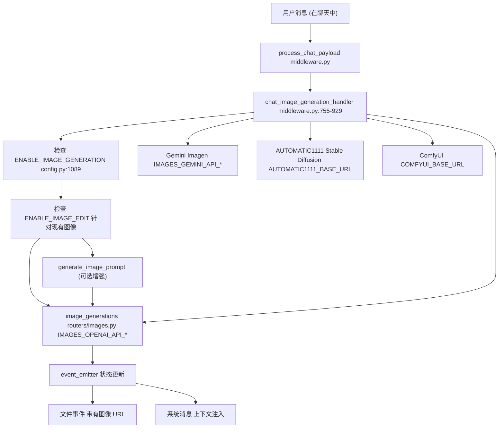
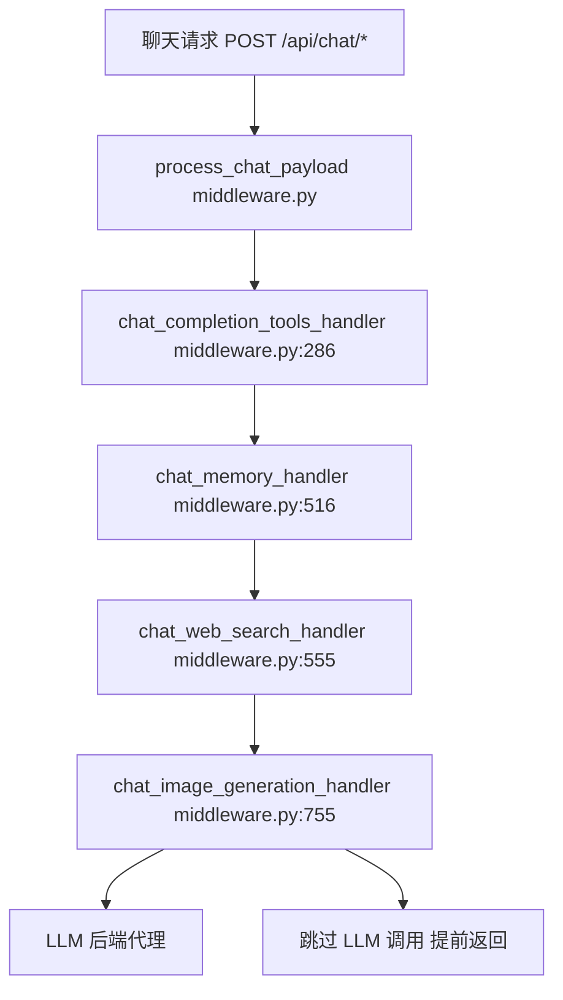
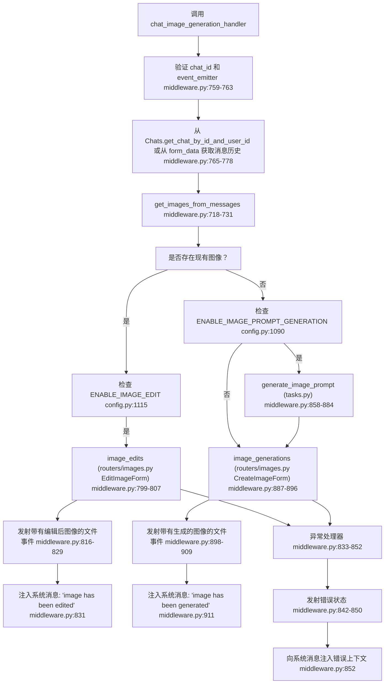
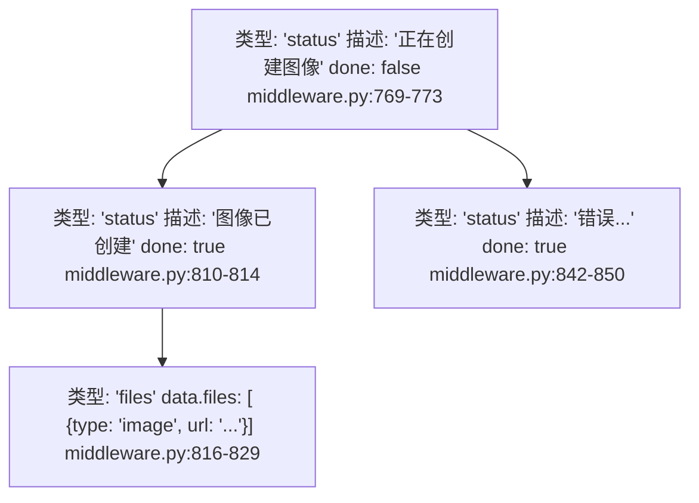
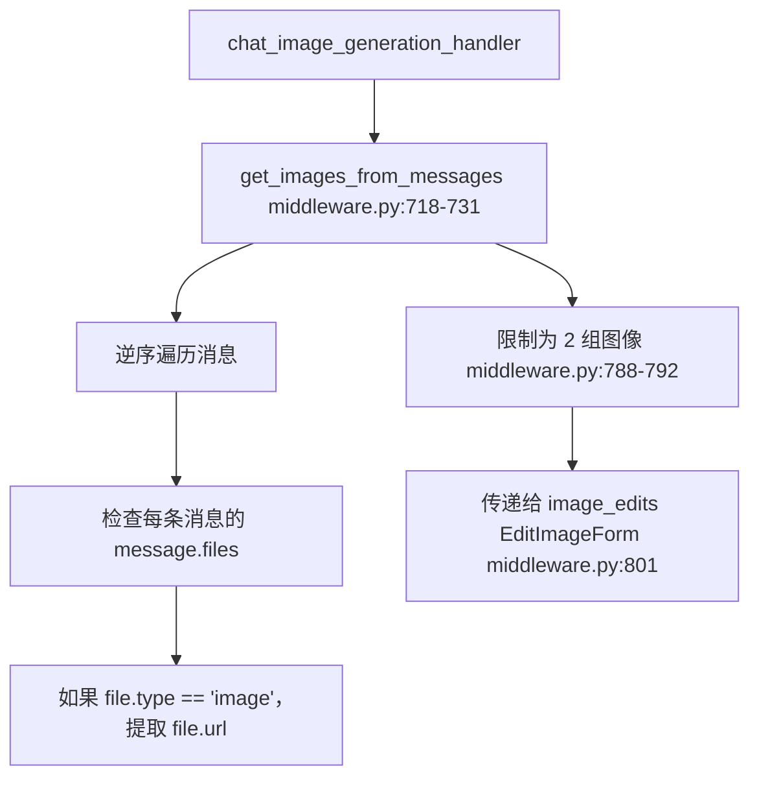
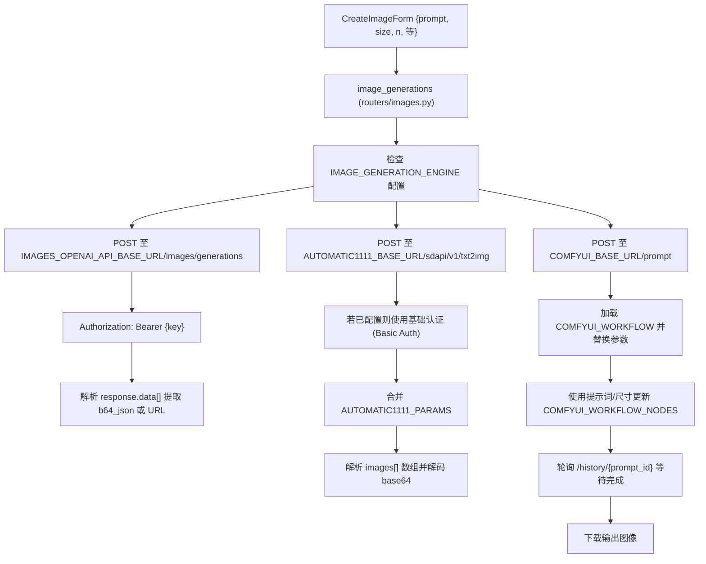
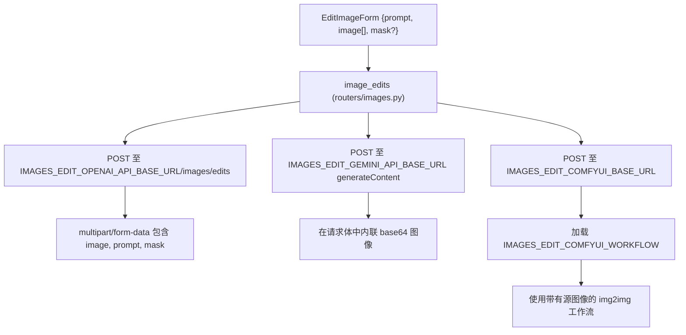
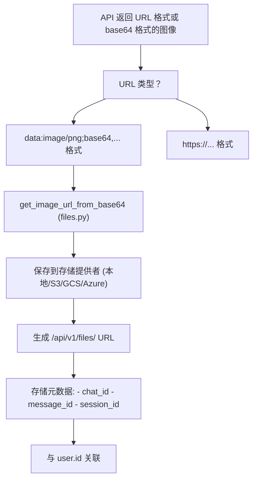
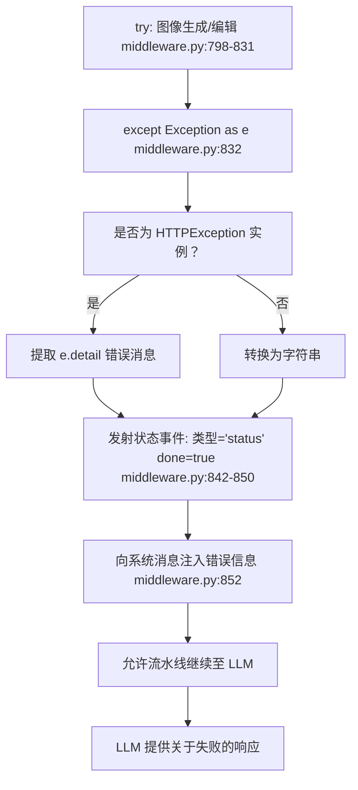

# 图像生成集成

相关源文件

-   [backend/open\_webui/config.py](https://github.com/open-webui/open-webui/blob/a7271532/backend/open_webui/config.py)
-   [backend/open\_webui/main.py](https://github.com/open-webui/open-webui/blob/a7271532/backend/open_webui/main.py)
-   [backend/open\_webui/retrieval/loaders/datalab\_marker.py](https://github.com/open-webui/open-webui/blob/a7271532/backend/open_webui/retrieval/loaders/datalab_marker.py)
-   [backend/open\_webui/retrieval/loaders/external\_document.py](https://github.com/open-webui/open-webui/blob/a7271532/backend/open_webui/retrieval/loaders/external_document.py)
-   [backend/open\_webui/retrieval/loaders/external\_web.py](https://github.com/open-webui/open-webui/blob/a7271532/backend/open_webui/retrieval/loaders/external_web.py)
-   [backend/open\_webui/retrieval/loaders/main.py](https://github.com/open-webui/open-webui/blob/a7271532/backend/open_webui/retrieval/loaders/main.py)
-   [backend/open\_webui/retrieval/loaders/mineru.py](https://github.com/open-webui/open-webui/blob/a7271532/backend/open_webui/retrieval/loaders/mineru.py)
-   [backend/open\_webui/retrieval/loaders/mistral.py](https://github.com/open-webui/open-webui/blob/a7271532/backend/open_webui/retrieval/loaders/mistral.py)
-   [backend/open\_webui/retrieval/utils.py](https://github.com/open-webui/open-webui/blob/a7271532/backend/open_webui/retrieval/utils.py)
-   [backend/open\_webui/routers/retrieval.py](https://github.com/open-webui/open-webui/blob/a7271532/backend/open_webui/routers/retrieval.py)
-   [backend/open\_webui/utils/middleware.py](https://github.com/open-webui/open-webui/blob/a7271532/backend/open_webui/utils/middleware.py)
-   [src/lib/apis/retrieval/index.ts](https://github.com/open-webui/open-webui/blob/a7271532/src/lib/apis/retrieval/index.ts)
-   [src/lib/components/admin/Settings/Documents.svelte](https://github.com/open-webui/open-webui/blob/a7271532/src/lib/components/admin/Settings/Documents.svelte)
-   [src/lib/components/admin/Settings/WebSearch.svelte](https://github.com/open-webui/open-webui/blob/a7271532/src/lib/components/admin/Settings/WebSearch.svelte)

图像生成集成系统在聊天界面中提供自动化的图像创建和编辑功能。启用后，系统会拦截用户生成或编辑图像的请求，通过配置的后端引擎（DALL-E、Stable Diffusion、Gemini、ComfyUI）进行处理，并在对话中内联显示结果。

有关联网搜索集成，请参阅 [联网搜索集成](/open-webui/open-webui/6.5-web-search-integration)。有关工具执行，请参阅 [工具执行系统](/open-webui/open-webui/6.3-tool-execution-system)。

## 系统架构

图像生成系统作为聊天处理流水线中的中间件处理器运行，在请求到达 LLM 之前对其进行拦截，并完成生成的图像。


**来源：** [backend/open\_webui/utils/middleware.py755-929](https://github.com/open-webui/open-webui/blob/a7271532/backend/open_webui/utils/middleware.py#L755-L929) [backend/open\_webui/main.py1088-1124](https://github.com/open-webui/open-webui/blob/a7271532/backend/open_webui/main.py#L1088-L1124) [backend/open\_webui/config.py](https://github.com/open-webui/open-webui/blob/a7271532/backend/open_webui/config.py)

## 配置系统

图像生成通过环境变量或持久化配置进行设置，支持四种不同的后端引擎，并为生成和编辑提供独立的配置。

### 生成配置

| 配置键 | 类型 | 用途 |
| --- | --- | --- |
| `ENABLE_IMAGE_GENERATION` | Boolean | 图像生成的主开关 |
| `ENABLE_IMAGE_PROMPT_GENERATION` | Boolean | 使用 LLM 增强图像提示词 |
| `IMAGE_GENERATION_ENGINE` | String | 后端：`openai`, `gemini`, `automatic1111`, `comfyui` |
| `IMAGE_GENERATION_MODEL` | String | 选定引擎的模型标识符 |
| `IMAGE_SIZE` | String | 默认图像尺寸 (例如 `1024x1024`) |
| `IMAGE_STEPS` | Integer | 推理步数 (针对扩散模型) |

### 引擎特定配置


**来源：** [backend/open\_webui/main.py146-180](https://github.com/open-webui/open-webui/blob/a7271532/backend/open_webui/main.py#L146-L180) [backend/open\_webui/config.py1088-1124](https://github.com/open-webui/open-webui/blob/a7271532/backend/open_webui/config.py#L1088-L1124)

### 编辑配置

系统为图像编辑操作维护独立的配置，这些配置在聊天包含现有图像时应用：

| 配置键 | 用途 |
| --- | --- |
| `ENABLE_IMAGE_EDIT` | 启用图像编辑功能 |
| `IMAGE_EDIT_ENGINE` | 编辑使用的后端引擎 (选项与生成相同) |
| `IMAGE_EDIT_MODEL` | 编辑使用的模型标识符 |
| `IMAGE_EDIT_SIZE` | 编辑后图像的输出尺寸 |
| `IMAGES_EDIT_OPENAI_API_BASE_URL` | OpenAI 编辑端点 |
| `IMAGES_EDIT_GEMINI_API_BASE_URL` | Gemini 编辑端点 |
| `IMAGES_EDIT_COMFYUI_BASE_URL` | ComfyUI 编辑端点 |

**来源：** [backend/open\_webui/main.py167-179](https://github.com/open-webui/open-webui/blob/a7271532/backend/open_webui/main.py#L167-L179) [backend/open\_webui/config.py1115-1124](https://github.com/open-webui/open-webui/blob/a7271532/backend/open_webui/config.py#L1115-L1124)

## 中间件处理器集成

`chat_image_generation_handler` 函数作为中间件组件集成到聊天处理流水线中，拦截请求并使用生成的图像来响应。

### 处理器注册


**来源：** [backend/open\_webui/utils/middleware.py755-929](https://github.com/open-webui/open-webui/blob/a7271532/backend/open_webui/utils/middleware.py#L755-L929) [backend/open\_webui/utils/middleware.py494](https://github.com/open-webui/open-webui/blob/a7271532/backend/open_webui/utils/middleware.py#L494-L494)

### 处理器执行流程

处理器遵循多阶段流程来决定是生成图像还是编辑图像：


**来源：** [backend/open\_webui/utils/middleware.py755-929](https://github.com/open-webui/open-webui/blob/a7271532/backend/open_webui/utils/middleware.py#L755-L929)

## 提示词增强系统

当 `ENABLE_IMAGE_PROMPT_GENERATION` 启用时，系统使用 LLM 在生成图像之前增强用户提示词，从而提高输出质量。

### 增强过程

增强过程提取用户的意图，并将其扩展为图像生成模型更详细、更有效的提示词：

1.  **提取用户消息** - 从对话历史中获取最后一条用户消息 [middleware.py780](https://github.com/open-webui/open-webui/blob/a7271532/backend/open_webui/utils/middleware.py#L780-L780)。
2.  **调用 LLM 任务端点** - 使用当前聊天上下文调用 `generate_image_prompt` [middleware.py858-865](https://github.com/open-webui/open-webui/blob/a7271532/backend/open_webui/utils/middleware.py#L858-L865)。
3.  **解析 JSON 响应** - 从结构化输出中提取增强后的提示词 [middleware.py867-880](https://github.com/open-webui/open-webui/blob/a7271532/backend/open_webui/utils/middleware.py#L867-L880)。
4.  **出错时的回退处理** - 如果增强失败，则使用原始用户消息 [middleware.py882-884](https://github.com/open-webui/open-webui/blob/a7271532/backend/open_webui/utils/middleware.py#L882-L884)。

增强过程使用配置的 `TASK_MODEL` 以及 `IMAGE_PROMPT_GENERATION_PROMPT_TEMPLATE` 中定义的专门提示词模板。

**来源：** [backend/open\_webui/utils/middleware.py856-885](https://github.com/open-webui/open-webui/blob/a7271532/backend/open_webui/utils/middleware.py#L856-L885) [backend/open\_webui/main.py432](https://github.com/open-webui/open-webui/blob/a7271532/backend/open_webui/main.py#L432-L432)

## 事件发射协议

处理器通过 WebSocket 事件系统沟通进度和结果，向前端发送结构化事件以实现实时 UI 更新。

### 事件类型


**来源：** [backend/open\_webui/utils/middleware.py769-850](https://github.com/open-webui/open-webui/blob/a7271532/backend/open_webui/utils/middleware.py#L769-L850)

### 系统消息上下文注入

成功生成或编辑图像后，处理器会向聊天的系统消息中注入一条上下文消息，告知 LLM 已生成的图像：

**成功时的上下文：**

```text
<context>请求的图像已被编辑并创建，现在正展示给用户。请告知用户图像已生成。</context>
```
[middleware.py831](https://github.com/open-webui/open-webui/blob/a7271532/backend/open_webui/utils/middleware.py#L831-L831)

**出错时的上下文：**

```text
<context>尝试生成图像但失败了。系统目前无法生成图像。告诉用户发生了以下错误：{error_message}</context>
```
[middleware.py852](https://github.com/open-webui/open-webui/blob/a7271532/backend/open_webui/utils/middleware.py#L852-L852)

这使得 LLM 能够提供适当的对话回应，承认图像操作。

**来源：** [backend/open\_webui/utils/middleware.py831](https://github.com/open-webui/open-webui/blob/a7271532/backend/open_webui/utils/middleware.py#L831-L831) [backend/open\_webui/utils/middleware.py852](https://github.com/open-webui/open-webui/blob/a7271532/backend/open_webui/utils/middleware.py#L852-L852)

## 从消息中提取图像

系统会向后搜索消息历史，查找附加在先前消息中的图像，支持最多 2 组图像用于编辑操作。


**来源：** [backend/open\_webui/utils/middleware.py718-731](https://github.com/open-webui/open-webui/blob/a7271532/backend/open_webui/utils/middleware.py#L718-L731) [backend/open\_webui/utils/middleware.py783-792](https://github.com/open-webui/open-webui/blob/a7271532/backend/open_webui/utils/middleware.py#L783-L792)

## 后端引擎路由

图像生成和编辑请求将根据配置的 `IMAGE_GENERATION_ENGINE` 或 `IMAGE_EDIT_ENGINE` 路由到相应的后端。每个引擎都有自己的 API 契约和能力。

### 生成路由

`routers/images.py` 中的 `image_generations` 函数处理向已配置生成引擎的路由：


**来源：** [backend/open\_webui/routers/images.py](https://github.com/open-webui/open-webui/blob/a7271532/backend/open_webui/routers/images.py) (在导入中引用)， [backend/open\_webui/main.py1088-1112](https://github.com/open-webui/open-webui/blob/a7271532/backend/open_webui/main.py#L1088-L1112)

### 编辑路由

`image_edits` 函数使用类似的路由逻辑处理图像编辑操作：


**来源：** [backend/open\_webui/utils/middleware.py799-807](https://github.com/open-webui/open-webui/blob/a7271532/backend/open_webui/utils/middleware.py#L799-L807) [backend/open\_webui/main.py1115-1124](https://github.com/open-webui/open-webui/blob/a7271532/backend/open_webui/main.py#L1115-L1124)

## 图像 URL 管理

生成的图像以 URL 形式返回，既可以是外部 API URL，也可以是 base64 data URL。系统通过文件管理系统处理转换和存储。

### URL 处理流程


当图像从 base64 转换时，系统调用 `get_image_url_from_base64`，该函数执行以下操作：

1.  从 data URL 提取 base64 数据。
2.  在数据库中创建文件条目。
3.  将二进制内容保存到配置的存储提供者中。
4.  返回 `/api/v1/files/<file_id>` URL。

**来源：** [backend/open\_webui/utils/middleware.py748](https://github.com/open-webui/open-webui/blob/a7271532/backend/open_webui/utils/middleware.py#L748-L748) [backend/open\_webui/utils/files.py](https://github.com/open-webui/open-webui/blob/a7271532/backend/open_webui/utils/files.py) (在导入中引用)

## 与聊天补全的集成

图像生成处理器修改请求负载和响应，以无缝集成到聊天补全流程中。

### 请求修改

成功生成图像后，处理器：

1.  **将文件添加到元数据** - 在 `form_data['metadata']['files']` 中存储图像 URL 以进行持久化 [middleware.py645-673](https://github.com/open-webui/open-webui/blob/a7271532/backend/open_webui/utils/middleware.py#L645-L673)。
2.  **注入系统消息** - 添加关于已生成图像的上下文，帮助 LLM 做出适当响应 [middleware.py831](https://github.com/open-webui/open-webui/blob/a7271532/backend/open_webui/utils/middleware.py#L831-L831)。
3.  **返回修改后的 form\_data** - 允许聊天流水线携带增强后的请求继续执行。

### 响应旁路 (Response Bypass)

当图像生成成功时，处理器实际上通过以下方式绕过了 LLM 调用：

1.  直接向前端发射图像文件事件。
2.  在系统消息中提供上下文供 LLM 确认。
3.  允许正常的聊天补全以极低的 Token 消耗继续进行。

LLM 收到指示图像已生成的系统消息，并可以在不查看实际图像的情况下提供对话式确认。

**来源：** [backend/open\_webui/utils/middleware.py755-929](https://github.com/open-webui/open-webui/blob/a7271532/backend/open_webui/utils/middleware.py#L755-L929)

## 错误处理与恢复

系统在多个级别实现了全面的错误处理，以确保优雅降级。

### 处理器级错误处理


### 后端特定错误

每个后端引擎可能返回不同的错误类型：

| 引擎 | 常见错误 | 处理方式 |
| --- | --- | --- |
| OpenAI | API 密钥无效、速率限制、NSFW 内容过滤 | 从 `response.json()['error']['message']` 提取 |
| AUTOMATIC1111 | 连接被拒绝、模型未加载 | HTTP 连接错误、超时 |
| ComfyUI | 工作流无效、节点缺失、工作流执行失败 | 轮询状态以获取错误信息 |
| Gemini | 安全过滤器、配额超出 | 解析 API 错误响应 |

**来源：** [backend/open\_webui/utils/middleware.py832-852](https://github.com/open-webui/open-webui/blob/a7271532/backend/open_webui/utils/middleware.py#L832-L852)

## 配置持久化

图像生成配置通过 `AppConfig` 系统进行管理，并使用 Redis 支持的同步机制用于分布式部署。

### 配置更新

当通过管理 UI 修改图像生成设置时：

1.  配置写入 `app.state.config.IMAGE_GENERATION_ENGINE` 等 [main.py1088-1112](https://github.com/open-webui/open-webui/blob/a7271532/backend/open_webui/main.py#L1088-L1112)。
2.  `AppConfig.__setattr__` 触发数据库保存 [config.py251-260](https://github.com/open-webui/open-webui/blob/a7271532/backend/open_webui/config.py#L251-L260)。
3.  更新 Redis 键 `{prefix}:config:IMAGE_GENERATION_ENGINE` 以进行跨实例同步 [config.py259-260](https://github.com/open-webui/open-webui/blob/a7271532/backend/open_webui/config.py#L259-L260)。
4.  其他实例在下次访问配置时从 Redis 读取 [config.py267-283](https://github.com/open-webui/open-webui/blob/a7271532/backend/open_webui/config.py#L267-L283)。

这确保了在水平扩展部署中，配置更改能传播到所有后端实例。

**来源：** [backend/open\_webui/config.py224-284](https://github.com/open-webui/open-webui/blob/a7271532/backend/open_webui/config.py#L224-L284) [backend/open\_webui/main.py1088-1124](https://github.com/open-webui/open-webui/blob/a7271532/backend/open_webui/main.py#L1088-L1124)
