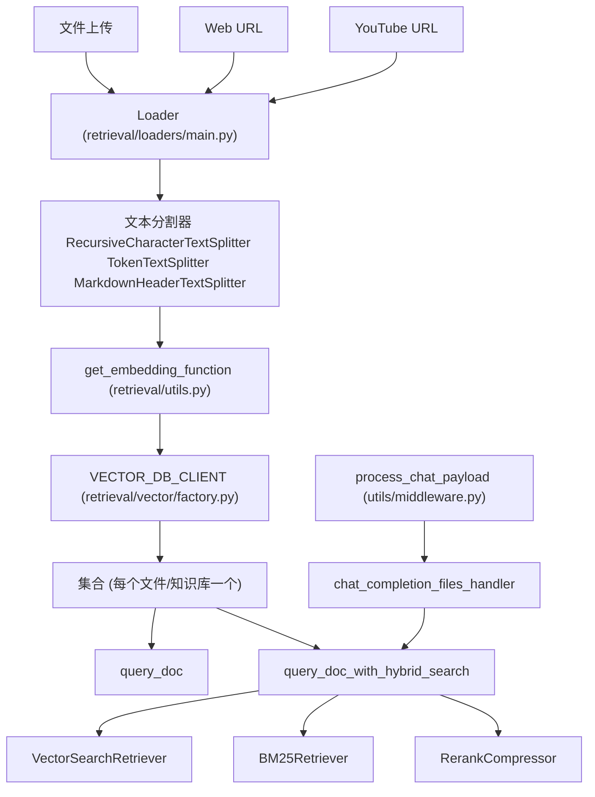
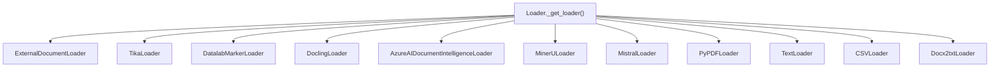
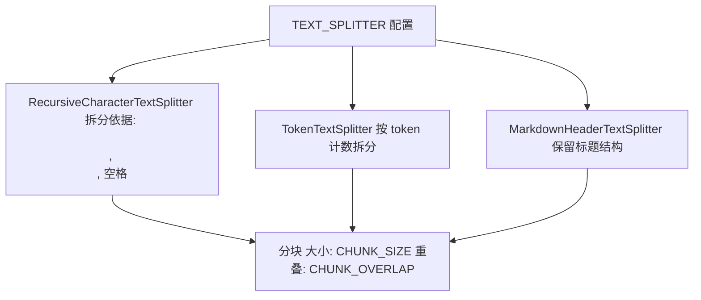
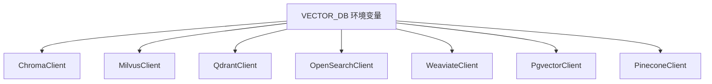
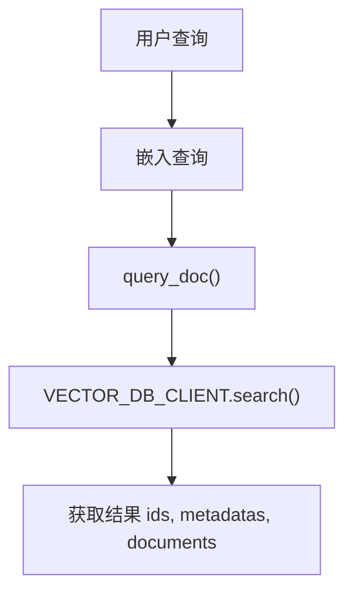
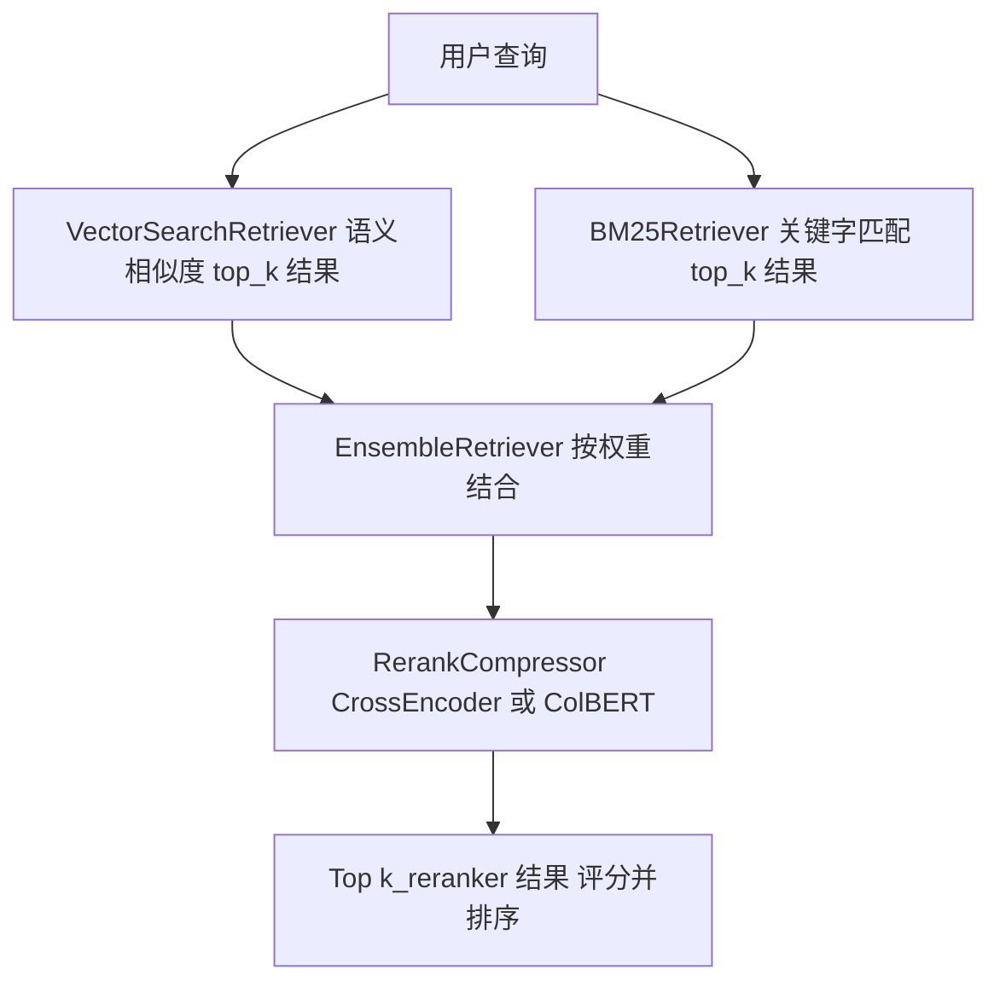
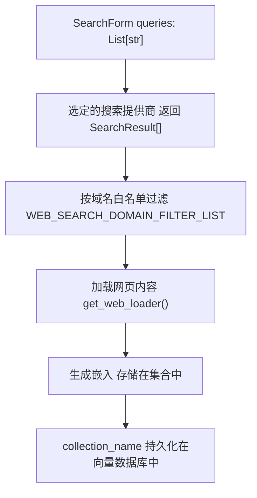
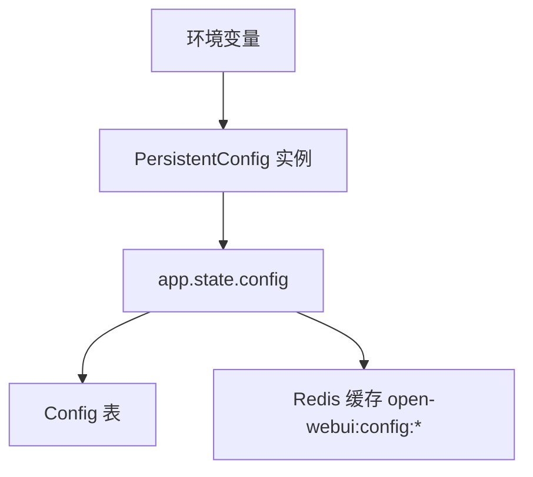
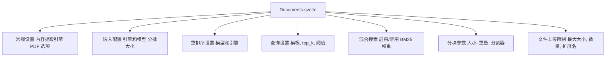

# RAG 和知识系统

相关源文件

-   [backend/open_webui/config.py](https://github.com/open-webui/open-webui/blob/a7271532/backend/open_webui/config.py)
-   [backend/open_webui/main.py](https://github.com/open-webui/open-webui/blob/a7271532/backend/open_webui/main.py)
-   [backend/open_webui/retrieval/loaders/datalab_marker.py](https://github.com/open-webui/open-webui/blob/a7271532/backend/open_webui/retrieval/loaders/datalab_marker.py)
-   [backend/open_webui/retrieval/loaders/external_document.py](https://github.com/open-webui/open-webui/blob/a7271532/backend/open_webui/retrieval/loaders/external_document.py)
-   [backend/open_webui/retrieval/loaders/external_web.py](https://github.com/open-webui/open-webui/blob/a7271532/backend/open_webui/retrieval/loaders/external_web.py)
-   [backend/open_webui/retrieval/loaders/main.py](https://github.com/open-webui/open-webui/blob/a7271532/backend/open_webui/retrieval/loaders/main.py)
-   [backend/open_webui/retrieval/loaders/mineru.py](https://github.com/open-webui/open-webui/blob/a7271532/backend/open_webui/retrieval/loaders/mineru.py)
-   [backend/open_webui/retrieval/loaders/mistral.py](https://github.com/open-webui/open-webui/blob/a7271532/backend/open_webui/retrieval/loaders/mistral.py)
-   [backend/open_webui/retrieval/utils.py](https://github.com/open-webui/open-webui/blob/a7271532/backend/open_webui/retrieval/utils.py)
-   [backend/open_webui/routers/retrieval.py](https://github.com/open-webui/open-webui/blob/a7271532/backend/open_webui/routers/retrieval.py)
-   [backend/open_webui/utils/middleware.py](https://github.com/open-webui/open-webui/blob/a7271532/backend/open_webui/utils/middleware.py)
-   [src/lib/apis/retrieval/index.ts](https://github.com/open-webui/open-webui/blob/a7271532/src/lib/apis/retrieval/index.ts)
-   [src/lib/components/admin/Settings/Documents.svelte](https://github.com/open-webui/open-webui/blob/a7271532/src/lib/components/admin/Settings/Documents.svelte)
-   [src/lib/components/admin/Settings/WebSearch.svelte](https://github.com/open-webui/open-webui/blob/a7271532/src/lib/components/admin/Settings/WebSearch.svelte)

## 目的和范围

本文档描述了 Open WebUI 的检索增强生成 (RAG) 和知识系统，该系统使应用程序能够利用来自文档、Web 搜索和知识库的相关上下文来增强 LLM 的响应。该系统处理文档摄取、嵌入生成、向量存储和检索操作。

有关 RAG 上下文如何注入聊天请求的信息，请参阅[后端处理管道](/open-webui/open-webui/5-message-rendering)。有关 Web 搜索特定的配置，请参阅本页的 6.4 小节。有关文件上传和存储机制，请参阅[存储和文件管理](/open-webui/open-webui/12-storage-and-file-management)。

## 系统架构

RAG 系统由四个主要子系统组成：

1.  **文档处理管道 (Document Processing Pipeline)**：从各种文件格式中提取文本
2.  **嵌入和向量存储 (Embedding and Vector Storage)**：生成嵌入并将其存储在向量数据库中
3.  **检索引擎 (Retrieval Engine)**：使用混合搜索和重排序查询向量库
4.  **Web 搜索集成 (Web Search Integration)**：获取并处理 Web 内容


**来源**：[backend/open_webui/retrieval/loaders/main.py](https://github.com/open-webui/open-webui/blob/a7271532/backend/open_webui/retrieval/loaders/main.py) [backend/open_webui/retrieval/utils.py1-900](https://github.com/open-webui/open-webui/blob/a7271532/backend/open_webui/retrieval/utils.py#L1-L900) [backend/open_webui/utils/middleware.py900-1100](https://github.com/open-webui/open-webui/blob/a7271532/backend/open_webui/utils/middleware.py#L900-L1100)

## 文档处理管道

### 加载器选择和工厂模式

`Loader` 类 [backend/open_webui/retrieval/loaders/main.py187-205](https://github.com/open-webui/open-webui/blob/a7271532/backend/open_webui/retrieval/loaders/main.py#L187-L205) 作为一个工厂，根据配置的 `CONTENT_EXTRACTION_ENGINE` 和文件类型选择合适的文档加载器。


**来源**：[backend/open_webui/retrieval/loaders/main.py214-370](https://github.com/open-webui/open-webui/blob/a7271532/backend/open_webui/retrieval/loaders/main.py#L214-L370)

### 内容提取引擎

每个提取引擎都通过环境变量和 `AppConfig` 进行配置 [backend/open_webui/main.py853-882](https://github.com/open-webui/open-webui/blob/a7271532/backend/open_webui/main.py#L853-L882)：

| 引擎 | 配置变量 | 支持的格式 | 实现 |
| --- | --- | --- | --- |
| **默认 (Default)** | `PDF_EXTRACT_IMAGES` | PDF, text, CSV, DOCX, PPTX 等 | PyPDFLoader, TextLoader, 各种 Langchain 加载器 |
| **外部 (External)** | `EXTERNAL_DOCUMENT_LOADER_URL`
`EXTERNAL_DOCUMENT_LOADER_API_KEY` | 任意 (委托给外部服务) | [backend/open_webui/retrieval/loaders/external_document.py](https://github.com/open-webui/open-webui/blob/a7271532/backend/open_webui/retrieval/loaders/external_document.py) |
| **Tika** | `TIKA_SERVER_URL` | 所有 Apache Tika 格式 | [backend/open_webui/retrieval/loaders/main.py93-132](https://github.com/open-webui/open-webui/blob/a7271532/backend/open_webui/retrieval/loaders/main.py#L93-L132) |
| **Datalab Marker** | `DATALAB_MARKER_API_KEY`
`DATALAB_MARKER_API_BASE_URL`
`DATALAB_MARKER_USE_LLM` | PDF, Office 文档, 图像 | [backend/open_webui/retrieval/loaders/datalab_marker.py](https://github.com/open-webui/open-webui/blob/a7271532/backend/open_webui/retrieval/loaders/datalab_marker.py) |
| **Docling** | `DOCLING_SERVER_URL`
`DOCLING_API_KEY`
`DOCLING_PARAMS` | PDF, Office 文档 | [backend/open_webui/retrieval/loaders/main.py134-185](https://github.com/open-webui/open-webui/blob/a7271532/backend/open_webui/retrieval/loaders/main.py#L134-L185) |
| **MinerU** | `MINERU_API_MODE`
`MINERU_API_URL`
`MINERU_API_KEY` | PDF | [backend/open_webui/retrieval/loaders/mineru.py](https://github.com/open-webui/open-webui/blob/a7271532/backend/open_webui/retrieval/loaders/mineru.py) |
| **Azure Document Intelligence** | `DOCUMENT_INTELLIGENCE_ENDPOINT`
`DOCUMENT_INTELLIGENCE_KEY` | PDF, DOCX, PPTX | AzureAIDocumentIntelligenceLoader |
| **Mistral OCR** | `MISTRAL_OCR_API_BASE_URL`
`MISTRAL_OCR_API_KEY` | PDF, 图像 | [backend/open_webui/retrieval/loaders/mistral.py](https://github.com/open-webui/open-webui/blob/a7271532/backend/open_webui/retrieval/loaders/mistral.py) |

**来源**：[backend/open_webui/retrieval/loaders/main.py187-370](https://github.com/open-webui/open-webui/blob/a7271532/backend/open_webui/retrieval/loaders/main.py#L187-L370) [backend/open_webui/config.py853-882](https://github.com/open-webui/open-webui/blob/a7271532/backend/open_webui/config.py#L853-L882)

#### Datalab Marker API 集成

`DatalabMarkerLoader` [backend/open_webui/retrieval/loaders/datalab_marker.py13-254](https://github.com/open-webui/open-webui/blob/a7271532/backend/open_webui/retrieval/loaders/datalab_marker.py#L13-L254) 同时支持云端 (DataLab API) 和自托管的 Marker 部署：

1.  **请求提交**：通过 POST 将文件和配置参数发送到 `{api_base_url}` [backend/open_webui/retrieval/loaders/datalab_marker.py111-135](https://github.com/open-webui/open-webui/blob/a7271532/backend/open_webui/retrieval/loaders/datalab_marker.py#L111-L135)
2.  **轮询 (云端模式)**：如果返回 `request_check_url`，则轮询直到状态为 "complete" [backend/open_webui/retrieval/loaders/datalab_marker.py147-198](https://github.com/open-webui/open-webui/blob/a7271532/backend/open_webui/retrieval/loaders/datalab_marker.py#L147-L198)
3.  **直接响应 (自托管模式)**：如果存在 `output` 字段，则立即使用 [backend/open_webui/retrieval/loaders/datalab_marker.py212-226](https://github.com/open-webui/open-webui/blob/a7271532/backend/open_webui/retrieval/loaders/datalab_marker.py#L212-L226)

配置选项包括：

-   `use_llm`：使用 LLM 增强表格和表单的准确性
-   `force_ocr`：对所有页面强制执行 OCR
-   `paginate`：使用水平线分隔页面
-   `output_format`：`markdown`、`json` 或 `html`

**来源**：[backend/open_webui/retrieval/loaders/datalab_marker.py13-254](https://github.com/open-webui/open-webui/blob/a7271532/backend/open_webui/retrieval/loaders/datalab_marker.py#L13-L254)

### 文本分割 (Text Splitting)

提取后，文档将使用可配置的文本分割器拆分为块 [backend/open_webui/routers/retrieval.py31-33](https://github.com/open-webui/open-webui/blob/a7271532/backend/open_webui/routers/retrieval.py#L31-L33)：


配置：

-   `RAG_TEXT_SPLITTER`: 分割器类型 (`""`, `"token"`, 或 `"markdown"`)
-   `CHUNK_SIZE`: 默认 1500 个字符 [backend/open_webui/config.py886](https://github.com/open-webui/open-webui/blob/a7271532/backend/open_webui/config.py#L886-L886)
-   `CHUNK_OVERLAP`: 默认 100 个字符 [backend/open_webui/config.py887](https://github.com/open-webui/open-webui/blob/a7271532/backend/open_webui/config.py#L887-L887)
-   `TIKTOKEN_ENCODING_NAME`: 基于 token 拆分时的编码方式

**来源**：[backend/open_webui/routers/retrieval.py31-33](https://github.com/open-webui/open-webui/blob/a7271532/backend/open_webui/routers/retrieval.py#L31-L33) [backend/open_webui/config.py886-887](https://github.com/open-webui/open-webui/blob/a7271532/backend/open_webui/config.py#L886-L887)

## 嵌入生成 (Embedding Generation)

### 嵌入函数架构

`get_embedding_function()` [backend/open_webui/retrieval/utils.py480-600](https://github.com/open-webui/open-webui/blob/a7271532/backend/open_webui/retrieval/utils.py#L480-L600) 返回一个可调用对象，用于根据配置的引擎生成嵌入：

**来源**：[backend/open_webui/retrieval/utils.py480-600](https://github.com/open-webui/open-webui/blob/a7271532/backend/open_webui/retrieval/utils.py#L480-L600)

### 嵌入引擎配置

嵌入配置通过 `/embedding` 端点 [backend/open_webui/routers/retrieval.py255-277](https://github.com/open-webui/open-webui/blob/a7271532/backend/open_webui/routers/retrieval.py#L255-L277) 进行管理，并通过 `/embedding/update` [backend/open_webui/routers/retrieval.py320-432](https://github.com/open-webui/open-webui/blob/a7271532/backend/open_webui/routers/retrieval.py#L320-L432) 进行更新：

| 引擎 | 模型规范 | API 配置 |
| --- | --- | --- |
| **本地 (Local)** (`""`) | HuggingFace 模型名称/路径 | N/A - 通过 `SentenceTransformer` 加载 |
| **OpenAI** | 模型 ID (例如 `text-embedding-3-small`) | `RAG_OPENAI_API_BASE_URL`
`RAG_OPENAI_API_KEY` |
| **Ollama** | 模型名称 (例如 `nomic-embed-text`) | `RAG_OLLAMA_BASE_URL`
`RAG_OLLAMA_API_KEY` |
| **Azure OpenAI** | 部署名称 | `RAG_AZURE_OPENAI_BASE_URL`
`RAG_AZURE_OPENAI_API_KEY`
`RAG_AZURE_OPENAI_API_VERSION` |

其他参数：

-   `RAG_EMBEDDING_BATCH_SIZE`：每次 API 调用中嵌入的文本数量（默认值：1）
-   `ENABLE_ASYNC_EMBEDDING`：启用并发嵌入生成 [backend/open_webui/routers/retrieval.py262](https://github.com/open-webui/open-webui/blob/a7271532/backend/open_webui/routers/retrieval.py#L262-L262)

**来源**：[backend/open_webui/routers/retrieval.py255-432](https://github.com/open-webui/open-webui/blob/a7271532/backend/open_webui/routers/retrieval.py#L255-L432) [backend/open_webui/config.py889-910](https://github.com/open-webui/open-webui/blob/a7271532/backend/open_webui/config.py#L889-L910)

### 本地嵌入实现

对于本地嵌入，系统会初始化一个 `SentenceTransformer` 实例 [backend/open_webui/routers/retrieval.py123-143](https://github.com/open-webui/open-webui/blob/a7271532/backend/open_webui/routers/retrieval.py#L123-L143)：

```
# get_ef() 的简化版
ef = SentenceTransformer(
    get_model_path(embedding_model, auto_update),
    device=DEVICE_TYPE,
    trust_remote_code=RAG_EMBEDDING_MODEL_TRUST_REMOTE_CODE,
    backend=SENTENCE_TRANSFORMERS_BACKEND,
    model_kwargs=SENTENCE_TRANSFORMERS_MODEL_KWARGS,
)
```
该模型缓存在 `app.state.ef` [backend/open_webui/main.py986-1003](https://github.com/open-webui/open-webui/blob/a7271532/backend/open_webui/main.py#L986-L1003) 中，可以被卸载以释放 GPU 内存 [backend/open_webui/routers/retrieval.py305-318](https://github.com/open-webui/open-webui/blob/a7271532/backend/open_webui/routers/retrieval.py#L305-L318)

**来源**：[backend/open_webui/routers/retrieval.py123-143](https://github.com/open-webui/open-webui/blob/a7271532/backend/open_webui/routers/retrieval.py#L123-L143) [backend/open_webui/main.py986-1003](https://github.com/open-webui/open-webui/blob/a7271532/backend/open_webui/main.py#L986-L1003)

### 嵌入前缀 (Embedding Prefixes)

系统支持内容和查询前缀，以改善检索效果 [backend/open_webui/config.py1852-1867](https://github.com/open-webui/open-webui/blob/a7271532/backend/open_webui/config.py#L1852-L1867)：

-   `RAG_EMBEDDING_CONTENT_PREFIX`：在索引期间前置到文档块
-   `RAG_EMBEDDING_QUERY_PREFIX`：在搜索期间前置到查询

这些前缀在 `query_collection()` [backend/open_webui/retrieval/utils.py427-429](https://github.com/open-webui/open-webui/blob/a7271532/backend/open_webui/retrieval/utils.py#L427-L429) 和文档索引期间应用。

**来源**：[backend/open_webui/config.py1852-1867](https://github.com/open-webui/open-webui/blob/a7271532/backend/open_webui/config.py#L1852-L1867) [backend/open_webui/retrieval/utils.py427-429](https://github.com/open-webui/open-webui/blob/a7271532/backend/open_webui/retrieval/utils.py#L427-L429)

## 向量存储

### 向量数据库客户端工厂

`VECTOR_DB_CLIENT` 单例 [backend/open_webui/retrieval/vector/factory.py](https://github.com/open-webui/open-webui/blob/a7271532/backend/open_webui/retrieval/vector/factory.py) 根据 `VECTOR_DB` 环境变量进行初始化：


每个客户端都实现了一个通用接口，包含以下方法：

-   `search(collection_name, vectors, limit)`：向量相似度搜索
-   `get(collection_name)`：从集合中检索所有项
-   `insert(collection_name, items)`：添加带有嵌入的文档
-   `upsert(collection_name, items)`：更新或插入文档
-   `delete(collection_name, ids)`：移除特定文档
-   `reset()`：清除所有集合

**来源**：[backend/open_webui/retrieval/vector/factory.py](https://github.com/open-webui/open-webui/blob/a7271532/backend/open_webui/retrieval/vector/factory.py) [backend/open_webui/config.py1830-1850](https://github.com/open-webui/open-webui/blob/a7271532/backend/open_webui/config.py#L1830-L1850)

### 集合管理 (Collection Management)

集合由唯一名称标识，通常是文件 ID 或知识库 ID。`Files` 模型 [backend/open_webui/models/files.py](https://github.com/open-webui/open-webui/blob/a7271532/backend/open_webui/models/files.py) 为每个上传的文件存储 `meta.collection_name`。

操作：

1.  **文档插入**：`VECTOR_DB_CLIENT.insert()` 添加分块及其嵌入
2.  **查询**：`query_doc()` 对集合执行向量搜索 [backend/open_webui/retrieval/utils.py135-153](https://github.com/open-webui/open-webui/blob/a7271532/backend/open_webui/retrieval/utils.py#L135-L153)
3.  **检索**：`get_doc()` 获取所有项而不进行过滤 [backend/open_webui/retrieval/utils.py155-167](https://github.com/open-webui/open-webui/blob/a7271532/backend/open_webui/retrieval/utils.py#L155-L167)
4.  **删除**：文件被移除时，对应的集合也会被删除

**来源**：[backend/open_webui/retrieval/utils.py135-167](https://github.com/open-webui/open-webui/blob/a7271532/backend/open_webui/retrieval/utils.py#L135-L167) [backend/open_webui/models/files.py](https://github.com/open-webui/open-webui/blob/a7271532/backend/open_webui/models/files.py)

## 检索策略

### 向量搜索

基础向量搜索实现 [backend/open_webui/retrieval/utils.py135-153](https://github.com/open-webui/open-webui/blob/a7271532/backend/open_webui/retrieval/utils.py#L135-L153)：


参数：

-   `collection_name`：目标集合
-   `query_embedding`：查询向量
-   `k`：结果数量 (`RAG_TOP_K`，默认 4)

**来源**：[backend/open_webui/retrieval/utils.py135-153](https://github.com/open-webui/open-webui/blob/a7271532/backend/open_webui/retrieval/utils.py#L135-L153)

### 混合搜索架构

当启用 `ENABLE_RAG_HYBRID_SEARCH` 时，系统使用 `query_doc_with_hybrid_search()` [backend/open_webui/retrieval/utils.py207-315](https://github.com/open-webui/open-webui/blob/a7271532/backend/open_webui/retrieval/utils.py#L207-L315)，它结合了向量相似度和 BM25 关键字匹配：


权重配置：

-   `HYBRID_BM25_WEIGHT`：BM25 分数的权重 (0.0-1.0)
-   向量搜索权重：`1.0 - HYBRID_BM25_WEIGHT`
-   如果 `HYBRID_BM25_WEIGHT = 0`，则仅使用向量搜索
-   如果 `HYBRID_BM25_WEIGHT = 1`，则仅使用 BM25

**来源**：[backend/open_webui/retrieval/utils.py207-315](https://github.com/open-webui/open-webui/blob/a7271532/backend/open_webui/retrieval/utils.py#L207-L315)

### 用于 BM25 的文本增强 (Text Enrichment)

当启用 `ENABLE_RAG_HYBRID_SEARCH_ENRICHED_TEXTS` 时，系统会在 BM25 索引前使用元数据丰富文本 [backend/open_webui/retrieval/utils.py169-204](https://github.com/open-webui/open-webui/blob/a7271532/backend/open_webui/retrieval/utils.py#L169-L204)：

```
# get_enriched_texts() 的简化版
enriched_parts = [text]

# 添加文件名 (重复以增加权重)
if metadata.get("name"):
    filename_tokens = filename.replace("_", " ").replace("-", " ")
    enriched_parts.append(f"Filename: {filename} {filename_tokens} {filename_tokens}")

# 添加标题
if metadata.get("title"):
    enriched_parts.append(f"Title: {metadata['title']}")

# 添加章节标题
if metadata.get("headings"):
    headings = " > ".join(metadata["headings"])
    enriched_parts.append(f"Section: {headings}")
```
这通过合并文件名、标题和文档结构来提高 BM25 的匹配效果。

**来源**：[backend/open_webui/retrieval/utils.py169-204](https://github.com/open-webui/open-webui/blob/a7271532/backend/open_webui/retrieval/utils.py#L169-L204)

### 重排序 (Reranking)

重排序函数通过 `get_rf()` [backend/open_webui/routers/retrieval.py146-216](https://github.com/open-webui/open-webui/blob/a7271532/backend/open_webui/routers/retrieval.py#L146-L216) 初始化：

| 引擎 | 模型类型 | 实现 |
| --- | --- | --- |
| **本地 (Local)** | CrossEncoder | `sentence_transformers.CrossEncoder` |
| **ColBERT** | Late interaction | [backend/open_webui/retrieval/models/colbert.py](https://github.com/open-webui/open-webui/blob/a7271532/backend/open_webui/retrieval/models/colbert.py) 中的 `ColBERT` 类 |
| **外部 (External)** | 外部 API | [backend/open_webui/retrieval/models/external.py](https://github.com/open-webui/open-webui/blob/a7271532/backend/open_webui/retrieval/models/external.py) 中的 `ExternalReranker` |

配置：

-   `RAG_RERANKING_ENGINE`：`""` (本地), `"external"`, 或针对 ColBERT 模型自动检测
-   `RAG_RERANKING_MODEL`：模型标识符
-   `RAG_TOP_K_RERANKER`：重排序后的结果数量（默认值：4）
-   `RAG_RELEVANCE_THRESHOLD`：最低相关性分数 (0.0-1.0)

`RerankCompressor` [backend/open_webui/retrieval/utils.py640-750](https://github.com/open-webui/open-webui/blob/a7271532/backend/open_webui/retrieval/utils.py#L640-L750) 执行重排序并通过相关性阈值进行过滤。

**来源**：[backend/open_webui/routers/retrieval.py146-216](https://github.com/open-webui/open-webui/blob/a7271532/backend/open_webui/routers/retrieval.py#L146-L216) [backend/open_webui/retrieval/utils.py640-750](https://github.com/open-webui/open-webui/blob/a7271532/backend/open_webui/retrieval/utils.py#L640-L750)

## Web 搜索集成

### 搜索提供商架构

Web 搜索系统 [backend/open_webui/routers/retrieval.py710-1116](https://github.com/open-webui/open-webui/blob/a7271532/backend/open_webui/routers/retrieval.py#L710-L1116) 支持通过 `WEB_SEARCH_ENGINE` 配置的多种搜索引擎：

```mermaid
flowchart TD
    SearchEngine["WEB_SEARCH_ENGINE"]
    OllamaCloud["search_ollama_cloud retrieval/web/ollama.py"]
    PerplexitySearch["search_perplexity_search retrieval/web/perplexity_search.py"]
    Brave["search_brave retrieval/web/brave.py"]
    Kagi["search_kagi retrieval/web/kagi.py"]
    SearXNG["search_searxng retrieval/web/searxng.py"]
    DuckDuckGo["search_duckduckgo retrieval/web/duckduckgo.py"]
    GooglePSE["search_google_pse retrieval/web/google_pse.py"]
    Tavily["search_tavily retrieval/web/tavily.py"]
    Bing["search_bing retrieval/web/bing.py"]
    External["search_external retrieval/web/external.py"]

    SearchEngine --> OllamaCloud
    SearchEngine --> PerplexitySearch
    SearchEngine --> Brave
    SearchEngine --> Kagi
    SearchEngine --> SearXNG
    SearchEngine --> DuckDuckGo
    SearchEngine --> GooglePSE
    SearchEngine --> Tavily
    SearchEngine --> Bing
    SearchEngine --> External
```


每个提供商都返回一个包含 `link`、`title` 和 `snippet` 字段的 `SearchResult` 对象列表。

**来源**：[backend/open_webui/routers/retrieval.py710-1116](https://github.com/open-webui/open-webui/blob/a7271532/backend/open_webui/routers/retrieval.py#L710-L1116) [backend/open_webui/retrieval/web/main.py](https://github.com/open-webui/open-webui/blob/a7271532/backend/open_webui/retrieval/web/main.py)

### Web 搜索处理流程

`process_web_search()` 端点 [backend/open_webui/routers/retrieval.py1066-1116](https://github.com/open-webui/open-webui/blob/a7271532/backend/open_webui/routers/retrieval.py#L1066-L1116) 编排了完整的 Web 搜索和索引流程：


配置：

-   `WEB_SEARCH_RESULT_COUNT`：每个查询的最大结果数
-   `WEB_SEARCH_CONCURRENT_REQUESTS`：并行搜索请求数
-   `WEB_SEARCH_DOMAIN_FILTER_LIST`：允许的域名（白名单）
-   `BYPASS_WEB_SEARCH_EMBEDDING_AND_RETRIEVAL`：跳过向量存储，直接返回文本
-   `BYPASS_WEB_SEARCH_WEB_LOADER`：使用搜索摘要而不是加载完整内容

**来源**：[backend/open_webui/routers/retrieval.py1066-1116](https://github.com/open-webui/open-webui/blob/a7271532/backend/open_webui/routers/retrieval.py#L1066-L1116)

### Web 内容加载

获取搜索结果后，通过 `get_web_loader()` 加载内容 [backend/open_webui/retrieval/web/utils.py](https://github.com/open-webui/open-webui/blob/a7271532/backend/open_webui/retrieval/web/utils.py)：

| 加载器 | 配置 | 用途 |
| --- | --- | --- |
| **Playwright** | `PLAYWRIGHT_WS_URL` | JavaScript 渲染的页面 |
| **Firecrawl** | `FIRECRAWL_API_BASE_URL`
`FIRECRAWL_API_KEY` | 清理后的结构化内容 |
| **Tavily** | `TAVILY_API_KEY`
`TAVILY_EXTRACT_DEPTH` | 深度内容提取 |
| **External** | `EXTERNAL_WEB_LOADER_URL`
`EXTERNAL_WEB_LOADER_API_KEY` | 自定义加载器服务 |
| **WebBaseLoader** | N/A | 默认 HTML 解析 |

加载器通过 `WEB_LOADER_ENGINE` 配置进行选择。

**来源**：[backend/open_webui/retrieval/web/utils.py](https://github.com/open-webui/open-webui/blob/a7271532/backend/open_webui/retrieval/web/utils.py) [backend/open_webui/config.py971-976](https://github.com/open-webui/open-webui/blob/a7271532/backend/open_webui/config.py#L971-L976)

### YouTube 内容加载

YouTube URL 由 `YoutubeLoader` [backend/open_webui/retrieval/loaders/youtube.py](https://github.com/open-webui/open-webui/blob/a7271532/backend/open_webui/retrieval/loaders/youtube.py) 检测并处理：

配置：

-   `YOUTUBE_LOADER_LANGUAGE`：首选字幕语言（列表）
-   `YOUTUBE_LOADER_PROXY_URL`：获取字幕的代理

加载器提取视频字幕，并将其作为带有视频标题和 URL 等元数据的文档返回。

**来源**：[backend/open_webui/retrieval/loaders/youtube.py](https://github.com/open-webui/open-webui/blob/a7271532/backend/open_webui/retrieval/loaders/youtube.py) [backend/open_webui/retrieval/utils.py60-79](https://github.com/open-webui/open-webui/blob/a7271532/backend/open_webui/retrieval/utils.py#L60-L79)

## 配置和管理

### 后端配置结构

RAG 配置通过 `AppConfig` 实例 [backend/open_webui/config.py224-284](https://github.com/open-webui/open-webui/blob/a7271532/backend/open_webui/config.py#L224-L284) 管理，该实例在数据库和 Redis 之间同步设置：


关键配置端点：

-   `GET /retrieval/config`：检索所有 RAG 设置 [backend/open_webui/routers/retrieval.py434-559](https://github.com/open-webui/open-webui/blob/a7271532/backend/open_webui/routers/retrieval.py#L434-L559)
-   `POST /retrieval/config/update`：更新 RAG 配置 [backend/open_webui/routers/retrieval.py561-708](https://github.com/open-webui/open-webui/blob/a7271532/backend/open_webui/routers/retrieval.py#L561-L708)
-   `GET /retrieval/embedding`：获取嵌入配置 [backend/open_webui/routers/retrieval.py255-277](https://github.com/open-webui/open-webui/blob/a7271532/backend/open_webui/routers/retrieval.py#L255-L277)
-   `POST /retrieval/embedding/update`：更新嵌入模型 [backend/open_webui/routers/retrieval.py320-432](https://github.com/open-webui/open-webui/blob/a7271532/backend/open_webui/routers/retrieval.py#L320-L432)

**来源**：[backend/open_webui/config.py224-284](https://github.com/open-webui/open-webui/blob/a7271532/backend/open_webui/config.py#L224-L284) [backend/open_webui/routers/retrieval.py434-708](https://github.com/open-webui/open-webui/blob/a7271532/backend/open_webui/routers/retrieval.py#L434-L708)

### 前端配置 UI

管理员设置 UI 在 `Documents.svelte` [src/lib/components/admin/Settings/Documents.svelte1-1000](https://github.com/open-webui/open-webui/blob/a7271532/src/lib/components/admin/Settings/Documents.svelte#L1-L1000) 中实现：


该 UI 调用：

-   `getEmbeddingConfig()` 和 `updateEmbeddingConfig()` [src/lib/apis/retrieval/index.ts156-230](https://github.com/open-webui/open-webui/blob/a7271532/src/lib/apis/retrieval/index.ts#L156-L230)
-   `getRAGConfig()` 和 `updateRAGConfig()` [src/lib/apis/retrieval/index.ts3-91](https://github.com/open-webui/open-webui/blob/a7271532/src/lib/apis/retrieval/index.ts#L3-L91)
-   `updateQuerySettings()` 用于查询参数 [src/lib/apis/retrieval/index.ts126-154](https://github.com/open-webui/open-webui/blob/a7271532/src/lib/apis/retrieval/index.ts#L126-L154)

**来源**：[src/lib/components/admin/Settings/Documents.svelte1-1000](https://github.com/open-webui/open-webui/blob/a7271532/src/lib/components/admin/Settings/Documents.svelte#L1-L1000) [src/lib/apis/retrieval/index.ts1-500](https://github.com/open-webui/open-webui/blob/a7271532/src/lib/apis/retrieval/index.ts#L1-L500)

### Web 搜索配置 UI

Web 搜索设置在 `WebSearch.svelte` [src/lib/components/admin/Settings/WebSearch.svelte1-700](https://github.com/open-webui/open-webui/blob/a7271532/src/lib/components/admin/Settings/WebSearch.svelte#L1-L700) 中管理：

功能：

-   搜索引擎选择（18+ 个提供商）
-   特定提供商的 API 密钥/URL 配置
-   Web 加载引擎选择
-   域名过滤
-   YouTube 加载器配置
-   结果数量和并发设置

**来源**：[src/lib/components/admin/Settings/WebSearch.svelte1-700](https://github.com/open-webui/open-webui/blob/a7271532/src/lib/components/admin/Settings/WebSearch.svelte#L1-L700)

## 聊天流中的 RAG 集成

### 请求处理集成

RAG 系统通过 `process_chat_payload()` [backend/open_webui/utils/middleware.py1005-1700](https://github.com/open-webui/open-webui/blob/a7271532/backend/open_webui/utils/middleware.py#L1005-L1700) 集成到聊天管道中：

> **[Mermaid sequence]**
> *(图表结构无法解析)*

**来源**：[backend/open_webui/utils/middleware.py1005-1700](https://github.com/open-webui/open-webui/blob/a7271532/backend/open_webui/utils/middleware.py#L1005-L1700)

### 基于文件的 RAG 上下文注入

`chat_completion_files_handler()` [backend/open_webui/utils/middleware.py1005-1228](https://github.com/open-webui/open-webui/blob/a7271532/backend/open_webui/utils/middleware.py#L1005-L1228) 处理附加文件：

1.  **提取文件元数据**：从 `metadata.files` 获取集合名称
2.  **生成查询**：如果开启了 `ENABLE_RETRIEVAL_QUERY_GENERATION`，使用 LLM 生成最佳查询
3.  **检索上下文**：调用 `query_collection()` 或 `query_collection_with_hybrid_search()`
4.  **格式化上下文**：应用 `RAG_TEMPLATE` 以构建带有来源的结构化上下文
5.  **注入提示词**：将格式化后的上下文添加到第一条用户消息中

模板变量：

-   `{{CONTEXT}}`：检索到的文档分块
-   `{{SOURCES}}`：可选的来源引用

默认模板 [backend/open_webui/config.py1755-1765](https://github.com/open-webui/open-webui/blob/a7271532/backend/open_webui/config.py#L1755-L1765)：

```
Use the following context as your learned knowledge, inside <context></context> XML tags.
<context>
{{CONTEXT}}
</context>

When answer to user:
- If you don't know, just say that you don't know.
- If you don't know when you are not sure, ask for clarification.
Avoid mentioning that you obtained information from the context.
And answer according to the language of the user's question.
```
**来源**：[backend/open_webui/utils/middleware.py1005-1228](https://github.com/open-webui/open-webui/blob/a7271532/backend/open_webui/utils/middleware.py#L1005-L1228) [backend/open_webui/config.py1755-1765](https://github.com/open-webui/open-webui/blob/a7271532/backend/open_webui/config.py#L1755-L1765)

### 查询生成 (Query Generation)

当启用 `ENABLE_RETRIEVAL_QUERY_GENERATION` 时，系统调用 `generate_queries()` [backend/open_webui/routers/tasks.py](https://github.com/open-webui/open-webui/blob/a7271532/backend/open_webui/routers/tasks.py) 来创建优化的搜索查询：

```
# 任务模型生成结构化查询
payload = {
    "model": task_model_id,
    "messages": [
        {"role": "system", "content": QUERY_GENERATION_PROMPT_TEMPLATE},
        {"role": "user", "content": user_message}
    ]
}
```
生成的查询同时用于向量搜索和 Web 搜索，以提高检索质量。

**来源**：[backend/open_webui/utils/middleware.py1042-1086](https://github.com/open-webui/open-webui/blob/a7271532/backend/open_webui/utils/middleware.py#L1042-L1086) [backend/open_webui/routers/tasks.py](https://github.com/open-webui/open-webui/blob/a7271532/backend/open_webui/routers/tasks.py)

### 绕过选项 (Bypass Options)

系统提供了绕过选项以跳过某些处理步骤：

| 配置 | 效果 | 用途 |
| --- | --- | --- |
| `BYPASS_EMBEDDING_AND_RETRIEVAL` | 跳过向量存储，使用原始文本 | 简单的关键字匹配 |
| `BYPASS_WEB_SEARCH_EMBEDDING_AND_RETRIEVAL` | 直接返回搜索摘要 | 无需索引的快速 Web 搜索 |
| `BYPASS_WEB_SEARCH_WEB_LOADER` | 使用摘要而不是加载完整页面 | 降低 Web 搜索延迟 |
| `RAG_FULL_CONTEXT` | 返回所有块而不进行排序 | 调试或全文上下文 |

**来源**：[backend/open_webui/config.py845-851](https://github.com/open-webui/open-webui/blob/a7271532/backend/open_webui/config.py#L845-L851) [backend/open_webui/utils/middleware.py1005-1228](https://github.com/open-webui/open-webui/blob/a7271532/backend/open_webui/utils/middleware.py#L1005-L1228)
