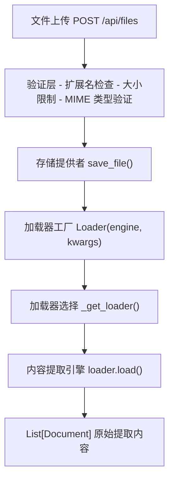
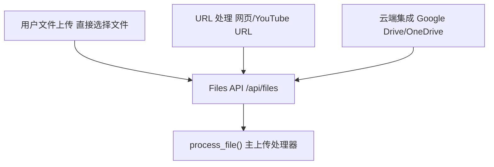
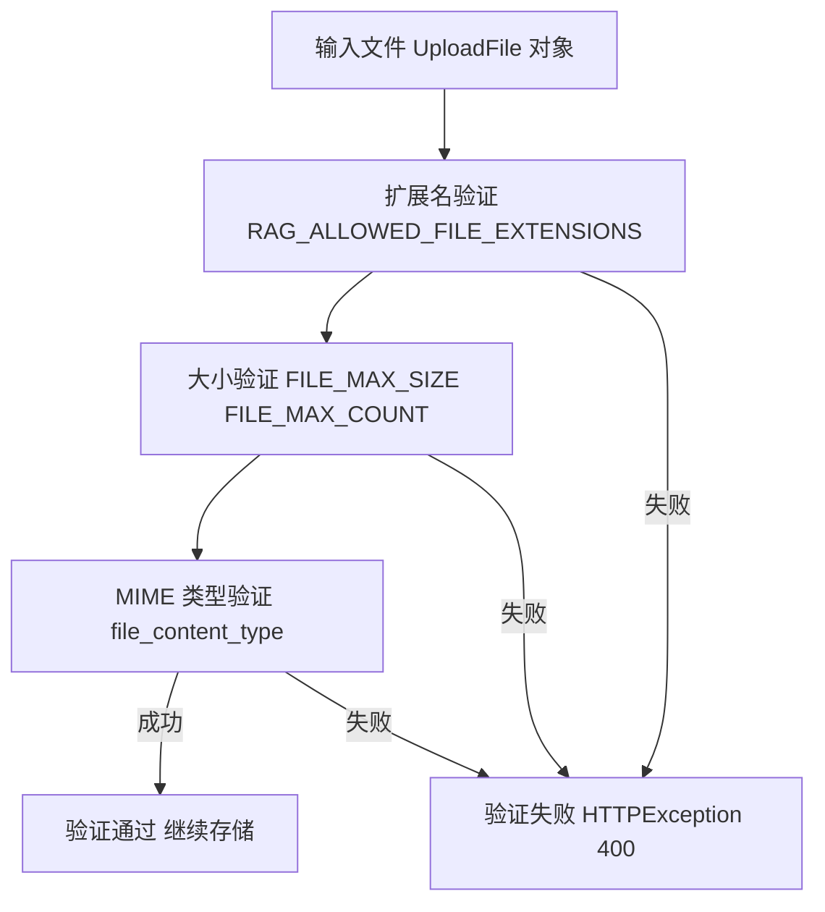
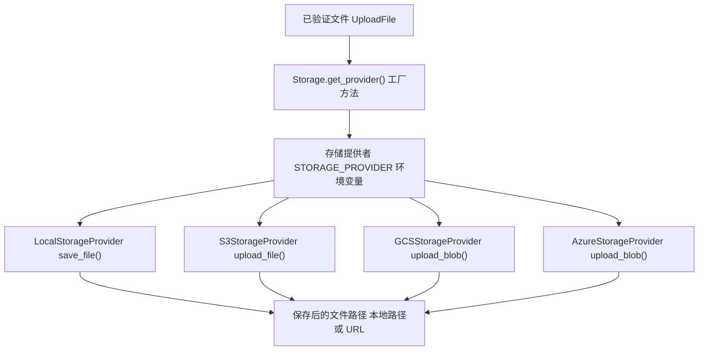
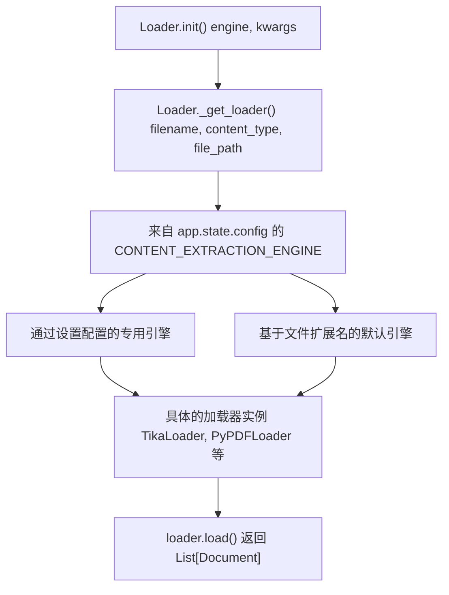
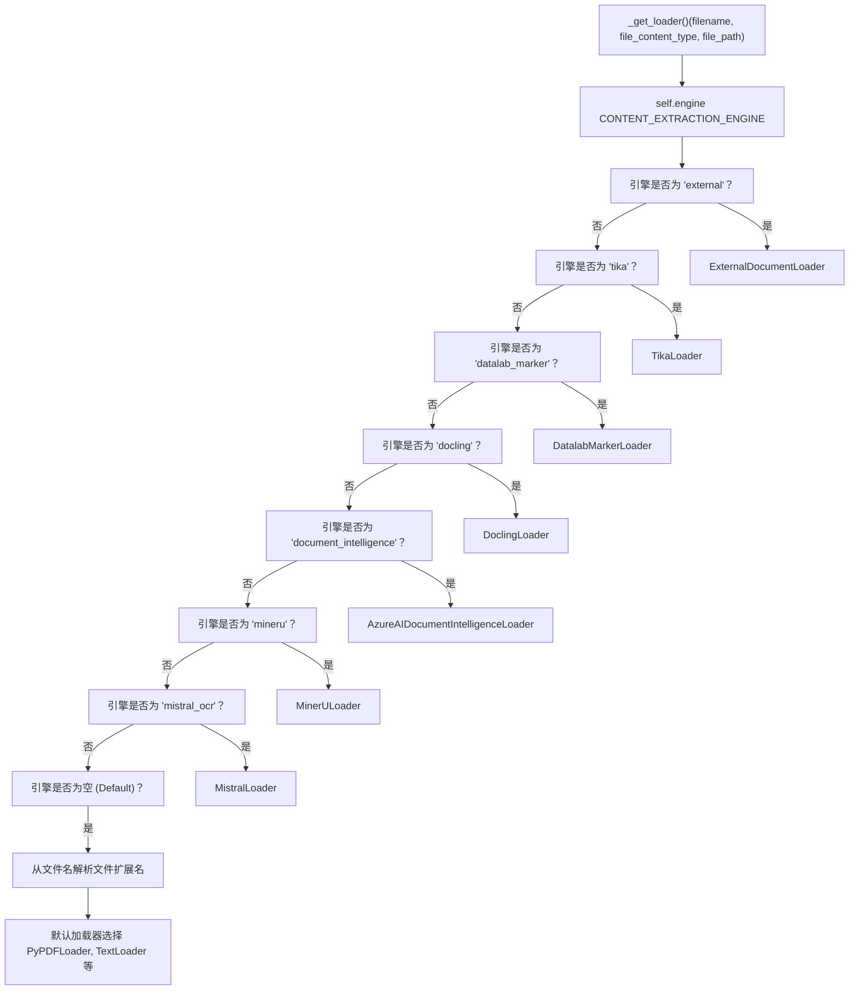
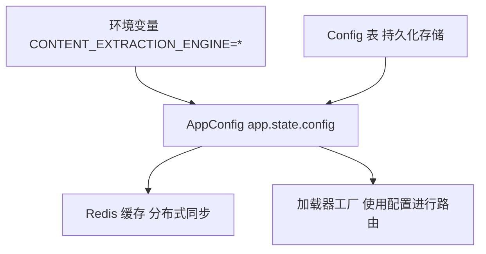
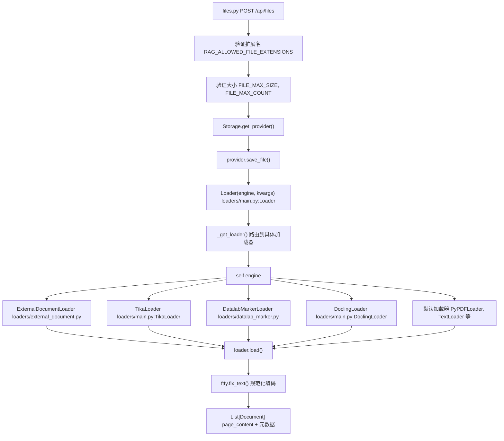

# 文档摄取流水线

相关源文件

-   [backend/open\_webui/config.py](https://github.com/open-webui/open-webui/blob/a7271532/backend/open_webui/config.py)
-   [backend/open\_webui/main.py](https://github.com/open-webui/open-webui/blob/a7271532/backend/open_webui/main.py)
-   [backend/open\_webui/retrieval/loaders/datalab\_marker.py](https://github.com/open-webui/open-webui/blob/a7271532/backend/open_webui/retrieval/loaders/datalab_marker.py)
-   [backend/open\_webui/retrieval/loaders/external\_document.py](https://github.com/open-webui/open-webui/blob/a7271532/backend/open_webui/retrieval/loaders/external_document.py)
-   [backend/open\_webui/retrieval/loaders/external\_web.py](https://github.com/open-webui/open-webui/blob/a7271532/backend/open_webui/retrieval/loaders/external_web.py)
-   [backend/open\_webui/retrieval/loaders/main.py](https://github.com/open-webui/open-webui/blob/a7271532/backend/open_webui/retrieval/loaders/main.py)
-   [backend/open\_webui/retrieval/loaders/mineru.py](https://github.com/open-webui/open-webui/blob/a7271532/backend/open_webui/retrieval/loaders/mineru.py)
-   [backend/open\_webui/retrieval/loaders/mistral.py](https://github.com/open-webui/open-webui/blob/a7271532/backend/open_webui/retrieval/loaders/mistral.py)
-   [backend/open\_webui/retrieval/utils.py](https://github.com/open-webui/open-webui/blob/a7271532/backend/open_webui/retrieval/utils.py)
-   [backend/open\_webui/routers/retrieval.py](https://github.com/open-webui/open-webui/blob/a7271532/backend/open_webui/routers/retrieval.py)
-   [backend/open\_webui/utils/middleware.py](https://github.com/open-webui/open-webui/blob/a7271532/backend/open_webui/utils/middleware.py)
-   [src/lib/apis/retrieval/index.ts](https://github.com/open-webui/open-webui/blob/a7271532/src/lib/apis/retrieval/index.ts)
-   [src/lib/components/admin/Settings/Documents.svelte](https://github.com/open-webui/open-webui/blob/a7271532/src/lib/components/admin/Settings/Documents.svelte)
-   [src/lib/components/admin/Settings/WebSearch.svelte](https://github.com/open-webui/open-webui/blob/a7271532/src/lib/components/admin/Settings/WebSearch.svelte)

## 目的与范围

本文档描述了 Open WebUI 中的文档摄取流水线，涵盖了从文件上传到验证，再到路由至内容提取引擎的整个流程。这是 RAG 系统的入口点，负责为后续的处理阶段准备文档。

有关内容提取引擎的实现，请参阅第 7.2 页。有关文本分割与分块，请参阅第 7.3 页。有关嵌入生成，请参阅第 7.4 页。

## 摄取流水线概览

文档摄取流水线处理文档处理的初始阶段：接收文件、对其进行验证，并将其路由到适当的提取引擎。完整的摄取流程包括：


**来源：** [backend/open\_webui/routers/retrieval.py1-117](https://github.com/open-webui/open-webui/blob/a7271532/backend/open_webui/routers/retrieval.py#L1-L117) [backend/open\_webui/retrieval/loaders/main.py184-204](https://github.com/open-webui/open-webui/blob/a7271532/backend/open_webui/retrieval/loaders/main.py#L184-L204)

## 文件上传流程

### 上传入口点

文档通过 Files API 进入摄取流水线，该 API 提供了多种上传机制：


| 输入方式 | API 端点 | 处理器函数 | 特殊处理 |
| --- | --- | --- | --- |
| 直接上传 | `POST /api/files` | `upload_file()` | 多部分表单数据 (Multipart form data) |
| 网页 URL | `POST /api/retrieval/process/web` | `process_web()` | 网页加载器集成 |
| YouTube URL | `POST /api/retrieval/process/youtube` | `process_youtube()` | 字幕提取 |
| Google Drive | Drive API 集成 | `process_drive_file()` | OAuth 身份验证 |
| OneDrive | OneDrive API 集成 | `process_onedrive_file()` | OAuth 身份验证 |

**来源：** [backend/open\_webui/routers/files.py1-50](https://github.com/open-webui/open-webui/blob/a7271532/backend/open_webui/routers/files.py#L1-L50) [backend/open\_webui/routers/retrieval.py237-262](https://github.com/open-webui/open-webui/blob/a7271532/backend/open_webui/routers/retrieval.py#L237-L262)

### 文件验证层

摄取流水线实现了多级验证以确保文件的安全性和兼容性：

**验证阶段图**


**验证配置**

| 配置变量 | 默认值 | 用途 | 位置 |
| --- | --- | --- | --- |
| `ALLOWED_FILE_EXTENSIONS` | 40+ 种扩展名 | 允许的文件类型白名单 | [backend/open\_webui/config.py842](https://github.com/open-webui/open-webui/blob/a7271532/backend/open_webui/config.py#L842-L842) |
| `FILE_MAX_SIZE` | 可配置 | 最大文件大小（字节） | [backend/open\_webui/config.py843](https://github.com/open-webui/open-webui/blob/a7271532/backend/open_webui/config.py#L843-L843) |
| `FILE_MAX_COUNT` | 可配置 | 单次上传的最大文件数 | [backend/open\_webui/config.py844](https://github.com/open-webui/open-webui/blob/a7271532/backend/open_webui/config.py#L844-L844) |
| `FILE_IMAGE_COMPRESSION_WIDTH` | 可配置 | 图像压缩宽度 | [backend/open\_webui/config.py845](https://github.com/open-webui/open-webui/blob/a7271532/backend/open_webui/config.py#L845-L845) |
| `FILE_IMAGE_COMPRESSION_HEIGHT` | 可配置 | 图像压缩高度 | [backend/open\_webui/config.py846](https://github.com/open-webui/open-webui/blob/a7271532/backend/open_webui/config.py#L846-L846) |

**按类别划分的受支持文件扩展名**

| 类别 | 扩展名 |
| --- | --- |
| 文档 | `pdf`, `doc`, `docx`, `odt`, `rtf` |
| 表格 | `xls`, `xlsx`, `ods`, `csv` |
| 演示文稿 | `ppt`, `pptx`, `odp` |
| 文本 | `txt`, `md`, `rst`, `xml`, `html` |
| 电子书 | `epub` |
| 图像 | `png`, `jpg`, `jpeg`, `gif`, `webp`, `tiff` |
| 源代码 | `py`, `js`, `java`, `cpp`, `c`, `h`, `go`, `rs` 等 |
| 邮件消息 | `msg` (Outlook) |

**来源：** [backend/open\_webui/config.py842-846](https://github.com/open-webui/open-webui/blob/a7271532/backend/open_webui/config.py#L842-L846) [backend/open\_webui/routers/files.py1-100](https://github.com/open-webui/open-webui/blob/a7271532/backend/open_webui/routers/files.py#L1-L100)

## 存储提供者集成

验证后，文件在提取前会使用存储提供者抽象进行持久化：

**存储流程图**


**存储提供者配置**

| 提供者 | 环境变量 | 额外配置 |
| --- | --- | --- |
| 本地 | `STORAGE_PROVIDER=local` | `UPLOAD_DIR` 路径 |
| Amazon S3 | `STORAGE_PROVIDER=s3` | AWS 凭据, 存储桶名称 |
| Google Cloud Storage | `STORAGE_PROVIDER=gcs` | GCS 凭据, 存储桶名称 |
| Azure Blob Storage | `STORAGE_PROVIDER=azure` | Azure 凭据, 容器名称 |

存储提供者返回一个文件路径（本地）或引用，随后由加载器工厂用于内容提取。

**来源：** [backend/open\_webui/storage/provider.py1-100](https://github.com/open-webui/open-webui/blob/a7271532/backend/open_webui/storage/provider.py#L1-L100) [backend/open\_webui/config.py342](https://github.com/open-webui/open-webui/blob/a7271532/backend/open_webui/config.py#L342-L342)

## 加载器工厂与路由

`Loader` 类实现了工厂模式，根据配置和文件类型将文件路由到适当的提取引擎。

**加载器工厂架构**


**来源：** [backend/open\_webui/retrieval/loaders/main.py184-211](https://github.com/open-webui/open-webui/blob/a7271532/backend/open_webui/retrieval/loaders/main.py#L184-L211)

### 引擎选择决策树

路由逻辑优先考虑已配置的提取引擎，其次是默认加载器：


**来源：** [backend/open\_webui/retrieval/loaders/main.py211-369](https://github.com/open-webui/open-webui/blob/a7271532/backend/open_webui/retrieval/loaders/main.py#L211-L369)

### 默认加载器映射

当未配置提取引擎 (`CONTENT_EXTRACTION_ENGINE=''`) 时，工厂根据文件扩展名路由到原生的 Python 加载器：

| 文件扩展名 | 加载器类 | 来源 |
| --- | --- | --- |
| `.pdf` | `PyPDFLoader` | langchain\_community |
| `.txt`, `.md`, `.py`, 源代码 | `TextLoader` | langchain\_community |
| `.csv` | `CSVLoader` | langchain\_community |
| `.doc`, `.docx` | `Docx2txtLoader` | langchain\_community |
| `.html`, `.htm` | `BSHTMLLoader` | langchain\_community |
| `.xls`, `.xlsx` | `UnstructuredExcelLoader` | langchain\_community |
| `.ppt`, `.pptx` | `UnstructuredPowerPointLoader` | langchain\_community |
| `.odt` | `UnstructuredODTLoader` | langchain\_community |
| `.rst` | `UnstructuredRSTLoader` | langchain\_community |
| `.xml` | `UnstructuredXMLLoader` | langchain\_community |
| `.epub` | `UnstructuredEPubLoader` | langchain\_community |
| `.msg` | `OutlookMessageLoader` | langchain\_community |

**文本文件检测逻辑**

加载器工厂包含用于识别基于文本的文件的特殊逻辑：

```python
def _is_text_file(self, file_ext: str, file_content_type: str) -> bool:
    return file_ext in known_source_ext or (
        file_content_type
        and file_content_type.find("text/") >= 0
        and not file_content_type.find("html") >= 0
    )
```
这确保了源代码文件和纯文本文件使用具有自动编码检测功能的 `TextLoader`，防止因编码问题导致提取失败。

**来源：** [backend/open\_webui/retrieval/loaders/main.py38-90](https://github.com/open-webui/open-webui/blob/a7271532/backend/open_webui/retrieval/loaders/main.py#L38-L90) [backend/open\_webui/retrieval/loaders/main.py203-210](https://github.com/open-webui/open-webui/blob/a7271532/backend/open_webui/retrieval/loaders/main.py#L203-L210) [backend/open\_webui/retrieval/loaders/main.py356-369](https://github.com/open-webui/open-webui/blob/a7271532/backend/open_webui/retrieval/loaders/main.py#L356-L369)

## 内容提取引擎概览

内容提取引擎是将原始文件数据转换为结构化文本的专门组件。摄取流水线根据 `CONTENT_EXTRACTION_ENGINE` 配置路由到这些引擎。

**可用引擎摘要**

| 引擎 | 标识符 | 主要用例 | 所需配置 |
| --- | --- | --- | --- |
| 默认 | `''` (空) | 通用型, 无需外部服务 | `PDF_EXTRACT_IMAGES` |
| Apache Tika | `tika` | 通用文档解析 | `TIKA_SERVER_URL` |
| Datalab Marker | `datalab_marker` | 带有 LLM 增强的高级 PDF 处理 | `DATALAB_MARKER_API_KEY` |
| Docling | `docling` | 文档转换服务 | `DOCLING_SERVER_URL` |
| MinerU | `mineru` | 具有 OCR/公式检测的 PDF 处理 | `MINERU_API_MODE`, `MINERU_API_URL` |
| Azure Document Intelligence | `document_intelligence` | 企业级文档分析 | `DOCUMENT_INTELLIGENCE_ENDPOINT` |
| Mistral OCR | `mistral_ocr` | 基于视觉模型的 OCR | `MISTRAL_OCR_API_KEY` |
| 外部 (External) | `external` | 自定义 HTTP 端点 | `EXTERNAL_DOCUMENT_LOADER_URL` |

**引擎配置存储**


引擎配置通过 `AppConfig` 类进行管理，该类支持：

-   来自环境变量的初始值。
-   在数据库中持久化存储。
-   通过管理 API (`/api/retrieval/config/update`) 进行运行时更新。
-   通过 Redis 进行跨实例同步。

有关每个引擎的实现、协议和能力的详细信息，请参阅第 7.2 页内容提取引擎。

**来源：** [backend/open\_webui/config.py857-882](https://github.com/open-webui/open-webui/blob/a7271532/backend/open_webui/config.py#L857-L882) [backend/open\_webui/retrieval/loaders/main.py184-369](https://github.com/open-webui/open-webui/blob/a7271532/backend/open_webui/retrieval/loaders/main.py#L184-L369) [backend/open\_webui/routers/retrieval.py459-482](https://github.com/open-webui/open-webui/blob/a7271532/backend/open_webui/routers/retrieval.py#L459-L482)

## 文档输出格式

摄取流水线以标准化格式输出文档，供后续处理阶段使用：

**文档结构**

```python
class Document(BaseModel):
    page_content: str      # 提取出的文本内容
    metadata: dict         # 文件元数据和提取信息
```
**常用元数据字段**

| 字段 | 描述 | 来源 |
| --- | --- | --- |
| `source` | 原始文件名或 URL | 所有加载器 |
| `file_path` | 存储位置 | 文件系统加载器 |
| `Content-Type` | MIME 类型 | 基于 HTTP 的加载器 |
| `page` | 页码（针对多页文档） | PDF 加载器 |
| `name` | 人类可读的名称 | 知识库系统 |
| `collection_name` | 关联的集合 | RAG 系统 |

**文本内容规范化**

提取后，摄取流水线使用 `ftfy.fix_text()` 进行文本规范化：

```python
def load(self, filename: str, file_content_type: str, file_path: str) -> list[Document]:
    loader = self._get_loader(filename, file_content_type, file_path)
    docs = loader.load()

    return [
        Document(
            page_content=ftfy.fix_text(doc.page_content),
            metadata=doc.metadata
        )
        for doc in docs
    ]
```
这修复了常见的编码问题（Unicode、旧版编码、乱码），确保为下游处理提供干净的文本。

文本分割和分块发生在摄取之后。详情请参阅第 7.3 页文本分割与分块。

**来源：** [backend/open\_webui/retrieval/loaders/main.py193-204](https://github.com/open-webui/open-webui/blob/a7271532/backend/open_webui/retrieval/loaders/main.py#L193-L204)

## 完整摄取流程

下图展示了包含代码实体的端到端摄取流程：

**摄取流水线代码流程**


**关键类与方法**

| 组件 | 文件路径 | 关键方法 |
| --- | --- | --- |
| `Loader` | [backend/open\_webui/retrieval/loaders/main.py184](https://github.com/open-webui/open-webui/blob/a7271532/backend/open_webui/retrieval/loaders/main.py#L184-L184) | `__init__()`, `load()`, `_get_loader()`, `_is_text_file()` |
| `TikaLoader` | [backend/open\_webui/retrieval/loaders/main.py92](https://github.com/open-webui/open-webui/blob/a7271532/backend/open_webui/retrieval/loaders/main.py#L92-L92) | `__init__()`, `load()` |
| `DoclingLoader` | [backend/open\_webui/retrieval/loaders/main.py133](https://github.com/open-webui/open-webui/blob/a7271532/backend/open_webui/retrieval/loaders/main.py#L133-L133) | `__init__()`, `load()` |
| `DatalabMarkerLoader` | [backend/open\_webui/retrieval/loaders/datalab\_marker.py13](https://github.com/open-webui/open-webui/blob/a7271532/backend/open_webui/retrieval/loaders/datalab_marker.py#L13-L13) | `__init__()`, `load()`, `check_marker_request_status()` |
| `MinerULoader` | [backend/open\_webui/retrieval/loaders/mineru.py14](https://github.com/open-webui/open-webui/blob/a7271532/backend/open_webui/retrieval/loaders/mineru.py#L14-L14) | `__init__()`, `load()`, `_load_local_api()`, `_load_cloud_api()` |
| `MistralLoader` | [backend/open\_webui/retrieval/loaders/mistral.py18](https://github.com/open-webui/open-webui/blob/a7271532/backend/open_webui/retrieval/loaders/mistral.py#L18-L18) | `__init__()`, `load()`, `load_async()` |
| `ExternalDocumentLoader` | [backend/open\_webui/retrieval/loaders/external\_document.py13](https://github.com/open-webui/open-webui/blob/a7271532/backend/open_webui/retrieval/loaders/external_document.py#L13-L13) | `__init__()`, `load()` |

**来源：** [backend/open\_webui/retrieval/loaders/main.py184-369](https://github.com/open-webui/open-webui/blob/a7271532/backend/open_webui/retrieval/loaders/main.py#L184-L369) [backend/open\_webui/routers/files.py1-100](https://github.com/open-webui/open-webui/blob/a7271532/backend/open_webui/routers/files.py#L1-L100)

## 配置管理

文档处理配置通过多个层级进行管理：

### 环境变量

启动时从环境变量加载的初始配置：

-   `CONTENT_EXTRACTION_ENGINE`：引擎选择 (`""`, `tika`, `datalab_marker`, `docling`, `mineru`, `document_intelligence`, `mistral_ocr`, `external`)。
-   `PDF_EXTRACT_IMAGES`：布尔值，用于默认引擎中的 OCR。
-   `CHUNK_SIZE`：默认 1500 字符。
-   `CHUNK_OVERLAP`：默认 100 字符。
-   `RAG_TEXT_SPLITTER`：策略选择 (`recursive`, `token`, `markdown`)。
-   `RAG_ALLOWED_FILE_EXTENSIONS`：允许的文件扩展名列表。
-   `RAG_FILE_MAX_SIZE`：最大文件大小（字节）。
-   `RAG_FILE_MAX_COUNT`：单次上传的最大文件数。

### 运行时配置

可以通过管理员 API 进行更新而无需重启：

```json
POST /api/retrieval/config/update
{
  "CONTENT_EXTRACTION_ENGINE": "datalab_marker",
  "DATALAB_MARKER_API_KEY": "...",
  "CHUNK_SIZE": 2000,
  "CHUNK_OVERLAP": 200,
  ...
}
```
更新将持久化到数据库，并在 Redis 可用时在实例间同步（参见 `AppConfig` 实现）。

**来源：** [backend/open\_webui/config.py224-283](https://github.com/open-webui/open-webui/blob/a7271532/backend/open_webui/config.py#L224-L283) [backend/open\_webui/routers/retrieval.py434-493](https://github.com/open-webui/open-webui/blob/a7271532/backend/open_webui/routers/retrieval.py#L434-L493)

### 前端设置 UI

文档处理配置通过“设置 > 文档”下的管理员设置界面公开。UI 提供了：

-   内容提取引擎的下拉选择器。
-   引擎特定的配置表单（API 密钥、URL、参数）。
-   文本分割策略选择。
-   块大小和重叠控制。
-   文件上传限制配置。

**来源：** [src/lib/components/admin/Settings/Documents.svelte1-274](https://github.com/open-webui/open-webui/blob/a7271532/src/lib/components/admin/Settings/Documents.svelte#L1-L274)
