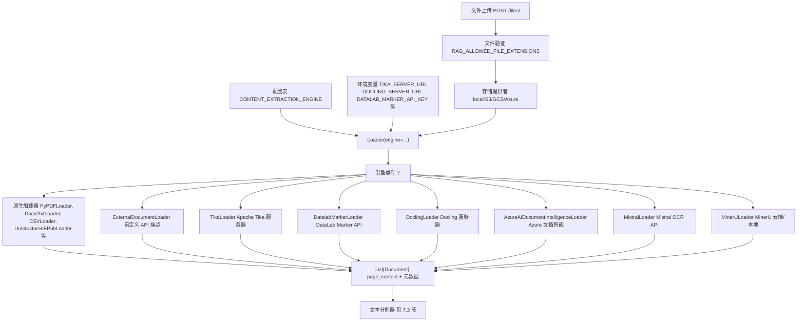
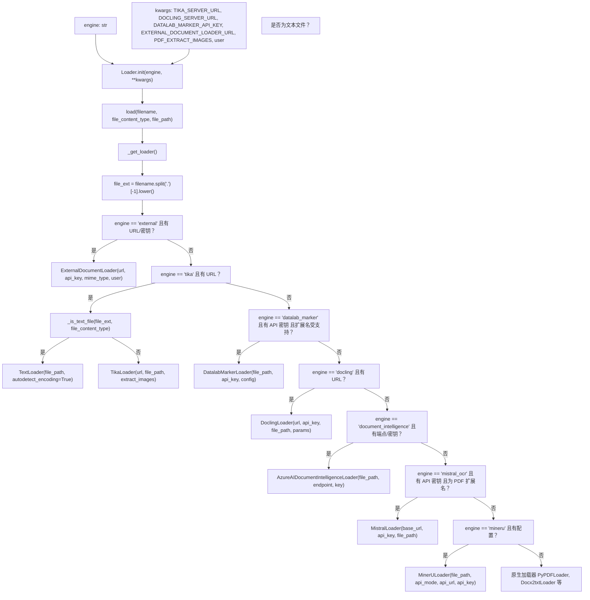
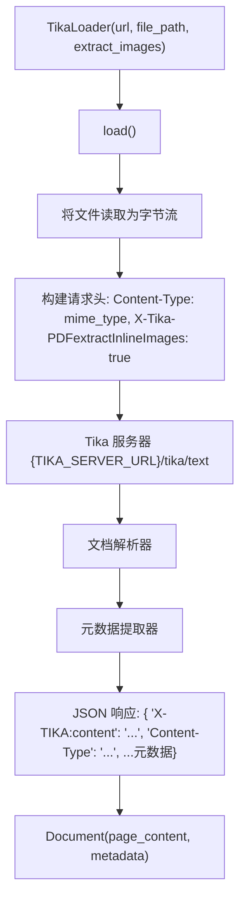
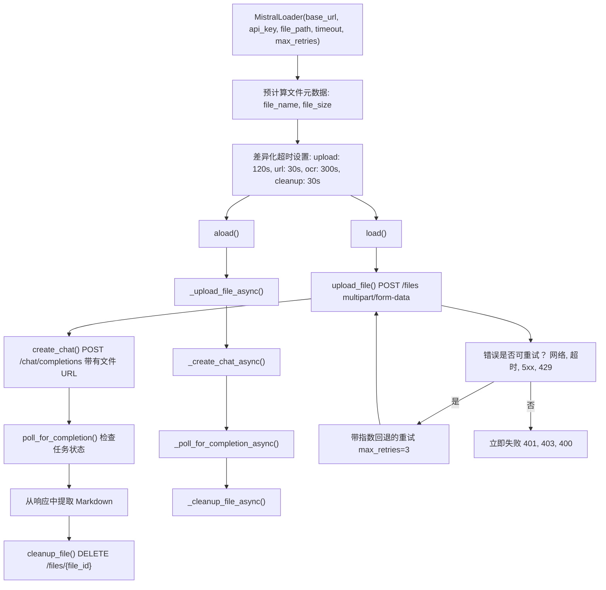
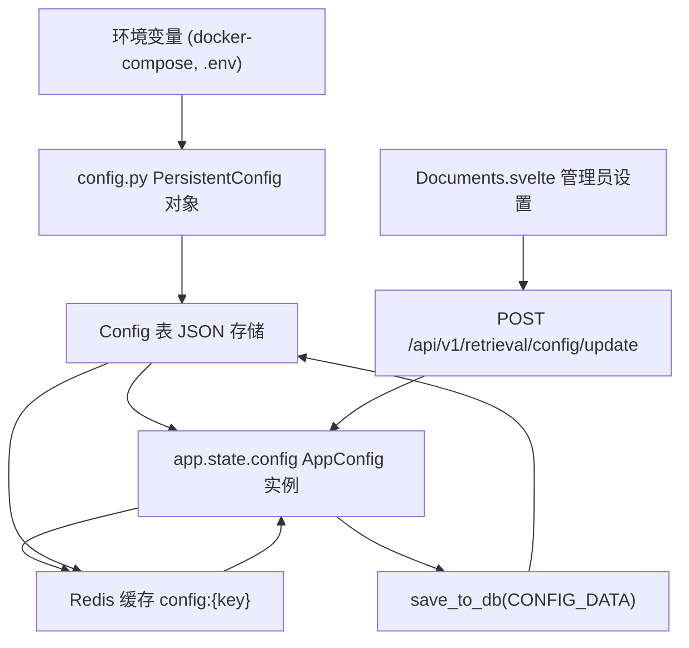
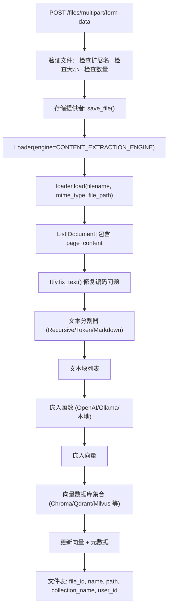

# 内容提取引擎

相关源文件

-   [backend/open\_webui/config.py](https://github.com/open-webui/open-webui/blob/a7271532/backend/open_webui/config.py)
-   [backend/open\_webui/main.py](https://github.com/open-webui/open-webui/blob/a7271532/backend/open_webui/main.py)
-   [backend/open\_webui/retrieval/loaders/datalab\_marker.py](https://github.com/open-webui/open-webui/blob/a7271532/backend/open_webui/retrieval/loaders/datalab_marker.py)
-   [backend/open\_webui/retrieval/loaders/external\_document.py](https://github.com/open-webui/open-webui/blob/a7271532/backend/open_webui/retrieval/loaders/external_document.py)
-   [backend/open\_webui/retrieval/loaders/external\_web.py](https://github.com/open-webui/open-webui/blob/a7271532/backend/open_webui/retrieval/loaders/external_web.py)
-   [backend/open\_webui/retrieval/loaders/main.py](https://github.com/open-webui/open-webui/blob/a7271532/backend/open_webui/retrieval/loaders/main.py)
-   [backend/open\_webui/retrieval/loaders/mineru.py](https://github.com/open-webui/open-webui/blob/a7271532/backend/open_webui/retrieval/loaders/mineru.py)
-   [backend/open\_webui/retrieval/loaders/mistral.py](https://github.com/open-webui/open-webui/blob/a7271532/backend/open_webui/retrieval/loaders/mistral.py)
-   [backend/open\_webui/retrieval/utils.py](https://github.com/open-webui/open-webui/blob/a7271532/backend/open_webui/retrieval/utils.py)
-   [backend/open\_webui/routers/retrieval.py](https://github.com/open-webui/open-webui/blob/a7271532/backend/open_webui/routers/retrieval.py)
-   [backend/open\_webui/utils/middleware.py](https://github.com/open-webui/open-webui/blob/a7271532/backend/open_webui/utils/middleware.py)
-   [src/lib/apis/retrieval/index.ts](https://github.com/open-webui/open-webui/blob/a7271532/src/lib/apis/retrieval/index.ts)
-   [src/lib/components/admin/Settings/Documents.svelte](https://github.com/open-webui/open-webui/blob/a7271532/src/lib/components/admin/Settings/Documents.svelte)
-   [src/lib/components/admin/Settings/WebSearch.svelte](https://github.com/open-webui/open-webui/blob/a7271532/src/lib/components/admin/Settings/WebSearch.svelte)

## 目的与范围

内容提取引擎是 Open WebUI RAG 流水线中可插拔的文档解析子系统。这些引擎将上传的文件（PDF、Office 文档、图像等）转换为适合嵌入和检索的文本内容。本文档涵盖了文档内容提取的架构、可用引擎、配置选项以及集成点。

有关完整文档摄取和 RAG 流水线的信息，请参阅 [文档摄取流水线](/open-webui/open-webui/7.1-document-ingestion-pipeline)。有关提取后应用的文本分割与分块策略，请参阅 [文本分割与分块](/open-webui/open-webui/7.3-text-splitting-and-chunking)。

---

## 系统架构

内容提取系统建立在灵活的引擎抽象之上，支持原生（本地）解析器和基于外部 API 的提取服务。系统根据配置和文件类型将文档路由到适当的引擎。


**来源：**

-   [backend/open\_webui/retrieval/loaders/main.py184-310](https://github.com/open-webui/open-webui/blob/a7271532/backend/open_webui/retrieval/loaders/main.py#L184-L310)
-   [backend/open\_webui/config.py857-887](https://github.com/open-webui/open-webui/blob/a7271532/backend/open_webui/config.py#L857-L887)
-   [backend/open\_webui/main.py254-286](https://github.com/open-webui/open-webui/blob/a7271532/backend/open_webui/main.py#L254-L286)

---

## Loader 类与引擎选择

`main.py` 中的 `Loader` 类充当工厂，根据配置实例化适当的提取引擎。引擎选择会同时考虑配置的引擎类型和文件特性。


**来源：**

-   [backend/open\_webui/retrieval/loaders/main.py184-356](https://github.com/open-webui/open-webui/blob/a7271532/backend/open_webui/retrieval/loaders/main.py#L184-L356)

---

## 默认原生加载器

当 `CONTENT_EXTRACTION_ENGINE` 为空或设置为 `""` 时，系统使用来自 `langchain_community` 的原生加载器。这些加载器在本地运行，无需外部 API 依赖。

### 受支持的文件类型与加载器

| 文件扩展名 | 加载器类 | 备注 |
| --- | --- | --- |
| `.pdf` | `PyPDFLoader` | 支持通过 `PDF_EXTRACT_IMAGES` 进行 OCR |
| `.csv` | `CSVLoader` | 逗号分隔值文件 |
| `.doc`, `.docx` | `Docx2txtLoader` | Microsoft Word 文档 |
| `.epub` | `UnstructuredEPubLoader` | 电子出版物 |
| `.html` | `BSHTMLLoader` | HTML 文档 |
| `.md` | `TextLoader` | Markdown 文件 |
| `.msg` | `OutlookMessageLoader` | Outlook 邮件 |
| `.odt` | `UnstructuredODTLoader` | OpenDocument 文本 |
| `.pptx` | `UnstructuredPowerPointLoader` | PowerPoint 演示文稿 |
| `.rst` | `UnstructuredRSTLoader` | reStructuredText |
| `.txt` | `TextLoader` | 具有编码检测功能的纯文本 |
| `.xls`, `.xlsx` | `UnstructuredExcelLoader` | Excel 电子表格 |
| `.xml` | `UnstructuredXMLLoader` | XML 文档 |
| 源代码文件 | `TextLoader` | 40 多种扩展名 (参见 `known_source_ext`) |

### PDF 图像提取

原生 PDF 加载器通过 `PDF_EXTRACT_IMAGES` 配置支持 OCR：

```python
# main.py 中的配置
app.state.config.PDF_EXTRACT_IMAGES = PDF_EXTRACT_IMAGES

# 在 Loader._get_loader() 中使用
if file_ext == "pdf":
    loader = PyPDFLoader(
        file_path,
        extract_images=self.kwargs.get("PDF_EXTRACT_IMAGES")
    )
```
启用后，PyPDFLoader 会提取 PDF 中嵌入的图像并尝试对其进行 OCR，以捕获可能无法直接选择的文本内容。

**来源：**

-   [backend/open\_webui/retrieval/loaders/main.py38-356](https://github.com/open-webui/open-webui/blob/a7271532/backend/open_webui/retrieval/loaders/main.py#L38-L356)
-   [backend/open\_webui/config.py917](https://github.com/open-webui/open-webui/blob/a7271532/backend/open_webui/config.py#L917-L917)

---

## 外部文档加载器

`external` 引擎将文档路由到自定义 API 端点，从而实现了与专有或专门的文档处理服务的集成。

### 配置

| 变量 | 用途 |
| --- | --- |
| `EXTERNAL_DOCUMENT_LOADER_URL` | 外部 API 的基准 URL |
| `EXTERNAL_DOCUMENT_LOADER_API_KEY` | 用于身份验证的 Bearer 令牌 |

### API 协议

外部加载器通过 PUT 请求将文档内容发送到 `/process` 端点：

> **[Mermaid sequence]**
> *(图表结构无法解析)*

### 用户上下文请求头 (User Context Headers)

当 `ENABLE_FORWARD_USER_INFO_HEADERS` 启用时，加载器会在请求中包含用户元数据头 (`X-User-Id`, `X-User-Email`, `X-User-Name`, `X-User-Role`)，从而在外部 API 中实现特定于用户的处理逻辑。

**来源：**

-   [backend/open\_webui/retrieval/loaders/external\_document.py1-90](https://github.com/open-webui/open-webui/blob/a7271532/backend/open_webui/retrieval/loaders/external_document.py#L1-L90)
-   [backend/open\_webui/retrieval/loaders/main.py214-225](https://github.com/open-webui/open-webui/blob/a7271532/backend/open_webui/retrieval/loaders/main.py#L214-L225)

---

## Apache Tika 服务器

`tika` 引擎使用 Apache Tika 进行企业级文档解析。Tika 通过其统一的 API 支持数百种文件格式。

### 架构


### 配置

| 变量 | 是否必需 | 用途 |
| --- | --- | --- |
| `TIKA_SERVER_URL` | 是 | Tika 服务器的基准 URL (例如 `http://tika:9998`) |
| `PDF_EXTRACT_IMAGES` | 否 | 启用 PDF 的行内图像提取 |

### 文本文件优化

Tika 加载器包含针对文本文件的优化：当文件扩展名在 `known_source_ext` 中或 MIME 类型以 `text/` 开头时，系统会绕过 Tika 并使用原生 `TextLoader` 以实现更快的处理。

```python
# Loader._get_loader() 中的优化
if self._is_text_file(file_ext, file_content_type):
    loader = TextLoader(file_path, autodetect_encoding=True)
else:
    loader = TikaLoader(url=self.kwargs.get("TIKA_SERVER_URL"), ...)
```
**来源：**

-   [backend/open\_webui/retrieval/loaders/main.py92-234](https://github.com/open-webui/open-webui/blob/a7271532/backend/open_webui/retrieval/loaders/main.py#L92-L234)
-   [backend/open\_webui/config.py873](https://github.com/open-webui/open-webui/blob/a7271532/backend/open_webui/config.py#L873-L873)

---

## DataLab Marker API

`datalab_marker` 引擎使用 DataLab Marker 服务进行高质量的文档转换，特别擅长处理具有复杂布局、表格和数学内容的 PDF。

### 受支持的文件类型

PDF、Office 文档（Word、Excel、PowerPoint）、OpenDocument 格式、HTML、EPUB 以及图像（PNG、JPEG、WebP、GIF、TIFF）。

### 配置参数


### API 流程

DataLab Marker API 使用异步轮询模式：

> **[Mermaid sequence]**
> *(图表结构无法解析)*

### 附加配置格式

`DATALAB_MARKER_ADDITIONAL_CONFIG` 接收包含高级选项的 JSON 字符串：

```json
{
  "disable_links": true,
  "keep_pageheader_in_output": false,
  "keep_pagefooter_in_output": false,
  "filter_blank_pages": true,
  "drop_repeated_text": true,
  "layout_coverage_threshold": 0.5,
  "merge_threshold": 0.8,
  "height_tolerance": 2,
  "gap_threshold": 0.1,
  "image_threshold": 0.05,
  "min_line_length": 5,
  "level_count": 3,
  "default_level": 1
}
```
**来源：**

-   [backend/open\_webui/retrieval/loaders/datalab\_marker.py1-211](https://github.com/open-webui/open-webui/blob/a7271532/backend/open_webui/retrieval/loaders/datalab_marker.py#L1-L211)
-   [backend/open\_webui/retrieval/loaders/main.py235-283](https://github.com/open-webui/open-webui/blob/a7271532/backend/open_webui/retrieval/loaders/main.py#L235-L283)
-   [backend/open\_webui/config.py858-871](https://github.com/open-webui/open-webui/blob/a7271532/backend/open_webui/config.py#L858-L871)
-   [src/lib/components/admin/Settings/Documents.svelte365-535](https://github.com/open-webui/open-webui/blob/a7271532/src/lib/components/admin/Settings/Documents.svelte#L365-L535)

---

## Docling 服务器

`docling` 引擎集成了自托管或远程的 Docling 服务器进行文档转换。Docling 提供干净的 Markdown 输出，并带有图像占位符。

### 配置

| 变量 | 是否必需 | 用途 |
| --- | --- | --- |
| `DOCLING_SERVER_URL` | 是 | Docling 服务器的基准 URL |
| `DOCLING_API_KEY` | 否 | Bearer 令牌 (如果启用了身份验证) |
| `DOCLING_PARAMS` | 否 | 包含附加参数的 JSON 对象 |

### API 协议

> **[Mermaid sequence]**
> *(图表结构无法解析)*

### DOCLING\_PARAMS 结构

`DOCLING_PARAMS` 配置接收一个 JSON 对象，该对象会被合并到请求数据中：

```json
{
  "ocr": true,
  "export_tables": true,
  "export_images": false,
  "table_structure_extraction": true
}
```
加载器始终将 `image_export_mode` 设置为 `"placeholder"`，在 Markdown 中插入类似于 `` 的占位符，而不是嵌入完整图像。

**来源：**

-   [backend/open\_webui/retrieval/loaders/main.py133-303](https://github.com/open-webui/open-webui/blob/a7271532/backend/open_webui/retrieval/loaders/main.py#L133-L303)
-   [backend/open\_webui/config.py874-877](https://github.com/open-webui/open-webui/blob/a7271532/backend/open_webui/config.py#L874-L877)
-   [src/lib/components/admin/Settings/Documents.svelte550-606](https://github.com/open-webui/open-webui/blob/a7271532/src/lib/components/admin/Settings/Documents.svelte#L550-L606)

---

## Azure 文档智能 (Document Intelligence)

`document_intelligence` 引擎使用 Azure 的 AI 文档智能服务（原表单识别器）进行 OCR 和布局分析。

### 配置

| 变量 | 是否必需 | 用途 |
| --- | --- | --- |
| `DOCUMENT_INTELLIGENCE_ENDPOINT` | 是 | Azure 端点 URL |
| `DOCUMENT_INTELLIGENCE_KEY` | 是 | Azure 订阅密钥 |
| `DOCUMENT_INTELLIGENCE_MODEL` | 否 | 模型 ID (默认: "prebuilt-document") |

### 集成方式

该引擎使用来自 `langchain_community` 的 `AzureAIDocumentIntelligenceLoader`，它使用 `DefaultAzureCredential` 或提供的密钥进行身份验证：

```python
# 在 Loader._get_loader() 中
from azure.identity import DefaultAzureCredential

loader = AzureAIDocumentIntelligenceLoader(
    file_path=file_path,
    client=None,  # 将在内部创建
    model=self.kwargs.get("DOCUMENT_INTELLIGENCE_MODEL", "prebuilt-document"),
    credential=DefaultAzureCredential() if not key else None,
    api_endpoint=endpoint,
    api_key=key,
)
```
### 受支持的模型

Azure 文档智能提供了多种预建模型：

-   `prebuilt-document` - 通用文档分析。
-   `prebuilt-layout` - 布局和阅读顺序。
-   `prebuilt-read` - 带有阅读顺序的文本提取。
-   `prebuilt-invoice` - 针对发票的提取。
-   `prebuilt-receipt` - 针对收据的提取。
-   自定义训练的模型。

**来源：**

-   [backend/open\_webui/retrieval/loaders/main.py304-319](https://github.com/open-webui/open-webui/blob/a7271532/backend/open_webui/retrieval/loaders/main.py#L304-L319)
-   [backend/open\_webui/config.py877-880](https://github.com/open-webui/open-webui/blob/a7271532/backend/open_webui/config.py#L877-L880)

---

## Mistral OCR API

`mistral_ocr` 引擎利用 Mistral 的 OCR 模型进行 PDF 文档处理。该引擎针对 PDF 进行了优化，包含复杂的重试逻辑和性能优化。

### 架构


### 配置

| 变量 | 是否必需 | 用途 |
| --- | --- | --- |
| `MISTRAL_OCR_API_BASE_URL` | 否 | 基准 URL (默认: https://api.mistral.ai/v1) |
| `MISTRAL_OCR_API_KEY` | 是 | Mistral API 密钥 |

### 性能优化

Mistral 加载器包含多项性能增强：

1.  **差异化超时**：上传操作超时为 2 分钟，URL 操作为 30 秒，OCR 处理为 5 分钟（可配置），清理为 30 秒。这防止了快速操作进行不必要的等待。
2.  **连接池**：使用带有 keepalive 优化的 `requests.Session()` (同步) 和 `aiohttp.ClientSession()` (异步)，以减少连接开销。
3.  **智能重试逻辑**：将错误分类为可重试（网络错误、超时、5xx、429）或不可重试（401、403、400），并带有指数回退。
4.  **有条件的调试日志**：仅在启用调试模式时处理调试消息，避免字符串格式化开销。
5.  **内存高效流处理**：大文件按块流式传输，而不是全部加载到内存中。

### API 工作流

> **[Mermaid sequence]**
> *(图表结构无法解析)*

**来源：**

-   [backend/open\_webui/retrieval/loaders/mistral.py1-570](https://github.com/open-webui/open-webui/blob/a7271532/backend/open_webui/retrieval/loaders/mistral.py#L1-L570)
-   [backend/open\_webui/retrieval/loaders/main.py320-329](https://github.com/open-webui/open-webui/blob/a7271532/backend/open_webui/retrieval/loaders/main.py#L320-L329)
-   [backend/open\_webui/config.py880-882](https://github.com/open-webui/open-webui/blob/a7271532/backend/open_webui/config.py#L880-L882)

---

## MinerU 解析器

`mineru` 引擎集成了 MinerU 文档解析器，支持云端和本地部署模式。MinerU 专注于 PDF 解析，具有先进的表格、公式和 OCR 能力。

### 部署模式

MinerU 在两种不同的模式下运行：

| 模式 | 描述 | API 模式 | 用途 |
| --- | --- | --- | --- |
| `cloud` | 托管的 MinerU 服务 | 基于任务的异步轮询 | 运维开销最小的生产环境 |
| `local` | 自托管的 MinerU API | 同步处理 | 内部署、数据隐私场景 |

### 配置

| 变量 | 是否必需 | 模式 | 用途 |
| --- | --- | --- | --- |
| `MINERU_API_MODE` | 是 | 两者 | "cloud" 或 "local" |
| `MINERU_API_URL` | 是 | 两者 | API 端点 URL |
| `MINERU_API_KEY` | 有条件 | 仅云端 | 身份验证密钥 |
| `MINERU_API_TIMEOUT` | 否 | 两者 | 请求超时时间 (默认: 300s) |
| `MINERU_PARAMS` | 否 | 两者 | 包含处理选项的 JSON 对象 |

### MINERU\_PARAMS 结构

```json
{
  "enable_ocr": false,
  "enable_formula": true,
  "enable_table": true,
  "language": "zh",
  "model_version": "pipeline",
  "page_ranges": "1-10,15,20-25"
}
```
### 云端 API 流程 (异步)

> **[Mermaid sequence]**
> *(图表结构无法解析)*

### 本地 API 流程 (同步)

> **[Mermaid sequence]**
> *(图表结构无法解析)*

### 错误处理

两种模式都包含健壮的错误处理：

-   **404**：未找到文件 (路径无效)。
-   **400**：参数无效或结果为空。
-   **504**：处理期间超时 (云端轮询或本地同步)。
-   **502**：响应格式无效或 API 错误。
-   **500**：非预期的内部错误。

**来源：**

-   [backend/open\_webui/retrieval/loaders/mineru.py1-308](https://github.com/open-webui/open-webui/blob/a7271532/backend/open_webui/retrieval/loaders/mineru.py#L1-L308)
-   [backend/open\_webui/retrieval/loaders/main.py330-342](https://github.com/open-webui/open-webui/blob/a7271532/backend/open_webui/retrieval/loaders/main.py#L330-L342)
-   [backend/open\_webui/config.py882-887](https://github.com/open-webui/open-webui/blob/a7271532/backend/open_webui/config.py#L882-L887)
-   [src/lib/components/admin/Settings/Documents.svelte607-711](https://github.com/open-webui/open-webui/blob/a7271532/src/lib/components/admin/Settings/Documents.svelte#L607-L711)

---

## 配置管理

内容提取引擎的配置通过二级系统进行管理：用于初始设置的环境变量以及用于运行时更新的持久化数据库存储。

### 配置加载


### 引擎特定配置变量

下表将每个引擎与其必需及可选的配置变量进行了映射：

| 引擎 | 必需变量 | 可选变量 |
| --- | --- | --- |
| `default` | 无 | `PDF_EXTRACT_IMAGES` |
| `external` | `EXTERNAL_DOCUMENT_LOADER_URL`<br>`EXTERNAL_DOCUMENT_LOADER_API_KEY` | 无 |
| `tika` | `TIKA_SERVER_URL` | `PDF_EXTRACT_IMAGES` |
| `datalab_marker` | `DATALAB_MARKER_API_KEY` | `DATALAB_MARKER_API_BASE_URL`<br>`DATALAB_MARKER_*` (12 个配置项) |
| `docling` | `DOCLING_SERVER_URL` | `DOCLING_API_KEY`<br>`DOCLING_PARAMS` |
| `document_intelligence` | `DOCUMENT_INTELLIGENCE_ENDPOINT`<br>`DOCUMENT_INTELLIGENCE_KEY` | `DOCUMENT_INTELLIGENCE_MODEL` |
| `mistral_ocr` | `MISTRAL_OCR_API_KEY` | `MISTRAL_OCR_API_BASE_URL` |
| `mineru` | `MINERU_API_MODE`<br>`MINERU_API_URL` | `MINERU_API_KEY` (仅云端)<br>`MINERU_API_TIMEOUT`<br>`MINERU_PARAMS` |

### 管理 UI 配置流程

管理员设置界面提供了一个下拉菜单来选择提取引擎，并动态渲染引擎特定的配置表单：

```html
<!-- 引擎选择下拉菜单 -->
<select bind:value={RAGConfig.CONTENT_EXTRACTION_ENGINE}>
  <option value="">{$i18n.t('Default')}</option>
  <option value="external">{$i18n.t('External')}</option>
  <option value="tika">{$i18n.t('Tika')}</option>
  <option value="docling">{$i18n.t('Docling')}</option>
  <option value="datalab_marker">{$i18n.t('Datalab Marker API')}</option>
  <option value="document_intelligence">{$i18n.t('Document Intelligence')}</option>
  <option value="mistral_ocr">{$i18n.t('Mistral OCR')}</option>
  <option value="mineru">{$i18n.t('MinerU')}</option>
</select>

<!-- 有条件地渲染引擎特定表单 -->
{#if RAGConfig.CONTENT_EXTRACTION_ENGINE === 'datalab_marker'}
  <!-- DataLab Marker 配置表单 -->
{:else if RAGConfig.CONTENT_EXTRACTION_ENGINE === 'tika'}
  <!-- Tika 配置表单 -->
{/if}
```
`submitHandler` 函数在提交前会验证必需字段：

```javascript
if (RAGConfig.CONTENT_EXTRACTION_ENGINE === 'tika' && RAGConfig.TIKA_SERVER_URL === '') {
  toast.error($i18n.t('Tika Server URL required.'));
  return;
}
```
**来源：**

-   [backend/open\_webui/config.py139-887](https://github.com/open-webui/open-webui/blob/a7271532/backend/open_webui/config.py#L139-L887)
-   [backend/open\_webui/main.py857-887](https://github.com/open-webui/open-webui/blob/a7271532/backend/open_webui/main.py#L857-L887)
-   [src/lib/components/admin/Settings/Documents.svelte141-711](https://github.com/open-webui/open-webui/blob/a7271532/src/lib/components/admin/Settings/Documents.svelte#L141-L711)

---

## 与文档处理流水线的集成

内容提取引擎作为文档处理的第一阶段被调用，紧接在文件上传和存储之后。

### 端到端流程


### 代码集成点

加载器在文件处理路由中实例化：

```python
# 位于 backend/open_webui/routers/retrieval.py (近似位置)
loader = Loader(
    engine=request.app.state.config.CONTENT_EXTRACTION_ENGINE,
    TIKA_SERVER_URL=request.app.state.config.TIKA_SERVER_URL,
    DOCLING_SERVER_URL=request.app.state.config.DOCLING_SERVER_URL,
    DATALAB_MARKER_API_KEY=request.app.state.config.DATALAB_MARKER_API_KEY,
    # ... 其他引擎特定配置
    user=user,
)

docs = loader.load(filename, file_content_type, file_path)

# 应用 ftfy 修复编码问题
docs = [
    Document(
        page_content=ftfy.fix_text(doc.page_content),
        metadata=doc.metadata
    )
    for doc in docs
]
```
提取出的文档随后流入文本分割阶段（参见 [文本分割与分块](/open-webui/open-webui/7.3-text-splitting-and-chunking)），之后进行嵌入生成。

**来源：**

-   [backend/open\_webui/retrieval/loaders/main.py190-201](https://github.com/open-webui/open-webui/blob/a7271532/backend/open_webui/retrieval/loaders/main.py#L190-L201)
-   [backend/open\_webui/routers/retrieval.py1-262](https://github.com/open-webui/open-webui/blob/a7271532/backend/open_webui/routers/retrieval.py#L1-L262)
