# 文本分割与分块

相关源文件

-   [backend/open_webui/config.py](https://github.com/open-webui/open-webui/blob/a7271532/backend/open_webui/config.py)
-   [backend/open_webui/main.py](https://github.com/open-webui/open-webui/blob/a7271532/backend/open_webui/main.py)
-   [backend/open_webui/retrieval/loaders/datalab_marker.py](https://github.com/open-webui/open-webui/blob/a7271532/backend/open_webui/retrieval/loaders/datalab_marker.py)
-   [backend/open_webui/retrieval/loaders/external_document.py](https://github.com/open-webui/open-webui/blob/a7271532/backend/open_webui/retrieval/loaders/external_document.py)
-   [backend/open_webui/retrieval/loaders/external_web.py](https://github.com/open-webui/open-webui/blob/a7271532/backend/open_webui/retrieval/loaders/external_web.py)
-   [backend/open_webui/retrieval/loaders/main.py](https://github.com/open-webui/open-webui/blob/a7271532/backend/open_webui/retrieval/loaders/main.py)
-   [backend/open_webui/retrieval/loaders/mineru.py](https://github.com/open-webui/open-webui/blob/a7271532/backend/open_webui/retrieval/loaders/mineru.py)
-   [backend/open_webui/retrieval/loaders/mistral.py](https://github.com/open-webui/open-webui/blob/a7271532/backend/open_webui/retrieval/loaders/mistral.py)
-   [backend/open_webui/retrieval/utils.py](https://github.com/open-webui/open-webui/blob/a7271532/backend/open_webui/retrieval/utils.py)
-   [backend/open_webui/routers/retrieval.py](https://github.com/open-webui/open-webui/blob/a7271532/backend/open_webui/routers/retrieval.py)
-   [backend/open_webui/utils/middleware.py](https://github.com/open-webui/open-webui/blob/a7271532/backend/open_webui/utils/middleware.py)
-   [src/lib/apis/retrieval/index.ts](https://github.com/open-webui/open-webui/blob/a7271532/src/lib/apis/retrieval/index.ts)
-   [src/lib/components/admin/Settings/Documents.svelte](https://github.com/open-webui/open-webui/blob/a7271532/src/lib/components/admin/Settings/Documents.svelte)
-   [src/lib/components/admin/Settings/WebSearch.svelte](https://github.com/open-webui/open-webui/blob/a7271532/src/lib/components/admin/Settings/WebSearch.svelte)

本页记录了 Open WebUI RAG (检索增强生成) 流水线中使用的文本分割与分块系统。文本分割是将大型文档分解为更小的、具有语义意义的块的过程，以便可以有效地进行嵌入和检索。

有关分块之前发生的文档内容提取的信息，请参阅 [内容提取引擎](/open-webui/open-webui/7.2-content-extraction-engines)。有关分块之后发生的嵌入生成的信息，请参阅 [嵌入生成](/open-webui/open-webui/7.4-embedding-generation)。

## 目的与范围

文本分割是 RAG 系统的关键组件，它将提取的文档内容转换为适合向量嵌入的适当大小的块。本页涵盖：

-   可用的文本分割器实现。
-   块大小 (Chunk Size) 和重叠 (Overlap) 的配置。
-   不同分割器如何处理各种文档类型。
-   与文档摄取流水线的集成。

## 系统概览

分块系统位于 RAG 流水线中的内容提取和嵌入生成之间。在文档的文本内容被提取后，必须将其划分为满足以下条件的块：

1.  足够小，以适应嵌入模型的 Token 限制。
2.  足够大，以包含有意义的语义上下文。
3.  具有适当的重叠，以防止块边界处的信息丢失。

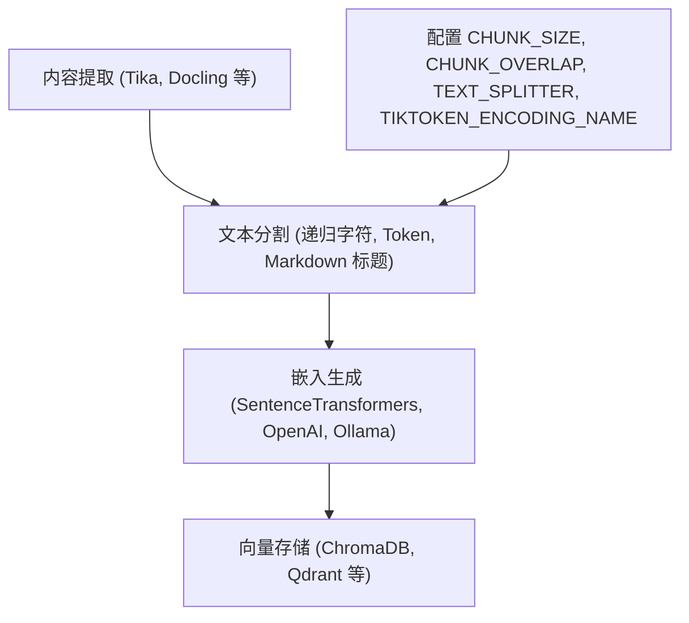
**来源：** [backend/open_webui/routers/retrieval.py32-36](https://github.com/open-webui/open-webui/blob/a7271532/backend/open_webui/routers/retrieval.py#L32-L36) [backend/open_webui/config.py252-253](https://github.com/open-webui/open-webui/blob/a7271532/backend/open_webui/config.py#L252-L253) [backend/open_webui/main.py888-890](https://github.com/open-webui/open-webui/blob/a7271532/backend/open_webui/main.py#L888-L890)

## 配置参数

分块系统通过持久化配置值进行设置，这些值可以通过管理设置 UI 进行修改。

| 参数 | 环境变量 | 默认值 | 用途 |
| --- | --- | --- | --- |
| `CHUNK_SIZE` | `CHUNK_SIZE` | 1500 | 每个块的最大字符数 |
| `CHUNK_OVERLAP` | `CHUNK_OVERLAP` | 100 | 块之间重叠的字符数 |
| `TEXT_SPLITTER` | `RAG_TEXT_SPLITTER` | `"recursive"` | 分割器类型：`"recursive"`, `"token"`, 或 `"markdown_header"` |
| `TIKTOKEN_ENCODING_NAME` | `TIKTOKEN_ENCODING_NAME` | `"cl100k_base"` | 基于 Token 分割时的编码名称 |

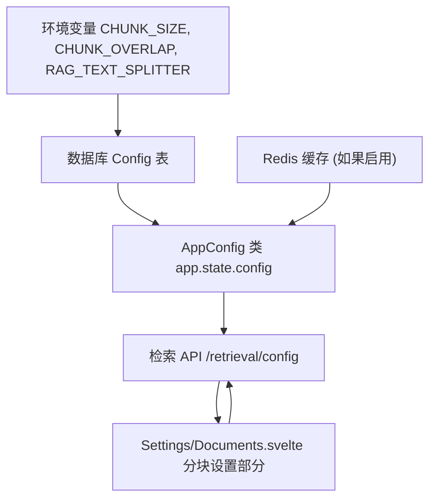
**来源：** [backend/open_webui/config.py1-50](https://github.com/open-webui/open-webui/blob/a7271532/backend/open_webui/config.py#L1-L50) [backend/open_webui/main.py888-893](https://github.com/open-webui/open-webui/blob/a7271532/backend/open_webui/main.py#L888-L893) [backend/open_webui/routers/retrieval.py249-261](https://github.com/open-webui/open-webui/blob/a7271532/backend/open_webui/routers/retrieval.py#L249-L261) [backend/open_webui/routers/retrieval.py443-504](https://github.com/open-webui/open-webui/blob/a7271532/backend/open_webui/routers/retrieval.py#L443-L504)

## 文本分割器类型

Open WebUI 使用 LangChain 的文本分割器实现来处理不同的文档结构和需求。

### 递归字符文本分割器 (Recursive Character Text Splitter)

这是默认且功能最全的分割器，它递归地尝试不同的分隔符以查找自然断点。

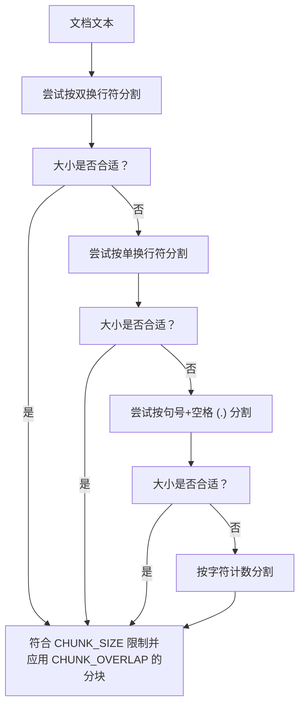
**特性：**

-   按顺序递归尝试分隔符：`["\n\n", "\n", " ", ""]`。
-   尝试保留段落和句子的边界。
-   如有必要，回退到字符级分割。
-   最适合通用的文本测试。

**来源：** [backend/open_webui/routers/retrieval.py32-36](https://github.com/open-webui/open-webui/blob/a7271532/backend/open_webui/routers/retrieval.py#L32-L36)

### Token 文本分割器 (Token Text Splitter)

使用 tiktoken 进行分词，根据 Token 数量而非字符数来分割文本，确保块的大小符合模型的 Token 限制。

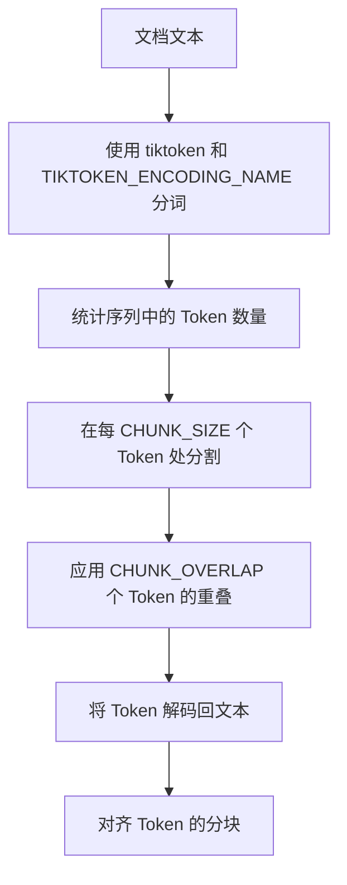
**特性：**

-   按 Token 数量分割，而非字符数。
-   确保与嵌入模型的 Token 限制兼容。
-   使用 tiktoken 编码（例如针对 GPT-4 的 `"cl100k_base"`）。
-   对于基于 Transformer 的模型更为精确。
-   Token 计数直接对应模型输入大小。

**配置：**

-   Token 计数由 `TIKTOKEN_ENCODING_NAME` 决定。
-   常用编码：`"cl100k_base"` (GPT-4), `"p50k_base"` (GPT-3)。

**来源：** [backend/open_webui/routers/retrieval.py32-36](https://github.com/open-webui/open-webui/blob/a7271532/backend/open_webui/routers/retrieval.py#L32-L36) [backend/open_webui/config.py889](https://github.com/open-webui/open-webui/blob/a7271532/backend/open_webui/config.py#L889-L889) [backend/open_webui/main.py889](https://github.com/open-webui/open-webui/blob/a7271532/backend/open_webui/main.py#L889-L889)

### Markdown 标题文本分割器 (Markdown Header Text Splitter)

专门用于通过标题边界分割来保留 Markdown 文档结构的分割器。

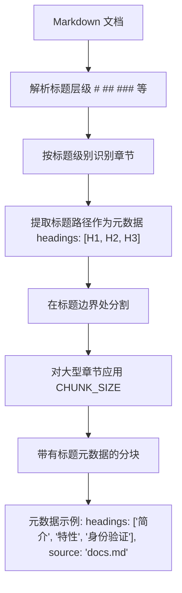
**特性：**

-   在 Markdown 标题（`#`, `##`, `###` 等）处分割。
-   在分块元数据中保留文档层级结构。
-   将标题路径存储为 `metadata["headings"]` 列表。
-   非常适合结构化文档和 API 文档。
-   维护文档的语义结构。

**元数据增强：** 标题路径存储在分块元数据中，并在混合搜索期间用于提高检索相关性（参见 [检索策略](/open-webui/open-webui/7.6-retrieval-strategies)）。

**来源：** [backend/open_webui/routers/retrieval.py32-36](https://github.com/open-webui/open-webui/blob/a7271532/backend/open_webui/routers/retrieval.py#L32-L36) [backend/open_webui/retrieval/utils.py189-193](https://github.com/open-webui/open-webui/blob/a7271532/backend/open_webui/retrieval/utils.py#L189-L193)

## 文档流水线中的分块

文本分割过程集成在更广泛的文档摄取流水线中，该流水线处理上传的文件和网页抓取的内容。

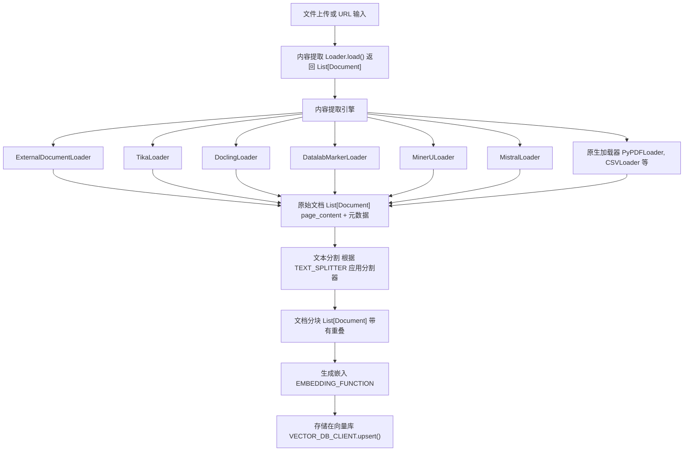
**来源：** [backend/open_webui/retrieval/loaders/main.py184-201](https://github.com/open-webui/open-webui/blob/a7271532/backend/open_webui/retrieval/loaders/main.py#L184-L201) [backend/open_webui/routers/retrieval.py32-36](https://github.com/open-webui/open-webui/blob/a7271532/backend/open_webui/routers/retrieval.py#L32-L36)

## 分块重叠策略

分块重叠通过包含前一个块的滑动窗口文本，防止在分块边界处发生信息丢失。

```text
文档内容: "The quick brown fox jumps over the lazy dog. The dog was sleeping under a tree."

CHUNK_SIZE = 40 字符
CHUNK_OVERLAP = 10 字符

分块 1: "The quick brown fox jumps over the l"
        |----------- 40 字符 -----------|

分块 2:              "over the lazy dog. The dog was slee"
        |--10 字符重叠--|---- 30 个新字符 ----|

分块 3:                            "dog was sleeping under a tree."
                        |--10 字符重叠--|-- 剩余字符 --|
```
**可视化表示：**

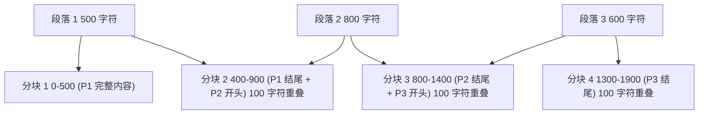
**重叠的好处：**

1.  **防止上下文丢失**：跨越分块边界被切分的句子或概念仍可被检索到。
2.  **提高检索率**：多个分块可能包含相同的关键信息，增加了召回率。
3.  **保持连贯性**：重叠的上下文有助于 LLM 理解分块之间的关系。

**权衡：**

-   增加了存储需求（重复文本）。
-   嵌入过程中需要处理更多分块。
-   计算成本更高。

**来源：** [backend/open_webui/config.py252-253](https://github.com/open-webui/open-webui/blob/a7271532/backend/open_webui/config.py#L252-L253) [backend/open_webui/main.py892](https://github.com/open-webui/open-webui/blob/a7271532/backend/open_webui/main.py#L892-L892)

## 混合搜索的文本增强

启用混合搜索后，分块元数据会富集额外的上下文，以提高 BM25（基于关键词）检索的性能。

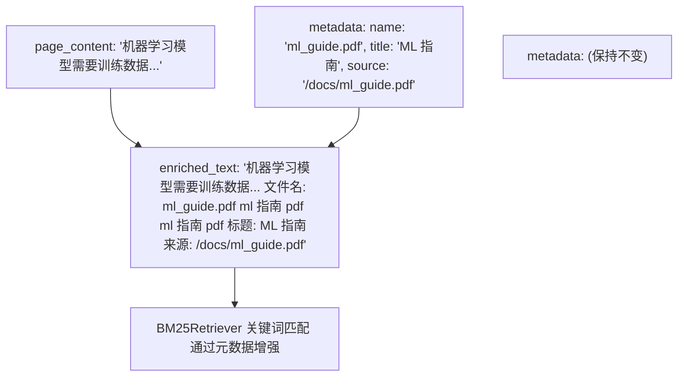
**增强过程：**

[backend/open_webui/retrieval/utils.py170-205](https://github.com/open-webui/open-webui/blob/a7271532/backend/open_webui/retrieval/utils.py#L170-L205) 中的 `get_enriched_texts()` 函数将元数据字段添加到分块文本中：

1.  **文件名** (重复两次以增加权重)。
2.  **标题** (如果可用)。
3.  **章节标题** (来自 Markdown 分割器元数据)。
4.  **来源 URL/路径**。
5.  **片段 (Snippet)** (针对联网搜索结果)。

该增强发生在以下情况：

-   启用了 `ENABLE_RAG_HYBRID_SEARCH`。
-   启用了 `ENABLE_RAG_HYBRID_SEARCH_ENRICHED_TEXTS`。
-   使用 `query_doc_with_hybrid_search()` 进行查询。

**来源：** [backend/open_webui/retrieval/utils.py170-205](https://github.com/open-webui/open-webui/blob/a7271532/backend/open_webui/retrieval/utils.py#L170-L205) [backend/open_webui/retrieval/utils.py240-244](https://github.com/open-webui/open-webui/blob/a7271532/backend/open_webui/retrieval/utils.py#L240-L244)

## 分割器选择与使用

文本分割器根据 `TEXT_SPLITTER` 配置值进行选择，并在处理文档时实例化。

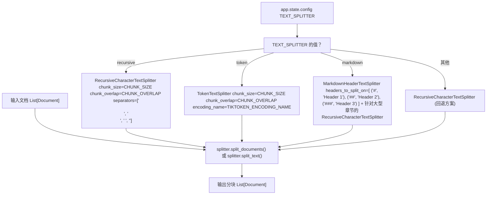
**实现说明**：虽然配置通过 `TEXT_SPLITTER` 公开了分割器选择，但在提供的文件中，这些分割器的实际实例化和使用发生在已被截断的文档处理代码中。分割器是从 `langchain_text_splitters` 导入的，见 [backend/open_webui/routers/retrieval.py32-36](https://github.com/open-webui/open-webui/blob/a7271532/backend/open_webui/routers/retrieval.py#L32-L36)。

**来源：** [backend/open_webui/routers/retrieval.py32-36](https://github.com/open-webui/open-webui/blob/a7271532/backend/open_webui/routers/retrieval.py#L32-L36) [backend/open_webui/config.py888-890](https://github.com/open-webui/open-webui/blob/a7271532/backend/open_webui/config.py#L888-L890) [backend/open_webui/routers/retrieval.py496-498](https://github.com/open-webui/open-webui/blob/a7271532/backend/open_webui/routers/retrieval.py#L496-L498)

## 与嵌入的集成

文本分割后，分块将为嵌入生成做准备。分块后的文档带着适当的批处理大小流入嵌入系统。

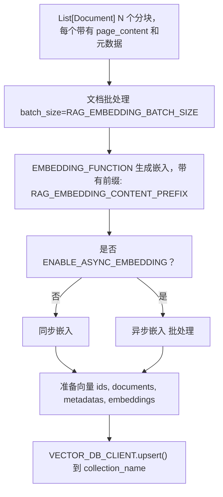
**嵌入过程：**

1.  根据 `RAG_EMBEDDING_BATCH_SIZE` 对分块进行批处理。
2.  在分块文本前添加 `RAG_EMBEDDING_CONTENT_PREFIX`（如果已配置）。
3.  嵌入函数生成向量表示。
4.  向量连同分块元数据一起存储在向量数据库中。

**批处理大小考量：**

-   较小的批次：内存占用较低，但 API 调用次数较多。
-   较大的批次：吞吐量较高，但内存占用较高。
-   默认值：1 (保守设置，适用于所有系统)。

**来源：** [backend/open_webui/main.py894-897](https://github.com/open-webui/open-webui/blob/a7271532/backend/open_webui/main.py#L894-L897) [backend/open_webui/config.py234-235](https://github.com/open-webui/open-webui/blob/a7271532/backend/open_webui/config.py#L234-L235) [backend/open_webui/routers/retrieval.py258-260](https://github.com/open-webui/open-webui/blob/a7271532/backend/open_webui/routers/retrieval.py#L258-L260)

## 通过管理员 UI 进行配置

分块设置在管理员设置界面中公开，允许在不更改代码的情况下进行运行时配置。

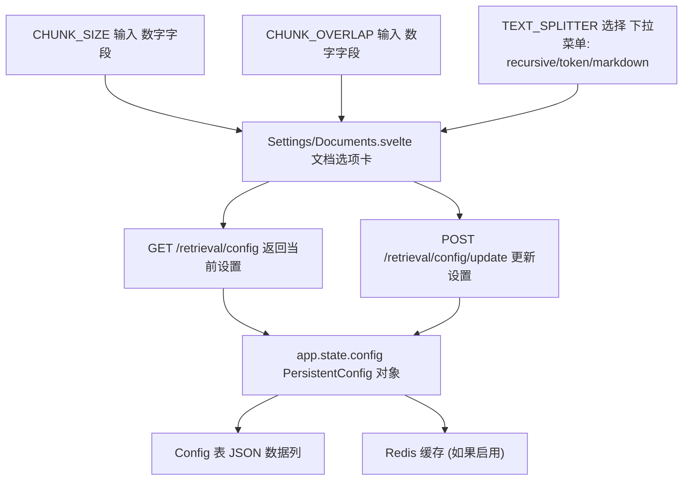
**配置流程：**

1.  管理员打开“设置” -> “文档”。
2.  UI 通过 `GET /retrieval/config` 获取当前配置。
3.  管理员修改 CHUNK_SIZE, CHUNK_OVERLAP, 或 TEXT_SPLITTER。
4.  保存时，`POST /retrieval/config/update` 将更改持久化。
5.  更改立即对新上传的文档生效。
6.  已有的嵌入文档不会自动重新分块。

**重要提示**：更改分块参数不会自动重新处理现有文档。要将新设置应用于现有文件，请使用管理员设置中的“重新索引知识库文件 (Reindex Knowledge Files)”功能。

**来源：** [src/lib/components/admin/Settings/Documents.svelte1-274](https://github.com/open-webui/open-webui/blob/a7271532/src/lib/components/admin/Settings/Documents.svelte#L1-L274) [backend/open_webui/routers/retrieval.py443-504](https://github.com/open-webui/open-webui/blob/a7271532/backend/open_webui/routers/retrieval.py#L443-L504) [src/lib/apis/retrieval/index.ts3-91](https://github.com/open-webui/open-webui/blob/a7271532/src/lib/apis/retrieval/index.ts#L3-L91)

## 最佳实践

### 选择块大小 (Chunk Size)

| 文档类型 | 建议的 CHUNK_SIZE | 理由 |
| --- | --- | --- |
| 技术文档 | 1000-1500 字符 | 保留代码块和技术解释 |
| 通用文章 | 1500-2000 字符 | 保持段落级的连贯性 |
| 聊天记录 / 对话 | 500-1000 字符 | 保持单次交流的完整性 |
| 学术论文 | 2000-3000 字符 | 保留复杂的论证和引用 |
| 代码文件 | 1000-1500 字符 | 将函数/类定义保持在一起 |

### 选择块重叠 (Chunk Overlap)

**一般规则：** 将重叠设置为块大小的 10-15%。

-   太小 (<5%)：面临在边界处丢失上下文的风险。
-   太大 (>30%)：产生过度冗余，浪费存储空间。
-   最佳点：CHUNK_SIZE 的 10-20%。

**示例：**

-   CHUNK_SIZE=1500 → CHUNK_OVERLAP=150-225
-   CHUNK_SIZE=2000 → CHUNK_OVERLAP=200-300

### 选择文本分割器

| 分割器 | 最佳适用 | 避免使用 |
| --- | --- | --- |
| `recursive` | 通用文档、混合内容 | 具有严格格式的高度结构化文档 |
| `token` | 精确的 Token 控制、配合特定模型使用 | 通用场景（不必要的精确度开销） |
| `markdown_header` | 技术文档、维基、结构化 Markdown | 非结构化文本、非 Markdown 文档 |

**来源：** [backend/open_webui/routers/retrieval.py32-36](https://github.com/open-webui/open-webui/blob/a7271532/backend/open_webui/routers/retrieval.py#L32-L36) [backend/open_webui/config.py888-893](https://github.com/open-webui/open-webui/blob/a7271532/backend/open_webui/config.py#L888-L893)
