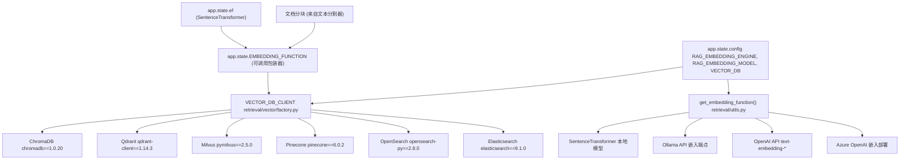
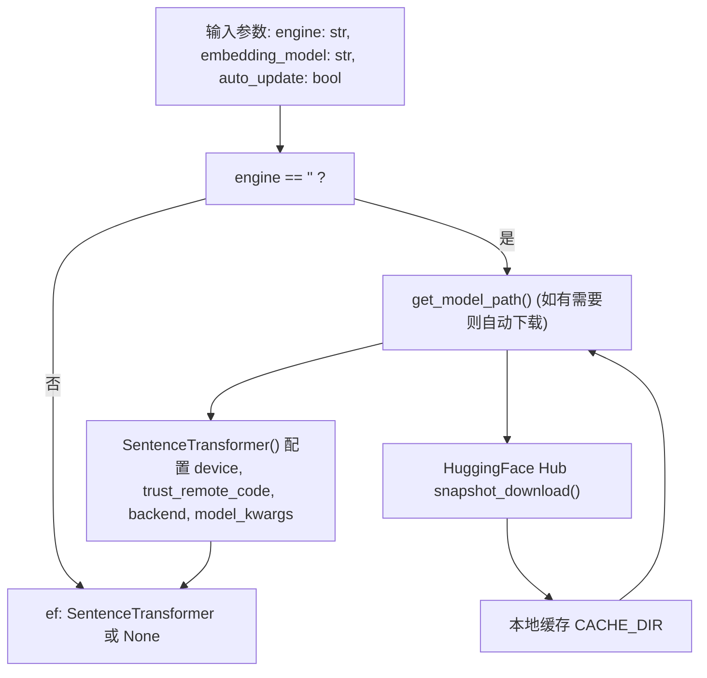
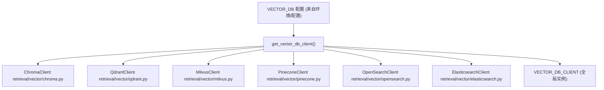
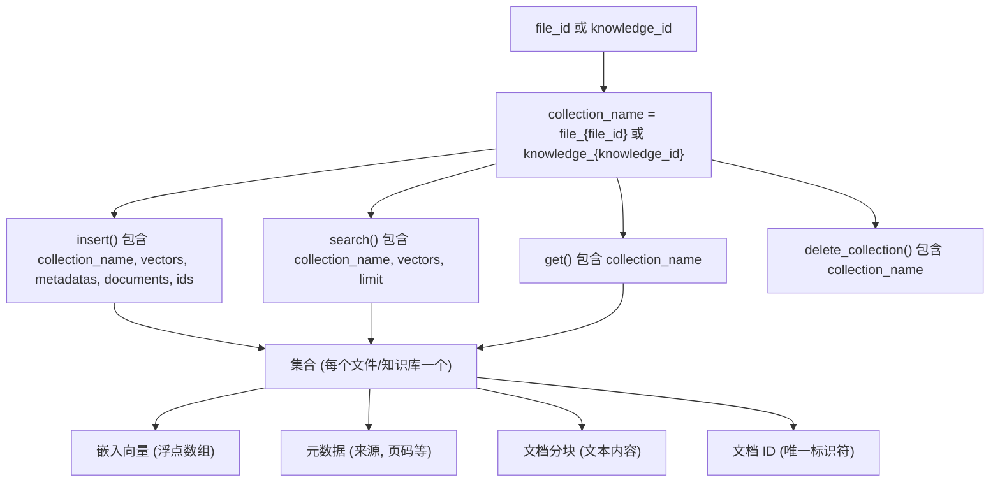
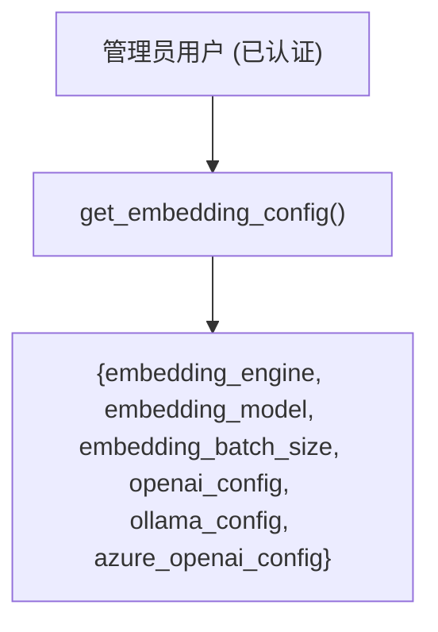
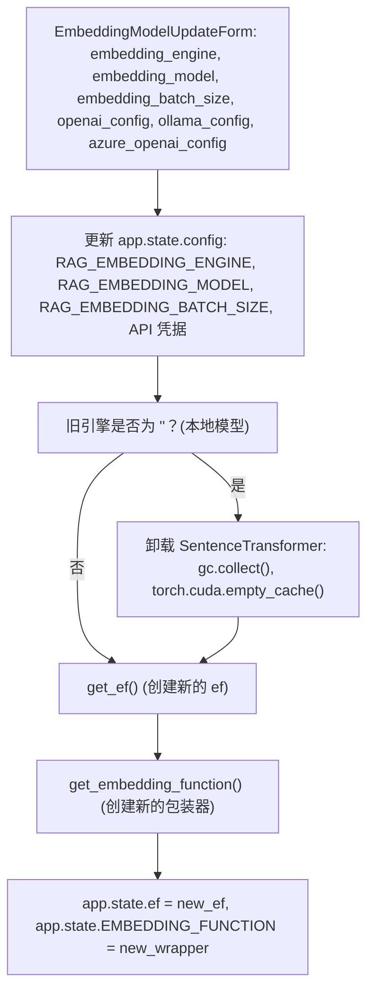
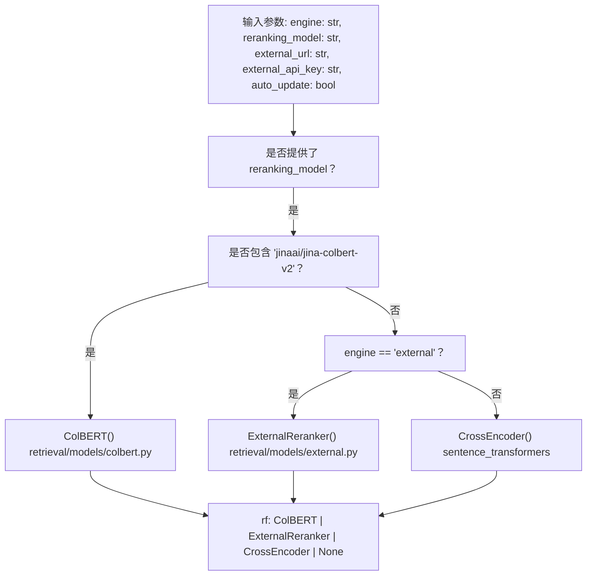
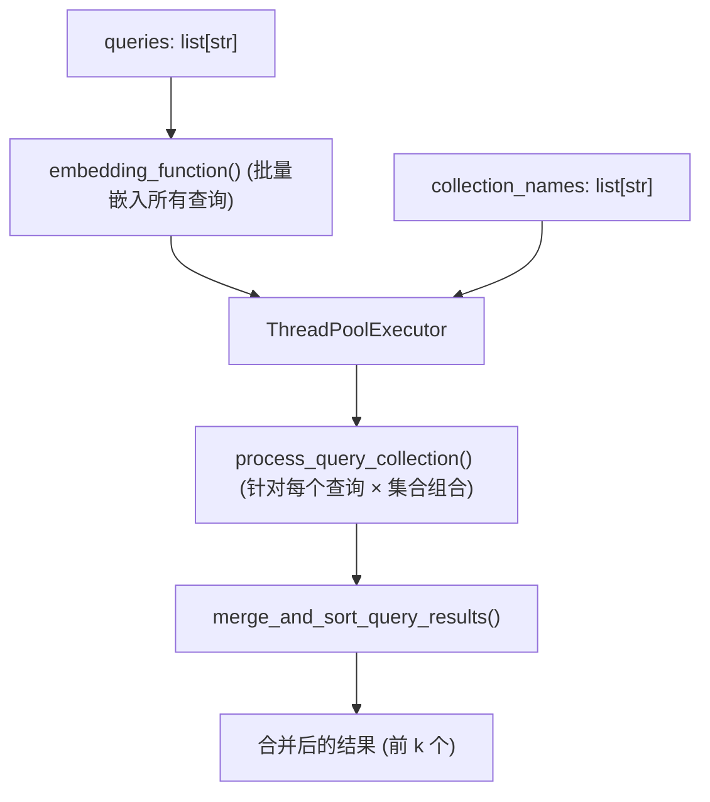

# 嵌入与向量存储

相关源文件

-   [backend/open\_webui/config.py](https://github.com/open-webui/open-webui/blob/a7271532/backend/open_webui/config.py)
-   [backend/open\_webui/main.py](https://github.com/open-webui/open-webui/blob/a7271532/backend/open_webui/main.py)
-   [backend/open\_webui/retrieval/loaders/datalab\_marker.py](https://github.com/open-webui/open-webui/blob/a7271532/backend/open_webui/retrieval/loaders/datalab_marker.py)
-   [backend/open\_webui/retrieval/loaders/external\_document.py](https://github.com/open-webui/open-webui/blob/a7271532/backend/open_webui/retrieval/loaders/external_document.py)
-   [backend/open\_webui/retrieval/loaders/external\_web.py](https://github.com/open-webui/open-webui/blob/a7271532/backend/open_webui/retrieval/loaders/external_web.py)
-   [backend/open\_webui/retrieval/loaders/main.py](https://github.com/open-webui/open-webui/blob/a7271532/backend/open_webui/retrieval/loaders/main.py)
-   [backend/open\_webui/retrieval/loaders/mineru.py](https://github.com/open-webui/open-webui/blob/a7271532/backend/open_webui/retrieval/loaders/mineru.py)
-   [backend/open\_webui/retrieval/loaders/mistral.py](https://github.com/open-webui/open-webui/blob/a7271532/backend/open_webui/retrieval/loaders/mistral.py)
-   [backend/open\_webui/retrieval/utils.py](https://github.com/open-webui/open-webui/blob/a7271532/backend/open_webui/retrieval/utils.py)
-   [backend/open\_webui/routers/retrieval.py](https://github.com/open-webui/open-webui/blob/a7271532/backend/open_webui/routers/retrieval.py)
-   [backend/open\_webui/utils/middleware.py](https://github.com/open-webui/open-webui/blob/a7271532/backend/open_webui/utils/middleware.py)
-   [src/lib/apis/retrieval/index.ts](https://github.com/open-webui/open-webui/blob/a7271532/src/lib/apis/retrieval/index.ts)
-   [src/lib/components/admin/Settings/Documents.svelte](https://github.com/open-webui/open-webui/blob/a7271532/src/lib/components/admin/Settings/Documents.svelte)
-   [src/lib/components/admin/Settings/WebSearch.svelte](https://github.com/open-webui/open-webui/blob/a7271532/src/lib/components/admin/Settings/WebSearch.svelte)

本页记录了 Open WebUI RAG 流水线中的嵌入生成与向量存储子系统。内容涵盖了嵌入引擎（本地、Ollama、OpenAI、Azure OpenAI）、嵌入模型、向量数据库选项（ChromaDB、Qdrant、Milvus、Pinecone、OpenSearch、Elasticsearch）以及将它们结合在一起的配置系统。

有关嵌入之前的文档处理信息，请参阅 [文档摄取流水线](/open-webui/open-webui/7.1-document-ingestion-pipeline)。有关使用这些嵌入的检索策略，请参阅 [检索策略](/open-webui/open-webui/7.6-retrieval-strategies)。

## 系统架构

嵌入与向量存储系统由三个主要层级组成：嵌入生成、向量存储和配置管理。该系统支持多种嵌入引擎和六种不同的向量数据库后端。

### 嵌入与存储流程


**来源：** [backend/open\_webui/main.py952-1010](https://github.com/open-webui/open-webui/blob/a7271532/backend/open_webui/main.py#L952-L1010) [backend/open\_webui/retrieval/utils.py](https://github.com/open-webui/open-webui/blob/a7271532/backend/open_webui/retrieval/utils.py) [backend/open\_webui/retrieval/vector/factory.py](https://github.com/open-webui/open-webui/blob/a7271532/backend/open_webui/retrieval/vector/factory.py)

## 嵌入引擎与模型

### 嵌入引擎配置

Open WebUI 支持四种嵌入引擎，通过 `RAG_EMBEDDING_ENGINE` 进行配置：

| 引擎 | 值 | 描述 | 所需配置 |
| --- | --- | --- | --- |
| 本地 | `""` (空字符串) | 在本地运行的 SentenceTransformer 模型 | 模型名称/路径 |
| Ollama | `"ollama"` | Ollama 嵌入 API | `RAG_OLLAMA_BASE_URL`, `RAG_OLLAMA_API_KEY` |
| OpenAI | `"openai"` | OpenAI 嵌入 API | `RAG_OPENAI_API_BASE_URL`, `RAG_OPENAI_API_KEY` |
| Azure OpenAI | `"azure_openai"` | Azure OpenAI 部署 | `RAG_AZURE_OPENAI_BASE_URL`, `RAG_AZURE_OPENAI_API_KEY`, `RAG_AZURE_OPENAI_API_VERSION` |

**来源：** [backend/open\_webui/config.py](https://github.com/open-webui/open-webui/blob/a7271532/backend/open_webui/config.py) [backend/open\_webui/main.py858-877](https://github.com/open-webui/open-webui/blob/a7271532/backend/open_webui/main.py#L858-L877)

### 本地嵌入初始化


[backend/open\_webui/routers/retrieval.py120-141](https://github.com/open-webui/open-webui/blob/a7271532/backend/open_webui/routers/retrieval.py#L120-L141) 中的 `get_ef()` 函数初始化本地嵌入模型：

-   使用来自 `sentence-transformers` 库的 `SentenceTransformer`。
-   如果需要，自动从 HuggingFace Hub 下载模型。
-   配置设备放置 (`DEVICE_TYPE`：cpu/cuda/mps)。
-   为自定义模型遵循 `RAG_EMBEDDING_MODEL_TRUST_REMOTE_CODE` 设置。
-   通过 `SENTENCE_TRANSFORMERS_BACKEND` 支持自定义后端。

**来源：** [backend/open\_webui/routers/retrieval.py120-141](https://github.com/open-webui/open-webui/blob/a7271532/backend/open_webui/routers/retrieval.py#L120-L141) [backend/open\_webui/retrieval/utils.py46-81](https://github.com/open-webui/open-webui/blob/a7271532/backend/open_webui/retrieval/utils.py#L46-L81) [backend/open\_webui/env.py](https://github.com/open-webui/open-webui/blob/a7271532/backend/open_webui/env.py)

### 嵌入函数包装器

主应用程序在 [backend/open\_webui/main.py976-1004](https://github.com/open-webui/open-webui/blob/a7271532/backend/open_webui/main.py#L976-L1004) 创建了一个统一的嵌入函数接口：

```python
app.state.EMBEDDING_FUNCTION = get_embedding_function(
    engine=app.state.config.RAG_EMBEDDING_ENGINE,
    embedding_model=app.state.config.RAG_EMBEDDING_MODEL,
    embedding_function=app.state.ef,  # 本地 SentenceTransformer 实例
    url=(...),  # 基于引擎的 API 基准 URL
    key=(...),  # 基于引擎的 API 密钥
    embedding_batch_size=app.state.config.RAG_EMBEDDING_BATCH_SIZE,
    azure_api_version=(...)  # Azure 专用
)
```
该包装器处理：

-   嵌入的批处理。
-   针对查询 vs 文档的前缀注入 (`RAG_EMBEDDING_QUERY_PREFIX`, `RAG_EMBEDDING_CONTENT_PREFIX`)。
-   针对基于 API 的引擎传递用户上下文。
-   引擎特定的参数处理。

**来源：** [backend/open\_webui/main.py976-1004](https://github.com/open-webui/open-webui/blob/a7271532/backend/open_webui/main.py#L976-L1004) [backend/open\_webui/retrieval/utils.py](https://github.com/open-webui/open-webui/blob/a7271532/backend/open_webui/retrieval/utils.py)

### 嵌入前缀

系统支持前缀注入以提高检索质量：

| 前缀类型 | 配置变量 | 用法 |
| --- | --- | --- |
| 查询前缀 | `RAG_EMBEDDING_QUERY_PREFIX` | 添加到搜索查询中 |
| 内容前缀 | `RAG_EMBEDDING_CONTENT_PREFIX` | 在索引期间添加到文档分块中 |

这些前缀在 [backend/open\_webui/retrieval/utils.py52-82](https://github.com/open-webui/open-webui/blob/a7271532/backend/open_webui/retrieval/utils.py#L52-L82) 的 `VectorSearchRetriever` 类中应用。

**来源：** [backend/open\_webui/config.py](https://github.com/open-webui/open-webui/blob/a7271532/backend/open_webui/config.py) [backend/open\_webui/retrieval/utils.py52-82](https://github.com/open-webui/open-webui/blob/a7271532/backend/open_webui/retrieval/utils.py#L52-L82)

## 向量数据库存储

### 向量数据库工厂


向量数据库客户端通过 [backend/open\_webui/retrieval/vector/factory.py](https://github.com/open-webui/open-webui/blob/a7271532/backend/open_webui/retrieval/vector/factory.py) 中的工厂模式初始化为单例。`VECTOR_DB_CLIENT` 全局实例在整个应用程序中使用。

**来源：** [backend/open\_webui/retrieval/vector/factory.py](https://github.com/open-webui/open-webui/blob/a7271532/backend/open_webui/retrieval/vector/factory.py) [backend/requirements.txt60-67](https://github.com/open-webui/open-webui/blob/a7271532/backend/requirements.txt#L60-L67)

### 向量数据库选项

#### ChromaDB (默认)

```text
chromadb==1.0.20
```
-   Open WebUI 的**默认向量库**。
-   嵌入式数据库，无需独立服务器。
-   持久化存储在 `CHROMA_DATA_PATH` 中。
-   支持元数据过滤和距离度量。

**来源：** [backend/requirements.txt62](https://github.com/open-webui/open-webui/blob/a7271532/backend/requirements.txt#L62-L62)

#### Qdrant

```text
qdrant-client==1.14.3
```
-   高性能向量搜索引擎。
-   支持嵌入式和服务器两种模式。
-   先进的过滤能力。
-   需要配置 `QDRANT_URL`。

**来源：** [backend/requirements.txt64](https://github.com/open-webui/open-webui/blob/a7271532/backend/requirements.txt#L64-L64)

#### Milvus

```text
pymilvus==2.5.0
```
-   分布式向量数据库。
-   通过集合别名**支持多租户**。
-   可扩展用于大规模部署。
-   需要配置 `MILVUS_URI`。

**来源：** [backend/requirements.txt63](https://github.com/open-webui/open-webui/blob/a7271532/backend/requirements.txt#L63-L63)

#### Pinecone

```text
pinecone==6.0.2
```
-   托管式云向量数据库。
-   无服务器 (Serverless) 扩展。
-   需要 `PINECONE_API_KEY` 和 `PINECONE_ENVIRONMENT`。

**来源：** [backend/requirements.txt67](https://github.com/open-webui/open-webui/blob/a7271532/backend/requirements.txt#L67-L67)

#### OpenSearch

```text
opensearch-py==2.8.0
```
-   分布式搜索与分析引擎。
-   支持混合搜索 (BM25 + 向量)。
-   需要 OpenSearch 集群配置。

**来源：** [backend/requirements.txt61](https://github.com/open-webui/open-webui/blob/a7271532/backend/requirements.txt#L61-L61)

#### Elasticsearch

```text
elasticsearch==9.1.0
```
-   具有向量能力的分布式搜索引擎。
-   使用 HNSW 算法的稠密向量搜索。
-   需要 Elasticsearch 集群。

**来源：** [backend/requirements.txt66](https://github.com/open-webui/open-webui/blob/a7271532/backend/requirements.txt#L66-L66)

### 集合管理

向量数据库将嵌入组织成集合，每个知识库或文件都有自己的集合：


每个集合存储：

-   **向量 (Vectors)**：嵌入数组（维度由嵌入模型决定）。
-   **文档 (Documents)**：原始文本分块。
-   **元数据 (Metadatas)**：来源信息、页码、文件路径。
-   **ID**：每个分块的唯一标识符。

**来源：** [backend/open\_webui/retrieval/utils.py84-116](https://github.com/open-webui/open-webui/blob/a7271532/backend/open_webui/retrieval/utils.py#L84-L116) [backend/open\_webui/retrieval/vector/main.py](https://github.com/open-webui/open-webui/blob/a7271532/backend/open_webui/retrieval/vector/main.py)

## 嵌入 API 配置

### 嵌入配置端点


[backend/open\_webui/routers/retrieval.py231-251](https://github.com/open-webui/open-webui/blob/a7271532/backend/open_webui/routers/retrieval.py#L231-L251) 中的 GET 端点向管理员用户返回当前的嵌入配置。

**来源：** [backend/open\_webui/routers/retrieval.py231-251](https://github.com/open-webui/open-webui/blob/a7271532/backend/open_webui/routers/retrieval.py#L231-L251)

### 嵌入更新端点


[backend/open\_webui/routers/retrieval.py279-398](https://github.com/open-webui/open-webui/blob/a7271532/backend/open_webui/routers/retrieval.py#L279-L398) 中的更新端点处理嵌入模型的更改：

1.  如果从本地引擎切换，则**卸载旧模型**（释放显存 VRAM）。
2.  **更新配置**以匹配新引擎和模型。
3.  通过 `get_ef()` **初始化新的嵌入函数**。
4.  使用适当的 API 凭据**创建新的包装器**。
5.  使用新函数**更新应用程序状态**。

**来源：** [backend/open\_webui/routers/retrieval.py279-398](https://github.com/open-webui/open-webui/blob/a7271532/backend/open_webui/routers/retrieval.py#L279-L398)

### 前端配置界面

用于嵌入配置的管理员设置 UI 在 [src/lib/components/admin/Settings/Documents.svelte1-265](https://github.com/open-webui/open-webui/blob/a7271532/src/lib/components/admin/Settings/Documents.svelte#L1-L265) 中实现：

| UI 元素 | 配置变量 | 行号 |
| --- | --- | --- |
| 嵌入引擎下拉菜单 | `embeddingEngine` | 41 |
| 嵌入模型输入框 | `embeddingModel` | 42 |
| 批处理大小输入框 | `embeddingBatchSize` | 43 |
| OpenAI URL/密钥 | `OpenAIUrl`, `OpenAIKey` | 46-47 |
| Azure URL/密钥/版本 | `AzureOpenAIUrl`, `AzureOpenAIKey`, `AzureOpenAIVersion` | 49-51 |
| Ollama URL/密钥 | `OllamaUrl`, `OllamaKey` | 53-54 |

[src/lib/components/admin/Settings/Documents.svelte66-136](https://github.com/open-webui/open-webui/blob/a7271532/src/lib/components/admin/Settings/Documents.svelte#L66-L136) 中的 `embeddingModelUpdateHandler()` 执行验证并调用更新 API。

**来源：** [src/lib/components/admin/Settings/Documents.svelte1-265](https://github.com/open-webui/open-webui/blob/a7271532/src/lib/components/admin/Settings/Documents.svelte#L1-L265) [src/lib/apis/retrieval/index.ts155-229](https://github.com/open-webui/open-webui/blob/a7271532/src/lib/apis/retrieval/index.ts#L155-L229)

## 重排序模型 (Reranking Models)

### 重排序函数初始化


重排序函数支持三种类型：

1.  **ColBERT** ([colbert-ai==0.2.21](https://github.com/open-webui/open-webui/blob/a7271532/backend/requirements.txt#L77))：用于精确重排序的多向量检索模型。
2.  **外部重排序器 (External Reranker)**：基于 HTTP API 的重排序服务。
3.  **CrossEncoder**：通过 sentence-transformers 实现的本地重排序模型。

**来源：** [backend/open\_webui/routers/retrieval.py143-192](https://github.com/open-webui/open-webui/blob/a7271532/backend/open_webui/routers/retrieval.py#L143-L192) [backend/requirements.txt77](https://github.com/open-webui/open-webui/blob/a7271532/backend/requirements.txt#L77-L77)

### 重排序集成

重排序函数在 [backend/open\_webui/main.py1006-1010](https://github.com/open-webui/open-webui/blob/a7271532/backend/open_webui/main.py#L1006-L1010) 中初始化：

```python
app.state.RERANKING_FUNCTION = get_reranking_function(
    app.state.config.RAG_RERANKING_ENGINE,
    app.state.config.RAG_RERANKING_MODEL,
    reranking_function=app.state.rf,
)
```
这用于混合搜索场景（参见 [检索策略](/open-webui/open-webui/7.6-retrieval-strategies)），以便在初始检索后提高排名质量。

**来源：** [backend/open\_webui/main.py1006-1010](https://github.com/open-webui/open-webui/blob/a7271532/backend/open_webui/main.py#L1006-L1010) [backend/open\_webui/retrieval/utils.py118-207](https://github.com/open-webui/open-webui/blob/a7271532/backend/open_webui/retrieval/utils.py#L118-L207)

## 批处理与优化

### 嵌入批处理大小

`RAG_EMBEDDING_BATCH_SIZE` 配置控制在单个 API 调用或 GPU 批次中嵌入多少文档：

-   **默认值**：1（一次处理一个）。
-   **API 引擎**：减少 API 调用次数并提高吞吐量。
-   **本地模型**：优化 GPU 利用率。

在 [backend/open\_webui/main.py998](https://github.com/open-webui/open-webui/blob/a7271532/backend/open_webui/main.py#L998-L998) 处配置并传递给嵌入函数包装器。

**来源：** [backend/open\_webui/main.py998](https://github.com/open-webui/open-webui/blob/a7271532/backend/open_webui/main.py#L998-L998) [backend/open\_webui/config.py](https://github.com/open-webui/open-webui/blob/a7271532/backend/open_webui/config.py)

### 并行查询处理

当查询多个集合时，系统使用 `ThreadPoolExecutor` 进行并行处理：


[backend/open\_webui/retrieval/utils.py287-336](https://github.com/open-webui/open-webui/blob/a7271532/backend/open_webui/retrieval/utils.py#L287-L336) 中的 `query_collection()` 函数：

1.  在单个批次中生成所有查询嵌入。
2.  跨所有“集合 × 查询”组合启动并行查询。
3.  合并结果并去重。
4.  按相关性排序并返回前 k 个结果。

**来源：** [backend/open\_webui/retrieval/utils.py287-336](https://github.com/open-webui/open-webui/blob/a7271532/backend/open_webui/retrieval/utils.py#L287-L336)

## 存储与内存管理

### 本地模型的显存 (VRAM) 管理

当从本地嵌入模型切换时，系统会显式清理 GPU 内存：

```python
if request.app.state.config.RAG_EMBEDDING_ENGINE == "":
    # 卸载当前的内部嵌入模型
    request.app.state.ef = None
    request.app.state.EMBEDDING_FUNCTION = None
    import gc
    gc.collect()
    if DEVICE_TYPE == "cuda":
        import torch
        if torch.cuda.is_available():
            torch.cuda.empty_cache()
```
这可以防止在 [backend/open\_webui/routers/retrieval.py286-297](https://github.com/open-webui/open-webui/blob/a7271532/backend/open_webui/routers/retrieval.py#L286-L297) 处更改模型时出现显存耗尽的情况。

**来源：** [backend/open\_webui/routers/retrieval.py286-297](https://github.com/open-webui/open-webui/blob/a7271532/backend/open_webui/routers/retrieval.py#L286-L297)

### 模型缓存

本地嵌入模型缓存在 `CACHE_DIR` 中，以避免重复下载。`get_model_path()` 函数负责：

-   检查本地缓存。
-   如果需要，从 HuggingFace Hub 下载。
-   根据 `RAG_EMBEDDING_MODEL_AUTO_UPDATE` 进行自动更新。

**来源：** [backend/open\_webui/retrieval/utils.py](https://github.com/open-webui/open-webui/blob/a7271532/backend/open_webui/retrieval/utils.py) [backend/open\_webui/config.py](https://github.com/open-webui/open-webui/blob/a7271532/backend/open_webui/config.py)

## 配置总结

### 环境变量

| 变量 | 用途 | 默认值 |
| --- | --- | --- |
| `RAG_EMBEDDING_ENGINE` | 嵌入引擎选择 | `""` (本地) |
| `RAG_EMBEDDING_MODEL` | 模型名称/路径 | 必需 |
| `RAG_EMBEDDING_BATCH_SIZE` | 嵌入批处理大小 | 1 |
| `RAG_EMBEDDING_QUERY_PREFIX` | 查询嵌入的前缀 | `""` |
| `RAG_EMBEDDING_CONTENT_PREFIX` | 文档嵌入的前缀 | `""` |
| `RAG_OPENAI_API_BASE_URL` | OpenAI API 基准 URL | - |
| `RAG_OPENAI_API_KEY` | OpenAI API 密钥 | - |
| `RAG_OLLAMA_BASE_URL` | Ollama API 基准 URL | - |
| `RAG_OLLAMA_API_KEY` | Ollama API 密钥 | - |
| `RAG_AZURE_OPENAI_BASE_URL` | Azure OpenAI 端点 | - |
| `RAG_AZURE_OPENAI_API_KEY` | Azure OpenAI 密钥 | - |
| `RAG_AZURE_OPENAI_API_VERSION` | Azure API 版本 | - |
| `RAG_RERANKING_ENGINE` | 重排序引擎 | `""` |
| `RAG_RERANKING_MODEL` | 重排序模型 | - |
| `RAG_EXTERNAL_RERANKER_URL` | 外部重排序器 URL | - |
| `RAG_EXTERNAL_RERANKER_API_KEY` | 外部重排序器密钥 | - |
| `VECTOR_DB` | 向量数据库选择 | `"chroma"` |

**来源：** [backend/open\_webui/config.py](https://github.com/open-webui/open-webui/blob/a7271532/backend/open_webui/config.py) [backend/open\_webui/env.py](https://github.com/open-webui/open-webui/blob/a7271532/backend/open_webui/env.py)

### 应用状态变量

主应用程序维护以下状态变量：

| 状态变量 | 类型 | 用途 |
| --- | --- | --- |
| `app.state.ef` | `SentenceTransformer | None` | 本地嵌入模型实例 |
| `app.state.EMBEDDING_FUNCTION` | `Callable` | 统一的嵌入函数包装器 |
| `app.state.rf` | `ColBERT | CrossEncoder | None` | 重排序模型实例 |
| `app.state.RERANKING_FUNCTION` | `Callable` | 统一的重排序函数包装器 |
| `VECTOR_DB_CLIENT` | `VectorDBClient` | 全局向量数据库客户端实例 |

**来源：** [backend/open\_webui/main.py944-1010](https://github.com/open-webui/open-webui/blob/a7271532/backend/open_webui/main.py#L944-L1010) [backend/open\_webui/retrieval/vector/factory.py](https://github.com/open-webui/open-webui/blob/a7271532/backend/open_webui/retrieval/vector/factory.py)
