# 检索策略

相关源文件

-   [backend/open\_webui/config.py](https://github.com/open-webui/open-webui/blob/a7271532/backend/open_webui/config.py)
-   [backend/open\_webui/main.py](https://github.com/open-webui/open-webui/blob/a7271532/backend/open_webui/main.py)
-   [backend/open\_webui/retrieval/loaders/datalab\_marker.py](https://github.com/open-webui/open-webui/blob/a7271532/backend/open_webui/retrieval/loaders/datalab_marker.py)
-   [backend/open\_webui/retrieval/loaders/external\_document.py](https://github.com/open-webui/open-webui/blob/a7271532/backend/open_webui/retrieval/loaders/external_document.py)
-   [backend/open\_webui/retrieval/loaders/external\_web.py](https://github.com/open-webui/open-webui/blob/a7271532/backend/open_webui/retrieval/loaders/external_web.py)
-   [backend/open\_webui/retrieval/loaders/main.py](https://github.com/open-webui/open-webui/blob/a7271532/backend/open_webui/retrieval/loaders/main.py)
-   [backend/open\_webui/retrieval/loaders/mineru.py](https://github.com/open-webui/open-webui/blob/a7271532/backend/open_webui/retrieval/loaders/mineru.py)
-   [backend/open\_webui/retrieval/loaders/mistral.py](https://github.com/open-webui/open-webui/blob/a7271532/backend/open_webui/retrieval/loaders/mistral.py)
-   [backend/open\_webui/retrieval/utils.py](https://github.com/open-webui/open-webui/blob/a7271532/backend/open_webui/retrieval/utils.py)
-   [backend/open\_webui/routers/retrieval.py](https://github.com/open-webui/open-webui/blob/a7271532/backend/open_webui/routers/retrieval.py)
-   [backend/open\_webui/utils/middleware.py](https://github.com/open-webui/open-webui/blob/a7271532/backend/open_webui/utils/middleware.py)
-   [src/lib/apis/retrieval/index.ts](https://github.com/open-webui/open-webui/blob/a7271532/src/lib/apis/retrieval/index.ts)
-   [src/lib/components/admin/Settings/Documents.svelte](https://github.com/open-webui/open-webui/blob/a7271532/src/lib/components/admin/Settings/Documents.svelte)
-   [src/lib/components/admin/Settings/WebSearch.svelte](https://github.com/open-webui/open-webui/blob/a7271532/src/lib/components/admin/Settings/WebSearch.svelte)

## 目的与范围

本文档涵盖了 Open WebUI RAG (检索增强生成) 系统中使用的检索策略。它描述了系统如何查询向量数据库以查找相关的文档分块，包括向量搜索、结合 BM25 和嵌入向量的混合搜索、文本增强以及重排序技术。

有关文档处理和嵌入生成的信息，请参阅 [嵌入与向量存储](/open-webui/open-webui/6.2-chat-request-processing-flow)。有关检索到的内容如何注入聊天提示词的详情，请参阅 [RAG 集成](/open-webui/open-webui/5.2-content-rendering-pipeline)。

## 检索架构概览

Open WebUI 实现了一个多阶段检索流水线，从广泛检索逐步进展到精确排名：

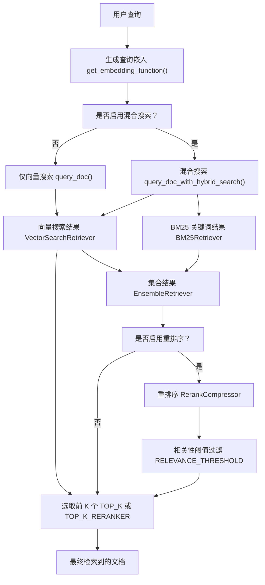
**来源：** [backend/open\_webui/retrieval/utils.py207-314](https://github.com/open-webui/open-webui/blob/a7271532/backend/open_webui/retrieval/utils.py#L207-L314) [backend/open\_webui/config.py832-850](https://github.com/open-webui/open-webui/blob/a7271532/backend/open_webui/config.py#L832-L850)

## 向量搜索

向量搜索是基准检索策略，利用查询嵌入和文档嵌入之间的语义相似度。

### VectorSearchRetriever 实现

系统实现了一个与 LangChain 兼容的检索器用于向量搜索：

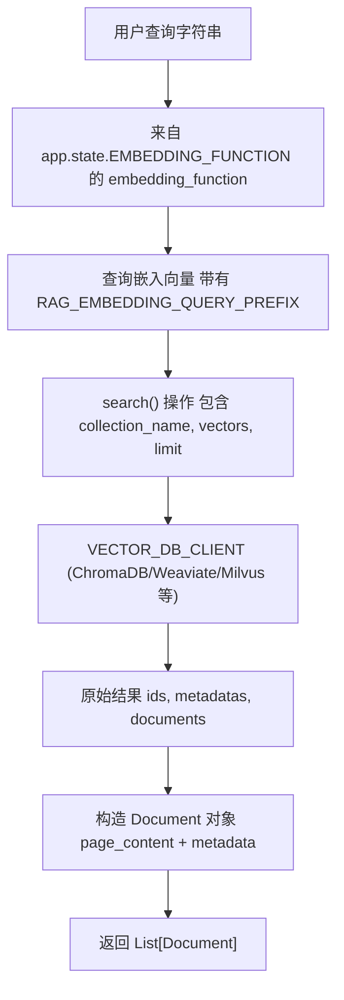
`VectorSearchRetriever` 类提供了异步向量搜索：

| 组件 | 代码实体 | 描述 |
| --- | --- | --- |
| 检索器类 | `VectorSearchRetriever` | LangChain BaseRetriever 的实现 |
| 异步方法 | `_aget_relevant_documents()` | 执行嵌入 + 向量搜索 |
| 嵌入 | `await self.embedding_function(query, RAG_EMBEDDING_QUERY_PREFIX)` | 生成带有前缀的查询嵌入 |
| 搜索调用 | `VECTOR_DB_CLIENT.search()` | 查询向量数据库 |
| 结果限制 | `self.top_k` | 要检索的结果数量 |

**来源：** [backend/open\_webui/retrieval/utils.py88-132](https://github.com/open-webui/open-webui/blob/a7271532/backend/open_webui/retrieval/utils.py#L88-L132) [backend/open\_webui/config.py218-237](https://github.com/open-webui/open-webui/blob/a7271532/backend/open_webui/config.py#L218-L237)

### 直接向量查询

对于简单的用例，`query_doc()` 函数提供了不使用 LangChain 抽象的直接向量搜索：

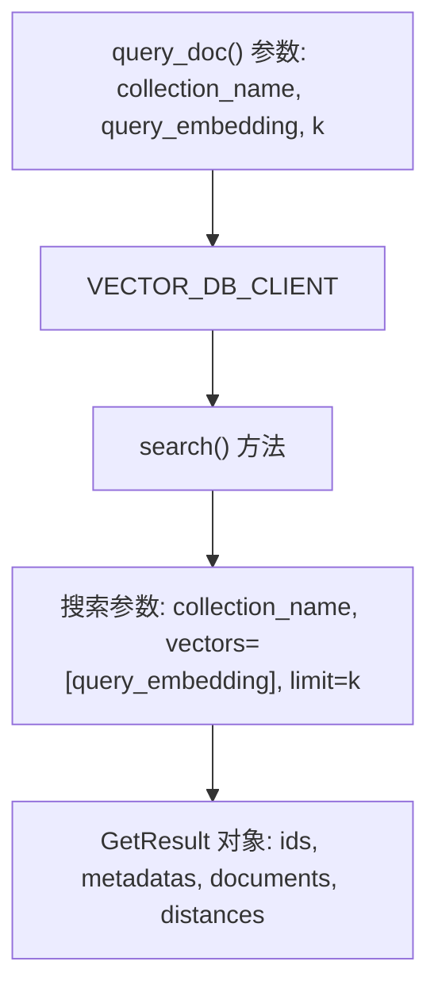
**来源：** [backend/open\_webui/retrieval/utils.py135-152](https://github.com/open-webui/open-webui/blob/a7271532/backend/open_webui/retrieval/utils.py#L135-L152)

## 混合搜索策略

混合搜索结合了语义向量搜索和基于关键词的 BM25 搜索，以提高检索质量。这解决了单纯向量搜索的局限性，因为它可能会遗漏精确的关键词匹配。

### 混合搜索流水线

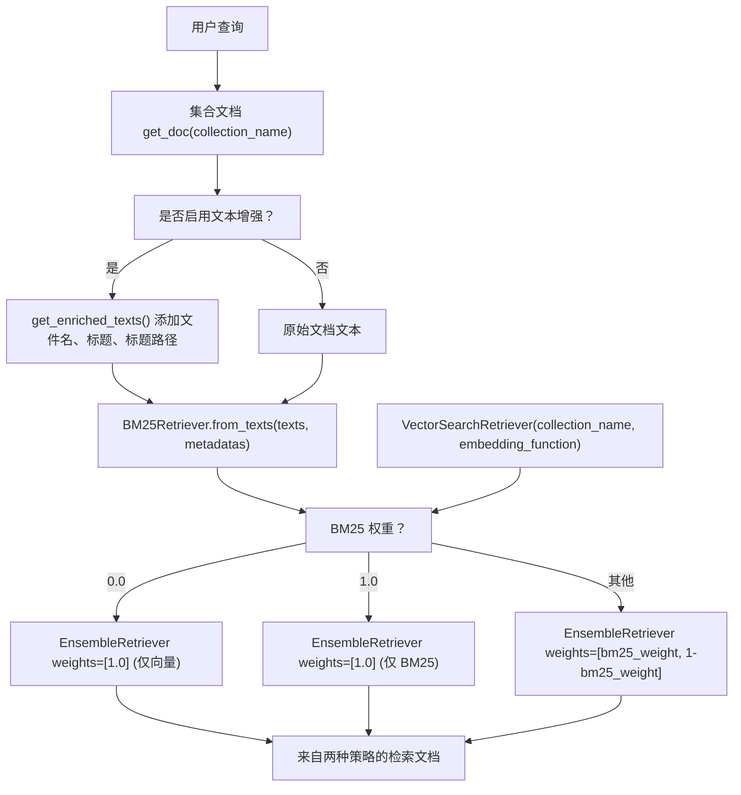
### 配置参数

| 参数 | 类型 | 默认值 | 用途 |
| --- | --- | --- | --- |
| `ENABLE_RAG_HYBRID_SEARCH` | boolean | 视情况而定 | 启用/禁用混合搜索 |
| `HYBRID_BM25_WEIGHT` | float | 可配置 | BM25 的权重 (0-1)，余下为向量权重 |
| `ENABLE_RAG_HYBRID_SEARCH_ENRICHED_TEXTS` | boolean | 视情况而定 | 为文本添加元数据以提升 BM25 效果 |
| `TOP_K` | integer | 4 | 重排序前的初始结果数 |
| `TOP_K_RERANKER` | integer | 4 | 重排序后的结果数 |

**来源：** [backend/open\_webui/retrieval/utils.py207-314](https://github.com/open-webui/open-webui/blob/a7271532/backend/open_webui/retrieval/utils.py#L207-L314) [backend/open\_webui/config.py832-850](https://github.com/open-webui/open-webui/blob/a7271532/backend/open_webui/config.py#L832-L850) [backend/open\_webui/main.py832-850](https://github.com/open-webui/open-webui/blob/a7271532/backend/open_webui/main.py#L832-L850)

## 针对 BM25 的文本增强

`get_enriched_texts()` 函数通过元数据增强文档文本，以改善 BM25 关键词匹配：

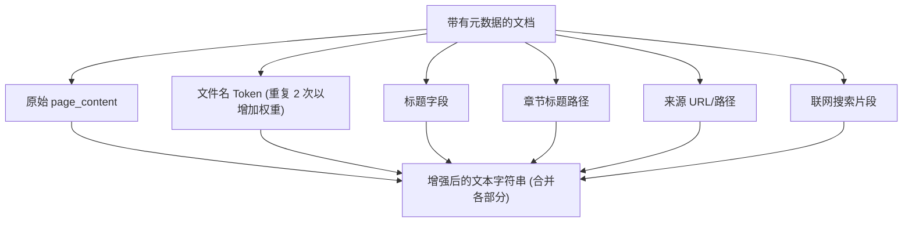
### 增强过程

增强操作添加了带权重的元数据，以提高基于关键词的检索效果：

1.  **文件名处理**：提取文件名，通过 `_`、`-`、`.` 分割进行 Token 化，并重复两次以增加 BM25 权重。
2.  **添加标题**：如果元数据中存在文档标题，则将其添加。
3.  **章节标题**：包含来自 Markdown 分割器元数据的层级章节路径。
4.  **来源信息**：添加来源 URL 或文件路径。
5.  **包含片段**：对于联网搜索结果，包含片段文本。

增强后的文本结构示例：

```text
[原始内容]
文件名: report.pdf report pdf report pdf
标题: Q4 财务分析
章节: 执行摘要 > 关键发现
来源: /uploads/reports/report.pdf
```
**来源：** [backend/open\_webui/retrieval/utils.py169-204](https://github.com/open-webui/open-webui/blob/a7271532/backend/open_webui/retrieval/utils.py#L169-L204)

## 重排序 (Reranking)

初始检索后，重排序阶段使用更复杂的评分模型对结果进行精炼。这种两阶段方法平衡了效率（快速的初始检索）和准确性（精确的重排序）。

### 重排序架构

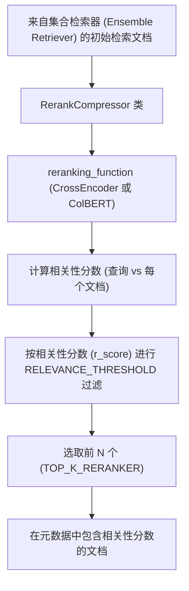
### 重排序模型

系统支持三种重排序策略：

| 模型类型 | 实现 | 代码实体 | 用途 |
| --- | --- | --- | --- |
| CrossEncoder | `sentence_transformers.CrossEncoder` | `get_rf()` 默认值 | 通用型, 速度快 |
| ColBERT | `open_webui.retrieval.models.colbert.ColBERT` | `get_rf()` (针对 jina-colbert-v2) | 多向量匹配 |
| 外部 (External) | `open_webui.retrieval.models.external.ExternalReranker` | `get_rf()` (配合外部引擎) | 自定义 API 端点 |

### RerankCompressor 实现

`RerankCompressor` 是一个执行重排序的 LangChain 文档压缩器：

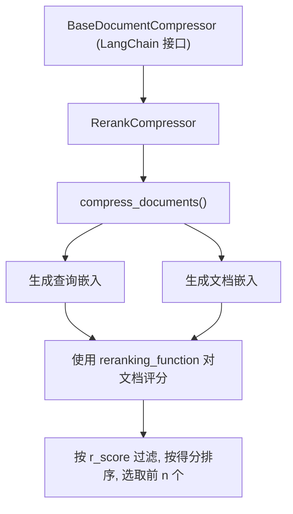
**来源：** [backend/open\_webui/retrieval/utils.py452-560](https://github.com/open-webui/open-webui/blob/a7271532/backend/open_webui/retrieval/utils.py#L452-L560) [backend/open\_webui/routers/retrieval.py146-215](https://github.com/open-webui/open-webui/blob/a7271532/backend/open_webui/routers/retrieval.py#L146-L215)

### ContextualCompressionRetriever

重排序通过 LangChain 的 `ContextualCompressionRetriever` 进行集成：

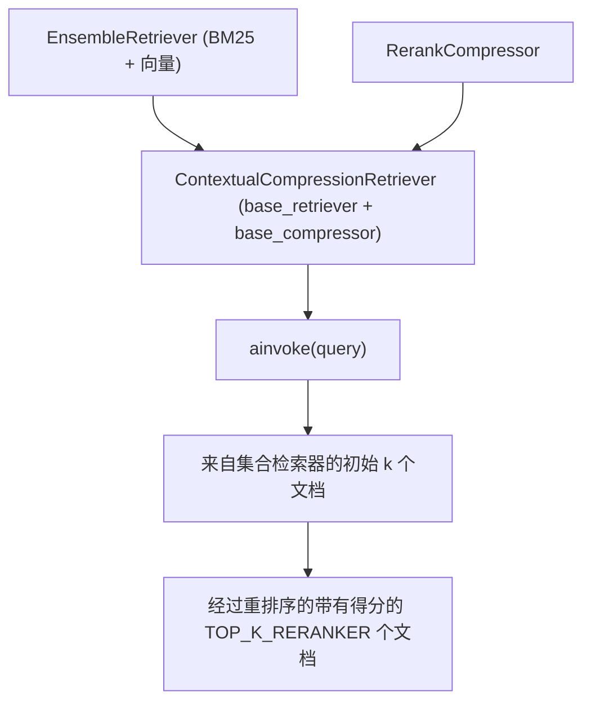
**来源：** [backend/open\_webui/retrieval/utils.py272-283](https://github.com/open-webui/open-webui/blob/a7271532/backend/open_webui/retrieval/utils.py#L272-L283)

## 查询处理

检索系统通过嵌入处理查询，并支持多查询策略：

### 查询嵌入流水线

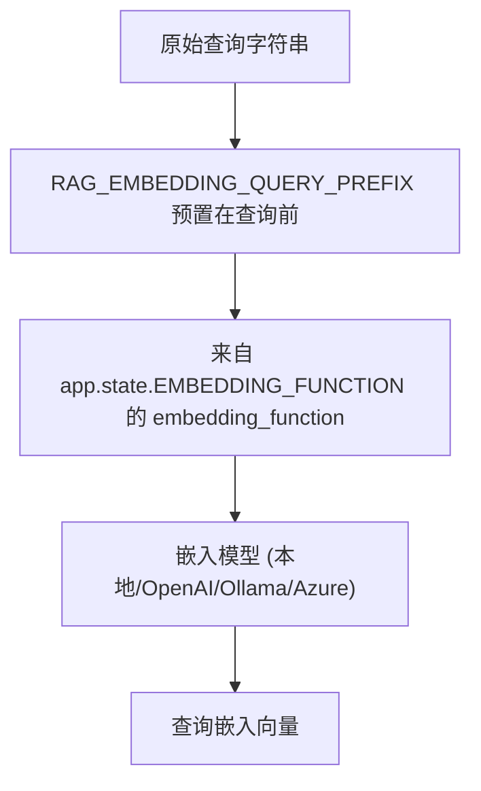
### 多查询集合检索

`query_collection()` 函数支持使用多个查询来查询多个集合：

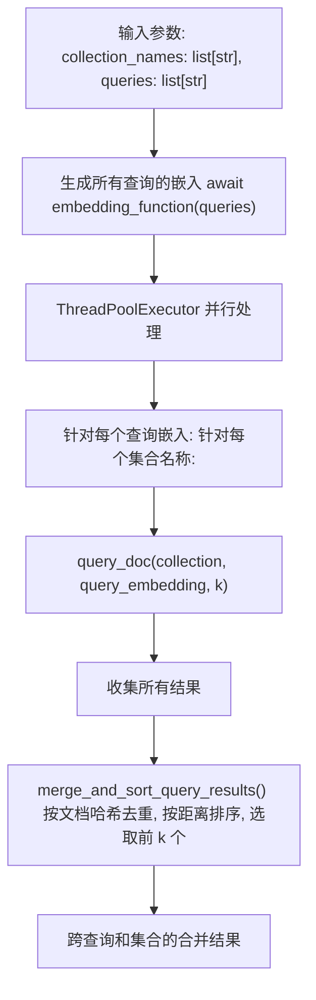
**来源：** [backend/open\_webui/retrieval/utils.py402-458](https://github.com/open-webui/open-webui/blob/a7271532/backend/open_webui/retrieval/utils.py#L402-L458) [backend/open\_webui/retrieval/utils.py338-382](https://github.com/open-webui/open-webui/blob/a7271532/backend/open_webui/retrieval/utils.py#L338-L382)

## 配置管理

检索策略配置通过具有持久化功能的 `AppConfig` 系统进行管理：

### 配置流程

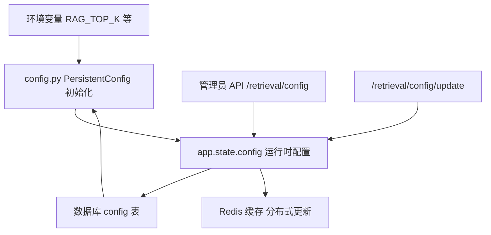
### 关键配置端点

| 端点 | 方法 | 用途 |
| --- | --- | --- |
| `/retrieval/config` | GET | 获取当前 RAG 配置 |
| `/retrieval/config/update` | POST | 更新 RAG 设置 |
| `/retrieval/query/settings` | GET | 获取查询设置 (k, r, 模板) |
| `/retrieval/query/settings/update` | POST | 更新查询设置 |

### 运行时配置访问

通过应用状态访问配置值：

```python
# 在请求处理程序中：
top_k = request.app.state.config.TOP_K
top_k_reranker = request.app.state.config.TOP_K_RERANKER
relevance_threshold = request.app.state.config.RELEVANCE_THRESHOLD
hybrid_bm25_weight = request.app.state.config.HYBRID_BM25_WEIGHT
enable_hybrid = request.app.state.config.ENABLE_RAG_HYBRID_SEARCH
```
**来源：** [backend/open\_webui/config.py224-283](https://github.com/open-webui/open-webui/blob/a7271532/backend/open_webui/config.py#L224-L283) [backend/open\_webui/routers/retrieval.py434-550](https://github.com/open-webui/open-webui/blob/a7271532/backend/open_webui/routers/retrieval.py#L434-L550) [backend/open\_webui/main.py832-850](https://github.com/open-webui/open-webui/blob/a7271532/backend/open_webui/main.py#L832-L850)

## 与聊天流水线的集成

检索策略在聊天处理期间通过中间件系统调用：

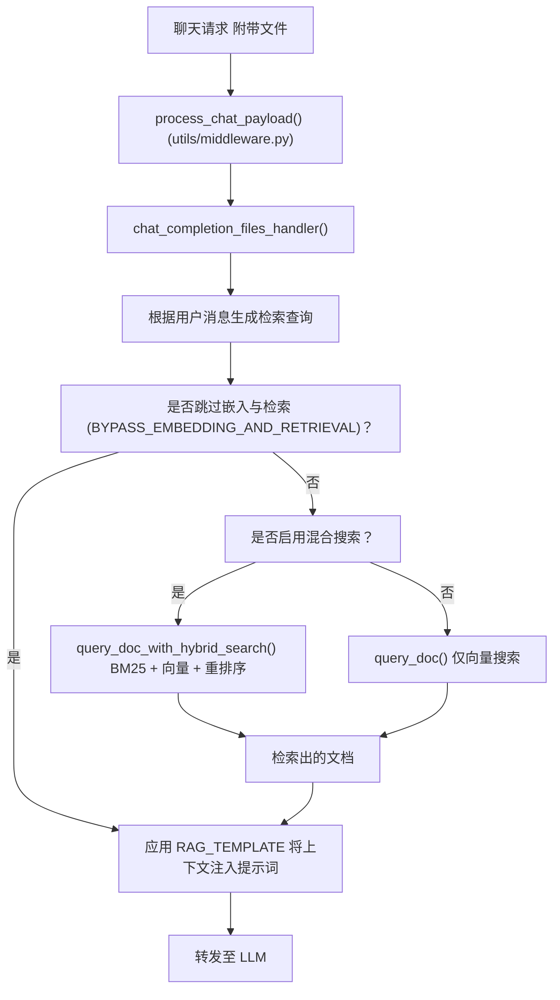
### 基于文件的检索流程

当聊天附带文件时：

1.  **查询生成**：系统可选地根据用户消息生成优化的检索查询。
2.  **集合查找**：将文件 ID 映射到向量集合名称。
3.  **执行检索**：根据配置调用相应的检索策略。
4.  **组装上下文**：将检索到的文档与元数据（来源、引用）结合。
5.  **应用模板**：使用 `RAG_TEMPLATE` 将检索到的上下文注入到提示词中。

**来源：** [backend/open\_webui/utils/middleware.py895-1169](https://github.com/open-webui/open-webui/blob/a7271532/backend/open_webui/utils/middleware.py#L895-L1169) [backend/open\_webui/retrieval/utils.py583-715](https://github.com/open-webui/open-webui/blob/a7271532/backend/open_webui/retrieval/utils.py#L583-L715)

## 结果合并与去重

当查询多个集合或使用多个查询时，会对结果进行合并和去重：

### 合并算法

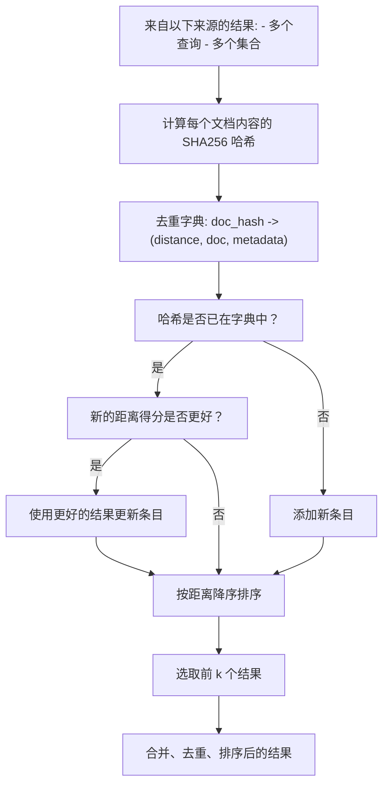
合并逻辑确保：

-   没有重复文档（基于内容哈希）。
-   对于重复项保留最高分。
-   按相关性对结果排序。
-   可配置的前 k 个选择。

**来源：** [backend/open\_webui/retrieval/utils.py338-382](https://github.com/open-webui/open-webui/blob/a7271532/backend/open_webui/retrieval/utils.py#L338-L382)

## 前端配置界面

检索策略设置通过管理员界面进行配置：

### 查询设置 UI (Query Settings UI)

管理员面板公开了以下控件：

| 设置 | UI 控件 | 配置路径 |
| --- | --- | --- |
| Top K | 数字输入框 | `TOP_K` |
| 相关性阈值 | 滑块 (0-1) | `RELEVANCE_THRESHOLD` |
| 启用混合搜索 | 切换开关 | `ENABLE_RAG_HYBRID_SEARCH` |
| BM25 权重 | 滑块 (0-1) | `HYBRID_BM25_WEIGHT` |
| 重排序 Top K | 数字输入框 | `TOP_K_RERANKER` |
| 启用增强文本 | 切换开关 | `ENABLE_RAG_HYBRID_SEARCH_ENRICHED_TEXTS` |

**来源：** [src/lib/components/admin/Settings/Documents.svelte1-274](https://github.com/open-webui/open-webui/blob/a7271532/src/lib/components/admin/Settings/Documents.svelte#L1-L274) [src/lib/apis/retrieval/index.ts93-154](https://github.com/open-webui/open-webui/blob/a7271532/src/lib/apis/retrieval/index.ts#L93-L154)
