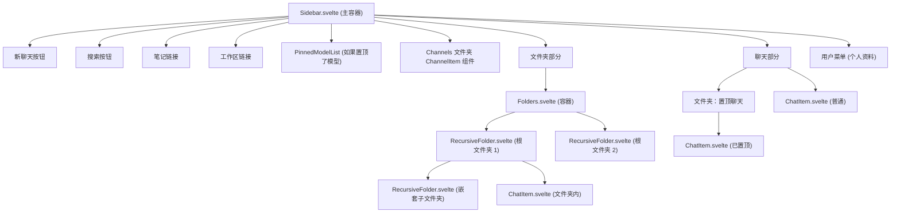
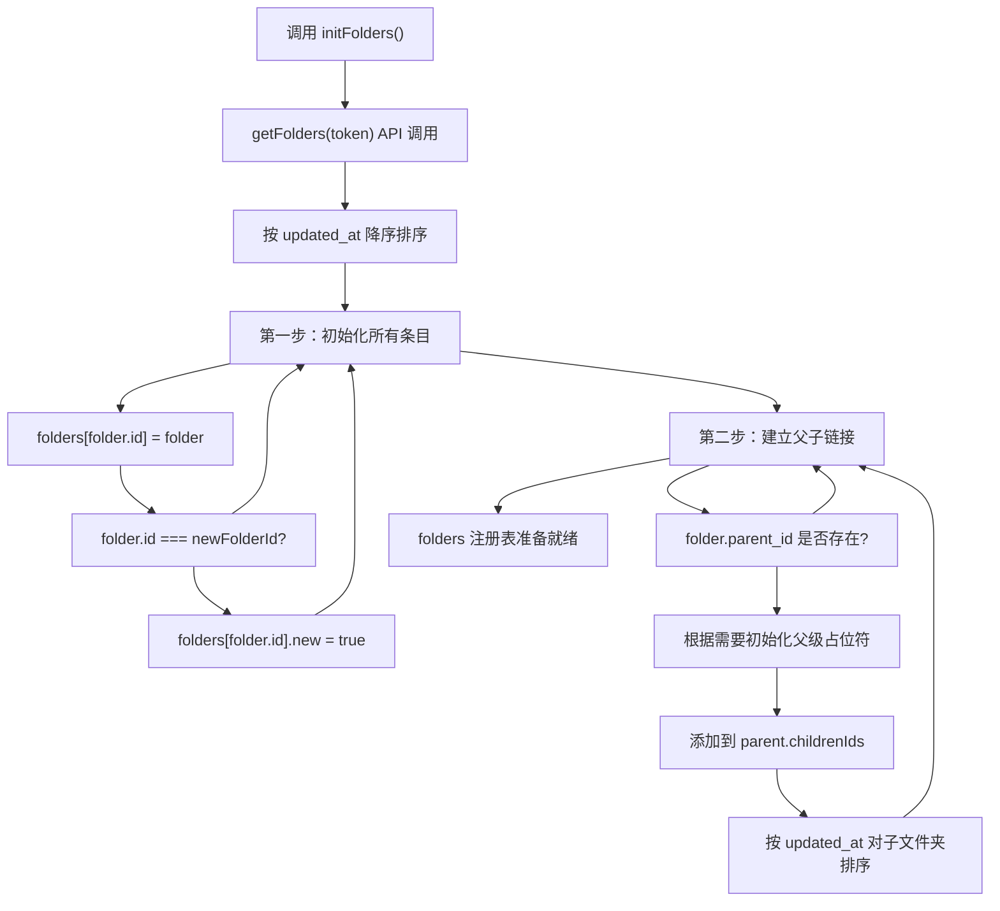
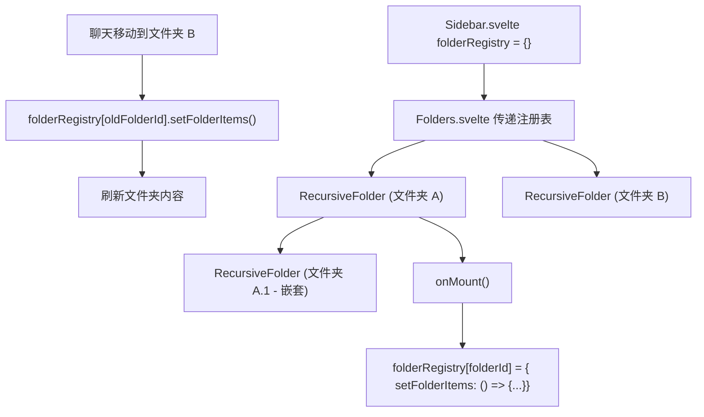
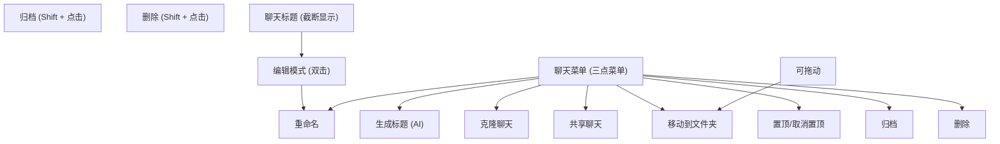
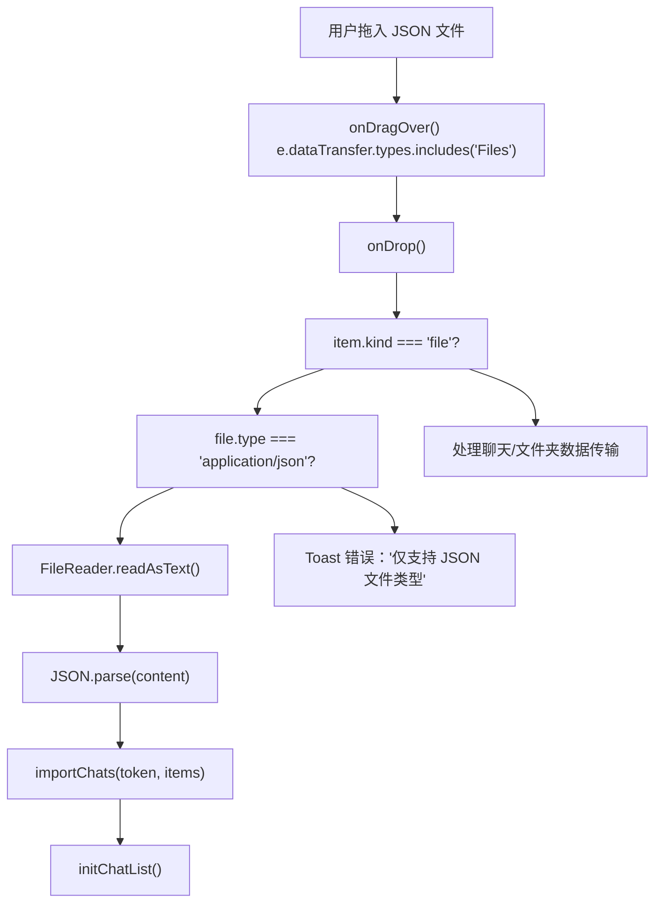

# 导航和组织

相关源文件

-   [backend/open\_webui/migrations/versions/1af9b942657b\_migrate\_tags.py](https://github.com/open-webui/open-webui/blob/a7271532/backend/open_webui/migrations/versions/1af9b942657b_migrate_tags.py)
-   [backend/open\_webui/migrations/versions/3ab32c4b8f59\_update\_tags.py](https://github.com/open-webui/open-webui/blob/a7271532/backend/open_webui/migrations/versions/3ab32c4b8f59_update_tags.py)
-   [backend/open\_webui/migrations/versions/c69f45358db4\_add\_folder\_table.py](https://github.com/open-webui/open-webui/blob/a7271532/backend/open_webui/migrations/versions/c69f45358db4_add_folder_table.py)
-   [src/lib/apis/folders/index.ts](https://github.com/open-webui/open-webui/blob/a7271532/src/lib/apis/folders/index.ts)
-   [src/lib/components/common/ConfirmDialog.svelte](https://github.com/open-webui/open-webui/blob/a7271532/src/lib/components/common/ConfirmDialog.svelte)
-   [src/lib/components/common/DragGhost.svelte](https://github.com/open-webui/open-webui/blob/a7271532/src/lib/components/common/DragGhost.svelte)
-   [src/lib/components/common/Folder.svelte](https://github.com/open-webui/open-webui/blob/a7271532/src/lib/components/common/Folder.svelte)
-   [src/lib/components/icons/Document.svelte](https://github.com/open-webui/open-webui/blob/a7271532/src/lib/components/icons/Document.svelte)
-   [src/lib/components/layout/Sidebar.svelte](https://github.com/open-webui/open-webui/blob/a7271532/src/lib/components/layout/Sidebar.svelte)
-   [src/lib/components/layout/Sidebar/ChatItem.svelte](https://github.com/open-webui/open-webui/blob/a7271532/src/lib/components/layout/Sidebar/ChatItem.svelte)
-   [src/lib/components/layout/Sidebar/Folders.svelte](https://github.com/open-webui/open-webui/blob/a7271532/src/lib/components/layout/Sidebar/Folders.svelte)
-   [src/lib/components/layout/Sidebar/Folders/FolderMenu.svelte](https://github.com/open-webui/open-webui/blob/a7271532/src/lib/components/layout/Sidebar/Folders/FolderMenu.svelte)
-   [src/lib/components/layout/Sidebar/RecursiveFolder.svelte](https://github.com/open-webui/open-webui/blob/a7271532/src/lib/components/layout/Sidebar/RecursiveFolder.svelte)
-   [src/lib/components/workspace/Knowledge/ItemMenu.svelte](https://github.com/open-webui/open-webui/blob/a7271532/src/lib/components/workspace/Knowledge/ItemMenu.svelte)

本文档涵盖了 Open WebUI 的导航和组织系统，该系统为用户提供了一个分层的侧边栏，用于将聊天组织到文件夹中、置顶重要对话以及访问频道。该系统支持无限的文件夹嵌套、拖放组织和持久的展开状态。

有关聊天界面本身的信息，请参阅[聊天系统](/open-webui/open-webui/4-chat-system)。有关侧边栏内搜索功能的详细信息，请参阅[聊天组件架构](/open-webui/open-webui/4.1-chat-component-architecture)。有关与他人共享聊天，请参阅[聊天共享](/open-webui/open-webui/8.5-chat-sharing)。

## 目的和范围

导航和组织系统包含：

-   **侧边栏组件 (Sidebar Component)**：具有可折叠部分的主导航容器
-   **文件夹系统 (Folder System)**：具有拖放支持的递归文件夹层次结构
-   **聊天项 (Chat Items)**：具有上下文菜单和操作的单个聊天条目
-   **置顶聊天 (Pinned Chats)**：用于放置置顶对话的特殊部分
-   **频道 (Channels)**：团队协作空间（启用时）
-   **拖放 (Drag-and-Drop)**：通过拖放组织聊天和文件夹
-   **状态持久化 (State Persistence)**：文件夹展开状态和侧边栏宽度

该系统主要在前端使用 Svelte 组件实现，并由文件夹和聊天 API 支持进行持久化。

## 组件层次结构

侧边栏导航遵循分层组件结构，具有清晰的父子关系：

**侧边栏组件层次结构**


来源：[src/lib/components/layout/Sidebar.svelte1-1379](https://github.com/open-webui/open-webui/blob/a7271532/src/lib/components/layout/Sidebar.svelte#L1-L1379) [src/lib/components/layout/Sidebar/Folders.svelte1-63](https://github.com/open-webui/open-webui/blob/a7271532/src/lib/components/layout/Sidebar/Folders.svelte#L1-L63) [src/lib/components/layout/Sidebar/RecursiveFolder.svelte1-663](https://github.com/open-webui/open-webui/blob/a7271532/src/lib/components/layout/Sidebar/RecursiveFolder.svelte#L1-L663)

## 数据结构

文件夹系统使用嵌套数据结构，并为了高效查找而展平到注册表中：

**文件夹数据结构**

| 字段 | 类型 | 描述 |
| --- | --- | --- |
| `id` | string | 文件夹的 UUID |
| `parent_id` | string | null | 父文件夹 ID (根文件夹为 null) |
| `user_id` | string | 所有者用户 ID |
| `name` | string | 文件夹显示名称 |
| `items` | JSON | 包含 `chat_ids` 和 `file_ids` 数组 |
| `meta` | JSON | 元数据，包括 `icon` (表情符号短代码) |
| `is_expanded` | boolean | 文件夹当前是否展开 |
| `created_at` | DateTime | 创建时间戳 |
| `updated_at` | DateTime | 最后修改时间戳 |
| `childrenIds` | string\[\] | (仅限客户端) 子文件夹 ID 数组 |

**聊天数据结构 (组织相关字段)**

| 字段 | 类型 | 描述 |
| --- | --- | --- |
| `id` | string | 聊天的 UUID |
| `folder_id` | string | null | 父文件夹 ID (根聊天为 null) |
| `pinned` | boolean | 聊天是否已置顶 |
| `meta` | JSON | 元数据，包括 `tags` 数组 |

来源：[backend/open\_webui/migrations/versions/c69f45358db4\_add\_folder\_table.py1-51](https://github.com/open-webui/open-webui/blob/a7271532/backend/open_webui/migrations/versions/c69f45358db4_add_folder_table.py#L1-L51) [backend/open\_webui/migrations/versions/1af9b942657b\_migrate\_tags.py1-152](https://github.com/open-webui/open-webui/blob/a7271532/backend/open_webui/migrations/versions/1af9b942657b_migrate_tags.py#L1-L152)

## 文件夹初始化算法

文件夹系统使用两步初始化算法，从扁平列表构建分层结构：

**文件夹初始化数据流**


代码实现：

```
// 第一步：初始化所有文件夹条目
for (const folder of folderList) {
    folders[folder.id] = { ...(folders[folder.id] || {}), ...folder };
    if (newFolderId && folder.id === newFolderId) {
        folders[folder.id].new = true;
    }
}

// 第二步：将子文件夹与其父文件夹绑定
for (const folder of folderList) {
    if (folder.parent_id) {
        if (!folders[folder.parent_id]) {
            folders[folder.parent_id] = {}; // 占位符
        }
        folders[folder.parent_id].childrenIds =
            folders[folder.parent_id].childrenIds
            ? [...folders[folder.parent_id].childrenIds, folder.id]
            : [folder.id];

        // 按 updated_at 排序子文件夹
        folders[folder.parent_id].childrenIds.sort((a, b) => {
            return folders[b].updated_at - folders[a].updated_at;
        });
    }
}
```
来源：[src/lib/components/layout/Sidebar.svelte100-142](https://github.com/open-webui/open-webui/blob/a7271532/src/lib/components/layout/Sidebar.svelte#L100-L142)

## 文件夹注册表模式 (Folder Registry Pattern)

系统使用注册表模式，允许父组件触发深度嵌套文件夹上的操作：

**文件夹注册表模式**


每个 `RecursiveFolder` 在挂载时将其自身注册到共享注册表中：

```
onMount(async () => {
    folderRegistry[folderId] = {
        setFolderItems: () => {
            setFolderItems();
        }
    };
    // ... dragListeners 设置
});
```
这允许侧边栏刷新文件夹内容，而无需通过 Prop 进行逐层传递：

```
// 当聊天从一个文件夹移动到另一个文件夹时
if (chat.folder_id) {
    folderRegistry[chat.folder_id]?.setFolderItems();
}
```
来源：[src/lib/components/layout/Sidebar/RecursiveFolder.svelte251-258](https://github.com/open-webui/open-webui/blob/a7271532/src/lib/components/layout/Sidebar/RecursiveFolder.svelte#L251-L258) [src/lib/components/layout/Sidebar.svelte1162-1163](https://github.com/open-webui/open-webui/blob/a7271532/src/lib/components/layout/Sidebar.svelte#L1162-L1163) [src/lib/components/layout/Sidebar/Folders.svelte26-30](https://github.com/open-webui/open-webui/blob/a7271532/src/lib/components/layout/Sidebar/Folders.svelte#L26-L30)

## 拖放系统 (Drag-and-Drop System)

拖放系统通过自定义实现支持组织聊天和文件夹，并通过 `dataTransfer` 传递数据：

**拖放数据流**

> **[Mermaid sequence]**
> *(图表结构无法解析)*

**拖动图像抑制**：`ChatItem` 和 `RecursiveFolder` 都使用透明的 1x1 PNG 作为拖动图像，以隐藏浏览器默认的拖动预览：

```
const dragImage = new Image();
dragImage.src = 'data:image/png;base64,iVBORw0KGgoAAAANSUhEUgAAAAEAAAABCAQAAAC1HAwCAAAAC0lEQVR42mNkYAAAAAYAAjCB0C8AAAAASUVORK5CYII=';

const onDragStart = (event) => {
    event.dataTransfer.setDragImage(dragImage, 0, 0);
    // ... 设置数据
};
```
自定义的 `DragGhost` 组件在拖动期间在光标位置渲染一个带样式的预览。

来源：[src/lib/components/layout/Sidebar/ChatItem.svelte176-213](https://github.com/open-webui/open-webui/blob/a7271532/src/lib/components/layout/Sidebar/ChatItem.svelte#L176-L213) [src/lib/components/layout/Sidebar/RecursiveFolder.svelte74-249](https://github.com/open-webui/open-webui/blob/a7271532/src/lib/components/layout/Sidebar/RecursiveFolder.svelte#L74-L249) [src/lib/components/common/DragGhost.svelte1-38](https://github.com/open-webui/open-webui/blob/a7271532/src/lib/components/common/DragGhost.svelte#L1-L38)

## 状态管理

导航系统管理多种类型的状态：

**状态管理架构**

```mermaid
flowchart TD
    showSidebar["showSidebar (boolean)"]
    sidebarWidth["sidebarWidth (number)"]
    selectedFolder["selectedFolder (Folder | null)"]
    chats["chats (Chat[])"]
    pinnedChats["pinnedChats (Chat[])"]
    folders_store["_folders (Folder[])"]
    sidebar_ls["localStorage.sidebar ('true' | 'false')"]
    width_ls["localStorage.sidebarWidth (220-480)"]
    folder_state["localStorage[folderId-folder-state] (按文件夹)"]
    folders_local["folders = {} (文件夹注册表)"]
    folderRegistry["folderRegistry = {} (方法注册表)"]
    showFolders["showFolders (boolean)"]
    showChannels["showChannels (boolean)"]
    open["open (boolean)"]
    chats_local["chats (Chat[] | null)"]
    edit["edit (boolean)"]
    dragged["dragged (boolean)"]
    RecursiveFolder["RecursiveFolder"]
    ChatItem["ChatItem"]
    PinnedSection["PinnedSection"]

    showSidebar --> sidebar_ls
    sidebarWidth --> width_ls
    open --> folder_state
    folders --> store_folders_local
    folderRegistry --> RecursiveFolder
    selectedFolder --> RecursiveFolder
    chats --> ChatItem
    pinnedChats --> PinnedSection
```


**侧边栏宽度调整**：侧边栏支持在 220px 到 480px (MIN\_WIDTH 和 MAX\_WIDTH) 之间动态调整宽度：

```
const resizeSidebarHandler = (endClientX) => {
    const dx = endClientX - startClientX;
    const newSidebarWidth = Math.min(MAX_WIDTH, Math.max(MIN_WIDTH, startWidth + dx));

    sidebarWidth.set(newSidebarWidth);
    document.documentElement.style.setProperty('--sidebar-width', `${newSidebarWidth}px`);
};
```
宽度被持久化到 localStorage 并通过 CSS 自定义属性应用。

来源：[src/lib/components/layout/Sidebar.svelte382-414](https://github.com/open-webui/open-webui/blob/a7271532/src/lib/components/layout/Sidebar.svelte#L382-L414) [src/lib/components/layout/Sidebar/RecursiveFolder.svelte251-276](https://github.com/open-webui/open-webui/blob/a7271532/src/lib/components/layout/Sidebar/RecursiveFolder.svelte#L251-L276) [src/lib/components/common/Folder.svelte106-112](https://github.com/open-webui/open-webui/blob/a7271532/src/lib/components/common/Folder.svelte#L106-L112)

## API 集成

导航系统与多个后端 API 进行交互：

**文件夹 API 端点**

| 端点 | 方法 | 用途 |
| --- | --- | --- |
| `/folders/` | GET | 获取当前用户的所有文件夹 |
| `/folders/` | POST | 创建新文件夹 |
| `/folders/{id}` | GET | 按 ID 获取文件夹 |
| `/folders/{id}` | DELETE | 删除文件夹 (可选是否包含内容) |
| `/folders/{id}/update` | POST | 更新文件夹名称/元数据/数据 |
| `/folders/{id}/update/expanded` | POST | 更新 `is_expanded` 状态 |
| `/folders/{id}/update/parent` | POST | 将文件夹移动到新父级 |

**聊天组织端点**

| 端点 | 方法 | 用途 |
| --- | --- | --- |
| `/chats/folder/{id}` | GET | 获取文件夹内的聊天记录 (分页) |
| `/chats/{id}/folder` | POST | 将聊天移动到文件夹 |
| `/chats/{id}/pin/toggle` | POST | 切换聊天的置顶状态 |

**文件夹创建流程**：

```
const createFolder = async ({ name, data }) => {
    name = name?.trim();
    if (!name) {
        toast.error($i18n.t('Folder name cannot be empty.'));
        return;
    }

    // 检查重复名称
    const rootFolders = Object.values(folders).filter((folder) => folder.parent_id === null);
    if (rootFolders.find((folder) => folder.name.toLowerCase() === name.toLowerCase())) {
        // 在名称后附加数字
        let i = 1;
        while (rootFolders.find((folder) => folder.name.toLowerCase() === `${name} ${i}`.toLowerCase())) {
            i++;
        }
        name = `${name} ${i}`;
    }

    // 通过 API 创建
    const res = await createNewFolder(localStorage.token, { name, data });
    if (res) {
        await initFolders();
        showFolders = true;
    }
};
```
来源：[src/lib/apis/folders/index.ts1-275](https://github.com/open-webui/open-webui/blob/a7271532/src/lib/apis/folders/index.ts#L1-L275) [src/lib/components/layout/Sidebar.svelte144-189](https://github.com/open-webui/open-webui/blob/a7271532/src/lib/components/layout/Sidebar.svelte#L144-L189)

## 聊天项组件 (Chat Item Component)

`ChatItem` 组件代表侧边栏中的单个聊天，具有上下文操作功能：

**聊天项组件功能**


**标题生成**：当用户在编辑模式下点击“生成”按钮时，系统使用该聊天的模型来生成标题：

```
const generateTitleHandler = async () => {
    generating = true;
    if (!chat) {
        chat = await getChatById(localStorage.token, id);
    }

    const messages = (chat.chat?.messages ?? []).map((message) => {
        return {
            role: message.role,
            content: message.content
        };
    });

    const model = chat.chat.models.at(0) ?? chat.models.at(0) ?? '';
    const generatedTitle = await generateTitle(localStorage.token, model, messages);

    if (generatedTitle && generatedTitle !== title) {
        editChatTitle(id, generatedTitle);
    }
    generating = false;
};
```
来源：[src/lib/components/layout/Sidebar/ChatItem.svelte1-571](https://github.com/open-webui/open-webui/blob/a7271532/src/lib/components/layout/Sidebar/ChatItem.svelte#L1-L571) [src/lib/components/layout/Sidebar/ChatItem.svelte282-317](https://github.com/open-webui/open-webui/blob/a7271532/src/lib/components/layout/Sidebar/ChatItem.svelte#L282-L317)

## 递归文件夹渲染

`RecursiveFolder` 组件通过 Svelte 的 `<svelte:self>` 模式支持无限嵌套：

**递归渲染模式**

```
{#if folders[folderId]?.childrenIds}
    {@const children = folders[folderId]?.childrenIds
        .map((id) => folders[id])
        .sort((a, b) =>
            a.name.localeCompare(b.name, undefined, {
                numeric: true,
                sensitivity: 'base'
            })
        )}

    {#each children as childFolder (`${folderId}-${childFolder.id}`)}
        <svelte:self
            bind:folderRegistry
            {folders}
            folderId={childFolder.id}
            {shiftKey}
            parentDragged={dragged}
            {onItemMove}
            {onDelete}
            on:import
            on:update
            on:change
        />
    {/each}
{/if}
```
这种模式允许文件夹递归渲染其子文件夹，而没有深度限制。

**文件夹视觉状态**：

-   **折叠**：显示向右箭头图标，隐藏子项
-   **展开**：显示向下箭头图标，显示子项
-   **被拖入**：具有 `draggedOver` 状态的灰色叠加层
-   **选中**：当 `$selectedFolder.id === folderId` 时显示灰色背景
-   **编辑模式**：文本输入框替换标题

来源：[src/lib/components/layout/Sidebar/RecursiveFolder.svelte610-640](https://github.com/open-webui/open-webui/blob/a7271532/src/lib/components/layout/Sidebar/RecursiveFolder.svelte#L610-L640) [src/lib/components/layout/Sidebar/RecursiveFolder.svelte460-604](https://github.com/open-webui/open-webui/blob/a7271532/src/lib/components/layout/Sidebar/RecursiveFolder.svelte#L460-L604)

## 通过拖放进行文件导入

文件夹和主聊天部分都支持通过拖放导入聊天 JSON 文件：

**文件导入数据流**


导入处理程序可以可选地为导入的聊天设置 `folder_id` 和置顶状态：

```
const importChatHandler = async (items, pinned = false, folderId = null) => {
    for (const item of items) {
        if (item.chat) {
            await importChats(localStorage.token, [
                {
                    chat: item.chat,
                    meta: item?.meta ?? {},
                    pinned: pinned,
                    folder_id: folderId,
                    created_at: item?.created_at ?? null,
                    updated_at: item?.updated_at ?? null
                }
            ]);
        }
    }
    initChatList();
};
```
来源：[src/lib/components/layout/Sidebar.svelte274-292](https://github.com/open-webui/open-webui/blob/a7271532/src/lib/components/layout/Sidebar.svelte#L274-L292) [src/lib/components/layout/Sidebar.svelte253-272](https://github.com/open-webui/open-webui/blob/a7271532/src/lib/components/layout/Sidebar.svelte#L253-L272) [src/lib/components/layout/Sidebar/RecursiveFolder.svelte83-201](https://github.com/open-webui/open-webui/blob/a7271532/src/lib/components/layout/Sidebar/RecursiveFolder.svelte#L83-L201)

## 键盘和移动端交互

侧边栏实现了多种输入方式：

**键盘快捷键**：

-   **Shift + 点击聊天菜单**：显示归档和删除按钮，而不是常规菜单
-   **Enter**：提交 ChatItem 或 FolderName 输入框中的标题编辑
-   **Escape**：取消标题编辑
-   **双击**：进入聊天标题或文件夹名称的编辑模式

**移动端交互**：

-   **轻扫手势**：从左侧边缘 (< 40px) 向右滑动可打开侧边栏
-   **背景点击**：在移动端点击侧边栏外部可将其关闭
-   **触摸自动关闭**：在移动端导航后，侧边栏会自动关闭

```
function checkDirection() {
    const screenWidth = window.innerWidth;
    const swipeDistance = Math.abs(touchend.screenX - touchstart.screenX);
    if (touchstart.clientX < 40 && swipeDistance >= screenWidth / 8) {
        if (touchend.screenX < touchstart.screenX) {
            showSidebar.set(false);
        }
        if (touchend.screenX > touchstart.screenX) {
            showSidebar.set(true);
        }
    }
}
```
来源：[src/lib/components/layout/Sidebar.svelte340-361](https://github.com/open-webui/open-webui/blob/a7271532/src/lib/components/layout/Sidebar.svelte#L340-L361) [src/lib/components/layout/Sidebar.svelte524-539](https://github.com/open-webui/open-webui/blob/a7271532/src/lib/components/layout/Sidebar.svelte#L524-L539) [src/lib/components/layout/Sidebar/ChatItem.svelte253-265](https://github.com/open-webui/open-webui/blob/a7271532/src/lib/components/layout/Sidebar/ChatItem.svelte#L253-L265)

## 可折叠文件夹组件 (Collapsible Folder Component)

通用的 `Folder.svelte` 组件为模型、频道、文件夹和聊天提供可折叠的部分：

**Folder.svelte 配置**

| Prop | 类型 | 默认值 | 用途 |
| --- | --- | --- | --- |
| `open` | boolean | true | 初始展开状态 |
| `id` | string | '' | 用于 localStorage 的键 |
| `name` | string | '' | 显示名称 |
| `collapsible` | boolean | true | 该部分是否可以折叠 |
| `chevron` | boolean | true | 是否显示箭头图标 |
| `onAdd` | Function | null | 可选的新增按钮处理程序 |
| `dragAndDrop` | boolean | true | 是否启用拖放功能 |

**状态持久化**：组件将其打开/关闭状态持久化到 localStorage：

```
onMount(() => {
    const state = localStorage.getItem(`${id}-folder-state`);
    if (state !== null) {
        open = state === 'true';
    }
    loaded = true;
});
```
```
onChange={(state) => {
    dispatch('change', state);
    localStorage.setItem(`${id}-folder-state`, `${state}`);
}}
```
来源：[src/lib/components/common/Folder.svelte1-203](https://github.com/open-webui/open-webui/blob/a7271532/src/lib/components/common/Folder.svelte#L1-L203) [src/lib/components/layout/Sidebar.svelte1019-1030](https://github.com/open-webui/open-webui/blob/a7271532/src/lib/components/layout/Sidebar.svelte#L1019-L1030)

## 删除确认对话框

文件夹和聊天都使用 `ConfirmDialog` 组件进行删除，并带有一个复选框选项：

**删除文件夹对话框**：

```
<DeleteConfirmDialog
    bind:show={showDeleteConfirm}
    title={$i18n.t('Delete folder?')}
    on:confirm={() => {
        deleteHandler();
    }}
>
    <div class="text-sm text-gray-700 dark:text-gray-300 flex-1 line-clamp-3 mb-2">
        {$i18n.t(`Are you sure you want to delete "{{NAME}}"?`, {
            NAME: folders[folderId].name
        })}
    </div>

    <div class="flex items-center gap-1.5">
        <input type="checkbox" bind:checked={deleteFolderContents} />
        <div class="text-xs text-gray-500">
            {$i18n.t('Delete all contents inside this folder')}
        </div>
    </div>
</DeleteConfirmDialog>
```
当 `deleteFolderContents` 为 true 时，API 调用将包含一个查询参数：

```
const res = await fetch(`${WEBUI_API_BASE_URL}/folders/${id}?delete_contents=${deleteContents}`, {
    method: 'DELETE',
    // ...
});
```
来源：[src/lib/components/layout/Sidebar/RecursiveFolder.svelte419-443](https://github.com/open-webui/open-webui/blob/a7271532/src/lib/components/layout/Sidebar/RecursiveFolder.svelte#L419-L443) [src/lib/apis/folders/index.ts242-274](https://github.com/open-webui/open-webui/blob/a7271532/src/lib/apis/folders/index.ts#L242-L274) [src/lib/components/common/ConfirmDialog.svelte1-183](https://github.com/open-webui/open-webui/blob/a7271532/src/lib/components/common/ConfirmDialog.svelte#L1-L183)
