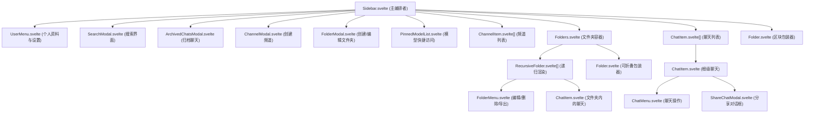
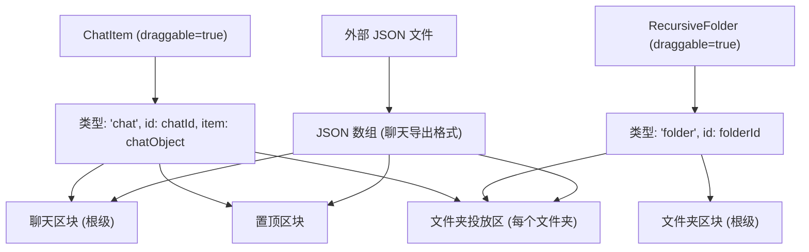
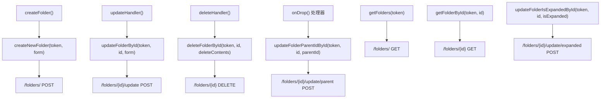

# 侧边栏架构

相关源文件

-   [backend/open\_webui/migrations/versions/1af9b942657b\_migrate\_tags.py](https://github.com/open-webui/open-webui/blob/a7271532/backend/open_webui/migrations/versions/1af9b942657b_migrate_tags.py)
-   [backend/open\_webui/migrations/versions/3ab32c4b8f59\_update\_tags.py](https://github.com/open-webui/open-webui/blob/a7271532/backend/open_webui/migrations/versions/3ab32c4b8f59_update_tags.py)
-   [backend/open\_webui/migrations/versions/c69f45358db4\_add\_folder\_table.py](https://github.com/open-webui/open-webui/blob/a7271532/backend/open_webui/migrations/versions/c69f45358db4_add_folder_table.py)
-   [src/lib/apis/folders/index.ts](https://github.com/open-webui/open-webui/blob/a7271532/src/lib/apis/folders/index.ts)
-   [src/lib/components/common/ConfirmDialog.svelte](https://github.com/open-webui/open-webui/blob/a7271532/src/lib/components/common/ConfirmDialog.svelte)
-   [src/lib/components/common/DragGhost.svelte](https://github.com/open-webui/open-webui/blob/a7271532/src/lib/components/common/DragGhost.svelte)
-   [src/lib/components/common/Folder.svelte](https://github.com/open-webui/open-webui/blob/a7271532/src/lib/components/common/Folder.svelte)
-   [src/lib/components/icons/Document.svelte](https://github.com/open-webui/open-webui/blob/a7271532/src/lib/components/icons/Document.svelte)
-   [src/lib/components/layout/Sidebar.svelte](https://github.com/open-webui/open-webui/blob/a7271532/src/lib/components/layout/Sidebar.svelte)
-   [src/lib/components/layout/Sidebar/ChatItem.svelte](https://github.com/open-webui/open-webui/blob/a7271532/src/lib/components/layout/Sidebar/ChatItem.svelte)
-   [src/lib/components/layout/Sidebar/Folders.svelte](https://github.com/open-webui/open-webui/blob/a7271532/src/lib/components/layout/Sidebar/Folders.svelte)
-   [src/lib/components/layout/Sidebar/Folders/FolderMenu.svelte](https://github.com/open-webui/open-webui/blob/a7271532/src/lib/components/layout/Sidebar/Folders/FolderMenu.svelte)
-   [src/lib/components/layout/Sidebar/RecursiveFolder.svelte](https://github.com/open-webui/open-webui/blob/a7271532/src/lib/components/layout/Sidebar/RecursiveFolder.svelte)
-   [src/lib/components/workspace/Knowledge/ItemMenu.svelte](https://github.com/open-webui/open-webui/blob/a7271532/src/lib/components/workspace/Knowledge/ItemMenu.svelte)

侧边栏是 Open WebUI 的主要导航和组织界面，位于应用程序的左侧。它管理聊天列表、层级文件夹、频道、置顶模型，并为组织管理提供拖放功能。本文档涵盖了侧边栏的组件层级、状态管理、尺寸调整功能以及拖放系统。

有关侧边栏导航指向的聊天界面的信息，请参阅 [聊天组件架构](/open-webui/open-webui/4.1-chat-component-architecture)。有关文件夹系统的递归渲染算法的详情，请参阅 [文件夹系统](/open-webui/open-webui/8.2-folder-system)。

## 组件层级

侧边栏由组件的层级树组成，`Sidebar.svelte` 作为根节点的编排者。

**侧边栏组件结构**


来源： [src/lib/components/layout/Sidebar.svelte1-1379](https://github.com/open-webui/open-webui/blob/a7271532/src/lib/components/layout/Sidebar.svelte#L1-L1379) [src/lib/components/layout/Sidebar/ChatItem.svelte1-571](https://github.com/open-webui/open-webui/blob/a7271532/src/lib/components/layout/Sidebar/ChatItem.svelte#L1-L571) [src/lib/components/layout/Sidebar/RecursiveFolder.svelte1-663](https://github.com/open-webui/open-webui/blob/a7271532/src/lib/components/layout/Sidebar/RecursiveFolder.svelte#L1-L663) [src/lib/components/layout/Sidebar/Folders.svelte1-63](https://github.com/open-webui/open-webui/blob/a7271532/src/lib/components/layout/Sidebar/Folders.svelte#L1-L63) [src/lib/components/common/Folder.svelte1-203](https://github.com/open-webui/open-webui/blob/a7271532/src/lib/components/common/Folder.svelte#L1-L203)

## Sidebar.svelte：主编排者

`Sidebar.svelte` 充当中央编排者，其职责涵盖初始化、事件处理、状态管理和用户交互。

### 关键职责

| 职责 | 实现方式 |
| --- | --- |
| **初始化** | `initChatList()`、`initFolders()`、`initChannels()` 函数在挂载时加载数据 |
| **状态管理** | 管理 30 多个 Svelte store，包括 `$chats`、`$folders`、`$channels`、`$showSidebar` |
| **事件处理** | 窗口级别的键盘、触摸、拖放事件监听器 |
| **尺寸调整逻辑** | 基于鼠标的宽度调整，具有 `MIN_WIDTH=220px` 和 `MAX_WIDTH=480px` 限制 |
| **分页** | 通过带有页面追踪的 `loadMoreChats()` 支持无限滚动 |
| **拖放** | 文件导入以及聊天/文件夹的重新组织 |

### 状态管理

侧边栏协调多个 Svelte store 的状态：

```mermaid
flowchart TD
    Sidebar["Sidebar.svelte"]
    showSidebar["showSidebar (可见性)"]
    showSearch["showSearch (搜索模态框)"]
    showArchivedChats["showArchivedChats (归档模态框)"]
    sidebarWidth["sidebarWidth (尺寸调整状态)"]
    chats["chats (聊天列表)"]
    pinnedChats["pinnedChats (置顶聊天)"]
    folders["_folders (文件夹列表)"]
    channels["channels (频道列表)"]
    tags["tags (标签列表)"]
    chatId["chatId (活跃聊天)"]
    selectedFolder["selectedFolder (活跃文件夹)"]
    selectedChatId["selectedChatId (本地选择)"]
    user["user (当前用户)"]
    config["config (特性标志)"]
    settings["settings (用户设置)"]
    mobile["mobile (断点)"]

    Sidebar --> showSidebar
    Sidebar --> showSearch
    Sidebar --> showArchivedChats
    Sidebar --> sidebarWidth
    Sidebar --> chats
    Sidebar --> pinnedChats
    Sidebar --> folders
    Sidebar --> channels
    Sidebar --> tags
    Sidebar --> chatId
    Sidebar --> selectedFolder
    Sidebar --> selectedChatId
    Sidebar --> user
    Sidebar --> config
    Sidebar --> settings
    Sidebar --> mobile
```


来源： [src/lib/components/layout/Sidebar.svelte6-30](https://github.com/open-webui/open-webui/blob/a7271532/src/lib/components/layout/Sidebar.svelte#L6-L30) [src/lib/components/layout/Sidebar.svelte418-481](https://github.com/open-webui/open-webui/blob/a7271532/src/lib/components/layout/Sidebar.svelte#L418-L481)

### 初始化流程

侧边栏通过由 `showSidebar` store 订阅触发的级联序列进行初始化：

**侧边栏初始化序列**

> **[Mermaid sequence]**
> *(图表结构无法解析)*

来源： [src/lib/components/layout/Sidebar.svelte207-235](https://github.com/open-webui/open-webui/blob/a7271532/src/lib/components/layout/Sidebar.svelte#L207-L235) [src/lib/components/layout/Sidebar.svelte100-142](https://github.com/open-webui/open-webui/blob/a7271532/src/lib/components/layout/Sidebar.svelte#L100-L142) [src/lib/components/layout/Sidebar.svelte191-205](https://github.com/open-webui/open-webui/blob/a7271532/src/lib/components/layout/Sidebar.svelte#L191-L205) [src/lib/components/layout/Sidebar.svelte446-473](https://github.com/open-webui/open-webui/blob/a7271532/src/lib/components/layout/Sidebar.svelte#L446-L473)

### 文件夹层级构建

`initFolders()` 函数使用两步算法构建层级化的文件夹结构：

```javascript
// 第一步：初始化所有文件夹条目
for (const folder of folderList) {
    folders[folder.id] = { ...(folders[folder.id] || {}), ...folder };
}

// 第二步：将子文件夹与其父级关联
for (const folder of folderList) {
    if (folder.parent_id) {
        folders[folder.parent_id].childrenIds = [
            ...(folders[folder.parent_id].childrenIds || []),
            folder.id
        ];
        // 按 updated_at 对子文件夹排序
        folders[folder.parent_id].childrenIds.sort((a, b) =>
            folders[b].updated_at - folders[a].updated_at
        );
    }
}
```
这创建了一个 `folders` 对象，其中每个文件夹包含：

-   其自身的元数据 (`id`, `name`, `parent_id`, `meta` 等)。
-   一个包含已排序子文件夹 ID 的 `childrenIds` 数组。

来源： [src/lib/components/layout/Sidebar.svelte100-142](https://github.com/open-webui/open-webui/blob/a7271532/src/lib/components/layout/Sidebar.svelte#L100-L142)

## 尺寸调整功能

侧边栏支持基于鼠标的水平尺寸调整，具有宽度限制和持久化功能。

### 尺寸调整实现

**尺寸调整事件流**

> **[Mermaid stateDiagram]**
> *(图表结构无法解析)*

尺寸调整系统使用三个处理函数：

| 处理器 | 触发条件 | 用途 |
| --- | --- | --- |
| `resizeStartHandler(e)` | 尺寸调整边缘上的 `mousedown` | 捕获初始状态：`startClientX`, `startWidth` |
| `resizeSidebarHandler(endClientX)` | 调整大小时的 `window.mousemove` | 计算并应用符合限制的新宽度 |
| `resizeEndHandler()` | `window.mouseup` | 将宽度持久化到 `localStorage`，重置状态 |

来源： [src/lib/components/layout/Sidebar.svelte382-414](https://github.com/open-webui/open-webui/blob/a7271532/src/lib/components/layout/Sidebar.svelte#L382-L414) [src/lib/components/layout/Sidebar.svelte640-648](https://github.com/open-webui/open-webui/blob/a7271532/src/lib/components/layout/Sidebar.svelte#L640-L648)

### 宽度持久化

宽度通过 `localStorage` 跨会话持久化：

```javascript
// 挂载时：恢复保存的宽度
const width = Number(localStorage.getItem('sidebarWidth'));
if (!Number.isNaN(width) && width >= MIN_WIDTH && width <= MAX_WIDTH) {
    sidebarWidth.set(width);
}

// 调整结束时：保存宽度
localStorage.setItem('sidebarWidth', String($sidebarWidth));
```
宽度也通过 CSS 自定义属性 `--sidebar-width` 进行应用。

来源： [src/lib/components/layout/Sidebar.svelte418-429](https://github.com/open-webui/open-webui/blob/a7271532/src/lib/components/layout/Sidebar.svelte#L418-L429) [src/lib/components/layout/Sidebar.svelte405](https://github.com/open-webui/open-webui/blob/a7271532/src/lib/components/layout/Sidebar.svelte#L405-L405)

## 拖放系统

侧边栏实现了一个全面的拖放系统，支持聊天记录重新组织、文件夹嵌套和 JSON 文件导入。

### 拖动源与投放区

**拖放实体关系**


来源： [src/lib/components/layout/Sidebar/ChatItem.svelte180-213](https://github.com/open-webui/open-webui/blob/a7271532/src/lib/components/layout/Sidebar/ChatItem.svelte#L180-L213) [src/lib/components/layout/Sidebar/RecursiveFolder.svelte220-249](https://github.com/open-webui/open-webui/blob/a7271532/src/lib/components/layout/Sidebar/RecursiveFolder.svelte#L220-L249) [src/lib/components/layout/Sidebar.svelte305-335](https://github.com/open-webui/open-webui/blob/a7271532/src/lib/components/layout/Sidebar.svelte#L305-L335)

### ChatItem 拖动实现

`ChatItem.svelte` 实现了带有视觉反馈的拖动行为：

```javascript
// 设置自定义透明拖动图像
const dragImage = new Image();
dragImage.src = 'data:image/png;base64,...'; // 1x1 透明像素
event.dataTransfer.setDragImage(dragImage, 0, 0);

// 以 JSON 格式传输数据
event.dataTransfer.setData('text/plain', JSON.stringify({
    type: 'chat',
    id: id,
    item: chat  // 用于导入场景的完整聊天对象
}));

dragged = true;
itemElement.style.opacity = '0.5';
```
组件还会在拖动期间渲染一个跟随光标的 `DragGhost` 叠加层：

```html
{#if dragged && x && y}
    <DragGhost {x} {y}>
        <div class="bg-black/80 backdrop-blur-2xl px-2 py-1 rounded-lg">
            <Document className="size-[18px]" />
            <div class="text-xs text-white line-clamp-1">{title}</div>
        </div>
    </DragGhost>
{/if}
```
来源： [src/lib/components/layout/Sidebar/ChatItem.svelte176-213](https://github.com/open-webui/open-webui/blob/a7271532/src/lib/components/layout/Sidebar/ChatItem.svelte#L176-L213) [src/lib/components/layout/Sidebar/ChatItem.svelte334-345](https://github.com/open-webui/open-webui/blob/a7271532/src/lib/components/layout/Sidebar/ChatItem.svelte#L334-L345)

### 投放区处理

侧边栏中的投放区处理三种类型的投放：

1.  **聊天投放**：将聊天移动到文件夹或根级别。
2.  **文件夹投放**：更改文件夹父级（嵌套）。
3.  **文件投放**：导入 JSON 格式的聊天导出文件。

来自 `RecursiveFolder.svelte` 的投放处理器示例：

```javascript
const onDrop = async (e) => {
    e.preventDefault();
    e.stopPropagation();

    for (const item of Array.from(e.dataTransfer.items)) {
        if (item.kind === 'file') {
            // 处理 JSON 文件导入
            const file = item.getAsFile();
            const reader = new FileReader();
            reader.onload = async (event) => {
                const fileContent = JSON.parse(event.target.result);
                dispatch('import', { folderId, items: fileContent });
            };
            reader.readAsText(file);
        } else {
            // 处理聊天记录或文件夹投放
            const data = JSON.parse(e.dataTransfer.getData('text/plain'));
            const { type, id, item } = data;

            if (type === 'chat') {
                await updateChatFolderIdById(token, id, folderId);
            } else if (type === 'folder') {
                await updateFolderParentIdById(token, id, folderId);
            }
        }
    }
};
```
来源： [src/lib/components/layout/Sidebar/RecursiveFolder.svelte74-202](https://github.com/open-webui/open-webui/blob/a7271532/src/lib/components/layout/Sidebar/RecursiveFolder.svelte#L74-L202)

### 视觉反馈

投放区通过 `draggedOver` 状态提供视觉反馈：

```html
{#if draggedOver}
    <div class="absolute top-0 left-0 w-full h-full rounded-xs
                bg-gray-100/50 dark:bg-gray-700/20 z-50
                pointer-events-none"></div>
{/if}
```
当拖动操作期间悬停在有效的投放区上方时，会出现此叠加层。

来源： [src/lib/components/layout/Sidebar/RecursiveFolder.svelte461-465](https://github.com/open-webui/open-webui/blob/a7271532/src/lib/components/layout/Sidebar/RecursiveFolder.svelte#L461-L465) [src/lib/components/common/Folder.svelte134-138](https://github.com/open-webui/open-webui/blob/a7271532/src/lib/components/common/Folder.svelte#L134-L138)

## 事件处理

侧边栏管理多个用于用户交互的事件系统。

### 事件监听器注册

侧边栏在 `onMount()` 期间注册事件监听器，并在 `onDestroy()` 中进行清理：

| 事件 | 目标 | 处理器 | 用途 |
| --- | --- | --- | --- |
| `keydown` | `window` | `onKeyDown` | 追踪 Shift 键以进行批量操作 |
| `keyup` | `window` | `onKeyUp` | 释放 Shift 键追踪 |
| `touchstart` | `window` | `onTouchStart` | 移动端滑动手势检测开始 |
| `touchend` | `window` | `onTouchEnd` | 移动端滑动手势检测结束 |
| `focus` | `window` | `onFocus` | 窗口聚焦处理 |
| `blur` | `window` | `onBlur` | 重置选择状态 |
| `dragover` | `#sidebar` | `onDragOver` | 文件拖动检测 |
| `drop` | `#sidebar` | `onDrop` | 文件投放处理 |
| `dragleave` | `#sidebar` | `onDragLeave` | 清除拖动状态 |
| `mousemove` | `window` | 尺寸调整处理器 | 实时宽度调整 |
| `mouseup` | `window` | `resizeEndHandler` | 完成尺寸调整 |

来源： [src/lib/components/layout/Sidebar.svelte483-497](https://github.com/open-webui/open-webui/blob/a7271532/src/lib/components/layout/Sidebar.svelte#L483-L497) [src/lib/components/layout/Sidebar.svelte499-522](https://github.com/open-webui/open-webui/blob/a7271532/src/lib/components/layout/Sidebar.svelte#L499-L522) [src/lib/components/layout/Sidebar.svelte640-648](https://github.com/open-webui/open-webui/blob/a7271532/src/lib/components/layout/Sidebar.svelte#L640-L648)

### Shift 键行为

悬停在聊天项上时按住 Shift 键会显示归档/删除操作：

```html
{:else if shiftKey && mouseOver}
    <div class="flex items-center space-x-1.5">
        <button on:click={() => archiveChatHandler(id)}>
            <ArchiveBox className="size-4" />
        </button>
        <button on:click={() => deleteChatHandler(id)}>
            <GarbageBin />
        </button>
    </div>
{/if}
```
来源： [src/lib/components/layout/Sidebar/ChatItem.svelte472-497](https://github.com/open-webui/open-webui/blob/a7271532/src/lib/components/layout/Sidebar/ChatItem.svelte#L472-L497)

### 移动端触摸手势

侧边栏检测移动端上的滑动手势以显示/隐藏侧边栏：

```javascript
const checkDirection = () => {
    const screenWidth = window.innerWidth;
    const swipeDistance = Math.abs(touchend.screenX - touchstart.screenX);

    // 仅当滑动从左边缘 40px 内开始，且覆盖至少 1/8 屏幕宽度时触发
    if (touchstart.clientX < 40 && swipeDistance >= screenWidth / 8) {
        if (touchend.screenX < touchstart.screenX) {
            showSidebar.set(false);  // 向左滑动关闭
        }
        if (touchend.screenX > touchstart.screenX) {
            showSidebar.set(true);   // 向右滑动打开
        }
    }
};
```
来源： [src/lib/components/layout/Sidebar.svelte340-361](https://github.com/open-webui/open-webui/blob/a7271532/src/lib/components/layout/Sidebar.svelte#L340-L361)

## 文件夹注册表模式

侧边栏使用注册表模式来维护对文件夹组件的引用，以便进行命令式操作。

### 注册表结构

```javascript
let folderRegistry = {};

// 在 RecursiveFolder.onMount() 中
folderRegistry[folderId] = {
    setFolderItems: () => {
        setFolderItems();  // 刷新文件夹的聊天列表
    }
};
```
此模式使父级能够触发特定文件夹实例的数据刷新：

```javascript
// 移动聊天后，刷新源文件夹的内容
folderRegistry[chat.folder_id]?.setFolderItems();
```
**文件夹注册表通信模式**

> **[Mermaid sequence]**
> *(图表结构无法解析)*

来源： [src/lib/components/layout/Sidebar.svelte92](https://github.com/open-webui/open-webui/blob/a7271532/src/lib/components/layout/Sidebar.svelte#L92-L92) [src/lib/components/layout/Sidebar/RecursiveFolder.svelte252-257](https://github.com/open-webui/open-webui/blob/a7271532/src/lib/components/layout/Sidebar/RecursiveFolder.svelte#L252-L257) [src/lib/components/layout/Sidebar.svelte1162](https://github.com/open-webui/open-webui/blob/a7271532/src/lib/components/layout/Sidebar.svelte#L1162-L1162)

## 分页系统

侧边栏支持大型聊天列表的无限滚动分页。

### 分页状态

分页由三部分状态控制：

```javascript
let chatListLoading = false;        // 加载指示器
let allChatsLoaded = false;         // 列表末尾标记
$scrollPaginationEnabled = false;   // 特性开关 (store)
$currentChatPage = 1;               // 当前页码 (store)
```
### 滚动检测

聊天列表容器监控滚动位置以触发分页：

```html
<div on:scroll={(e) => {
    const scrollTop = e.target.scrollTop;
    const scrollHeight = e.target.scrollHeight;
    const clientHeight = e.target.clientHeight;

    // 当滚动到接近底部时触发
    if ($scrollPaginationEnabled &&
        !allChatsLoaded &&
        !chatListLoading &&
        scrollHeight - scrollTop - clientHeight < 100) {
        loadMoreChats();
    }
}}>
```
### “加载更多”实现

```javascript
const loadMoreChats = async () => {
    chatListLoading = true;
    currentChatPage.set($currentChatPage + 1);

    let newChatList = await getChatList(localStorage.token, $currentChatPage);

    // 检测列表末尾
    allChatsLoaded = newChatList.length === 0;

    // 追加到现有聊天列表中
    await chats.set([...($chats ?? []), ...newChatList]);

    chatListLoading = false;
};
```
来源： [src/lib/components/layout/Sidebar.svelte79-81](https://github.com/open-webui/open-webui/blob/a7271532/src/lib/components/layout/Sidebar.svelte#L79-L81) [src/lib/components/layout/Sidebar.svelte237-251](https://github.com/open-webui/open-webui/blob/a7271532/src/lib/components/layout/Sidebar.svelte#L237-L251)

## 侧边栏区块

侧边栏被组织成不同的区块，每个区块都被包装在可折叠的 `Folder` 组件中。

### 区块布局

| 区块 | 触发条件 | 组件 | 用途 |
| --- | --- | --- | --- |
| **头部** | 始终显示 | 原生元素 | Logo、名称、侧边栏开关 |
| **操作** | 始终显示 | 原生按钮 | 新建聊天、搜索、笔记、工作区 |
| **置顶模型** | `$models.length > 0` | `PinnedModelList` | 模型快捷访问 |
| **频道** | 特性已启用 | `ChannelItem[]` | 群组/私聊频道 |
| **文件夹** | 特性已启用 | `Folders` → `RecursiveFolder[]` | 层级文件夹 |
| **置顶聊天** | `$pinnedChats.length > 0` | `ChatItem[]` | 置顶聊天列表 |
| **聊天** | 始终显示 | `ChatItem[]` | 普通聊天列表 |
| **底部** | 始终显示 | `UserMenu` | 用户个人资料菜单 |

除头部/底部外，每个区块都使用 `Folder` 组件来实现可折叠性：

```html
<Folder
    id="sidebar-channels"
    bind:open={showChannels}
    name={$i18n.t('Channels')}
    onAdd={() => showCreateChannel = true}
    onAddLabel={$i18n.t('Create Channel')}
>
    <!-- 频道项 -->
</Folder>
```
来源： [src/lib/components/layout/Sidebar.svelte1019-1030](https://github.com/open-webui/open-webui/blob/a7271532/src/lib/components/layout/Sidebar.svelte#L1019-L1030) [src/lib/components/layout/Sidebar.svelte1032-1065](https://github.com/open-webui/open-webui/blob/a7271532/src/lib/components/layout/Sidebar.svelte#L1032-L1065) [src/lib/components/layout/Sidebar.svelte1067-1119](https://github.com/open-webui/open-webui/blob/a7271532/src/lib/components/layout/Sidebar.svelte#L1067-L1119) [src/lib/components/layout/Sidebar.svelte1121-1187](https://github.com/open-webui/open-webui/blob/a7271532/src/lib/components/layout/Sidebar.svelte#L1121-L1187)

## API 集成

侧边栏集成了后端 API 以进行数据操作。

### 文件夹 API 操作


来源： [src/lib/apis/folders/index.ts9-35](https://github.com/open-webui/open-webui/blob/a7271532/src/lib/apis/folders/index.ts#L9-L35) [src/lib/apis/folders/index.ts37-66](https://github.com/open-webui/open-webui/blob/a7271532/src/lib/apis/folders/index.ts#L37-L66) [src/lib/apis/folders/index.ts68-97](https://github.com/open-webui/open-webui/blob/a7271532/src/lib/apis/folders/index.ts#L68-L97) [src/lib/apis/folders/index.ts99-129](https://github.com/open-webui/open-webui/blob/a7271532/src/lib/apis/folders/index.ts#L99-L129) [src/lib/apis/folders/index.ts169-201](https://github.com/open-webui/open-webui/blob/a7271532/src/lib/apis/folders/index.ts#L169-L201) [src/lib/apis/folders/index.ts131-167](https://github.com/open-webui/open-webui/blob/a7271532/src/lib/apis/folders/index.ts#L131-L167) [src/lib/apis/folders/index.ts242-274](https://github.com/open-webui/open-webui/blob/a7271532/src/lib/apis/folders/index.ts#L242-L274)

### 聊天 API 操作

侧边栏还使用聊天 API 进行组织：

| 函数 | 端点 | 用途 |
| --- | --- | --- |
| `getChatList(token, page)` | `GET /chats?page={page}` | 获取分页的聊天列表 |
| `getPinnedChatList(token)` | `GET /chats/pinned` | 获取置顶聊天 |
| `updateChatFolderIdById(token, id, folderId)` | `POST /chats/{id}/folder` | 将聊天移动到文件夹 |
| `toggleChatPinnedStatusById(token, id)` | `POST /chats/{id}/pin` | 置顶/取消置顶聊天 |
| `importChats(token, chats)` | `POST /chats/import` | 导入聊天 JSON |

来源： [src/lib/components/layout/Sidebar.svelte36-43](https://github.com/open-webui/open-webui/blob/a7271532/src/lib/components/layout/Sidebar.svelte#L36-L43)

## 数据库模式

侧边栏的数据由具有层级关系的文件夹表和聊天表支持。

### 文件夹表模式 (Folder Table Schema)

```sql
CREATE TABLE folder (
    id TEXT NOT NULL,
    parent_id TEXT,
    user_id TEXT NOT NULL,
    name TEXT NOT NULL,
    items JSON,
    meta JSON,
    is_expanded BOOLEAN DEFAULT FALSE NOT NULL,
    created_at DATETIME DEFAULT CURRENT_TIMESTAMP NOT NULL,
    updated_at DATETIME DEFAULT CURRENT_TIMESTAMP NOT NULL,
    PRIMARY KEY (id, user_id)
);
```
关键字段：

-   `parent_id`：根文件夹为 NULL，否则为父文件夹 ID。
-   `items`：包含 `chat_ids` 和 `file_ids` 数组的 JSON 对象。
-   `meta`：用于任意元数据的 JSON 对象（例如 `icon` 表情符号）。
-   `is_expanded`：持久化 UI 展开状态。

来源： [backend/open\_webui/migrations/versions/c69f45358db4\_add\_folder\_table.py19-39](https://github.com/open-webui/open-webui/blob/a7271532/backend/open_webui/migrations/versions/c69f45358db4_add_folder_table.py#L19-L39)

### 聊天-文件夹关系

聊天记录通过 `folder_id` 列链接到文件夹：

```sql
ALTER TABLE chat ADD COLUMN folder_id TEXT;
```
一个聊天最多属于一个文件夹 (`folder_id` 可为空)。侧边栏在渲染文件夹内容时，会根据 `folder_id` 过滤聊天。

来源： [backend/open\_webui/migrations/versions/c69f45358db4\_add\_folder\_table.py41-44](https://github.com/open-webui/open-webui/blob/a7271532/backend/open_webui/migrations/versions/c69f45358db4_add_folder_table.py#L41-L44)

### 迁移历史

文件夹系统在迁移 `c69f45358db4` 中添加，该迁移还将旧的基于标签的组织方式迁移到了新的置顶/元数据系统。先前的迁移展示了这一演进过程：

1.  `1af9b942657b`：将标签迁移到新结构，在 `chat` 表中添加了 `pinned` 和 `meta` 列。
2.  `3ab32c4b8f59`：将标签主键更新为 `(id, user_id)` 复合键。
3.  `c69f45358db4`：添加了 `folder` 表和 `chat.folder_id` 列。

来源： [backend/open\_webui/migrations/versions/1af9b942657b\_migrate\_tags.py22-147](https://github.com/open-webui/open-webui/blob/a7271532/backend/open_webui/migrations/versions/1af9b942657b_migrate_tags.py#L22-L147) [backend/open\_webui/migrations/versions/3ab32c4b8f59\_update\_tags.py22-65](https://github.com/open-webui/open-webui/blob/a7271532/backend/open_webui/migrations/versions/3ab32c4b8f59_update_tags.py#L22-L65) [backend/open\_webui/migrations/versions/c69f45358db4\_add\_folder\_table.py18-45](https://github.com/open-webui/open-webui/blob/a7271532/backend/open_webui/migrations/versions/c69f45358db4_add_folder_table.py#L18-L45)
