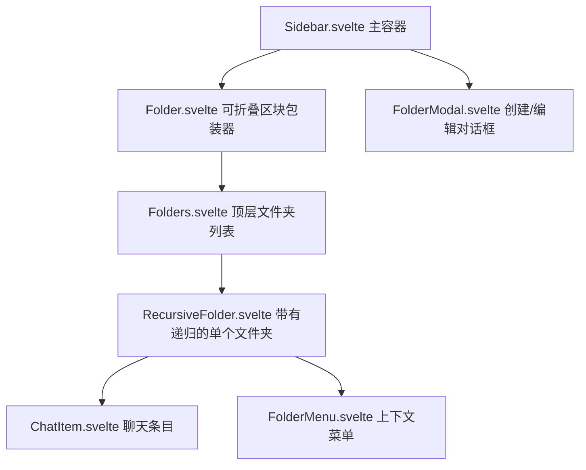
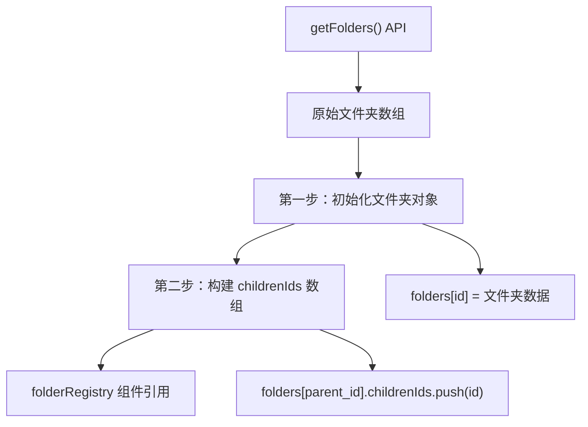
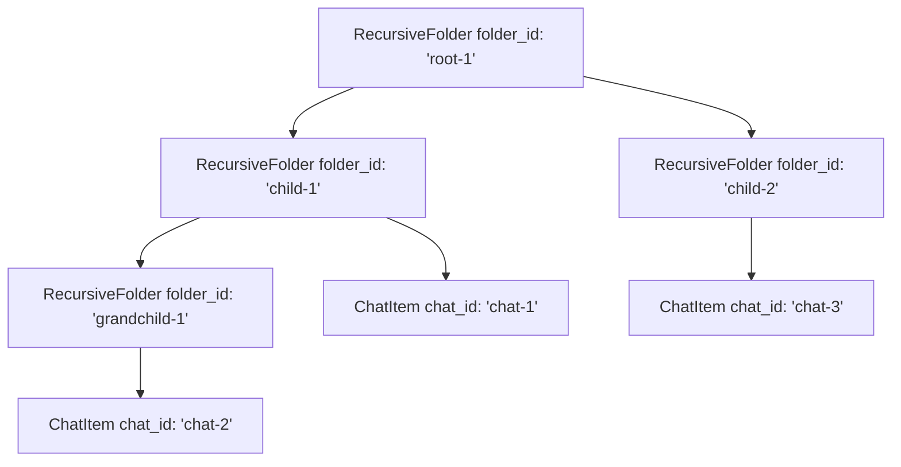
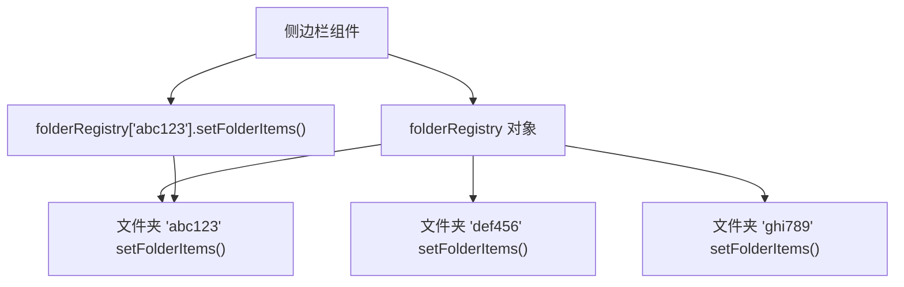
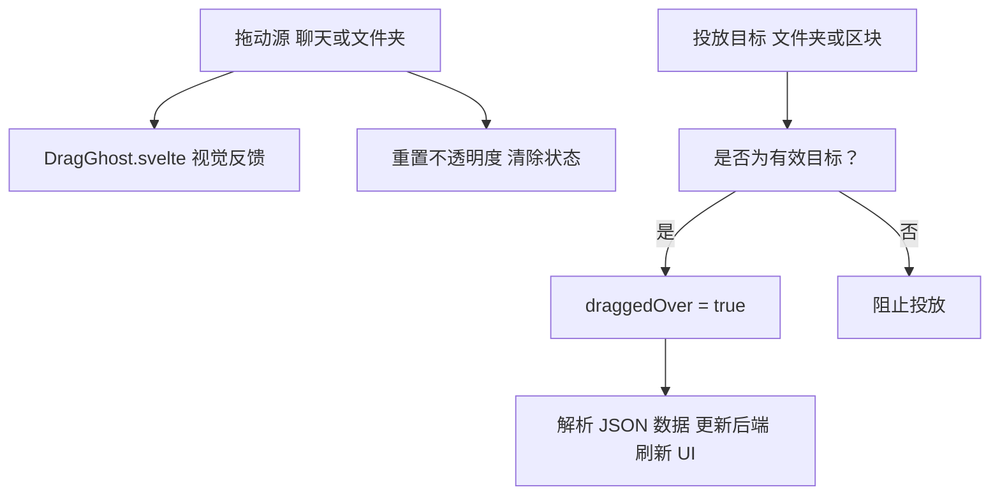
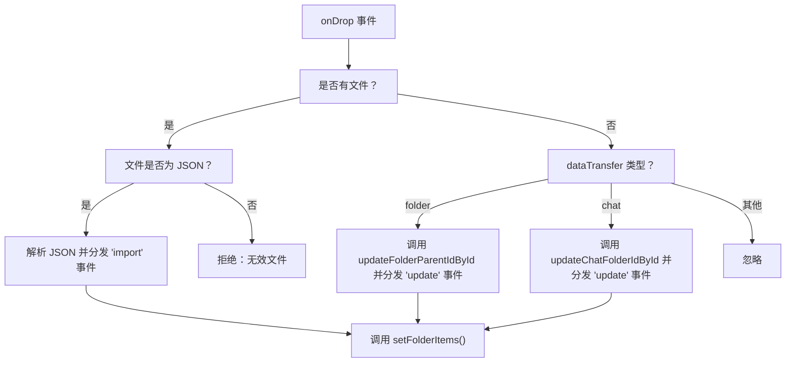
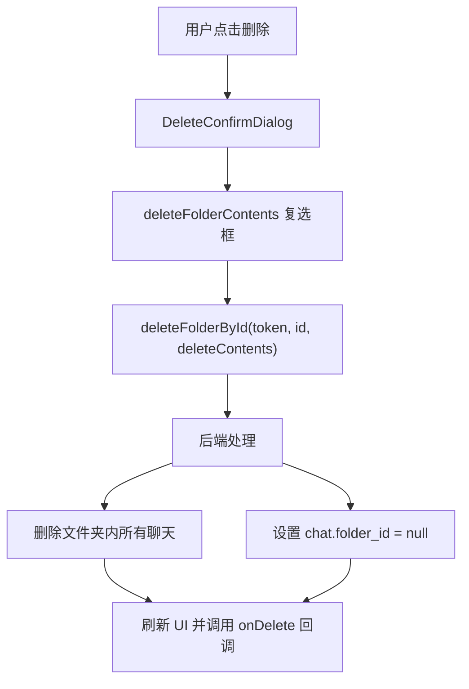
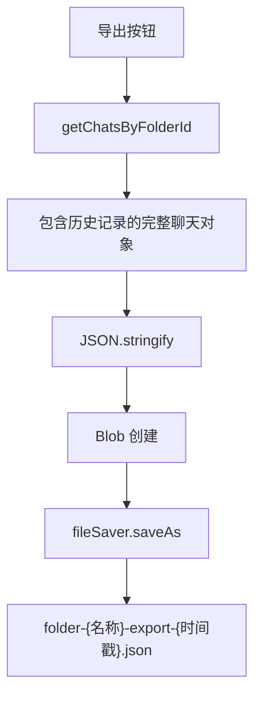
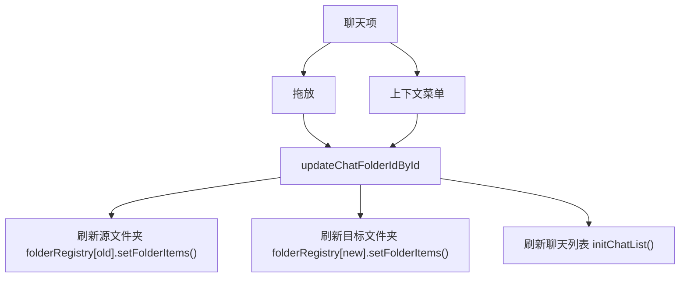
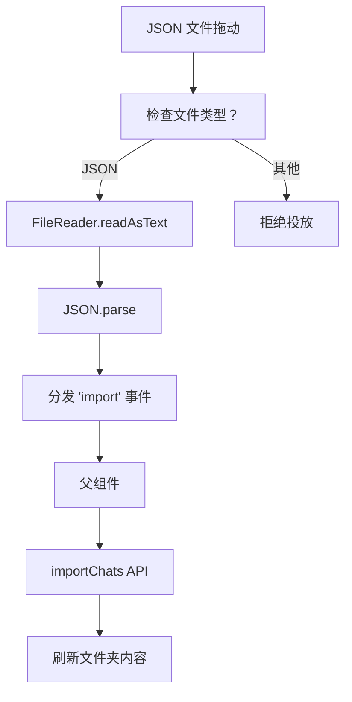

# 文件夹系统

相关源文件

-   [backend/open\_webui/migrations/versions/1af9b942657b\_migrate\_tags.py](https://github.com/open-webui/open-webui/blob/a7271532/backend/open_webui/migrations/versions/1af9b942657b_migrate_tags.py)
-   [backend/open\_webui/migrations/versions/3ab32c4b8f59\_update\_tags.py](https://github.com/open-webui/open-webui/blob/a7271532/backend/open_webui/migrations/versions/3ab32c4b8f59_update_tags.py)
-   [backend/open\_webui/migrations/versions/c69f45358db4\_add\_folder\_table.py](https://github.com/open-webui/open-webui/blob/a7271532/backend/open_webui/migrations/versions/c69f45358db4_add_folder_table.py)
-   [src/lib/apis/folders/index.ts](https://github.com/open-webui/open-webui/blob/a7271532/src/lib/apis/folders/index.ts)
-   [src/lib/components/common/ConfirmDialog.svelte](https://github.com/open-webui/open-webui/blob/a7271532/src/lib/components/common/ConfirmDialog.svelte)
-   [src/lib/components/common/DragGhost.svelte](https://github.com/open-webui/open-webui/blob/a7271532/src/lib/components/common/DragGhost.svelte)
-   [src/lib/components/common/Folder.svelte](https://github.com/open-webui/open-webui/blob/a7271532/src/lib/components/common/Folder.svelte)
-   [src/lib/components/icons/Document.svelte](https://github.com/open-webui/open-webui/blob/a7271532/src/lib/components/icons/Document.svelte)
-   [src/lib/components/layout/Sidebar.svelte](https://github.com/open-webui/open-webui/blob/a7271532/src/lib/components/layout/Sidebar.svelte)
-   [src/lib/components/layout/Sidebar/ChatItem.svelte](https://github.com/open-webui/open-webui/blob/a7271532/src/lib/components/layout/Sidebar/ChatItem.svelte)
-   [src/lib/components/layout/Sidebar/Folders.svelte](https://github.com/open-webui/open-webui/blob/a7271532/src/lib/components/layout/Sidebar/Folders.svelte)
-   [src/lib/components/layout/Sidebar/Folders/FolderMenu.svelte](https://github.com/open-webui/open-webui/blob/a7271532/src/lib/components/layout/Sidebar/Folders/FolderMenu.svelte)
-   [src/lib/components/layout/Sidebar/RecursiveFolder.svelte](https://github.com/open-webui/open-webui/blob/a7271532/src/lib/components/layout/Sidebar/RecursiveFolder.svelte)
-   [src/lib/components/workspace/Knowledge/ItemMenu.svelte](https://github.com/open-webui/open-webui/blob/a7271532/src/lib/components/workspace/Knowledge/ItemMenu.svelte)

## 概述

文件夹系统在 Open WebUI 的侧边栏中提供聊天记录的层级组织功能。用户可以创建嵌套的文件夹结构来对对话进行分类和管理，类似于文件系统。该系统支持通过拖放操作将聊天移动到文件夹中，以及重新排列文件夹层级。

有关侧边栏容器和聊天列表管理的信息，请参阅 [侧边栏架构](/open-webui/open-webui/7.2-content-extraction-engines)。有关聊天项操作（置顶、归档、标签）的详情，请参阅 [聊天项管理](/open-webui/open-webui/7.4-embedding-generation)。

## 数据模型

### 数据库模式

文件夹系统由 `folder` 表支持，支持父子关系和按用户划分的所有权：

**文件夹表结构：**

| 列名 | 类型 | 描述 |
| --- | --- | --- |
| `id` | Text | 主键，文件夹标识符 |
| `parent_id` | Text (可为空) | 引用父文件夹，根文件夹为 null |
| `user_id` | Text | 文件夹所有者 |
| `name` | Text | 文件夹显示名称 |
| `items` | JSON (可为空) | 关于包含项的元数据 |
| `meta` | JSON (可为空) | 额外元数据（如图标表情符号） |
| `is_expanded` | Boolean | UI 展开/折叠状态 |
| `created_at` | DateTime | 创建时间戳 |
| `updated_at` | DateTime | 最后修改时间戳 |

`chat` 表也有一个 `folder_id` 列，建立了聊天与文件夹之间的多对一关系。

**来源：** [backend/open\_webui/migrations/versions/c69f45358db4\_add\_folder\_table.py19-44](https://github.com/open-webui/open-webui/blob/a7271532/backend/open_webui/migrations/versions/c69f45358db4_add_folder_table.py#L19-L44)

### 文件夹-聊天关系图


**来源：** [backend/open\_webui/migrations/versions/c69f45358db4\_add\_folder\_table.py19-50](https://github.com/open-webui/open-webui/blob/a7271532/backend/open_webui/migrations/versions/c69f45358db4_add_folder_table.py#L19-L50)

## 前端架构

### 组件层级

文件夹 UI 由几个嵌套组件组成，它们协同工作以渲染层级结构：


**来源：** [src/lib/components/layout/Sidebar.svelte982-1033](https://github.com/open-webui/open-webui/blob/a7271532/src/lib/components/layout/Sidebar.svelte#L982-L1033) [src/lib/components/layout/Sidebar/Folders.svelte1-63](https://github.com/open-webui/open-webui/blob/a7271532/src/lib/components/layout/Sidebar/Folders.svelte#L1-L63) [src/lib/components/layout/Sidebar/RecursiveFolder.svelte1-663](https://github.com/open-webui/open-webui/blob/a7271532/src/lib/components/layout/Sidebar/RecursiveFolder.svelte#L1-L663)

### 状态管理

文件夹系统在多个层级维护状态：

**全局 Store (Svelte):**

-   `_folders` - 当前用户所有文件夹对象的数组。
-   `selectedFolder` - 当前选定的文件夹，用于过滤聊天视图。

**侧边栏本地状态:**

-   `folders` - 将文件夹 ID 映射到带有计算出的 `childrenIds` 的文件夹数据的对象。
-   `folderRegistry` - 将文件夹 ID 映射到组件实例的对象，用于命令式控制。

**文件夹树构建：**


**来源：** [src/lib/components/layout/Sidebar.svelte93-135](https://github.com/open-webui/open-webui/blob/a7271532/src/lib/components/layout/Sidebar.svelte#L93-L135)

`initFolders()` 中的初始化逻辑执行两步算法：

1.  **第一步：** 用原始文件夹数据填充 `folders` 对象。
2.  **第二步：** 通过在父文件夹上填充 `childrenIds` 数组来建立父子关系。

这种结构实现了高效的递归渲染并维护了引用完整性。

**来源：** [src/lib/components/layout/Sidebar.svelte93-135](https://github.com/open-webui/open-webui/blob/a7271532/src/lib/components/layout/Sidebar.svelte#L93-L135)

## API 层

### 文件夹操作

前端通过 TypeScript API 客户端与后端通信：

**API 函数：**

| 函数 | 方法 | 端点 | 用途 |
| --- | --- | --- | --- |
| `createNewFolder` | POST | `/folders/` | 创建新文件夹 |
| `getFolders` | GET | `/folders/` | 获取用户所有文件夹 |
| `getFolderById` | GET | `/folders/{id}` | 获取单个文件夹 |
| `updateFolderById` | POST | `/folders/{id}/update` | 更新名称/元数据/数据 |
| `updateFolderIsExpandedById` | POST | `/folders/{id}/update/expanded` | 更新展开状态 |
| `updateFolderParentIdById` | POST | `/folders/{id}/update/parent` | 在层级中移动文件夹 |
| `deleteFolderById` | DELETE | `/folders/{id}` | 删除文件夹（可选是否包含内容） |

**来源：** [src/lib/apis/folders/index.ts1-275](https://github.com/open-webui/open-webui/blob/a7271532/src/lib/apis/folders/index.ts#L1-L275)

### 文件夹创建流程

> **[Mermaid sequence]**
> *(图表结构无法解析)*

**来源：** [src/lib/components/layout/Sidebar.svelte137-181](https://github.com/open-webui/open-webui/blob/a7271532/src/lib/components/layout/Sidebar.svelte#L137-L181) [src/lib/apis/folders/index.ts9-35](https://github.com/open-webui/open-webui/blob/a7271532/src/lib/apis/folders/index.ts#L9-L35)

`Sidebar.svelte` 中的创建处理程序包含具有自动编号功能的重名检测：

```javascript
// 示例：如果 "Projects" 已存在，则创建 "Projects 1", "Projects 2" 等。
```
**来源：** [src/lib/components/layout/Sidebar.svelte143-155](https://github.com/open-webui/open-webui/blob/a7271532/src/lib/components/layout/Sidebar.svelte#L143-L155)

## 递归文件夹渲染

### RecursiveFolder 组件

`RecursiveFolder.svelte` 组件通过自递归实现渲染嵌套的文件夹层级：


**来源：** [src/lib/components/layout/Sidebar/RecursiveFolder.svelte620-639](https://github.com/open-webui/open-webui/blob/a7271532/src/lib/components/layout/Sidebar/RecursiveFolder.svelte#L620-L639)

### 文件夹项加载

文件夹在展开时会懒加载其聊天内容：

**加载状态：**

-   `chats = null` - 未加载 (文件夹已折叠)
-   `chats = []` - 已加载但为空
-   `chats = [...]` - 已加载且包含项

**来源：** [src/lib/components/layout/Sidebar/RecursiveFolder.svelte369-384](https://github.com/open-webui/open-webui/blob/a7271532/src/lib/components/layout/Sidebar/RecursiveFolder.svelte#L369-L384)

`setFolderItems()` 方法仅在文件夹打开时获取聊天记录：

```javascript
// 文件夹展开时触发
if (open) {
    chats = await getChatListByFolderId(localStorage.token, folderId);
}
```
**来源：** [src/lib/components/layout/Sidebar/RecursiveFolder.svelte370-380](https://github.com/open-webui/open-webui/blob/a7271532/src/lib/components/layout/Sidebar/RecursiveFolder.svelte#L370-L380)

### 文件夹注册表模式

`folderRegistry` 对象维护对文件夹组件实例的引用，使父组件能够命令式地触发更新：


**来源：** [src/lib/components/layout/Sidebar/RecursiveFolder.svelte251-257](https://github.com/open-webui/open-webui/blob/a7271532/src/lib/components/layout/Sidebar/RecursiveFolder.svelte#L251-L257) [src/lib/components/layout/Sidebar/Folders.svelte26-36](https://github.com/open-webui/open-webui/blob/a7271532/src/lib/components/layout/Sidebar/Folders.svelte#L26-L36)

每个文件夹在挂载时都会注册自己：

```javascript
folderRegistry[folderId] = {
    setFolderItems: () => {
        setFolderItems();
    }
};
```
**来源：** [src/lib/components/layout/Sidebar/RecursiveFolder.svelte253-256](https://github.com/open-webui/open-webui/blob/a7271532/src/lib/components/layout/Sidebar/RecursiveFolder.svelte#L253-L256)

## 拖放系统

### 拖放架构

文件夹系统为聊天和文件夹实现了全面的拖放功能：


**来源：** [src/lib/components/layout/Sidebar/RecursiveFolder.svelte74-249](https://github.com/open-webui/open-webui/blob/a7271532/src/lib/components/layout/Sidebar/RecursiveFolder.svelte#L74-L249) [src/lib/components/layout/Sidebar/ChatItem.svelte180-213](https://github.com/open-webui/open-webui/blob/a7271532/src/lib/components/layout/Sidebar/ChatItem.svelte#L180-L213)

### 数据传输格式

被拖动的项在 `dataTransfer` 对象中将其类型和数据编码为 JSON：

**聊天格式：**

```json
{
  "type": "chat",
  "id": "chat-uuid",
  "item": { /* 完整的聊天对象 */ }
}
```
**文件夹格式：**

```json
{
  "type": "folder",
  "id": "folder-uuid"
}
```
**来源：** [src/lib/components/layout/Sidebar/ChatItem.svelte186-193](https://github.com/open-webui/open-webui/blob/a7271532/src/lib/components/layout/Sidebar/ChatItem.svelte#L186-L193) [src/lib/components/layout/Sidebar/RecursiveFolder.svelte225-231](https://github.com/open-webui/open-webui/blob/a7271532/src/lib/components/layout/Sidebar/RecursiveFolder.svelte#L225-L231)

### 投放处理器逻辑

`RecursiveFolder` 组件处理三种投放场景：

1.  **JSON 文件投放：** 从文件导入聊天。
2.  **文件夹投放：** 将文件夹移动到此文件夹中（更改父级）。
3.  **聊天投放：** 将聊天移动到此文件夹中。


**来源：** [src/lib/components/layout/Sidebar/RecursiveFolder.svelte83-202](https://github.com/open-webui/open-webui/blob/a7271532/src/lib/components/layout/Sidebar/RecursiveFolder.svelte#L83-L202)

### 视觉反馈

系统在拖动操作期间提供视觉反馈：

**拖动幽灵 (Drag Ghost)：** 一个自定义的半透明元素跟随光标，显示正在拖动的内容。

**来源：** [src/lib/components/layout/Sidebar/RecursiveFolder.svelte447-458](https://github.com/open-webui/open-webui/blob/a7271532/src/lib/components/layout/Sidebar/RecursiveFolder.svelte#L447-L458) [src/lib/components/common/DragGhost.svelte1-31](https://github.com/open-webui/open-webui/blob/a7271532/src/lib/components/common/DragGhost.svelte#L1-L31)

**投放目标高亮：** 当拖动经过时，文件夹会显示半透明叠加层。

**来源：** [src/lib/components/layout/Sidebar/RecursiveFolder.svelte461-465](https://github.com/open-webui/open-webui/blob/a7271532/src/lib/components/layout/Sidebar/RecursiveFolder.svelte#L461-L465)

## 文件夹操作

### 重命名操作

文件夹可以通过双击或上下文菜单重命名：

> **[Mermaid sequence]**
> *(图表结构无法解析)*

**来源：** [src/lib/components/layout/Sidebar/RecursiveFolder.svelte386-349](https://github.com/open-webui/open-webui/blob/a7271532/src/lib/components/layout/Sidebar/RecursiveFolder.svelte#L386-L349) [src/lib/components/layout/Sidebar/RecursiveFolder.svelte551-581](https://github.com/open-webui/open-webui/blob/a7271532/src/lib/components/layout/Sidebar/RecursiveFolder.svelte#L551-L581)

重命名处理器包含验证和错误处理：

**来源：** [src/lib/components/layout/Sidebar/RecursiveFolder.svelte306-349](https://github.com/open-webui/open-webui/blob/a7271532/src/lib/components/layout/Sidebar/RecursiveFolder.svelte#L306-L349)

### 删除操作

文件夹删除支持两种模式：

1.  **仅删除文件夹：** 聊天记录被移动到根级别。
2.  **删除文件夹及其内容：** 删除所有聊天记录。


**来源：** [src/lib/components/layout/Sidebar/RecursiveFolder.svelte292-304](https://github.com/open-webui/open-webui/blob/a7271532/src/lib/components/layout/Sidebar/RecursiveFolder.svelte#L292-L304) [src/lib/components/layout/Sidebar/RecursiveFolder.svelte419-443](https://github.com/open-webui/open-webui/blob/a7271532/src/lib/components/layout/Sidebar/RecursiveFolder.svelte#L419-L443)

### 导出操作

文件夹可以导出为包含所有聊天记录的 JSON 文件：


**来源：** [src/lib/components/layout/Sidebar/RecursiveFolder.svelte402-416](https://github.com/open-webui/open-webui/blob/a7271532/src/lib/components/layout/Sidebar/RecursiveFolder.svelte#L402-L416)

## 展开/折叠状态管理

### 持久化展开状态

文件夹的展开/折叠状态会被持久化到后端，并带有防抖处理：

> **[Mermaid sequence]**
> *(图表结构无法解析)*

**来源：** [src/lib/components/layout/Sidebar/RecursiveFolder.svelte351-367](https://github.com/open-webui/open-webui/blob/a7271532/src/lib/components/layout/Sidebar/RecursiveFolder.svelte#L351-L367)

防抖机制防止了用户快速切换文件夹时产生过多的 API 调用：

**来源：** [src/lib/components/layout/Sidebar/RecursiveFolder.svelte362-367](https://github.com/open-webui/open-webui/blob/a7271532/src/lib/components/layout/Sidebar/RecursiveFolder.svelte#L362-L367)

### 文件夹选择

点击文件夹名称（而非人字形图标）将导航到一个过滤视图，仅显示该文件夹的聊天记录：

**来源：** [src/lib/components/layout/Sidebar/RecursiveFolder.svelte490-514](https://github.com/open-webui/open-webui/blob/a7271532/src/lib/components/layout/Sidebar/RecursiveFolder.svelte#L490-L514)

点击处理程序使用计时器来区分单击（选择）和双击（重命名）：

```javascript
clickTimer = setTimeout(async () => {
    const folder = await getFolderById(localStorage.token, folderId);
    if (folder) {
        await selectedFolder.set(folder);
    }
    await goto('/');
    // ...
}, 100); // 100 毫秒延迟
```
**来源：** [src/lib/components/layout/Sidebar/RecursiveFolder.svelte497-513](https://github.com/open-webui/open-webui/blob/a7271532/src/lib/components/layout/Sidebar/RecursiveFolder.svelte#L497-L513)

## 聊天-文件夹集成

### 将聊天移动到文件夹

聊天记录可以通过多种机制移动到文件夹：

1.  **拖放**：从聊天列表拖动到文件夹。
2.  **拖放**：从一个文件夹拖动到另一个文件夹。
3.  **上下文菜单**：“移动到文件夹 (Move to Folder)”选项。


**来源：** [src/lib/components/layout/Sidebar/ChatItem.svelte142-163](https://github.com/open-webui/open-webui/blob/a7271532/src/lib/components/layout/Sidebar/ChatItem.svelte#L142-L163) [src/lib/components/layout/Sidebar/RecursiveFolder.svelte173-190](https://github.com/open-webui/open-webui/blob/a7271532/src/lib/components/layout/Sidebar/RecursiveFolder.svelte#L173-L190)

### 从文件夹中移除聊天

当聊天记录从文件夹拖动到根“聊天 (Chats)”区块时：

**来源：** [src/lib/components/layout/Sidebar.svelte1046-1101](https://github.com/open-webui/open-webui/blob/a7271532/src/lib/components/layout/Sidebar.svelte#L1046-L1101)

处理程序检查聊天是否具有 `folder_id` 并将其清除：

```javascript
if (chat.folder_id) {
    const res = await updateChatFolderIdById(localStorage.token, chat.id, null);
    folderRegistry[chat.folder_id]?.setFolderItems();
}
```
**来源：** [src/lib/components/layout/Sidebar.svelte1068-1077](https://github.com/open-webui/open-webui/blob/a7271532/src/lib/components/layout/Sidebar.svelte#L1068-L1077)

## UI 特性

### 文件夹元数据

文件夹支持包含自定义图标在内的元数据：

**元数据对象 (Meta Object):**

```json
{
  "icon": ":emoji_shortcode:"
}
```
**来源：** [src/lib/components/layout/Sidebar/RecursiveFolder.svelte528-539](https://github.com/open-webui/open-webui/blob/a7271532/src/lib/components/layout/Sidebar/RecursiveFolder.svelte#L528-L539)

文件夹按钮显示自定义表情符号或人字形图标：

```html
{#if folders[folderId]?.meta?.icon}
    <Emoji className="size-3.5" shortCode={folders[folderId].meta.icon} />
{:else}
    <ChevronDown/Right />
{/if}
```
**来源：** [src/lib/components/layout/Sidebar/RecursiveFolder.svelte528-548](https://github.com/open-webui/open-webui/blob/a7271532/src/lib/components/layout/Sidebar/RecursiveFolder.svelte#L528-L548)

### 文件夹菜单

上下文菜单提供了对文件夹操作的快速访问：

| 菜单项 | 操作 | API 调用 |
| --- | --- | --- |
| 编辑 | 打开 FolderModal | 无 (由模态框处理更新) |
| 导出 | 下载为 JSON | `getChatsByFolderId` |
| 删除 | 显示确认对话框 | `deleteFolderById` |

**来源：** [src/lib/components/layout/Sidebar/Folders/FolderMenu.svelte1-83](https://github.com/open-webui/open-webui/blob/a7271532/src/lib/components/layout/Sidebar/Folders/FolderMenu.svelte#L1-L83)

### 通过文件投放进行导入

用户可以将 JSON 文件拖动到文件夹上以导入聊天记录：


**来源：** [src/lib/components/layout/Sidebar/RecursiveFolder.svelte93-127](https://github.com/open-webui/open-webui/blob/a7271532/src/lib/components/layout/Sidebar/RecursiveFolder.svelte#L93-L127)

导入的数据结构与导出格式匹配，包含带有元数据的聊天对象。

**来源：** [src/lib/components/layout/Sidebar.svelte239-258](https://github.com/open-webui/open-webui/blob/a7271532/src/lib/components/layout/Sidebar.svelte#L239-L258)

### 可折叠区块包装器 (Collapsible Section Wrapper)

通用的 `Folder.svelte` 组件为 UI 组织提供了一个可复用的可折叠区块：

**在侧边栏中的用法：**

-   “模型 (Models)”区块 (置顶模型)
-   “频道 (Channels)”区块 (通信频道)
-   “文件夹 (Folders)”区块 (用户文件夹)
-   “聊天 (Chats)”区块 (聊天列表)

**来源：** [src/lib/components/layout/Sidebar.svelte936-1033](https://github.com/open-webui/open-webui/blob/a7271532/src/lib/components/layout/Sidebar.svelte#L936-L1033) [src/lib/components/common/Folder.svelte1-203](https://github.com/open-webui/open-webui/blob/a7271532/src/lib/components/common/Folder.svelte#L1-L203)

该组件还支持通过拖放来导入聊天记录。

**来源：** [src/lib/components/common/Folder.svelte33-104](https://github.com/open-webui/open-webui/blob/a7271532/src/lib/components/common/Folder.svelte#L33-L104)
