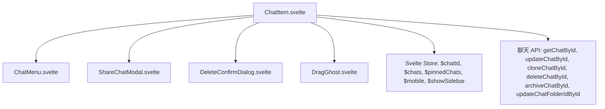
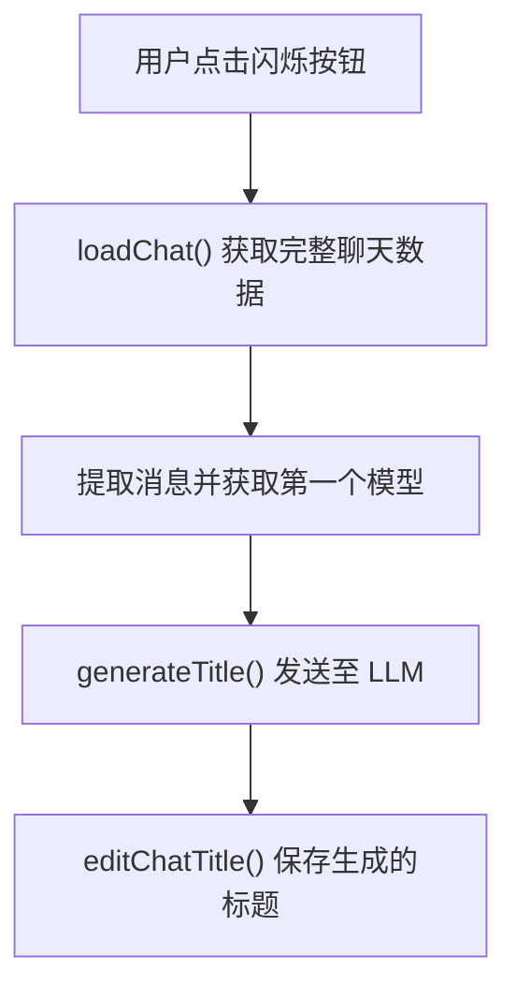
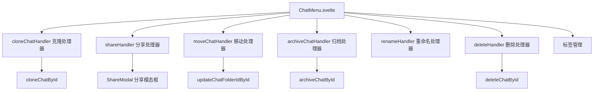
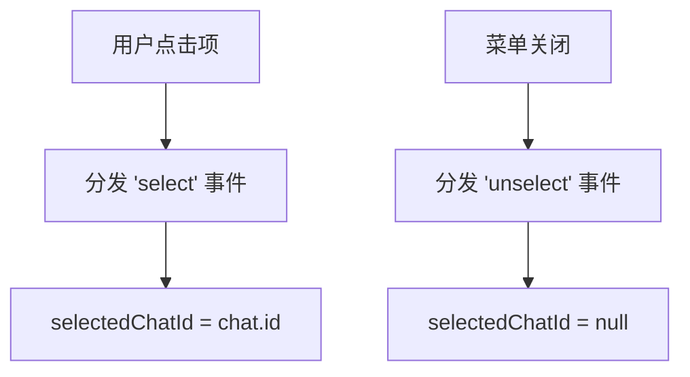
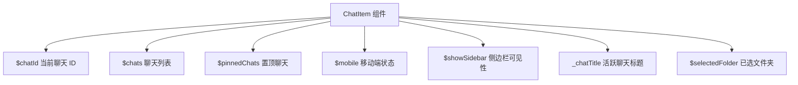

# 聊天项管理

相关源文件

-   [backend/open\_webui/migrations/versions/1af9b942657b\_migrate\_tags.py](https://github.com/open-webui/open-webui/blob/a7271532/backend/open_webui/migrations/versions/1af9b942657b_migrate_tags.py)
-   [backend/open\_webui/migrations/versions/3ab32c4b8f59\_update\_tags.py](https://github.com/open-webui/open-webui/blob/a7271532/backend/open_webui/migrations/versions/3ab32c4b8f59_update_tags.py)
-   [backend/open\_webui/migrations/versions/c69f45358db4\_add\_folder\_table.py](https://github.com/open-webui/open-webui/blob/a7271532/backend/open_webui/migrations/versions/c69f45358db4_add_folder_table.py)
-   [src/lib/apis/folders/index.ts](https://github.com/open-webui/open-webui/blob/a7271532/src/lib/apis/folders/index.ts)
-   [src/lib/components/common/ConfirmDialog.svelte](https://github.com/open-webui/open-webui/blob/a7271532/src/lib/components/common/ConfirmDialog.svelte)
-   [src/lib/components/common/DragGhost.svelte](https://github.com/open-webui/open-webui/blob/a7271532/src/lib/components/common/DragGhost.svelte)
-   [src/lib/components/common/Folder.svelte](https://github.com/open-webui/open-webui/blob/a7271532/src/lib/components/common/Folder.svelte)
-   [src/lib/components/icons/Document.svelte](https://github.com/open-webui/open-webui/blob/a7271532/src/lib/components/icons/Document.svelte)
-   [src/lib/components/layout/Sidebar.svelte](https://github.com/open-webui/open-webui/blob/a7271532/src/lib/components/layout/Sidebar.svelte)
-   [src/lib/components/layout/Sidebar/ChatItem.svelte](https://github.com/open-webui/open-webui/blob/a7271532/src/lib/components/layout/Sidebar/ChatItem.svelte)
-   [src/lib/components/layout/Sidebar/Folders.svelte](https://github.com/open-webui/open-webui/blob/a7271532/src/lib/components/layout/Sidebar/Folders.svelte)
-   [src/lib/components/layout/Sidebar/Folders/FolderMenu.svelte](https://github.com/open-webui/open-webui/blob/a7271532/src/lib/components/layout/Sidebar/Folders/FolderMenu.svelte)
-   [src/lib/components/layout/Sidebar/RecursiveFolder.svelte](https://github.com/open-webui/open-webui/blob/a7271532/src/lib/components/layout/Sidebar/RecursiveFolder.svelte)
-   [src/lib/components/workspace/Knowledge/ItemMenu.svelte](https://github.com/open-webui/open-webui/blob/a7271532/src/lib/components/workspace/Knowledge/ItemMenu.svelte)

## 目的与范围

本文档涵盖了 `ChatItem` 组件，该组件代表侧边栏中的单个聊天条目。该组件处理标题编辑、克隆、删除、归档、分享、标签管理以及用于组织聊天的拖放操作。有关更广泛的侧边栏结构和文件夹层级的信息，请参阅 [文件夹系统](/open-webui/open-webui/7.3-text-splitting-and-chunking)。有关聊天列表显示和分页的详情，请参阅 [侧边栏架构](/open-webui/open-webui/7.2-content-extraction-engines)。

来源： [src/lib/components/layout/Sidebar/ChatItem.svelte1-571](https://github.com/open-webui/open-webui/blob/a7271532/src/lib/components/layout/Sidebar/ChatItem.svelte#L1-L571)

## 组件架构

侧边栏中的每个聊天记录都会实例化一个 `ChatItem` 组件，显示聊天标题并通过悬停菜单提供上下文操作。该组件支持普通显示模式和用于标题更新的内联编辑模式。

### ChatItem 组件结构


**ChatItem Props 与状态**

| Prop | 类型 | 用途 |
| --- | --- | --- |
| `id` | string | 唯一聊天标识符 |
| `title` | string | 聊天的显示标题 |
| `selected` | boolean | 该项当前是否被选中 |
| `shiftKey` | boolean | 用于批量操作的 Shift 键状态 |
| `className` | string | 额外的 CSS 类 |
| `onDragEnd` | function | 拖放操作完成后的回调 |

来源： [src/lib/components/layout/Sidebar/ChatItem.svelte46-54](https://github.com/open-webui/open-webui/blob/a7271532/src/lib/components/layout/Sidebar/ChatItem.svelte#L46-L54) [src/lib/components/layout/Sidebar/ChatItem.svelte56-62](https://github.com/open-webui/open-webui/blob/a7271532/src/lib/components/layout/Sidebar/ChatItem.svelte#L56-L62)

### 显示模式

该组件有两种主要运行模式：

1.  **普通模式**：将聊天标题显示为可点击的链接。
2.  **编辑模式**：显示一个用于重命名的内联文本输入框。

> **[Mermaid stateDiagram]**
> *(图表结构无法解析)*

来源： [src/lib/components/layout/Sidebar/ChatItem.svelte353-432](https://github.com/open-webui/open-webui/blob/a7271532/src/lib/components/layout/Sidebar/ChatItem.svelte#L353-L432)

## 标题管理

### 手动标题编辑

用户可以通过双击激活或通过上下文菜单重命名聊天。组件使用 `confirmEdit` 标志追踪编辑状态，并管理标题输入框的生命周期。

**编辑流程**：

1.  用户双击聊天项或从菜单中选择“重命名”。
2.  `renameHandler` 设置 `confirmEdit = true` 并聚焦输入框。
3.  输入框显示并选中当前标题。
4.  用户修改标题并按回车键或点击别处。
5.  `editChatTitle` 通过 API 更新聊天记录。

> **[Mermaid sequence]**
> *(图表结构无法解析)*

**关键函数**：

-   `renameHandler()` - 激活编辑模式 [src/lib/components/layout/Sidebar/ChatItem.svelte267-280](https://github.com/open-webui/open-webui/blob/a7271532/src/lib/components/layout/Sidebar/ChatItem.svelte#L267-L280)
-   `editChatTitle(id, title)` - 持久化标题更改 [src/lib/components/layout/Sidebar/ChatItem.svelte77-95](https://github.com/open-webui/open-webui/blob/a7271532/src/lib/components/layout/Sidebar/ChatItem.svelte#L77-L95)
-   `chatTitleInputKeydownHandler(e)` - 处理回车/退出键 [src/lib/components/layout/Sidebar/ChatItem.svelte253-265](https://github.com/open-webui/open-webui/blob/a7271532/src/lib/components/layout/Sidebar/ChatItem.svelte#L253-L265)

来源： [src/lib/components/layout/Sidebar/ChatItem.svelte73-95](https://github.com/open-webui/open-webui/blob/a7271532/src/lib/components/layout/Sidebar/ChatItem.svelte#L73-L95) [src/lib/components/layout/Sidebar/ChatItem.svelte267-280](https://github.com/open-webui/open-webui/blob/a7271532/src/lib/components/layout/Sidebar/ChatItem.svelte#L267-L280) [src/lib/components/layout/Sidebar/ChatItem.svelte353-388](https://github.com/open-webui/open-webui/blob/a7271532/src/lib/components/layout/Sidebar/ChatItem.svelte#L353-L388)

### AI 驱动的标题生成

组件支持使用 LLM 分析聊天内容自动生成标题。在编辑模式下点击闪烁按钮即可触发。

**生成过程**：


**实现细节**：

-   `generating` 标志防止重复请求 [src/lib/components/layout/Sidebar/ChatItem.svelte167](https://github.com/open-webui/open-webui/blob/a7271532/src/lib/components/layout/Sidebar/ChatItem.svelte#L167-L167)
-   从消息历史中提取 `role` 和 `content` [src/lib/components/layout/Sidebar/ChatItem.svelte288-293](https://github.com/open-webui/open-webui/blob/a7271532/src/lib/components/layout/Sidebar/ChatItem.svelte#L288-L293)
-   使用聊天配置中的第一个模型 [src/lib/components/layout/Sidebar/ChatItem.svelte295](https://github.com/open-webui/open-webui/blob/a7271532/src/lib/components/layout/Sidebar/ChatItem.svelte#L295-L295)
-   调用 `generateTitle(token, model, messages)` API [src/lib/components/layout/Sidebar/ChatItem.svelte299-304](https://github.com/open-webui/open-webui/blob/a7271532/src/lib/components/layout/Sidebar/ChatItem.svelte#L299-L304)

来源： [src/lib/components/layout/Sidebar/ChatItem.svelte282-317](https://github.com/open-webui/open-webui/blob/a7271532/src/lib/components/layout/Sidebar/ChatItem.svelte#L282-L317) [src/lib/components/layout/Sidebar/ChatItem.svelte459-470](https://github.com/open-webui/open-webui/blob/a7271532/src/lib/components/layout/Sidebar/ChatItem.svelte#L459-L470)

## 聊天操作

### ChatMenu 集成

`ChatMenu` 组件提供了一个包含所有聊天操作的下拉菜单。它在悬停或选中该项时出现。


来源： [src/lib/components/layout/Sidebar/ChatItem.svelte500-524](https://github.com/open-webui/open-webui/blob/a7271532/src/lib/components/layout/Sidebar/ChatItem.svelte#L500-L524)

### 克隆操作

创建一个聊天的副本，包含所有消息和配置。

**克隆处理器**：

```text
cloneChatHandler(id)
├── 调用 cloneChatById(token, id, title)
├── title = i18n.t('Clone of {{TITLE}}', {TITLE: title})
├── 导航至 /c/{new_id}
└── 刷新聊天列表 ($chats, $pinnedChats)
```
来源： [src/lib/components/layout/Sidebar/ChatItem.svelte97-116](https://github.com/open-webui/open-webui/blob/a7271532/src/lib/components/layout/Sidebar/ChatItem.svelte#L97-L116)

### 删除操作

删除需要通过 `DeleteConfirmDialog` 进行确认。如果被删除的聊天当前正处于打开状态，用户将被重定向到首页。

**删除流程**：

1.  用户从菜单中点击删除。
2.  `showDeleteConfirm` 设置为 true。
3.  用户在模态框中确认。
4.  调用 `deleteChatHandler(id)`。
5.  调用 `deleteChatById` API。
6.  如果 `$chatId === id`，则导航至 `/` 并重置 `chatId`。
7.  向父级分发 'change' 事件。

来源： [src/lib/components/layout/Sidebar/ChatItem.svelte118-135](https://github.com/open-webui/open-webui/blob/a7271532/src/lib/components/layout/Sidebar/ChatItem.svelte#L118-L135) [src/lib/components/layout/Sidebar/ChatItem.svelte322-332](https://github.com/open-webui/open-webui/blob/a7271532/src/lib/components/layout/Sidebar/ChatItem.svelte#L322-L332) [src/lib/components/layout/Sidebar/ChatItem.svelte513-515](https://github.com/open-webui/open-webui/blob/a7271532/src/lib/components/layout/Sidebar/ChatItem.svelte#L513-L515)

### 归档操作

归档操作会将聊天从主列表中移除但不删除。可以通过“归档聊天 (Archived Chats)”模态框访问已归档的聊天。

来源： [src/lib/components/layout/Sidebar/ChatItem.svelte137-140](https://github.com/open-webui/open-webui/blob/a7271532/src/lib/components/layout/Sidebar/ChatItem.svelte#L137-L140) [src/lib/components/layout/Sidebar/ChatItem.svelte474-484](https://github.com/open-webui/open-webui/blob/a7271532/src/lib/components/layout/Sidebar/ChatItem.svelte#L474-L484)

### 移动至文件夹

聊天可以在文件夹之间移动，或完全从文件夹中移出。

**移动处理器**：

```text
moveChatHandler(chatId, folderId)
├── 验证 chatId 和 folderId 是否存在
├── 调用 updateChatFolderIdById(token, chatId, folderId)
├── 刷新聊天列表
├── 分发 'change' 事件
└── 显示成功/错误提示 (toast)
```
来源： [src/lib/components/layout/Sidebar/ChatItem.svelte142-163](https://github.com/open-webui/open-webui/blob/a7271532/src/lib/components/layout/Sidebar/ChatItem.svelte#L142-L163)

### 分享操作

打开 `ShareChatModal` 以生成公开分享链接。

来源： [src/lib/components/layout/Sidebar/ChatItem.svelte72](https://github.com/open-webui/open-webui/blob/a7271532/src/lib/components/layout/Sidebar/ChatItem.svelte#L72-L72) [src/lib/components/layout/Sidebar/ChatItem.svelte320](https://github.com/open-webui/open-webui/blob/a7271532/src/lib/components/layout/Sidebar/ChatItem.svelte#L320-L320) [src/lib/components/layout/Sidebar/ChatItem.svelte505-507](https://github.com/open-webui/open-webui/blob/a7271532/src/lib/components/layout/Sidebar/ChatItem.svelte#L505-L507)

## 拖放系统

### 拖动实现

ChatItem 组件实现了 HTML5 拖放功能，用于将聊天整理到文件夹或更改其排序。

**拖动状态管理**：

| 状态变量 | 用途 |
| --- | --- |
| `draggable` | 该项是否可以被拖动（在聊天数据加载前为 false） |
| `dragged` | 当前正处于被拖动状态 |
| `x`, `y` | 幽灵元素的当前拖动坐标 |
| `itemElement` | 对 DOM 元素的引用 |

**拖动事件处理器**：

> **[Mermaid sequence]**
> *(图表结构无法解析)*

**数据传输格式**：

```json
{
  "type": "chat",
  "id": "chat-uuid",
  "item": {
    "chat": {...},
    "meta": {...},
    "created_at": 123456789,
    "updated_at": 123456789
  }
}
```
来源： [src/lib/components/layout/Sidebar/ChatItem.svelte165-213](https://github.com/open-webui/open-webui/blob/a7271532/src/lib/components/layout/Sidebar/ChatItem.svelte#L165-L213) [src/lib/components/layout/Sidebar/ChatItem.svelte180-197](https://github.com/open-webui/open-webui/blob/a7271532/src/lib/components/layout/Sidebar/ChatItem.svelte#L180-L197) [src/lib/components/layout/Sidebar/ChatItem.svelte334-345](https://github.com/open-webui/open-webui/blob/a7271532/src/lib/components/layout/Sidebar/ChatItem.svelte#L334-L345)

### 聊天数据懒加载

该组件实现了懒加载：仅当用户悬停在项上时才获取完整的聊天数据，从而开启拖放操作。

**加载流程**：

```text
mouseOver = true (鼠标悬停)
    ├── 触发 loadChat()
    ├── draggable = false
    ├── chat = getChatById(token, id)
    └── draggable = true
```
来源： [src/lib/components/layout/Sidebar/ChatItem.svelte58-70](https://github.com/open-webui/open-webui/blob/a7271532/src/lib/components/layout/Sidebar/ChatItem.svelte#L58-L70)

### 视觉反馈

`DragGhost` 组件在拖动操作期间显示一个跟随光标的半透明预览。

来源： [src/lib/components/layout/Sidebar/ChatItem.svelte334-345](https://github.com/open-webui/open-webui/blob/a7271532/src/lib/components/layout/Sidebar/ChatItem.svelte#L334-L345) [src/lib/components/common/DragGhost.svelte1-31](https://github.com/open-webui/open-webui/blob/a7271532/src/lib/components/common/DragGhost.svelte#L1-L31)

## 选择与键盘导航

### 选择状态

组件支持选择追踪，用于键盘导航和批量操作。

**选择事件**：

-   `on:select` - 点击聊天时分发
-   `on:unselect` - 聊天菜单关闭或失去焦点时分发


来源： [src/lib/components/layout/Sidebar/ChatItem.svelte51-52](https://github.com/open-webui/open-webui/blob/a7271532/src/lib/components/layout/Sidebar/ChatItem.svelte#L51-L52) [src/lib/components/layout/Sidebar/ChatItem.svelte399-401](https://github.com/open-webui/open-webui/blob/a7271532/src/lib/components/layout/Sidebar/ChatItem.svelte#L399-L401) [src/lib/components/layout/Sidebar/ChatItem.svelte529-531](https://github.com/open-webui/open-webui/blob/a7271532/src/lib/components/layout/Sidebar/ChatItem.svelte#L529-L531)

### Shift 键行为

按住 Shift 键时，菜单显示快速操作按钮（归档、删除）而不是下拉菜单。

**条件菜单显示**：

```text
如果 (shiftKey 且 mouseOver)
    显示：归档按钮、删除按钮
否则
    显示：ChatMenu 下拉菜单
```
来源： [src/lib/components/layout/Sidebar/ChatItem.svelte472-497](https://github.com/open-webui/open-webui/blob/a7271532/src/lib/components/layout/Sidebar/ChatItem.svelte#L472-L497)

### 键盘快捷键

该组件通过隐藏的按钮元素支持键盘快捷键：

-   `#delete-chat-button` - 在聊天处于活跃状态时由全局键盘快捷键触发。

来源： [src/lib/components/layout/Sidebar/ChatItem.svelte546-566](https://github.com/open-webui/open-webui/blob/a7271532/src/lib/components/layout/Sidebar/ChatItem.svelte#L546-L566)

## 状态管理与事件

### 父级通信

组件分发事件以通知父级 Sidebar 组件状态的变化：

| 事件 | 负载 | 用途 |
| --- | --- | --- |
| `select` | 无 | 该项被点击 |
| `unselect` | 无 | 该项失去焦点 |
| `change` | 无 | 聊天列表需要刷新 |
| `tag` | `{type, name}` | 标签被添加/移除 |

来源： [src/lib/components/layout/Sidebar/ChatItem.svelte7](https://github.com/open-webui/open-webui/blob/a7271532/src/lib/components/layout/Sidebar/ChatItem.svelte#L7-L7) [src/lib/components/layout/Sidebar/ChatItem.svelte93](https://github.com/open-webui/open-webui/blob/a7271532/src/lib/components/layout/Sidebar/ChatItem.svelte#L93-L93) [src/lib/components/layout/Sidebar/ChatItem.svelte519-524](https://github.com/open-webui/open-webui/blob/a7271532/src/lib/components/layout/Sidebar/ChatItem.svelte#L519-L524)

### Store 集成

组件读取并更新多个全局 Svelte store：


来源： [src/lib/components/layout/Sidebar/ChatItem.svelte9-31](https://github.com/open-webui/open-webui/blob/a7271532/src/lib/components/layout/Sidebar/ChatItem.svelte#L9-L31)

### 生命周期管理

组件使用 Svelte 生命周期钩子进行事件监听器管理：

**onMount (挂载)**:

-   为编辑模式注册外部点击处理器。
-   在 `itemElement` 上绑定拖放事件监听器。

**onDestroy (销毁)**:

-   移除所有事件监听器以防止内存泄漏。

来源： [src/lib/components/layout/Sidebar/ChatItem.svelte228-239](https://github.com/open-webui/open-webui/blob/a7271532/src/lib/components/layout/Sidebar/ChatItem.svelte#L228-L239) [src/lib/components/layout/Sidebar/ChatItem.svelte241-249](https://github.com/open-webui/open-webui/blob/a7271532/src/lib/components/layout/Sidebar/ChatItem.svelte#L241-L249)

## UI 状态与样式

### 活跃状态指示器

组件根据其状态应用不同的样式：

| 条件 | CSS 类 | 用途 |
| --- | --- | --- |
| `id === $chatId` | `bg-gray-100 dark:bg-gray-900 selected` | 当前活跃的聊天 |
| `confirmEdit` | 同活跃状态 | 编辑模式已激活 |
| `selected` | `bg-gray-100 dark:bg-gray-950 selected` | 为键盘导航而选中 |
| 默认 | `group-hover:bg-gray-100 dark:group-hover:bg-gray-950` | 悬停状态 |

来源： [src/lib/components/layout/Sidebar/ChatItem.svelte356-361](https://github.com/open-webui/open-webui/blob/a7271532/src/lib/components/layout/Sidebar/ChatItem.svelte#L356-L361) [src/lib/components/layout/Sidebar/ChatItem.svelte392-397](https://github.com/open-webui/open-webui/blob/a7271532/src/lib/components/layout/Sidebar/ChatItem.svelte#L392-L397)

### 菜单按钮可见性

菜单按钮使用 CSS 可见性类，使其仅在悬停或项处于活跃/选中状态时出现：

```text
可见情况：
    - id === $chatId (当前正打开)
    - confirmEdit (正在编辑)
    - selected (键盘选中)

不可见 + group-hover:可见：
    - 不满足上述任何情况
```
来源： [src/lib/components/layout/Sidebar/ChatItem.svelte437-447](https://github.com/open-webui/open-webui/blob/a7271532/src/lib/components/layout/Sidebar/ChatItem.svelte#L437-L447)
