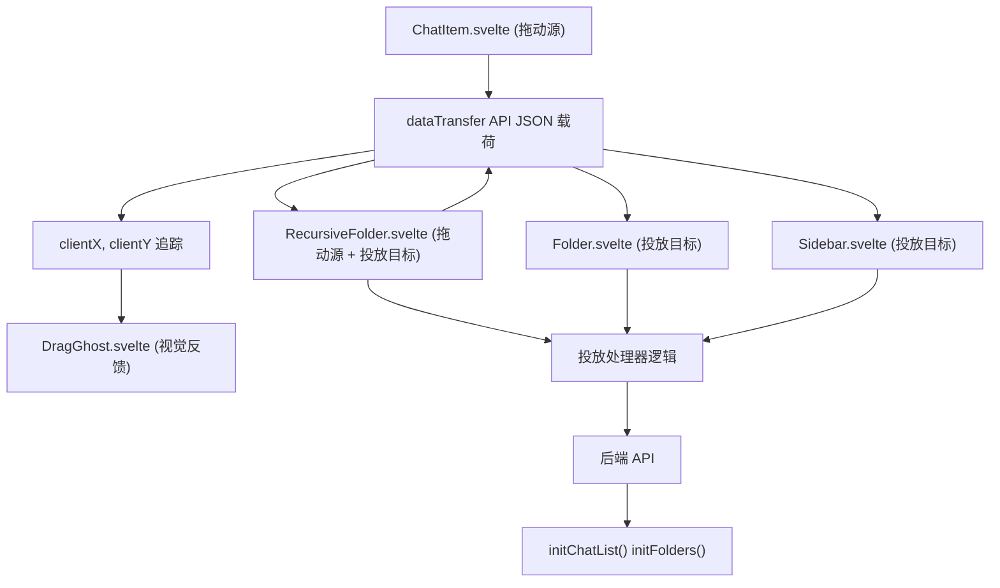
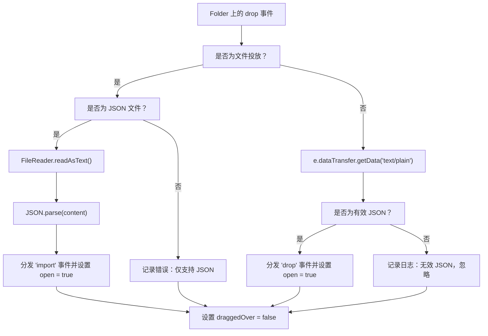
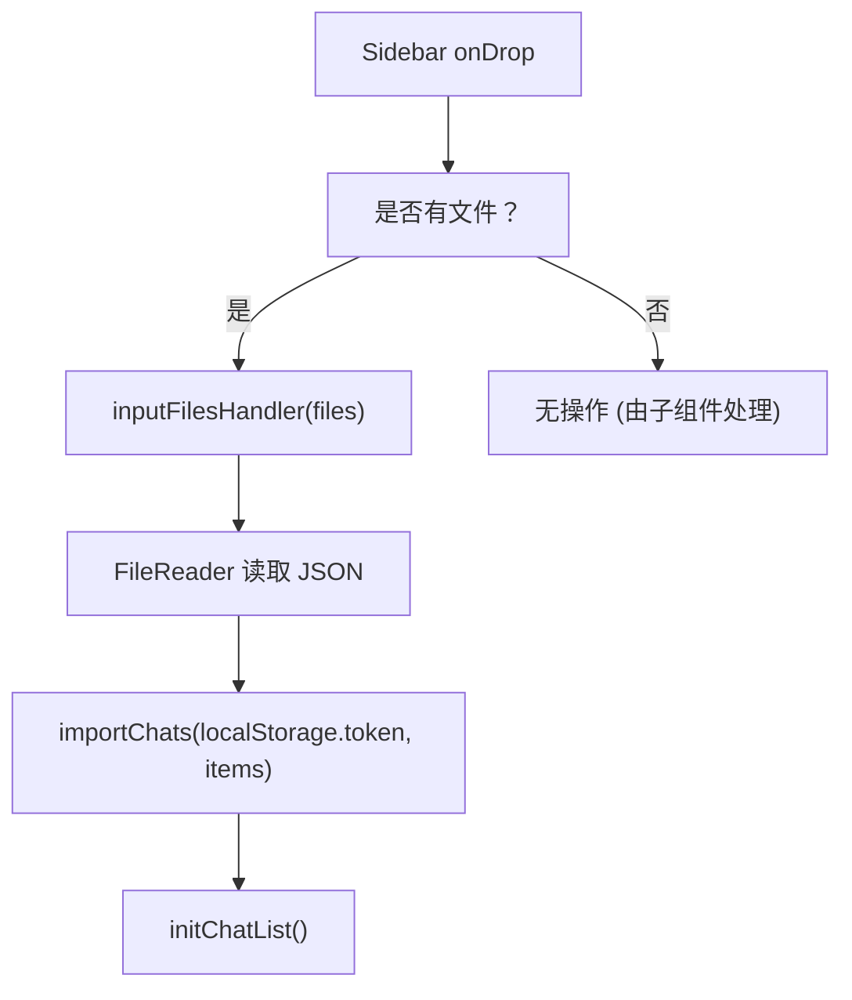
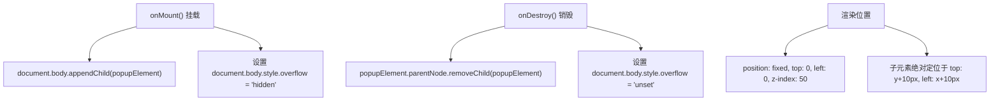
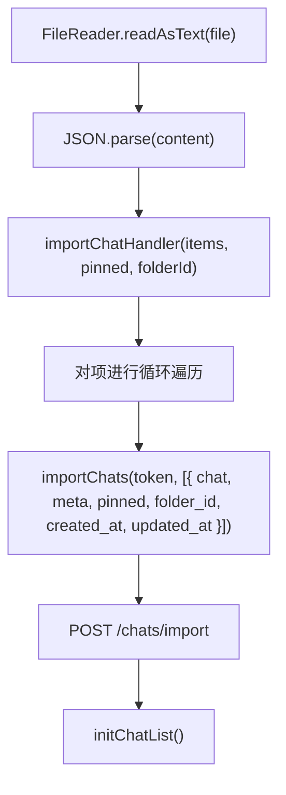
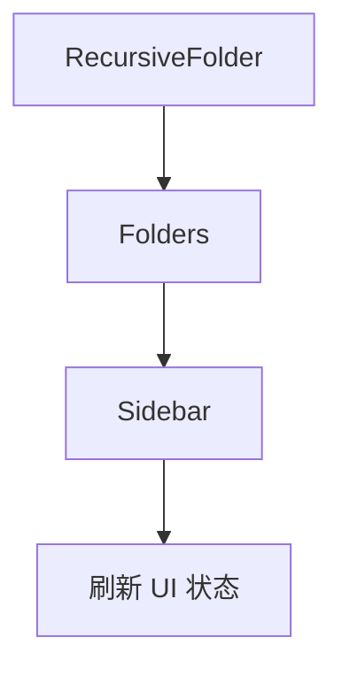

# 拖放系统

相关源文件

-   [backend/open\_webui/migrations/versions/1af9b942657b\_migrate\_tags.py](https://github.com/open-webui/open-webui/blob/a7271532/backend/open_webui/migrations/versions/1af9b942657b_migrate_tags.py)
-   [backend/open\_webui/migrations/versions/3ab32c4b8f59\_update\_tags.py](https://github.com/open-webui/open-webui/blob/a7271532/backend/open_webui/migrations/versions/3ab32c4b8f59_update_tags.py)
-   [backend/open\_webui/migrations/versions/c69f45358db4\_add\_folder\_table.py](https://github.com/open-webui/open-webui/blob/a7271532/backend/open_webui/migrations/versions/c69f45358db4_add_folder_table.py)
-   [src/lib/apis/folders/index.ts](https://github.com/open-webui/open-webui/blob/a7271532/src/lib/apis/folders/index.ts)
-   [src/lib/components/common/ConfirmDialog.svelte](https://github.com/open-webui/open-webui/blob/a7271532/src/lib/components/common/ConfirmDialog.svelte)
-   [src/lib/components/common/DragGhost.svelte](https://github.com/open-webui/open-webui/blob/a7271532/src/lib/components/common/DragGhost.svelte)
-   [src/lib/components/common/Folder.svelte](https://github.com/open-webui/open-webui/blob/a7271532/src/lib/components/common/Folder.svelte)
-   [src/lib/components/icons/Document.svelte](https://github.com/open-webui/open-webui/blob/a7271532/src/lib/components/icons/Document.svelte)
-   [src/lib/components/layout/Sidebar.svelte](https://github.com/open-webui/open-webui/blob/a7271532/src/lib/components/layout/Sidebar.svelte)
-   [src/lib/components/layout/Sidebar/ChatItem.svelte](https://github.com/open-webui/open-webui/blob/a7271532/src/lib/components/layout/Sidebar/ChatItem.svelte)
-   [src/lib/components/layout/Sidebar/Folders.svelte](https://github.com/open-webui/open-webui/blob/a7271532/src/lib/components/layout/Sidebar/Folders.svelte)
-   [src/lib/components/layout/Sidebar/Folders/FolderMenu.svelte](https://github.com/open-webui/open-webui/blob/a7271532/src/lib/components/layout/Sidebar/Folders/FolderMenu.svelte)
-   [src/lib/components/layout/Sidebar/RecursiveFolder.svelte](https://github.com/open-webui/open-webui/blob/a7271532/src/lib/components/layout/Sidebar/RecursiveFolder.svelte)
-   [src/lib/components/workspace/Knowledge/ItemMenu.svelte](https://github.com/open-webui/open-webui/blob/a7271532/src/lib/components/workspace/Knowledge/ItemMenu.svelte)

拖放系统允许用户通过直观的拖放交互在侧边栏中重新组织聊天记录和文件夹。该系统支持两个主要用例：(1) 在组织容器（文件夹、置顶区块、主聊天列表）之间移动聊天项和文件夹；(2) 通过将 JSON 文件拖放到投放区来导入聊天数据。本文档涵盖了前端拖放实现、视觉反馈机制以及后端集成点。有关文件夹层级结构本身的信息，请参阅 [文件夹系统](/open-webui/open-webui/8.2-folder-system)。有关聊天组织功能，请参阅 [聊天项管理](/open-webui/open-webui/8.3-chat-item-management)。

## 系统架构

拖放系统分布在多个组件中，每个组件处理交互生命周期的特定方面。架构将拖动源（可被拖动的项）、投放目标（接受投放的容器）以及视觉反馈组件分开。

### 组件交互流程


**来源：** [src/lib/components/layout/Sidebar/ChatItem.svelte180-213](https://github.com/open-webui/open-webui/blob/a7271532/src/lib/components/layout/Sidebar/ChatItem.svelte#L180-L213) [src/lib/components/layout/Sidebar/RecursiveFolder.svelte74-249](https://github.com/open-webui/open-webui/blob/a7271532/src/lib/components/layout/Sidebar/RecursiveFolder.svelte#L74-L249) [src/lib/components/common/Folder.svelte33-104](https://github.com/open-webui/open-webui/blob/a7271532/src/lib/components/common/Folder.svelte#L33-L104) [src/lib/components/common/DragGhost.svelte1-38](https://github.com/open-webui/open-webui/blob/a7271532/src/lib/components/common/DragGhost.svelte#L1-L38)

### 数据传输协议

拖放系统使用 HTML5 DataTransfer API 在拖动源和投放目标之间传递结构化信息。载荷包含类型区分和完整的项数据，以支持各种投放场景。

**载荷结构：**

```json
{
  "type": "chat" | "folder",
  "id": "string",
  "item": "object"  // 跨上下文操作时的完整聊天或文件夹对象
}
```
**来源：** [src/lib/components/layout/Sidebar/ChatItem.svelte186-193](https://github.com/open-webui/open-webui/blob/a7271532/src/lib/components/layout/Sidebar/ChatItem.svelte#L186-L193) [src/lib/components/layout/Sidebar/RecursiveFolder.svelte225-231](https://github.com/open-webui/open-webui/blob/a7271532/src/lib/components/layout/Sidebar/RecursiveFolder.svelte#L225-L231)

## 拖动源 (Drag Sources)

### ChatItem 拖动实现

`ChatItem` 组件为单个聊天条目实现了可拖动功能。只有在鼠标悬停时通过懒加载方式加载完聊天数据后，每个聊天项才会变为可拖动状态。

**关键实现细节：**

| 特性 | 实现方式 | 文件引用 |
| --- | --- | --- |
| 可拖动状态 | `draggable` 绑定根据 `chat` 数据是否可用有条件地设置 | [ChatItem.svelte59-69](https://github.com/open-webui/open-webui/blob/a7271532/src/lib/components/layout/Sidebar/ChatItem.svelte#L59-L69) |
| 拖动开始 | `dragstart` 事件处理器设置透明拖动图像和载荷数据 | [ChatItem.svelte180-197](https://github.com/open-webui/open-webui/blob/a7271532/src/lib/components/layout/Sidebar/ChatItem.svelte#L180-L197) |
| 视觉透明度 | 拖放操作期间元素不透明度设置为 `0.5` | [ChatItem.svelte196](https://github.com/open-webui/open-webui/blob/a7271532/src/lib/components/layout/Sidebar/ChatItem.svelte#L196-L196) |
| 坐标追踪 | `drag` 事件更新 `x` 和 `y` 以进行幽灵元素定位 | [ChatItem.svelte199-204](https://github.com/open-webui/open-webui/blob/a7271532/src/lib/components/layout/Sidebar/ChatItem.svelte#L199-L204) |

**拖动事件处理器流程：**

> **[Mermaid sequence]**
> *(图表结构无法解析)*

**来源：** [src/lib/components/layout/Sidebar/ChatItem.svelte56-213](https://github.com/open-webui/open-webui/blob/a7271532/src/lib/components/layout/Sidebar/ChatItem.svelte#L56-L213)

### RecursiveFolder 拖动实现

文件夹也是可拖动的，允许进行层级重新组织。`RecursiveFolder` 组件通过 `parentDragged` prop 在父文件夹被拖动时阻止其子元素进行拖动操作。

**拖动阻止逻辑：**

-   如果 `dragged` 或 `parentDragged` 为 true，文件夹的投放处理器将提前退出。
-   这防止了无效操作，例如将文件夹投放到其自身或其后代中。

**来源：** [src/lib/components/layout/Sidebar/RecursiveFolder.svelte74-89](https://github.com/open-webui/open-webui/blob/a7271532/src/lib/components/layout/Sidebar/RecursiveFolder.svelte#L74-L89) [src/lib/components/layout/Sidebar/RecursiveFolder.svelte220-249](https://github.com/open-webui/open-webui/blob/a7271532/src/lib/components/layout/Sidebar/RecursiveFolder.svelte#L220-L249)

## 投放目标 (Drop Targets)

### 文件夹投放目标

`Folder.svelte` 组件充当一个通用的可折叠文件夹，具有投放目标能力。它接受两种类型的投放：

1.  **JSON 文件投放：** 用于导入聊天数据。
2.  **项投放：** 用于组织结构移动（通过 `drop` 事件委托给父组件）。

**投放处理器架构：**


**来源：** [src/lib/components/common/Folder.svelte39-97](https://github.com/open-webui/open-webui/blob/a7271532/src/lib/components/common/Folder.svelte#L39-L97)

### RecursiveFolder 投放目标

`RecursiveFolder` 组件为层级文件夹操作实现了复杂的投放逻辑。它处理四种场景：

1.  **JSON 文件导入** - 将聊天记录导入到文件夹中。
2.  **文件夹投放到文件夹上** - 通过 `updateFolderParentIdById` 更新父子关系。
3.  **聊天投放到文件夹上** - 通过 `updateChatFolderIdById` 移动聊天。
4.  **来自外部源的聊天**（无现有聊天）- 先导入再移动。

**投放逻辑实现：**

**来源：** [src/lib/components/layout/Sidebar/RecursiveFolder.svelte83-201](https://github.com/open-webui/open-webui/blob/a7271532/src/lib/components/layout/Sidebar/RecursiveFolder.svelte#L83-L201)

### 侧边栏投放区

`Sidebar.svelte` 组件为顶层组织区域定义了多个投放区：

| 投放区 | ID | 接受项 | 操作 |
| --- | --- | --- | --- |
| 主侧边栏 | `sidebar` | JSON 文件 | 通过 `inputFilesHandler` 导入聊天 |
| 文件夹区块 | `sidebar-folders` | 聊天项, 文件夹 | 移动到根级别 (parent\_id = null) |
| 聊天区块 | `sidebar-chats` | 聊天项, 文件夹 | 取消置顶 + 移动到主列表 |
| 置顶区块 | `sidebar-pinned-chats` | 聊天项 | 置顶 + 取消关联文件夹 |

**侧边栏级投放处理器：**


**来源：** [src/lib/components/layout/Sidebar.svelte305-335](https://github.com/open-webui/open-webui/blob/a7271532/src/lib/components/layout/Sidebar.svelte#L305-L335)

### 文件夹区块中的专用投放逻辑

`Sidebar.svelte` 中“文件夹”区块的投放处理器专门处理将文件夹移回根级别的操作：

```javascript
// 当文件夹投放到“文件夹”区块头部时
on:drop={async (e) => {
    const { type, id } = e.detail;
    if (type === 'folder') {
        if (folders[id].parent_id === null) return; // 已在根级别

        await updateFolderParentIdById(localStorage.token, id, null);
        await initFolders();
    }
}}
```
**来源：** [src/lib/components/layout/Sidebar.svelte1078-1097](https://github.com/open-webui/open-webui/blob/a7271532/src/lib/components/layout/Sidebar.svelte#L1078-L1097)

## 视觉反馈系统

### DragGhost 组件

`DragGhost` 组件提供了一个自定义的视觉指示器，在拖动操作期间跟随光标。它渲染在一个固定定位的叠加层中，其坐标相对于光标位置进行了偏移计算。

**组件结构：**


**DragGhost 在 ChatItem 中的用法：**

幽灵元素显示一个带有聊天文档图标和标题的样式预览：

```html
{#if dragged && x && y}
  <DragGhost {x} {y}>
    <div class="bg-black/80 backdrop-blur-2xl px-2 py-1 rounded-lg w-fit max-w-40">
      <div class="flex items-center gap-1">
        <Document className="size-[18px]" strokeWidth="2" />
        <div class="text-xs text-white line-clamp-1">{title}</div>
      </div>
    </div>
  </DragGhost>
{/if}
```
**来源：** [src/lib/components/common/DragGhost.svelte1-38](https://github.com/open-webui/open-webui/blob/a7271532/src/lib/components/common/DragGhost.svelte#L1-L38) [src/lib/components/layout/Sidebar/ChatItem.svelte334-345](https://github.com/open-webui/open-webui/blob/a7271532/src/lib/components/layout/Sidebar/ChatItem.svelte#L334-L345) [src/lib/components/layout/Sidebar/RecursiveFolder.svelte447-458](https://github.com/open-webui/open-webui/blob/a7271532/src/lib/components/layout/Sidebar/RecursiveFolder.svelte#L447-L458)

### 投放目标视觉状态

当可拖动项悬停在投放目标上方时，投放目标会显示视觉反馈。`draggedOver` 状态会触发一个叠加层：

```html
{#if draggedOver}
  <div class="absolute top-0 left-0 w-full h-full rounded-xs
              bg-gray-100/50 dark:bg-gray-700/20
              bg-opacity-50 dark:bg-opacity-10
              z-50 pointer-events-none touch-none">
  </div>
{/if}
```
**来源：** [src/lib/components/common/Folder.svelte134-137](https://github.com/open-webui/open-webui/blob/a7271532/src/lib/components/common/Folder.svelte#L134-L137) [src/lib/components/layout/Sidebar/RecursiveFolder.svelte461-464](https://github.com/open-webui/open-webui/blob/a7271532/src/lib/components/layout/Sidebar/RecursiveFolder.svelte#L461-L464)

## 后端集成

### 聊天移动操作

在组织容器之间移动聊天需要调用后端 API 来持久化新的文件夹分配：

**API 函数：** `updateChatFolderIdById(token, chatId, folderId)`

**流程：**

> **[Mermaid sequence]**
> *(图表结构无法解析)*

**来源：** [src/lib/components/layout/Sidebar/RecursiveFolder.svelte173-189](https://github.com/open-webui/open-webui/blob/a7271532/src/lib/components/layout/Sidebar/RecursiveFolder.svelte#L173-L189) [src/lib/components/layout/Sidebar.svelte1136-1170](https://github.com/open-webui/open-webui/blob/a7271532/src/lib/components/layout/Sidebar.svelte#L1136-L1170)

### 文件夹移动操作

移动文件夹会更新文件夹层级结构中的父子关系：

**API 函数：** `updateFolderParentIdById(token, folderId, parentId)`

**特殊情况：**

-   设置 `parentId = null` 将文件夹移动到根级别。
-   系统会防止循环引用（不能将文件夹投放到其自身或其后代中）。

**来源：** [src/lib/apis/folders/index.ts169-201](https://github.com/open-webui/open-webui/blob/a7271532/src/lib/apis/folders/index.ts#L169-L201) [src/lib/components/layout/Sidebar/RecursiveFolder.svelte140-148](https://github.com/open-webui/open-webui/blob/a7271532/src/lib/components/layout/Sidebar/RecursiveFolder.svelte#L140-L148)

### 聊天导入操作

JSON 文件投放会触发导入流程，在数据库中创建新的聊天条目：

**导入处理器流程：**


**来源：** [src/lib/components/layout/Sidebar.svelte253-272](https://github.com/open-webui/open-webui/blob/a7271532/src/lib/components/layout/Sidebar.svelte#L253-L272) [src/lib/components/layout/Sidebar.svelte274-292](https://github.com/open-webui/open-webui/blob/a7271532/src/lib/components/layout/Sidebar.svelte#L274-L292)

## 事件协调

### 文件夹注册表系统

`folderRegistry` 对象维护对文件夹实例的引用，以便进行程序化更新。这使得当项在容器之间移动时可以进行跨文件夹协调。

**注册表结构：**

```javascript
folderRegistry[folderId] = {
  setFolderItems: () => { /* 刷新文件夹内容 */ }
}
```
**用法示例 - 源文件夹刷新：**

```javascript
const onItemMove = (e) => {
  if (e.originFolderId) {
    folderRegistry[e.originFolderId]?.setFolderItems();
  }
};
```
这确保了当聊天从文件夹 A 移动到文件夹 B 时，文件夹 A 的显示内容会刷新以移除该项。

**来源：** [src/lib/components/layout/Sidebar/RecursiveFolder.svelte252-257](https://github.com/open-webui/open-webui/blob/a7271532/src/lib/components/layout/Sidebar/RecursiveFolder.svelte#L252-L257) [src/lib/components/layout/Sidebar/Folders.svelte26-30](https://github.com/open-webui/open-webui/blob/a7271532/src/lib/components/layout/Sidebar/Folders.svelte#L26-L30) [src/lib/components/layout/Sidebar.svelte1162](https://github.com/open-webui/open-webui/blob/a7271532/src/lib/components/layout/Sidebar.svelte#L1162-L1162)

### 事件分发链

投放操作会触发一系列自定义事件，这些事件会沿组件层级向上传播：


**侧边栏中的事件处理器：**

| 事件 | 触发条件 | 操作 |
| --- | --- | --- |
| `update` | 文件夹结构已更改 | 调用 `initChatList()` 刷新聊天列表和文件夹 |
| `import` | 投放了 JSON 文件 | 调用带有文件夹 ID 上下文的 `importChatHandler` |
| `change` | 聊天内容已更改 | 将 `selectedFolder` 重置为 null，并刷新列表 |

**来源：** [src/lib/components/layout/Sidebar/Folders.svelte52-60](https://github.com/open-webui/open-webui/blob/a7271532/src/lib/components/layout/Sidebar/Folders.svelte#L52-L60) [src/lib/components/layout/Sidebar.svelte1107-1117](https://github.com/open-webui/open-webui/blob/a7271532/src/lib/components/layout/Sidebar.svelte#L1107-L1117) [src/lib/components/layout/Sidebar.svelte1126-1130](https://github.com/open-webui/open-webui/blob/a7271532/src/lib/components/layout/Sidebar.svelte#L1126-L1130)

## 透明拖动图像

为了实现自定义的拖动幽灵渲染，系统将一张 1x1 像素的透明图像设置为浏览器的原生拖动图像：

```javascript
const dragImage = new Image();
dragImage.src = 'data:image/png;base64,iVBORw0KGgoAAAANSUhEUgAAAAEAAAABCAQAAAC1HAwCAAAAC0lEQVR42mNkYAAAAAYAAjCB0C8AAAAASUVORK5CYII=';

const onDragStart = (event) => {
  event.dataTransfer.setDragImage(dragImage, 0, 0);
  // ... 其余的处理逻辑
};
```
该技术允许 `DragGhost` 组件提供可见的拖动预览，同时使浏览器默认的幽灵元素变为不可见。

**来源：** [src/lib/components/layout/Sidebar/ChatItem.svelte176-183](https://github.com/open-webui/open-webui/blob/a7271532/src/lib/components/layout/Sidebar/ChatItem.svelte#L176-L183) [src/lib/components/layout/Sidebar/RecursiveFolder.svelte213-222](https://github.com/open-webui/open-webui/blob/a7271532/src/lib/components/layout/Sidebar/RecursiveFolder.svelte#L213-L222)

## 键盘交互

该系统集成了键盘状态以增强交互体验。`shiftKey` prop 沿组件层级向下传递以启用替代行为：

**ChatItem Shift 行为：**

当悬停期间按住 Shift 键时，ChatItem 会显示快速操作（归档、删除）而不是标准菜单：

```html
{:else if shiftKey && mouseOver}
  <div class="flex items-center self-center space-x-1.5">
    <button on:click={() => { archiveChatHandler(id); }}>
      <ArchiveBox />
    </button>
    <button on:click={() => { deleteChatHandler(id); }}>
      <GarbageBin />
    </button>
  </div>
{/if}
```
**来源：** [src/lib/components/layout/Sidebar/ChatItem.svelte472-497](https://github.com/open-webui/open-webui/blob/a7271532/src/lib/components/layout/Sidebar/ChatItem.svelte#L472-L497) [src/lib/components/layout/Sidebar.svelte363-373](https://github.com/open-webui/open-webui/blob/a7271532/src/lib/components/layout/Sidebar.svelte#L363-L373)
