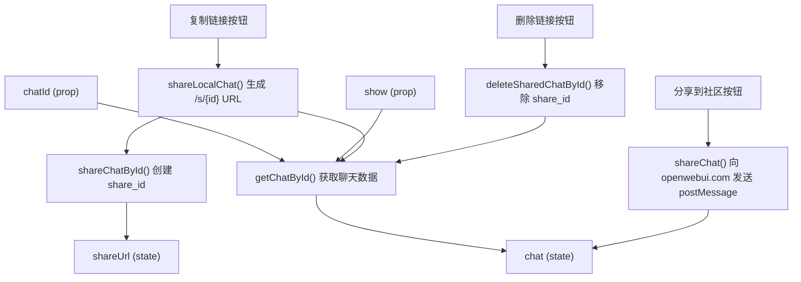
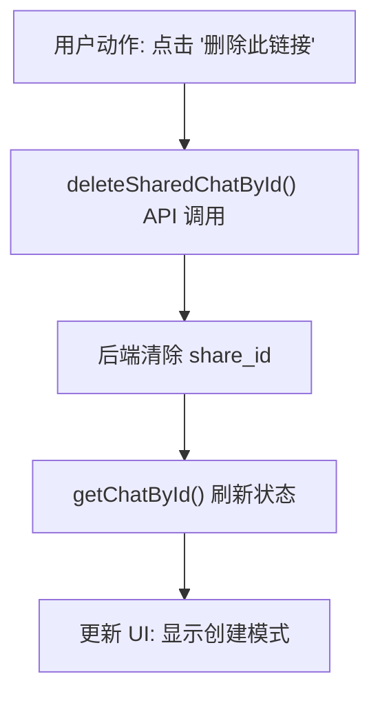

# 聊天分享

相关源文件

-   [src/lib/components/chat/ShareChatModal.svelte](https://github.com/open-webui/open-webui/blob/a7271532/src/lib/components/chat/ShareChatModal.svelte)

## 目的与范围

本文档解释了 Open WebUI 中的聊天分享系统，该系统允许用户为其聊天对话生成可公开分享的链接。聊天分享有两种模式：**本地分享链接**（在同一个 Open WebUI 实例内分享）和 **Open WebUI 社区分享**（将聊天发布到 openwebui.com 的公开社区平台）。

有关聊天组织和导航的信息，请参阅 [侧边栏架构](/open-webui/open-webui/8.1-sidebar-architecture)。有关聊天数据持久化的详情，请参阅 [消息历史树](/open-webui/open-webui/4.3-message-history-tree)。

---

## 分享模式概览

Open WebUI 支持两种不同的分享机制，分别服务于不同的用例：

| 分享模式 | 目标受众 | 是否需要身份验证 | 数据位置 |
| --- | --- | --- | --- |
| **本地链接** | 具有实例访问权限的用户 | 否（公开 URL） | 同一 Open WebUI 实例 |
| **社区** | 互联网公开用户 | 否 | openwebui.com 平台 |

本地链接模式生成一个公开 URL (`/s/{share_id}`)，任何拥有该链接的人都可以将聊天对话作为只读快照进行查看。社区模式通过跨域 postMessage 通信将聊天数据导出到 Open WebUI 社区平台。

**来源：** [src/lib/components/chat/ShareChatModal.svelte19-55](https://github.com/open-webui/open-webui/blob/a7271532/src/lib/components/chat/ShareChatModal.svelte#L19-L55)

---

## ShareChatModal 组件架构


**组件结构**

`ShareChatModal` 组件实现为一个响应式的 Svelte 模态对话框，编排了整个分享工作流。组件维护两个主要的状态变量：

-   `chat`：从后端获取的完整聊天对象，如果之前分享过，则包含 `share_id` 字段。
-   `shareUrl`：生成的分享 URL，格式为 `${window.location.origin}/s/${sharedChat.id}`。

组件使用响应式语句在模态框打开时自动获取聊天数据 (`$: if (show)`)，并通过 `isDifferentChat()` 辅助函数实现变更检测，以避免冗余的 API 调用。

**来源：** [src/lib/components/chat/ShareChatModal.svelte1-82](https://github.com/open-webui/open-webui/blob/a7271532/src/lib/components/chat/ShareChatModal.svelte#L1-L82)

---

## 本地分享链接生成

### 分享创建流程

`shareLocalChat()` 函数实现了本地链接生成工作流：

1.  **创建分享 ID**：调用 `shareChatById()` API 端点，该端点为聊天生成唯一的 `share_id`。
2.  **构建 URL**：使用 `window.location.origin` 和返回的 `share_id` 构建公开 URL。
3.  **刷新状态**：获取更新后的聊天对象，以同步组件状态中的 `share_id`。
4.  **复制到剪贴板**：使用浏览器特定的处理方式将 URL 复制到剪贴板。

**来源：** [src/lib/components/chat/ShareChatModal.svelte19-28](https://github.com/open-webui/open-webui/blob/a7271532/src/lib/components/chat/ShareChatModal.svelte#L19-L28)

### 针对 Safari 的剪贴板处理

由于异步剪贴板写入的安全限制，Safari 需要特殊的剪贴板处理。组件通过用户代理 (User Agent) 字符串检测 Safari，并使用带有基于 Promise 的 Blob 构建的 `ClipboardItem` API：

```javascript
const getUrlPromise = async () => {
    const url = await shareLocalChat();
    return new Blob([url], { type: 'text/plain' });
};

navigator.clipboard.write([
    new ClipboardItem({
        'text/plain': getUrlPromise()
    })
]);
```
对于非 Safari 浏览器，则直接使用标准的 `copyToClipboard()` 工具函数。

**来源：** [src/lib/components/chat/ShareChatModal.svelte147-174](https://github.com/open-webui/open-webui/blob/a7271532/src/lib/components/chat/ShareChatModal.svelte#L147-L174)

### 分享状态管理

组件追踪三种不同的分享状态：

| 状态 | `chat.share_id` | UI 行为 |
| --- | --- | --- |
| **从未分享** | `null` 或 `undefined` | 显示创建消息 |
| **此前已分享** | 有效的 share\_id 字符串 | 显示现有链接及删除选项 |
| **分享已删除** | `null` (删除后) | 恢复到从未分享状态 |

当聊天具有现有的 `share_id` 时，UI 显示：

-   查看已分享聊天的链接：`/s/{chat.share_id}`。
-   一个用于撤销分享的删除按钮。
-   更新后的按钮文本：“更新并复制链接” 而非 “复制链接”。

**来源：** [src/lib/components/chat/ShareChatModal.svelte98-124](https://github.com/open-webui/open-webui/blob/a7271532/src/lib/components/chat/ShareChatModal.svelte#L98-L124)

---

## Open WebUI 社区分享

### 跨域通信流程

`shareChat()` 函数使用 `window.postMessage()` API 实现了安全的跨域数据传输协议：

1.  **打开标签页**：在新标签页中打开 `https://openwebui.com/chats/upload`。
2.  **握手**：等待社区平台通过 `'loaded'` 消息发出就绪信号。
3.  **来源验证**：在发送数据前验证 `event.origin` 是否匹配 `https://openwebui.com`。
4.  **数据传输**：发送包含以下内容的 JSON 载荷：
    -   `chat`：来自 `chat.chat` 的完整聊天对象。
    -   `models`：与对话中使用的模型匹配的已过滤模型列表。

这种方法确保用户在最终发布之前，可以在社区平台的 UI 中预览分享的内容。

**来源：** [src/lib/components/chat/ShareChatModal.svelte30-55](https://github.com/open-webui/open-webui/blob/a7271532/src/lib/components/chat/ShareChatModal.svelte#L30-L55)

### 特性标志控制

社区分享通过 `config.features.enable_community_sharing` 标志有条件地启用。禁用时，“分享到 Open WebUI 社区”按钮将从 UI 中隐藏。这允许实例管理员在保留本地链接功能的同时禁用公共分享。

**来源：** [src/lib/components/chat/ShareChatModal.svelte129-140](https://github.com/open-webui/open-webui/blob/a7271532/src/lib/components/chat/ShareChatModal.svelte#L129-L140)

---

## 撤销分享链接

### 删除工作流


组件提供了一个链接样式的按钮用于删除现有的分享。点击时：

1.  **API 调用**：调用 `deleteSharedChatById(localStorage.token, chatId)`。
2.  **后端处理**：后端从聊天记录中清除 `share_id` 字段。
3.  **刷新状态**：通过 `getChatById()` 获取更新后的聊天对象。
4.  **更新 UI**：组件响应式地更新以显示“从未分享”状态。

一旦删除，公开的 `/s/{share_id}` URL 就会失效，并返回 404 或访问拒绝错误。

**来源：** [src/lib/components/chat/ShareChatModal.svelte107-118](https://github.com/open-webui/open-webui/blob/a7271532/src/lib/components/chat/ShareChatModal.svelte#L107-L118)

---

## 组件集成

### 模态框触发模式

`ShareChatModal` 组件设计为通过通用模式从应用程序的各个位置触发：

```html
<ShareChatModal bind:show={showShareChatModal} chatId={currentChatId} />
```
父组件通过 `show` prop 绑定控制模态框的可见性，并通过 `chatId` prop 传递目标聊天。组件在内部处理所有分享逻辑，不向父组件分发任何事件（触发即忘模式）。

**来源：** [src/lib/components/chat/ShareChatModal.svelte13-82](https://github.com/open-webui/open-webui/blob/a7271532/src/lib/components/chat/ShareChatModal.svelte#L13-L82)

### 国际化

所有面向用户的字符串都使用上下文提供的 `i18n` 实例进行国际化：

-   模态框标题：`$i18n.t('Share Chat')`
-   状态消息：`$i18n.t('You have shared this chat')`, `$i18n.t('before')`
-   按钮标签：`$i18n.t('Copy Link')`, `$i18n.t('Share to Open WebUI Community')`
-   Toast 通知：`$i18n.t('Copied shared chat URL to clipboard!')`

有关国际化系统的详情，请参阅 [翻译系统架构](/open-webui/open-webui/15.1-translation-system-architecture)。

**来源：** [src/lib/components/chat/ShareChatModal.svelte17-187](https://github.com/open-webui/open-webui/blob/a7271532/src/lib/components/chat/ShareChatModal.svelte#L17-L187)

---

## 安全考量

### 访问控制

本地分享的聊天是**可公开访问**的 URL，不需要身份验证。后端必须实现适当的访问控制：

-   分享的聊天应为只读。
-   敏感元数据（用户电子邮件、API 密钥）应被过滤。
-   应通过速率限制防止对分享 ID 的枚举攻击。

### 跨域安全

社区分享实现在发送消息前验证来源：

```javascript
if (event.origin !== url) return;
```
这防止了恶意网站通过受损的事件监听器拦截聊天数据。然而，由于数据仍然会传输到社区平台，用户必须信任该平台。

**来源：** [src/lib/components/chat/ShareChatModal.svelte39-54](https://github.com/open-webui/open-webui/blob/a7271532/src/lib/components/chat/ShareChatModal.svelte#L39-L54)

---

## 使用模式

### 典型用户流程

1.  用户完成聊天对话。
2.  用户打开分享模态框（通过上下文菜单或分享按钮）。
3.  对于本地分享：
    -   用户点击“复制链接”。
    -   系统生成 share\_id 并复制 URL。
    -   用户将 URL 粘贴给他人进行分享。
4.  对于社区分享：
    -   用户点击“分享到 Open WebUI 社区”。
    -   新标签页打开以供预览和发布。
    -   用户在社区平台上完成发布。

### 重新分享行为

当聊天已分享（`chat.share_id` 已存在）时：

-   “复制链接”按钮变为“更新并复制链接”。
-   share\_id 保持稳定（不会生成新 ID）。
-   分享链接继续在当前的聊天状态下有效。
-   初始分享**之后**发送的消息也**会包含**在分享视图中（不同于快照模式）。

**注意：** UI 消息指出“创建链接后发送的消息将不会被分享”，但实际实现中会使用新消息更新已分享的聊天。这可能是文档中的一处不一致。

**来源：** [src/lib/components/chat/ShareChatModal.svelte120-187](https://github.com/open-webui/open-webui/blob/a7271532/src/lib/components/chat/ShareChatModal.svelte#L120-L187)

---

## API 协议

### 后端端点

组件期望以下三个后端 API 函数：

| 函数 | 端点模式 | 用途 |
| --- | --- | --- |
| `shareChatById(token, chatId)` | `POST /chats/{id}/share` | 创建或获取 share\_id |
| `deleteSharedChatById(token, chatId)` | `DELETE /chats/{id}/share` | 清除 share\_id |
| `getChatById(token, chatId)` | `GET /chats/{id}` | 获取带有 share\_id 的聊天 |

**预期的响应结构：**

```json
{
    "id": "string",           // 聊天 ID
    "share_id": "string | null",  // 公开分享标识符
    "chat": {              // 聊天内容
        "models": "string[]",
        "messages": "object[]"
        // ... 其他字段
    }
}
```
**来源：** [src/lib/components/chat/ShareChatModal.svelte6-26](https://github.com/open-webui/open-webui/blob/a7271532/src/lib/components/chat/ShareChatModal.svelte#L6-L26)
