# 富文本输入系统

相关源文件

-   [CHANGELOG.md](https://github.com/open-webui/open-webui/blob/a7271532/CHANGELOG.md)
-   [package-lock.json](https://github.com/open-webui/open-webui/blob/a7271532/package-lock.json)
-   [package.json](https://github.com/open-webui/open-webui/blob/a7271532/package.json)
-   [src/app.css](https://github.com/open-webui/open-webui/blob/a7271532/src/app.css)
-   [src/lib/components/ChangelogModal.svelte](https://github.com/open-webui/open-webui/blob/a7271532/src/lib/components/ChangelogModal.svelte)
-   [src/lib/components/common/RichTextInput.svelte](https://github.com/open-webui/open-webui/blob/a7271532/src/lib/components/common/RichTextInput.svelte)
-   [src/lib/components/icons/XMark.svelte](https://github.com/open-webui/open-webui/blob/a7271532/src/lib/components/icons/XMark.svelte)

富文本输入系统在 Open WebUI 中提供了先进的所见即所得 (WYSIWYG) 编辑体验，它基于 Tiptap 编辑器框架构建，并使用 ProseMirror 作为其底层文档模型。该系统处理 Markdown 与 HTML 之间的双向转换，通过 Yjs CRDT 支持协作实时编辑，并集成了 AI 驱动的自动补全功能。其主要用例是聊天消息输入框，但该组件也用于笔记、提示词和其他文本编辑场景。

有关提交后的消息渲染信息，请参阅[消息渲染](/open-webui/open-webui/5-message-rendering)。有关承载输入的聊天界面的详细信息，请参阅[聊天系统](/open-webui/open-webui/4-chat-system)。

---

## 系统架构

富文本输入系统作为一个可重用的 Svelte 组件实现，具有模块化的扩展架构。其核心是 Tiptap v3 编辑器，它包装了 ProseMirror 以提供现代化的基于插件的 API。该系统维护了内容的三种同步表示：Markdown（用于存储/API）、HTML（用于渲染）和 JSON（ProseMirror 文档结构）。


**来源：** [src/lib/components/common/RichTextInput.svelte1-1460](https://github.com/open-webui/open-webui/blob/a7271532/src/lib/components/common/RichTextInput.svelte#L1-L1460) [package.json67-147](https://github.com/open-webui/open-webui/blob/a7271532/package.json#L67-L147)

---

## 核心组件结构

### RichTextInput.svelte 属性 (Properties)

`RichTextInput` 组件公开了许多控制其行为的配置属性：

| 属性 | 类型 | 默认值 | 用途 |
| --- | --- | --- | --- |
| `value` | string | `''` | Markdown 内容（双向绑定） |
| `html` | string | `''` | HTML 内容表示 |
| `richText` | boolean | `true` | 启用/禁用富文本格式 |
| `editable` | boolean | `true` | 控制编辑器是否可编辑 |
| `placeholder` | string | `'Type here...'` | 占位符文本 |
| `suggestions` | object | `null` | 提及 (mention) 建议配置 |
| `collaboration` | boolean | `false` | 启用协作编辑 |
| `documentId` | string | `''` | 用于协作的文档 ID |
| `socket` | object | `null` | 用于协作的 Socket.IO 客户端 |
| `user` | object | `null` | 用于协作的用户信息 |
| `autocomplete` | boolean | `false` | 启用 AI 自动补全 |
| `generateAutoCompletion` | Function | `async () => null` | AI 补全生成器 |
| `dragHandle` | boolean | `false` | 启用列表项拖动手柄 |
| `image` | boolean | `false` | 启用图像支持 |
| `fileHandler` | boolean | `false` | 启用文件拖放 |
| `showFormattingToolbar` | boolean | `true` | 显示气泡/悬浮菜单 |

**来源：** [src/lib/components/common/RichTextInput.svelte164-261](https://github.com/open-webui/open-webui/blob/a7271532/src/lib/components/common/RichTextInput.svelte#L164-L261)

### 编辑器初始化流程

> **[Mermaid sequence]**
> *(图表结构无法解析)*

**来源：** [src/lib/components/common/RichTextInput.svelte639-677](https://github.com/open-webui/open-webui/blob/a7271532/src/lib/components/common/RichTextInput.svelte#L639-L677) [src/lib/components/common/RichTextInput.svelte683-833](https://github.com/open-webui/open-webui/blob/a7271532/src/lib/components/common/RichTextInput.svelte#L683-L833)

---

## 扩展系统

### 内置扩展

编辑器在 `onMount` 期间使用以下扩展进行配置：


**扩展配置详情：**

-   **StarterKit** [src/lib/components/common/RichTextInput.svelte686-688](https://github.com/open-webui/open-webui/blob/a7271532/src/lib/components/common/RichTextInput.svelte#L686-L688)：提供基本的编辑功能（粗体、斜体、标题、列表等）
-   **CodeBlockLowlight** [src/lib/components/common/RichTextInput.svelte695-697](https://github.com/open-webui/open-webui/blob/a7271532/src/lib/components/common/RichTextInput.svelte#L695-L697)：使用包含所有 hljs 语言的 lowlight 实例进行语法高亮
-   **TableKit** [src/lib/components/common/RichTextInput.svelte699-701](https://github.com/open-webui/open-webui/blob/a7271532/src/lib/components/common/RichTextInput.svelte#L699-L701)：支持带有表头的可调整大小表格
-   **ListKit** [src/lib/components/common/RichTextInput.svelte702-706](https://github.com/open-webui/open-webui/blob/a7271532/src/lib/components/common/RichTextInput.svelte#L702-L706)：项目符号列表、有序列表和嵌套任务列表
-   **Placeholder** [src/lib/components/common/RichTextInput.svelte690](https://github.com/open-webui/open-webui/blob/a7271532/src/lib/components/common/RichTextInput.svelte#L690-L690)：在编辑器为空时显示占位符文本
-   **CharacterCount** [src/lib/components/common/RichTextInput.svelte718](https://github.com/open-webui/open-webui/blob/a7271532/src/lib/components/common/RichTextInput.svelte#L718-L718)：跟踪字符/单词数
-   **Image** [src/lib/components/common/RichTextInput.svelte719](https://github.com/open-webui/open-webui/blob/a7271532/src/lib/components/common/RichTextInput.svelte#L719-L719)：用于处理 base64 图像的自定义图像扩展
-   **FileHandler** [src/lib/components/common/RichTextInput.svelte720-727](https://github.com/open-webui/open-webui/blob/a7271532/src/lib/components/common/RichTextInput.svelte#L720-L727)：处理文件拖放和粘贴
-   **Mention** [src/lib/components/common/RichTextInput.svelte709-716](https://github.com/open-webui/open-webui/blob/a7271532/src/lib/components/common/RichTextInput.svelte#L709-L716)：带有自定义建议的 @-提及支持
-   **AIAutocompletion** [src/lib/components/common/RichTextInput.svelte728-745](https://github.com/open-webui/open-webui/blob/a7271532/src/lib/components/common/RichTextInput.svelte#L728-L745)：用于 AI 驱动的文本补全的自定义扩展

**来源：** [src/lib/components/common/RichTextInput.svelte683-771](https://github.com/open-webui/open-webui/blob/a7271532/src/lib/components/common/RichTextInput.svelte#L683-L771)

### 自定义扩展

#### SelectionDecoration 扩展

在编辑器失去焦点时保持视觉选区状态：


**来源：** [src/lib/components/common/RichTextInput.svelte598-623](https://github.com/open-webui/open-webui/blob/a7271532/src/lib/components/common/RichTextInput.svelte#L598-L623) [src/app.css68-71](https://github.com/open-webui/open-webui/blob/a7271532/src/app.css#L68-L71)

#### ListItemDragHandle 扩展

通过带有视觉反馈的自定义实现支持列表项的拖放重新排序：


该扩展使用 ProseMirror 插件架构来跟踪鼠标事件并应用装饰类以显示视觉放置区域。

**来源：** [src/lib/components/common/RichTextInput.svelte625-637](https://github.com/open-webui/open-webui/blob/a7271532/src/lib/components/common/RichTextInput.svelte#L625-L637) [src/app.css699-806](https://github.com/open-webui/open-webui/blob/a7271532/src/app.css#L699-L806)

#### AIAutocompletion 扩展

使用 AI 补全提供虚影文字 (ghost text) 建议：

**配置：** [src/lib/components/common/RichTextInput.svelte728-745](https://github.com/open-webui/open-webui/blob/a7271532/src/lib/components/common/RichTextInput.svelte#L728-L745)

该扩展使用当前文本调用提供的 `generateAutoCompletion` 函数，将建议显示为具有 `.ai-autocompletion` 类的装饰，并处理 Tab 键以接受建议。

**来源：** [src/lib/components/common/RichTextInput.svelte119](https://github.com/open-webui/open-webui/blob/a7271532/src/lib/components/common/RichTextInput.svelte#L119-L119) [src/app.css544-549](https://github.com/open-webui/open-webui/blob/a7271532/src/app.css#L544-L549)

---

## 内容格式转换

### Markdown 到 HTML 管道

在使用 Markdown 内容初始化编辑器时，转换管道处理带有自定义扩展的 GFM (GitHub Flavored Markdown)：


自定义 `marked` 渲染器配置将任务列表转换为 Tiptap 的 TaskList 扩展预期的格式：

**Marked 配置：** [src/lib/components/common/RichTextInput.svelte5-29](https://github.com/open-webui/open-webui/blob/a7271532/src/lib/components/common/RichTextInput.svelte#L5-L29)

```javascript
marked.use({
  breaks: true,
  gfm: true,
  renderer: {
    list(body, ordered, start) {
      const isTaskList = body.includes('data-checked=');
      if (isTaskList) {
        return `<ul data-type="taskList">${body}</ul>`;
      }
      // ... 标准列表处理
    },
    listitem(text, task, checked) {
      if (task) {
        const checkedAttr = checked ? 'true' : 'false';
        return `<li data-type="taskItem" data-checked="${checkedAttr}">${text}</li>`;
      }
      return `<li>${text}</li>`;
    }
  }
});
```
**来源：** [src/lib/components/common/RichTextInput.svelte5-29](https://github.com/open-webui/open-webui/blob/a7271532/src/lib/components/common/RichTextInput.svelte#L5-L29) [src/lib/components/common/RichTextInput.svelte340-372](https://github.com/open-webui/open-webui/blob/a7271532/src/lib/components/common/RichTextInput.svelte#L340-L372)

### HTML 到 Markdown 管道

反向转换使用 Turndown 以及自定义规则和 GFM 插件：


**Turndown 服务配置：**

1.  **基础配置** [src/lib/components/common/RichTextInput.svelte33-40](https://github.com/open-webui/open-webui/blob/a7271532/src/lib/components/common/RichTextInput.svelte#L33-L40)：
    -   `codeBlockStyle: 'fenced'` - 为代码块使用 ````
    -   `headingStyle: 'atx'` - 为标题使用 #
    -   禁用 `escape` 以保留特殊字符
    -   使用 GFM 插件以支持表格/删除线
2.  **自定义表格规则** [src/lib/components/common/RichTextInput.svelte51-82](https://github.com/open-webui/open-webui/blob/a7271532/src/lib/components/common/RichTextInput.svelte#L51-L82)：
    -   使用 `querySelectorAll('tr')` 提取表格行
    -   将单元格转换为 `| cell | cell |` 格式
    -   在第一行之后添加分隔符 `| --- | --- |`
    -   处理多工作表表格
3.  **任务列表规则** [src/lib/components/common/RichTextInput.svelte84-94](https://github.com/open-webui/open-webui/blob/a7271532/src/lib/components/common/RichTextInput.svelte#L84-L94)：
    -   检测 `data-checked="true"` 或 `data-checked="false"`
    -   转换为 `- [x]` 或 `- [ ]` 格式
4.  **提及 (Mention) 规则** [src/lib/components/common/RichTextInput.svelte97-106](https://github.com/open-webui/open-webui/blob/a7271532/src/lib/components/common/RichTextInput.svelte#L97-L106)：
    -   检测 `<span data-type="mention">`
    -   提取 `data-id` 和 `data-mention-suggestion-char`
    -   为模型提及转换为 `<@id>` 格式

**转换触发：**

每次文档更改时，转换都会在 `onTransaction` 处理程序中发生：

[src/lib/components/common/RichTextInput.svelte774-832](https://github.com/open-webui/open-webui/blob/a7271532/src/lib/components/common/RichTextInput.svelte#L774-L832)

```javascript
onTransaction: () => {
  htmlValue = editor.getHTML();
  jsonValue = editor.getJSON();

  if (richText) {
    mdValue = turndownService.turndown(htmlValue
      .replace(/<p><\/p>/g, '<br/>')
      .replace(/ {2,}/g, (m) => m.replace(/ /g, '\u00a0'))
    ).replace(/\u00a0/g, ' ');
  }

  onChange({ html: htmlValue, json: jsonValue, md: mdValue });
  value = mdValue; // 双向绑定更新
}
```
**来源：** [src/lib/components/common/RichTextInput.svelte31-106](https://github.com/open-webui/open-webui/blob/a7271532/src/lib/components/common/RichTextInput.svelte#L31-L106) [src/lib/components/common/RichTextInput.svelte774-832](https://github.com/open-webui/open-webui/blob/a7271532/src/lib/components/common/RichTextInput.svelte#L774-L832)

---

## 模板变量系统

编辑器支持 `{{VARIABLE_NAME}}` 格式的模板变量，这些变量可以通过编程方式替换：


**实现：** [src/lib/components/common/RichTextInput.svelte468-509](https://github.com/open-webui/open-webui/blob/a7271532/src/lib/components/common/RichTextInput.svelte#L468-L509)

`replaceVariables` 方法：

1.  使用 `doc.descendants()` 遍历所有文本节点
2.  使用正则表达式查找 `{{VAR_NAME}}` 或 `{{VAR_NAME|default}}` 模式
3.  收集所有带有位置信息的替换项
4.  按逆序应用替换，以维持正确的位置
5.  仅在有更改时才分发 (dispatch) 事务 (transaction)

**模板选择：**

`selectNextTemplate` 函数 [src/lib/components/common/RichTextInput.svelte557-580](https://github.com/open-webui/open-webui/blob/a7271532/src/lib/components/common/RichTextInput.svelte#L557-L580) 查找并选择下一个模板变量，允许用户通过 Tab 键在模板之间切换。这在聊天输入模式下通过 Tab 键触发 [src/lib/components/common/RichTextInput.svelte905-920](https://github.com/open-webui/open-webui/blob/a7271532/src/lib/components/common/RichTextInput.svelte#L905-L920)。

**来源：** [src/lib/components/common/RichTextInput.svelte468-509](https://github.com/open-webui/open-webui/blob/a7271532/src/lib/components/common/RichTextInput.svelte#L468-L509) [src/lib/components/common/RichTextInput.svelte525-580](https://github.com/open-webui/open-webui/blob/a7271532/src/lib/components/common/RichTextInput.svelte#L525-L580)

---

## UI 菜单和工具栏

### BubbleMenu (选区工具栏)

在选中文本时出现，提供格式化选项：

```mermaid
flowchart TD
    Selection["文本选区"]
    BubbleMenu["BubbleMenu 扩展"]
    Tippy["Tippy.js Tooltip"]
    Config["TippyOptions"]
    Duration["duration: 100"]
    Arrow["arrow: false"]
    Placement["placement: 'top'"]
    Theme["theme: 'transparent'"]
    Offset["offset: [0, 2]"]
    Element["bubbleMenuElement"]
    Buttons["FormattingButtons"]
    Bold["加粗"]
    Italic["斜体"]
    Link["链接"]
    More["..."]

    Selection --> BubbleMenu
    BubbleMenu --> Tippy
    Tippy --> Config
    Config --> Duration
    Config --> Arrow
    Config --> Placement
    Config --> Theme
    Config --> Offset
    Tippy --> Element
    Element --> Buttons
    Buttons --> Bold
    Buttons --> Italic
    Buttons --> Link
    Buttons --> More
```


**配置：** [src/lib/components/common/RichTextInput.svelte748-757](https://github.com/open-webui/open-webui/blob/a7271532/src/lib/components/common/RichTextInput.svelte#L748-L757)

由于 v3 的样式问题，BubbleMenu 使用了 Tiptap v2 扩展 [src/lib/components/common/RichTextInput.svelte125](https://github.com/open-webui/open-webui/blob/a7271532/src/lib/components/common/RichTextInput.svelte#L125-L125)。菜单元素绑定到 `bubbleMenuElement` 且包含 `FormattingButtons` 组件。

**来源：** [src/lib/components/common/RichTextInput.svelte125-126](https://github.com/open-webui/open-webui/blob/a7271532/src/lib/components/common/RichTextInput.svelte#L125-L126) [src/lib/components/common/RichTextInput.svelte748-757](https://github.com/open-webui/open-webui/blob/a7271532/src/lib/components/common/RichTextInput.svelte#L748-L757)

### FloatingMenu (块级工具栏)

在空行上出现，提供块级选项：


**配置：** [src/lib/components/common/RichTextInput.svelte758-767](https://github.com/open-webui/open-webui/blob/a7271532/src/lib/components/common/RichTextInput.svelte#L758-L767)

`floatingMenuPlacement` 属性 [src/lib/components/common/RichTextInput.svelte261](https://github.com/open-webui/open-webui/blob/a7271532/src/lib/components/common/RichTextInput.svelte#L261-L261) 允许自定义菜单位置。

**来源：** [src/lib/components/common/RichTextInput.svelte126](https://github.com/open-webui/open-webui/blob/a7271532/src/lib/components/common/RichTextInput.svelte#L126-L126) [src/lib/components/common/RichTextInput.svelte758-767](https://github.com/open-webui/open-webui/blob/a7271532/src/lib/components/common/RichTextInput.svelte#L758-L767)

### FormattingButtons 组件

`FormattingButtons.svelte` 组件提供了在两个菜单内渲染的实际工具栏 UI。它根据以下情况有条件地显示格式化选项：

-   当前选区状态（例如，仅在选中文本时显示链接按钮）
-   活动格式（突出显示当前活动的格式）
-   编辑器能力（例如，仅在启用 TableKit 时显示表格按钮）

**来源：** [src/lib/components/common/RichTextInput.svelte141](https://github.com/open-webui/open-webui/blob/a7271532/src/lib/components/common/RichTextInput.svelte#L141-L141)

---

## 协作编辑

### Yjs CRDT 集成

当 `collaboration={true}` 时，编辑器初始化一个 `SocketIOCollaborationProvider`，该提供程序使用 Yjs 无冲突复制数据类型 (Conflict-free Replicated Data Type) 同步文档：

> **[Mermaid sequence]**
> *(图表结构无法解析)*

**提供程序初始化：** [src/lib/components/common/RichTextInput.svelte679-682](https://github.com/open-webui/open-webui/blob/a7271532/src/lib/components/common/RichTextInput.svelte#L679-L682)

```javascript
if (collaboration && documentId && socket && user) {
  const { SocketIOCollaborationProvider } = await import('./RichTextInput/Collaboration');
  provider = new SocketIOCollaborationProvider(documentId, socket, user, content);
}
```
该提供程序随后作为扩展传递给编辑器：[src/lib/components/common/RichTextInput.svelte770](https://github.com/open-webui/open-webui/blob/a7271532/src/lib/components/common/RichTextInput.svelte#L770-L770)

```javascript
...(collaboration && provider ? [provider.getEditorExtension()] : [])
```
### 光标展示 (Cursor Presence)

远程用户的光标通过颜色编码的视觉指示器进行渲染：

**CSS 样式：** [src/app.css660-686](https://github.com/open-webui/open-webui/blob/a7271532/src/app.css#L660-L686)

-   `.ProseMirror-yjs-cursor`：光标线本身（1px 左/右边框）
-   `.ProseMirror-yjs-cursor > div`：光标上方的用户名标签
-   颜色由 Yjs 提供程序为每个用户动态分配

**来源：** [src/lib/components/common/RichTextInput.svelte147-148](https://github.com/open-webui/open-webui/blob/a7271532/src/lib/components/common/RichTextInput.svelte#L147-L148) [src/lib/components/common/RichTextInput.svelte679-682](https://github.com/open-webui/open-webui/blob/a7271532/src/lib/components/common/RichTextInput.svelte#L679-L682) [src/lib/components/common/RichTextInput.svelte770](https://github.com/open-webui/open-webui/blob/a7271532/src/lib/components/common/RichTextInput.svelte#L770-L770) [src/app.css660-686](https://github.com/open-webui/open-webui/blob/a7271532/src/app.css#L660-L686)

---

## 编程式 API

### 公共方法

`RichTextInput` 组件通过 `export let` 公开了几个方法：

| 方法 | 参数 | 描述 |
| --- | --- | --- |
| `setText` | `text: string` | 将整个内容替换为纯文本，并在 `\n` 处拆分 |
| `insertContent` | `content: string` | 在当前选区插入 Markdown 内容 |
| `replaceVariables` | `variables: object` | 用值替换 `{{VAR}}` 模板 |
| `replaceCommandWithText` | `text: string` | 替换光标处的单词（用于插入提示词） |
| `setContent` | `content: any` | 设置编辑器内容（HTML、JSON 或 Markdown） |
| `focus` | 
 | 聚焦编辑器并滚动到选区 |
| `getWordAtDocPos` | 
 | 获取当前光标位置的单词 |

**setText 实现：** [src/lib/components/common/RichTextInput.svelte418-452](https://github.com/open-webui/open-webui/blob/a7271532/src/lib/components/common/RichTextInput.svelte#L418-L452)

通过创建段落节点处理多行文本：

```javascript
export const setText = (text: string) => {
  if (!editor) return;
  text = text.replaceAll('\n\n', '\n');
  editor.commands.clearContent();

  const { state, view } = editor;
  const { schema, tr } = state;

  if (text.includes('\n')) {
    const lines = text.split('\n');
    const nodes = lines.map((line) =>
      schema.nodes.paragraph.create({}, line ? schema.text(line) : undefined)
    );
    const fragment = Fragment.fromArray(nodes);
    tr.replaceSelectionWith(fragment, false);
    view.dispatch(tr);
  } else if (text === '') {
    editor.commands.clearContent();
  } else {
    const paragraph = schema.nodes.paragraph.create({}, schema.text(text));
    tr.replaceSelectionWith(paragraph, false);
    view.dispatch(tr);
  }

  selectNextTemplate(editor.view.state, editor.view.state.dispatch);
  focus();
};
```
**replaceCommandWithText 实现：** [src/lib/components/common/RichTextInput.svelte327-416](https://github.com/open-webui/open-webui/blob/a7271532/src/lib/components/common/RichTextInput.svelte#L327-L416)

支持两种模式：

1.  **纯文本模式：** 替换光标处的单词，处理带有段落分隔的多行文本
2.  **富文本模式 (`insertPromptAsRichText=true`)：** 在插入前将 Markdown 转换为 ProseMirror 节点

**来源：** [src/lib/components/common/RichTextInput.svelte288-585](https://github.com/open-webui/open-webui/blob/a7271532/src/lib/components/common/RichTextInput.svelte#L288-L585)

---

## 文件处理

### FileHandler 扩展

支持将文件拖放和粘贴到编辑器中：


**默认处理程序：** [src/lib/components/common/RichTextInput.svelte194-239](https://github.com/open-webui/open-webui/blob/a7271532/src/lib/components/common/RichTextInput.svelte#L194-L239)

`onFileDrop` 和 `onFilePaste` 都是可配置的属性，默认将图像插入为 base64 数据 URL。父组件可以重写这些属性，以处理将文件上传到服务器的操作。

**扩展配置：** [src/lib/components/common/RichTextInput.svelte720-727](https://github.com/open-webui/open-webui/blob/a7271532/src/lib/components/common/RichTextInput.svelte#L720-L727)

```javascript
...(fileHandler
  ? [
      FileHandler.configure({
        onDrop: onFileDrop,
        onPaste: onFilePaste
      })
    ]
  : [])
```
**来源：** [src/lib/components/common/RichTextInput.svelte194-239](https://github.com/open-webui/open-webui/blob/a7271532/src/lib/components/common/RichTextInput.svelte#L194-L239) [src/lib/components/common/RichTextInput.svelte720-727](https://github.com/open-webui/open-webui/blob/a7271532/src/lib/components/common/RichTextInput.svelte#L720-L727)

---

## 特殊输入模式

### 聊天消息输入模式

当 `messageInput={true}` 时，编辑器为聊天启用了特殊的键盘处理：


**实现：** [src/lib/components/common/RichTextInput.svelte886-996](https://github.com/open-webui/open-webui/blob/a7271532/src/lib/components/common/RichTextInput.svelte#L886-L996)

按键处理逻辑：

1.  **Tab 键：** 选择下一个模板变量，或者在代码块中插入制表符
2.  **Enter 键：**
    -   按下 Ctrl/Cmd：始终提交
    -   未按下 Ctrl/Cmd：如果不在代码/列表中且不是命令行，则提交
    -   尊重 `shiftEnter` 属性，要求使用 Shift 进行换行
3.  **斜杠命令：** 以 `/` 开头的行在普通 Enter 键按下时永远不会被提交

**来源：** [src/lib/components/common/RichTextInput.svelte886-996](https://github.com/open-webui/open-webui/blob/a7271532/src/lib/components/common/RichTextInput.svelte#L886-L996)

### 大文本处理

当 `largeTextAsFile={true}` 时，粘贴的超过 `PASTED_TEXT_CHARACTER_LIMIT` 的文本将被转换为文件：

[src/lib/components/common/RichTextInput.svelte143](https://github.com/open-webui/open-webui/blob/a7271532/src/lib/components/common/RichTextInput.svelte#L143-L143)

此功能会分发一个包含文本内容的 `paste-large-text` 事件，允许父组件将其作为文件上传处理，而不是直接插入到编辑器中。

**来源：** [src/lib/components/common/RichTextInput.svelte258-259](https://github.com/open-webui/open-webui/blob/a7271532/src/lib/components/common/RichTextInput.svelte#L258-L259)

---

## 样式和 CSS

### Prose 类

编辑器使用 Tailwind Typography 插件以及自定义的 prose 类：

| 类名 | 用途 | 来源 |
| --- | --- | --- |
| `.input-prose` | 针对富文本的全功能 prose 样式 | [src/app.css97-99](https://github.com/open-webui/open-webui/blob/a7271532/src/app.css#L97-L99) |
| `.input-prose-sm` | 较小文本变体 | [src/app.css101-103](https://github.com/open-webui/open-webui/blob/a7271532/src/app.css#L101-L103) |
| `.ProseMirror` | 编辑器容器样式 | [src/app.css360-366](https://github.com/open-webui/open-webui/blob/a7271532/src/app.css#L360-L366) |
| `.tiptap` | 内容区域样式 | [src/app.css379-575](https://github.com/open-webui/open-webui/blob/a7271532/src/app.css#L379-L575) |

### 任务列表样式

任务列表接收特殊的嵌套结构样式：

[src/app.css379-443](https://github.com/open-webui/open-webui/blob/a7271532/src/app.css#L379-L443) [src/app.css472-536](https://github.com/open-webui/open-webui/blob/a7271532/src/app.css#L472-L536)

```css
.tiptap ul[data-type='taskList'] {
  list-style: none;
  margin-left: 0;
  padding: 0;

  li {
    align-items: start;
    display: flex;

    > label {
      flex: 0 0 auto;
      margin-right: 0.5rem;
      margin-top: 0.2rem;
    }

    > div {
      flex: 1 1 auto;
    }
  }

  li[data-checked='true'] > div {
    opacity: 0.5;
    text-decoration: line-through;
  }
}
```
### 表格样式

表格接收 GitHub 风格的 Markdown 样式：

[src/app.css629-653](https://github.com/open-webui/open-webui/blob/a7271532/src/app.css#L629-L653)

```css
.tiptap table {
  @apply w-full text-sm text-left text-gray-500 dark:text-gray-400;
}

.tiptap thead {
  @apply text-xs text-gray-700 uppercase bg-gray-50 dark:bg-gray-850;
}

.tiptap th, .tiptap td {
  @apply px-3 py-1.5 border border-gray-100/30 dark:border-gray-850/30;
}
```
### 代码块样式

代码块使用带有自定义颜色的 lowlight 语法高亮器：

[src/app.css551-627](https://github.com/open-webui/open-webui/blob/a7271532/src/app.css#L551-L627)

为注释、变量、字符串、关键字等定义了语法高亮类 (`.hljs-*`)，从而跨主题提供一致的代码展示。

**来源：** [src/app.css97-809](https://github.com/open-webui/open-webui/blob/a7271532/src/app.css#L97-L809)

---

## 配置摘要

### 常见用例的必需属性

**基础富文本编辑器：**

```javascript
<RichTextInput bind:value richText={true} />
```
**聊天消息输入框：**

```javascript
<RichTextInput
  bind:value
  messageInput={true}
  shiftEnter={true}
  autocomplete={true}
  generateAutoCompletion={aiCompletionFn}
  suggestions={mentionSuggestions}
  fileHandler={true}
  onFileDrop={handleFileDrop}
/>
```
**协作式笔记编辑器：**

```javascript
<RichTextInput
  bind:value
  richText={true}
  collaboration={true}
  documentId={noteId}
  socket={socketClient}
  user={currentUser}
  dragHandle={true}
  image={true}
/>
```
**纯文本输入（无格式的 Markdown 模式）：**

```javascript
<RichTextInput
  bind:value
  richText={false}
  showFormattingToolbar={false}
/>
```
**来源：** [src/lib/components/common/RichTextInput.svelte164-261](https://github.com/open-webui/open-webui/blob/a7271532/src/lib/components/common/RichTextInput.svelte#L164-L261)

```