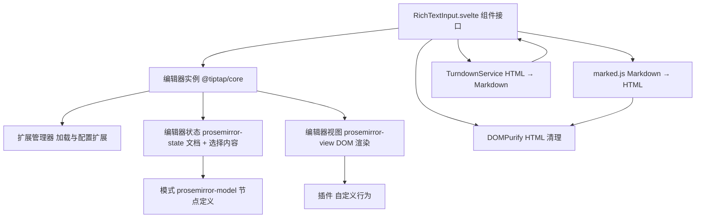
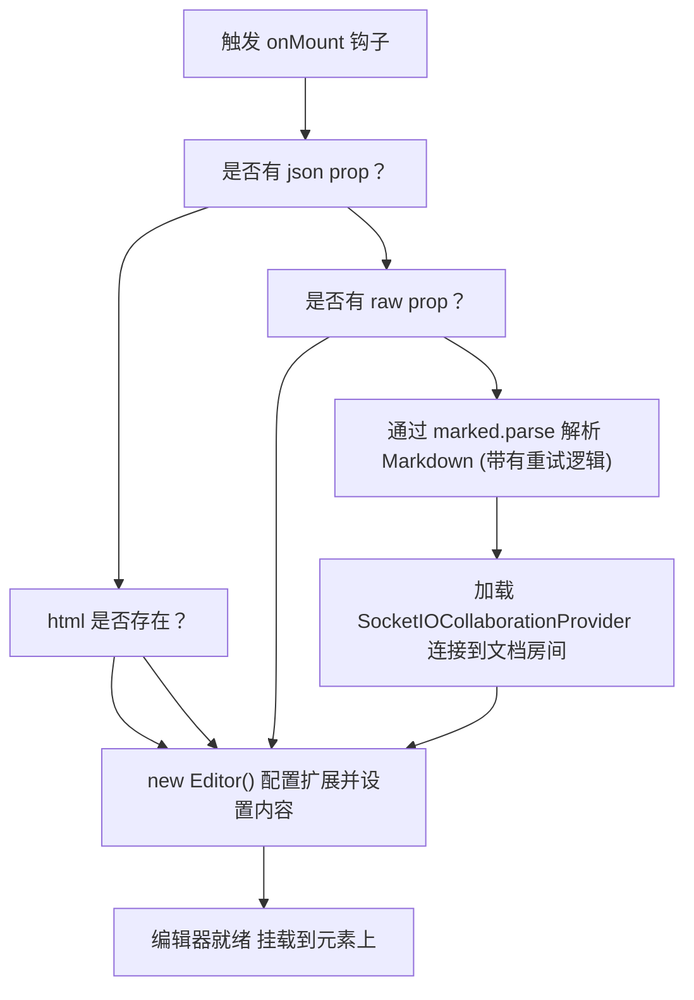
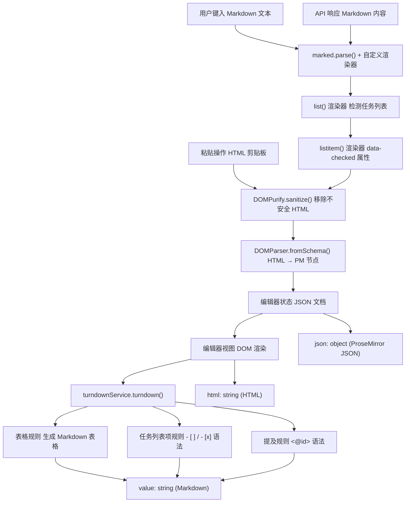
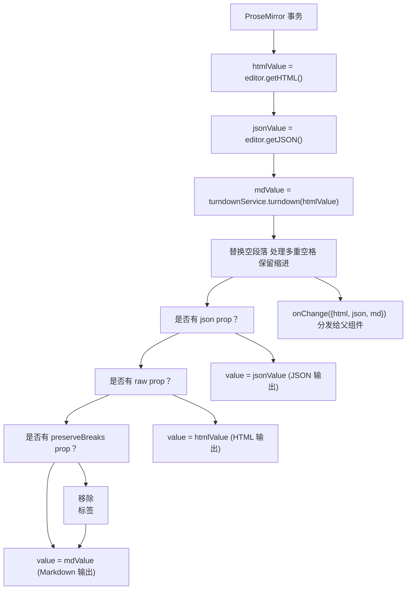
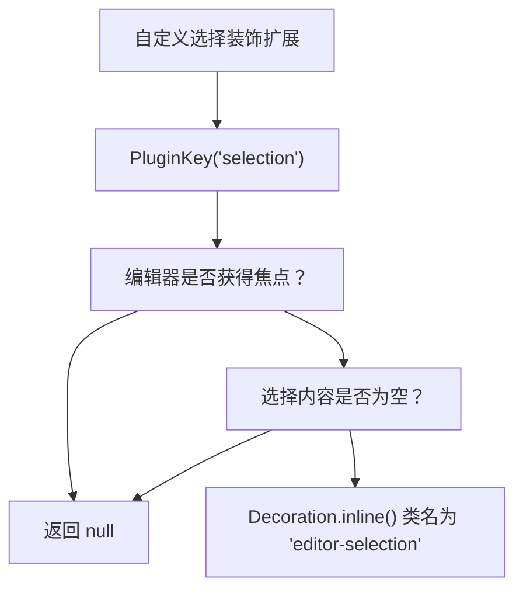
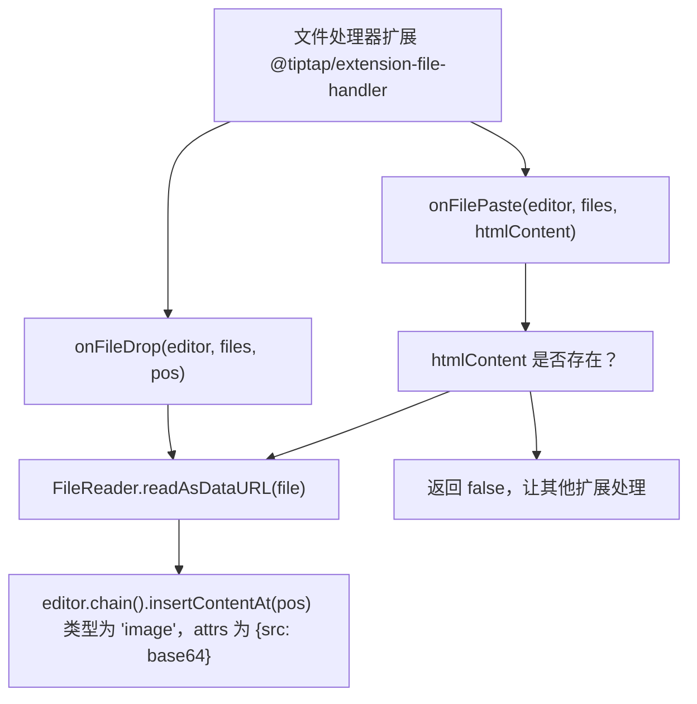
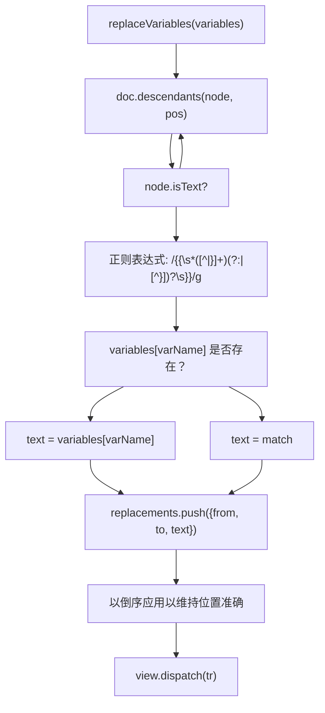
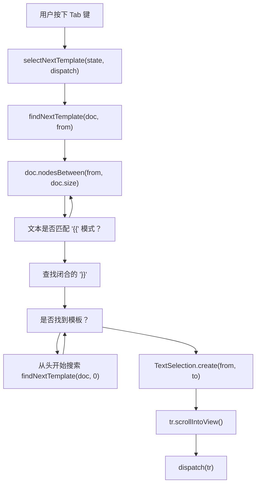
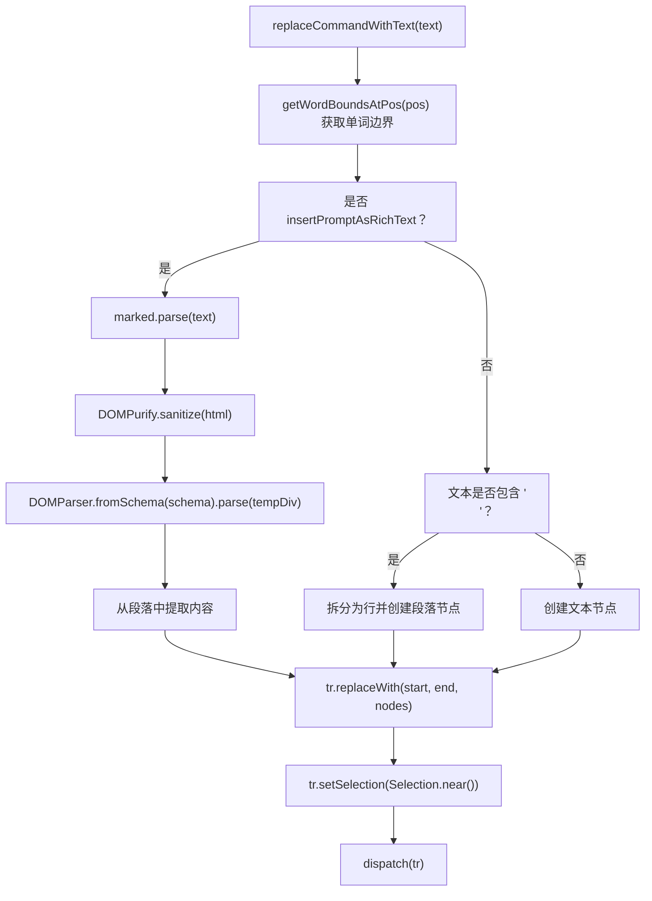

# Tiptap 编辑器架构

相关源文件

-   [CHANGELOG.md](https://github.com/open-webui/open-webui/blob/a7271532/CHANGELOG.md)
-   [package-lock.json](https://github.com/open-webui/open-webui/blob/a7271532/package-lock.json)
-   [package.json](https://github.com/open-webui/open-webui/blob/a7271532/package.json)
-   [src/app.css](https://github.com/open-webui/open-webui/blob/a7271532/src/app.css)
-   [src/lib/components/ChangelogModal.svelte](https://github.com/open-webui/open-webui/blob/a7271532/src/lib/components/ChangelogModal.svelte)
-   [src/lib/components/common/RichTextInput.svelte](https://github.com/open-webui/open-webui/blob/a7271532/src/lib/components/common/RichTextInput.svelte)
-   [src/lib/components/icons/XMark.svelte](https://github.com/open-webui/open-webui/blob/a7271532/src/lib/components/icons/XMark.svelte)

## 目的与范围

本页记录了基于 Tiptap 的富文本编辑器组件 (`RichTextInput.svelte`) 的架构，该组件在 Open WebUI 中广泛用于消息撰写、笔记编辑及其他文本输入场景。该编辑器提供了所见即所得 (WYSIWYG) 的编辑能力、实时协作、Markdown/HTML 双向转换，并可通过模块化扩展系统进行广泛定制。

有关该编辑器在消息输入系统中如何使用的信息，请参阅 [消息输入系统](/open-webui/open-webui/4.2-message-input-system)。有关实时协作实现的详情，请参阅 [协作编辑](/open-webui/open-webui/9.3-collaborative-editing)。有关内容格式转换的具体细节，请参阅 [内容格式转换](/open-webui/open-webui/9.2-content-format-conversion)。

---

## 编辑器核心架构

`RichTextInput` 组件建立在 [Tiptap v3](https://tiptap.dev/) 之上，而 Tiptap 本身是对 [ProseMirror](https://prosemirror.net/)（一个模块化的富文本编辑器工具包）的框架封装。该架构由四个主要层级组成：


**来源：** [src/lib/components/common/RichTextInput.svelte1-184](https://github.com/open-webui/open-webui/blob/a7271532/src/lib/components/common/RichTextInput.svelte#L1-L184) [package.json67-84](https://github.com/open-webui/open-webui/blob/a7271532/package.json#L67-L84)

### 编辑器初始化

编辑器在 `onMount` 生命周期钩子中实例化，并根据 `json`、`raw` 和 `collaboration` 等 prop 进行有条件的内容加载：


[src/lib/components/common/RichTextInput.svelte639-773](https://github.com/open-webui/open-webui/blob/a7271532/src/lib/components/common/RichTextInput.svelte#L639-L773) 中的编辑器初始化序列展示了有条件的内容准备和扩展加载。位于 [src/lib/components/common/RichTextInput.svelte657-672](https://github.com/open-webui/open-webui/blob/a7271532/src/lib/components/common/RichTextInput.svelte#L657-L672) 的 `tryParse` 函数实现了 Markdown 解析的重试逻辑，以处理初始渲染期间的竞态条件。

**来源：** [src/lib/components/common/RichTextInput.svelte639-773](https://github.com/open-webui/open-webui/blob/a7271532/src/lib/components/common/RichTextInput.svelte#L639-L773)

---

## 扩展系统

Tiptap 的扩展系统通过可组合的插件架构提供模块化功能。编辑器根据 prop 有条件地加载扩展，从而为不同的用例（如消息输入 vs. 笔记编辑 vs. 临时聊天）启用不同的功能集。

### 扩展加载流水线

```mermaid
flowchart TD
    StarterKit["基础工具包 (StarterKit) 段落、粗体、斜体等基础格式"]
    Placeholder["占位符 空状态文本"]
    CharacterCount["字符计数 字符统计"]
    SelectionDecoration["选择装饰 自定义扩展 视觉选择高亮"]
    CodeBlockLowlight["代码块高亮 语法高亮 lowlight + highlight.js"]
    Typography["排版 智能引号、破折号"]
    TableKit["表格工具包 可调整大小的表格"]
    ListKit["列表工具包 任务列表 + 嵌套"]
    BubbleMenu["气泡菜单 文本选择工具栏"]
    FloatingMenu["悬浮菜单 块插入菜单"]
    Mention["提及 @模型建议"]
    Image["图像 自定义图像扩展"]
    FileHandler["文件处理器 拖放文件"]
    AIAutocompletion["AI 自动补全 自定义扩展 灰度文本建议"]
    ListItemDragHandle["列表项拖动柄 自定义扩展 重新排列列表项"]
    CollabExtension["协作扩展 provider.getEditorExtension()"]
    Editor["编辑器实例"]

    StarterKit --> Editor
    Placeholder --> Editor
    CharacterCount --> Editor
    SelectionDecoration --> Editor
    CodeBlockLowlight --> Editor
    Typography --> Editor
    TableKit --> Editor
    ListKit --> Editor
    BubbleMenu --> Editor
    FloatingMenu --> Editor
    Mention --> Editor
    Image --> Editor
    FileHandler --> Editor
    AIAutocompletion --> Editor
    ListItemDragHandle --> Editor
    CollabExtension --> Editor
```


**来源：** [src/lib/components/common/RichTextInput.svelte685-770](https://github.com/open-webui/open-webui/blob/a7271532/src/lib/components/common/RichTextInput.svelte#L685-L770)

### 扩展配置矩阵

| 扩展 | 软件包 | Prop 要求 | 配置 |
| --- | --- | --- | --- |
| `StarterKit` | `@tiptap/starter-kit` | 始终加载 | `link: link` prop |
| `Placeholder` | `@tiptap/extensions` | 始终加载 | `placeholder: () => _placeholder, showOnlyWhenEditable: false` |
| `CharacterCount` | `@tiptap/extensions` | 始终加载 | 空配置 `{}` |
| `SelectionDecoration` | 自定义 | 始终加载 | 无配置 |
| `CodeBlockLowlight` | `@tiptap/extension-code-block-lowlight` | `richText=true` | 包含所有语言的 `lowlight` 实例 |
| `Typography` | `@tiptap/extension-typography` | `richText=true` | 默认配置 |
| `TableKit` | `@tiptap/extension-table` | `richText=true` | `table: { resizable: true }` |
| `ListKit` | `@tiptap/extension-list` | `richText=true` | `taskItem: { nested: true }` |
| `BubbleMenu` | `@tiptap/extension-bubble-menu` | `richText=true && showFormattingToolbar=true` | 带有自定义元素的 Tippy 选项 |
| `FloatingMenu` | `@tiptap/extension-floating-menu` | `richText=true && showFormattingToolbar=true` | 带有自定义元素的 Tippy 选项 |
| `Mention` | `@tiptap/extension-mention` | `suggestions != null` | `HTMLAttributes, suggestions` 回调 |
| `Image` | 自定义 | `image=true` | 无配置 |
| `FileHandler` | `@tiptap/extension-file-handler` | `fileHandler=true` | `onDrop, onPaste` 回调 |
| `AIAutocompletion` | 自定义 | `autocomplete=true` | `generateCompletion` 异步函数 |
| `ListItemDragHandle` | 自定义 | `dragHandle=true` | 无配置 |
| 协作 (Collaboration) | 通过 provider | `collaboration=true && provider != null` | Yjs 集成 |

**来源：** [src/lib/components/common/RichTextInput.svelte685-770](https://github.com/open-webui/open-webui/blob/a7271532/src/lib/components/common/RichTextInput.svelte#L685-L770) [package.json67-84](https://github.com/open-webui/open-webui/blob/a7271532/package.json#L67-L84)

### 核心扩展详情

#### 基础工具包 (StarterKit)

位于 [src/lib/components/common/RichTextInput.svelte686-688](https://github.com/open-webui/open-webui/blob/a7271532/src/lib/components/common/RichTextInput.svelte#L686-L688) 的 `StarterKit` 扩展捆绑了基础的编辑能力：

-   **文档结构**：`Document`, `Paragraph`, `Text`, `Heading` (h1-h6)
-   **格式标记**：`Bold`, `Italic`, `Strike`, `Code`
-   **列表**：`BulletList`, `OrderedList`, `ListItem`
-   **块级元素**：`Blockquote`, `CodeBlock`, `HorizontalRule`, `HardBreak`
-   **历史记录**：`History` (使用 Ctrl+Z/Ctrl+Shift+Z 进行撤销/重做)
-   **拖拽光标**：用于拖放操作的视觉光标

#### 表格工具包 (TableKit) 配置

在 [src/lib/components/common/RichTextInput.svelte699-701](https://github.com/open-webui/open-webui/blob/a7271532/src/lib/components/common/RichTextInput.svelte#L699-L701)，`TableKit` 被配置为 `resizable: true`，允许通过拖动手柄调整列宽。表格渲染样式在 [src/app.css629-653](https://github.com/open-webui/open-webui/blob/a7271532/src/app.css#L629-L653) 中定义，使用了 Tailwind 类来处理边框、内边距和响应式行为。

#### 带任务列表的列表工具包 (ListKit)

位于 [src/lib/components/common/RichTextInput.svelte702-706](https://github.com/open-webui/open-webui/blob/a7271532/src/lib/components/common/RichTextInput.svelte#L702-L706) 的 `ListKit` 配置启用了嵌套任务列表 (`nested: true`)。任务列表项渲染时带有复选框，并支持 `data-checked="true"` 属性。位于 [src/app.css379-443](https://github.com/open-webui/open-webui/blob/a7271532/src/app.css#L379-L443) 的 CSS 样式处理了复选框的渲染、已完成任务的删除线以及嵌套列表的缩进。

**来源：** [src/lib/components/common/RichTextInput.svelte686-706](https://github.com/open-webui/open-webui/blob/a7271532/src/lib/components/common/RichTextInput.svelte#L686-L706) [src/app.css379-653](https://github.com/open-webui/open-webui/blob/a7271532/src/app.css#L379-L653)

---

## 内容格式转换

编辑器在三种内容格式下工作：**Markdown**（面向用户）、**HTML**（内部表示）以及 **JSON**（ProseMirror 文档结构）。双向转换由 `marked.js`（Markdown → HTML）和 `TurndownService`（HTML → Markdown）处理。

### 转换流水线架构


**来源：** [src/lib/components/common/RichTextInput.svelte1-833](https://github.com/open-webui/open-webui/blob/a7271532/src/lib/components/common/RichTextInput.svelte#L1-L833)

### Marked.js 自定义渲染器

位于 [src/lib/components/common/RichTextInput.svelte5-29](https://github.com/open-webui/open-webui/blob/a7271532/src/lib/components/common/RichTextInput.svelte#L5-L29) 的 `marked` 配置包含针对任务列表的自定义渲染器：

```javascript
marked.use({
  breaks: true,
  gfm: true,
  renderer: {
    list(body, ordered, start) {
      const isTaskList = body.includes('data-checked=');
      if (isTaskList) {
        return `<ul data-type="taskList">${body}</ul>`;
      }
      // 标准列表渲染
    },
    listitem(text, task, checked) {
      if (task) {
        const checkedAttr = checked ? 'true' : 'false';
        return `<li data-type="taskItem" data-checked="${checkedAttr}">${text}</li>`;
      }
      return `<li>${text}</li>`;
    }
  }
});
```
这会将 Markdown 任务列表语法 (`- [ ]` 和 `- [x]`) 转换为带有 `data-type` 和 `data-checked` 属性的 HTML，以便 ProseMirror 的 `ListKit` 扩展能够识别。

**来源：** [src/lib/components/common/RichTextInput.svelte5-29](https://github.com/open-webui/open-webui/blob/a7271532/src/lib/components/common/RichTextInput.svelte#L5-L29)

### TurndownService 自定义规则

位于 [src/lib/components/common/RichTextInput.svelte31-106](https://github.com/open-webui/open-webui/blob/a7271532/src/lib/components/common/RichTextInput.svelte#L31-L106) 的 `TurndownService` 初始化包含多项自定义规则：

#### 表格转换规则

在 [src/lib/components/common/RichTextInput.svelte51-82](https://github.com/open-webui/open-webui/blob/a7271532/src/lib/components/common/RichTextInput.svelte#L51-L82)，`tables` 规则生成 GitHub Flavored Markdown (GFM) 格式的表格：

```javascript
turndownService.addRule('tables', {
  filter: 'table',
  replacement: function (content, node) {
    const rows = Array.from(node.querySelectorAll('tr'));
    let markdown = '\n';
    rows.forEach((row, rowIndex) => {
      const cells = Array.from(row.querySelectorAll('th, td'));
      const cellContents = cells.map((cell) => {
        let cellContent = turndownService.turndown(cell.innerHTML).trim();
        cellContent = cellContent.replace(/^\n+|\n+$/g, '');
        return cellContent;
      });
      markdown += '| ' + cellContents.join(' | ') + ' |\n';
      if (rowIndex === 0) {
        const separator = cells.map(() => '---').join(' | ');
        markdown += '| ' + separator + ' |\n';
      }
    });
    return markdown + '\n';
  }
});
```
该规则提取表格行，将每个单元格转换为 Markdown，并在表头后添加分隔行。

#### 任务列表转换规则

在 [src/lib/components/common/RichTextInput.svelte84-94](https://github.com/open-webui/open-webui/blob/a7271532/src/lib/components/common/RichTextInput.svelte#L84-L94)，`taskListItems` 规则将任务列表 HTML 转回 Markdown：

```javascript
turndownService.addRule('taskListItems', {
  filter: (node) =>
    node.nodeName === 'LI' &&
    (node.getAttribute('data-checked') === 'true' ||
      node.getAttribute('data-checked') === 'false'),
  replacement: function (content, node) {
    const checked = node.getAttribute('data-checked') === 'true';
    content = content.replace(/^\s+/, '');
    return `- [${checked ? 'x' : ' '}] ${content}\n`;
  }
});
```
#### 提及转换规则

在 [src/lib/components/common/RichTextInput.svelte97-106](https://github.com/open-webui/open-webui/blob/a7271532/src/lib/components/common/RichTextInput.svelte#L97-L106)，`mentions` 规则将 Tiptap 的提及 span 转换为用于模型提及的 `<@id>` 语法：

```javascript
turndownService.addRule('mentions', {
  filter: (node) => node.nodeName === 'SPAN' && node.getAttribute('data-type') === 'mention',
  replacement: (_content, node: HTMLElement) => {
    const id = node.getAttribute('data-id') || '';
    const ch = node.getAttribute('data-mention-suggestion-char') || '@';
    return `<${ch}${id}>`;
  }
});
```
这使得像 `@llama3.2:latest` 这样的模型提及可以存储为 Markdown，但在编辑器中渲染时带有特殊样式。

**来源：** [src/lib/components/common/RichTextInput.svelte31-106](https://github.com/open-webui/open-webui/blob/a7271532/src/lib/components/common/RichTextInput.svelte#L31-L106)

### 事务钩子：内容同步

位于 [src/lib/components/common/RichTextInput.svelte774-833](https://github.com/open-webui/open-webui/blob/a7271532/src/lib/components/common/RichTextInput.svelte#L774-L833) 的 `onTransaction` 钩子在每次编辑器变动后运行，同步各格式之间的内容：


该架构确保了 `value` prop 始终与编辑器的内部状态同步，并且父组件通过 `onChange` 回调接收所有三种格式。

**来源：** [src/lib/components/common/RichTextInput.svelte774-833](https://github.com/open-webui/open-webui/blob/a7271532/src/lib/components/common/RichTextInput.svelte#L774-L833)

---

## 自定义扩展

该编辑器包含三个自定义构建的扩展，扩展了 Tiptap 内置扩展之外的功能。

### 选择装饰 (SelectionDecoration) 扩展

位于 [src/lib/components/common/RichTextInput.svelte598-623](https://github.com/open-webui/open-webui/blob/a7271532/src/lib/components/common/RichTextInput.svelte#L598-L623) 的 `SelectionDecoration` 扩展在编辑器失去焦点时为所选文本添加视觉高亮：


位于 [src/app.css68-71](https://github.com/open-webui/open-webui/blob/a7271532/src/app.css#L68-L71) 的 `.editor-selection` CSS 类在编辑器失去焦点时为所选文本应用蓝色半透明背景，从而在多组件交互期间改善视觉反馈。

**来源：** [src/lib/components/common/RichTextInput.svelte598-623](https://github.com/open-webui/open-webui/blob/a7271532/src/lib/components/common/RichTextInput.svelte#L598-L623) [src/app.css68-71](https://github.com/open-webui/open-webui/blob/a7271532/src/app.css#L68-L71)

### AI 自动补全 (AIAutocompletion) 扩展

位于 [src/lib/components/common/RichTextInput.svelte729-744](https://github.com/open-webui/open-webui/blob/a7271532/src/lib/components/common/RichTextInput.svelte#L729-L744) 的 `AIAutocompletion` 扩展提供了类似于 GitHub Copilot 的灰度文本建议。它从一个单独的文件导入，并配置了一个 `generateCompletion` 异步函数：

```javascript
AIAutocompletion.configure({
  generateCompletion: async (text) => {
    if (text.trim().length === 0) return null;
    const suggestion = await generateAutoCompletion(text).catch(() => null);
    if (!suggestion || suggestion.trim().length === 0) return null;
    return suggestion;
  }
})
```
该扩展追踪光标位置和当前的文本上下文，从父组件的 `generateAutoCompletion` prop 请求补全，并通过 [src/app.css544-549](https://github.com/open-webui/open-webui/blob/a7271532/src/app.css#L544-L549) 的 `.ai-autocompletion::after` CSS 规则将建议渲染为灰色灰度文本。

**来源：** [src/lib/components/common/RichTextInput.svelte119-744](https://github.com/open-webui/open-webui/blob/a7271532/src/lib/components/common/RichTextInput.svelte#L119-L744) [src/app.css544-549](https://github.com/open-webui/open-webui/blob/a7271532/src/app.css#L544-L549)

### 列表项拖动柄 (ListItemDragHandle) 扩展

位于 [src/lib/components/common/RichTextInput.svelte627-637](https://github.com/open-webui/open-webui/blob/a7271532/src/lib/components/common/RichTextInput.svelte#L627-L637) 的 `ListItemDragHandle` 扩展为列表项和任务项添加了拖动手柄，从而实现了通过拖放进行重新排序的功能：

```javascript
const ListItemDragHandle = Extension.create({
  name: 'listItemDragHandle',
  addProseMirrorPlugins() {
    return [
      listDragHandlePlugin({
        itemTypeNames: ['listItem', 'taskItem'],
        getEditor: () => this.editor
      })
    ];
  }
});
```
该插件在一个单独的文件中实现，并添加了：

-   悬停时出现的视觉拖动手柄（[src/app.css699-741](https://github.com/open-webui/open-webui/blob/a7271532/src/app.css#L699-L741) 处的 `.pm-list-drag-handle`）
-   投放目标指示器（[src/app.css749-805](https://github.com/open-webui/open-webui/blob/a7271532/src/app.css#L749-L805) 处的 `.pm-li-drop-before`, `.pm-li-drop-after`, `.pm-li-drop-into`）
-   用于在 ProseMirror 文档中重新排列表节点顺序的事务逻辑

**来源：** [src/lib/components/common/RichTextInput.svelte625-637](https://github.com/open-webui/open-webui/blob/a7271532/src/lib/components/common/RichTextInput.svelte#L625-L637) [src/app.css699-805](https://github.com/open-webui/open-webui/blob/a7271532/src/app.css#L699-L805)

---

## 文件处理系统

编辑器通过 `FileHandler` 扩展及自定义回调支持通过拖放和粘贴操作上传文件。

### 文件处理器配置


[src/lib/components/common/RichTextInput.svelte194-212](https://github.com/open-webui/open-webui/blob/a7271532/src/lib/components/common/RichTextInput.svelte#L194-L212) 处的 `onFileDrop` 回调将每个拖入的文件读取为 base64 data URL，并在投放位置将其作为图像节点插入。位于 [src/lib/components/common/RichTextInput.svelte214-239](https://github.com/open-webui/open-webui/blob/a7271532/src/lib/components/common/RichTextInput.svelte#L214-L239) 的 `onFilePaste` 回调遵循类似的模式，但会先检查 HTML 内容，以避免干扰富文本粘贴操作。

这两个回调均作为导出的 prop，允许父组件覆盖默认行为以实现自定义的文件处理流程（例如在插入前先上传到服务器）。

**来源：** [src/lib/components/common/RichTextInput.svelte194-727](https://github.com/open-webui/open-webui/blob/a7271532/src/lib/components/common/RichTextInput.svelte#L194-L727)

---

## 变量替换系统

编辑器包含一个针对模板字符串（如 `{{CLIPBOARD}}`、`{{CURRENT_DATE}}` 及自定义变量）的变量替换系统。位于 [src/lib/components/common/RichTextInput.svelte468-509](https://github.com/open-webui/open-webui/blob/a7271532/src/lib/components/common/RichTextInput.svelte#L468-L509) 的 `replaceVariables` 函数会遍历 ProseMirror 文档树并替换匹配的模式：


该函数先收集所有的替换项，然后按倒序应用，以防止在文本长度改变时发生位置冲突。这种方法比在遍历期间直接应用替换更为高效，因为后者需要在每次更改后重新计算位置。

正则表达式模式 `{{VARNAME|defaultValue}}` 支持由 `|` 分隔的可选默认值，但在当前的实现中仅使用变量名进行查找。

**来源：** [src/lib/components/common/RichTextInput.svelte468-509](https://github.com/open-webui/open-webui/blob/a7271532/src/lib/components/common/RichTextInput.svelte#L468-L509)

---

## 模板导航系统

编辑器包含一个模板导航特性，允许用户使用 Tab 键在变量占位符之间跳转。这对于包含多个待填充字段的提示词模板特别有用。

### 模板选择架构


位于 [src/lib/components/common/RichTextInput.svelte525-554](https://github.com/open-webui/open-webui/blob/a7271532/src/lib/components/common/RichTextInput.svelte#L525-L554) 的 `findNextTemplate` 函数从当前光标位置开始搜索模板模式。如果未找到模板，它会绕回到文档开头进行搜索。位于 [src/lib/components/common/RichTextInput.svelte557-580](https://github.com/open-webui/open-webui/blob/a7271532/src/lib/components/common/RichTextInput.svelte#L557-L580) 的 `selectNextTemplate` 函数会创建一个横跨模板的文本选择区域并将其滚动到视野中。

该特性集成在 [src/lib/components/common/RichTextInput.svelte905-920](https://github.com/open-webui/open-webui/blob/a7271532/src/lib/components/common/RichTextInput.svelte#L905-L920) 的 keydown 处理器中，且仅在光标不在代码块内时激活。

**来源：** [src/lib/components/common/RichTextInput.svelte525-930](https://github.com/open-webui/open-webui/blob/a7271532/src/lib/components/common/RichTextInput.svelte#L525-L930)

---

## 消息输入集成

当作为消息输入框使用时 (`messageInput=true`)，编辑器包含了针对 Enter 和 Tab 键的特殊键盘处理逻辑：

### 回车键 (Enter) 行为

| 条件 | 行为 |
| --- | --- |
| 在代码块内部 | 插入换行符 (ProseMirror 默认行为) |
| 在列表（无序/有序）内部 | 创建新列表项或退出列表 (默认) |
| 在任务列表内部 | 创建新任务项 (默认) |
| `shiftEnter=true` + Shift+Enter | 插入换行符 (阻止提交) |
| `shiftEnter=true` + Enter | 提交表单 (分发 'submit' 事件) |
| `shiftEnter=false` + Ctrl/Cmd+Enter | 提交表单 |
| `shiftEnter=false` + 空行处 Enter | 提交表单 |

位于 [src/lib/components/common/RichTextInput.svelte923-961](https://github.com/open-webui/open-webui/blob/a7271532/src/lib/components/common/RichTextInput.svelte#L923-L961) 的逻辑会检查节点类型层级以确定上下文，并向父组件分发适当的事件。

### Tab 键行为

| 条件 | 行为 |
| --- | --- |
| 在代码块内部 | 插入制表符 `\t` |
| 文档中存在模板 | 选择下一个模板 |
| 无模板 | 浏览器/编辑器的默认行为 |

**来源：** [src/lib/components/common/RichTextInput.svelte885-961](https://github.com/open-webui/open-webui/blob/a7271532/src/lib/components/common/RichTextInput.svelte#L885-L961)

---

## 文本操作 API

该组件公开了几个用于程序化操作内容的公共方法：

### `setText(text: string)`

在 [src/lib/components/common/RichTextInput.svelte418-452](https://github.com/open-webui/open-webui/blob/a7271532/src/lib/components/common/RichTextInput.svelte#L418-L452)，`setText` 用纯文本替换整个编辑器内容，按换行符拆分以创建段落节点：

```javascript
export const setText = (text: string) => {
  if (!editor) return;
  text = text.replaceAll('\n\n', '\n');
  editor.commands.clearContent();

  const { state, view } = editor;
  const { schema, tr } = state;

  if (text.includes('\n')) {
    const lines = text.split('\n');
    const nodes = lines.map((line) =>
      schema.nodes.paragraph.create({}, line ? schema.text(line) : undefined)
    );
    const fragment = Fragment.fromArray(nodes);
    tr.replaceSelectionWith(fragment, false);
    view.dispatch(tr);
  } else if (text === '') {
    editor.commands.clearContent();
  } else {
    const paragraph = schema.nodes.paragraph.create({}, schema.text(text));
    tr.replaceSelectionWith(paragraph, false);
    view.dispatch(tr);
  }

  selectNextTemplate(editor.view.state, editor.view.dispatch);
  focus();
};
```
### `insertContent(content: string)`

在 [src/lib/components/common/RichTextInput.svelte454-466](https://github.com/open-webui/open-webui/blob/a7271532/src/lib/components/common/RichTextInput.svelte#L454-L466)，`insertContent` 解析 Markdown 内容并将其插入到当前光标位置：

```javascript
export const insertContent = (content) => {
  if (!editor) return;
  const htmlContent = marked.parse(content);
  editor.commands.insertContent(htmlContent);
  focus();
};
```
### `replaceCommandWithText(text: string)`

在 [src/lib/components/common/RichTextInput.svelte327-416](https://github.com/open-webui/open-webui/blob/a7271532/src/lib/components/common/RichTextInput.svelte#L327-L416)，`replaceCommandWithText` 用新文本替换光标处的单词，若 `insertPromptAsRichText=true` 则可选地将其作为 Markdown 进行解析：


该方法被命令建议系统用于插入提示词模板和模型提及。

**来源：** [src/lib/components/common/RichTextInput.svelte327-466](https://github.com/open-webui/open-webui/blob/a7271532/src/lib/components/common/RichTextInput.svelte#L327-L466)

---

## 协作集成

当 `collaboration=true` 时，编辑器动态加载 `SocketIOCollaborationProvider` 并通过 Yjs CRDT 初始化实时协作。集成点位于 [src/lib/components/common/RichTextInput.svelte679-682](https://github.com/open-webui/open-webui/blob/a7271532/src/lib/components/common/RichTextInput.svelte#L679-L682)：

```javascript
if (collaboration && documentId && socket && user) {
  const { SocketIOCollaborationProvider } = await import('./RichTextInput/Collaboration');
  provider = new SocketIOCollaborationProvider(documentId, socket, user, content);
}
```
provider 随后在 [src/lib/components/common/RichTextInput.svelte770](https://github.com/open-webui/open-webui/blob/a7271532/src/lib/components/common/RichTextInput.svelte#L770-L770) 作为扩展被传入：

```javascript
...(collaboration && provider ? [provider.getEditorExtension()] : [])
```
有关协作提供者、Yjs 集成及感知 (awareness) 协议的详细文档，请参阅 [协作编辑](/open-webui/open-webui/9.3-collaborative-editing)。

**来源：** [src/lib/components/common/RichTextInput.svelte679-770](https://github.com/open-webui/open-webui/blob/a7271532/src/lib/components/common/RichTextInput.svelte#L679-L770)

---

## 组件 Props 参考

### 核心配置

| Prop | 类型 | 默认值 | 描述 |
| --- | --- | --- | --- |
| `editor` | `Editor | null` | `null` | 编辑器实例引用 (可绑定) |
| `value` | `string` | `''` | 内容值 (默认 Markdown) |
| `html` | `string` | `''` | 初始 HTML 内容 (当 `value` 为空时使用) |
| `id` | `string` | `''` | HTML 元素 ID 属性 |
| `className` | `string` | `'input-prose min-h-fit h-full'` | 编辑器容器的 CSS 类 |
| `placeholder` | `string` | `$i18n.t('Type here...')` | 空编辑器时的占位文本 |
| `editable` | `boolean` | `true` | 是否启用编辑 |

### 特性标志

| Prop | 类型 | 默认值 | 描述 |
| --- | --- | --- | --- |
| `richText` | `boolean` | `true` | 启用富文本格式化扩展 |
| `json` | `boolean` | `false` | 为 `value` 使用 JSON 文档格式 |
| `raw` | `boolean` | `false` | 为 `value` 使用原始 HTML |
| `dragHandle` | `boolean` | `false` | 启用列表项拖动手柄 |
| `link` | `boolean` | `false` | 启用链接编辑 |
| `image` | `boolean` | `false` | 启用图像扩展 |
| `fileHandler` | `boolean` | `false` | 启用文件拖放/粘贴处理 |
| `autocomplete` | `boolean` | `false` | 启用 AI 自动补全 |
| `messageInput` | `boolean` | `false` | 启用消息输入模式 (特殊的 Enter/Tab 处理) |
| `shiftEnter` | `boolean` | `false` | Shift+Enter 换行 (消息输入模式) |
| `largeTextAsFile` | `boolean` | `false` | 将大型粘贴操作转换为文件上传 |
| `insertPromptAsRichText` | `boolean` | `false` | 将插入的提示词解析为 Markdown |
| `showFormattingToolbar` | `boolean` | `true` | 显示气泡/悬浮菜单 |
| `preserveBreaks` | `boolean` | `false` | 在 Markdown 输出中保留 `<br/>` 标签 |

### 协作相关

| Prop | 类型 | 默认值 | 描述 |
| --- | --- | --- | --- |
| `collaboration` | `boolean` | `false` | 启用协作编辑 |
| `documentId` | `string` | `''` | 协作的唯一文档 ID |
| `socket` | `any` | `null` | Socket.io 客户端实例 |
| `user` | `any` | `null` | 用户对象，用于感知同步 |

### 回调函数

| Prop | 类型 | 描述 |
| --- | --- | --- |
| `onChange` | `(e: {html, json, md}) => void` | 每次内容变动后调用 |
| `onSelectionUpdate` | `(e) => void` | 选择内容变动时调用 |
| `oncompositionstart` | `(e) => void` | IME 输入法开始事件 |
| `oncompositionend` | `(e) => void` | IME 输入法结束事件 |
| `onFileDrop` | `(editor, files, pos) => void` | 文件拖放处理器 |
| `onFilePaste` | `(editor, files, htmlContent) => void` | 文件粘贴处理器 |
| `generateAutoCompletion` | `(text) => Promise<string | null>` | AI 补全生成器 |

### 高级配置

| Prop | 类型 | 默认值 | 描述 |
| --- | --- | --- | --- |
| `suggestions` | `any` | `null` | 提及建议配置 |
| `floatingMenuPlacement` | `string` | `'bottom-start'` | 悬浮菜单的 Tippy.js 位置 |
| `files` | `Array` | `[]` | 关联的文件数组 |

**来源：** [src/lib/components/common/RichTextInput.svelte149-273](https://github.com/open-webui/open-webui/blob/a7271532/src/lib/components/common/RichTextInput.svelte#L149-L273)

---

## 样式与 CSS 类

### 编辑器容器类

位于 [src/lib/components/common/RichTextInput.svelte360-367](https://github.com/open-webui/open-webui/blob/a7271532/src/lib/components/common/RichTextInput.svelte#L360-L367) 的编辑器容器接收 `className` prop 并应用 ProseMirror 的默认行为：

```css
.ProseMirror {
  @apply h-full min-h-fit max-h-full whitespace-pre-wrap;
}

.ProseMirror:focus {
  outline: none;
}
```
### 排版样式 (Prose Styling)

默认应用的 `input-prose` 类包含了针对编辑优化的 Tailwind 排版插件类：

```css
.input-prose {
  @apply prose dark:prose-invert
    prose-headings:font-semibold
    prose-hr:my-4 prose-hr:border-gray-50 prose-hr:dark:border-gray-850
    prose-p:my-1 prose-img:my-1 prose-headings:my-2
    prose-pre:my-0 prose-table:my-1 prose-blockquote:my-0
    prose-ul:my-1 prose-ol:my-1 prose-li:my-0.5
    whitespace-pre-line;
}
```
### 任务列表样式

任务列表项通过 [src/app.css379-443](https://github.com/open-webui/open-webui/blob/a7271532/src/app.css#L379-L443) 处的自定义 CSS 进行样式化，以正确定位复选框并对已完成项应用删除线：

```css
.tiptap ul[data-type='taskList'] {
  list-style: none;
  margin-left: 0;
  padding: 0;

  li {
    align-items: start;
    display: flex;

    > label {
      flex: 0 0 auto;
      margin-right: 0.5rem;
      margin-top: 0.2rem;
      user-select: none;
      display: flex;
    }

    > div {
      flex: 1 1 auto;
      align-items: center;
    }
  }

  li[data-checked='true'] {
    > div {
      opacity: 0.5;
      text-decoration: line-through;
    }
  }
}
```
### 提及样式

提及项在 [src/app.css445-465](https://github.com/open-webui/open-webui/blob/a7271532/src/app.css#L445-L465) 处被样式化为浅色背景和彩色文本：

```css
.mention {
  border-radius: 0.4rem;
  box-decoration-break: clone;
  padding: 0.1rem 0.3rem;
  @apply text-sky-800 dark:text-sky-200
    bg-sky-300/15 dark:bg-sky-500/15;
}
```
**来源：** [src/app.css97-536](https://github.com/open-webui/open-webui/blob/a7271532/src/app.css#L97-L536)

---

## 性能考量

### Lowlight 语言加载

`lowlight` 实例在 [src/lib/components/common/RichTextInput.svelte154-162](https://github.com/open-webui/open-webui/blob/a7271532/src/lib/components/common/RichTextInput.svelte#L154-L162) 处通过懒加载语言加载器创建：

```javascript
const lowlight = createLowlight(
  hljs.listLanguages().reduce(
    (obj, lang) => {
      obj[lang] = () => hljs.getLanguage(lang);
      return obj;
    },
    {} as Record<string, any>
  )
);
```
这种方法注册了所有 `highlight.js` 的语言，但仅在代码块中首次使用时才加载它们，从而减小了初始包的体积。

### 协作提供者懒加载

协作提供者在 [src/lib/components/common/RichTextInput.svelte680](https://github.com/open-webui/open-webui/blob/a7271532/src/lib/components/common/RichTextInput.svelte#L680-L680) 处使用 `await import('./RichTextInput/Collaboration')` 进行动态导入，防止庞大的 Yjs/Socket.io 依赖在未启用协作时加载。

### Markdown 解析重试逻辑

`tryParse` 函数在 [src/lib/components/common/RichTextInput.svelte657-672](https://github.com/open-webui/open-webui/blob/a7271532/src/lib/components/common/RichTextInput.svelte#L657-L672) 实现了 Markdown 解析的重试逻辑，以处理初始渲染期间的竞态条件：

```javascript
async function tryParse(value, attempts = 3, interval = 100) {
  try {
    return marked.parse(value.replaceAll(`\n<br/>`, `<br/>`), {
      breaks: false
    });
  } catch (error) {
    if (attempts <= 1) {
      return value; // 回退到纯文本
    }
    await new Promise((resolve) => setTimeout(resolve, interval));
    return tryParse(value, attempts - 1, interval);
  }
}
```
这防止了解析错误在水合 (hydration) 期间导致编辑器崩溃。

**来源：** [src/lib/components/common/RichTextInput.svelte154-682](https://github.com/open-webui/open-webui/blob/a7271532/src/lib/components/common/RichTextInput.svelte#L154-L682)

---

## 用于自定义的扩展点

该组件提供了多个扩展点供父组件自定义行为：

1.  **自定义文件处理器**：覆盖 `onFileDrop` 和 `onFilePaste` prop，以实现自定义文件上传逻辑（例如上传到服务器而非使用 base64 data URL）。
2.  **AI 补全生成器**：提供 `generateAutoCompletion` 函数，与 LLM API 集成以实现上下文感知建议。
3.  **提及建议**：为 `@提及` 配置带有自定义建议逻辑的 `suggestions` prop（参见 Mention 扩展文档）。
4.  **内容变更回调**：使用 `onChange` 使编辑器状态与外部 store 同步，或触发副作用。
5.  **选择回调**：使用 `onSelectionUpdate` 实现自定义工具栏或依赖于选择内容的 UI。
6.  **富文本标志**：禁用 `richText` 以创建一个支持换行但无格式化的纯文本编辑器。
7.  **消息输入模式**：启用 `messageInput`，为聊天界面提供自定义的 Enter/Tab 处理。

**来源：** [src/lib/components/common/RichTextInput.svelte149-273](https://github.com/open-webui/open-webui/blob/a7271532/src/lib/components/common/RichTextInput.svelte#L149-L273)

