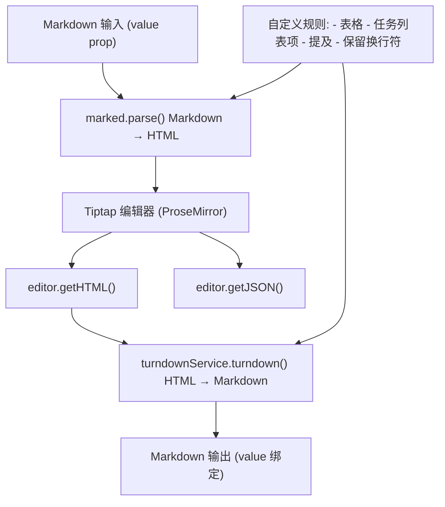
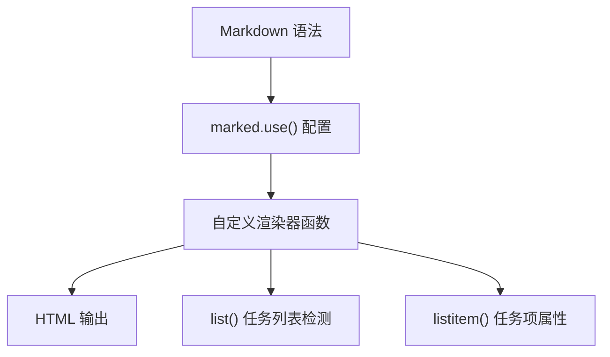
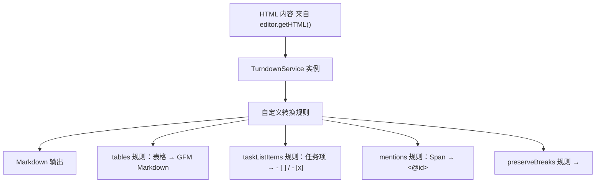

# 内容格式转换

相关源文件

-   [CHANGELOG.md](https://github.com/open-webui/open-webui/blob/a7271532/CHANGELOG.md)
-   [package-lock.json](https://github.com/open-webui/open-webui/blob/a7271532/package-lock.json)
-   [package.json](https://github.com/open-webui/open-webui/blob/a7271532/package.json)
-   [src/app.css](https://github.com/open-webui/open-webui/blob/a7271532/src/app.css)
-   [src/lib/components/ChangelogModal.svelte](https://github.com/open-webui/open-webui/blob/a7271532/src/lib/components/ChangelogModal.svelte)
-   [src/lib/components/common/RichTextInput.svelte](https://github.com/open-webui/open-webui/blob/a7271532/src/lib/components/common/RichTextInput.svelte)
-   [src/lib/components/icons/XMark.svelte](https://github.com/open-webui/open-webui/blob/a7271532/src/lib/components/icons/XMark.svelte)

本文档解释了富文本编辑器中 Markdown 和 HTML 之间的双向内容格式转换系统。转换流水线使用户能够使用 Markdown 语法工作，而 Tiptap 编辑器在内部操作 HTML/ProseMirror 结构。

有关 Tiptap 编辑器整体架构和扩展的信息，请参阅 [Tiptap 编辑器架构](/open-webui/open-webui/9.1-tiptap-editor-architecture)。有关使用 Yjs CRDT 的协作编辑功能，请参阅 [协作编辑](/open-webui/open-webui/9.3-collaborative-editing)。

## 目的与范围

内容格式转换系统提供：

-   初始化编辑器内容时，使用 `marked` 库进行 **Markdown → HTML 转换**。
-   提取用户输入时，使用 `TurndownService` 进行 **HTML → Markdown 转换**。
-   针对任务列表、表格、提及 (mentions) 和代码块的**自定义渲染规则**。
-   对换行符、提及和 GFM 扩展等特殊结构的**格式保留**。

该系统在编辑器事务 (transactions) 期间透明运行，确保外部 API（通过 `value` prop）始终接收 Markdown，而内部编辑器状态使用 HTML/ProseMirror 节点。

## 转换流水线架构


**来源：** [src/lib/components/common/RichTextInput.svelte1-30](https://github.com/open-webui/open-webui/blob/a7271532/src/lib/components/common/RichTextInput.svelte#L1-L30) [src/lib/components/common/RichTextInput.svelte639-677](https://github.com/open-webui/open-webui/blob/a7271532/src/lib/components/common/RichTextInput.svelte#L639-L677)

转换发生在两个关键时间点：

1.  **初始化**：当组件挂载时，`marked.parse()` 在将初始 Markdown `value` 传递给编辑器之前将其转换为 HTML（第 639-676 行）。
2.  **事务处理**：在 `onTransaction` 处理器中，`turndownService.turndown()` 在每次更改后将编辑器的 HTML 转换回 Markdown（第 774-832 行）。

## Markdown 到 HTML 转换 (marked.js)

`marked` 库将 Markdown 语法转换为 HTML。自定义渲染器处理特殊情况：


**来源：** [src/lib/components/common/RichTextInput.svelte5-29](https://github.com/open-webui/open-webui/blob/a7271532/src/lib/components/common/RichTextInput.svelte#L5-L29)

### 配置

`marked` 实例配置如下：

-   `breaks: true` - 启用 GitHub 风格的 Markdown 换行。
-   `gfm: true` - 启用 GitHub 风格的 Markdown 扩展。

**来源：** [src/lib/components/common/RichTextInput.svelte5-7](https://github.com/open-webui/open-webui/blob/a7271532/src/lib/components/common/RichTextInput.svelte#L5-L7)

### 自定义列表渲染器

自定义的 `list()` 渲染器检测任务列表并应用特殊属性：

[src/lib/components/common/RichTextInput.svelte9-19](https://github.com/open-webui/open-webui/blob/a7271532/src/lib/components/common/RichTextInput.svelte#L9-L19)

该渲染器：

1.  检测列表主体是否包含 `data-checked=` 属性（表示任务项）。
2.  将任务列表包装在 `<ul data-type="taskList">` 中，而不是普通的 `<ul>`。
3.  保留常规有序/无序列表的处理。

### 自定义列表项渲染器

自定义的 `listitem()` 渲染器处理任务项：

[src/lib/components/common/RichTextInput.svelte21-27](https://github.com/open-webui/open-webui/blob/a7271532/src/lib/components/common/RichTextInput.svelte#L21-L27)

这将 Markdown 任务列表语法 (`- [ ]` 或 `- [x]`) 转换为：

```html
<li data-type="taskItem" data-checked="true">内容</li>
```
这些属性由 Tiptap 的 `ListKit` 扩展用于渲染复选框。

**来源：** [src/lib/components/common/RichTextInput.svelte9-29](https://github.com/open-webui/open-webui/blob/a7271532/src/lib/components/common/RichTextInput.svelte#L9-L29)

## HTML 到 Markdown 转换 (TurndownService)

来自 `turndown` 库的 `TurndownService` 将 HTML 转回 Markdown。多项自定义规则处理特殊结构：


**来源：** [src/lib/components/common/RichTextInput.svelte31-106](https://github.com/open-webui/open-webui/blob/a7271532/src/lib/components/common/RichTextInput.svelte#L31-L106)

### TurndownService 配置

基础配置：

[src/lib/components/common/RichTextInput.svelte33-40](https://github.com/open-webui/open-webui/blob/a7271532/src/lib/components/common/RichTextInput.svelte#L33-L40)

关键设置：

-   `codeBlockStyle: 'fenced'` - 代码块使用三个反引号 (```) 。
-   `headingStyle: 'atx'` - 标题使用 `#` 前缀。
-   `turndownService.escape` 覆盖 - 禁用 HTML 实体转义以保留特殊字符。
-   `turndownService.use(gfm)` - 启用 GitHub 风格 Markdown 插件，用于表格、删除线等。

**来源：** [src/lib/components/common/RichTextInput.svelte31-40](https://github.com/open-webui/open-webui/blob/a7271532/src/lib/components/common/RichTextInput.svelte#L31-L40)

## 自定义转换规则

### 表格转换规则

`tables` 规则将 HTML 表格转换为 GFM Markdown 格式：

[src/lib/components/common/RichTextInput.svelte51-82](https://github.com/open-webui/open-webui/blob/a7271532/src/lib/components/common/RichTextInput.svelte#L51-L82)

该规则：

1.  从表格中提取所有 `<tr>` 元素。
2.  处理每一行的单元格（包括 `<th>` 和 `<td>`）。
3.  使用递归的 `turndownService.turndown()` 将单元格内容转换为 Markdown。
4.  将行格式化为 `| cell1 | cell2 | cell3 |`。
5.  在第一行（表头）后插入分隔行 (`| --- | --- | --- |`)。

结果是标准的 GFM 表格语法：

```text
| Header 1 | Header 2 |
| --- | --- |
| Cell 1 | Cell 2 |
```
**来源：** [src/lib/components/common/RichTextInput.svelte42-82](https://github.com/open-webui/open-webui/blob/a7271532/src/lib/components/common/RichTextInput.svelte#L42-L82)

### 任务列表项规则

`taskListItems` 规则将任务项转回 Markdown：

[src/lib/components/common/RichTextInput.svelte84-94](https://github.com/open-webui/open-webui/blob/a7271532/src/lib/components/common/RichTextInput.svelte#L84-L94)

该规则：

1.  过滤带有 `data-checked` 属性（`"true"` 或 `"false"`）的 `<li>` 元素。
2.  检查 `data-checked` 的值以确定复选框状态。
3.  格式化为 `- [x]`（已选中）或 `- [ ]`（未选中）。
4.  剥离内容开头的空白字符。

**来源：** [src/lib/components/common/RichTextInput.svelte84-94](https://github.com/open-webui/open-webui/blob/a7271532/src/lib/components/common/RichTextInput.svelte#L84-L94)

### 提及转换规则

`mentions` 规则将 Tiptap 的提及 span 转换为特殊的 `<@id>` 语法：

[src/lib/components/common/RichTextInput.svelte96-106](https://github.com/open-webui/open-webui/blob/a7271532/src/lib/components/common/RichTextInput.svelte#L96-L106)

该规则：

1.  过滤带有 `data-type="mention"` 的 `<span>` 元素。
2.  从 `data-id` 属性中提取提及 ID。
3.  从 `data-mention-suggestion-char`（通常为 `@`）中提取触发字符。
4.  格式化为 `<@id>` (例如 `<@llama3.2:latest>`)。

此语法在代码库的其他位置用于模型提及和变量替换。

**来源：** [src/lib/components/common/RichTextInput.svelte96-106](https://github.com/open-webui/open-webui/blob/a7271532/src/lib/components/common/RichTextInput.svelte#L96-L106)

### 保留换行规则

当启用 `preserveBreaks` prop 时，额外的规则会保留 `<br>` 元素：

[src/lib/components/common/RichTextInput.svelte647-653](https://github.com/open-webui/open-webui/blob/a7271532/src/lib/components/common/RichTextInput.svelte#L647-L653)

这可以防止在转换过程中换行符被剥离，这在某些格式上下文中是必需的。

**来源：** [src/lib/components/common/RichTextInput.svelte647-653](https://github.com/open-webui/open-webui/blob/a7271532/src/lib/components/common/RichTextInput.svelte#L647-L653)

## 与编辑器生命周期的集成

### 初始化流程

> **[Mermaid sequence]**
> *(图表结构无法解析)*

**来源：** [src/lib/components/common/RichTextInput.svelte639-683](https://github.com/open-webui/open-webui/blob/a7271532/src/lib/components/common/RichTextInput.svelte#L639-L683)

在组件挂载 (`onMount`) 时：

1.  初始 Markdown `value` prop 存储在 `content` 变量中（第 640 行）。
2.  如果 `json` 模式未启用且非 `raw` 模式，`marked.parse()` 将 Markdown 转换为 HTML（第 656-676 行）。
3.  转换后的 HTML 被传递给 Tiptap `Editor` 构造函数（第 683-772 行）。

特殊处理：

-   如果 `marked` 失败，`tryParse()` 函数将重试解析最多 3 次（第 657-672 行）。
-   如果重试后仍解析失败，则回退到纯文本（第 664-666 行）。
-   协作模式会跳过内容初始化，以使用 Yjs 文档状态（第 679-682 行，第 772 行）。

### 事务流程 (Transaction Flow)

> **[Mermaid sequence]**
> *(图表结构无法解析)*

**来源：** [src/lib/components/common/RichTextInput.svelte774-832](https://github.com/open-webui/open-webui/blob/a7271532/src/lib/components/common/RichTextInput.svelte#L774-L832)

在每次编辑器事务中：

1.  `editor.getHTML()` 提取当前 HTML 状态（第 779 行）。
2.  `editor.getJSON()` 提取当前 JSON 状态（第 780 行）。
3.  HTML 在转换前经过处理：
    -   空段落 `<p></p>` 被替换为 `<br/>`（第 786, 795 行）。
    -   多重空格转换为不换行空格 `\u00a0` 以保留格式（第 787, 797 行）。
    -   在非富文本模式下，制表符转换为 4 个不换行空格（第 799 行）。
4.  `turndownService.turndown()` 将 HTML 转换为 Markdown（第 783-803 行）。
5.  不换行空格转换回普通空格（第 789, 802 行）。
6.  如果 `preserveBreaks` 未启用，则剥离 `<br/>` 标签（第 817-819 行）。
7.  `value` 绑定更新为 Markdown 输出（第 822 行）。
8.  调用带有所有格式的 `onChange` 回调（第 805-809 行）。

**来源：** [src/lib/components/common/RichTextInput.svelte774-832](https://github.com/open-webui/open-webui/blob/a7271532/src/lib/components/common/RichTextInput.svelte#L774-L832)

## 特殊内容处理

### 不换行空格保留

转换流水线使用两步过程来保留多个连续空格：

[src/lib/components/common/RichTextInput.svelte787-789](https://github.com/open-webui/open-webui/blob/a7271532/src/lib/components/common/RichTextInput.svelte#L787-L789) [src/lib/components/common/RichTextInput.svelte797-802](https://github.com/open-webui/open-webui/blob/a7271532/src/lib/components/common/RichTextInput.svelte#L797-L802)

1.  将 2 个及以上的空格序列替换为不换行空格 (`\u00a0`)。
2.  将 HTML 转换为 Markdown。
3.  将不换行空格替换回普通空格。

这防止了 HTML 压缩多重空格，同时在最终 Markdown 输出中保留了它们。

### 空段落处理

空段落被规范化为换行符：

[src/lib/components/common/RichTextInput.svelte786](https://github.com/open-webui/open-webui/blob/a7271532/src/lib/components/common/RichTextInput.svelte#L786-L786) [src/lib/components/common/RichTextInput.svelte795](https://github.com/open-webui/open-webui/blob/a7271532/src/lib/components/common/RichTextInput.svelte#L795-L795)

在转换前，`<p></p>` 模式被替换为 `<br/>`，确保空行在 Markdown 输出中得到正确表示。

**来源：** [src/lib/components/common/RichTextInput.svelte782-803](https://github.com/open-webui/open-webui/blob/a7271532/src/lib/components/common/RichTextInput.svelte#L782-L803)

## 模式差异

### 富文本模式

当 `richText={true}`（默认值）时，启用带有 GFM 扩展的完整转换：

[src/lib/components/common/RichTextInput.svelte782-789](https://github.com/open-webui/open-webui/blob/a7271532/src/lib/components/common/RichTextInput.svelte#L782-L789)

### 纯文本模式

当 `richText={false}` 时，使用较简单的转换并保留制表符：

[src/lib/components/common/RichTextInput.svelte790-803](https://github.com/open-webui/open-webui/blob/a7271532/src/lib/components/common/RichTextInput.svelte#L790-L803)

额外处理：

-   制表符转换为 4 个不换行空格（第 799 行）。
-   粘贴事件强制仅插入纯文本（第 836-866 行）。

**来源：** [src/lib/components/common/RichTextInput.svelte782-803](https://github.com/open-webui/open-webui/blob/a7271532/src/lib/components/common/RichTextInput.svelte#L782-L803) [src/lib/components/common/RichTextInput.svelte836-866](https://github.com/open-webui/open-webui/blob/a7271532/src/lib/components/common/RichTextInput.svelte#L836-L866)

## 格式支持矩阵

| Markdown 结构 | HTML 表示 | 自定义规则 |
| --- | --- | --- |
| `- [ ]` 任务项 | `<li data-type="taskItem" data-checked="false">` | `listitem()`, `taskListItems` |
| `- [x]` 已勾选任务 | `<li data-type="taskItem" data-checked="true">` | `listitem()`, `taskListItems` |
| GFM 表格 | `<table><thead><tr><th>...</th></tr></thead>...` | `tables` |
| `<@modelId>` | `<span data-type="mention" data-id="modelId">` | `mentions` |
| 换行符 (`preserveBreaks=true`) | `<br>` / `<br/>` | `preserveBreaks` |
| 代码块 | `<pre><code class="language-xyz">` | 内置 GFM |
| 删除线 | `<del>` / `<s>` | 内置 GFM |

**来源：** [src/lib/components/common/RichTextInput.svelte1-106](https://github.com/open-webui/open-webui/blob/a7271532/src/lib/components/common/RichTextInput.svelte#L1-L106) [src/lib/components/common/RichTextInput.svelte647-653](https://github.com/open-webui/open-webui/blob/a7271532/src/lib/components/common/RichTextInput.svelte#L647-L653)

## 依赖项

转换系统依赖于以下 npm 包：

| 软件包 | 版本 | 用途 |
| --- | --- | --- |
| `marked` | ^9.1.0 | Markdown → HTML 解析 |
| `turndown` | ^7.2.0 | HTML → Markdown 转换 |
| `@joplin/turndown-plugin-gfm` | ^1.0.62 | Turndown 的 GFM 扩展 |

**来源：** [package.json71](https://github.com/open-webui/open-webui/blob/a7271532/package.json#L71-L71) [package.json93](https://github.com/open-webui/open-webui/blob/a7271532/package.json#L93-L93) [package.json18](https://github.com/open-webui/open-webui/blob/a7271532/package.json#L18-L18)

`DOMPurify` 库也用于代码库的其他部分，在渲染前清理 HTML，虽然它不是转换流水线的直接组成部分。

**来源：** [src/lib/components/common/RichTextInput.svelte3](https://github.com/open-webui/open-webui/blob/a7271532/src/lib/components/common/RichTextInput.svelte#L3-L3)
