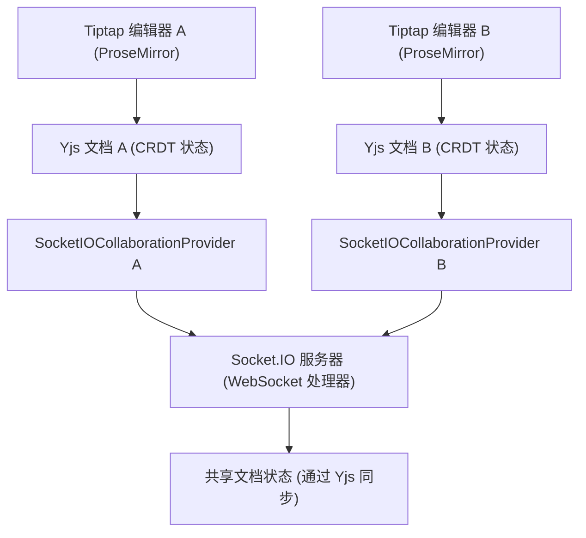
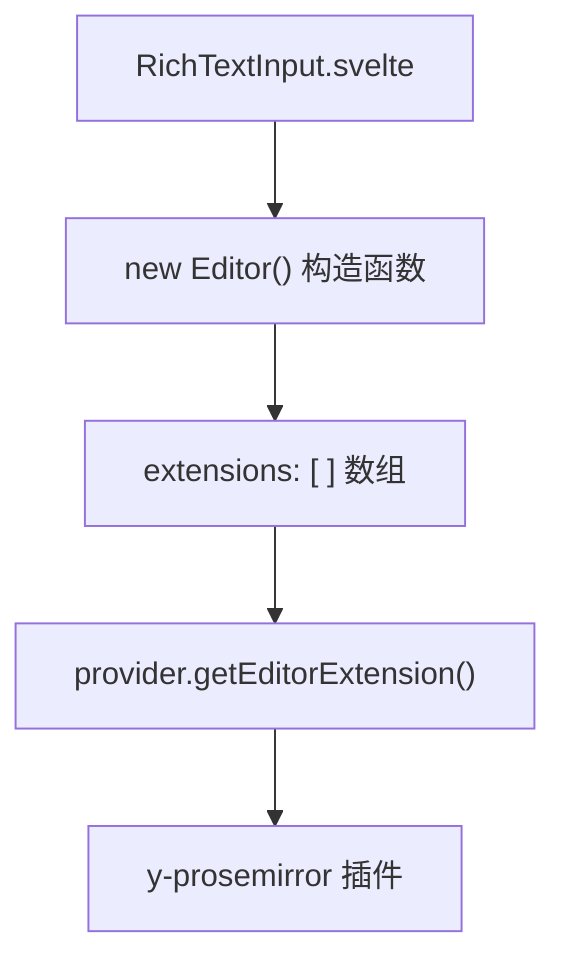
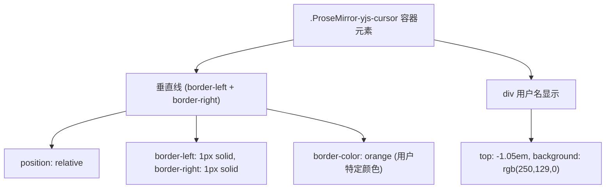
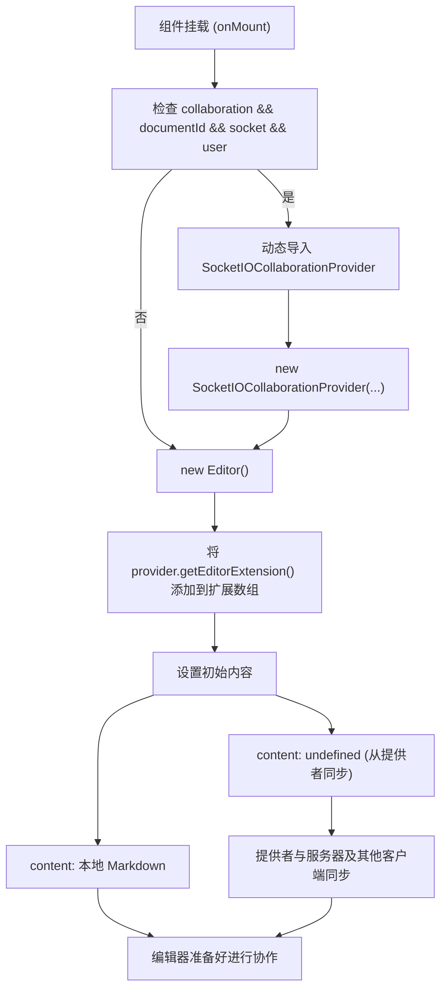
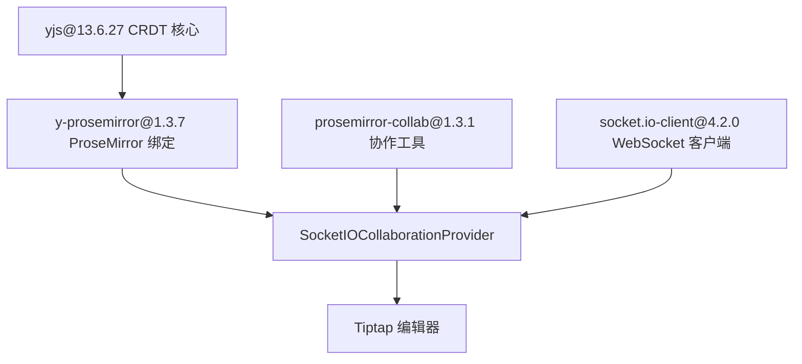

# 协作编辑

相关源文件

-   [CHANGELOG.md](https://github.com/open-webui/open-webui/blob/a7271532/CHANGELOG.md)
-   [package-lock.json](https://github.com/open-webui/open-webui/blob/a7271532/package-lock.json)
-   [package.json](https://github.com/open-webui/open-webui/blob/a7271532/package.json)
-   [src/app.css](https://github.com/open-webui/open-webui/blob/a7271532/src/app.css)
-   [src/lib/components/ChangelogModal.svelte](https://github.com/open-webui/open-webui/blob/a7271532/src/lib/components/ChangelogModal.svelte)
-   [src/lib/components/common/RichTextInput.svelte](https://github.com/open-webui/open-webui/blob/a7271532/src/lib/components/common/RichTextInput.svelte)
-   [src/lib/components/icons/XMark.svelte](https://github.com/open-webui/open-webui/blob/a7271532/src/lib/components/icons/XMark.svelte)

## 目的与范围

本文档涵盖了内置在 Open WebUI 富文本编辑器组件中的实时协作编辑系统。该系统利用无冲突复制数据类型 (CRDT) 实现自动冲突解决，使多位用户能够同时编辑同一个文档。更改通过 WebSocket 连接实时同步，并配有显示远程用户光标位置和选择内容的视觉指示器。

有关更广泛的富文本输入架构和 Tiptap 配置的信息，请参阅 [Tiptap 编辑器架构](/open-webui/open-webui/9.1-tiptap-editor-architecture)。有关 Markdown 和 HTML 之间的内容格式转换，请参阅 [内容格式转换](/open-webui/open-webui/9.2-content-format-conversion)。

---

## 架构概览

协作编辑系统构建在三个主要层级之上：

1.  **CRDT 层**：Yjs 提供无冲突复制数据结构，允许并发编辑而无需显式锁定或协调。
2.  **传输层**：`SocketIOCollaborationProvider` 管理 WebSocket 通信并同步客户端之间的文档状态。
3.  **编辑器集成层**：Tiptap 扩展将编辑器的 ProseMirror 文档模型连接到 Yjs CRDT。


**来源：** [src/lib/components/common/RichTextInput.svelte147-148](https://github.com/open-webui/open-webui/blob/a7271532/src/lib/components/common/RichTextInput.svelte#L147-L148) [src/lib/components/common/RichTextInput.svelte679-682](https://github.com/open-webui/open-webui/blob/a7271532/src/lib/components/common/RichTextInput.svelte#L679-L682) [package.json145-147](https://github.com/open-webui/open-webui/blob/a7271532/package.json#L145-L147)

---

## 基于 Yjs 的 CRDT 基础

Yjs 是一个 CRDT 实现，能够实现共享数据结构的无冲突同步。在 Open WebUI 中，Yjs 维护一个共享的文档表示，多个编辑器可以同时对其进行修改而无需显式协调。

### Yjs 集成点

协作系统在满足以下三个条件时初始化：

| 条件 | 描述 | 代码参考 |
| --- | --- | --- |
| `collaboration` prop | 必须为 `true` | [src/lib/components/common/RichTextInput.svelte250](https://github.com/open-webui/open-webui/blob/a7271532/src/lib/components/common/RichTextInput.svelte#L250-L250) |
| `documentId` | 共享文档的唯一标识符 | [src/lib/components/common/RichTextInput.svelte170](https://github.com/open-webui/open-webui/blob/a7271532/src/lib/components/common/RichTextInput.svelte#L170-L170) |
| `socket` | 活跃的 Socket.IO 连接 | [src/lib/components/common/RichTextInput.svelte166](https://github.com/open-webui/open-webui/blob/a7271532/src/lib/components/common/RichTextInput.svelte#L166-L166) |
| `user` | 用于状态追踪的用户身份 | [src/lib/components/common/RichTextInput.svelte167](https://github.com/open-webui/open-webui/blob/a7271532/src/lib/components/common/RichTextInput.svelte#L167-L167) |

当这些条件满足时，系统会动态导入协作提供者：

```text
RichTextInput.svelte:
  - 第 679-682 行：动态导入与提供者初始化
  - if (collaboration && documentId && socket && user)
  - const { SocketIOCollaborationProvider } = await import(...)
  - provider = new SocketIOCollaborationProvider(documentId, socket, user, content)
```
**来源：** [src/lib/components/common/RichTextInput.svelte679-682](https://github.com/open-webui/open-webui/blob/a7271532/src/lib/components/common/RichTextInput.svelte#L679-L682) [src/lib/components/common/RichTextInput.svelte166-170](https://github.com/open-webui/open-webui/blob/a7271532/src/lib/components/common/RichTextInput.svelte#L166-L170)

---

## SocketIOCollaborationProvider 实现

`SocketIOCollaborationProvider` 类将 Yjs 的 CRDT 操作与 Socket.IO 的实时传输连接起来。该提供者负责：

-   向连接的对等端广播本地文档更改。
-   接收并应用来自其他用户的远程更改。
-   管理光标位置和用户在线状态的感知 (awareness) 状态。
-   处理连接生命周期（连接、断开、重连）。

> **[Mermaid sequence]**
> *(图表结构无法解析)*

**来源：** [src/lib/components/common/RichTextInput.svelte679-682](https://github.com/open-webui/open-webui/blob/a7271532/src/lib/components/common/RichTextInput.svelte#L679-L682) [src/lib/components/common/RichTextInput.svelte147-148](https://github.com/open-webui/open-webui/blob/a7271532/src/lib/components/common/RichTextInput.svelte#L147-L148)

---

## Tiptap 编辑器集成

协作提供者公开了一个 Tiptap 扩展，将 Yjs 与 ProseMirror 的文档模型集成。该扩展有条件地添加到编辑器配置中：

```text
编辑器扩展配置 (RichTextInput.svelte:683-772):
  - 第 770 行: ...(collaboration && provider ? [provider.getEditorExtension()] : [])
  - 第 772 行: content: collaboration ? undefined : content
```
当启用协作时，编辑器的初始内容被设置为 `undefined`，因为文档状态将从提供者同步，而不是使用本地的 `content` prop。

### 扩展注册模式


`provider.getEditorExtension()` 返回的扩展使用 `y-prosemirror` 库将 ProseMirror 编辑器状态连接到 Yjs 文档，该库提供了 ProseMirror 事务与 Yjs 操作之间的双向同步。

**来源：** [src/lib/components/common/RichTextInput.svelte683-772](https://github.com/open-webui/open-webui/blob/a7271532/src/lib/components/common/RichTextInput.svelte#L683-L772) [package.json145](https://github.com/open-webui/open-webui/blob/a7271532/package.json#L145-L145)

---

## 远程呈现指示器

协作编辑系统显示远程用户光标位置和选择内容的实时视觉指示器。这是通过应用于 ProseMirror 装饰 (decorations) 的 CSS 类实现的。

### 光标渲染实现

`.ProseMirror-yjs-cursor` 类定义了远程用户光标的样式：

```text
.ProseMirror-yjs-cursor (app.css:664-686):
  - 通过 border-left 和 border-right 创建垂直插入符线
  - 样式: position: relative，pointer-events: none
  - 颜色自动被用户特定的颜色覆盖
  - 用户名 div 绝对定位在光标上方
```

### 用户名徽章定位

每个远程光标都在其位置上方的一个小徽章中显示用户姓名：

| CSS 属性 | 值 | 用途 |
| --- | --- | --- |
| `position` | `absolute` | 相对于光标定位 |
| `top` | `-1.05em` | 浮动在光标线上方 |
| `left` | `-1px` | 与光标边框对齐 |
| `font-size` | `13px` | 清晰但不突兀 |
| `background-color` | `rgb(250, 129, 0)` | 每个用户特有的颜色 |
| `color` | `white` | 对比色以确保可读性 |
| `padding` | `2px` | 极简内边距 |

**来源：** [src/app.css664-686](https://github.com/open-webui/open-webui/blob/a7271532/src/app.css#L664-L686) [src/app.css660-662](https://github.com/open-webui/open-webui/blob/a7271532/src/app.css#L660-L662)

---

## 初始化与生命周期

协作系统遵循特定的初始化序列，以确保在开始编辑前进行正确的同步。

### 初始化流程


**来源：** [src/lib/components/common/RichTextInput.svelte639-772](https://github.com/open-webui/open-webui/blob/a7271532/src/lib/components/common/RichTextInput.svelte#L639-L772)

### 生命周期管理

```text
提供者生命周期 (RichTextInput.svelte:268-269, 679-682):
  - 第 268 行: let provider: SocketIOCollaborationProvider | null = null
  - 第 679-682 行: 在 onMount 中实例化提供者
  - 提供者引用存储在组件状态中
  - 清理工作由 Socket.IO 断开连接自动处理
```
**来源：** [src/lib/components/common/RichTextInput.svelte268-269](https://github.com/open-webui/open-webui/blob/a7271532/src/lib/components/common/RichTextInput.svelte#L268-L269) [src/lib/components/common/RichTextInput.svelte679-682](https://github.com/open-webui/open-webui/blob/a7271532/src/lib/components/common/RichTextInput.svelte#L679-L682)

---

## 状态同步机制

Yjs 使用无冲突同步算法，确定性地合并并发编辑。该系统基于以下原则运行：

### CRDT 操作类型

| 操作 | 描述 | 示例 |
| --- | --- | --- |
| **插入 (Insert)** | 在指定位置添加内容 | 用户 A 在位置 0 插入 "Hello" |
| **删除 (Delete)** | 移除一段内容范围 | 用户 B 删除位置 5-10 的字符 |
| **格式化 (Format)** | 应用格式样式 | 用户 C 对位置 2-7 的文本加粗 |

所有操作都由 Yjs 进行时间戳标记和因果排序，确保无论网络延迟或操作到达顺序如何，所有客户端最终都会收敛到相同的状态。

### 同步过程

> **[Mermaid sequence]**
> *(图表结构无法解析)*

CRDT 算法确保尽管存在并发的冲突编辑，用户 A 和用户 B 最终都会达到相同的文档状态 ("WorldHello")。

**来源：** [package.json145-147](https://github.com/open-webui/open-webui/blob/a7271532/package.json#L145-L147) [src/app.css664-686](https://github.com/open-webui/open-webui/blob/a7271532/src/app.css#L664-L686)

---

## 依赖与软件包集成

协作编辑系统依赖于多个 npm 软件包的协同工作：

| 软件包 | 版本 | 角色 |
| --- | --- | --- |
| `yjs` | ^13.6.27 | CRDT 实现 |
| `y-prosemirror` | ^1.3.7 | ProseMirror-Yjs 绑定 |
| `prosemirror-collab` | ^1.3.1 | ProseMirror 协作工具 |
| `socket.io-client` | ^4.2.0 | WebSocket 传输层 |


**来源：** [package.json103](https://github.com/open-webui/open-webui/blob/a7271532/package.json#L103-L103) [package.json145-147](https://github.com/open-webui/open-webui/blob/a7271532/package.json#L145-L147) [package.json76](https://github.com/open-webui/open-webui/blob/a7271532/package.json#L76-L76) [package.json89](https://github.com/open-webui/open-webui/blob/a7271532/package.json#L89-L89)

---

## 特性标志与配置

协作编辑特性通过几个配置点进行控制：

```text
配置点 (RichTextInput.svelte):
  - 第 250 行: export let collaboration = false
  - 第 170 行: export let documentId = ''
  - 第 166 行: export let socket = null
  - 第 167 行: export let user = null
```
### 启用协作

要为 RichTextInput 实例启用协作编辑：

```html
<RichTextInput
  collaboration={true}
  documentId="unique-doc-id-123"
  socket={socketConnection}
  user={currentUser}
  bind:value={content}
/>
```
当 `collaboration` 为 false 时，编辑器以单用户模式运行，不进行网络同步。

**来源：** [src/lib/components/common/RichTextInput.svelte166-170](https://github.com/open-webui/open-webui/blob/a7271532/src/lib/components/common/RichTextInput.svelte#L166-L170) [src/lib/components/common/RichTextInput.svelte250](https://github.com/open-webui/open-webui/blob/a7271532/src/lib/components/common/RichTextInput.svelte#L250-L250)
