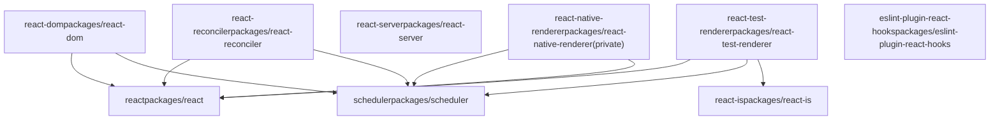
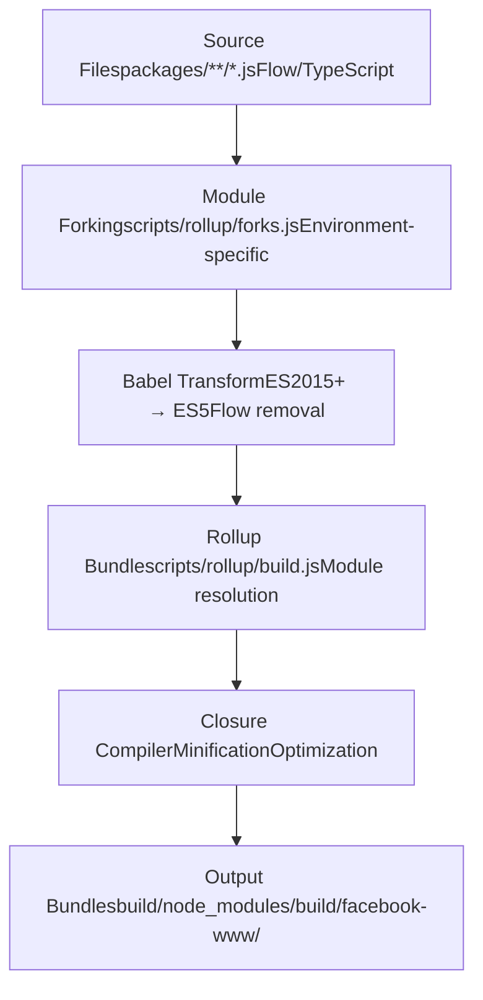

# Overview

Relevant source files

-   [.gitignore](https://github.com/facebook/react/blob/65eec428/.gitignore)
-   [package.json](https://github.com/facebook/react/blob/65eec428/package.json)
-   [packages/eslint-plugin-react-hooks/package.json](https://github.com/facebook/react/blob/65eec428/packages/eslint-plugin-react-hooks/package.json)
-   [packages/jest-react/package.json](https://github.com/facebook/react/blob/65eec428/packages/jest-react/package.json)
-   [packages/react-art/package.json](https://github.com/facebook/react/blob/65eec428/packages/react-art/package.json)
-   [packages/react-dom/package.json](https://github.com/facebook/react/blob/65eec428/packages/react-dom/package.json)
-   [packages/react-is/package.json](https://github.com/facebook/react/blob/65eec428/packages/react-is/package.json)
-   [packages/react-native-renderer/package.json](https://github.com/facebook/react/blob/65eec428/packages/react-native-renderer/package.json)
-   [packages/react-noop-renderer/package.json](https://github.com/facebook/react/blob/65eec428/packages/react-noop-renderer/package.json)
-   [packages/react-reconciler/package.json](https://github.com/facebook/react/blob/65eec428/packages/react-reconciler/package.json)
-   [packages/react-test-renderer/package.json](https://github.com/facebook/react/blob/65eec428/packages/react-test-renderer/package.json)
-   [packages/react/package.json](https://github.com/facebook/react/blob/65eec428/packages/react/package.json)
-   [packages/scheduler/package.json](https://github.com/facebook/react/blob/65eec428/packages/scheduler/package.json)
-   [packages/shared/ReactFeatureFlags.js](https://github.com/facebook/react/blob/65eec428/packages/shared/ReactFeatureFlags.js)
-   [packages/shared/ReactVersion.js](https://github.com/facebook/react/blob/65eec428/packages/shared/ReactVersion.js)
-   [packages/shared/forks/ReactFeatureFlags.native-fb-dynamic.js](https://github.com/facebook/react/blob/65eec428/packages/shared/forks/ReactFeatureFlags.native-fb-dynamic.js)
-   [packages/shared/forks/ReactFeatureFlags.native-fb.js](https://github.com/facebook/react/blob/65eec428/packages/shared/forks/ReactFeatureFlags.native-fb.js)
-   [packages/shared/forks/ReactFeatureFlags.native-oss.js](https://github.com/facebook/react/blob/65eec428/packages/shared/forks/ReactFeatureFlags.native-oss.js)
-   [packages/shared/forks/ReactFeatureFlags.test-renderer.js](https://github.com/facebook/react/blob/65eec428/packages/shared/forks/ReactFeatureFlags.test-renderer.js)
-   [packages/shared/forks/ReactFeatureFlags.test-renderer.native-fb.js](https://github.com/facebook/react/blob/65eec428/packages/shared/forks/ReactFeatureFlags.test-renderer.native-fb.js)
-   [packages/shared/forks/ReactFeatureFlags.test-renderer.www.js](https://github.com/facebook/react/blob/65eec428/packages/shared/forks/ReactFeatureFlags.test-renderer.www.js)
-   [packages/shared/forks/ReactFeatureFlags.www-dynamic.js](https://github.com/facebook/react/blob/65eec428/packages/shared/forks/ReactFeatureFlags.www-dynamic.js)
-   [packages/shared/forks/ReactFeatureFlags.www.js](https://github.com/facebook/react/blob/65eec428/packages/shared/forks/ReactFeatureFlags.www.js)
-   [scripts/flow/config/flowconfig](https://github.com/facebook/react/blob/65eec428/scripts/flow/config/flowconfig)
-   [scripts/flow/createFlowConfigs.js](https://github.com/facebook/react/blob/65eec428/scripts/flow/createFlowConfigs.js)
-   [scripts/flow/xplat.js](https://github.com/facebook/react/blob/65eec428/scripts/flow/xplat.js)
-   [scripts/jest/setupHostConfigs.js](https://github.com/facebook/react/blob/65eec428/scripts/jest/setupHostConfigs.js)
-   [scripts/rollup/build.js](https://github.com/facebook/react/blob/65eec428/scripts/rollup/build.js)
-   [scripts/rollup/bundles.js](https://github.com/facebook/react/blob/65eec428/scripts/rollup/bundles.js)
-   [scripts/rollup/forks.js](https://github.com/facebook/react/blob/65eec428/scripts/rollup/forks.js)
-   [scripts/rollup/modules.js](https://github.com/facebook/react/blob/65eec428/scripts/rollup/modules.js)
-   [scripts/rollup/packaging.js](https://github.com/facebook/react/blob/65eec428/scripts/rollup/packaging.js)
-   [scripts/rollup/sync.js](https://github.com/facebook/react/blob/65eec428/scripts/rollup/sync.js)
-   [scripts/rollup/wrappers.js](https://github.com/facebook/react/blob/65eec428/scripts/rollup/wrappers.js)
-   [scripts/shared/inlinedHostConfigs.js](https://github.com/facebook/react/blob/65eec428/scripts/shared/inlinedHostConfigs.js)
-   [yarn.lock](https://github.com/facebook/react/blob/65eec428/yarn.lock)

This document provides a high-level introduction to the React repository at [https://github.com/facebook/react](https://github.com/facebook/react). It explains the repository's structure, major systems, and architectural organization. For detailed information about specific subsystems, see the following pages:

-   For the feature flags system that controls experimental features and platform-specific behavior, see [Feature Flags System](/facebook/react/2-feature-flags-system)
-   For the build system, Rollup configuration, and package distribution, see [Build System and Package Distribution](/facebook/react/3-build-system-and-package-distribution)
-   For the reconciler (React's core rendering engine), see [React Reconciler](/facebook/react/4-react-reconciler)
-   For server-side rendering capabilities, see [Server-Side Rendering](/facebook/react/5-server-side-rendering)
-   For platform-specific implementations, see [Platform Implementations](/facebook/react/6-platform-implementations)
-   For developer tools and debugging, see [Developer Tools and Debugging](/facebook/react/7-developer-tools-and-debugging)

## Purpose and Scope

The React repository is a JavaScript library for building user interfaces. This repository is organized as a **monorepo** containing multiple packages that work together to provide:

1.  **Core React APIs** - The public-facing `react` package with component model, hooks, and JSX runtime
2.  **Platform Renderers** - Implementations for DOM (`react-dom`), React Native, and custom renderers
3.  **Server Capabilities** - Streaming SSR (Fizz) and React Server Components (Flight)
4.  **Build Infrastructure** - Rollup-based build system with module forking and feature flags
5.  **Developer Tools** - ESLint plugin, DevTools extensions, and test utilities

The repository produces npm packages distributed through multiple **release channels** (stable, experimental, canary, rc) and supports multiple **bundle types** (NODE, ESM, FB\_WWW, RN\_OSS, RN\_FB) to serve different environments.

Sources: [package.json1-163](https://github.com/facebook/react/blob/65eec428/package.json#L1-L163) [packages/react/package.json1-52](https://github.com/facebook/react/blob/65eec428/packages/react/package.json#L1-L52) [packages/react-dom/package.json1-127](https://github.com/facebook/react/blob/65eec428/packages/react-dom/package.json#L1-L127)

## Repository Structure

The repository is structured as a Yarn 1.x monorepo with all packages under `packages/*`:

| Directory | Purpose |
| --- | --- |
| `packages/react` | Core React package (hooks, component model, JSX) |
| `packages/react-dom` | DOM renderer and server rendering |
| `packages/react-reconciler` | Standalone reconciler for custom renderers |
| `packages/react-server` | Server-side rendering infrastructure (Fizz/Flight) |
| `packages/scheduler` | Priority-based task scheduling |
| `packages/react-test-renderer` | Test renderer for snapshot testing |
| `packages/react-art` | Canvas/SVG/VML renderer |
| `packages/react-is` | Type checking utilities |
| `packages/eslint-plugin-react-hooks` | ESLint rules for Hooks |
| `packages/react-devtools*` | DevTools backend, frontend, and extensions |
| `packages/shared` | Shared utilities and feature flags |
| `scripts/` | Build scripts, rollup configuration, CI/CD |

### Package Dependency Graph


Sources: [package.json1-163](https://github.com/facebook/react/blob/65eec428/package.json#L1-L163) [packages/react/package.json1-52](https://github.com/facebook/react/blob/65eec428/packages/react/package.json#L1-L52) [packages/react-dom/package.json1-127](https://github.com/facebook/react/blob/65eec428/packages/react-dom/package.json#L1-L127) [packages/react-reconciler/package.json1-34](https://github.com/facebook/react/blob/65eec428/packages/react-reconciler/package.json#L1-L34) [packages/react-test-renderer/package.json1-35](https://github.com/facebook/react/blob/65eec428/packages/react-test-renderer/package.json#L1-L35) [packages/scheduler/package.json1-27](https://github.com/facebook/react/blob/65eec428/packages/scheduler/package.json#L1-L27)

## Major Systems Overview

The React codebase is organized into several interconnected systems:

### 1\. Feature Flags System

The feature flags system (defined in [packages/shared/ReactFeatureFlags.js1-259](https://github.com/facebook/react/blob/65eec428/packages/shared/ReactFeatureFlags.js#L1-L259)) controls experimental features and platform-specific behavior. It uses **module forking** to provide different flag values for different environments:

-   **Base flags**: [packages/shared/ReactFeatureFlags.js](https://github.com/facebook/react/blob/65eec428/packages/shared/ReactFeatureFlags.js)
-   **WWW (Meta internal)**: [packages/shared/forks/ReactFeatureFlags.www.js](https://github.com/facebook/react/blob/65eec428/packages/shared/forks/ReactFeatureFlags.www.js)
-   **React Native (Meta)**: [packages/shared/forks/ReactFeatureFlags.native-fb.js](https://github.com/facebook/react/blob/65eec428/packages/shared/forks/ReactFeatureFlags.native-fb.js)
-   **React Native (OSS)**: [packages/shared/forks/ReactFeatureFlags.native-oss.js](https://github.com/facebook/react/blob/65eec428/packages/shared/forks/ReactFeatureFlags.native-oss.js)
-   **Test Renderer**: [packages/shared/forks/ReactFeatureFlags.test-renderer.js](https://github.com/facebook/react/blob/65eec428/packages/shared/forks/ReactFeatureFlags.test-renderer.js)

Dynamic flags for Meta internal builds use runtime feature flagging systems (Gatekeeper for web, native feature flags for React Native).

Sources: [packages/shared/ReactFeatureFlags.js1-259](https://github.com/facebook/react/blob/65eec428/packages/shared/ReactFeatureFlags.js#L1-L259) [packages/shared/forks/ReactFeatureFlags.www.js1-121](https://github.com/facebook/react/blob/65eec428/packages/shared/forks/ReactFeatureFlags.www.js#L1-L121) [packages/shared/forks/ReactFeatureFlags.native-fb.js1-92](https://github.com/facebook/react/blob/65eec428/packages/shared/forks/ReactFeatureFlags.native-fb.js#L1-L92) [packages/shared/forks/ReactFeatureFlags.native-oss.js1-91](https://github.com/facebook/react/blob/65eec428/packages/shared/forks/ReactFeatureFlags.native-oss.js#L1-L91)

### 2\. Build System and Module Forking

The build system is based on **Rollup** with custom plugins for module forking, closure compilation, and bundle generation. Key files:

-   **Bundle definitions**: [scripts/rollup/bundles.js1-1144](https://github.com/facebook/react/blob/65eec428/scripts/rollup/bundles.js#L1-L1144)
-   **Build orchestration**: [scripts/rollup/build.js1-1021](https://github.com/facebook/react/blob/65eec428/scripts/rollup/build.js#L1-L1021)
-   **Module fork mappings**: [scripts/rollup/forks.js1-601](https://github.com/facebook/react/blob/65eec428/scripts/rollup/forks.js#L1-L601)
-   **Host config definitions**: [scripts/shared/inlinedHostConfigs.js1-500](https://github.com/facebook/react/blob/65eec428/scripts/shared/inlinedHostConfigs.js#L1-L500)

The system produces multiple **bundle types**:

| Bundle Type | Environment | Format | Target |
| --- | --- | --- | --- |
| `NODE_DEV/NODE_PROD` | Node.js | CJS | npm packages |
| `ESM_DEV/ESM_PROD` | ES modules | ESM | Modern bundlers |
| `FB_WWW_*` | Meta internal | CJS | facebook.com |
| `RN_OSS_*` | React Native OSS | CJS | React Native apps |
| `RN_FB_*` | React Native (Meta) | CJS | Meta mobile apps |

Sources: [scripts/rollup/bundles.js1-1144](https://github.com/facebook/react/blob/65eec428/scripts/rollup/bundles.js#L1-L1144) [scripts/rollup/build.js1-1021](https://github.com/facebook/react/blob/65eec428/scripts/rollup/build.js#L1-L1021) [scripts/rollup/forks.js1-601](https://github.com/facebook/react/blob/65eec428/scripts/rollup/forks.js#L1-L601)

### 3\. React Reconciler

The reconciler is React's core rendering engine, implemented using the **Fiber architecture**. Key components:

-   **Work loop**: [packages/react-reconciler/src/ReactFiberWorkLoop.js](https://github.com/facebook/react/blob/65eec428/packages/react-reconciler/src/ReactFiberWorkLoop.js)
-   **Begin work**: [packages/react-reconciler/src/ReactFiberBeginWork.js](https://github.com/facebook/react/blob/65eec428/packages/react-reconciler/src/ReactFiberBeginWork.js)
-   **Complete work**: [packages/react-reconciler/src/ReactFiberCompleteWork.js](https://github.com/facebook/react/blob/65eec428/packages/react-reconciler/src/ReactFiberCompleteWork.js)
-   **Commit work**: [packages/react-reconciler/src/ReactFiberCommitWork.js](https://github.com/facebook/react/blob/65eec428/packages/react-reconciler/src/ReactFiberCommitWork.js)
-   **Hooks implementation**: [packages/react-reconciler/src/ReactFiberHooks.js](https://github.com/facebook/react/blob/65eec428/packages/react-reconciler/src/ReactFiberHooks.js)

The reconciler uses **host configuration abstraction** to render to different platforms:

-   **DOM**: [packages/react-dom-bindings/src/client/ReactFiberConfigDOM.js](https://github.com/facebook/react/blob/65eec428/packages/react-dom-bindings/src/client/ReactFiberConfigDOM.js)
-   **React Native (Fabric)**: [packages/react-native-renderer/src/ReactFiberConfigFabric.js](https://github.com/facebook/react/blob/65eec428/packages/react-native-renderer/src/ReactFiberConfigFabric.js)
-   **React Native (Legacy)**: [packages/react-native-renderer/src/ReactFiberConfigNative.js](https://github.com/facebook/react/blob/65eec428/packages/react-native-renderer/src/ReactFiberConfigNative.js)
-   **Test renderer**: [packages/react-test-renderer/src/ReactFiberConfigTestHost.js](https://github.com/facebook/react/blob/65eec428/packages/react-test-renderer/src/ReactFiberConfigTestHost.js)

Sources: [scripts/shared/inlinedHostConfigs.js1-500](https://github.com/facebook/react/blob/65eec428/scripts/shared/inlinedHostConfigs.js#L1-L500) [scripts/rollup/forks.js242-273](https://github.com/facebook/react/blob/65eec428/scripts/rollup/forks.js#L242-L273)

### 4\. Server-Side Rendering

React provides two server rendering systems:

#### React Fizz (Streaming SSR)

Fizz streams HTML with support for Suspense boundaries:

-   **Browser**: [packages/react-dom/src/server/react-dom-server.browser.js](https://github.com/facebook/react/blob/65eec428/packages/react-dom/src/server/react-dom-server.browser.js)
-   **Node.js**: [packages/react-dom/src/server/react-dom-server.node.js](https://github.com/facebook/react/blob/65eec428/packages/react-dom/src/server/react-dom-server.node.js)
-   **Edge**: [packages/react-dom/src/server/react-dom-server.edge.js](https://github.com/facebook/react/blob/65eec428/packages/react-dom/src/server/react-dom-server.edge.js)
-   **Bun**: [packages/react-dom/src/server/react-dom-server.bun.js](https://github.com/facebook/react/blob/65eec428/packages/react-dom/src/server/react-dom-server.bun.js)

#### React Flight (Server Components)

Flight enables React Server Components with client-server streaming:

-   **Server**: [packages/react-server-dom-webpack/src/server/](https://github.com/facebook/react/blob/65eec428/packages/react-server-dom-webpack/src/server/)
-   **Client**: [packages/react-server-dom-webpack/src/client/](https://github.com/facebook/react/blob/65eec428/packages/react-server-dom-webpack/src/client/)
-   **Bundler plugin**: [packages/react-server-dom-webpack/plugin](https://github.com/facebook/react/blob/65eec428/packages/react-server-dom-webpack/plugin)

Sources: [scripts/rollup/bundles.js347-410](https://github.com/facebook/react/blob/65eec428/scripts/rollup/bundles.js#L347-L410) [scripts/rollup/bundles.js448-523](https://github.com/facebook/react/blob/65eec428/scripts/rollup/bundles.js#L448-L523)

### 5\. Developer Tools

Developer experience tools include:

-   **ESLint Plugin**: [packages/eslint-plugin-react-hooks](https://github.com/facebook/react/blob/65eec428/packages/eslint-plugin-react-hooks) - Validates Hooks rules
-   **DevTools Backend**: [packages/react-devtools-shared/src/backend/renderer.js](https://github.com/facebook/react/blob/65eec428/packages/react-devtools-shared/src/backend/renderer.js) - Inspects Fiber trees
-   **DevTools Extensions**: [packages/react-devtools-extensions](https://github.com/facebook/react/blob/65eec428/packages/react-devtools-extensions) - Browser extensions
-   **DevTools Standalone**: For React Native debugging

Sources: [packages/eslint-plugin-react-hooks/package.json1-68](https://github.com/facebook/react/blob/65eec428/packages/eslint-plugin-react-hooks/package.json#L1-L68)

## Build and Release Pipeline

### Source to Bundle Transformation


Sources: [scripts/rollup/build.js1-1021](https://github.com/facebook/react/blob/65eec428/scripts/rollup/build.js#L1-L1021) [scripts/rollup/forks.js1-601](https://github.com/facebook/react/blob/65eec428/scripts/rollup/forks.js#L1-L601)

### Release Channels and Versioning

React publishes to multiple release channels with different versioning schemes:

| Channel | Version Pattern | Purpose |
| --- | --- | --- |
| `stable` | `19.3.0` | Production releases |
| `experimental` | `0.0.0-experimental-SHA` | Latest features, unstable |
| `rc` | `19.3.0-rc.0` | Release candidates |
| `canary` | `19.3.0-canary-SHA` | Nightly builds with stable API |

Internal Meta builds (`facebook-www`, `facebook-react-native`) use custom versioning and are built from source.

Sources: [scripts/rollup/bundles.js3-8](https://github.com/facebook/react/blob/65eec428/scripts/rollup/bundles.js#L3-L8)

## Key Architectural Concepts

### Module Forking

The build system uses **module forking** to substitute different implementations based on bundle type. When building, the fork system ([scripts/rollup/forks.js](https://github.com/facebook/react/blob/65eec428/scripts/rollup/forks.js)) replaces imports:

-   `ReactFeatureFlags.js` → `ReactFeatureFlags.www.js` for FB\_WWW builds
-   `ReactFiberConfig.js` → `ReactFiberConfig.dom.js` for DOM renderer
-   `ReactSharedInternals.js` → `ReactSharedInternalsClient.js` in `react` package

This allows the same source code to compile into different implementations for different platforms without runtime branches.

Sources: [scripts/rollup/forks.js52-191](https://github.com/facebook/react/blob/65eec428/scripts/rollup/forks.js#L52-L191)

### Host Configuration Abstraction

The reconciler is decoupled from platform specifics through the **host configuration** interface. Each renderer provides implementations for:

-   `createInstance(type, props)` - Create platform-specific element
-   `commitUpdate(instance, updatePayload)` - Apply updates
-   `appendChild(parent, child)` - Modify tree structure
-   `commitTextUpdate(textInstance, oldText, newText)` - Update text

This abstraction is defined in [scripts/shared/inlinedHostConfigs.js1-500](https://github.com/facebook/react/blob/65eec428/scripts/shared/inlinedHostConfigs.js#L1-L500) and mapped during build.

Sources: [scripts/rollup/forks.js242-273](https://github.com/facebook/react/blob/65eec428/scripts/rollup/forks.js#L242-L273) [scripts/shared/inlinedHostConfigs.js1-500](https://github.com/facebook/react/blob/65eec428/scripts/shared/inlinedHostConfigs.js#L1-L500)

### Monorepo Package Exports

The build system produces npm packages with conditional exports for different environments:

```
// From packages/react-dom/package.json
"exports": {
  ".": {
    "react-server": "./react-dom.react-server.js",
    "default": "./index.js"
  },
  "./server": {
    "react-server": "./server.react-server.js",
    "node": "./server.node.js",
    "edge-light": "./server.edge.js",
    "browser": "./server.browser.js"
  }
}
```
This allows bundlers and Node.js to automatically select the correct entry point based on the environment.

Sources: [packages/react-dom/package.json51-125](https://github.com/facebook/react/blob/65eec428/packages/react-dom/package.json#L51-L125)

### Bundle Definitions

All bundles are defined in [scripts/rollup/bundles.js](https://github.com/facebook/react/blob/65eec428/scripts/rollup/bundles.js) with configuration specifying:

-   `bundleTypes` - Which environments to build for (NODE\_DEV, FB\_WWW\_PROD, etc.)
-   `moduleType` - ISOMORPHIC, RENDERER, RECONCILER, or RENDERER\_UTILS
-   `entry` - Entry point file
-   `externals` - Dependencies not bundled
-   `minifyWithProdErrorCodes` - Whether to replace error messages with codes

Example bundle definition:

```
{
  bundleTypes: [NODE_DEV, NODE_PROD],
  moduleType: ISOMORPHIC,
  entry: 'react',
  global: 'React',
  externals: ['ReactNativeInternalFeatureFlags'],
}
```
Sources: [scripts/rollup/bundles.js69-88](https://github.com/facebook/react/blob/65eec428/scripts/rollup/bundles.js#L69-L88)

## CI/CD and Testing

The repository uses **CircleCI** for continuous integration with workflows defined in [.circleci/config.yml](https://github.com/facebook/react/blob/65eec428/.circleci/config.yml) Testing is orchestrated through **Jest** with custom configuration in [scripts/jest/jest-cli.js](https://github.com/facebook/react/blob/65eec428/scripts/jest/jest-cli.js)

Test configurations select appropriate host configs and feature flag forks based on the test environment (source vs. build, stable vs. experimental, www vs. oss).

Sources: [package.json120-157](https://github.com/facebook/react/blob/65eec428/package.json#L120-L157)
